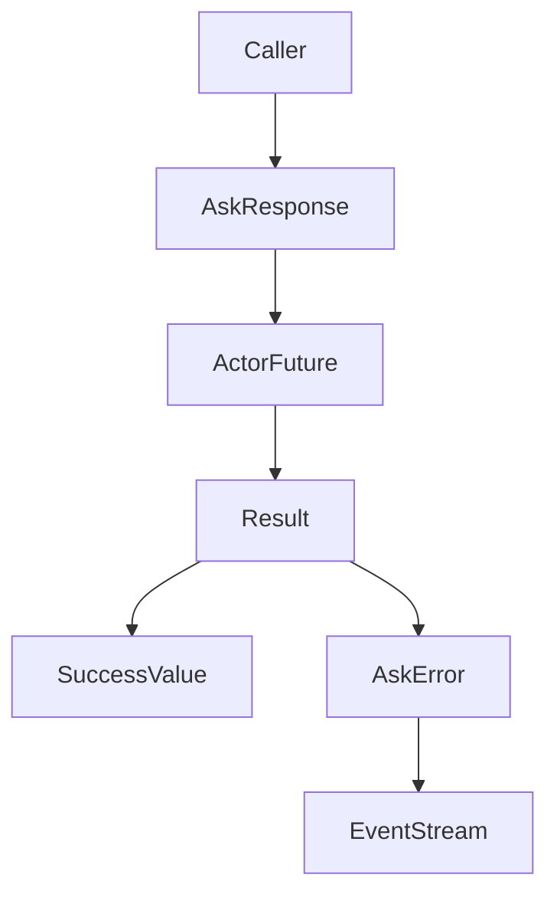
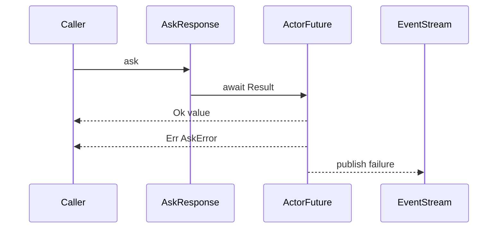

# 設計ドキュメント

## 概要
本機能は ask の結果を `Result` で表現できるように ActorFuture と AskResponse を再設計し、成功と失敗を型で分離する。目的は「失敗がアクターの返信に見えてしまう」状況を解消し、Rust らしいエラーハンドリングを回復することにある。

利用者は ask 応答ハンドルから成功/失敗を明確に取得できる。EventStream による失敗通知は観測経路として維持し、結果の主経路は Result に統一する。

### 目標
- ask 結果を `Result` で表現し、成功/失敗を型で分離する
- タイムアウトや配送不能などの失敗理由を明確化する
- EventStream 通知は維持する

### 非目標
- typed の reply_to モデルの再設計
- ask 以外の Future 全般を一斉に置き換える
- 互換性を保つための旧 API を残す

## アーキテクチャ

### 既存アーキテクチャ分析（必要な場合）
- `AskResponseGeneric` は `AnyMessageGeneric` をそのまま future に保持する
- 失敗は `AnyMessage` として future に流され、成功と区別できない
- cluster 側では `ClusterRequestError` を `AnyMessage` として返す

### Architecture Pattern & Boundary Map（パターンと境界マップ）
**アーキテクチャ統合**
- 選択したパターン: ask 結果を `Result` 化し、成功/失敗を型で分離する
- 境界の切り方: actor/core の ask 生成点で Result を確定し、cluster は変換して利用
- 既存パターンの維持: EventStream は観測経路として維持
- 新規コンポーネントの理由: AskError を追加し失敗理由を統一する
- ステアリング適合: Less is more / YAGNI を守り、最小限の型追加に留める



### Technology Stack & Alignment（技術スタック）

| レイヤ | 選定 / バージョン | 役割 | 備考 |
|-------|------------------|------|------|
| ランタイム / 実行基盤 | fraktor-actor-rs core | ActorFuture / AskResponse | 既存構成を拡張 |
| メッセージング / イベント | AnyMessageGeneric / EventStream | 成功値 / 失敗通知 | 新規依存なし |

## システムフロー

### ask 結果の完了フロー


## 要件トレーサビリティ

| 要件 | 概要 | 対応コンポーネント | インターフェイス | フロー |
|------|------|--------------------|------------------|--------|
| 1.1 | 成功の Result 化 | AskResponseGeneric | future Result | ask 完了フロー |
| 1.2 | 失敗の Result 化 | AskError | error Result | ask 完了フロー |
| 1.3 | 失敗の EventStream 通知 | EventStream | publish | ask 完了フロー |
| 2.1 | 応答ハンドルの Result 化 | AskResponseGeneric | future Result | ask 完了フロー |
| 2.2 | API の曖昧さ排除 | TypedAskResponse | Result 変換 | ask 完了フロー |
| 2.3 | 影響範囲の明示 | design / migration | n/a | n/a |
| 3.1 | タイムアウト失敗表現 | AskError | Timeout | ask 完了フロー |
| 3.2 | 配送不能失敗表現 | AskError | DeadLetter / SendFailed | ask 完了フロー |
| 3.3 | 成功と混同されない表現 | Result | Ok/Err | ask 完了フロー |
| 4.1 | サンプルコード | examples | ask Result | 例示フロー |
| 4.2 | 既存例更新 | examples | ask Result | 例示フロー |

## Components & Interface Contracts（コンポーネントとインターフェイス）

| コンポーネント | ドメイン/層 | 目的 | 要件対応 | 主要依存 (P0/P1) | 契約 |
|---------------|------------|------|----------|------------------|------|
| ActorFuture / AskResponse | Actor Core | ask の Result 化 | 1.1, 1.2, 2.1, 3.3 | AnyMessage(P0) | Service |
| AskError | Actor Core | 失敗理由の統一 | 1.2, 3.1, 3.2 | EventStream(P1) | Service |
| TypedAskResponse | Actor Core Typed | Result への型変換 | 2.2 | AskResponse(P0) | Service |
| Cluster request | Cluster Core | AskError への変換 | 2.1, 3.1, 3.2 | AskResponse(P0) | Service |
| Examples | Examples | Result の利用例 | 4.1, 4.2 | ask API(P0) | API |

### Actor Core

#### ActorFuture / AskResponse

| 項目 | 内容 |
|------|------|
| 目的 | ask 結果を Result として返す |
| 対応要件 | 1.1, 1.2, 2.1, 3.3 |

**責務と制約**
- ask の完了値を `Result` として保持する
- EventStream での失敗通知は維持する
- no_std/std 境界は既存構成を踏襲する

**依存関係**
- Inbound: ActorRef / TypedActorRef — ask 実行（P0）
- Outbound: EventStream — 失敗通知（P1）

**契約**: Service [x] / API [ ] / Event [ ] / Batch [ ] / State [ ]

##### サービスインターフェイス（Rust）
```rust
pub type AskResult<TB> = Result<AnyMessageGeneric<TB>, AskError>;

pub struct AskResponseGeneric<TB: RuntimeToolbox + 'static> {
  // future: ActorFutureSharedGeneric<AskResult<TB>, TB>
}
```
- 前提条件: ask 返信は success または error に分類される
- 事後条件: future は Ok/Err を区別して完了する
- 不変条件: EventStream の失敗通知は維持される

**実装ノート**
- 統合ポイント: `actor_ref::ask`, `TypedActorRef::ask`, `Cluster` の request 系
- バリデーション: 失敗は AskError に変換して Result へ格納
- リスク: 影響範囲が広いので移行点を設計で明記する

#### AskError

| 項目 | 内容 |
|------|------|
| 目的 | ask の失敗理由を統一する |
| 対応要件 | 1.2, 3.1, 3.2 |

**責務と制約**
- タイムアウト / 配送不能 / 送信失敗などを表現
- 成功値とは型で区別される

**依存関係**
- Inbound: ask 実行時の失敗要因（P0）
- Outbound: EventStream への通知（P1）

**契約**: Service [x] / API [ ] / Event [ ] / Batch [ ] / State [ ]

##### サービスインターフェイス（Rust）
```rust
pub enum AskError {
  Timeout,
  DeadLetter,
  SendFailed,
}
```
- 前提条件: 失敗理由は ask の完了時に確定している
- 事後条件: Err として future に格納される

### Actor Core Typed

#### TypedAskResponse

| 項目 | 内容 |
|------|------|
| 目的 | typed ask でも Result を受け取れるようにする |
| 対応要件 | 2.2 |

**責務と制約**
- untyped の AskResult を typed に変換する
- reply_to モデルの設計は変更しない

### Cluster Core

#### Cluster request / Grain request

| 項目 | 内容 |
|------|------|
| 目的 | ClusterRequestError を AskError に変換する |
| 対応要件 | 3.1, 3.2 |

**責務と制約**
- 失敗理由を AskError へ変換し Result に格納
- EventStream への通知は従来通り

## データモデル
変更なし。

## エラーハンドリング

### 方針
- 失敗は `AskError` として Result の Err に格納する
- EventStream は観測経路として失敗通知を維持する

### エラー分類と応答
- タイムアウト: `AskError::Timeout`
- 配送不能: `AskError::DeadLetter`
- 送信失敗: `AskError::SendFailed`

### 監視
- 失敗時の EventStream 通知は従来通り

## テスト戦略

- 単体テスト
  - ask 成功時に Ok が返る
  - タイムアウト時に Err が返る
  - 配送不能時に Err が返る
- 統合テスト
  - cluster の request_future が Result を返す
  - typed ask が Result を返す

## オプション

### マイグレーション
- 破壊的変更であることを明記し、主要 API の影響範囲を一覧化する
- examples と tests の更新を同時に行う
