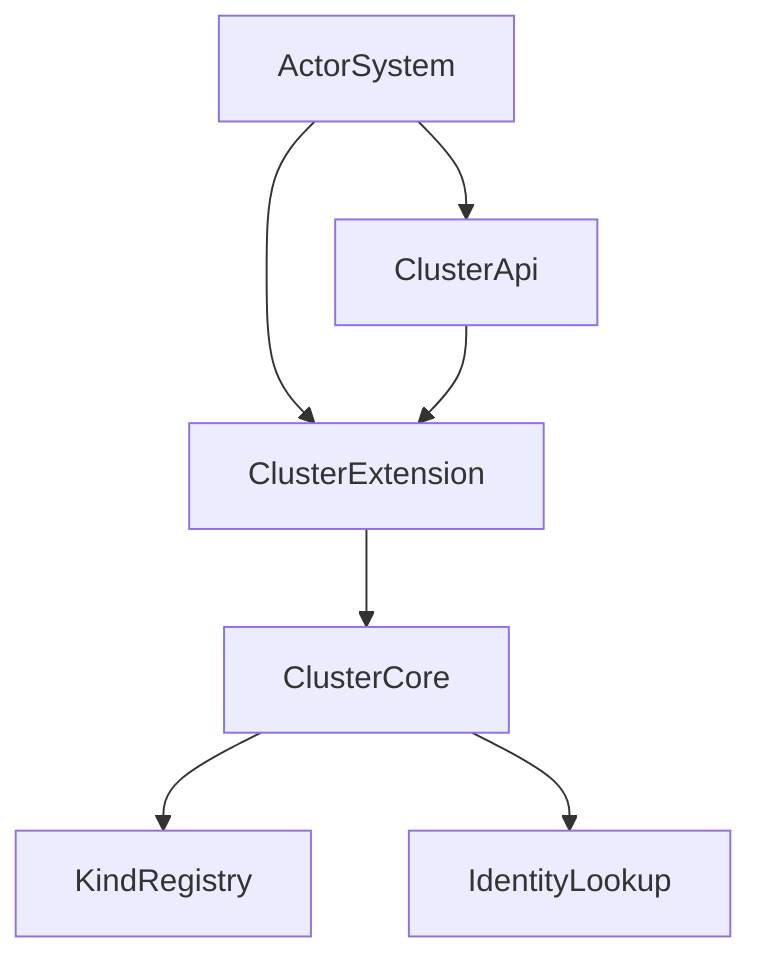
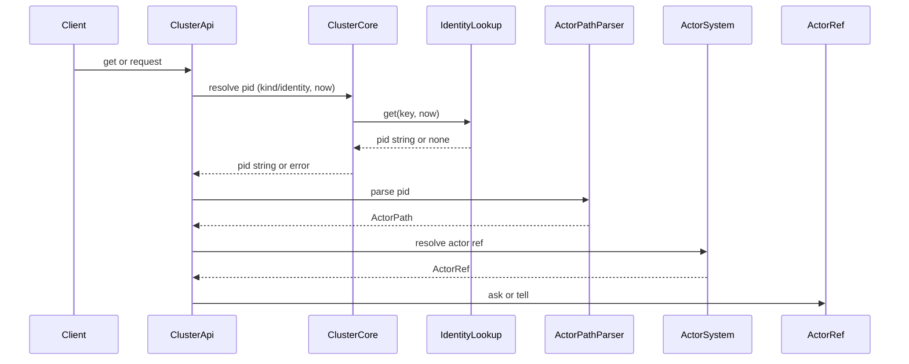
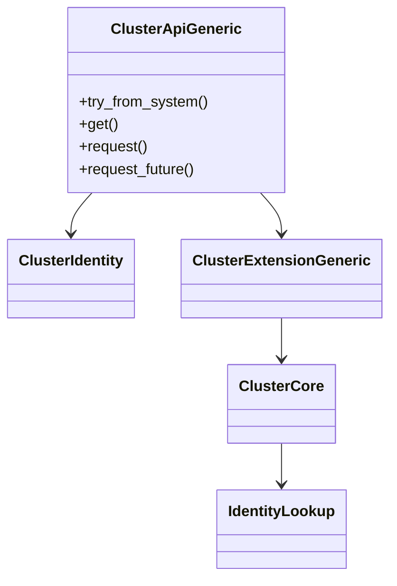

# 設計ドキュメント: cluster-api-identity-model

## 概要
本機能は、クラスタ向けの公開APIとIdentityモデルを定義し、仮想アクターの参照・呼び出しを統一的に提供する。現状の `modules/cluster` は ClusterExtension/KindRegistry/IdentityLookup が部品として存在するため、これらを最小限のAPI層で束ね、ActorSystem から安全に取得可能なクラスタAPIを提供する。

対象ユーザはクラスタ機能を利用するアプリ開発者およびシステム統合者であり、no_std/std 両環境で同一のAPIを利用できることが価値となる。既存の拡張登録・EventStream・Ask基盤を活用し、責務の肥大化を避けた API 境界を追加する。

### 目標 (Goals)
- ClusterIdentity（kind/identity）とキー形式の標準化
- ActorSystem からのクラスタAPI取得と失敗時の明確化
- IdentityLookup と Ask 基盤を用いた Get/Request/RequestFuture の提供

### 非目標 (Non-Goals)
- 分散アクティベーション（Placement/Lock/Storage）本体の実装
- Gossip/MemberList/PubSub の分散運用の実装
- `.proto`/ワイヤ互換の導入

## アーキテクチャ

### 既存アーキテクチャの把握
- `modules/cluster/src/core` は no_std 前提で `ClusterExtensionGeneric` と `ClusterCore` を提供
- ActorSystem 拡張取得は `ExtendedActorSystemGeneric::extension/register_extension` が提供
- Ask 基盤は `ActorRefGeneric::ask` と `AskResponseGeneric` で利用可能
- 1ファイル1公開型/`tests.rs`分離/`cfg-std-forbid` により構造制約が強い

### ハイレベルアーキテクチャ
新規追加は **Cluster API 層** と **ClusterIdentity** のみとし、既存の ClusterExtension/KindRegistry/IdentityLookup をそのまま利用する。



### 技術スタック / 設計判断
- **新規依存なし**: 既存の `fraktor-actor-rs::core` と `fraktor-utils-rs` のみを利用
- **no_std ファースト**: 新規APIは `modules/cluster/src/core` に配置し、std 側は補助のみ

#### 主要設計判断
- **Decision**: Cluster API を `ClusterExtension` に直結せず、`ClusterApiGeneric` を新設する  
  **Context**: 既存拡張は起動・イベント管理が中心で、API肥大化を避けたい  
  **Alternatives**: 1) ClusterExtensionに直接API追加 2) ClusterApi新設  
  **Selected Approach**: 2) ClusterApi新設 + Extensionは取得導線のみ  
  **Rationale**: 単一責務と将来拡張性  
  **Trade-offs**: APIファイルが増える

## システムフロー

### Get/Request の基本フロー


### PIDフォーマットと解決
- IdentityLookup が返す PID 文字列は `authority::path` 形式とする。
- `authority` は `host:port`、`path` は `kind/identity`（例: `user/echo`）。
- ClusterApi は `authority` と `path` を分割し、`fraktor.tcp://cellactor@{authority}/{path}` を構築して `ActorPathParser::parse` する。
- `ActorSystemGeneric::resolve_actor_ref` により ActorRef を解決し、失敗時は `ClusterResolveError` に変換する。

### 起動状態判定
- `ClusterCore` の `mode` が `None` の場合は未起動とみなし、`ClusterResolveError::ClusterNotStarted` を返す。

### 補足決定事項
- `now` は `RuntimeToolbox::clock()` のモノトニック時刻から秒単位に変換して供給する。
- `ClusterApiGeneric` は `ActorSystemGeneric` を強参照で保持する前提とする。

## API ブループリント

### 型・トレイト一覧
- `ClusterIdentity`（pub）
- `ClusterIdentityError`（pub）
- `ClusterApiGeneric<TB>`（pub）
- `ClusterApiError`（pub）
- `ClusterResolveError`（pub）
- `ClusterRequestError`（pub）

### シグネチャ スケッチ
```rust
pub struct ClusterIdentity {
  kind: String,
  identity: String,
}

pub enum ClusterIdentityError {
  EmptyKind,
  EmptyIdentity,
}

impl ClusterIdentity {
  pub fn new(kind: impl Into<String>, identity: impl Into<String>) -> Result<Self, ClusterIdentityError>;
  pub fn kind(&self) -> &str;
  pub fn identity(&self) -> &str;
  pub fn key(&self) -> GrainKey;
}

pub struct ClusterApiGeneric<TB: RuntimeToolbox + 'static> {
  system: ActorSystemGeneric<TB>,
  extension: ArcShared<ClusterExtensionGeneric<TB>>,
}

impl<TB: RuntimeToolbox + 'static> ClusterApiGeneric<TB> {
  pub fn try_from_system(system: &ActorSystemGeneric<TB>) -> Result<Self, ClusterApiError>;
  pub fn get(&self, identity: &ClusterIdentity) -> Result<ActorRefGeneric<TB>, ClusterResolveError>;
  pub fn request(&self, identity: &ClusterIdentity, message: AnyMessageGeneric<TB>, timeout: Option<Duration>)
    -> Result<AskResponseGeneric<TB>, ClusterRequestError>;
  pub fn request_future(&self, identity: &ClusterIdentity, message: AnyMessageGeneric<TB>, timeout: Option<Duration>)
    -> Result<ActorFutureSharedGeneric<AnyMessageGeneric<TB>, TB>, ClusterRequestError>;
}

impl<TB: RuntimeToolbox + 'static> ClusterExtensionGeneric<TB> {
  pub(crate) fn core_shared(&self) -> ArcShared<ToolboxMutex<ClusterCore<TB>, TB>>;
}

impl<TB: RuntimeToolbox + 'static> ClusterCore<TB> {
  pub fn mode(&self) -> Option<StartupMode>;
  pub fn is_kind_registered(&self, kind: &str) -> bool;
  pub fn resolve_pid(&mut self, key: &GrainKey, now: u64) -> Option<String>;
}
```

## クラス／モジュール図


## クイックスタート / 利用例
```rust
fn cluster_api_usage(system: &ActorSystemGeneric<NoStdToolbox>) {
  let api = ClusterApiGeneric::try_from_system(system).unwrap();
  let id = ClusterIdentity::new("hello", "abc").unwrap();
  let response = api.request(&id, AnyMessageGeneric::new(HelloRequest {}), None).unwrap();
  let _future = response.future();
}
```

## 旧→新 API 対応表

| 旧 API / 型 | 新 API / 型 | 置換手順 | 備考 |
| --- | --- | --- | --- |
| なし | `ClusterApiGeneric` | ActorSystem から取得して利用 | 新規追加 |

## 要件トレーサビリティ

| 要件ID | 要約 | 実装コンポーネント | インターフェイス | 参照フロー |
| --- | --- | --- | --- | --- |
| 1.1 | Identity生成と保持 | ClusterIdentity | new/kind/identity | sequence#get |
| 1.2 | key形式 | ClusterIdentity | key | - |
| 1.3 | 空文字禁止 | ClusterIdentity | new | - |
| 1.4 | 同一性判定 | ClusterIdentity | Eq/Hash | - |
| 2.1 | 拡張取得 | ClusterApiGeneric | try_from_system | - |
| 2.2 | 同一拡張 | ClusterApiGeneric | try_from_system | - |
| 2.3 | 未導入の失敗 | ClusterApiError | try_from_system | - |
| 3.1 | kind登録反映 | ClusterCore | setup_member_kinds | - |
| 3.2 | kind登録反映 | ClusterCore | setup_client_kinds | - |
| 3.3 | 未登録kind失敗 | ClusterApiGeneric | get/request | - |
| 4.1 | PID解決 | ClusterApiGeneric | get | sequence#get |
| 4.2 | 解決不能 | ClusterResolveError | get | - |
| 4.3 | 未起動時失敗 | ClusterResolveError | get | - |
| 5.1 | Request送信 | ClusterApiGeneric | request | sequence#get |
| 5.2 | 解決失敗時 | ClusterRequestError | request | - |
| 5.3 | タイムアウト | ClusterRequestError | request/request_future | - |
| 5.4 | 非同期ハンドル | ClusterApiGeneric | request_future | - |
| 6.1 | no_std整合 | cluster/core | 全API | - |
| 6.2 | std拡張 | cluster/std | 追加ヘルパ | - |

## コンポーネント & インターフェイス

### Cluster API 層
- **責務**: ActorSystem からの取得、Identity解決、Ask送信
- **入出力**: `ClusterIdentity` → `ActorRefGeneric` / `AskResponseGeneric`
- **依存**: `ClusterExtensionGeneric`, `ClusterCore`, `IdentityLookup`, `ActorSystemGeneric`
- **外部依存**: なし

#### 契約定義
**Component Interface**
```rust
pub trait ClusterApi<TB: RuntimeToolbox + 'static> {
  fn get(&self, identity: &ClusterIdentity) -> Result<ActorRefGeneric<TB>, ClusterResolveError>;
  fn request(&self, identity: &ClusterIdentity, message: AnyMessageGeneric<TB>, timeout: Option<Duration>)
    -> Result<AskResponseGeneric<TB>, ClusterRequestError>;
}
```
- 前提条件: クラスタ拡張が登録済みである
- 事後条件: 成功時に ActorRef/AskResponse が返る
- 不変条件: Identity の key 形式は `kind/identity` を保持

### Identityモデル
- **責務**: kind/identity の正規化とキー生成
- **入出力**: `String` → `ClusterIdentity`
- **依存**: `GrainKey` 生成のみ
- **外部依存**: なし

### ClusterCore/IdentityLookup 連携
- **責務**: kind登録、起動状態の保持、IdentityLookup の初期化と PID 解決
- **入出力**: `ActivatedKind` の集合
- **依存**: `KindRegistry`, `IdentityLookup`
- **外部依存**: なし

## データモデル

### 論理データモデル
- `ClusterIdentity` = `{ kind: String, identity: String }`
- `GrainKey` = `kind/identity` の文字列

### データ契約 / 連携
- `ClusterIdentity::key()` は常に `kind/identity` 形式を返す
- IdentityLookup の PID 文字列は `authority::path` 形式とする

## エラーハンドリング

### エラーストラテジ
- 回復可能な失敗は `Result` で返す
- 事前検証で空文字や未起動を即時検出

### エラー分類と応答
- `ClusterIdentityError`: 空文字など入力不正
- `ClusterApiError`: 拡張未登録
- `ClusterResolveError`: 未起動、kind未登録、IdentityLookup失敗、PID形式不正、ActorRef解決失敗
- `ClusterRequestError`: 解決失敗、送信失敗、タイムアウト

### モニタリング
- 失敗は `Result` で返し、EventStream への通知は行わない（必要になれば追加）

## テスト戦略
- **ユニットテスト**: `cluster_identity/tests.rs`（空文字・key生成）
- **ユニットテスト**: `cluster_api/tests.rs`（未登録/未起動/未登録kind/PID形式不正）
- **統合テスト**: ActorSystem 拡張取得と request フロー（最小1件）

## 追加セクション（必要時のみ）

### パフォーマンス & スケーラビリティ
- 追加APIは薄いラッパに留め、ホットパスは IdentityLookup と Ask 基盤に委譲する
