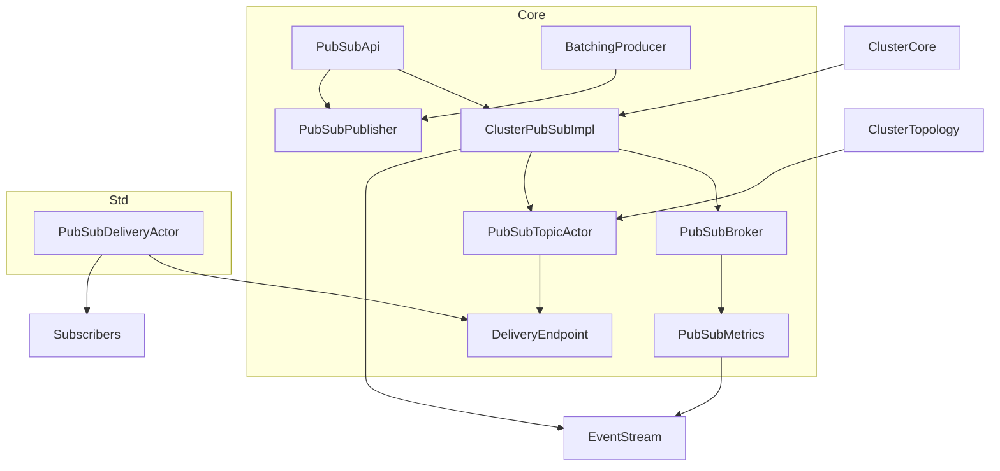
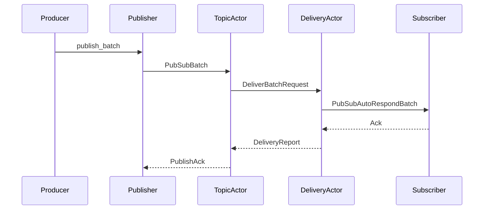

# distributed-pubsub 設計

## 概要
分散 PubSub をクラスタ拡張として提供し、トピック単位の購読/配送を no_std/std 共通 API で実現する。公開 API は Producer/Publisher を含み、受理/拒否結果とバッチ配送条件を明示する。配送はノード単位に束ね、トポロジ更新に追従しながらローカル購読者への配送を維持する。

既存の `PubSubBroker` と EventStream を維持しつつ、Topic アクターとノード配送アクターを追加する。これにより、既存の cluster 拡張ポイントと観測パイプラインを温存したまま、分散配送・バッチ・観測性の要件を満たす。

### 目標
- トピック購読/解除/公開の API を提供し、未購読への配送を禁止する。
- バッチ条件（サイズ/待機時間）で配送を制御し、バッチなしの個別配送も維持する。
- 公開 API は受理/拒否と拒否理由を返し、受理時に配送開始を保証する。
- トポロジ更新に追従し、到達不能ノードへの配送を停止しつつローカル配送を継続する。
- EventStream とメトリクスで観測性を一貫して提供する。

### 非目標
- Exactly-once 配送や永続キューの提供
- 複数クラスタ間のフェデレーション
- コンテンツベースのフィルタリング
- PubSub 状態の永続化

## 要件トレーサビリティ

| 要件 | 概要 | 対応コンポーネント | インターフェイス | フロー |
|------|------|--------------------|------------------|--------|
| 1.1, 1.2, 1.3, 1.4, 1.5 | 購読/解除/送達の正当性 | PubSubApiGeneric, PubSubBroker, PubSubTopicActor, PubSubDeliveryActor | subscribe/unsubscribe/publish, PubSubEvent | 購読更新, Publish 配送 |
| 2.1, 2.2, 2.3, 2.4 | バッチ条件と個別配送 | BatchingProducer, PubSubPublisher, PubSubDeliveryActor | produce/publish_batch | バッチ集約/配送 |
| 3.1, 3.2, 3.3, 3.4 | 受理/拒否と公開制御 | PubSubApiGeneric, PubSubPublisher | PublishAck, PublishOptions | Publish API |
| 4.1, 4.2, 4.3, 4.4 | トポロジ追従と到達不能停止 | PubSubTopicActor, ClusterEvent, PubSubDeliveryActor | ClusterTopology 更新 | トポロジ更新 |
| 5.1, 5.2, 5.3, 5.4, 5.5 | 観測性とメトリクス | PubSubBroker, PubSubTopicActor, PubSubDeliveryActor | PubSubEvent, PubSubMetrics | EventStream 発火 |
| 6.1, 6.2 | no_std/std 共通 API | core 公開型, std 実装 | RuntimeToolbox | API 境界 |

## アーキテクチャ

### 既存アーキテクチャ分析（必要な場合）
- `ClusterPubSub` は start/stop のみで、公開 API と分散配送の実体が不足している。
- `PubSubBroker` は購読集合とメトリクスのみを管理し、配送は担当していない。
- `ClusterEvent::TopologyUpdated` などのトポロジイベントは EventStream で取得できる。
- core/no_std と std の分離が強制されており、pubsub も同じ境界を守る必要がある。

### Architecture Pattern & Boundary Map
**Summary**: Topic アクター + 配送エンドポイントの 2 層で配送し、Broker は購読/メトリクスに限定する。  
**Scope**: core は API/状態/イベントと配送トレイト、std は配送実装と実行基盤・I/O のみ。  
**Decisions**: Option C を採用し、既存 Broker/EventStream を維持しつつ配送層を分離する。  
**Impacts/Risks**: トポロジの最終的整合性により一時的な配送漏れが起こり得る。



### Technology Stack & Alignment

| レイヤ | 選定 / バージョン | 役割 | 備考 |
|-------|------------------|------|------|
| ランタイム / 実行基盤 | fraktor-actor-rs core/std | ActorSystem/スケジューラ/タイマ | 既存基盤を維持 |
| メッセージング / イベント | EventStream, AnyMessageGeneric | PubSub イベントと配送ペイロード | 既存 |
| クラスタ / トポロジ | ClusterEvent, ClusterTopology | ルーティング更新 | 既存 |
| 監視 / メトリクス | PubSubMetrics, PubSubEvent | 観測イベント/メトリクス | 既存拡張 |
| 互換性 / シリアライズ | MessageSerializer, SerializationRegistry | バッチ配送/互換性 | 既存 |

## システムフロー



## Components & Interface Contracts

| コンポーネント | ドメイン/層 | 目的 | 要件対応 | 主要依存 (P0/P1) | 契約 |
|---------------|------------|------|----------|------------------|------|
| PubSubApiGeneric | Core | 公開 API を提供 | 1.1-1.5, 2.1-2.4, 3.1-3.4, 6.1-6.2 | ClusterPubSubShared(P0), PubSubPublisher(P0) | API |
| ClusterPubSubImpl | Core | PubSub サブシステム制御 | 1.1-1.5, 4.1-4.4, 5.1-5.5 | PubSubBroker(P0), PubSubTopicActor(P0), EventStream(P0) | Service |
| PubSubBroker | Core | 購読集合とメトリクス | 1.1-1.5, 5.4-5.5 | PubSubEvent(P0) | State |
| PubSubTopicActor | Core | トピック単位配送とトポロジ追従 | 1.3, 1.5, 4.1-4.4, 5.2-5.4 | ClusterTopology(P0), DeliveryEndpoint(P0) | Event |
| DeliveryEndpoint | Core | 配送トレイト境界 | 2.1-2.4, 4.2, 5.2-5.3 | PubSubConfig(P0) | Service |
| PubSubDeliveryActor | Std | ノード内配送と失敗判定 | 2.1-2.4, 4.2, 5.2-5.3 | ActorRef(P0), Scheduler(P1) | Batch |
| PubSubPublisher | Core | Publish/Batch API の実体 | 2.1-2.4, 3.1-3.4 | ClusterApi(P0) | API |
| BatchingProducer | Core | バッチ集約と backpressure | 2.1-2.4, 3.1, 3.3 | PubSubPublisher(P0), Scheduler(P1) | Batch |

### 共通データ型

```rust
pub struct PubSubTopic(String);

pub enum PubSubSubscriber<TB: RuntimeToolbox> {
  ActorRef(ActorRefGeneric<TB>),
  ClusterIdentity(ClusterIdentity),
}

pub struct PublishOptions {
  pub delivery_policy: Option<DeliveryPolicy>,
  pub partition_behavior: Option<PartitionBehavior>,
}

pub struct PublishRequest<TB: RuntimeToolbox> {
  pub topic: PubSubTopic,
  pub payload: AnyMessageGeneric<TB>,
  pub options: PublishOptions,
}

pub enum PublishStatus {
  Accepted,
  Rejected,
}

pub enum PublishRejectReason {
  InvalidTopic,
  InvalidPayload,
  NotSerializable,
  QueueFull,
  NoSubscribers,
  PartitionDrop,
}

pub struct PublishAck {
  pub status: PublishStatus,
  pub reason: Option<PublishRejectReason>,
}

pub struct PubSubTopicOptions {
  pub delivery_policy: DeliveryPolicy,
  pub partition_behavior: PartitionBehavior,
}

pub struct PubSubConfig {
  pub subscriber_timeout: Duration,
  pub suspended_ttl: Duration,
}

pub struct DeliverBatchRequest<TB: RuntimeToolbox> {
  pub topic: PubSubTopic,
  pub batch: PubSubBatch,
  pub subscribers: Vec<PubSubSubscriber<TB>>,
  pub options: PubSubTopicOptions,
}

pub enum DeliveryStatus {
  Delivered,
  Timeout,
  SubscriberUnreachable,
  OtherError,
}

pub struct SubscriberDeliveryReport<TB: RuntimeToolbox> {
  pub subscriber: PubSubSubscriber<TB>,
  pub status: DeliveryStatus,
}

pub struct DeliveryReport<TB: RuntimeToolbox> {
  pub status: DeliveryStatus,
  pub failed: Vec<SubscriberDeliveryReport<TB>>,
}

pub struct DeliveryEndpointSharedGeneric<TB: RuntimeToolbox> {
  pub inner: ArcShared<ToolboxMutex<Box<dyn DeliveryEndpoint<TB>>, TB>>,
}

pub struct PubSubAutoRespondBatch<TB: RuntimeToolbox> {
  pub messages: Vec<AnyMessageGeneric<TB>>,
}

pub struct PubSubEnvelope {
  pub serializer_id: u32,
  pub type_name: String,
  pub bytes: Vec<u8>,
}

pub struct PubSubBatch {
  pub envelopes: Vec<PubSubEnvelope>,
}

pub enum SubscriberState {
  Active,
  Suspended { reason: String },
}
```
**PublishOptions の適用ルール**
- PublishOptions は publish 単位の上書きであり、topic の既定値は変更しない
- 優先順位は `publish の override > topic 既定値 > システム既定値`
- バッチの有無は API 選択（publish / publish_batch / BatchingProducer）で表現する
- システム既定値は `DeliveryPolicy::AtLeastOnce` と `PartitionBehavior::DelayQueue`

### Core

#### PubSubApiGeneric

| 項目 | 内容 |
|------|------|
| 目的 | 公開 API を提供し、受理/拒否と理由を返す |
| 対応要件 | 1.1-1.5, 2.1-2.4, 3.1-3.4, 6.1-6.2 |

**責務と制約**
- 購読/解除/公開の入力検証と `PublishAck` 返却
- `ClusterPubSubShared` への委譲でスレッドセーフな API を提供
- no_std で利用できること

**依存関係**
- Inbound: アプリケーションコード — PubSub 操作（P0）
- Outbound: ClusterPubSubShared — 実処理（P0）
- Outbound: PubSubPublisher — Publish/Batch 経路（P0）

**契約**: API [x] / Service [ ] / Event [ ] / Batch [ ] / State [ ]

##### サービスインターフェイス（Rust）
```rust
pub struct PubSubApiGeneric<TB: RuntimeToolbox + 'static> { /* ... */ }

impl<TB: RuntimeToolbox + 'static> PubSubApiGeneric<TB> {
  pub fn subscribe(
    &self,
    topic: &PubSubTopic,
    subscriber: PubSubSubscriber<TB>,
  ) -> Result<(), PubSubError>;

  pub fn unsubscribe(
    &self,
    topic: &PubSubTopic,
    subscriber: PubSubSubscriber<TB>,
  ) -> Result<(), PubSubError>;

  pub fn publish(&self, request: PublishRequest<TB>) -> Result<PublishAck, PubSubError>;

  pub fn publisher(&self) -> PubSubPublisherGeneric<TB>;
  pub fn batching_producer(&self, topic: PubSubTopic, config: BatchingProducerConfig) -> BatchingProducerGeneric<TB>;
}
```
- 前提条件: Cluster 拡張が起動済み、topic が空でない
- 事後条件: 成功時は PubSubEvent を発火
- 不変条件: 未購読への配送は禁止

#### ClusterPubSubImpl

| 項目 | 内容 |
|------|------|
| 目的 | PubSub サブシステムの起動と制御 |
| 対応要件 | 1.1-1.5, 4.1-4.4, 5.1-5.5 |

**責務と制約**
- TopicActorKind の登録確認と起動
- Broker で購読/メトリクスを管理し、EventStream に発火
- トポロジ更新イベントの受信と TopicActor への配布
- `ClusterExtensionConfig` から `PubSubConfig` を取得し、`subscriber_timeout` と `suspended_ttl` を配送側へ伝播する

**依存関係**
- Inbound: ClusterCore — start/stop（P0）
- Inbound: ClusterExtensionConfig — PubSubConfig 取得（P0）
- Outbound: PubSubBroker — 購読/メトリクス（P0）
- Outbound: PubSubTopicActor — 配送（P0）
- External: EventStream — 観測（P0）

**契約**: Service [x] / API [ ] / Event [ ] / Batch [ ] / State [ ]

##### サービスインターフェイス（Rust）
```rust
pub trait ClusterPubSub<TB: RuntimeToolbox>: Send + Sync {
  fn start(&mut self) -> Result<(), PubSubError>;
  fn stop(&mut self) -> Result<(), PubSubError>;
  fn subscribe(&mut self, topic: &PubSubTopic, subscriber: PubSubSubscriber<TB>) -> Result<(), PubSubError>;
  fn unsubscribe(&mut self, topic: &PubSubTopic, subscriber: PubSubSubscriber<TB>) -> Result<(), PubSubError>;
  fn publish(&mut self, request: PublishRequest<TB>) -> Result<PublishAck, PubSubError>;
}
```
- 前提条件: start 済み
- 事後条件: 成功時は PubSubEvent/ClusterEvent を発火
- 不変条件: TopicActorKind が未登録なら起動失敗

#### PubSubBroker

| 項目 | 内容 |
|------|------|
| 目的 | トピック/購読/メトリクスの保持 |
| 対応要件 | 1.1-1.5, 5.4-5.5 |

**責務と制約**
- トピックの作成と購読集合の管理
- Topic 作成時の `PubSubTopicOptions` を保持し、publish 時の既定値として参照される
- メトリクスの集計とスナップショット

**依存関係**
- Inbound: ClusterPubSubImpl — 状態操作（P0）
- Outbound: PubSubEvent — EventStream 通知（P0）

**契約**: State [x] / Service [ ] / API [ ] / Event [ ] / Batch [ ]

#### PubSubTopicActor

| 項目 | 内容 |
|------|------|
| 目的 | トピック単位の購読と配送ルーティング |
| 対応要件 | 1.3, 1.5, 4.1-4.4, 5.2-5.4 |

**責務と制約**
- 購読者をノード単位にグルーピングして配送
- Topology 更新で到達不能ノードを除外
- 配送失敗の購読者は `Suspended` として保持し、再参加時に再評価する
- 失敗購読者の除去・復帰を EventStream で観測できるようにする
- TopologyUpdated で `SubscriberState` を再評価し、再参加ノードに属する購読者は `Active` へ復帰させる
- `Suspended` が TTL を超えた場合は `SubscriptionRemoved` を発火して削除する

**依存関係**
- Inbound: PubSubPublisher — Publish 要求（P0）
- Inbound: EventStream — トポロジ更新（P0）
- Outbound: DeliveryEndpoint — ノード内配送（P0）

**契約**: Event [x] / State [x] / Service [ ] / API [ ] / Batch [ ]

##### イベント契約
- 発行イベント: PubSubEvent::PublishAccepted, PubSubEvent::DeliveryFailed, PubSubEvent::SubscriptionRemoved
- 購読イベント: ClusterEvent::TopologyUpdated
- 並び順 / 配送保証: トピック単位で順序保証はしない（バッチ単位で順序保持）

#### DeliveryEndpoint

| 項目 | 内容 |
|------|------|
| 目的 | 配送の実装境界を std へ委譲する |
| 対応要件 | 2.1-2.4, 4.2, 5.2-5.3 |

**責務と制約**
- TopicActor からの配信要求を受け取り、購読者へ送達する
- no_std では最小実装（ローカル配送）を提供する
- std では PubSubDeliveryActor を通して実装する
- TopicActor は `DeliveryEndpointSharedGeneric<TB>` を保持し、共有が必要な場合は `ArcShared<ToolboxMutex<Box<dyn DeliveryEndpoint<TB>>>>` で包む
- `PubSubBatch` をデシリアライズし、購読者には `PubSubAutoRespondBatch` を送達する

**依存関係**
- Inbound: PubSubTopicActor — DeliverBatchRequest（P0）
- Outbound: ActorRefGeneric — 送達（P0）
- Outbound: Scheduler — タイムアウト（P1）

**契約**: Service [x] / Batch [ ] / Event [ ] / API [ ] / State [ ]

##### サービスインターフェイス（Rust）
```rust
pub trait DeliveryEndpoint<TB: RuntimeToolbox> {
  fn deliver(
    &mut self,
    request: DeliverBatchRequest<TB>,
  ) -> Result<DeliveryReport<TB>, PubSubError>;
}
```

#### PubSubPublisher

| 項目 | 内容 |
|------|------|
| 目的 | Publish API を提供し TopicActor へ転送 |
| 対応要件 | 2.1-2.4, 3.1-3.4 |

**責務と制約**
- Publish/Batch の受理判定と TopicActor 呼び出し
- 受理/拒否の `PublishAck` を返す
- `SerializationRegistry` を使い `AnyMessageGeneric` を `PubSubBatch` に変換する
- `PublishOptions` を topic 既定値とマージし、優先順位 `publish > topic > system` で適用する
- publish の結果は原則 `PublishAck` で返し、`PubSubError` は起動前や内部不整合などのシステム障害に限定する

**依存関係**
- Inbound: PubSubApiGeneric/BatchingProducer — publish（P0）
- Outbound: ClusterApiGeneric — TopicActor への Request（P0）

**契約**: API [x] / Service [ ] / Event [ ] / Batch [ ] / State [ ]

##### サービスインターフェイス（Rust）
```rust
pub struct PubSubPublisherGeneric<TB: RuntimeToolbox + 'static> { /* ... */ }

impl<TB: RuntimeToolbox + 'static> PubSubPublisherGeneric<TB> {
  pub fn publish(&self, request: PublishRequest<TB>) -> Result<PublishAck, PubSubError>;
  pub fn publish_batch(&self, topic: &PubSubTopic, batch: PubSubBatch) -> Result<PublishAck, PubSubError>;
}
```
- 前提条件: topic が有効、payload がシリアライズ可能
- 事後条件: 受理時は配送開始
- 不変条件: 受理なしで配送を開始しない

### Std

#### PubSubDeliveryActor

| 項目 | 内容 |
|------|------|
| 目的 | ノード内配送と失敗分類 |
| 対応要件 | 2.1-2.4, 4.2, 5.2-5.3 |

**責務と制約**
- 購読者へ `PubSubAutoRespondBatch` を送信
- 配送タイムアウトで失敗分類し TopicActor へ報告
- 失敗は EventStream へ発火
- `PubSubConfig.subscriber_timeout` をタイムアウト判定に使用する
- `DeliveryEndpoint` を実装し、std の配送を提供する

**依存関係**
- Inbound: PubSubTopicActor — DeliverBatchRequest（P0）
- Outbound: ActorRefGeneric — 送達（P0）
- Outbound: Scheduler — タイムアウト（P1）

**契約**: Batch [x] / Event [x] / Service [ ] / API [ ] / State [ ]

### Core

#### BatchingProducer

| 項目 | 内容 |
|------|------|
| 目的 | バッチ集約と backpressure |
| 対応要件 | 2.1-2.4, 3.1, 3.3 |

**責務と制約**
- バッチサイズまたは待機時間でフラッシュ
- キュー上限時は PublishRejectReason::QueueFull を返す
- 停止時に残キューを明示的に破棄または送信する
- `modules/utils` のキュー実装を使用し、独自キューは持たない

**依存関係**
- Inbound: アプリケーション — produce（P0）
- Outbound: PubSubPublisher — publish_batch（P0）
- Outbound: Scheduler — 時間条件（P1）

**契約**: Batch [x] / API [ ] / Event [ ] / Service [ ] / State [ ]

##### バッチ/ジョブ契約
- トリガ: バッチサイズ到達または待機時間満了
- 入力/検証: 受理済みメッセージのみバッチ化
- 出力/宛先: PubSubPublisher の publish_batch
- 冪等性/回復: PublishAck を返し、再送は呼び出し側に委ねる

## データモデル

### ドメインモデル
- 集約: Topic
- エンティティ: TopicEntry（購読者集合/配送ポリシー）
- 値オブジェクト: PubSubTopic, PubSubSubscriber
- ドメインイベント: PublishAccepted, DeliveryFailed, SubscriptionChanged

### 論理データモデル
- `topics: Map<PubSubTopic, TopicEntry>`
- `TopicEntry.subscriber_state: Map<PubSubSubscriber, SubscriberState>`
- `TopicEntry.default_policy: DeliveryPolicy`
- `TopicEntry.default_partition_behavior: PartitionBehavior`
- `metrics: PubSubMetrics`, `topic_metrics: Map<PubSubTopic, PubSubTopicMetrics>`
  - `Active` の購読者集合は `subscriber_state` から導出する

### データ契約と連携
- バッチ配送: `PubSubBatch` は `PubSubEnvelope` の配列（`SerializationRegistry` で生成）
- Publish 受理時にシリアライズ不可なら `PublishRejectReason::NotSerializable` を返す
- イベントスキーマ: `PubSubEvent` を EventStream に発行し、バージョニングは enum 追加で対応

## エラーハンドリング

### 方針
- 回復可能エラーは `PubSubError` と `PublishAck` で表現する。
- 受理/拒否は `PublishAck` を返し、システム障害は `PubSubError` を返す。

### エラー分類と応答
**入力系**: 無効 topic/payload → `PublishRejectReason` で拒否  
**入力系**: シリアライズ不可 → `PublishRejectReason::NotSerializable`  
**システム系**: 起動前/配送タイムアウト → `PubSubError` と EventStream 通知  
**ビジネス系**: 未購読/重複購読 → subscribe/unsubscribe は `PubSubError`、publish は `PublishRejectReason` で返す  

### 監視
- Publish 受理/拒否、配送成功/失敗、購読追加/削除を EventStream へ発火
- メトリクスは `PubSubMetrics` と Topic 別スナップショットを発行

## テスト戦略
- 単体テスト: Broker の subscribe/unsubscribe、Publish 拒否理由、メトリクス集計
- 単体テスト: TopicActor のノード別配送とトポロジ更新
- 単体テスト: DeliveryActor のタイムアウトと失敗分類
- 統合テスト: Cluster 起動/停止時の PubSub ライフサイクル
- no_std/std 差分: core API の互換性と std 実装の一貫性

## オプション（必要な場合のみ）

### 性能/スケーラビリティ
- バッチサイズと待機時間は `BatchingProducerConfig` で調整可能
- ノード単位の配送によりネットワーク送信を削減
