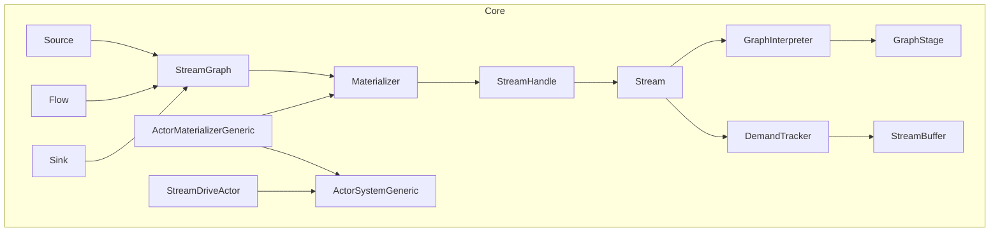
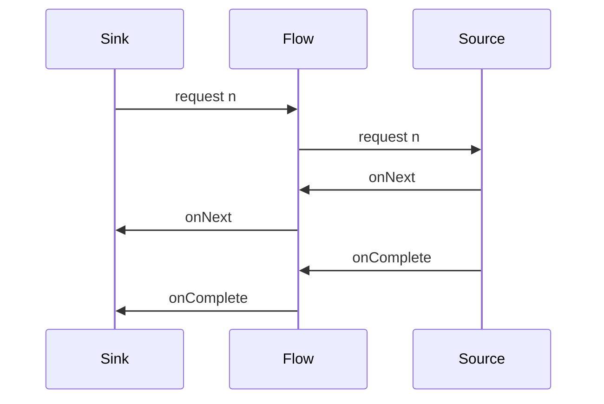
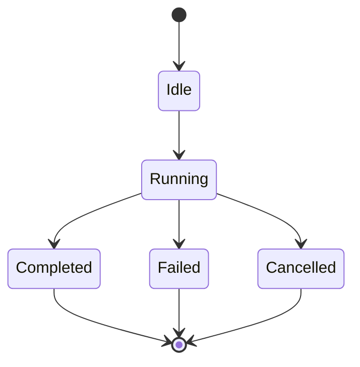

# 設計ドキュメント: fraktor-streams

## 概要
fraktor-streams は fraktor-rs にストリーム処理の最小コアを追加し、no_std でも利用できる Source/Flow/Sink と Materializer を提供する。需要伝播とバックプレッシャの契約を明文化し、実行モデルを core(no_std) に集約して streams の std 実装を持たないことで、埋め込み環境とホスト環境の両方で一貫したストリーム API を実現する。std 環境では ActorSystem 上で core 実装を動かし、remote/cluster の有効/無効に影響されない設計を採用する。

利用者は no_std 環境では手動駆動または外部実行器による進行を選択でき、ActorSystem 連携は core に置く ActorMaterializerGeneric が担う。ActorMaterializerGeneric は fraktor-actor core の ActorSystemGeneric<TB> と統合し、std 環境でも同一の型を利用する。ActorSystem が remote/cluster を有効化していても、同じ契約でストリームを実行できる。ストリームの合成とマテリアライズ値の規則を固定し、完了・失敗・キャンセルの伝播を観測可能な契約として定義する。

影響範囲は新規クレート `fraktor-streams-rs`（`modules/streams`）に限定し、既存の actor/remote/cluster と責務を分離する。ActorSystem との統合は core 側の ActorMaterializerGeneric が担い、std は追加の API を持たない。actor/core から streams/core への依存は禁止し、DSL/Graph/Stage の公開 API に actor 型を露出しない（ActorMaterializerGeneric は actor core 型を利用する）。

### 目標
- no_std でコンパイル可能なストリームの最小 API を提供する
- Source/Flow/Sink の合成とマテリアライズ値の規則を定義する
- std 環境でも core Materializer で実行統合できる設計にする
- examples で最小構成の利用例を提供できる設計にする
- Materializer の実装を追加できる拡張性を確保する（embedded/WASM など）

### 非目標
- フル機能の Pekko Streams 相当オペレータ群
- Graph DSL や高度な最適化
- ActorSystem 以外の実行基盤（Tokio 単独実行など）
- 分散ストリーム

## アーキテクチャ

### 既存アーキテクチャ分析
- 既存クレートは `core`/`std` 分離だが、streams は core(no_std) に集約し std 実装を作らない。
- 共有所有権は `ArcShared`、同期は `ToolboxMutex` を標準とする。
- バックプレッシャ向けのキューは `modules/utils` の共通実装を必ず再利用する。
- `modules/streams/src/core` のみで実装し、streams の `std` モジュールは作らない。std 環境でも core 実装を利用し、fraktor-actor core を最小限に利用する。
- Materializer の中核ロジックは fraktor-actor の core 実行基盤（Scheduler/TickDriver/Extension など）を再利用する。
- fraktor-actor core への依存は必要最小限に留め、streams/core の独立性を維持する。
- fraktor-actor core から streams/core への依存は発生させない。
- streams の公開 API は fraktor-actor の型を露出しない。

### Pekko 内部設計からの参照ポイント
- DSL 合成は Graph/Shape と traversal の合成で表現される（`Source.via`/`to` が traversal を積み上げる）。
- `StreamLayout`/`Modules` がモジュール木を形成し、`GraphInterpreter` がステージを駆動する。
- `ActorGraphInterpreter` が actor 上で駆動ループを実行する。
- `SystemMaterializer` と guardian が materializer のライフサイクルを管理する。
- `GraphStage` が中核ステージ抽象として `GraphStageLogic` を提供し、処理ロジックは GraphStage を介して実行基盤に接続される。
- `GraphInterpreter` が GraphStageLogic を駆動し、pull/push/complete/error の順序と伝播を制御する。

**設計への反映**
- core の DSL は traversal 合成を軸にし、材料化は ActorSystem 統合側に委譲する。
- core 側の `StreamDriveActor` を `ActorGraphInterpreter` 相当として位置付け、駆動責務を分離する。
- materializer は ActorSystemGeneric<TB> に結び付け、remote/cluster 有効時でも契約を維持する。
- DSL/演算子の整理は Source/Flow/Sink のカテゴリで提供し、Pekko のオペレータ一覧に沿った分類を維持する。
- GraphStage を中核抽象として扱い、DSL/Graph は GraphStage を生成・合成する。
- GraphInterpreter の契約を core で定義し、Stream::drive がその進行を担う。
- Materializer 実装の追加は core の trait を起点に行い、環境別の拡張は fraktor-actor 側のアダプタで補う。

### パターンと境界マップ
**アーキテクチャ統合**
- 選択したパターン: データフロー型（Reactive Streams 準拠の需要伝播）
- 境界の切り方: ストリームコアは `core` に閉じ、実行ブリッジも core + TB に限定（streams の std 実装は作らない）
- 既存パターンの維持: core 集約（streams は std モジュールなし）・ArcShared/ToolboxMutex の共有ラッパ
- 依存方向の不変条件: actor/core → streams/core を禁止し、streams 公開 API に actor 型を露出しない
- 新規コンポーネントの理由: ストリーム処理は actor/remote と異なる責務のため新規クレートで分離
- ステアリング適合: no_std ファースト、Less is more、YAGNI を維持
- 参照実装: `references/pekko/stream` の Source/Flow/Sink/Materializer を最小 API 設計の起点とする
 - 需要伝播の契約: request(n) は n > 0、需要は合算し上限に達した場合は Unbounded とみなす



### 技術スタック

| レイヤ | 選定 / バージョン | 役割 | 備考 |
|-------|------------------|------|------|
| ランタイム / 実行基盤 | no_std core + fraktor-actor ActorSystem | 実行駆動の分離 | std は ActorSystem と統合 |
| クレート / 配置 | fraktor-streams-rs | 独立ストリーム層 | `modules/streams` |
| データ / 永続化 | なし | 対象外 | |
| メッセージング / イベント | `modules/utils` queue | バッファ/需要制御 | OverflowPolicy を利用 |
| 監視 / メトリクス | `EventStream`（将来統合） | 観測接点 | 本フェーズは拡張ポイントのみ |
| 互換性 / シリアライズ | なし | 対象外 | |

## システムフロー

### 需要とデータの伝播


### Stream の状態遷移


## 要件トレーサビリティ

| 要件 | 概要 | 対応コンポーネント | インターフェイス | フロー |
|------|------|--------------------|------------------|--------|
| 1.1 | Source/Flow/Sink 型安全 | StreamGraph, Source, Flow, Sink | StreamStage | 需要とデータ伝播 |
| 1.2 | 型不一致の拒否 | StreamGraph | StreamGraph::connect | - |
| 1.3 | 接続関係の保持 | StreamGraph | StreamGraph | - |
| 1.4 | DSL コンビネータ | Source, Flow, Sink | StreamStage | 需要とデータ伝播 |
| 1.5 | カスタムステージ拡張 | GraphStage, GraphStageLogic | GraphStage | 需要とデータ伝播 |
| 2.1 | 合成後グラフ | StreamGraph, RunnableGraph | StreamGraph::build | - |
| 2.2 | マテリアライズ値 | Materializer, StreamHandle | Materializer::materialize | - |
| 2.3 | 合成規則の一貫性 | Materializer | Materializer | - |
| 3.1 | Materializer 起動 | Materializer | Materializer::start | 状態遷移 |
| 3.2 | Materializer 停止 | Materializer, StreamHandle | Materializer::shutdown | 状態遷移 |
| 3.3 | 実行状態管理 | Stream, StreamHandle | Stream/StreamHandle | 状態遷移 |
| 3.4 | Materializer 拡張性 | Materializer | Materializer | - |
| 4.1 | 需要伝播 | DemandTracker | DemandTracker | 需要とデータ伝播 |
| 4.2 | 需要なしの抑止 | DemandTracker, StreamBuffer | DemandTracker | 需要とデータ伝播 |
| 4.3 | バックプレッシャ抑制 | StreamBuffer | StreamBuffer | - |
| 5.1 | 完了通知 | Stream, StreamHandle | Stream/StreamHandle | 需要とデータ伝播 |
| 5.2 | エラー伝播 | Stream, StreamHandle, StreamError | Stream/StreamHandle | 需要とデータ伝播 |
| 5.3 | キャンセル伝播 | Stream, StreamHandle | Stream/StreamHandle::cancel | 需要とデータ伝播 |
| 6.1 | core no_std | コア全体 | - | - |
| 6.2 | std 依存隔離 | 境界ルール | - | - |
| 6.3 | core API 無依存 | コア全体 | - | - |
| 6.4 | actor core 再利用 | Materializer | Materializer | - |
| 6.5 | actor 依存の最小化 | コア全体 | - | - |
| 6.6 | actor/core 依存方向禁止 | 境界ルール | - | - |
| 6.7 | actor 型の非露出（DSL/Graph/Stage） | 公開 API | - | - |
| 6.8 | ActorMaterializerGeneric の actor core 利用 | ActorMaterializerGeneric | ActorMaterializerGeneric | - |
| 7.1 | Actor 実行統合 | ActorMaterializerGeneric, StreamDriveActor | - | - |
| 7.2 | Materializer で Actor 実行基盤利用 | ActorMaterializerGeneric | ActorMaterializerGeneric | - |
| 7.3 | std 無効時の無依存 | core 全体 | - | - |
| 7.4 | ActorSystem 未提供時の起動失敗 | ActorMaterializerGeneric | ActorMaterializerGeneric::start | - |
| 7.5 | remote/cluster 無制約 | ActorMaterializerGeneric, StreamDriveActor | - | - |
| 8.1 | examples 提供 | Examples | - | - |
| 8.2 | core への std 非侵入 | Examples | - | - |
| 8.3 | 最小合成の動作提示 | Examples | - | - |
| 8.4 | ActorSystem サンプル | Examples | - | - |
| 8.5 | DSL サンプル | Examples | - | - |

## コンポーネントとインターフェイス

ストリーム関連の型は `modules/streams/src/core` のみに配置し、streams の `std` モジュールは実装しない。1ファイル1型のルールを維持する。

| コンポーネント | ドメイン/層 | 目的 | 要件対応 | 主要依存 (P0/P1) | 契約 |
|---------------|------------|------|----------|------------------|------|
| StreamGraph | Core | グラフ合成と型検証 | 1.1, 1.2, 1.3, 2.1 | utils queue(P1) | Service |
| Source/Flow/Sink | Core | ストリーム構成要素 | 1.1 | StreamGraph(P0) | Service |
| GraphStage/GraphStageLogic | Core | 中核ステージ抽象 | 1.5 | StreamGraph(P0) | Service |
| GraphInterpreter/StageRuntime | Core | GraphStage の実行契約 | 1.5, 3.1, 3.2, 3.3, 4.1, 4.2, 4.3, 5.1, 5.2, 5.3 | GraphStage(P0), DemandTracker(P0) | Service |
| Materializer | Core | マテリアライズとライフサイクル | 2.2, 2.3, 3.1, 3.2, 6.4 | StreamHandle(P0), fraktor-actor core(P0) | Service |
| Stream | Core | 実行状態の本体（内部・非公開） | 3.3, 5.1, 5.2, 5.3 | DemandTracker(P0), GraphInterpreter(P0) | State |
| StreamShared | Core | Stream の共有ラッパー（内部） | 3.3, 5.1, 5.2, 5.3 | Stream(P0) | State |
| StreamHandle | Core | 共有+管理責務（登録/ライフサイクル統合） | 3.3, 5.1, 5.2, 5.3 | StreamShared(P0) | Service |
| DemandTracker/StreamBuffer | Core | 需要伝播とバッファ制御 | 4.1, 4.2, 4.3 | utils queue(P0) | State |
| ActorMaterializerGeneric | Core | Actor 実行基盤統合 | 7.1, 7.2, 7.4 | fraktor-actor core(P0) | Service |
| StreamDriveActor | Core | 実行駆動の周期処理 | 7.1, 7.2, 7.5 | fraktor-actor core(P0) | State |
| Examples | Std（examplesのみ） | 最小利用例の提供 | 8.1, 8.2, 8.3, 8.4, 8.5 | ActorMaterializerGeneric(P0), ActorSystemGeneric(P0), Source/Flow/Sink(P0) | API |

### Core

#### StreamGraph

| 項目 | 内容 |
|------|------|
| 目的 | ストリーム構成要素の接続関係と型整合性を管理する |
| 対応要件 | 1.1, 1.2, 1.3, 2.1 |
| オーナー/レビュー | - |

**責務と制約**
- Source/Flow/Sink の接続を保持し、型不一致を拒否する
- RunnableGraph へ変換するための静的情報を保持する
- no_std で完結し、std 依存を持たない
- マテリアライズ値の合成規則は MatCombine で指定し、未指定時は KeepLeft を用いる
- StreamGraph は GraphStage を保持し、実行基盤が GraphStage を駆動できる形で合成する
- DSL オペレータは traversal に StageKind を追加し、StageKind は GraphStage を生成して StreamGraph に登録する
- `connect` は `Outlet<T>` と `Inlet<T>` の型一致をコンパイル時に保証する
- `PortId` は内部識別子であり、公開 API では直接扱わない

**依存関係**
- Inbound: Source/Flow/Sink — 接続情報の登録（P0）
- Outbound: RunnableGraph — 合成結果の生成（P0）
- External: なし

**契約**: Service [x] / API [ ] / Event [ ] / Batch [ ] / State [ ]

##### サービスインターフェイス（Rust）
```rust
pub trait StreamGraph {
  fn connect<T>(
    &mut self,
    upstream: Outlet<T>,
    downstream: Inlet<T>,
    combine: MatCombine
  ) -> Result<(), StreamError>;
  fn build(self) -> Result<RunnableGraph, StreamError>;
}
```
- 前提条件: 型整合は `Outlet<T>` と `Inlet<T>` によりコンパイル時に保証される
- 事後条件: 合成済み RunnableGraph を返す
- 不変条件: 接続関係は破壊されない

#### GraphStage / GraphStageLogic

| 項目 | 内容 |
|------|------|
| 目的 | カスタム処理ステージの拡張点を提供する |
| 対応要件 | 1.5 |
| オーナー/レビュー | - |

**責務と制約**
- shape と処理ロジック（GraphStageLogic）を定義できる
- GraphStage は実行基盤の最小単位であり、組み込みステージも含めて GraphStage で表現する
- GraphStage は traversal に追加され、MatCombine に従って合成される
- actor 型は露出しない
- no_std で動作可能な最小 API に留める
- GraphStage は `In/Out/Mat` を型パラメータで保持し、`GraphStageLogic<In, Out, Mat>` と静的に結合する

**依存関係**
- Inbound: 利用者コード — カスタムステージ定義（P0）
- Outbound: StreamGraph — 構成登録（P0）
- External: なし

**契約**: Service [x] / API [ ] / Event [ ] / Batch [ ] / State [ ]

##### サービスインターフェイス（Rust）
```rust
pub trait GraphStage<In, Out, Mat> {
  fn shape(&self) -> StreamShape<In, Out>;
  fn create_logic(&self) -> Box<dyn GraphStageLogic<In, Out, Mat>>;
}

pub trait GraphStageLogic<In, Out, Mat> {
  fn on_start(&mut self, ctx: &mut StageContext<In, Out>);
  fn on_pull(&mut self, ctx: &mut StageContext<In, Out>);
  fn on_push(&mut self, ctx: &mut StageContext<In, Out>);
  fn on_complete(&mut self, ctx: &mut StageContext<In, Out>);
  fn on_error(&mut self, ctx: &mut StageContext<In, Out>, error: StreamError);
  fn materialized(&mut self) -> Mat;
}

pub trait StageContext<In, Out> {
  fn pull(&mut self);
  fn grab(&mut self) -> In;
  fn push(&mut self, out: Out);
  fn complete(&mut self);
  fn fail(&mut self, error: StreamError);
}
```
- 前提条件: shape は不変
- 事後条件: Graph 合成で利用できる
- 不変条件: actor 型は露出しない
- 要素の受け渡しは Pekko の grab/push パターンを踏襲し、`on_push` は `grab` で入力を取得して `push` で出力する

#### GraphInterpreter / StageRuntime

| 項目 | 内容 |
|------|------|
| 目的 | GraphStage の実行契約を提供する |
| 対応要件 | 1.5, 3.1, 3.2, 3.3, 4.1, 4.2, 4.3, 5.1, 5.2, 5.3 |
| オーナー/レビュー | - |

**責務と制約**
- GraphStage を実行する中核として GraphStageLogic の呼び出し順序を保証する
- `Stream::drive` によって進行し、需要/バッファ/完了/失敗の伝播を統合する
- pull/push のイベントは需要とバッファ状態に基づいて決定する
- 完了/失敗/キャンセルは下流へ伝播し、上流はキャンセルされる
- actor 型は露出しない

**実行契約（最小・Pekko 準拠）**
- `drive` は以下の順序で進行を試みる
  1. 終端状態のステージを除外
  2. 下流需要があり、入力が到達済みなら `on_push`
  3. 下流需要があり、入力が未到達なら上流へ `on_pull`
  4. 完了到達時は `on_complete` を下流へ伝播
  5. 失敗到達時は `on_error` を下流へ伝播し上流をキャンセル
- `on_complete`/`on_error` の後は `on_pull`/`on_push` を呼ばない
- `on_pull` は上流の demand を増加させ、`DemandTracker` に反映される
- `on_push` はバッファから要素を消費し、下流へ次の遷移を進める

**駆動開始と再駆動ルール**
- materialize 完了時に各ステージの `on_start` を 1 回呼び出す（順序は下流 -> 上流）
- 組み込み Sink は `on_start` で `pull` を 1 回呼び、初期需要を発火させる
- `DriveOutcome::Progressed` は pull/push/complete/error いずれかが発生したことを示す
- no_std の手動駆動では `Progressed` の間 `drive` を続け、`Idle` で停止し外部トリガー（次 Tick など）で再開する

**依存関係**
- Inbound: Stream — drive 呼び出し（P0）
- Outbound: GraphStage/GraphStageLogic — 実行（P0）
- External: なし

**契約**: Service [x] / API [ ] / Event [ ] / Batch [ ] / State [ ]

#### Source/Flow/Sink

| 項目 | 内容 |
|------|------|
| 目的 | ストリームの入口・変換・出口を型安全に表現する |
| 対応要件 | 1.1 |
| オーナー/レビュー | - |

**責務と制約**
- 入出力型と形状を明示し、Graph へ登録可能にする
- DSL 入口として Pekko Streams 準拠の基本コンビネータを提供する
  - `via` / `to`
  - `map`
  - `flatMapConcat`
  - `single`（Source）
  - `ignore` / `fold` / `head` / `last` / `foreach`（Sink）
- Source に Flow を合成した結果は Source として扱い、Sink に Flow を合成した結果は Sink として扱う
- Source と Flow の共通コンビネータは同一のシグネチャで提供し、差分が生じない設計にする
- 1ファイル1型で配置し、内部合成は trait で共通化する
- 各 DSL 操作は traversal に StageKind を追加し、MatCombineRule で合成種別を決定して MatCombine を保存する

**依存関係**
- Inbound: 利用者コード — 構成定義（P0）
- Outbound: StreamGraph — 構成登録（P0）
- External: なし

**契約**: Service [x] / API [ ] / Event [ ] / Batch [ ] / State [ ]

##### サービスインターフェイス（Rust）
```rust
pub trait StreamStage {
  type In;
  type Out;
  fn shape(&self) -> StreamShape<Self::In, Self::Out>;
}
```
- 前提条件: shape は不変
- 事後条件: Graph 合成で利用できる
- 不変条件: 入出力型の整合
- Mat は StreamStage には持たせず、Source/Flow/Sink の具象型が保持する
- Mat を扱う抽象が必要になった場合は、内部専用の trait に分離する

##### DSL から内部表現への対応（最小）
- `Source::single` → `StageKind::SourceSingle`（MatCombine: KeepRight）
- `Flow::map` → `StageKind::FlowMap`（MatCombine: KeepLeft）
- `Flow::flatMapConcat` → `StageKind::FlowFlatMapConcat`（MatCombine: KeepLeft）
- `Sink::ignore` → `StageKind::SinkIgnore`（MatCombine: KeepRight）
- `Sink::fold` → `StageKind::SinkFold`（MatCombine: KeepRight）
- `Sink::head` → `StageKind::SinkHead`（MatCombine: KeepRight）
- `Sink::last` → `StageKind::SinkLast`（MatCombine: KeepRight）
- `Sink::foreach` → `StageKind::SinkForeach`（MatCombine: KeepRight）
- `GraphStage` を組み込む場合は `StageKind::Custom` として traversal に追加する
- `via`/`to` は左右の MatCombine を左から右へ合成し、`MatCombine::KeepLeft` を既定とする

##### DSL のジェネリクスシグネチャ（最小）
```rust
impl<Out, Mat> Source<Out, Mat> {
  fn via<T, Mat2>(self, flow: Flow<Out, T, Mat2>) -> Source<T, Mat>;
  fn via_mat<T, Mat2, C>(self, flow: Flow<Out, T, Mat2>, combine: C) -> Source<T, <C as MatCombineRule<Mat, Mat2>>::Out>
  where
    C: MatCombineRule<Mat, Mat2>;
  fn to<Mat2>(self, sink: Sink<Out, Mat2>) -> RunnableGraph<Mat>;
  fn to_mat<Mat2, C>(self, sink: Sink<Out, Mat2>, combine: C) -> RunnableGraph<<C as MatCombineRule<Mat, Mat2>>::Out>
  where
    C: MatCombineRule<Mat, Mat2>;
}

impl<In, Out, Mat> Flow<In, Out, Mat> {
  fn via<T, Mat2>(self, flow: Flow<Out, T, Mat2>) -> Flow<In, T, Mat>;
  fn via_mat<T, Mat2, C>(self, flow: Flow<Out, T, Mat2>, combine: C) -> Flow<In, T, <C as MatCombineRule<Mat, Mat2>>::Out>
  where
    C: MatCombineRule<Mat, Mat2>;
  fn to<Mat2>(self, sink: Sink<Out, Mat2>) -> Sink<In, Mat>;
  fn to_mat<Mat2, C>(self, sink: Sink<Out, Mat2>, combine: C) -> Sink<In, <C as MatCombineRule<Mat, Mat2>>::Out>
  where
    C: MatCombineRule<Mat, Mat2>;
}
```

##### DSL とマテリアライズ値の対応（最小）
- `Source::single` は `StreamNotUsed`
- `Flow::map` / `Flow::flatMapConcat` は入力 `Mat` を保持（既定は KeepLeft）
- `Sink::ignore` / `Sink::foreach` は `StreamCompletion<StreamDone>`
- `Sink::head` / `Sink::last` は `StreamCompletion<T>`
- `Sink::fold` は `StreamCompletion<U>`

#### Materializer

| 項目 | 内容 |
|------|------|
| 目的 | RunnableGraph を実行状態へ変換し、ライフサイクルを管理する |
| 対応要件 | 2.2, 2.3, 3.1, 3.2 |
| オーナー/レビュー | - |

**責務と制約**
- マテリアライズ値を合成規則で返却する
- start/shutdown でストリーム全体を制御する
- no_std で動作可能な最小 API を維持する
- no_std では実行タスクを持たず、StreamHandle::drive（内部の Stream::drive）による手動進行を前提とする
- fraktor-actor core の Scheduler/TickDriver/Extension を再利用し、重複実装を避ける
- Materializer trait は actor 型を露出しない。ActorMaterializerGeneric は actor core 型を利用する
- MatCombine に従って、DSL が構成した traversal のマテリアライズ値を確定する
- no_std でも ActorSystemGeneric<TB> を利用できる場合は Scheduler/TickDriver をそのまま使用する

**依存関係**
- Inbound: RunnableGraph — 実行対象（P0）
- Outbound: StreamHandle — 実行状態管理（P0）
- External: fraktor-actor core — Scheduler/TickDriver/Extension（P0）

**契約**: Service [x] / API [ ] / Event [ ] / Batch [ ] / State [ ]

##### サービスインターフェイス（Rust）
```rust
pub trait Materializer {
  fn start(&mut self) -> Result<(), StreamError>;
  fn materialize(&mut self, graph: RunnableGraph) -> Result<Materialized, StreamError>;
  fn shutdown(&mut self) -> Result<(), StreamError>;
}
```
- 前提条件: start 済みである
- 事後条件: Materialized が返り、合成済みマテリアライズ値が取得できる
- 不変条件: 合成規則は固定

#### Stream（内部）

| 項目 | 内容 |
|------|------|
| 目的 | 実行状態の本体を保持し、drive/cancel を実行する（内部・非公開） |
| 対応要件 | 3.3, 5.1, 5.2, 5.3 |
| オーナー/レビュー | - |

**責務と制約**
- 完了/失敗/キャンセルの状態遷移を一貫させる
- demand とバッファの状態を可視化可能にする
- drive は GraphInterpreter を通じて GraphStage を進行させる
- 共有責務を持たず、可変操作は `&mut self` で表現する
- Pekko の公開 API と同様に、Stream は内部表現として公開 API に露出しない

**依存関係**
- Inbound: Materializer — 実行開始（P0）
- Outbound: DemandTracker — 需要伝播（P0）
- External: なし

**契約**: Service [ ] / API [ ] / Event [ ] / Batch [ ] / State [x]

##### サービスインターフェイス（Rust）
```rust
pub trait Stream {
  fn state(&self) -> StreamState;
  fn cancel(&mut self) -> Result<(), StreamError>;
  fn drive(&mut self) -> DriveOutcome;
}
```
- 前提条件: Running 状態
- 事後条件: Cancelled へ遷移
- 不変条件: 状態遷移は単方向

#### StreamShared

| 項目 | 内容 |
|------|------|
| 目的 | Stream を共有する薄いラッパーを提供する |
| 対応要件 | 3.3, 5.1, 5.2, 5.3 |
| オーナー/レビュー | - |

**責務と制約**
- `ArcShared<ToolboxMutex<Stream>>` を内包して共有を実現する
- `with_read` / `with_write` でロック区間を閉じる
- 共有以外の責務を持たない
- 公開 API に露出せず、同一クレート内の内部型として扱う
- RuntimeToolbox を型パラメータ化する場合は `StreamSharedGeneric` 命名にする

**依存関係**
- Inbound: StreamHandle — 共有参照（P0）
- Outbound: Stream — 実行状態操作（P0）
- External: utils sync — ArcShared/ToolboxMutex（P0）

**契約**: Service [ ] / API [ ] / Event [ ] / Batch [ ] / State [x]

##### サービスインターフェイス（Rust）
```rust
#[derive(Clone)]
pub(crate) struct StreamShared {
  // inner: ArcShared<ToolboxMutex<Stream, TB>>
}

impl StreamShared {
  pub(crate) fn with_read<R>(&self, f: impl FnOnce(&Stream) -> R) -> R;
  pub(crate) fn with_write<R>(&self, f: impl FnOnce(&mut Stream) -> R) -> R;
}
```

#### StreamHandle

| 項目 | 内容 |
|------|------|
| 目的 | StreamShared を保持し、登録/ライフサイクル統合を担う公開ハンドル |
| 対応要件 | 3.3, 5.1, 5.2, 5.3 |
| オーナー/レビュー | - |

**責務と制約**
- `handle_id` を保持し、StreamDriveActor への登録単位となる
- `drive`/`cancel` は内部の StreamShared をロックして Stream に委譲する
- 共有 + 管理責務のみを持ち、Stream の実装詳細は露出しない
- StreamShared を公開せず、公開 API は `state`/`drive`/`cancel` のみに限定する
- RuntimeToolbox を型パラメータ化する場合は `StreamHandleGeneric` 命名にする

**依存関係**
- Inbound: Materializer — 実行開始（P0）
- Outbound: StreamShared — 実行状態管理（P0）
- External: なし

**契約**: Service [x] / API [ ] / Event [ ] / Batch [ ] / State [ ]

##### サービスインターフェイス（Rust）
```rust
pub trait StreamHandle {
  fn id(&self) -> StreamHandleId;
  fn state(&self) -> StreamState;
  fn cancel(&self) -> Result<(), StreamError>;
  fn drive(&self) -> DriveOutcome;
}
```
- 前提条件: Running 状態
- 事後条件: Cancelled へ遷移
- 不変条件: 状態遷移は単方向

#### DemandTracker / StreamBuffer

| 項目 | 内容 |
|------|------|
| 目的 | 需要伝播とバッファ制御を担う |
| 対応要件 | 4.1, 4.2, 4.3 |
| オーナー/レビュー | - |

**責務と制約**
- request n を上流へ伝播し、需要なし時は生成を抑止する
- バッファは `modules/utils` の Queue を使用する
- request(0) は無効として StreamError に変換する
- 需要が上限に達した場合は Unbounded として扱う

**バッファ構成**
- `StreamBufferConfig { capacity, overflow_policy }` を定義し、Materializer が保持して Stream 生成時に配布する
- 既定値は `capacity = 16`、`overflow_policy = OverflowPolicy::Block` とする
- `OverflowPolicy::Grow` は明示指定時のみ使用し、既定では過剰バッファを抑止する
- `OverflowPolicy::Block` での offer 失敗は `StreamError` に変換し、ストリーム失敗として扱う

**依存関係**
- Inbound: Stream — 需要調整（P0）
- Outbound: StreamBuffer — バッファ制御（P0）
- External: utils queue — バッファ実体（P0）

**契約**: Service [ ] / API [ ] / Event [ ] / Batch [ ] / State [x]

#### ActorMaterializerGeneric

| 項目 | 内容 |
|------|------|
| 目的 | ActorSystemGeneric<TB> 実行基盤でストリームを駆動する |
| 対応要件 | 7.1, 7.2, 7.4 |
| オーナー/レビュー | - |

**責務と制約**
- ActorSystemGeneric<TB> 上で Materializer を自動駆動する
- remote/cluster の有効/無効に関わらず同一の起動契約を維持する
- std 依存を持ち込まず、alloc で完結する
- ActorMaterializerGeneric は core(no_std) で実装し、streams の std 実装は追加しない
- DSL/Graph/Stage の公開 API には actor 型を露出しない（ActorMaterializerGeneric は actor core 型を利用する）

**依存関係**
- Inbound: 利用者コード — ActorSystemGeneric<TB>（P0）
- Outbound: Materializer — 実行制御（P0）
- External: fraktor-actor core — ActorSystemGeneric<TB>/SchedulerSharedGeneric<TB>/AnyMessageGeneric<TB>（P0）

**契約**: Service [x] / API [ ] / Event [ ] / Batch [ ] / State [ ]

##### サービスインターフェイス（Rust）
```rust
pub trait ActorMaterializerGeneric<TB: RuntimeToolbox> {
  fn start(&mut self) -> Result<(), StreamError>;
  fn materialize<Mat>(&mut self, graph: RunnableGraph<Mat>) -> Result<Materialized<Mat, TB>, StreamError>;
  fn shutdown(&mut self) -> Result<(), StreamError>;
}
```
- 前提条件: ActorSystemGeneric<TB> が有効
- 事後条件: StreamDriveActor を起動し、駆動タスクが稼働する
- 不変条件: 依存方向は streams/core → actor/core のみ

#### StreamDriveActor

| 項目 | 内容 |
|------|------|
| 目的 | ActorSystemGeneric<TB> 上でストリームの drive を周期実行する |
| 対応要件 | 7.1, 7.2 |
| オーナー/レビュー | - |

**責務と制約**
- 登録された StreamHandleGeneric<TB> を一定間隔で drive する
- ActorSystemGeneric<TB> のスケジューラで Tick を生成する
- remote/cluster が有効でも実行契約は変えない
- StreamHandle は内部で StreamShared を保持し、drive/cancel はロック内で Stream に委譲する
- no_std で動作するコンテナ（hashbrown など）を用いる
- StreamDriveActor は core(no_std) で実装し、streams の std 実装は追加しない

**依存関係**
- Inbound: ActorMaterializerGeneric — ハンドル登録（P0）
- Outbound: StreamHandleGeneric<TB> — drive 呼び出し（P0）
- External: fraktor-actor core — Actor/ActorContextGeneric<TB>/AnyMessageViewGeneric<TB>（P0）

**契約**: Service [ ] / API [ ] / Event [ ] / Batch [ ] / State [x]

**メッセージプロトコル（core 内部）**
- `Register { handle_id, handle }`: StreamHandle を登録し、監視対象に追加する
- `Unregister { handle_id }`: 対象ハンドルを解除する
- `Tick`: 登録済みハンドルを drive する
- `Shutdown`: 全ハンドルを cancel して停止連鎖を開始し、終了条件を満たしたら停止する

**駆動モデル**
- Tick 生成は ActorSystemGeneric<TB> のスケジューラで行う
- 周期は ActorMaterializerGeneric の設定に保持する
- Tick 毎に StreamHandle::drive を呼び、`Completed`/`Failed`/`Cancelled` に到達したハンドルは自動解除する
- `DriveOutcome::Progressed` の場合でも同一 Tick で再実行せず、次 Tick で再開する

**ライフサイクル**
- ActorMaterializerGeneric::start で StreamDriveActor を起動し、Tick スケジュールを開始する
- ActorMaterializerGeneric::shutdown で `Shutdown` を送信し、全ハンドルの cancel を起点に停止連鎖を走らせる
- すべてのハンドルが終端状態になったら StreamDriveActor を停止する

### Std

**方針**
- streams の `std` モジュールは実装しない
- std 環境でも core(no_std) 実装をそのまま利用する
- std 由来のコードは examples のみで扱い、core に依存を逆流させない

#### Examples

| 項目 | 内容 |
|------|------|
| 目的 | examples で最小利用例を提供する |
| 対応要件 | 8.1, 8.2, 8.3 |
| オーナー/レビュー | - |

**責務と制約**
- Source/Flow/Sink と Materializer の最小合成を示す
- std 環境で実行可能であり、core へ std 依存を持ち込まない
- ActorSystem を利用した最小構成を示す
- DSL を利用した最小構成を示す

**依存関係**
- Inbound: 利用者コード — 参照/実行（P0）
- Outbound: なし
- External: fraktor-actor core ActorSystemGeneric<TB> — 実行基盤（P0）

**契約**: Service [ ] / API [x] / Event [ ] / Batch [ ] / State [ ]

## データモデル

### マテリアライズ値の型契約（Pekko 準拠）
- Source/Flow/Sink/RunnableGraph は `Mat` 型パラメータを持ち、型合成は `MatCombineRule` で決定し traversal には `MatCombine` を保持する
- `KeepLeft/KeepRight/KeepBoth/KeepNone` の意味は Pekko と同じで、`KeepNone` は `StreamNotUsed` を返す
- `StreamNotUsed` はマテリアライズ値が無いことを示す単一値
- `StreamDone` は完了状態を示す単一値
- `StreamCompletion<T>` は完了結果を受け取るハンドル（core では不透明、std 側の Future 変換は fraktor-actor のアダプタに委譲）
- GraphStage 相当のカスタムステージは自身の `Mat` を持ち、合成は MatCombine に従う
- streams の公開 API に fraktor-actor の型は露出しない

**型合成規則（compile-time）**
- `KeepLeft` -> `Left`
- `KeepRight` -> `Right`
- `KeepBoth` -> `(Left, Right)`
- `KeepNone` -> `StreamNotUsed`
- 合成は左から右へ順に適用する

**型レベルの合成規則**
MatCombine は traversal に保存する合成種別（enum）とし、型合成は `MatCombineRule` で決定する。
```rust
pub trait MatCombineRule<Left, Right> {
  type Out;
  fn kind() -> MatCombine;
}

pub struct KeepLeft;
pub struct KeepRight;
pub struct KeepBoth;
pub struct KeepNone;
```

### StreamCompletion の最小 API
- core では `StreamCompletion<T>` をポーリング可能な最小 API として扱う
- std 環境での Future 変換は fraktor-actor 側にアダプタを置き、streams は core の最小 API のみを提供する
- actor 型は公開 API に露出しない

```rust
pub enum Completion<T> {
  Pending,
  Ready(Result<T, StreamError>),
}

pub trait StreamCompletion<T> {
  fn poll(&mut self) -> Completion<T>;
  fn try_take(&mut self) -> Option<Result<T, StreamError>>;
}
```

### ドメインモデル
- StreamGraph（合成単位）
- RunnableGraph（実行単位）
- Stream（実行状態・内部）
- StreamShared（共有ラッパー・内部）
- StreamHandle（管理ハンドル）
- StreamHandleId（登録識別子）
- Demand（需要量）
- StageKind（DSL 由来の最小ステージ表現）
- StreamBufferConfig（バッファ構成）
- MatCombineRule（型合成規則）

### 論理データモデル
- StageId/PortId: 接続と型整合の識別子
- Inlet<T>/Outlet<T>: 型付きポート（内部で PortId を保持し、型一致をコンパイル時に保証）
- StreamShape<In, Out>: `Inlet<In>` と `Outlet<Out>` を保持する最小 shape
- StreamHandleId: StreamHandle の登録識別子
- Traversal: DSL によって積み上げられる StageKind の列
- Traversal は GraphStage を生成するためのランタイム表現（可変長の列）を採用し、型レベル表現は採用しない
- StageKind:
  - SourceSingle
  - FlowMap
  - FlowFlatMapConcat
  - SinkIgnore
  - SinkFold
  - SinkHead
  - SinkLast
  - SinkForeach
  - Custom
- Demand: `Finite(u64)`（1..=u64::MAX）または `Unbounded`
- MatCombine: `KeepLeft` / `KeepRight` / `KeepBoth` / `KeepNone`（traversal に保持する合成種別）
- MatCombineRule: `MatCombine` を型レベルで適用する規則（`Out` を決定）
- Materialized: `StreamHandle` と合成済みマテリアライズ値の組
- DriveOutcome: `Progressed`（pull/push/complete/error いずれかが発生）/ `Idle`（進行なし）
- StreamState: Idle/Running/Completed/Failed/Cancelled
- StreamNotUsed: マテリアライズ値が存在しないことを示す単一値
- StreamDone: 完了を示す単一値
- StreamCompletion<T>: 完了結果を受け取るハンドル
- Completion<T>: StreamCompletion のポーリング結果（Pending/Ready）
- StreamBufferConfig: `capacity: usize`, `overflow_policy: OverflowPolicy`

### データ契約と連携
- なし（外部シリアライズは対象外）

## エラーハンドリング

### 方針
- `StreamError` による統一エラー型
- 回復可能: 不正な接続/未起動/需要不足
- 致命的: 実行時エラー/内部不整合

### エラー分類と応答
**入力系**: 型不一致/未接続/request(0) → 明確な拒否理由
**システム系**: 実行中の失敗 → 失敗状態へ遷移し下流へ伝播
**ビジネス系**: 対象外

### 監視
- 失敗/完了/キャンセルは状態遷移として記録
- 将来の EventStream 連携を想定した拡張ポイントを保持

## テスト戦略

- 単体テスト:
  - StreamGraph の型不一致拒否
  - Demand 伝播と需要不足時の抑止
  - Stream の状態遷移
- 統合テスト:
  - Source->Flow->Sink の最小構成が完了まで動く
  - エラー伝播が下流に到達する
  - ActorMaterializerGeneric が start/stop を実行できる
- no_std/std の差分検証:
  - core の no_std ビルド
  - std 環境で core Materializer がビルドできることの確認

## オプション

### 性能/スケーラビリティ
- バッファ容量は OverflowPolicy と組み合わせて調整する
- demand 伝播は O(1) の更新を基本とする

## Supporting References
- 詳細な調査結果は `research.md` に集約
- 参照元: `references/pekko/stream/src/main/scala/org/apache/pekko/stream/Materializer.scala`
- 参照元: `references/pekko/stream/src/main/scala/org/apache/pekko/stream/scaladsl/Source.scala`
- 参照元: `references/pekko/stream/src/main/scala/org/apache/pekko/stream/scaladsl/Flow.scala`
- 参照元: `references/pekko/stream/src/main/scala/org/apache/pekko/stream/scaladsl/Sink.scala`
- 参照元: `references/pekko/stream/src/main/scala/org/apache/pekko/stream/scaladsl/Materialization.scala`
- 参照元: `references/pekko/stream/src/main/scala/org/apache/pekko/stream/stage/GraphStage.scala`
- 参照元: Akka Streams Operators Index
```
https://doc.akka.io/libraries/akka-core/current/stream/operators/index.html
```
