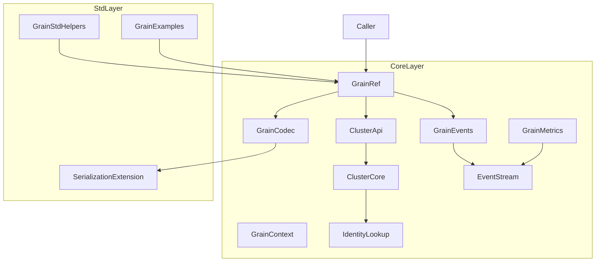
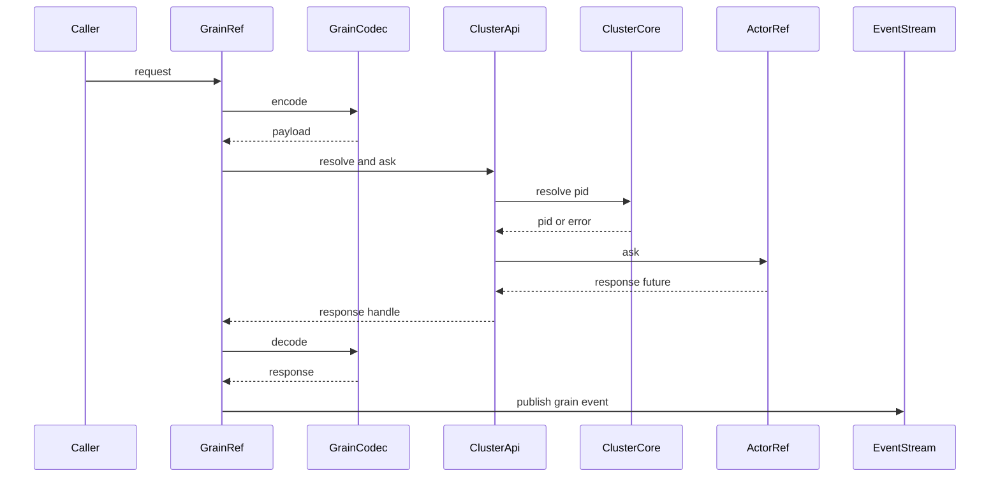

# Grain API 設計ドキュメント

---
**目的**: 実装者間の解釈ずれを防ぎ、実装の一貫性を担保するための設計情報を提供する。

**方針**:
- 実装判断に直結するセクションのみを残す
- 誤実装を誘発しない範囲で簡潔に書く
- 複雑さに応じて詳細度を調整する
- 長文より図・表を優先する
- Rust 向けに **型・所有権・エラー・no_std/std 境界** を明示する

**警告**: 1000 行に近づく場合、機能が過剰に複雑であり設計の簡素化が必要。
---

## 概要
Grain API は仮想アクターを kind/identity で参照・呼び出しできる利用体験を提供する。クラスタ利用者が明示的な配置やアクティベーションを意識せずに API 呼び出しに近い形で利用できることが主目的である。

この機能は既存の `ClusterApi` を下位層として保持し、その上に Grain 参照型と実行コンテキスト、呼び出しポリシーを重ねる構成を採用する。既存 API の後方互換性よりも責務境界の明確化を優先し、no_std と std の両環境で同等の体験を維持する。

### 目標
- Grain 参照型を導入し、参照解決と呼び出しを統一した入口にする
- 実行コンテキストを提供し、kind/identity/cluster 参照を取得可能にする
- シリアライザ非固定のメッセージ表現と観測イベントを統合する
- サンプルコードで利用手順を明確化する

### 非目標
- 生成コードや IDL 固定の導入
- 分散ロックや永続化の再設計（既存 Placement/Activation の範囲外）
- 既存 `ClusterApi` の完全置換

## アーキテクチャ

### 既存アーキテクチャ分析（必要な場合）
- `ClusterApiGeneric` が `ClusterExtension` 経由で `ClusterCore` に接続し、PID 解決と ask/timeout を提供している。
- `ClusterIdentity` と `GrainKey` が識別子の基盤であり、`IdentityLookup` が配置解決を担う。
- `SerializedMessage`/`GrainRpcRouter` は RPC 互換性の部品として存在するが、Grain 呼び出しとは未統合。

### パターンと境界マップ (Architecture Pattern & Boundary Map)
**アーキテクチャ統合**
- 選択したパターン: ハイブリッド（`ClusterApi` を下位層に残し、Grain API 層を追加）
- 境界の切り方: 参照解決と ask は `ClusterApi`、呼び出し体験は `GrainRef` に集中
- 既存パターンの維持: `core`/`std` 境界、`ArcShared + ToolboxMutex`、no_std 依存方向
- 新規コンポーネントの理由: Grain 参照型と実行コンテキストが既存 API に存在しない
- ステアリング適合: no_std 優先・1 ファイル 1 型・EventStream 観測を維持



### 技術スタック (Technology Stack & Alignment)

| レイヤ | 選定 / バージョン | 役割 | 備考 |
|-------|------------------|------|------|
| ランタイム / 実行基盤 | fraktor-actor-rs core | ask/timeout と Scheduler 駆動 | 追加依存なし |
| メッセージング / イベント | EventStream / AnyMessageGeneric | 観測イベントと応答の伝達 | core で統一 |
| 監視 / メトリクス | ClusterMetrics 拡張 | Grain 呼び出し/アクティベーション計測 | metrics 有効時のみ |
| 互換性 / シリアライズ | SerializationExtension / SerializedMessage | 非 protobuf 固定のメッセージ表現 | std は adapter を提供 |

## システムフロー

### Grain 呼び出しフロー


## 要件トレーサビリティ

| 要件 | 概要 | 対応コンポーネント | インターフェイス | フロー |
|------|------|--------------------|------------------|--------|
| 1.1 | kind/identity で参照解決 | GrainRef, ClusterApi | GrainRef API | 呼び出しフロー |
| 1.2 | 未起動時の拒否 | ClusterApi | ClusterResolveError | 呼び出しフロー |
| 1.3 | トポロジ更新反映 | ClusterCore, IdentityLookup | ClusterCore resolve | 呼び出しフロー |
| 1.4 | 決定的な解決 | IdentityLookup, Rendezvous | IdentityLookup | 呼び出しフロー |
| 1.5 | 参照結果に識別情報 | GrainRef | GrainRef API | 呼び出しフロー |
| 2.1 | 送達 | GrainRef, ClusterApi | request API | 呼び出しフロー |
| 2.2 | 応答返却 | GrainRef | request_future | 呼び出しフロー |
| 2.3 | タイムアウト通知 | GrainRef, ClusterApi | GrainCallOptions | 呼び出しフロー |
| 2.4 | リトライ | GrainRef, GrainCallOptions | Retry policy | 呼び出しフロー |
| 2.5 | 未確定時の失敗通知 | ClusterResolveError | LookupPending | 呼び出しフロー |
| 3.1 | kind/identity 提供 | GrainContext | GrainContext API | コンテキストフロー |
| 3.2 | クラスタ参照提供 | GrainContext | GrainContext API | コンテキストフロー |
| 3.3 | 処理終了で終了 | GrainContext | Context scope | コンテキストフロー |
| 3.4 | 取得手段を提供 | GrainContext | GrainContext API | コンテキストフロー |
| 4.1 | シリアライザ登録 | GrainCodec | GrainCodec | シリアライズフロー |
| 4.2 | 未登録時失敗 | GrainCodecError | GrainCodec | シリアライズフロー |
| 4.3 | 非 protobuf 送受信 | GrainCodec | GrainCodec | シリアライズフロー |
| 4.4 | 互換性不一致通知 | GrainCodecError | GrainCodec | シリアライズフロー |
| 5.1 | 失敗イベント通知 | GrainEvents | GrainEvent | 呼び出しフロー |
| 5.2 | アクティベーションイベント | VirtualActorEvent | EventStream | 呼び出しフロー |
| 5.3 | メトリクス更新 | GrainMetrics | GrainMetrics | 呼び出しフロー |
| 5.4 | 無効時の拒否 | MetricsError | metrics API | 監視フロー |
| 6.1 | no_std で利用可能 | core Grain API | core API | 全体 |
| 6.2 | std 拡張提供 | std helpers | std API | 全体 |
| 6.3 | 挙動差最小化 | GrainRef | GrainCallOptions | 全体 |
| 7.1 | 参照+呼び出しサンプル | examples | sample API | サンプル |
| 7.2 | 既存サンプル修正 | examples | sample API | サンプル |
| 7.3 | 成功シナリオ再現 | examples | sample API | サンプル |

## コンポーネントとインターフェイス (Components & Interface Contracts)

| コンポーネント | ドメイン/層 | 目的 | 要件対応 | 主要依存 (P0/P1) | 契約 |
|---------------|------------|------|----------|------------------|------|
| GrainRefGeneric | Core | Grain 参照の入口 | 1.1-2.5,6.3 | ClusterApi(P0), EventStream(P1) | Service |
| GrainCallOptions | Core | 呼び出しポリシー | 2.3,2.4 | Scheduler(P0) | State |
| GrainContextGeneric | Core | 実行コンテキスト | 3.1-3.4 | ActorContext(P0) | Service |
| GrainCodec | Core | メッセージ変換 | 4.1-4.4 | SerializationExtension(P1) | Service |
| GrainEvents | Core | 観測イベント | 5.1,5.2 | EventStream(P0) | Event |
| GrainMetrics | Core | メトリクス更新 | 5.3,5.4 | ClusterMetrics(P0) | State |
| ClusterApiGeneric | Core | 参照解決/ask | 1.1-2.2 | ClusterExtension(P0) | Service |
| GrainStdHelpers | Std | std 補助 | 6.2 | Scheduler(P0) | Service |
| GrainExamples | Std | サンプル | 7.1-7.3 | GrainRef(P0) | API |

### Core

#### GrainRefGeneric

| 項目 | 内容 |
|------|------|
| 目的 | Grain 参照を保持し、解決と呼び出しの入口を提供する |
| 対応要件 | 1.1-2.5,6.3 |

**責務と制約**
- `ClusterIdentity` を保持し、毎回最新の `ClusterApi` 経由で参照解決する
- `GrainCallOptions` を適用し、タイムアウトとリトライを制御する
- `LookupPending` など未確定状態はリトライ対象として扱い、Scheduler で再試行する
- no_std で完結し、std 依存は持たない

**依存関係**
- Inbound: 利用者 API — Grain 呼び出し（P0）
- Outbound: `ClusterApiGeneric` — PID 解決と ask（P0）
- Outbound: `EventStream` — 観測イベント（P1）

**契約**: Service [x] / API [ ] / Event [ ] / Batch [ ] / State [ ]

##### サービスインターフェイス（Rust）
```rust
pub struct GrainResolvedRef<TB: RuntimeToolbox + 'static> {
  pub identity: ClusterIdentity,
  pub actor_ref: ActorRefGeneric<TB>,
}

pub struct GrainRefGeneric<TB: RuntimeToolbox + 'static> {
  identity: ClusterIdentity,
  api: ClusterApiGeneric<TB>,
  options: GrainCallOptions,
}

impl<TB: RuntimeToolbox + 'static> GrainRefGeneric<TB> {
  pub fn get(&self) -> Result<GrainResolvedRef<TB>, ClusterResolveError>;
  pub fn request(
    &self,
    message: AnyMessageGeneric<TB>,
  ) -> Result<AskResponseGeneric<TB>, GrainCallError>;
  pub fn request_future(
    &self,
    message: AnyMessageGeneric<TB>,
  ) -> Result<ActorFutureSharedGeneric<AnyMessageGeneric<TB>, TB>, GrainCallError>;
}
```
- 前提条件: `ClusterExtension` が登録済みである
- 事後条件: 成功時は response を返し、失敗時は `GrainCallError` を返す
- 不変条件: `identity` は空文字を含まない

#### GrainCallOptions

| 項目 | 内容 |
|------|------|
| 目的 | タイムアウト/リトライのポリシーを定義する |
| 対応要件 | 2.3,2.4 |

**責務と制約**
- `core::time::Duration` で表現し、no_std で利用可能にする
- リトライ対象は `LookupPending` と `Timeout` を既定とする
- リトライ実行は `GrainRef` が Scheduler で管理する

**依存関係**
- Outbound: Scheduler — 遅延実行（P0）

**契約**: Service [ ] / API [ ] / Event [ ] / Batch [ ] / State [x]

##### サービスインターフェイス（Rust）
```rust
pub struct GrainCallOptions {
  pub timeout: Option<Duration>,
  pub retry: GrainRetryPolicy,
}

pub enum GrainRetryPolicy {
  NoRetry,
  Fixed { max_retries: u32, delay: Duration },
  Backoff { max_retries: u32, base_delay: Duration, max_delay: Duration },
}
```
- 前提条件: `max_retries` は 0 以上
- 事後条件: ポリシーに従って次回実行を決定する
- 不変条件: `max_delay` は `base_delay` 以上

#### GrainContextGeneric

| 項目 | 内容 |
|------|------|
| 目的 | 実行中の Grain から kind/identity/cluster 参照を取得する |
| 対応要件 | 3.1-3.4 |

**責務と制約**
- ActorContext を包み、必要な情報のみを公開する
- 実行終了後はコンテキスト参照を破棄する

**依存関係**
- Inbound: Grain 実装 — 文脈取得（P0）
- Outbound: `ClusterApiGeneric` — クラスタ参照（P1）

**契約**: Service [x] / API [ ] / Event [ ] / Batch [ ] / State [ ]

##### サービスインターフェイス（Rust）
```rust
pub trait GrainContext<TB: RuntimeToolbox + 'static> {
  fn kind(&self) -> &str;
  fn identity(&self) -> &str;
  fn cluster(&self) -> &ClusterApiGeneric<TB>;
}
```
- 前提条件: Grain 処理開始時に生成される
- 事後条件: 処理終了時に破棄される
- 不変条件: kind/identity は `ClusterIdentity` と一致する

#### GrainCodec

| 項目 | 内容 |
|------|------|
| 目的 | メッセージのエンコード/デコードを統一する |
| 対応要件 | 4.1-4.4 |

**責務と制約**
- protobuf 固定ではないバイナリ表現を扱う
- 登録なしのときは明示エラーを返す
- `SerializationExtension` と統合し、送信前に encode、応答受信後に decode する

**依存関係**
- Outbound: SerializationExtension — 既存レジストリ連携（P1）

**契約**: Service [x] / API [ ] / Event [ ] / Batch [ ] / State [ ]

##### サービスインターフェイス（Rust）
```rust
pub trait GrainCodec<TB: RuntimeToolbox + 'static> {
  fn encode(&self, message: &AnyMessageGeneric<TB>) -> Result<SerializedMessage, GrainCodecError>;
  fn decode(&self, payload: &SerializedMessage) -> Result<AnyMessageGeneric<TB>, GrainCodecError>;
}
```
- 前提条件: シリアライザが登録済みである
- 事後条件: 互換性不一致時は `GrainCodecError::Incompatible` を返す
- 不変条件: エンコードとデコードの型整合性を維持する

#### GrainEvents

| 項目 | 内容 |
|------|------|
| 目的 | Grain 呼び出しの観測イベントを発火する |
| 対応要件 | 5.1,5.2 |

**責務と制約**
- 失敗/タイムアウト/リトライなどのイベントを EventStream に送る
- `VirtualActorEvent` と重複しない粒度で定義する

**依存関係**
- Outbound: EventStream — 観測経路（P0）

**契約**: Service [ ] / API [ ] / Event [x] / Batch [ ] / State [ ]

##### イベント契約
- 発行イベント: `GrainCallStarted`, `GrainCallSucceeded`, `GrainCallFailed`, `GrainCallRetrying`, `GrainCallTimedOut`
- 購読イベント: なし
- 並び順 / 配送保証: EventStream の順序保証に従う

#### GrainMetrics

| 項目 | 内容 |
|------|------|
| 目的 | Grain 呼び出しとアクティベーションのメトリクスを保持する |
| 対応要件 | 5.3,5.4 |

**責務と制約**
- metrics 有効時のみ更新し、無効時は `MetricsError::Disabled` を返す
- `ClusterMetricsSnapshot` とは別スナップショットとして提供する

**依存関係**
- Outbound: ClusterCore — metrics フラグ（P0）

**契約**: Service [ ] / API [ ] / Event [ ] / Batch [ ] / State [x]

### Std

#### GrainStdHelpers

| 項目 | 内容 |
|------|------|
| 目的 | std 環境向けに便利な呼び出しポリシーを提供する |
| 対応要件 | 6.2 |

**責務と制約**
- `GrainCallOptions` の既定値や backoff 設定を提供する
- no_std の API と整合した挙動を維持する

**依存関係**
- Outbound: `GrainRefGeneric` — 呼び出し（P0）

**契約**: Service [x] / API [ ] / Event [ ] / Batch [ ] / State [ ]

#### GrainExamples

| 項目 | 内容 |
|------|------|
| 目的 | 参照取得と呼び出しのサンプルを提供する |
| 対応要件 | 7.1-7.3 |

**責務と制約**
- `cluster_extension_tokio` と `cluster_extension_no_std` を Grain API 利用例に更新する
- 実行成功シナリオを再現する

**依存関係**
- Inbound: 利用者 — サンプル実行（P2）
- Outbound: GrainRefGeneric — 参照取得と呼び出し（P0）

**契約**: Service [ ] / API [x] / Event [ ] / Batch [ ] / State [ ]

## データモデル

### ドメインモデル
- 値オブジェクト: `ClusterIdentity`, `GrainKey`
- エンティティ: なし
- ドメインイベント: `GrainCallEvent`, `VirtualActorEvent`
- 不変条件: kind/identity は空文字不可

### 論理データモデル
- `ClusterIdentity` は `kind` と `identity` を保持し `GrainKey` へ変換する
- `GrainMetricsSnapshot` は成功/失敗/タイムアウト等のカウンタを保持する

### データ契約と連携
- メッセージ表現: `SerializedMessage`（バイト列 + スキーマバージョン）
- イベントスキーマ: `GrainCallEvent` を EventStream に送信

## エラーハンドリング

### 方針
- 参照解決系は `ClusterResolveError` を拡張し、未確定（`LookupPending`）を明示する
- 呼び出し系は `GrainCallError` に集約し、リトライ/タイムアウトを区別する
- シリアライズは `GrainCodecError` で互換性不一致と未登録を分離する

### エラー分類と応答
**入力系**: kind/identity 空文字 → `ClusterIdentityError`  
**システム系**: タイムアウト → `GrainCallError::Timeout`  
**ビジネス系**: 未確定配置 → `ClusterResolveError::LookupPending`  

### 監視
- 失敗イベントは `GrainCallFailed` として EventStream に送信
- metrics 有効時は `GrainMetrics` を更新し、無効時は `MetricsError::Disabled`

## テスト戦略

- 単体テスト
  - GrainRef の未起動/未登録エラー
  - GrainCallOptions のリトライ回数判定
  - GrainCodec の未登録/互換性不一致
- 統合テスト
  - GrainRef で参照取得と ask が成功する
  - タイムアウト時に `GrainCallTimedOut` が EventStream に流れる
  - metrics 有効/無効の挙動差
- no_std/std の差分検証
  - no_std: 参照解決と呼び出しが動作する
  - std: 追加 helper の既定値が反映される

## オプション（必要な場合のみ）

### 性能/スケーラビリティ
- 目標指標: Grain 呼び出し 1 件あたりの余剰オーバーヘッドを最小化する
- ボトルネック回避策: EventStream 発火は必要最小限のイベントに限定する

## Supporting References（必要な場合のみ）
- `GrainCallOptions` の backoff パラメータ一覧
- `GrainCallError` の詳細な分類表
