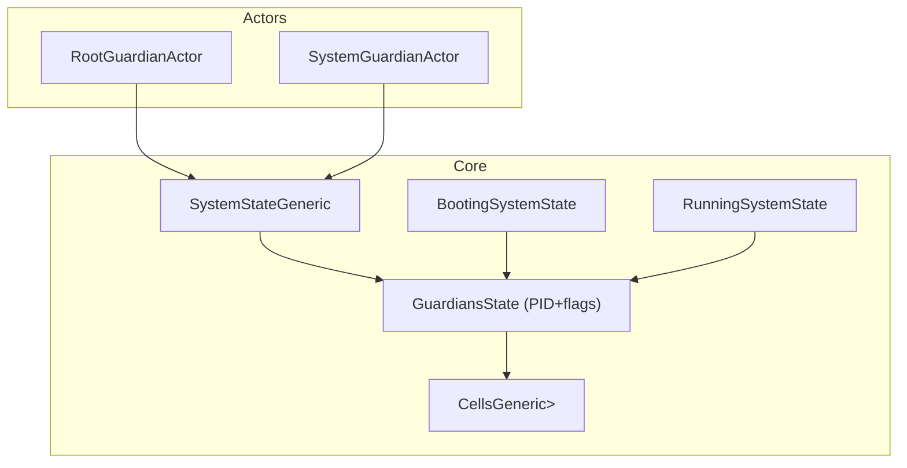
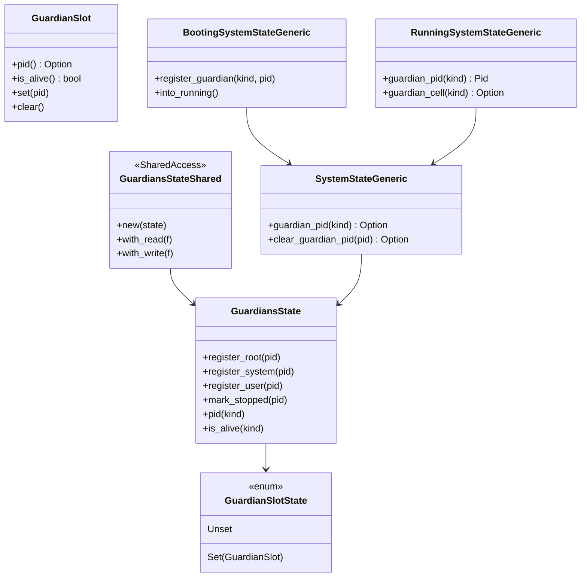

# 設計ドキュメント: guardian-pid-handle

## 概要
ガーディアン参照を PID ハンドル化し、SystemState↔ActorCell の強参照循環を解消する。起動前はガーディアン未設定を型で表し、稼働後は非 Option アクセスを保証する。既存の ActorPath / EventStream / Remoting への外部 API 挙動は維持しつつ、Termination 判定を PID＋存活フラグに置き換える。

### 目標 (Goals)
- ガーディアン保持を PID＋存活フラグで一貫管理し、循環参照を排除する。
- 起動前/後をタイプステートで分離し、未初期化利用をコンパイル時に防ぐ。
- 既存 API の利用者に挙動変化を与えない（PID 解決を内部で行う）。

### 非目標 (Non-Goals)
- scheduler/tick_driver/remoting_config/remote_watch_hook の Option 化方針は変更しない。
- Remoting/ActorPath の仕様拡張や新たな監視機構の導入は行わない。

## アーキテクチャ

### 既存アーキテクチャの把握
- SystemStateGeneric が `root/system/user_guardian: ToolboxMutex<Option<ArcShared<ActorCell>>>` を保持し、bootstrap 時に Arc を格納。clear_guardian は Option を空にして終了判定。
- ActorSystemGeneric::bootstrap が root→user→system の順で spawn。termination は root が watch し、system が hook を捌く。
- CellsGeneric は PID→ArcShared<ActorCell> マップ。ActorPath や EventStream は PID ベースで動作。

### ハイレベルアーキテクチャ

- SystemState はガーディアン実体を保持せず PID を保持し、実体解決は Cells 経由に一本化。
- Booting/Running のタイプステートでガーディアン未設定期間を表現。

### 技術スタック / 設計判断
- 既存スタック（no_std + ArcShared + ToolboxMutex）を継続。
- 新規依存なし。ファイル追加のみで構造を分離。
- std 側ビルダー互換: `ActorSystemGeneric::new/new_with_config/new_with_config_and` および std の `ActorSystemBuilder` は内部で Booting→Running を完了させてから従来どおり `ActorSystemGeneric` を返却し、呼び出し側のシグネチャ変更を不要とする。Booting 失敗時は `SpawnError::SystemNotBootstrapped` に統一して返す。

#### 主要設計判断
- **Decision**: ガーディアン保持を PID＋存活フラグへ変更  
  **Context**: Option<Arc> による強参照循環と未初期化時の不変条件欠如。  
  **Alternatives**: Weak 利用、グローバルレジストリ、イベント駆動。  
  **Selected Approach**: PID と存活フラグを GuardiansState に集約し、実体は Cells 経由で解決。  
  **Rationale**: 循環解消・所有一方向化・no_std 互換。  
  **Trade-offs**: Arc を直接返す API は PID 解決経由となり、内部解決コストが僅増。  

- **Decision**: Booting/Running タイプステート導入  
  **Context**: 起動前のガーディアン未設定をランタイム実行時チェックに依存していた。  
  **Alternatives**: 既存フラグ流用のみ。  
  **Selected Approach**: `BootingSystemStateGeneric` / `RunningSystemStateGeneric` を新設し、`into_running` で遷移。  
  **Rationale**: コンパイル時保証と初期化順序の明示化。  
  **Trade-offs**: ActorSystem bootstrap まわりのシグネチャ変更が発生。  

- **Decision**: 互換ラッパで外部 API を維持  
  **Context**: 既存 `user_guardian_ref()` などが Arc 返却。  
  **Selected Approach**: 内部で PID から Cells 解決するラッパを維持しつつ、将来廃止を rustdoc で告知。  
  **Trade-offs**: 過渡的に二重経路を持つが、利用者の破壊的変更を回避。  

## システムフロー
- bootstrap: BootingSystemState が PID を順に記録 → 3 guardian PID が揃ったら RunningSystemState に遷移 → create handshake → root_started。  
- termination: Guardian 停止時に GuardiansState が存活フラグを倒す → root flag 落下で termination future 完了。system/user 停止時は root 未設定なら termination 完了。  
- watch: Terminated 送達時は PID を受け取り、Cells から解決できない場合に即時返信。  
- spawn/resolve ガード: Booting 状態では `spawn_child`/`spawn_child_watched`/`resolve_actor_ref` を呼ぶと `SpawnError::SystemNotBootstrapped` または `ActorRefResolveError::SystemNotBootstrapped` を返し、ガーディアン未初期化利用を実行時に遮断する。  
- guardian_cell 解決ポリシー: RunningSystemStateGeneric::guardian_cell が None を返すのは cells に実体が存在しない場合のみ。その場合、呼び出し側（ActorSystem/ActorCell）は要件2.4どおり即時 `Terminated(pid)` を送信する。  

## API ブループリント

- ### 型・トレイト一覧
- `GuardiansState<TB>` (新規, pub(crate)): PID と存活フラグを保持する値オブジェクト。内部は `GuardianSlotState` を 3 スロット持つだけで Mutex は持たない。  
- `GuardiansStateShared<TB>` (新規, pub(crate)): `ArcShared<ToolboxMutex<GuardiansState<TB>, TB>>` を包む薄いラッパ。`pub fn new(state: GuardiansState<TB>) -> Self` のみ公開し、`SharedAccess` を実装して with_read/with_write を提供する（直接の register_* メソッドは持たない）。  
- `GuardianSlot` (新規, pub(crate)): 単一 guardian の PID/flag を管理する不変データ。  
- `GuardianSlotState` (新規, pub(crate>): `Unset` または `Set(GuardianSlot)` を表す状態 enum。  
- `BootingSystemStateGeneric<TB>` (新規, pub(crate)): 起動中状態を表すラッパ。  
- `RunningSystemStateGeneric<TB>` (新規, pub(crate)): 稼働中状態を表すラッパ。  
- `SystemStateGeneric<TB>` (既存変更): GuardiansState を保持し、Cells 解決のみでガーディアン実体にアクセス。  
- `ActorSystemGeneric<TB>` (既存変更): bootstrap シグネチャを Booting→Running に沿わせ、互換ラッパを維持。  

### シグネチャ スケッチ
```rust
pub struct GuardianSlot {
  pid: Pid,
  alive: AtomicBool,
}
impl GuardianSlot {
  pub fn set(&mut self, pid: Pid);
  pub fn clear(&mut self);
  pub fn is_alive(&self) -> bool;
  pub fn pid(&self) -> Option<Pid>;
}

pub enum GuardianSlotState {
  Unset,
  Set(GuardianSlot),
}

pub struct GuardiansState<TB: RuntimeToolbox + 'static> {
  root: GuardianSlotState,
  system: GuardianSlotState,
  user: GuardianSlotState,
}

pub struct GuardiansStateShared<TB: RuntimeToolbox + 'static> {
  inner: ArcShared<ToolboxMutex<GuardiansState<TB>, TB>>,
}

impl<TB: RuntimeToolbox + 'static> GuardiansStateShared<TB> {
  pub fn new(state: GuardiansState<TB>) -> Self;
}

impl<TB: RuntimeToolbox + 'static> SharedAccess<GuardiansState<TB>> for GuardiansStateShared<TB> {
  fn with_read<R>(&self, f: impl FnOnce(&GuardiansState<TB>) -> R) -> R {
    self.inner.with_read(f)
  }
  fn with_write<R>(&self, f: impl FnOnce(&mut GuardiansState<TB>) -> R) -> R {
    self.inner.with_write(f)
  }
}

pub struct BootingSystemStateGeneric<TB: RuntimeToolbox + 'static> {
  state: SystemStateSharedGeneric<TB>,
}
impl<TB: RuntimeToolbox + 'static> BootingSystemStateGeneric<TB> {
  pub fn register_guardian(&self, kind: GuardianKind, pid: Pid);
  pub fn into_running(self) -> Result<RunningSystemStateGeneric<TB>, BootstrapError>;
}

pub struct RunningSystemStateGeneric<TB: RuntimeToolbox + 'static> {
  state: SystemStateSharedGeneric<TB>,
}
impl<TB: RuntimeToolbox + 'static> RunningSystemStateGeneric<TB> {
  pub fn guardian_pid(&self, kind: GuardianKind) -> Pid; // 非Option
  pub fn guardian_cell(&self, kind: GuardianKind) -> Option<ArcShared<ActorCellGeneric<TB>>>;
}

impl<TB: RuntimeToolbox + 'static> SystemStateGeneric<TB> {
  pub fn guardian_pid(&self, kind: GuardianKind) -> Option<Pid>;
  pub fn clear_guardian_pid(&self, pid: Pid) -> Option<GuardianKind>;
  fn guardian_cell_via_cells(&self, kind: GuardianKind) -> Option<ArcShared<ActorCellGeneric<TB>>>;
}

pub enum SpawnError {
  SystemNotBootstrapped,
  // 既存のバリアント…
}

pub enum ActorRefResolveError {
  SystemNotBootstrapped,
  // 既存のバリアント…
}
```

## クラス／モジュール図


## クイックスタート / 利用例
```rust
fn bootstrap_with_pid_handles<TB: RuntimeToolbox + Default + 'static>(
  user_props: &PropsGeneric<TB>,
) -> Result<ActorSystemGeneric<TB>, SpawnError> {
  let system = ActorSystemGeneric::new_empty();
  let booting = BootingSystemStateGeneric::new(system.state());
  // root/system/user の PID を登録後
  let running = booting.into_running()?;
  // 稼働後は非Optionで参照できる
  let user_pid = running.guardian_pid(GuardianKind::User);
  let _ = running.guardian_cell(GuardianKind::User);
  Ok(system)
}
```

## 旧→新 API 対応表

| 旧 API / 型 | 新 API / 型 | 置換手順 | 備考 |
| --- | --- | --- | --- |
| `SystemStateGeneric::root_guardian() -> Option<ArcShared<ActorCell>>` | `RunningSystemStateGeneric::guardian_cell(GuardianKind::Root) -> Option<ArcShared<ActorCell>>` | PID を経由して Cells から取得する。既存ラッパは内部で同処理を呼ぶ。 | 互換ラッパを一定期間残す |
| `clear_guardian(pid)` が Option<Arc> の一致で判定 | `clear_guardian_pid(pid)` が GuardianSlot の PID/flag を更新 | 停止時は PID マッチで存活フラグを倒し termination 判定に用いる | |
| 起動シーケンスで Option 空チェック | Booting → Running の型遷移で保証 | `into_running` で未登録 PID がある場合エラー | |
| `ActorSystemGeneric::new/new_with_config` | 同名 API (内部で Booting→Running を完了) | 呼び出し側は変更不要。Booting 失敗時は `SpawnError::SystemNotBootstrapped` を返す | std の `ActorSystemBuilder` も同様にラップ |

## 要件トレーサビリティ

| 要件ID | 要約 | 実装コンポーネント | インターフェイス | 参照フロー |
| --- | --- | --- | --- | --- |
| 1.1–1.4 | ガーディアン PID ハンドル管理 | GuardiansState, GuardianSlot, SystemStateGeneric | register_* / guardian_pid | bootstrap |
| 2.1–2.4 | 停止整合と Terminated 応答 | GuardiansState, SystemStateGeneric, ActorCellGeneric | clear_guardian_pid, guardian_cell_via_cells | termination |
| 3.1–3.4 | タイプステート遷移 | BootingSystemStateGeneric, RunningSystemStateGeneric | into_running, guardian_pid | bootstrap |
| 4.1–4.3 | 外部 API 非影響 | ActorSystemGeneric ラッパ, SystemStateGeneric | user_guardian_ref/system_guardian_ref (内部で PID 解決) | 呼び出し互換 |

## コンポーネント & インターフェイス

### GuardiansState / GuardianSlot
- 責務: ガーディアン PID と存活状態を一元管理。実体所有はしない。
- 入力: register_* (PID), mark_stopped(PID)。
- 出力: pid(kind), is_alive(kind)。
- 依存: ToolboxMutex, Pid。外部依存なし。
- 不変条件: kind ごとに PID は高々1、存活フラグは PID 設定時 true, clear で false。GuardianSlot の set/clear は &mut self でのみ呼ばれ、必ず GuardiansStateShared.with_write 経由でロック下に行う。

### BootingSystemStateGeneric / RunningSystemStateGeneric
- 責務: 起動段階の型安全性を提供し、稼働後は非Option API を公開。
- 入力: register_guardian(kind, pid), into_running()。
- 出力: guardian_pid(kind), guardian_cell(kind)。
- 依存: SystemStateSharedGeneric、CellsGeneric。
- 不変条件: Running では 3 guardian PID が必ず設定。

### SystemStateGeneric 拡張
- 責務: guardians フィールドの管理、Cells 経由解決、termination 判定ロジック更新。
- 入力: register_cell/remove_cell, send_system_message, clear_guardian_pid。GuardiansState への操作は必ず `GuardiansStateShared` 経由で行い、直接フィールドへ触らない。
- 出力: guardian_pid, actor_path_registry など既存 API を維持。
- 依存: GuardiansState, CellsGeneric, EventStream, ActorPathRegistry。

### ActorSystemGeneric / Guardians Actors
- 変更: bootstrap が BootingState を経由し Running を返す。互換用 `user_guardian_ref/system_guardian_ref` は PID 解決ラッパに変更。Root/System guardian の termination 判定は PID/flag を参照。

## エラーハンドリング
- Booting で 3 guardian PID が揃わない場合: `BootstrapError::MissingGuardian(GuardianKind)` を返す。
- guardian_cell 解決不能: `None` を返し呼び出し側で Terminated を即時送信。
- mark_stopped が未知 PID に対して呼ばれた場合: no-op でログに警告を emit。

## テスト戦略
- ユニット: GuardiansState の set/clear/is_alive、Booting→Running の into_running エラー経路、guardian_cell_via_cells の解決失敗時動作。
- 統合: bootstrap シーケンスで 3 guardian PID 設定→Running へ遷移すること、guardian 停止で termination future が完了すること、停止済みガーディアンへの watch が即 Terminated を返すこと。
- 既存回帰: ActorPath 生成・EventStream 発火・Remoting（authority 解決）が影響を受けないことをシナリオテストで確認。

## 移行戦略
- フェーズ1: GuardiansState 導入＋互換ラッパ。既存 API は内部で PID 解決する実装に置換。
- フェーズ2（後続検討）: 互換ラッパに deprecate rustdoc を付与し、将来的に PID ベース API へ一本化。必要なら design/spec を更新してから進める。
