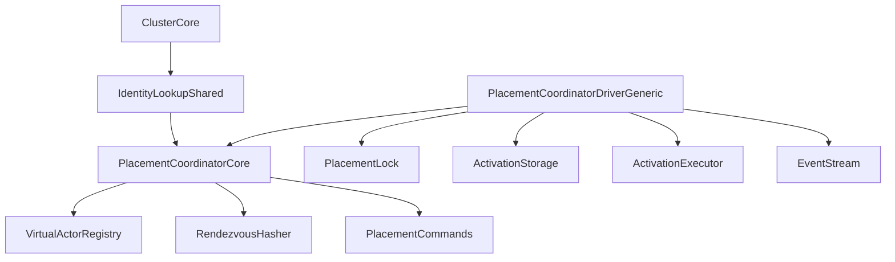
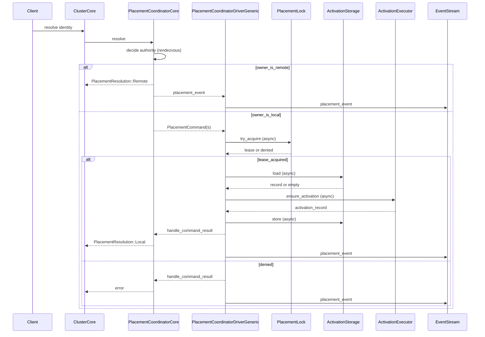
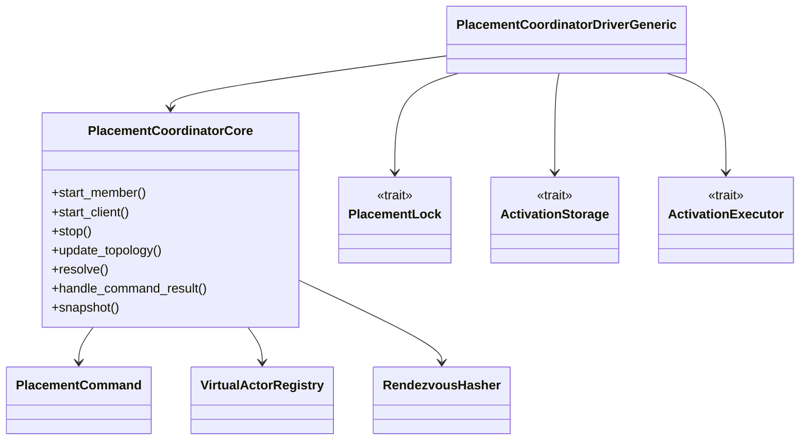
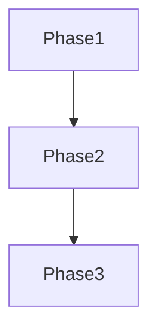

# 設計ドキュメント

## 概要
IdentityLookup/Placement は、クラスタ内で仮想アクターの配置決定と分散アクティベーションを一貫して扱うための基盤である。
既存の `IdentityLookup` を入口として保持しつつ、分散ロック・永続化・アクティベーションの契約を明確化し、
重複起動の防止と決定的な配置を保証する。

主な利用者はクラスタ利用開発者と運用者であり、配置決定の安定性、アクティベーション単一性、
および観測可能なライフサイクルを求める。既存の `PartitionIdentityLookup` と `VirtualActorRegistry`
を活用し、no_std 境界を維持したまま分散協調の責務を分離する。

### 目標 (Goals)
- Partition/Placement の決定を安定化し、未確定時の拒否を明確化する
- 分散アクティベーションの単一性を Lock/Storage/Activation の契約で保証する
- ライフサイクルと観測性（イベント/タイムスタンプ）を統一する

### 非目標 (Non-Goals)
- 外部の分散合意/リーダー選出の導入
- 永続ストレージの具体実装や運用設計
- 既存 API の後方互換性の維持（破壊的変更を許容）

## アーキテクチャ

### 既存アーキテクチャの把握
- `IdentityLookup` がクラスタのルックアップ入口として利用される
- `PartitionIdentityLookup` が rendezvous hash と `VirtualActorRegistry` でローカルな配置/キャッシュを行う
- `ClusterCore::apply_topology` が authority 更新/離脱を IdentityLookup に通知する
- `VirtualActorEvent`/`PidCacheEvent` は生成されるが観測経路が未接続
- core は no_std 前提で std 依存を持たない

### ハイレベルアーキテクチャ

- `PlacementCoordinatorCore` を core に導入し、配置決定と状態遷移の中核を担う
- I/O を伴う side-effect（Lock/Storage/Activation）は std 側の Driver で非同期に実行する
- authority がローカルでない場合は `PlacementResolution::Remote` を返し、I/O コマンドを生成しない
- `IdentityLookup` は入口として維持し、`PartitionIdentityLookup` が `PlacementCoordinatorCore` を内部で利用する
- Manager サフィックスは避け、責務に応じた `PartitionCoordinator`/`PlacementCoordinatorCore`/`*Router` などに統一する

### 技術スタック / 設計判断
- 既存の `RendezvousHasher` と `VirtualActorRegistry` を再利用する
- 新規依存ライブラリは追加しない
- core/std 境界は `trait` の分離で担保し、`#[cfg(feature = "std")]` を core に入れない

#### 主要設計判断
- **Decision**: `PlacementCoordinatorCore` は I/O を直接実行せず `PlacementCommand` を返す  
  **Context**: ロック/永続化/アクティベーションは I/O を伴い、core で同期実行するとブロックが発生する  
  **Alternatives**: core で async 実行 / すべて std 側に集約  
  **Selected Approach**: core は決定とコマンド生成に集中し、std の Driver が非同期に実行・結果を `handle_command_result` で戻す  
  **Rationale**: no_std 境界を守りつつ非同期 I/O を明確化できる  
  **Trade-offs**: コマンドと結果の往復が増え、状態遷移の実装がやや複雑になる  

- **Decision**: `IdentityLookup::get` を廃止し `resolve` に統一（戻り値は `PlacementResolution`）  
  **Context**: 失敗理由の通知と配置のローカル/リモート判定が要件で必須  
  **Alternatives**: Option のまま別 API で補足 / イベントのみ通知  
  **Selected Approach**: `IdentityLookup::resolve` を `Result<PlacementResolution, LookupError>` で提供し、`get` を廃止  
  **Rationale**: 失敗理由のテストと観測が容易で、リモート分岐も明示できる  
  **Trade-offs**: 既存 API と互換性がなくなる（破壊的変更）  

- **Decision**: Manager サフィックスの命名を避け、責務名で統一  
  **Context**: 命名規約で Manager/Service 等は禁止  
  **Alternatives**: Manager サフィックス維持  
  **Selected Approach**: `PlacementCoordinatorCore`/`PartitionRouter` を採用  
  **Rationale**: 役割が明確になり、既存規約と整合する  
  **Trade-offs**: 用語の読み替えが必要になる  

## システムフロー

### 代表フロー: ルックアップから分散アクティベーション


## API ブループリント

### 型・トレイト一覧
- `modules/cluster/src/core/identity_lookup.rs`: `pub trait IdentityLookup`  
  ルックアップ入口（`resolve` に統一）
- `modules/cluster/src/core/placement_coordinator.rs`: `pub struct PlacementCoordinatorCore<TB>`  
  配置決定とコマンド生成の中心
- `modules/cluster/src/core/placement_coordinator_shared.rs`: `pub struct PlacementCoordinatorShared<TB>`  
  共有用ラッパー
- `modules/cluster/src/core/placement_resolution.rs`: `pub struct PlacementResolution`  
  配置結果（local/remote と PID を含む）
- `modules/cluster/src/core/placement_locality.rs`: `pub enum PlacementLocality`  
  ローカル/リモートの区別
- `modules/cluster/src/core/placement_command.rs`: `pub enum PlacementCommand`  
  Driver が実行する I/O コマンド
- `modules/cluster/src/core/placement_command_result.rs`: `pub enum PlacementCommandResult`  
  コマンド結果の通知
- `modules/cluster/src/core/placement_request_id.rs`: `pub struct PlacementRequestId`  
  コマンド/結果の相関に用いるリクエストID
- `modules/cluster/src/core/placement_lease.rs`: `pub struct PlacementLease`  
  ロックの所有権と期限を表す
- `modules/cluster/src/core/activation_entry.rs`: `pub struct ActivationEntry`  
  owner と `ActivationRecord` の組
- `modules/cluster/src/core/activation_record.rs`: `pub struct ActivationRecord`  
  PID/snapshot/version を保持する
- `modules/cluster/src/core/placement_coordinator_state.rs`: `pub enum PlacementCoordinatorState`  
  `Stopped | Member | Client | NotReady`
- `modules/cluster/src/core/placement_coordinator_outcome.rs`: `pub struct PlacementCoordinatorOutcome`  
  解決結果・コマンド・イベント集合
- `modules/cluster/src/core/placement_decision.rs`: `pub struct PlacementDecision`  
  authority と決定時刻を含む
- `modules/cluster/src/core/placement_event.rs`: `pub enum PlacementEvent`  
  ルックアップ/ロック/アクティベーションの観測用イベント
- `modules/cluster/src/core/placement_lock_error.rs`: `pub enum PlacementLockError`
- `modules/cluster/src/core/activation_storage_error.rs`: `pub enum ActivationStorageError`
- `modules/cluster/src/std/placement_lock.rs`: `pub trait PlacementLock`  
  排他ロック契約（std 側の非同期 I/O）
- `modules/cluster/src/std/activation_storage.rs`: `pub trait ActivationStorage`  
  永続化契約（std 側の非同期 I/O）
- `modules/cluster/src/std/activation_executor.rs`: `pub trait ActivationExecutor`  
  アクティベーション実体（std 実装）
- `modules/cluster/src/std/placement_coordinator_driver.rs`: `pub struct PlacementCoordinatorDriverGeneric<TB, L, S, E>`

### シグネチャ スケッチ
```rust
pub trait IdentityLookup {
  fn setup_member(&mut self, kinds: &[ActivatedKind]) -> Result<(), IdentitySetupError>;
  fn setup_client(&mut self, kinds: &[ActivatedKind]) -> Result<(), IdentitySetupError>;
  fn resolve(&mut self, key: &GrainKey, now: TimerInstant) -> Result<PlacementResolution, LookupError>;
  fn update_topology(&mut self, authorities: Vec<String>);
  fn on_member_left(&mut self, authority: &str);
  fn passivate_idle(&mut self, now: u64, idle_ttl: u64);
  fn drain_events(&mut self) -> Vec<PlacementEvent>;
  fn drain_cache_events(&mut self) -> Vec<PidCacheEvent>;
}

pub enum PlacementLocality {
  Local,
  Remote,
}

pub struct PlacementResolution {
  pub decision: PlacementDecision,
  pub locality: PlacementLocality,
  pub pid: String,
}

pub struct PlacementRequestId(pub u64);

pub enum PlacementCommand {
  TryAcquire { request_id: PlacementRequestId, key: GrainKey, owner: String, now: TimerInstant },
  LoadActivation { request_id: PlacementRequestId, key: GrainKey },
  EnsureActivation { request_id: PlacementRequestId, key: GrainKey, owner: String },
  StoreActivation { request_id: PlacementRequestId, key: GrainKey, entry: ActivationEntry },
  Release { request_id: PlacementRequestId, lease: PlacementLease },
}

pub enum PlacementCommandResult {
  LockAcquired { request_id: PlacementRequestId, result: Result<PlacementLease, PlacementLockError> },
  ActivationLoaded { request_id: PlacementRequestId, result: Result<Option<ActivationEntry>, ActivationStorageError> },
  ActivationEnsured { request_id: PlacementRequestId, result: Result<ActivationRecord, ActivationError> },
  ActivationStored { request_id: PlacementRequestId, result: Result<(), ActivationStorageError> },
  LockReleased { request_id: PlacementRequestId, result: Result<(), PlacementLockError> },
}

pub struct PlacementLease {
  pub key: GrainKey,
  pub owner: String,
  pub expires_at: TimerInstant,
}

pub struct ActivationEntry {
  pub owner: String,
  pub record: ActivationRecord,
  pub observed_at: TimerInstant,
}

pub struct ActivationRecord {
  pub pid: String,
  pub snapshot: Option<Vec<u8>>,
  pub version: u64,
}

pub enum PlacementCoordinatorState {
  Stopped,
  Member,
  Client,
  NotReady,
}

pub struct PlacementDecision {
  pub key: GrainKey,
  pub authority: String,
  pub observed_at: TimerInstant,
}

pub enum PlacementEvent {
  Resolved { key: GrainKey, authority: String, observed_at: TimerInstant },
  LockDenied { key: GrainKey, reason: String, observed_at: TimerInstant },
  Activated { key: GrainKey, pid: String, observed_at: TimerInstant },
}

pub struct PlacementCoordinatorOutcome {
  pub resolution: Option<PlacementResolution>,
  pub commands: Vec<PlacementCommand>,
  pub events: Vec<PlacementEvent>,
}

// std 側に置く非同期契約（core では直接呼び出さない）
pub trait PlacementLock {
  async fn try_acquire(&mut self, key: &GrainKey, owner: &str, now: TimerInstant)
    -> Result<PlacementLease, PlacementLockError>;
  async fn release(&mut self, lease: PlacementLease) -> Result<(), PlacementLockError>;
}

pub trait ActivationStorage {
  async fn load(&mut self, key: &GrainKey) -> Result<Option<ActivationEntry>, ActivationStorageError>;
  async fn store(&mut self, key: &GrainKey, entry: ActivationEntry) -> Result<(), ActivationStorageError>;
  async fn remove(&mut self, key: &GrainKey) -> Result<(), ActivationStorageError>;
}

pub trait ActivationExecutor {
  async fn ensure_activation(&mut self, key: &GrainKey, owner: &str) -> Result<ActivationRecord, ActivationError>;
}

impl<TB> PlacementCoordinatorCore<TB>
where
  TB: RuntimeToolbox + 'static,
{
  pub fn start_member(&mut self) -> Result<(), PlacementCoordinatorError>;
  pub fn start_client(&mut self) -> Result<(), PlacementCoordinatorError>;
  pub fn stop(&mut self) -> Result<(), PlacementCoordinatorError>;
  pub fn update_topology(&mut self, members: Vec<String>);
  pub fn resolve(&mut self, key: &GrainKey, now: TimerInstant) -> Result<PlacementCoordinatorOutcome, LookupError>;
  pub fn handle_command_result(
    &mut self,
    result: PlacementCommandResult,
  ) -> Result<PlacementCoordinatorOutcome, PlacementCoordinatorError>;
  pub fn snapshot(&self) -> PlacementSnapshot;
}
```

## クラス／モジュール図


## クイックスタート / 利用例
```rust
fn placement_flow<TB: RuntimeToolbox + 'static>(
  coordinator: &mut PlacementCoordinatorCore<TB>,
  driver: &mut PlacementCoordinatorDriverGeneric<TB, impl PlacementLock, impl ActivationStorage, impl ActivationExecutor>,
  key: GrainKey,
  now: TimerInstant,
) {
  let _ = coordinator.start_member();
  coordinator.update_topology(vec!["node-a:3000".to_string()]);
  let mut outcome = coordinator.resolve(&key, now).unwrap();
  driver.enqueue(outcome.commands);
  // Driver が非同期 I/O を実行し、結果を coordinator に戻す（擬似コード）
  if let Some(result) = driver.poll_result() {
    outcome = coordinator.handle_command_result(result).unwrap();
  }
  let _snapshot = coordinator.snapshot();
  let _events = outcome.events;
}
```

## 旧→新 API 対応表

| 旧 API / 型 | 新 API / 型 | 置換手順 | 備考 |
| --- | --- | --- | --- |
| `IdentityLookup::get`（`Option<String>`） | `IdentityLookup::resolve`（`Result<PlacementResolution, LookupError>`） | `ClusterCore::resolve_pid`/`ClusterApi::get` を `resolve` へ置換 | 破壊的変更 |
| Partition 管理コンポーネント（概念名） | `PlacementCoordinatorCore` / `PartitionRouter` | Manager サフィックスを回避 | 命名のみ変更 |

## 要件トレーサビリティ

| 要件ID | 要約 | 実装コンポーネント | インターフェイス | 参照フロー |
| --- | --- | --- | --- | --- |
| 1.1 | ルックアップ時の配置決定 | PlacementCoordinatorCore | resolve | sequence |
| 1.2 | トポロジ変更反映 | ClusterCore / PlacementCoordinatorCore | update_topology | sequence |
| 1.3 | 未確定時の拒否 | PlacementCoordinatorCore | resolve | state |
| 2.1 | 分散アクティベーション開始 | PlacementCoordinatorCore / ActivationExecutor | ensure_activation | sequence |
| 2.2 | 既存アクティベーション再利用 | VirtualActorRegistry | ensure_activation | sequence |
| 3.1 | 排他ロック取得 | PlacementLock | try_acquire | sequence |
| 3.5 | ロック解放 | PlacementLock | release | sequence |
| 4.1 | 起動/停止 | PlacementCoordinatorCore | start_member/stop | state |
| 4.4 | イベント通知 | PlacementCoordinatorCore | events | sequence |

## コンポーネント & インターフェイス

### PlacementCoordinatorCore
- 責務: 配置決定、コマンド生成、イベント生成
- 入出力: `resolve`/`handle_command_result`/`update_topology` の呼び出しと `PlacementCoordinatorOutcome`
- 依存関係: `RendezvousHasher`, `VirtualActorRegistry`
- 外部依存の調査結果: 既存の rendezvous hash を再利用するため追加調査不要

#### 契約定義
- 前提条件: `Stopped`/`NotReady` の間は `resolve` を拒否する
- 事後条件: `resolve` は `PlacementResolution::Remote` もしくは `commands` を返す
- 補足: ローカルで I/O が必要な場合は `resolution` が `None` になり、Driver の結果を受けた後に確定する
- 不変条件: 同一 key の並行 resolve はロックにより単一化される（Driver が lock を実行）
- イベント: `resolve` は必ず `PlacementEvent` を生成し、Driver が EventStream に送出する
- 分岐: authority がローカルでない場合は `PlacementResolution::Remote` を返し、lock/activation を実行しない
- 失敗/保留: `resolution` が未確定の間は `LookupError::Pending` を返し、呼び出し側は再試行する
- 相関: `PlacementCommand`/`PlacementCommandResult` は同一 `request_id` を持ち、Coordinator は request_id で状態遷移を結び付ける

### PlacementLock
- 責務: 分散ロックの取得/解放
- 入出力: `try_acquire`/`release`（非同期）
- 依存関係: std 側で実装し、Driver が呼び出す
 - 契約:
   - `try_acquire` は **排他的ロック** を返すか明示的な失敗を返す
   - `PlacementLease` は **期限付き**（TTL）とし、期限切れは失効扱い
   - 失敗理由は `PlacementLockError` に含め、`PlacementEvent::LockDenied` へ反映する

### ActivationStorage
- 責務: アクティベーションの所有者/状態の永続化
- 入出力: `load`/`store`/`remove`（非同期）
- 依存関係: std 側で実装し、Driver が呼び出す
 - 契約:
   - `store` は **冪等** であること（同一 owner の再書き込みを許容）
   - `load` が返す `ActivationRecord` は `owner`/`version` の整合が保証される

### ActivationExecutor
- 責務: 実際のアクティベーション生成
- 入出力: `ensure_activation`（非同期）
- 依存関係: std 側で actor system と統合し、Driver が呼び出す
 - 契約:
   - `ensure_activation` は **同一 key で重複生成しない**（既存を再利用）
   - 失敗時は `ActivationError` を返し、`PlacementEvent` へ反映する

### PlacementCoordinatorDriverGeneric
- 責務: `PlacementCommand` の非同期実行、EventStream 連携と周期処理（passivation 等）
- 入出力: `enqueue`/`poll_result`/`handle_*`（擬似 API）
- 依存関係: `PlacementCoordinatorShared`, `PlacementLock`, `ActivationStorage`, `ActivationExecutor`, `EventStreamSharedGeneric`
 - 契約:
    - Coordinator の `events` を **必ず EventStream に送出**する
    - 送出順序は `resolve` 内で生成された順を維持する
    - `observed_at` を付与し、観測性要件を満たす
    - `PlacementCommand` の実行結果を `PlacementCommandResult` として coordinator に返す
    - `request_id` を必ず引き継ぎ、結果の相関を保証する

### ドメインモデル
- エンティティ: `PlacementDecision`, `ActivationRecord`, `PlacementLease`
- ルール:
  - `NotReady` の間は resolve を拒否する
  - authority がローカルでない場合は `PlacementResolution::Remote` を返し、I/O コマンドを生成しない
  - `PlacementLock` の獲得に成功した場合のみ ActivationExecutor を呼び出す
  - `ActivationStorage` は owner/状態の単一ソースとする

## データモデル

### 論理データモデル
- `ActivationRecord` は PID と snapshot/バージョンを保持する
- `ActivationEntry` は owner と `ActivationRecord` の組を保持する
- `PlacementDecision` は key と owner を保持する

### 物理データモデル
- core では永続化方式を規定しない
- std 側でメモリ/外部ストレージ実装を選択可能

### データ契約 / 連携
- EventStream に `PlacementEvent` を流す（Driver が送出）
- `LookupError` と `PlacementLockError` は失敗理由を含む

## エラーハンドリング

### エラーストラテジ
- ルックアップ失敗は `LookupError` で即時返却する
- ロック取得失敗は `PlacementLockError` と `PlacementEvent::LockDenied` を併用する

### エラー分類と応答
- ユーザエラー: 無効 key、未起動
- システムエラー: ロック/ストレージ失敗
- ビジネスロジックエラー: 既存アクティベーション競合
- 保留応答: `LookupError::Pending`（I/O コマンド実行中）

### モニタリング
- `PlacementEvent` と `VirtualActorEvent` の EventStream 配信
- 失敗時のエラー理由をイベントに含める

## テスト戦略
- ユニットテスト: 未起動拒否、ロック拒否、決定的配置、リモート分岐、既存アクティベーション再利用
- 統合テスト: トポロジ更新反映、EventStream 配信、request_id 相関、コマンド実行結果の往復、ロック/ストレージ境界

## 追加セクション（必要時のみ）

### パフォーマンス & スケーラビリティ
- rendezvous hash による O(n) 選択は既存規模を想定する
- 需要が増える場合は選択戦略の差し替えを許容する

### 移行戦略

- Phase1: IdentityLookup の API 変更と PlacementCoordinatorCore 導入
- Phase2: Lock/Storage/Activation の std 実装追加
- Phase3: EventStream 連携と観測性の拡張
