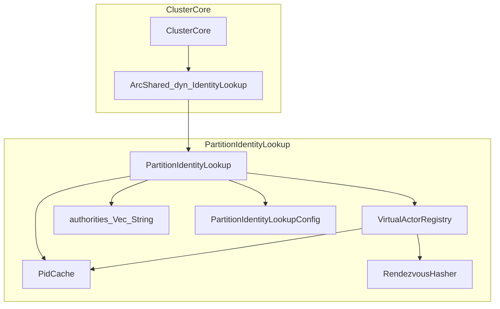
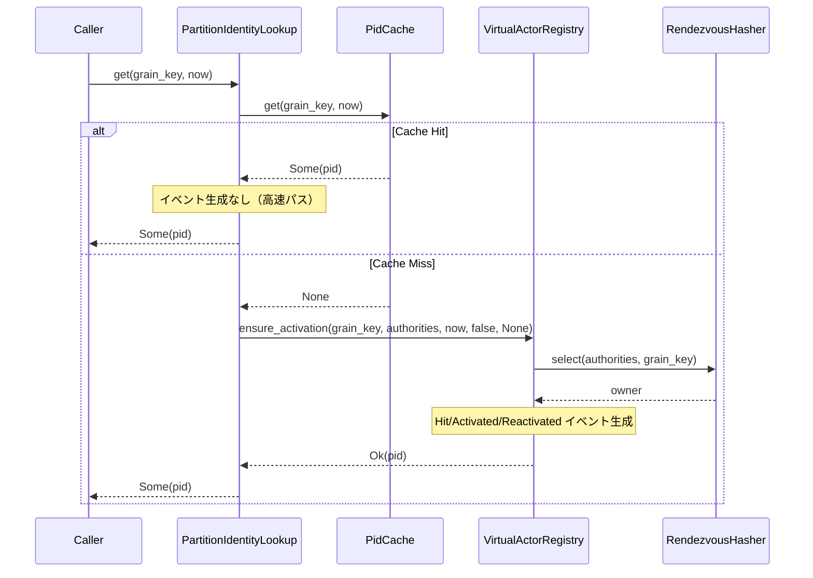
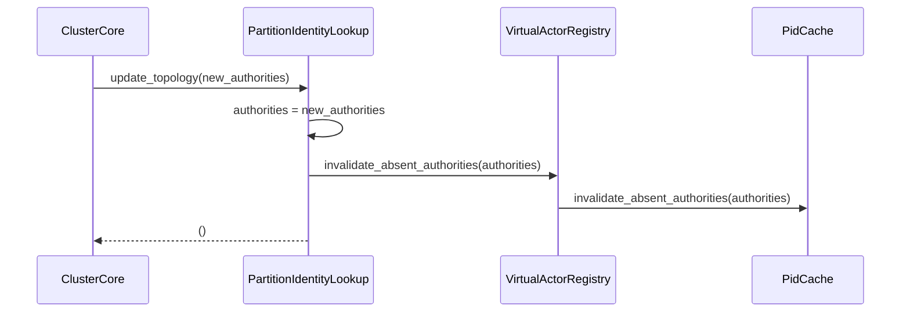
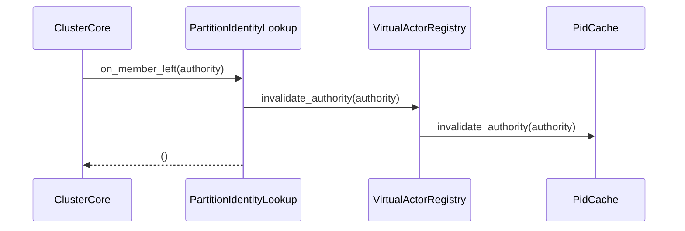
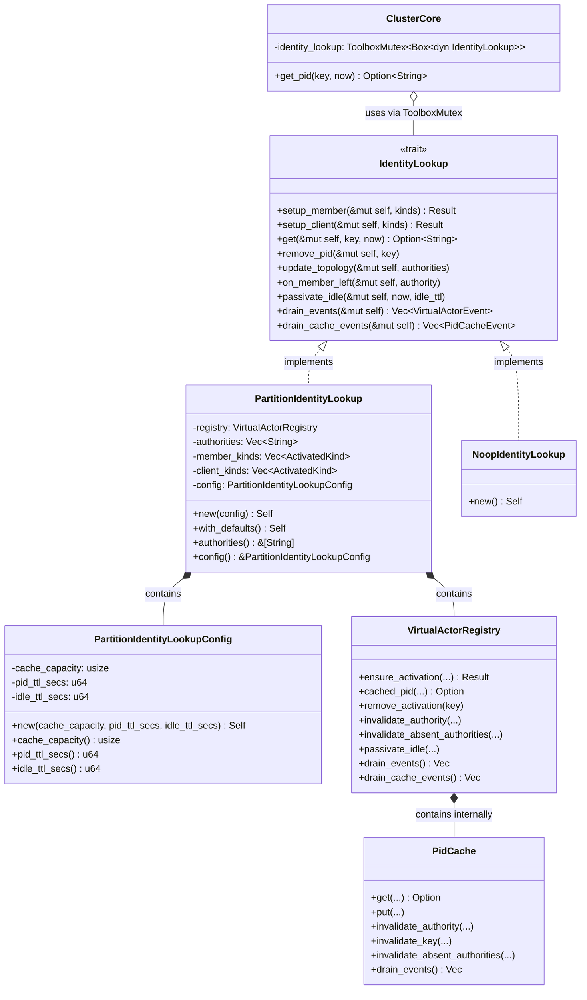
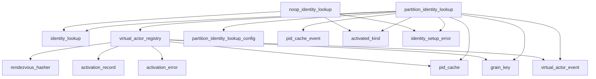

# PartitionIdentityLookup 設計ドキュメント

## 概要

本ドキュメントは、fraktor-cluster-rs における `PartitionIdentityLookup` コンポーネントの技術設計を定義する。

- **Purpose**: クラスタ内の仮想アクター（Grain）の配置と PID 解決を分散ハッシュベースで実現し、高速なルックアップとトポロジ変更への自動追従を提供する
- **Users**: クラスタアプリケーション開発者が `ClusterCore` 経由で仮想アクターの PID を取得し、アクター間通信を確立する
- **Impact**: 既存の `IdentityLookup` トレイトを拡張し、`NoopIdentityLookup` への追従更新が必要。`ClusterCore` との統合ポイントを追加する

### 目標 (Goals)

- `IdentityLookup` トレイトを拡張し、`get`/`remove_pid`/`update_topology`/`on_member_left`/`passivate_idle`/`drain_events`/`drain_cache_events` メソッドを追加する
- `PartitionIdentityLookup` 構造体を新規作成し、`VirtualActorRegistry`/`PidCache`/`RendezvousHasher` を統合する
- `PartitionIdentityLookupConfig` で設定可能なパラメータを提供する
- `no_std` 環境で動作し、時刻は外部から `now: u64` として受け取る

### 非目標 (Non-Goals)

- protoactor-go の `placementActor` に相当する actor ベースのアクティベーションフローは本設計のスコープ外（将来の拡張として検討）
- `Shutdown` メソッドは要件にないため本設計に含めない
- クラスタ間のアクティベーション要求送受信の実装は別途設計する

---

## アーキテクチャ

### 既存アーキテクチャの把握

現在の実装は以下のパターンを持つ:

| コンポーネント | 責務 | 状態 |
|---------------|------|------|
| `IdentityLookup` トレイト | setup_member/setup_client のみ定義 | **拡張必要** |
| `NoopIdentityLookup` | stub 実装 | **更新必要** |
| `VirtualActorRegistry` | アクティベーション管理、`ensure_activation`、`passivate_idle` | **再利用** |
| `PidCache` | TTL ベースキャッシュ、authority 無効化 | **再利用** |
| `RendezvousHasher` | オーナーノード選定 `select` | **再利用** |
| `ClusterCore` | `identity_lookup` フィールド保持、トポロジ更新時の `pid_cache` 無効化 | **統合ポイント** |

### ハイレベルアーキテクチャ



**設計方針**:
- `PartitionIdentityLookup` は `VirtualActorRegistry` を内包し、アクティベーション管理を委譲する
- `VirtualActorRegistry` 内部の `PidCache` を使用し、重複キャッシュを持たない
- authority リストを保持し、トポロジ変更時に更新する
- **`&mut self` 統一設計**（tech.md 準拠）:
  - すべてのトレイトメソッド（`setup_member`, `setup_client`, `get`, `remove_pid` 等）は `&mut self` を使用
  - 呼び出し側（`ClusterCore`）が `ToolboxMutex<Box<dyn IdentityLookup>>` で保護し、ロック粒度を制御
  - 状態を変更するメソッドは型シグネチャで意図を明示するという Rust 標準ライブラリの慣例に準拠

### 技術スタック / 設計判断

#### 主要設計判断

**Decision 1: ハイブリッドアプローチの採用**

- **Context**: 現在の `IdentityLookup` トレイトには `get`/`remove_pid` が未定義であり、protoactor-go の `disthash` に相当する機能がない
- **Alternatives**:
  - Option A: 既存コンポーネント拡張のみ（トレイト肥大化、責務混在）
  - Option B: 新規コンポーネントのみ（既存との統合が複雑）
  - Option C: ハイブリッド（トレイト拡張 + 新規コンポーネント）
- **Selected Approach**: Option C を採用し、トレイト拡張と新規構造体作成を組み合わせる
- **Rationale**: 破壊的変更を最小限に抑えつつ、責務を明確に分離できる
- **Trade-offs**: `NoopIdentityLookup` 等の既存実装に stub メソッド追加が必要

**Decision 2: VirtualActorRegistry の内包**

- **Context**: `VirtualActorRegistry` は既にアクティベーション管理と `PidCache` 統合を実装済み
- **Alternatives**:
  - `PartitionIdentityLookup` 内部で直接 `PidCache` と `BTreeMap` を管理
  - `VirtualActorRegistry` を ArcShared で共有参照
  - `VirtualActorRegistry` を所有として内包
- **Selected Approach**: `VirtualActorRegistry` を所有として内包し、直接アクセスする
- **Rationale**: 既存の `ensure_activation`/`passivate_idle` ロジックを再利用でき、イベント生成も一元化される
- **Trade-offs**: `VirtualActorRegistry` と `PartitionIdentityLookup` の責務境界を明確に維持する必要がある

**Decision 3: no_std 対応の時刻管理**

- **Context**: `no_std` 環境では `std::time::Instant` が使用不可であり、TTL 判定に外部からの時刻提供が必要
- **Alternatives**:
  - `std` feature で条件コンパイル
  - 全メソッドに `now: u64` パラメータを追加
  - `Clock` trait を導入して抽象化
- **Selected Approach**: TTL 関連メソッドに `now: u64`（Unix タイムスタンプ秒）を引数として渡す
- **Rationale**: 既存の `VirtualActorRegistry`/`PidCache` と同一パターンを踏襲し、一貫性を維持
- **Trade-offs**: 呼び出し側で時刻取得が必要になるが、テスタビリティが向上する

---

## システムフロー

### PID 解決フロー



**注記**: `VirtualActorEvent::Hit` は `PidCache` のキャッシュヒット時ではなく、`VirtualActorRegistry::ensure_activation` でアクティベーションレコードにヒットした場合に生成される。これは `last_seen` の更新と連動し、アイドルパッシベーション判定の基準となる。PidCache レベルのキャッシュヒットは高速パスとして最適化され、イベント生成を行わない。

### トポロジ更新フロー



### メンバー離脱フロー



---

## API ブループリント

### 型・トレイト一覧

| 型/トレイト | 可視性 | 責務 |
|------------|--------|------|
| `IdentityLookup` (拡張) | `pub` | Identity 解決の抽象インターフェイス |
| `PartitionIdentityLookup` | `pub` | 分散ハッシュベースの Identity Lookup 実装 |
| `PartitionIdentityLookupConfig` | `pub` | 設定パラメータの保持 |
| `LookupError` | `pub` | ルックアップ失敗の理由を表現 |

### シグネチャ スケッチ

#### IdentityLookup トレイト（拡張後）

```rust
//! Identity lookup abstraction for cluster modes.

use alloc::{string::String, vec::Vec};

use crate::core::{
    activated_kind::ActivatedKind,
    grain_key::GrainKey,
    identity_setup_error::IdentitySetupError,
    lookup_error::LookupError,
    pid_cache_event::PidCacheEvent,
    virtual_actor_event::VirtualActorEvent,
};

/// Provides identity resolution setup and lookup operations.
///
/// All methods that modify internal state use `&mut self` to make state changes
/// explicit in the type signature. Callers (such as `ClusterCore`) should wrap
/// the implementation in `ToolboxMutex<Box<dyn IdentityLookup>>` for thread-safe access.
pub trait IdentityLookup: Send + Sync {
    /// Prepares identity lookup for member mode with the provided kinds.
    ///
    /// # Errors
    ///
    /// Returns an error if identity lookup setup fails for member mode.
    fn setup_member(&mut self, kinds: &[ActivatedKind]) -> Result<(), IdentitySetupError>;

    /// Prepares identity lookup for client mode with the provided kinds.
    ///
    /// # Errors
    ///
    /// Returns an error if identity lookup setup fails for client mode.
    fn setup_client(&mut self, kinds: &[ActivatedKind]) -> Result<(), IdentitySetupError>;

    /// Resolves the PID for a grain key.
    ///
    /// Returns `Some(pid)` if the grain is active or can be activated,
    /// `None` if no authority is available or activation failed.
    ///
    /// Note: This method uses `&mut self` because it may update the cache
    /// and create new activations as side effects.
    ///
    /// # Arguments
    ///
    /// * `key` - The grain key to resolve
    /// * `now` - Current Unix timestamp in seconds for TTL calculation
    fn get(&mut self, key: &GrainKey, now: u64) -> Option<String> {
        let _ = (key, now);
        None
    }

    /// Removes a PID from the registry and cache.
    ///
    /// # Arguments
    ///
    /// * `key` - The grain key to remove
    fn remove_pid(&mut self, key: &GrainKey) {
        let _ = key;
    }

    /// Updates the authority list based on topology changes.
    ///
    /// This invalidates activations and cache entries for authorities
    /// that are no longer present.
    ///
    /// # Arguments
    ///
    /// * `authorities` - Current list of active authorities
    fn update_topology(&mut self, authorities: Vec<String>) {
        let _ = authorities;
    }

    /// Handles a member leaving the cluster.
    ///
    /// Invalidates all activations and cache entries for the given authority.
    ///
    /// # Arguments
    ///
    /// * `authority` - The authority address that left
    fn on_member_left(&mut self, authority: &str) {
        let _ = authority;
    }

    /// Passivates idle activations that exceed the given TTL.
    ///
    /// # Arguments
    ///
    /// * `now` - Current Unix timestamp in seconds
    /// * `idle_ttl` - Maximum idle time in seconds before passivation
    fn passivate_idle(&mut self, now: u64, idle_ttl: u64) {
        let _ = (now, idle_ttl);
    }

    /// Drains pending virtual actor events.
    fn drain_events(&mut self) -> Vec<VirtualActorEvent> {
        Vec::new()
    }

    /// Drains pending PID cache events.
    fn drain_cache_events(&mut self) -> Vec<PidCacheEvent> {
        Vec::new()
    }
}
```

#### PartitionIdentityLookupConfig

```rust
//! Configuration for partition identity lookup.

/// Configuration for the partition identity lookup component.
#[derive(Debug, Clone)]
pub struct PartitionIdentityLookupConfig {
    /// Maximum number of entries in the PID cache.
    cache_capacity: usize,
    /// Time-to-live for cached PIDs in seconds.
    pid_ttl_secs: u64,
    /// Time-to-live for idle activations in seconds.
    idle_ttl_secs: u64,
}

impl PartitionIdentityLookupConfig {
    /// Creates a new configuration with the specified parameters.
    ///
    /// # Arguments
    ///
    /// * `cache_capacity` - Maximum number of entries in the PID cache
    /// * `pid_ttl_secs` - Time-to-live for cached PIDs in seconds
    /// * `idle_ttl_secs` - Time-to-live for idle activations in seconds
    #[must_use]
    pub const fn new(cache_capacity: usize, pid_ttl_secs: u64, idle_ttl_secs: u64) -> Self {
        Self { cache_capacity, pid_ttl_secs, idle_ttl_secs }
    }

    /// Returns the cache capacity.
    #[must_use]
    pub const fn cache_capacity(&self) -> usize {
        self.cache_capacity
    }

    /// Returns the PID TTL in seconds.
    #[must_use]
    pub const fn pid_ttl_secs(&self) -> u64 {
        self.pid_ttl_secs
    }

    /// Returns the idle TTL in seconds.
    #[must_use]
    pub const fn idle_ttl_secs(&self) -> u64 {
        self.idle_ttl_secs
    }
}

impl Default for PartitionIdentityLookupConfig {
    fn default() -> Self {
        Self {
            cache_capacity: 1024,
            pid_ttl_secs:   300,  // 5 minutes
            idle_ttl_secs:  3600, // 1 hour
        }
    }
}
```

#### PartitionIdentityLookup

```rust
//! Partition-based identity lookup using distributed hashing.

use alloc::{string::String, vec::Vec};

use crate::core::{
    activated_kind::ActivatedKind,
    grain_key::GrainKey,
    identity_lookup::IdentityLookup,
    identity_setup_error::IdentitySetupError,
    partition_identity_lookup_config::PartitionIdentityLookupConfig,
    pid_cache_event::PidCacheEvent,
    virtual_actor_event::VirtualActorEvent,
    virtual_actor_registry::VirtualActorRegistry,
};

#[cfg(test)]
mod tests;

/// Distributed hash-based identity lookup implementation.
///
/// This component resolves grain keys to PIDs using rendezvous hashing
/// to select owner nodes. All methods that modify state use `&mut self`,
/// and callers should wrap the instance in `ToolboxMutex<Box<dyn IdentityLookup>>`
/// for thread-safe access.
pub struct PartitionIdentityLookup {
    /// Virtual actor registry for activation management (includes PidCache).
    registry: VirtualActorRegistry,
    /// Current list of active authorities.
    authorities: Vec<String>,
    /// Registered activated kinds for member mode.
    member_kinds: Vec<ActivatedKind>,
    /// Registered activated kinds for client mode.
    client_kinds: Vec<ActivatedKind>,
    /// Configuration parameters.
    config: PartitionIdentityLookupConfig,
}

impl PartitionIdentityLookup {
    /// Creates a new partition identity lookup with the given configuration.
    #[must_use]
    pub fn new(config: PartitionIdentityLookupConfig) -> Self {
        let cache_capacity = config.cache_capacity();
        let pid_ttl_secs = config.pid_ttl_secs();
        Self {
            registry: VirtualActorRegistry::new(cache_capacity, pid_ttl_secs),
            authorities: Vec::new(),
            member_kinds: Vec::new(),
            client_kinds: Vec::new(),
            config,
        }
    }

    /// Creates a new partition identity lookup with default configuration.
    #[must_use]
    pub fn with_defaults() -> Self {
        Self::new(PartitionIdentityLookupConfig::default())
    }

    /// Returns the current authority list.
    #[must_use]
    pub fn authorities(&self) -> &[String] {
        &self.authorities
    }

    /// Returns the configuration.
    #[must_use]
    pub const fn config(&self) -> &PartitionIdentityLookupConfig {
        &self.config
    }
}

impl IdentityLookup for PartitionIdentityLookup {
    fn setup_member(&mut self, kinds: &[ActivatedKind]) -> Result<(), IdentitySetupError> {
        self.member_kinds = kinds.to_vec();
        Ok(())
    }

    fn setup_client(&mut self, kinds: &[ActivatedKind]) -> Result<(), IdentitySetupError> {
        self.client_kinds = kinds.to_vec();
        Ok(())
    }

    fn get(&mut self, key: &GrainKey, now: u64) -> Option<String> {
        // Step 1: Try registry cache first
        if let Some(pid) = self.registry.cached_pid(key, now) {
            return Some(pid);
        }

        // Step 2: Ensure activation via registry
        // snapshot_required is false for basic lookup, snapshot is None
        match self.registry.ensure_activation(key, &self.authorities, now, false, None) {
            Ok(pid) => Some(pid),
            Err(_) => None,
        }
    }

    fn remove_pid(&mut self, key: &GrainKey) {
        self.registry.remove_activation(key);
    }

    fn update_topology(&mut self, authorities: Vec<String>) {
        self.registry.invalidate_absent_authorities(&authorities);
        self.authorities = authorities;
    }

    fn on_member_left(&mut self, authority: &str) {
        self.registry.invalidate_authority(authority);
    }

    fn passivate_idle(&mut self, now: u64, idle_ttl: u64) {
        self.registry.passivate_idle(now, idle_ttl);
    }

    fn drain_events(&mut self) -> Vec<VirtualActorEvent> {
        self.registry.drain_events()
    }

    fn drain_cache_events(&mut self) -> Vec<PidCacheEvent> {
        self.registry.drain_cache_events()
    }
}
```

**設計変更点（バリデーションフィードバック反映）**:

1. **`&mut self` 統一**: すべてのトレイトメソッドを `&mut self` に統一し、状態変更を型シグネチャで明示
2. **ToolboxMutex 削除**: 構造体内部から `ToolboxMutex` を削除。呼び出し側（`ClusterCore`）が `ToolboxMutex<Box<dyn IdentityLookup>>` で保護する設計
3. **重複キャッシュ削除**: 独立した `cache` フィールドを削除し、`VirtualActorRegistry` 内部の `PidCache` のみを使用
4. **Toolbox ジェネリック削除**: `ToolboxMutex` を使わなくなったため、`Toolbox` 型パラメータは不要
5. **VirtualActorRegistry 拡張**: `remove_activation()` と `drain_cache_events()` メソッドの追加が必要

#### LookupError（新規）

```rust
//! Errors returned by identity lookup operations.

use alloc::string::String;

/// Errors that can occur during identity lookup operations.
#[derive(Debug, Clone, PartialEq, Eq)]
pub enum LookupError {
    /// No authority candidates were available.
    NoAuthority,
    /// Activation failed for the given grain key.
    ActivationFailed {
        /// Grain key that failed to activate.
        key: String,
    },
    /// Lookup timed out.
    Timeout,
}
```

---

## クラス/モジュール図



---

## 要件トレーサビリティ

| 要件ID | 要約 | 実装コンポーネント | インターフェイス |
|--------|------|-------------------|-----------------|
| 1 | IdentityLookup トレイト実装 | PartitionIdentityLookup | IdentityLookup trait |
| 2 | Grain PID 解決 | PartitionIdentityLookup | get() |
| 3 | オーナーノード選定 | VirtualActorRegistry | RendezvousHasher::select() |
| 4 | PID キャッシュ統合 | PartitionIdentityLookup, PidCache | cache.get(), cache.put() |
| 5 | VirtualActorRegistry 統合 | PartitionIdentityLookup | registry.ensure_activation() |
| 6 | トポロジ変更対応 | PartitionIdentityLookup | update_topology(), on_member_left() |
| 7 | PID 削除 | PartitionIdentityLookup | remove_pid() |
| 8 | アイドルパッシベーション | PartitionIdentityLookup | passivate_idle() |
| 9 | ClusterCore 統合 | ClusterCore | identity_lookup field |
| 10 | 設定提供 | PartitionIdentityLookupConfig | new(), Default |
| 11 | イベント通知 | PartitionIdentityLookup | drain_events(), drain_cache_events() |

---

## コンポーネント & インターフェイス

### PartitionIdentityLookup

**責務**: 分散ハッシュベースの Identity Lookup を提供し、`VirtualActorRegistry`/`PidCache` を統合する

**入出力**:
- 入力: `GrainKey`, `now: u64`, authority リスト
- 出力: `Option<String>` (PID), `VirtualActorEvent`, `PidCacheEvent`

**依存関係**:
- Inbound: `ClusterCore` から呼び出される
- Outbound: `VirtualActorRegistry`, `PidCache` を使用
- External: なし

#### 契約定義

**前提条件**:
- `update_topology` が少なくとも1回呼び出され、authority リストが設定されていること
- `now` は単調増加する Unix タイムスタンプ（秒）であること

**事後条件**:
- `get` 成功時、返却される PID は有効な authority に紐づいている
- `on_member_left` 呼び出し後、該当 authority のエントリはキャッシュとレジストリから削除される

**不変条件**:
- `authorities` リストと内部状態は常に整合している
- キャッシュエントリは TTL を超過していないか、無効化されている

### PartitionIdentityLookupConfig

**責務**: `PartitionIdentityLookup` の設定パラメータを保持する

**入出力**:
- 入力: cache_capacity, pid_ttl_secs, idle_ttl_secs
- 出力: 各パラメータのゲッター

**依存関係**:
- Inbound: `PartitionIdentityLookup::new` で使用
- Outbound: なし

---

## エラーハンドリング

### エラー分類

| エラー型 | 発生条件 | 処理方法 |
|---------|---------|---------|
| `ActivationError::NoAuthority` | authority リストが空 | `get` は `None` を返却 |
| `ActivationError::SnapshotMissing` | スナップショット必須だが未提供 | `get` は `None` を返却 |
| `LookupError::Timeout` | 外部アクティベーション要求がタイムアウト | 将来の拡張用 |

### 復旧戦略

- キャッシュミス時は `VirtualActorRegistry` にフォールバック
- アクティベーション失敗時は `None` を返し、呼び出し側でリトライ判断
- トポロジ変更時は自動的に無効なエントリを削除

---

## テスト戦略

### ユニットテスト

1. `PartitionIdentityLookup::get` - キャッシュヒット/ミスの両パターン
2. `PartitionIdentityLookup::remove_pid` - エントリ削除の確認
3. `PartitionIdentityLookup::update_topology` - authority リスト更新と無効化
4. `PartitionIdentityLookup::on_member_left` - 特定 authority の無効化
5. `PartitionIdentityLookup::passivate_idle` - アイドルエントリのパッシベーション

### 統合テスト

1. `ClusterCore` との統合 - setup_member_kinds 経由での PartitionIdentityLookup 使用
2. トポロジ変更フロー - `on_topology` から `update_topology` への伝播
3. イベント収集 - `drain_events`/`drain_cache_events` の動作確認

---

## ファイル構成

### 新規ファイル

| ファイル | 責務 |
|---------|------|
| `modules/cluster/src/core/partition_identity_lookup.rs` | メイン実装 |
| `modules/cluster/src/core/partition_identity_lookup/tests.rs` | ユニットテスト |
| `modules/cluster/src/core/partition_identity_lookup_config.rs` | 設定構造体 |
| `modules/cluster/src/core/lookup_error.rs` | ルックアップエラー型 |

### 更新ファイル

| ファイル | 変更内容 |
|---------|---------|
| `modules/cluster/src/core/identity_lookup.rs` | トレイトにメソッド追加（すべて `&mut self`）、既存の `setup_member`/`setup_client` も `&mut self` に変更 |
| `modules/cluster/src/core/noop_identity_lookup.rs` | `&mut self` に変更、デフォルト実装を継承 |
| `modules/cluster/src/core.rs` | モジュールエクスポート追加 |
| `modules/cluster/src/core/virtual_actor_registry.rs` | `remove_activation()`, `drain_cache_events()` メソッド追加（**必須**） |
| `modules/cluster/src/core/cluster_core.rs` | `identity_lookup` フィールドを `ToolboxMutex<Box<dyn IdentityLookup>>` に変更、関連メソッド更新 |

---

## 依存関係



---

## no_std 対応

### 制約事項

- `std::time` は使用不可
- 時刻は呼び出し側から `now: u64`（Unix タイムスタンプ秒）として提供
- `alloc` クレートの `Vec`, `String`, `BTreeMap` を使用
- **`&mut self` 設計**: トレイトメソッドは `&mut self` を使用し、呼び出し側（`ClusterCore`）が `ToolboxMutex<Box<dyn IdentityLookup>>` で保護

### 確認事項

- `#![no_std]` でビルド可能であること
- `cfg-std-forbid-lint` に違反しないこと
- `embedded` ターゲットでのコンパイル確認

---

## 旧→新 API 対応表

| 旧 API/型 | 新 API/型 | 置換手順 |
|----------|----------|---------|
| `IdentityLookup` (setup のみ) | `IdentityLookup` (拡張) | トレイトにメソッド追加、既存実装に stub 追加 |
| `NoopIdentityLookup` | `NoopIdentityLookup` (更新) | 新規メソッドのデフォルト実装を継承 |
| `ClusterCore::pid_cache` 直接操作 | `identity_lookup.get()` 経由 | ClusterCore から IdentityLookup を呼び出し |

---

## クイックスタート / 利用例

### 開発者向け: ClusterExtensionInstaller 経由での設定

```rust
use fraktor_cluster_rs::core::{
    ClusterExtensionInstaller, ClusterConfig, PartitionIdentityLookup,
    PartitionIdentityLookupConfig,
};

fn setup_cluster_with_partition_identity_lookup() {
    // PartitionIdentityLookup の設定を作成
    let identity_config = PartitionIdentityLookupConfig::new(
        1024,  // cache_capacity
        300,   // pid_ttl_secs (5 minutes)
        3600,  // idle_ttl_secs (1 hour)
    );

    // PartitionIdentityLookup を作成
    // 注: ClusterExtensionInstaller が内部で Box<dyn IdentityLookup> として受け取り、
    // ClusterCore が ToolboxMutex で保護する
    let identity_lookup = PartitionIdentityLookup::new(identity_config);

    // ClusterExtensionInstaller に設定
    let installer = ClusterExtensionInstaller::new(cluster_config)
        .with_identity_lookup(Box::new(identity_lookup));

    // クラスタを起動（内部で setup_member/setup_client が呼ばれる）
    // トポロジ変更は ClusterCore が自動的に処理
}
```

### 開発者向け: ClusterCore 経由での PID 取得

```rust
use fraktor_cluster_rs::core::{ClusterCore, GrainKey};

fn resolve_grain_pid(cluster_core: &ClusterCore, now: u64) {
    // Grain PID を取得（開発者が使用する主要 API）
    // ClusterCore が内部で ToolboxMutex をロックし、identity_lookup.get() を呼び出す
    let key = GrainKey::new("user/123".into());

    if let Some(pid) = cluster_core.get_pid(&key, now) {
        println!("Resolved PID: {}", pid);
        // pid を使ってアクターにメッセージを送信
    }
}
```

**注意**: 以下のメソッドはフレームワーク内部用であり、開発者が直接呼び出すべきではありません：
- `update_topology()` - `ClusterCore` がトポロジイベント受信時に自動呼び出し
- `on_member_left()` - `ClusterCore` がメンバー離脱イベント受信時に自動呼び出し
- `passivate_idle()` - `ClusterCore` が定期的に自動呼び出し
- `drain_events()` / `drain_cache_events()` - `ClusterCore` がイベント処理時に使用
