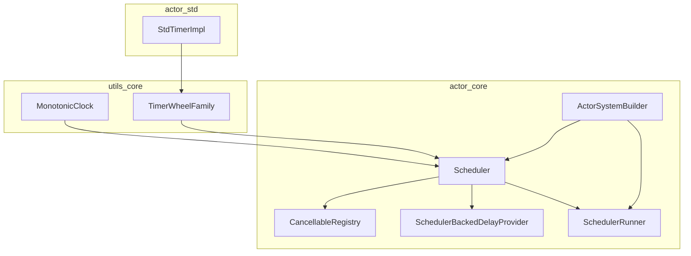
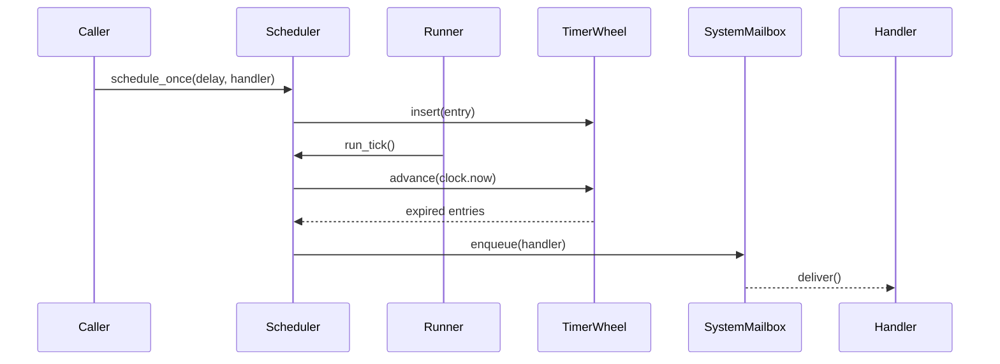
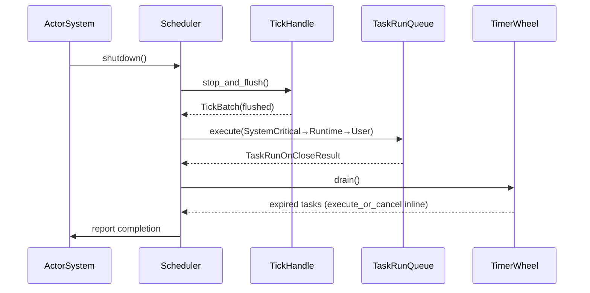
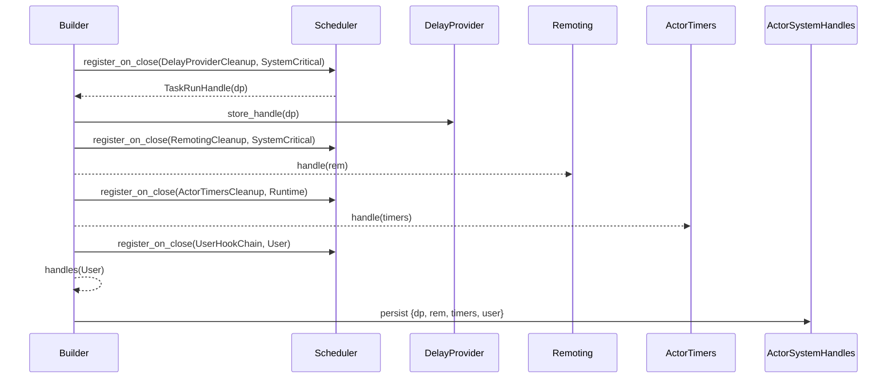
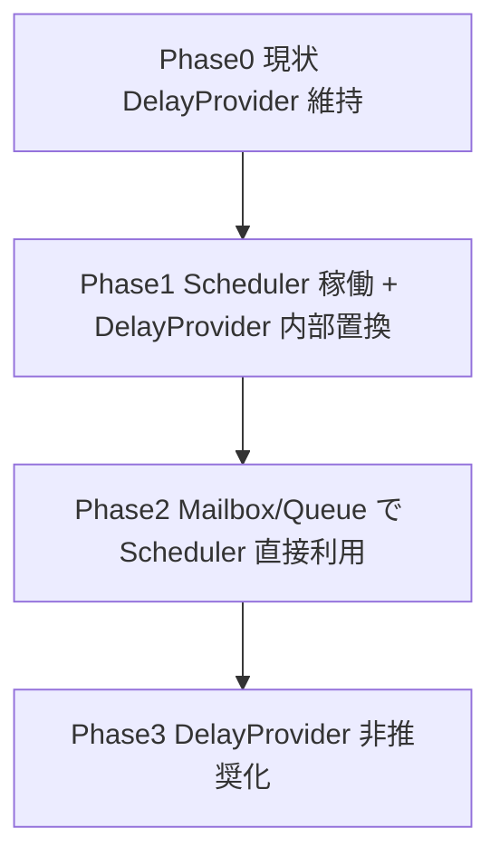
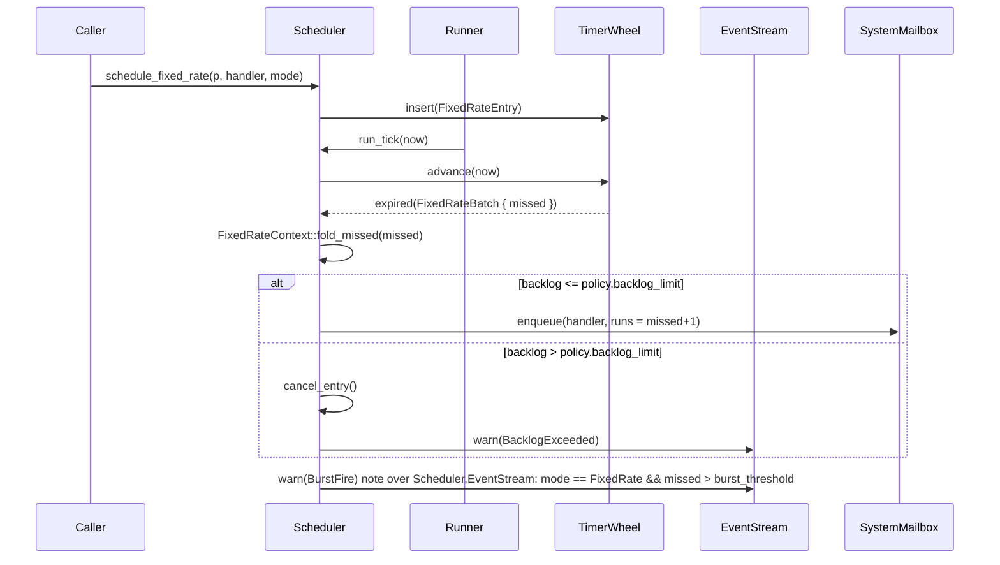

# Design Document

## Overview
本機能は Pekko 互換の Scheduler を fraktor-rs に導入し、ActorSystem 全体に deterministic なタイマー／周期実行基盤を提供する。ディスパッチャや mailbox、Remoting 等の内部機能が共通 Scheduler を介して遅延・周期処理を行えるようになり、Pekko と同じ API 契約（scheduleOnce／scheduleAtFixedRate 等）を Rust/no_std 環境で再現する。
利用者は ActorSystem 構築時に Scheduler を自動的に取得し、DelayProvider や system mailbox からの遅延実行が一貫したタイマー精度・観測性を得られる。導入により、従来個別実装だった DelayFuture も Scheduler 上の単発タイマーに集約され、診断や統計取得も統一される。

### Goals
- Pekko 互換 API（scheduleOnce/fixedRate/fixedDelay/cancelable）を ActorSystem に実装
- RuntimeToolbox 経由で monotonic clock と timer wheel を差し替え可能にする
- observability（EventStream, metrics, diagnostics）とテスト用仮想クロックを提供

### Non-Goals
- Quartz など長期ジョブスケジューラとの統合
- エンジン外部の cron 連携や分散スケジューラ機能
- Remoting プロトコルの具体実装（別 spec で扱う）

## Architecture

### Existing Architecture Analysis
- 依存方向: `utils-core → actor-core → actor-std` を維持。タイマー/クロックの Primitive は utils-core で提供し、actor-core は RuntimeToolbox を通じて利用する。
- 既存 DelayProvider/DelayFuture は mailbox/queue timeout で広く使用されており、破壊的変更を避けるため Scheduler ベースの実装に裏側のみ差し替える。
- EventStream / system mailbox など既存観測パスを再利用し、Scheduler から直接アクターへメッセージを push しない。

### High-Level Architecture

**Architecture Integration**
- 既存パターン: RuntimeToolbox を介した抽象、system mailbox 経由配送、EventStream ベース監視。
- 新規コンポーネント: `MonotonicClock`, `TimerWheelFamily`, `Scheduler`, `SchedulerRunner`, `SchedulerBackedDelayProvider`, `CancellableHandle`。
- 技術整合: utils-core に no_std 互換の TimerWheel と clock を実装し、std 実装は actor-std で `Instant::now()` を利用。
- `ToolboxTickSource` 抽象を RuntimeToolbox が提供し、tokio/embassy/SysTick などの実装詳細は utils-core（no_std）/actor-std の側へ完全に閉じ込める。actor-core からは `SchedulerTickHandle`（内部で `ToolboxTickSource` を wrap）を通じて `TickLease::try_pull()` で取得できる `TickEvent` のみを扱い、割り込みや async runtime の分岐は一切存在しない。
- Mailbox と同様の event loop パターンを SchedulerRunner が流用し、tick 供給は `SchedulerTickHandle` から pull するだけで済むため、no_std 環境でも `cfg(feature = "std")` を追加せずに済む。
- 階層分離: actor-core の責務は `TickEvent` を消費して TimerWheel を進め、SystemMailbox へ配送することに限定する。tokio task や ISR ハンドラの登録・解除は Toolbox 実装の責務となり、ステアリングで定義された no_std ファースト方針と完全に整合する。

### Technology Stack and Design Decisions
- `utils-core/time`: `MonotonicClock`（tick 64bit, resolution 指定）, `TimerInstant`, `TimerWheel`（固定長スロット + overflow priority queue）、`TimerEntryMode`。
- `RuntimeToolbox` 拡張: `type Clock`, `type Timer`, `fn clock(&self)`, `fn timer(&self)` に加えて `fn tick_source<'a>(&'a self) -> SchedulerTickHandle<'a>` を追加する。`SchedulerTickHandle<'a>` は Toolbox を借用したまま `TickLease<'a>` を生成し、lease が Drop されると自動的に tick driver を停止・破棄する。これにより `'static` へ固定せず ActorSystem 毎に独立した TickSource を確保でき、ManualClock や複数 ActorSystem を同一プロセスで安全に並行起動できる。Toolbox 側で tokio/embassy/SysTick などの割り込み登録・停止を完結させ、actor-core には `TickEvent { ticks: u32, mode: TickMode }` を pull する API だけを公開する。NoStdToolbox は SysTick/DWT/embassy の ISR から `ticks` をインクリメントする実装、actor-std は tokio タスクから同一インタフェースでイベントを push する実装を提供する。`SchedulerTickHandle` は `stop_and_flush()` を呼んだ時点で toolbox 内部のリソースを返却できるため、ActorSystem の shutdown と ManualClock 切替が安全に行える。

#### ToolboxTickSource Contract
- **イベントセマンティクス**: `ToolboxTickSource` は ISR/async task から呼ばれる `notify_tick()` で `pending_total: AtomicU32` を単調増加させるだけとし、deadline 計算や `ArrayVec` 等の確保は一切行わない。`SchedulerRunner` は `SchedulerTickHandle::borrow()` で取得する `TickLease` から `try_pull()` を呼び、`TickEvent { ticks, mode }` を受け取ったら `ticks` を `catch_up_chunk_ticks`（デフォルト 1024）単位に分割しつつ `deadline = last_deadline + resolution` を計算して `run_tick(deadline)` を連続実行する。これにより ISR の処理時間は O(1) に固定され、長時間停止後でも tick が失われない。
- **Flush/Stop**: `SchedulerTickHandle::stop_and_flush()` は (1) 割り込み/タスク登録を解除し新規 `notify_tick()` を遮断、(2) `pending_total` を原子的に読み取って `TickEvent::from_total()` を返し、(3) handle を Drop することで RuntimeToolbox 内部のリソースを即座に返却する。残 deadline の算出は Runner 側が一括で行うため determinism を維持したまま簡潔に停止できる。
- **Backpressure Reporting**: `SchedulerTickHandle::status()` は `TickSourceStatus::{Ok, Backpressured { ticks }, Suspended}` を返し、Runner は status 変化を `SchedulerDiagnostics::record_driver_status()` へ通知する。tick 消費が追いつかない場合でも値は飽和せず蓄積されるため、Backpressure への遷移は backlog を失わない前提で行える。
- Actor-side: `Scheduler<TB>` が timer wheel を poll して `SchedulerCommand` を処理、`SchedulerHandle` が `Cancellable` として利用可能。`SchedulerRunner` は `RunnerMode::{Manual, AsyncHost, Hardware}` を実装し、いずれのモードでも tick 取得は `SchedulerTickHandle` 経由で統一。バックプレッシャ変化を検知したら (a) backlog deadlines を全て `run_tick` で消化し、(b) `SchedulerBackpressureLink::raise(Driver)` を呼んで accepting_state を Backpressure へ遷移させる。backlog が閾値を下回れば `SchedulerBackpressureLink::clear(Driver)` で通常状態へ復帰させる。

##### ToolboxTickSource Implementation Notes
- **TickCounter**: `ToolboxTickSource` は `pending_total: AtomicU32` と `last_tick: TimerInstant` を保持し、`notify_tick()` は `pending_total.fetch_add(1, Ordering::AcqRel)` で終了する。ISR 内で追加メモリ確保を行わず、スタック使用量と実行時間を一定に保つ。
- **Catch-up Pull**: Runner は `TickLease::try_pull()` から `TickEvent { ticks, mode }` を受け取り、`TickChunkIter` が `catch_up_chunk_ticks`（デフォルト 1024）単位に分割した値を `run_tick` へ供給する。チャンクの最後で `mode` を更新し、Diagnostics へ backlog サイズを記録する。
- **Backpressure Hook**: queue/critical-section が飽和して `notify_tick()` が `Backpressured` を返した場合でも、driver 側は tick を破棄しない。Runner は `SchedulerTickHandle::status()` を監視し、`TickSourceStatus::Backpressured` を受信した時点で `SchedulerBackpressureLink::raise(Driver)` を呼び、タスク受理ポリシーを切り替えると同時に backlog をメトリクス化する。
- **ISR/Thread 安全性**: no_std モードでは `notify_tick()` が割り込みから呼ばれるため、加算のみの実装で最小限のクリティカルセクションに収める。std モードでは tokio タスクが `notify_tick()` を単純呼び出しするだけで済み、両者が同じ `SchedulerTickHandle` API を共有する。
- **テストハーネス**: ManualClock/Deterministic モードでは `SchedulerTickHandle::inject_manual_tick(n)` を提供し、本番と同じチャンク処理で catch-up を実行できるようにする。

###### Catch-up Backlog Configuration
- **容量計算**: `SchedulerConfig::catch_up_window_ms`（デフォルト 50ms）と `resolution_ns` から `catch_up_window_ticks = ceil(window / resolution)` を算出し、`SchedulerTickHandle` はこの値をメトリクスとして公開するだけで clamp は行わない。
- **Catch-up イベント**: backlog が `0.8 * catch_up_window_ticks` を超えると `TickEvent.mode = CatchUp` をセットし、Runner が受信直後に `SchedulerDiagnostics::record_catch_up(ticks)` を呼ぶ。Runner は `ticks` を順次計算して `run_tick` を実行し、±1 tick 以内で補償する。
- **Backpressure 連携**: backlog が `catch_up_window_ticks` を超えた状態でも tick を破棄せず、`SchedulerTickHandle::status()` が `TickSourceStatus::Backpressured { ticks }` を返して `SchedulerBackpressureLink::raise(Driver)` を即発火する。Backpressure が解除されるまでは `catch_up_chunk_ticks` を自動的に半減させ、イベントループの 1 周期時間を抑制する。
- **診断項目**: `SchedulerDiagnostics` に `tick_backlog_peak`, `tick_overflow_events` を追加し、backlog 設定値が適切かどうかを観測できるようにする。
- **飽和ポリシー**: `ticks > catch_up_window_ticks * 2` が連続 2 回観測された場合、Runner は `SchedulerWarning::DriverCatchUpExceeded { ticks }` を EventStream/Diagnostics へ送出し、`accepting_state = Rejecting` へ遷移して低優先度タイマーを fail-fast する。`ticks` が `catch_up_window_ticks / 2` 未満に戻ったら `SchedulerBackpressureLink::clear(Driver)` を呼び段階的に Normal へ戻す。
- **構成ガイド**: `catch_up_window_ticks = ceil((worst_case_pause_ns) / resolution_ns)` を Performance セクションに掲載し、Cortex-M（SysTick 1kHz, pause 3ms）では 3 tick、Linux host（resolution 10ms, pause 200ms）では 20 tick を推奨する。`SchedulerConfig::validate()` はハードウェア種別ごとの推奨上限表と照合し、上限を超えた設定に対して `SchedulerConfigError::CatchUpWindowTooLarge` を返す。

## Deterministic Execution Guarantees
- **FIFO Preservation**: `Scheduler::schedule_*` は `TimerCommandQueue`（lock-free `ToolboxMpscQueue` + 単調増加する `sequence_id`）に投入し、`run_tick` は `sequence_id` 昇順に `TimerWheel` へ登録する。各スロットは `SlotQueue`（固定長 `ArrayQueue`）で構成し、同一 tick で満期になったエントリは挿入順にデキューされることで Requirement 1 AC2 を満たす。
- **Tick Drift Budget**: `TimerWheelConfig` が `resolution_ns` と `drift_budget_pct`（既定 5%）を保持し、`SchedulerDiagnostics::drift_monitor` が `deadline` と `now` の差分を監視する。許容ドリフトを超過すると `SchedulerWarning::DriftExceeded { observed_ns }` を EventStream と診断ストリームへ送信し、R1 AC3 の決定的挙動を担保する。
- **max_frequency API**: `Scheduler::max_frequency()` は `Hertz::from_nanos(resolution_ns)` を返し、ActorSystemBuilder 経由で DelayProvider や subsystem へ共有する。`RuntimeToolbox` 実装は `TimerWheelConfig` を提供し、std/no_std 間で同一の上限値を保証する。
- **ManualClock Integration**: 決定論テストでは `ManualClock::advance(n)` が `run_tick` を同期実行し、`drift_monitor` をゼロドリフトに保つ。`deterministic_mode` はタスク ID と発火時刻をログし、Requirement 1 AC1 と Requirement 5 AC1-AC2 のリプレイ検証を実現する。
- **ClockKind 切替**: `MonotonicClock` trait に `fn kind(&self) -> ClockKind`（`Deterministic`, `RealtimeHost`, `RealtimeHardware`）を追加し、`SchedulerRunner` は `kind` に応じて `RunnerMode::Manual`（ManualClock が `advance` で tick 進行）、`RunnerMode::AsyncHost`（StdClock: tokio task が `SchedulerTickHandle::notify_tick()` を定期呼び出し）、`RunnerMode::Hardware`（no_std: SysTick/embassy ISR が同 API を直接叩く）を選択する。`drift_monitor` は `Deterministic` では 0 許容、`RealtimeHost/RealtimeHardware` では `drift_budget_pct` を適用しつつ driver が報告する `DriverJitter` を差し引いて監視する。
- **Drift Compensation Loop**: `RunnerLoop` は `TickLease::try_pull()` から取得した `TickEvent { ticks, mode }` を逐次消化し、チャンクごとに `run_tick(deadline)` を呼び出す。`drift_monitor` が `observed_ns > drift_budget_pct` を返した場合でも tick を欠落させず、`ticks` 分の catch-up 実行で `last_deadline` と `clock.now()` の差を 1 tick 以内へ押し戻す。queue が一時的に詰まっても TickSource は deadline を保持せず backlog を積むだけなので、`ExecutionBatch::missed_runs` は「Actor 側の処理遅延」に限定される。catch-up 期間中は `SchedulerDiagnostics::drift_compensations` を increment し、補償回数と Backpressure 状態を観測できるようにする。

**Key Design Decisions**
1. **Decision**: RuntimeToolbox へ clock/timer ファミリをぶら下げる抽象
   - **Context**: no_std / std 両対応かつ deterministic 動作が必要
   - **Alternatives**: (a) グローバル static タイマー、(b) DelayProvider 直接拡張、(c) Toolbox へ注入
   - **Selected**: (c) Toolbox へ `type Clock`/`type Timer`
   - **Rationale**: 依存方向を守りつつ差し替え容易。テストで ManualClock 実装が可能
   - **Trade-offs**: Toolbox API が増加、導入時に全 TB 実装の更新が必要
2. **Decision**: TimerWheel + overflow priority queue
   - **Context**: 数千単位のタイマーを no_std メモリ制約下で処理しつつ、長期遅延を扱う必要がある
   - **Alternatives**: (a) binary heap 単体, (b) hierarchical wheel, (c) 固定長 wheel + overflow priority queue
   - **Selected**: (c)
   - **Rationale**: 近傍期限は O(1) で処理し、wheel 範囲外は `BinaryHeap` に蓄積し threshold に達したら wheel へ再挿入することでドリフトを抑える
   - **Trade-offs**: 再挿入時に heap 操作コストが発生するが対象は遠未来タイマーに限定される
3. **Decision**: DelayProvider を Scheduler facade に置き換え
   - **Context**: 既存 mailbox timeout の互換性
   - **Alternatives**: (a) DelayProvider 廃止、(b) DelayProvider を scheduler wrapper、(c) DelayProvider を scheduler とは独立
   - **Selected**: (b)
   - **Rationale**: 既存 API を維持しながら実装を集約
   - **Trade-offs**: scheduler 実装が DelayProvider の追加要件を意識する必要がある

## System Flows
### タイマー登録と発火


### Shutdown/TaskRunOnClose


### SchedulerRunner モード切替
- `RunnerMode::Manual`（ManualClock, kind = Deterministic）: `ActorSystem` がテスト用 RuntimeToolbox を構築すると `SchedulerRunner` はハードウェアループを持たず、`ManualClock::advance` が `SchedulerTickHandle::borrow_manual()` を通じて `run_tick` を直接呼ぶ。`drift_monitor` はゼロドリフトを期待し、逸脱は即 `SchedulerWarning::DriftExceeded` となる。
- `RunnerMode::AsyncHost`（StdInstantClock, kind = RealtimeHost）: ActorSystemBuilder が std Toolbox を組み立てる際に tokio task を起動し、`resolution` ごとに `SchedulerTickHandle::notify_tick()` を呼ぶ。tokio 依存コードは actor-std 側の Toolbox 実装が保持し、actor-core は `SchedulerTickHandle` 抽象のみを参照する。
- `RunnerMode::Hardware`（SysTick/DWT/embassy, kind = RealtimeHardware）: RuntimeToolbox が `SchedulerTickHandle` を提供し、周期割り込みは `notify_tick()` で `pending_total` を加算するだけ。`RunnerLoop`（通常は scheduler 専用タスク）が `TickLease::try_pull()` で backlog を取得し、チャンク単位で `run_tick` を実行して SystemMailbox との同一コンテキストを保つ。ISR では加算のみのため、R4 AC1 の並行安全性と R1 AC1 の ±1 tick 制約を維持できる。
- いずれのモードでも `SchedulerLifecycleHook` と Diagnostics の API は共通で、切り替えは `MonotonicClock::kind()` と RuntimeToolbox の driver 実装を見るだけで完結する。

## Requirements Traceability
| Requirement | Summary | Components | Interfaces | Flows |
| --- | --- | --- | --- | --- |
| R1 | ドリフト制御・上限・エラー報告 | MonotonicClock, TimerWheelConfig, Scheduler | `schedule_once`, `max_frequency`, diagnostics API | Timer登録/発火フロー |
| R2 | 周期・fixedレート・保留 | Scheduler, TimerEntryMode, ExecutionBatch, CancellableRegistry | `schedule_fixed_rate`, `schedule_fixed_delay`, `SchedulerBatchContext::current` | Timer登録/発火フロー |
| R3 | Toolbox連携・TaskRunOnClose | RuntimeToolbox, SchedulerLifecycleHook, DispatcherSenderShared | `RuntimeToolbox::timer`, `Scheduler::shutdown`, `DispatcherSenderShared::resolve_from_context` | Shutdown/Dispatcher 解決フロー |
| R4 | 並行安全・メトリクス | CancellableRegistry, EventStreamAdapter | `SchedulerHandle`, `emit_warning` | Timer登録/発火 |
| R5 | テスト/診断 | ManualClock, DiagnosticsRecorder, DumpFormatter | `SchedulerDiagnostics::enable`, `ManualClock::advance` | Timer登録/発火, Shutdown |

## Components and Interfaces
### utils_core/time
- **MonotonicClock**: `fn now(&self) -> TimerInstant`; 実装: `SysTickClock`, `StdInstantClock`。`TimerInstant` は `ticks: u64`, `resolution_ns: u32`。
- **TimerWheelFamily**: `fn insert(&self, entry: TimerEntry) -> TimerHandleId`, `fn cancel(&self, id)`, `fn poll_expired(&self, cx) -> Poll<ExpiredEntry>`。内部で固定長 wheel を tick で進め、範囲外のエントリは `BinaryHeap` + `ArrayVec` で保持し threshold 到達時に wheel へ再挿入する。
- **TimerWheelMemoryPlan**: `SchedulerCapacityProfile`（後述）から `system_quota`/`overflow_capacity` を選び、ActorSystemBuilder が RuntimeToolbox に `scheduler_arena(profile)` を要求して実メモリを確保する。std 環境では `SchedulerArena` が `Vec<MaybeUninit<TimerEntry>>`/`Vec<OverflowEntry>` を生成し、no_std 環境では `ToolboxMemory::carve_scheduler_region(bytes)` が返す `&'static mut [MaybeUninit<u8>]` を `SlotArena`/`OverflowPool` へ割り当てる。いずれもランタイム構築時に容量を決定し、const generics に依存しない。容量を超える `system_quota` が指定された場合は **Builder 起動時にエラー** を返して fail-fast し、実行中に silent drop が発生しないようにする。Overflow が満杯になったときのみ `PriorityDropQueue` が `Low → Normal → High` の順にキャンセルし、EventStream へ `SchedulerWarning::DroppedLowPriority` を通知する。
- **TimerEntry**: `TimerEntryMode`（OneShot/FixedRate/FixedDelay）、`deadline: TimerInstant`, `payload: TimerAction`。
- **ManualClock/ManualTimer**: テスト用実装。`advance(duration)` で wheel を強制 tick。
- **TickSourceStatus**: `SchedulerTickHandle` は `status()` で `TickSourceStatus::{Ok, Backpressured { ticks }, Suspended}` を返す。`Backpressured` はクリティカルセクションの飽和や ISR 遅延により backlog が `catch_up_window_ticks` を超えたことを示し、RunnerLoop が即座に catch-up と Backpressure 遷移を行うシグナルとなる。`Suspended` は `stop_and_flush()` 実行中の状態を意味し、`Scheduler::shutdown` が TaskRunOnClose を開始しても新規 tick が入らないことを保証する。

#### SchedulerCapacityProfile
| Profile | system_quota (timers) | overflow_capacity | task_run_capacity | 想定ターゲット |
| --- | --- | --- | --- | --- |
| Tiny | 2,048 | 512 | 128 | Cortex-M class (<=256 KB RAM) |
| Small | 4,096 | 1,024 | 256 | 小規模 RTOS / 単一ボード |
| Standard | 10,240 | 2,560 | 512 | 一般的なホスト (Tokio) |
| Large | 25,600 | 6,400 | 1,024 | 多数の subsystem を持つ制御面 |

ActorSystemBuilder は `SchedulerConfig::capacity_profile` により上記いずれかを選択し、RuntimeToolbox が返す `SchedulerArena` から `system_quota` を決定する。カスタム構成が必要な場合は `profile = Custom { system_quota, overflow_capacity, task_run_capacity }` を指定できるが、各値は表の最大値を上回れず、ビルド時検証（`SchedulerConfig::validate_capacity`）に失敗すると起動が中断される。これによりランタイム設定が変わっても再コンパイル不要で、Pekko 互換 API のままターゲットごとに容量を調整できる。

### utils_core/delay
- **SchedulerBackedDelayProvider**: 既存 DelayProvider を実装し、`scheduler.schedule_once(duration, DelayFutureWaker)` を内部的に使用。`DelayFutureWaker` は `ExecutionBatch` を必ず受け取り、`runs` と `missed_runs` を DelayFuture の `StateMachine` へ伝搬してミス Tick 折り畳みや drift ログを生成する。
- **DelayFuture**: 変更点は handle/cancel を新 Scheduler ハンドルに委譲しつつ、`ExecutionBatch` を観測して `poll` が `missed_runs > 0` の場合に 1 回の Wake へ集約する。API は従来どおり `Future<Output = ()>` を維持し、追加情報は diagnostics へ流す。

### actor_core/scheduler (Untyped レイヤー)
- **Scheduler<TB>**: `fn schedule_once`, `fn schedule_fixed_rate`, `fn schedule_fixed_delay`, `fn cancel(handle)`、`fn run_tick(&mut self, now: TimerInstant)`。内部に `TimerCommandQueue`, `CancellableRegistry`, `TaskRunOnCloseQueue`, `OverflowReinserter` を持つ。
- **SchedulerHandle**: `impl Cancellable`。`cancel()` は registry を通じて TimerWheel と同期。
- **SchedulerRunner**: MailboxDispatcher と同じ event-loop パターンで Scheduler を駆動。テスト時は `RunnerMode::Manual` が `ManualClock::advance` から `SchedulerTickHandle::inject_manual_tick` を呼ぶ。std 環境は `RunnerMode::AsyncHost` が tokio task で `SchedulerTickHandle::notify_tick()` を発火し、no_std/embassy は `RunnerMode::Hardware` が ISR から同 API を呼ぶ。`RunnerLoop` は `TickLease::try_pull()` で backlog を取得して `run_tick` を実行する。
- **SchedulerTaskContract**: すべての内部タスクは `trait SchedulerTask { fn run(&self, batch: ExecutionBatch) -> Result<(), HandlerError>; }` を実装し、`ExecutionBatch { runs: NonZeroU32, missed_runs: u32, mode: BatchMode(OneShot|FixedRate|FixedDelay) }` を介して周期情報を共有する。公開 API は Pekko と同一だが、SystemMailbox がメッセージ/Runnable をデキューするときに `SchedulerBatchContext::push(batch, completion)` を呼び、実行完了後に Drop される `BatchGuard` が自動で pop する。guard は std では thread-local、no_std では `RuntimeToolbox::task_local_slot()` の上に構築され、割り込み安全に batch を保管する。
- **TaskRunMemoryPlan**: `TaskRunOnCloseQueue` は `SchedulerCapacityProfile` に紐づく `task_run_capacity` で初期化され、`heapless::binary_heap::BinaryHeap<TaskRunHandle>`（no_std） / `Vec<TaskRunHandle>`（std）を `SchedulerArena` が供給する。`register_on_close` は空きスロットをアトミックに予約し、満杯の場合は **登録時に** `SchedulerError::TaskRunCapacityExceeded` を返して fail-fast する。これにより shutdown 時にタスクがドロップされることはなく、登録側がガイドラインどおり容量超過を検知して再構成できる。capacity/priority は `SchedulerConfig::task_run_policy` で上書き可能。
- **SchedulerPolicyRegistry**: ActorSystemBuilder が `SchedulerPolicyRegistry` を生成し、`SchedulerAffinity`（dispatcher, guardian, subsystem 等）単位で `PriorityProfile` と `FixedRatePolicy { backlog_limit, burst_threshold }` を登録する。公開 API (`schedule_once`, `schedule_at_fixed_rate`, など) からは追加引数を受け取らず、Registry が dispatcher/receiver から該当プロファイルを解決して `priority` や `backlog_limit` を注入する。ユーザが個別設定を行いたい場合は Builder でポリシーを上書きしつつ、Pekko 互換シグネチャは維持される。
- **SchedulerDiagnostics**: 決定論モードログ、dump 生成、EventStream 通知。
- **SchedulerLifecycleHook**: ActorSystem shutdown 時に `Scheduler::shutdown` を呼び、(1) `SchedulerTickHandle::stop_and_flush()` で tick 供給を停止、(2) 残り backlog を Runner 内で即座に消化、(3) TaskRunOnClose を優先度順に実行、(4) TimerWheel を drain した結果を Scheduler 内で直接 `run_or_cancel` し、SystemMailbox へ新規 enqueue しない。driver 停止完了までは新規 tick を `Pending` 状態で保持し、完了後に破棄して R3 AC3/AC7 を満たす。

#### TaskRunOnClose API
- **TaskRunOnClose**: `trait TaskRunOnClose { fn run(&self, batch: ExecutionBatch) -> Result<(), HandlerError>; }`。Scheduler 内部の cleanup、DelayProvider、Remoting が実装し、shutdown 中に deterministic に実行される。
- **優先度**: `TaskRunPriority`（`SystemCritical`, `Runtime`, `User`）を導入。`TaskRunOnCloseQueue` は `(priority, sequence_id)` をキーにした `BinaryHeap` で、優先度降順・同順位は登録順 FIFO を保証する。
- **登録/解除 API**: `pub fn register_on_close(&self, task: ArcShared<dyn TaskRunOnClose>, priority: TaskRunPriority) -> TaskRunHandle`。`SchedulerState::Active` でのみ登録を許可し、`TaskRunHandle` により `cancel_on_close(handle)` も提供する。`SchedulerState::ShuttingDown` 以降は `SchedulerError::Shutdown` を返し、新規登録を拒否する。
- **実行フロー**: `Scheduler::shutdown` は Driver 停止→catch-up drain の直後に `TaskRunOnCloseQueue` を実行し、結果を `TaskRunOnCloseResult { succeeded, failed }` に集計する。失敗時も後続タスクは継続し、`SchedulerWarning::TaskRunFailed { task_id, error }` を EventStream/Diagnostics へ送出する。
- **観測**: Diagnostics に `task_run_on_close_total`, `task_run_on_close_failures`, `task_run_on_close_duration` を追加し、CI/運用で shutdown パスを検証できるようにする。
- **登録責務**: `ActorSystemBuilder` は以下の順に `register_on_close` を呼び出す。
  1. `DelayProvider::new`（SystemCritical）: pending delay futures を wake / cancel するタスク。
  2. `Remoting::init`（SystemCritical）: heartbeat/transport タイマーの停止と quarantined authority の flush。
  3. `ActorTimers`（Runtime）: `Context::schedule_*` 経由で生成された per-actor タイマーのキャンセル。
  4. `UserHookRegistry`（User）: ユーザが `ActorSystem::on_shutdown` で登録した cleanup。
  Builder は各 `TaskRunHandle` を `ActorSystemHandles` に保存し、`ActorSystem::terminate` で順序付きに `Scheduler::shutdown` へ渡す。

### actor_core/typed/scheduler (Typed レイヤー)
- **TypedScheduler<TB>**: Untyped Schedulerをラップしてタイプセーフにする責務です。
- **SchedulerHandle<TB>**: Untyped SchedulerHandleをラップしてタイプセーフにする責務です。

##### TaskRunOnClose Registration Sequence

このシーケンスにより、`ActorSystem::terminate` が呼ばれると Builder が保持している handles を `Scheduler::shutdown(TaskRunContext { handles })` へ渡し、Requirement 3 AC6 の「close 中に TaskRunOnClose をすべて実行する」ことを検証可能にする。

`TimerWheel::drain()` で収集した未処理タスクは Scheduler 内部で `run_in_shutdown` ハーネスを通じて順次実行または `CompletionHandle::cancel()` を呼んでキャンセルする。SystemMailbox や Dispatcher へは新規 enqueue を行わず、shutdown フェーズの決定性を保ったまま R3 AC3/R3 AC7 を満たす。ハーネスは `BatchGuard::from_shutdown(handle, batch)` を生成してタスクを実行し、実行完了／キャンセルのどちらでも guard が drop されることで `ack_complete` が走るため、FixedDelay/TaskRunOnClose の完了セマンティクスと完全に一致する。


#### Pekko API シグネチャ写像

Untyped API は `modules/actor-core/src/scheduler/api.rs`（`Scheduler` 実装）に配置し、Typed 版は `modules/actor-core/src/typed/scheduler.rs`（`TypedScheduler`）で Untyped API への facade として提供する。公開ドキュメント/ガイドでは Untyped/Typed それぞれのエントリポイントを別節に記載し、Pekko 互換コードが参照すべきモジュールを明示する。
ほとんどのロジックはUntyped APIとして実装され、Typed APIは薄いラッパーとなります。

#### Untyped API (Untyped `Scheduler`)

| Pekko Scheduler API (Scaladoc) | Rust public API シグネチャ案                                                                                                                                                                                                           | Actor 配送セマンティクス | 備考 |
| --- |----------------------------------------------------------------------------------------------------------------------------------------------------------------------------------------------------------------------------------| --- | --- |
| `scheduleOnce(delay, receiver, message, dispatcher, sender)`  | `pub fn schedule_once(delay: Duration, receiver: ActorRefGeneric<TB>, message: AnyMessageGeneric<TB>, dispatcher: Option<DispatcherSenderShared<TB>>, sender: Option<ActorRefGeneric<TB>>) -> Result<SchedulerHandle, SchedulerError>`                | SystemMailbox が `AnyMessage` を既存の `DispatcherEnvelope` 形式のまま投函し、並列して `SchedulerBatchContext` へ `ExecutionBatch::once()` をプッシュ。 | Backpressure/Quota/InvalidDelay 時は `Result` で失敗を返す。`dispatcher == None` の場合は Context/System が提供する既定 `DispatcherSenderShared` を使用。 |
| `scheduleAtFixedRate(initialDelay, interval, receiver, message, dispatcher, sender)` | `pub fn schedule_at_fixed_rate(initial_delay: Duration, interval: Duration, receiver: ActorRefGeneric<TB>, message: AnyMessageGeneric<TB>, dispatcher: Option<DispatcherSenderShared<TB>>, sender: Option<ActorRefGeneric<TB>>) -> Result<SchedulerHandle, SchedulerError>` | `FixedRateContext` が `missed_runs` を保持し、SystemMailbox が `ExecutionBatch { runs, missed_runs, mode: FixedRate }` をバッチコンテキストへ push。 | Backpressure/InvalidDelay は `Result` で通知。backlog `k` 調整は `schedule_at_fixed_rate_with_options` 経由。 |
| `scheduleWithFixedDelay` | `pub fn schedule_with_fixed_delay(initial_delay: Duration, delay: Duration, receiver: ActorRefGeneric<TB>, message: AnyMessageGeneric<TB>, dispatcher: Option<DispatcherSenderShared<TB>>, sender: Option<ActorRefGeneric<TB>>) -> Result<SchedulerHandle, SchedulerError>` | FixedDelayContext が `inflight_guard` を保持し、SystemMailbox が payload を `BatchGuard` でラップして Dispatcher 実行完了時に自動で `ack_complete`。 | Backpressure/InvalidDelay は `Result` で通知。backlog `k` 調整は `schedule_with_fixed_delay_with_options` 経由。 |
| `scheduleOnce(delay, runnable, executor)` 等 Runnable 版 | `pub fn schedule_once_fn<F>(delay: Duration, dispatcher: Option<DispatcherSenderShared<TB>>, sender: Option<ActorRefGeneric<TB>>, f: F) -> Result<SchedulerHandle, SchedulerError> where F: BatchAwareRunnable`                                       | Runnable 版は `BatchAwareRunnable::run(&self, batch: ExecutionBatch)` を必須とし、SystemMailbox は Runnable 実行前に `SchedulerBatchContext` へ batch を push する。`impl<F> BatchAwareRunnable for F where F: Fn(ExecutionBatch) + Send + 'static` を提供しているため、Pekko の Runnable 相当（あるいはクロージャ）をそのまま渡せる。FixedDelay モードでも guard が drop で自動 ACK するため、Runnable 側は batch を読むだけでよい。 | Runnable/Future でも Backpressure/Quota/InvalidDelay を `Result` で受け取り、`dispatcher` 未指定時は ActorSystem/Context が渡す default `DispatcherSenderShared` を使用する。 |

#### Typed API (Typed `TypedScheduler`)

| Pekko Scheduler API (Scaladoc) | Rust public API シグネチャ案                                                                                                                                                                                                                                                                                            | Actor 配送セマンティクス | 備考 |
| --- |-------------------------------------------------------------------------------------------------------------------------------------------------------------------------------------------------------------------------------------------------------------------------------------------------------------------| --- | --- |
| `scheduleOnce(delay, receiver, message, dispatcher, sender)` | `pub fn schedule_once<M: SchedulerMessage, S: SchedulerMessage>(delay: Duration, receiver: TypedActorRefGeneric<M, TB>, message: M, dispatcher: Option<DispatcherSenderShared<TB>>, sender: Option<TypedActorRefGeneric<S, TB>>) -> Result<SchedulerHandle, SchedulerError>`                                      | `TypedScheduler` が Untyped `Scheduler::schedule_once` を内部呼び出しする薄いラッパ。Typed Actor は `ctx.scheduler_batch()` で同じ `ExecutionBatch` を参照できる。 | Typed ヘルパは dispatcher/sender を `TypedActorContext` から解決し、必要に応じて `dispatcher`/`sender` を上書き指定できる。sender 未指定時は `ctx.self()` にフォールバック。 |
| `scheduleAtFixedRate` | `pub fn schedule_at_fixed_rate<M: SchedulerMessage, S: SchedulerMessage>(initial_delay: Duration, interval: Duration, receiver: TypedActorRefGeneric<M, TB>, message: M, dispatcher: Option<DispatcherSenderShared<TB>>, sender: Option<TypedActorRefGeneric<S, TB>>) -> Result<SchedulerHandle, SchedulerError>` | `TypedScheduler` が Untyped API を呼び出す facade。Typed Context は `dispatcher`/`sender` を暗黙取得し、必要なら引数で上書きできる。 | backlog 調整は `ctx.schedule_at_fixed_rate_with_options(options)` で実現し、最終的には Untyped `schedule_at_fixed_rate_with_options` を呼ぶ。 |
| `scheduleWithFixedDelay` | `pub fn schedule_with_fixed_delay<M: SchedulerMessage, S: SchedulerMessage>(initial_delay: Duration, delay: Duration, receiver: TypedActorRefGeneric<M, TB>, message: M, dispatcher: Option<DispatcherSenderShared<TB>>, sender: Option<TypedActorRefGeneric<S, TB>>) -> Result<SchedulerHandle, SchedulerError>` | `TypedScheduler` が Untyped API を呼び出す facade。 | options 付き呼び出しは `ctx.schedule_with_fixed_delay_with_options(options)` を通じて Untyped ヘルパへ委譲。 |
| `scheduleOnce(delay, runnable, executor)` 等 Runnable 版 | `pub fn schedule_once_fn<M: SchedulerMessage, F>(delay: Duration, dispatcher: Option<DispatcherSenderShared<TB>>, sender: Option<TypedActorRefGeneric<M, TB>>, f: F) -> Result<SchedulerHandle, SchedulerError> where F: TypedBatchAwareRunnable`                                                                 | Runnable 版は `BatchAwareRunnable::run(&self, batch: ExecutionBatch)` を必須とし、SystemMailbox は Runnable 実行前に `SchedulerBatchContext` へ batch を push する。`impl<F> BatchAwareRunnable for F where F: Fn(ExecutionBatch) + Send + 'static` を提供しているため、Pekko の Runnable 相当（あるいはクロージャ）をそのまま渡せる。FixedDelay モードでも guard が drop で自動 ACK するため、Runnable 側は batch を読むだけでよい。 | Runnable/Future でも Backpressure/Quota/InvalidDelay を `Result` で受け取り、`dispatcher` 未指定時は ActorSystem/Context が渡す default `DispatcherSenderShared` を使用する。 |

Typed API 群は `modules/actor-core/src/typed/scheduler.rs` の `TypedScheduler` が提供し、内部で `TypedActorRefGeneric::*into_untyped()` を用いて Untyped `ActorRefGeneric<TB>` へ変換した後、同名の `Scheduler` API を呼び出す。Typed sender を省略した場合は `TypedActorContext::self()` を既定として採用し、同様に Untyped へ橋渡しする。Runnable 版 sender の型パラメータは Runnable 本体とは独立 (`S` パラメータ) であり、Pekko Typed の `sender()` セマンティクスを保つ。

TypedScheduler の実装イメージは `pub struct TypedScheduler<TB> { inner: Scheduler<TB> }` であり、Typed API が受け取った `TypedActorRef`／Typed コンテキスト情報を Untyped 形式へ変換してから `inner` の `Scheduler` に処理を委譲する。Typed 側で追加ロジックを持たず、あくまで薄い facade として Untyped API を再利用する方針を設計上明記しておく。

##### SchedulerCapabilities / maxFrequency API（Pekko 互換）
- `Scheduler` は Pekko `Scheduler#maxFrequency` と同等の `pub fn capabilities(&self) -> SchedulerCapabilities` を公開する。`SchedulerCapabilities { max_frequency_hz: u32, min_delay_ticks: u32, tick_resolution_ns: u64, supported_modes: SchedulerModes }` を返し、RuntimeToolbox が提供する `TimerWheelConfig` と `TickSourceConfig` から値を導出する。
- `max_frequency_hz` は `1_000_000_000 / (tick_resolution_ns * catch_up_window_scalar)` を上限として算出し、DelayProvider や Remoting heartbeat が周期設定前にハードリミットを検証できるようにする。`min_delay_ticks` は wheel の `resolution_ns` と `TimerEntryMode` から導出し、Pekko での `IllegalArgumentException` と同じガードを Rust 側でも行う。
- `supported_modes` には `{ fixed_rate: bool, fixed_delay: bool, manual_clock: bool }` を含め、no_std Toolboxes で未対応のモードがある場合は false を返す。これにより embed ターゲットで未実装モードを compile-time feature ではなく runtime 能力チェックで安全に拒否できる。
- `SchedulerConfig::validate()` は capabilities に一貫性があること（例: `max_frequency_hz > 0`, `min_delay_ticks >= 1`）を保証し、`system.scheduler().capabilities()` を通じて documentation/CLI/診断に露出する。Requirements Traceability に R1 AC6 の行を追加し、Pekko 仕様との互換性が担保されることを明記する。

##### FixedRate/FixedDelay Options
- **構造体**: `pub struct FixedRateOptions { pub backlog_limit: NonZeroU32, pub burst_threshold: NonZeroU32, pub priority_override: Option<PriorityClass> }` と `FixedDelayOptions`（`backlog_limit`, `priority_override`, `user_metadata` 等）を導入する。既定値は `FixedRateOptions::from_policy(SchedulerPolicyRegistry, affinity)` が返すプロファイルを用い、呼び出し側が `options` を明示した場合は Requirement R2 AC6 の `k` を 1:1 で `backlog_limit` に反映する。
- **Pekko 互換性**: Scala API と同じシグネチャを維持するため、Canonical API には options を追加しない。かわりに Untyped API に `schedule_at_fixed_rate_with_options` / `schedule_with_fixed_delay_with_options` を追加し、こちらが `FixedRateOptions`/`FixedDelayOptions` を受け取って Canonical API + policy override を実行する。Untyped/Typed 各ラッパは `ctx.schedule_at_fixed_rate_with_options(options)` のような helper を提供し、必要なときだけ options 呼び出しへ委譲する。
- **Registry 連携**: `SchedulerPolicyRegistry` は dispatcher/guardian 単位の既定 `backlog_limit` を保持しつつ、`options.backlog_limit` が指定されればそれを優先する。これにより、Remoting heartbeat は厳しい `k`、ユーザタスクは緩い `k` といった細粒度制御が可能になり、R2 AC6 の「呼び出し側指定」を満たす。
- **ヘルパ API 仕様**:
  - Untyped: `Scheduler::schedule_at_fixed_rate_with_options(initial_delay: Duration, interval: Duration, receiver: ActorRef, message: AnyMessage, dispatcher: Option<DispatcherSenderShared<TB>>, sender: Option<ActorRef>, options: FixedRateOptions) -> Result<SchedulerHandle, SchedulerError>` と `schedule_with_fixed_delay_with_options` を `modules/actor-core/src/scheduler/api.rs` に追加する。Canonical API と同じ戻り値およびエラー型で、`options.backlog_limit` などを `FixedRateContext` へ反映する。
  - Typed: `TypedScheduler::schedule_at_fixed_rate_with_options<M: SchedulerMessage, S: SchedulerMessage>(..., receiver: TypedActorRef<M>, message: M, dispatcher: Option<DispatcherSenderShared<TB>>, sender: Option<TypedActorRef<S>>, options: FixedRateOptions)` を `modules/actor-core/src/typed/scheduler.rs` に追加し、内部で Untyped 版へ委譲する。同様に FixedDelay 版を用意する。Untyped/Typed 双方の `ActorContext` にはこれらヘルパを呼ぶ facade（`ctx.schedule_at_fixed_rate_with_options(options)` 等）を提供する。
  - Requirements Traceability（R2 行）には「with_options API 経由で backlog_limit/backlog_limit を指定可能」と追記し、R2 AC6 を満たす経路を明確化する。

##### DispatcherSender と公開 API 互換性
- **DispatcherSenderShared**: `pub struct DispatcherSenderShared<TB> { sender: ArcShared<DispatcherSenderGeneric<TB>> }` を導入し、Pekko の ExecutionContext が担っていた dispatcher 送信責務のみを表す。`DispatcherSenderGeneric<TB>` は既存実装（`modules/actor-core/src/dispatcher/dispatcher_sender.rs`）をそのまま利用し、`ArcShared` で共有する。sender は canonical API の独立引数として維持し、DispatcherResolver（旧 DispatcherRegistry 相当）が dispatcher ID から `DispatcherSenderShared` を解決する。
- **API 形状（Canonical）**: 公開 API は Pekko と同じ `schedule_once(delay, receiver, message, dispatcher, sender)` 形式を維持しつつ、Rust 実装では `dispatcher: Option<DispatcherSenderShared<TB>>` を受け取る。`None` の場合は「呼び出し元コンテキストに紐づく dispatcher sender」を解決する。ActorContext から呼ばれた場合は当該アクターの `Props::dispatcher()`（未指定なら guardian 既定）を参照し、ActorSystem などコンテキストがない場合は System default（Builder で設定）を返す。`sender` は従来どおり `Option<ActorRefGeneric<TB>>` を独立引数として渡し、Pekko シグネチャを崩さない。
- **取得経路**:
  - Untyped ActorContext: `Context::dispatcher_sender()` が `self.cell.props().dispatcher_id()` を DispatcherResolver へ渡して `DispatcherSenderShared<TB>` を生成する。`with_dispatcher("pekko.remote.default")` のような設定もそのまま引き継がれる。
  - Typed Context: Untyped Context を wrap した `TypedContext::dispatcher_sender()` を用意し、Untyped と同じ `DispatcherSenderShared` を返すだけに留める。
  - System/Subsystem: `ActorSystem::dispatcher_sender(name: Option<&str>)` を公開し、`Some(name)` なら DispatcherResolver から該当 sender を取得、`None` なら System default を返す。DelayProvider や Remoting はこの API を通じて Pekko と同じ dispatcher 名を指定できる。
- **互換性/移行**: `Into<Option<DispatcherSenderShared<TB>>>` を受けることで `DispatcherId` 直渡しから段階的に移行できる。Requirement R3 AC5 のトレースも `DispatcherSenderShared` を参照する形へ更新する。

##### Canonical API とラッパ層の役割分担
- **Canonical（Untyped 主導）**: `actor-core::scheduler::api` に実装される関数群（`schedule_once`, `schedule_at_fixed_rate`, ...）が単一の真実であり、SystemMailbox/Remoting/DelayProvider など Untyped サブシステムから直接利用する。ここで `DispatcherSenderShared` を解釈し TimerWheel 登録までを完結させる。R2 AC6 の per-job backlog 指定は Untyped API 上に `schedule_at_fixed_rate_with_options`, `schedule_with_fixed_delay_with_options` といった拡張ヘルパを提供し、Canonical 呼び出しは Pekko 互換シグネチャを維持する。
- **Typed ラッパ**: `actor-core::typed::context` では Untyped Context への委譲を行うだけの薄いメソッド（`typed_ctx.schedule_once(...)`）を提供する。内部実装は Untyped API 呼び出しで、追加ロジックは持たない。Typed 層が独自に scheduler 機能を実装しないことで、Remoting 実装など Untyped 依存コンポーネントとの一貫性を維持し、再利用性を高める。
- **Builder/Facade**: ActorSystemBuilder や DelayProvider など他サブシステムが使う helper も Untyped API を薄く wrap し、DispatcherShared の既定を注入するだけに留める。R2 AC6 のための options 指定もこれら helper が `schedule_*_with_options` を呼ぶ形で提供し、Canonical API 自体は変更しない。これにより「Untyped が主導、Typed は facade」というスタイルと Pekko 互換要件を同時に満たす。

`SchedulerBatchContext` は std では thread-local、no_std では `RuntimeToolbox::task_local_slot()`（critical-section + per-task スロット）上に構築した `TaskLocalBatch` で実装する。SystemMailbox は message/Runnable をデキューする直前に `SchedulerBatchContext::push(ExecutionBatch, CompletionHandle)` を呼び、Drop 時に `CompletionGuard` が `ack_complete` をトリガする。Actor は `Context::scheduler_batch()`、Typed wrapper は Untyped Context から取得した batch をそのまま返す。Runnable は `BatchAwareRunnable::run(&self, batch: ExecutionBatch)`、DelayFuture は `DelayFuture::current_batch()` でメタデータを参照でき、公開シグネチャを変えず Requirement R2 AC2/AC4/AC5 を満たす。

##### ExecutionBatch / CompletionGuard 契約
- **メッセージ配送**: メッセージ型 `M` はそのまま mailbox に流れ、`SchedulerMessageExt::batch(&self)` が `ExecutionBatch` を task-local から参照する。`ExecutionBatch` は `Copy` で、アプリケーションがログやメトリクスへ転送できる。
- **Runnable/Task**: Runnable 版 API は `pub trait BatchAwareRunnable { fn run(&self, batch: ExecutionBatch); }` を必須とし、SystemMailbox が Runnable を `BatchGuard` で包んで実行します。`BatchGuard` は drop 時に `ack_complete` を呼び出すため、ユーザコードは completion を意識せずに `missed_runs` 等のメタデータのみを参照すればよい設計とします。
- **CompletionGuard**: `CompletionHandle`（内部 ID）は `BatchGuard` が保持し、公開 API では露出させません。FixedDelay や TaskRunOnClose は guard が完了時刻を計測して `Scheduler::ack_complete(handle, finished_at)` を自動発火し、要件 R2 AC4 をアプリケーション変更なしで満たします。
- **Task local の安全網**: `SchedulerBatchContext::current()` は `Option<BatchContext>` を返し、std では thread-local、no_std では後述の `RuntimeToolbox::task_local_slot` から取得した `ToolboxTaskLocalSlot` を使って `ExecutionBatch` + `CompletionHandle` を保存する。slot が提供されない極小環境では builder 形 API で `ExecutionBatch` を明示受け渡しする fallback を利用する。
- **ドキュメント更新**: Requirements Traceability の R2 行へ `ExecutionBatch + BatchGuard` を追記し、ユーザ向けガイド（docs/guides/scheduler.md）には「FixedDelay は guard により自動で完了検知される」ことを明記する。

###### RuntimeToolbox::task_local_slot 契約
- `RuntimeToolbox` に `fn task_local_slot<'a>(&'a self) -> Option<ToolboxTaskLocalSlot<'a>>` を追加する。`ToolboxTaskLocalSlot<'a>` は `fn try_acquire(&'a self) -> TaskLocalHandle<'a>`、`fn release(handle: TaskLocalHandle<'a>)` を提供し、handle が Drop されると自動で release される。これによりタスクローカルのライフタイムが ActorSystem/RuntimeToolbox に束縛され、グローバル static を使わずに複数 ActorSystem を同居させられる。
- TaskLocalHandle は `capacity_bytes`, `supports_interrupt` フラグを公開し、`SchedulerBatchContext` は `size_of::<ExecutionBatch>() + size_of::<CompletionHandle>() <= capacity` かつ `supports_interrupt == true` の場合のみ割り込み上下で共有する。容量が不足するターゲットでは `task_local_slot()` が `None` を返し、後述の fallback へ切り替わる。
- Fallback: slot が利用できない場合、`SchedulerCommand::EnqueueDelayed` の payload に `ExecutionBatch` をインラインで含め、SystemMailbox がメッセージ構築時に batch をそのまま ActorContext へ渡す。これにより ManualClock を含む全ターゲットで `ctx.scheduler_batch()` が常に `Some(batch)` を返し、R2 AC2/AC4 の「missed_runs を届ける/完了時刻で遅延を測る」を no_std でも満たせる。
- Toolbox 実装は Pekko 互換仕様に合わせ、slot の acquire/release が FIFO である必要はないが、`TaskLocalHandle` を同一タスク内で再利用しない（＝毎回 acquire/deallocate）ことを保証する。`actor-std` では `std::thread_local!` + `UnsafeCell` をラップし、`utils-core` no_std 実装では `critical-section::Mutex<Cell<Option<BatchContext>>>` を使って割り込み安全を確保する。ISR から利用する場合は `supports_interrupt` が true の slot を RuntimeToolbox が選択する。

##### FixedDelay Completion Sequence
```mermaid
sequenceDiagram
  participant Scheduler
  participant TimerWheel
  participant SystemMailbox
  participant Actor
  Scheduler->>TimerWheel: insert FixedDelayEntry(handle_id, delay)
  TimerWheel-->>Scheduler: deadline reached (handle_id)
  Scheduler->>SystemMailbox: enqueue message + BatchGuard(batch)
  SystemMailbox->>Actor: deliver message (ctx.scheduler_batch() exposes batch)
  Actor->>Actor: process message normally (no explicit ACK)
  Note over SystemMailbox: BatchGuard::drop => ack_complete(now)
  Scheduler->>Scheduler: compute next_deadline = finished_at + delay
  Scheduler->>TimerWheel: reinsert FixedDelayEntry(handle_id, next_deadline)
```

BatchGuard が drop 時に完了時刻を計測し `ack_complete` を自動呼び出すため、Actor や Runnable は追加 API を呼ぶ必要がなく、Pekko 互換の公開インタフェースを保ったまま Requirement R2 AC4 を充足する。

#### SystemMailbox ブリッジ詳細
1. `Scheduler::schedule_*` は `SchedulerCommand::EnqueueDelayed { receiver, dispatcher, sender, payload, handle_id }` を生成し、TimerWheel にエントリを登録する。
2. `run_tick` で期限到来したコマンドを取り出し、`SystemMailboxBridge` へ転送。Bridge は既存の `DispatcherEnvelope { dispatcher_id, receiver_pid, sender, message }` を構築し、同時に `BatchContext { execution_batch, completion_handle, handle_id }` を添えて `SystemMailbox::enqueue_system` を呼ぶ。
3. `SystemMailbox` は既存 `SystemMessage` 優先ルールを維持しつつ、`UserMessagePriority::Delayed` で処理する。enqueue 直前に `CancellableRegistry::is_cancelled(handle_id)` を参照し、キャンセル済みであれば破棄して `SchedulerMetrics::dropped_total` を更新する。enqueue が成功した場合のみ `SchedulerBatchContext::push(batch, completion_guard)` が呼ばれ、以後の Actor 実行中に `ctx.scheduler_batch()` から batch を参照でき、guard が drop された瞬間に `ack_complete` が走る。
4. `DelayProvider` や内部ユーティリティは `SchedulerFacade` を介して上記 API をラップし、ActorRef を持たないケース（Future waker 等）でも SystemMailbox を経由した deterministic な配送を確保する。このとき `SchedulerFacade` は `ExecutionBatch` を `DelayFutureWaker` へ引き渡し、Runnable/Future 系タスクでもミス Tick 情報と guard を失わずにバックログ補償が行える。

このブリッジ手順により、Pekko/Proto.Actor が期待する「Scheduler は直接アクターを実行せず、mailbox 経由で保証された順序を保つ」という要件 (R3 AC4) を Rust 実装にも適用できる。

#### CancellableRegistry と競合セマンティクス
- **同期原語**: `CancellableState`（`Pending`, `Scheduled`, `Executing`, `Completed`, `Cancelled`）を `ToolboxAtomicU8` で保持し、ロックレスに状態遷移を制御する。`SchedulerHandle` は `state.compare_exchange` により自身の状態を更新し、`CancellableRegistry` も同じ原語を参照する。
- **状態機械**:

| 現状態 | イベント | 新状態 | 備考 |
| --- | --- | --- | --- |
| Pending | `schedule_*` 成功 | Scheduled | TimerWheel へ登録済み。`handle_id` を割り当て。 |
| Scheduled | `cancel()` (成功) | Cancelled | `TimerWheel::cancel(handle_id)` へ伝播。戻り値 true を返す。 |
| Scheduled | `run_tick` で取得 | Executing | `run_tick` が `compare_exchange(Scheduled→Executing)` に成功した場合のみハンドラ実行。 |
| Executing | ハンドラ完了 | Completed | `SchedulerHandle::ack_complete` が呼ばれた時点で `state.store(Completed)`。 |
| Completed | `cancel()` | Completed | 正常完了後のキャンセル要求は常に false。 |
| Cancelled | 以降の `cancel()` | Cancelled | 常に false を返却。 |

- **競合解消**:
  1. `cancel()` は `state.compare_exchange(Scheduled→Cancelled)` のみを成功条件とし、すでに `Executing/Completed/Cancelled` の場合は false を返して Requirement R4 AC2-AC3 を満たす。Pekko `Cancellable#cancel` と同様に「初回だけ true」を保証する。
  2. `run_tick` は `Scheduled` 状態のエントリだけを取り出し、`Executing` へ遷移できなかった場合（= cancel 済み）にはハンドラを呼ばずに破棄する。
  3. `SystemMailboxBridge` が生成する `BatchContext` には `handle_id` を含め、enqueue 直前に `CancellableRegistry::is_cancelled(handle_id)` を参照する。キャンセル済みなら BatchContext を破棄し、ユーザ視点で「is_cancelled==true なのにメッセージが届く」ことを防ぐ。
  4. `cancel()` が `Executing` へ遷移済みのエントリに競合した場合、戻り値は false だがハンドラは既に 1 回のみ実行中であり、実行完了時に `state.store(Completed)`。SystemMailbox 側も `handle_id` を見て enqueue 済みメッセージを破棄するため二重配送にならない。
- **完了/キャンセルレポート**: `SchedulerHandle::is_cancelled()` は `state == Cancelled` のみを true とし、正常終了時には false のまま。Pekko `Cancellable#isCancelled` と同じ意味になるよう `is_completed()`（`state == Completed`）を追加し、DelayProvider などが shutdown 時に「既に終わったタイマー」を明確に判定できるようにする。両フラグとも `Ordering::Acquire` で読み出し、`run_tick` の `store(Completed)` と `cancel()` の `compare_exchange` を `Release` で行って可視性を保証する。
- **多重登録/Quota**: `CancellableRegistry` は `system_quota` チェック後に `Pending→Scheduled` への遷移を行い、Quota 超過時には state を `Cancelled` へ即座に更新して `SchedulerError::QuotaExceeded` を返す。これにより、キャンセル済みハンドルが wheel に残らず、バックプレッシャ計測も正確に行える。

このセマンティクスにより、キャンセルと発火が競合してもハンドラが二重に実行されず、`cancel()` の戻り値規約（初回 true/以降 false）と `is_cancelled` の意味が Pekko 互換で維持される。

#### 診断・ダンプ API（Requirement 5）
- **ManualClock Harness (R5 AC1)**: `ManualClock` と `ManualTimer` は `SchedulerRunner` と同じ `run_tick` を直接呼び出す `advance(duration)` 実装を持つ。`SchedulerDiagnostics::with_manual_clock(clock: ManualClockHandle)` を呼ぶと `RunnerMode::Manual` に切り替わり、テストコードは `manual_clock.advance(n)` → `scheduler.diagnostics().last_fire_batch()` の順で determinism を検証できる。
- **Deterministic Log (R5 AC2)**: `SchedulerDiagnostics` に `enable_deterministic_log(buffer: &'static mut RingBuffer<SchedulerFireRecord>)` API を設け、各 `schedule/fire/cancel` で `SchedulerFireRecord { timer_id, scheduled_at, deadline, fired_at, executor }` を記録。ログは `SchedulerReplayTrace` としてシリアライズ可能で、リプレイテストや fuzz の seed 入力として利用する。
- **診断ストリーム (R5 AC3)**: `DiagnosticsChannel` を `EventStream` のサブチャンネルとして追加し、`SchedulerDiagnostics::subscribe(kind)` で `ScheduleEvent`, `FireEvent`, `CancelEvent`, `DriftWarning` などを購読可能にする。各サブスクライバには `heapless::mpmc::Queue`（no_std）/`tokio::sync::broadcast`（std）を用いた fan-out リングバッファを割り当て、Producer は 1 でも Consumer は複数同時購読（CLI dump + Telemetry など）できるようにする。EventStream 本体へのフォールバック（診断購読者が 0 件の場合）も明示し、`subscribe()` が返すハンドル drop 時には自動で queue を解放する。
    - **実装分離**: actor-core では `trait DiagnosticsFanout` のみを定義し、デフォルト実装として `HeaplessFanout`（`heapless::mpmc::Queue` ベース）を提供する。std 依存の `TokioBroadcastFanout` は actor-std クレートに配置し、`impl DiagnosticsFanout for TokioBroadcastFanout` を `actor_std::scheduler::diagnostics` モジュールで提供する。Scheduler 本体は `ArcShared<dyn DiagnosticsFanout>` に対して publish するだけなので、no_std ビルドでも `tokio` へ依存しない。ActorSystemBuilder は std Toolbox を使う場合にのみ fanout を `TokioBroadcastFanout` へ差し替え、no_std では `HeaplessFanout` をそのまま利用する。
    - **容量/ドロップポリシー**: `HeaplessFanout` のキュー長は `SchedulerConfig::diagnostics_queue_capacity`（既定 256 エントリ）から決定し、std 実装は同容量を `tokio::sync::broadcast` のバッファへ設定する。オーバーフロー時は最新イベントを優先し古いものから drop しつつ、`SchedulerWarning::DiagnosticsDropped { dropped, capacity }` を EventStream へ送信する。連続ドロップが `dropped >= capacity` に達した場合は診断購読者へ `DiagnosticsOverflow` を通知し、必要なら BackpressureGauge（Diagnostics origin）を `Engaged` にする。no_std 向けには drop された件数をカウンタへ蓄積し、Diag dump で確認できるようにする。
- **Property/Fuzz API (R5 AC4)**: `SchedulerProperties` モジュールに `fn assert_monotonic(&self)` や `fn inject_random_cancel(seed)` を提供し、プロパティテストや fuzz ハーネスから `SchedulerHarness` 経由でスケジューラ内部状態へアクセスできるようにする。`ManualClock` + `DeterministicLog` を組み合わせ、tick 単調性や固定レート補償の不変条件を検証する。
- **Dump 要求 (R5 AC5)**: `SchedulerDiagnostics::dump(fmt: DumpFormat)` が `SchedulerDump` 構造体を生成し、`DumpFormat::Text` では `wheel_offset`, `active_slots`, `overflow_size`, `periodic_jobs[{job_id, mode, backlog, last_fire}]`, `pending_commands` を表形式で整形。`DumpRequest` は `ActorSystemDiagnostics` 経由で CLI/テレメトリから呼び出せるよう、`SchedulerDumpRequest` メッセージを SystemMailbox へ送って `SchedulerDumpReply` を返す。no_std では `fmt::Write` ベース、std では `io::Write` にも対応させ、埋め込みとホストの双方でダンプを取得できる。

これらの診断 API を通じて、Requirement 5 の手動 tick、決定論ログ、ストリーム通知、プロパティ検証、ダンプ出力の全要件を Scheduler 単体で満たす。

### actor_core/integration
- **ActorSystemBuilder**: `with_scheduler_config`、`build()` 内で RuntimeToolbox から clock/timer を取得し、Scheduler を初期化。
- **Builder Lifecycle Hooks**: `ActorSystemBuilder::build()` は Scheduler を初期化した直後に (a) `register_on_close` で system-critical cleanup（DelayProvider, Remoting heartbeat 等）を登録し、(b) `SystemActorBootstrap` に `TaskRunHandle` を引き渡す。Builder は shutdown パスでも `task_run_handles` を保持し、`ActorSystem::terminate()` から `Scheduler::shutdown(TaskRunContext)` へ優先度情報を渡して `TaskRunOnClose` が deterministic に実行されるようにする。
- **SystemMailboxBridge**: Scheduler からの発火を system mailbox に enqueue。
- **DelayProvider registration**: ActorSystem 構築時に SchedulerBackedDelayProvider を各コンポーネントへ注入。
- **SchedulerRunnerShell**: actor-core 内で `SchedulerTickHandle` から `TickLease` を借用して `TickEvent` を pull し `run_tick` を呼ぶ薄いシェル。`TickSourceStatus::{Ok, Backpressured, Suspended}` を監視し、`Backpressured` を受信した瞬間に (1) backlog `ticks` をチャンクごとに catch-up 実行し、(2) `SchedulerBackpressureLink::raise(Driver)` を呼んで accepting_state を Backpressure へ遷移させる。`ticks` が `0.8 * catch_up_window_ticks` 未満に戻ったら `SchedulerBackpressureLink::clear(Driver)` を通じて通常状態へ復帰させる。Shell 自体は tokio/SysTick を知らず、Toolbox 側が提供する TickSource 実装を差し替えるだけで std/no_std を横断できる。

### actor_std implementations
- **StdInstantClock**: `MonotonicClock` for std。`Instant::now()` をナノ秒へ変換。
- **StdTimerWheelImpl**: `TimerWheelFamily` for std。`tokio::time::sleep_until` や wake-up 処理は actor-std の RuntimeToolbox 実装に閉じ込め、actor-core の `SchedulerRunner` には抽象化された `SchedulerTickHandle` のみを渡す。これにより `cfg(feature = "std")` を actor-core に導入せず、ステアリングの no_std 方針を維持する。

## Capacity & Backpressure
- **Backpressure Link**: ActorSystem 側の `BackpressureGauge`（mailbox 飽和率、Dispatcher の拒否状態、RuntimeToolbox が公開する `backpressure_token()`）と Scheduler を `SchedulerBackpressureLink` で接続する。Gauge が `State::Engaged` になった瞬間に `SchedulerConfig` が `accepting_state = Backpressure` へ遷移し、以降は低優先度タイマーを拒否 or 低頻度でのみ受理する。状態遷移は EventStream `SchedulerWarning::BackpressureState { engaged: bool, reason }` で通知し、DelayProvider や上位コンポーネントが統一的に観測できるようにする。
    - **Probe 契約**: `trait BackpressureProbe { fn sample(&self) -> BackpressureLoad; }` を定義し、`MailboxBackpressureProbe`, `DispatcherLoadProbe`, `RuntimeProbe` がそれぞれ mailbox 深さ・dispatcher 拒否率・runtime driver backlog を報告する。`BackpressureGauge` は `register_probe(&'static str, ArcShared<dyn BackpressureProbe>)` を通じて複数プローブを保持し、`BackpressureLoad` の合成結果が `critical >= 0.8` を超えた場合に `State::Engaged` へ遷移する。`ActorSystemBuilder` が SystemMailbox/Dispatcher/RuntimeToolbox 初期化直後に probe を登録することで、どの層からでも一貫したバックプレッシャ信号が得られる。
    - **フォールバック**: Probe が 1 つも登録されていない場合でも driver 由来の `BackpressureStatus` で遷移できるよう、`BackpressureGauge::engaged()` は `probes.is_empty()` のとき driver のみを評価する。これにより最小構成（埋め込みテストなど）でも `BackpressureLink` が機能し、Gauge を後付け登録しても API 互換性が保たれる。
    - **サンプリング責務**: `SchedulerRunner` が tick ごとに `BackpressureGauge::poll_probes(now)` を呼び出し、各 probe の `sample()` を最大 1 回だけ実行する。Mailbox/Dispatcher 側は probe 内部で最新統計（queue 深さ、拒否フラグ）を保持し lock-free に返す。Gauge は `poll_probes` の結果を `SchedulerBackpressureLink::raise(Gauge)` / `clear(Gauge)` に即時反映し、連続 `engaged_ticks` が設定値を超えた場合のみ Backpressure 状態へ遷移する。外部サブシステムが即時通知を行いたい場合は `BackpressureGauge::push(Event)` API を使用でき、push は `SchedulerRunner` の次 tick で合成されるため determinism が維持される。
- **Driver 連携**: `DriverStatus::Backpressured { ticks, overflow }` を受け取った場合、`SchedulerBackpressureLink::raise(Driver)` を呼び出し `BackpressureGauge` に driver 由来の理由をセットする。`ticks` が `catch_up_window_ticks * 0.8` を下回ったら `SchedulerBackpressureLink::clear(Driver)` を呼び、通常状態へ戻す。これにより catch-up backlog の逼迫がスケジューラ全体の受理ポリシーへ反映される。

###### Backpressure State Machine
```mermaid
stateDiagram-v2
    [*] --> Normal
    Normal --> DriverBackpressured: DriverStatus::Backpressured
    Normal --> GaugeBackpressured: BackpressureGauge::engaged
    DriverBackpressured --> Backpressure: SchedulerBackpressureLink::raise(Driver)
    GaugeBackpressured --> Backpressure: SchedulerBackpressureLink::raise(Gauge)
    Backpressure --> Normal: ticks < 0.8 * catch_up_window_ticks && gauge.clear()
    Backpressure --> Rejecting: adaptive_quota exhausted
    Rejecting --> Normal: cooldown elapsed
```
- `Backpressure` 状態では `SchedulerConfig::accepting_state = Backpressure` とし、低優先度タイマーや `schedule_with_fixed_delay` を拒否/遅延させる。
- `Rejecting` は adaptive quota が 0 になった状態を示し、すべての新規タイマーが `SchedulerError::Backpressured` で fail-fast する。cooldown（デフォルト 5 * resolution）経過で `Normal` へ復帰する。
- **SystemTimerQuota**: `SchedulerConfig` に `system_quota`（同時稼働タイマーと周期ジョブの合計上限）を持たせ、`active_total >= system_quota` の場合は `SchedulerError::QuotaExceeded` を返す。`BackpressureLink` が `Engaged` の間は `adaptive_quota = system_quota / 2`（設定可能）を適用し、解除時に元へ戻す。拒否時には `SchedulerWarning::QuotaReached { limit, adaptive }` を EventStream へ発行し、上位で制御判断ができるようにする。
- **FixedRatePolicy**: `SchedulerPolicyRegistry` が `FixedRatePolicy`（`backlog_limit`, `burst_threshold`, `priority_class`）を保持し、`schedule_at_fixed_rate/with_fixed_delay` 呼び出し時に該当ポリシーを注入する。これにより公開 API に追加引数を設けずに Requirement 2 AC6（保留数 k 管理）と Requirement 4 AC6（優先度別ドロップ）を満たす。
- **FixedRatePolicy**: `SchedulerPolicyRegistry` が `FixedRatePolicy`（`backlog_limit`, `burst_threshold`, `priority_class`）を保持し、Canonical API 呼び出し時はこのプロファイルが自動適用される。呼び出し側が `FixedRateOptions`/`FixedDelayOptions` を渡したい場合は `schedule_*_with_options` ヘルパを使用し、`options.backlog_limit` / `options.priority_override` が Registry 値を上書きして Requirement 2 AC6（保留数 k 管理）と Requirement 4 AC6（優先度別ドロップ）を per-job 粒度で満たす。
- **TimerPriority**: `TimerEntry` に `priority: PriorityClass (High|Normal|Low)` を持たせ、優先度は `SchedulerPolicyRegistry` が dispatcher/guardian などの `SchedulerAffinity` から解決する。デフォルトで ActorSystem 内部用途=High、ユーザジョブ=Normal/Low を割り当て、Pekko 互換 API には追加引数を要求しない。
- **Wheel Saturation Policy**: `TimerWheelFamily` がスロット/overflow いずれかの容量しきい値に達した場合、`PriorityDropQueue` が `Low -> Normal -> High` の順にエントリを選び、キャンセル処理を伴う `SchedulerWarning::DroppedLowPriority { job_id, priority }` を EventStream へ通知する。ドロップ後は `active_total` から差し引き、`system_quota` の範囲に戻るまで処理を繰り返す。
- **Metrics**: `SchedulerMetrics` に `active_total`, `periodic_total`, `dropped_total`, `quota_limit` を追加し、バックプレッシャ状態の監視と要件 R4 AC5-AC7 の可視化を保証する。
- **Overflow Reinsertion Strategy**: `TimerWheelConfig` に `overflow_heap_capacity`（デフォルト `system_quota` と同数）と `overflow_reinsertion_threshold_pct`（デフォルト 75%）を設け、overflow heap の使用率が閾値を超えた場合に再挿入プロセスを起動する。`run_tick` ごとに `reinsertion_batch_limit`（デフォルト 100 エントリ）まで遠未来タイマーを wheel へ戻し、1 tick あたりの再挿入時間を限定する。再挿入で wheel 範囲へ収まり切らない場合は次 tick 以降に持ち越し、同時に `SchedulerWarning::OverflowNearCapacity` を EventStream へ送出して監視側へ通知する。ドロップ判定は再挿入後も `overflow_heap_capacity` を超過した時点で `Wheel Saturation Policy` にフォールバックする。
    - `overflow_heap_capacity` と `overflow_reinsertion_threshold_pct` は `heap_len >= capacity * threshold / 100` を条件に再挿入をトリガする。例: capacity=10_000, threshold=75 なら heap サイズ 7_500 超で起動。
    - 再挿入アルゴリズム擬似コード:
      ```text
      fn reinsertion_pass(now_tick):
          moved = 0
          while moved < reinsertion_batch_limit && overflow_heap.peek_deadline() <= wheel_max_deadline(now_tick):
              entry = overflow_heap.pop_min()      // O(log n)
              slot = calc_slot(entry.deadline)
              if slot.is_full():
                  break    // wheel saturation policy へ委譲
              slot.push(entry)
              moved += 1
          if overflow_heap.len() > overflow_heap_capacity:
              drop_low_priority_entries()
      ```
    - Worst-case コストは `O(log n) * reinsertion_batch_limit`（デフォルト 100）で、`resolution=10ms` でも 5% ドリフト内に収まるよう Performance セクションで基準値を提示する。
    - `Wheel Saturation Policy` との優先順位: (1) overflow 再挿入 → (2) wheel slot 飽和検知 → (3) priority drop の順に評価する。

## Error Handling
- **InvalidDelay**: `SchedulerError::InvalidDelay` として `delay <= 0` や `delay / tick_nanos > IntMax` を返却。呼び出し元は Result ハンドリング。
- **CapacityExceeded**: TimerWheel スロットが飽和した場合 `SchedulerError::CapacityExceeded` を返し、EventStream に警告。
- **DriverStalled**: backlog `ticks > catch_up_window_ticks * 2` が解消しないまま `TickSourceStatus::Stalled` が `SchedulerTickHandle::status()` から返ってきた場合、Scheduler は `accepting_state = Rejecting` へ遷移し新規要求へ `SchedulerError::Backpressured(Driver)` を返す。同時に EventStream へ `SchedulerWarning::DriverCatchUpExceeded` を出力し、診断ストリームで backlog 状態を共有する。既存のタイマーは `FixedRatePolicy` / `PriorityDropQueue` に従う通常のドロップポリシーを用いるため、driver 由来で勝手に破棄されることはない。
- **ShutdownInProgress**: shutdown 後の schedule 呼び出しは `SchedulerError::Shutdown`。
- **TaskRunOnClose Failure**: handler 内エラーは捕捉せず propagate、ただし EventStream で通知し subsequent handler が継続できるようにする。
- **Handler Panic Strategy**: `TimerEntry` の `payload` は `SchedulerTask` trait（`fn run(&self, batch: ExecutionBatch) -> Result<(), HandlerError>`）を実装し、`run_tick` は `Ok(Err(e))` を検知した際に `SchedulerWarning::HandlerFailed { job_id, error: e, batch }` を EventStream へ送る。panic に対しては catch_unwind 等で介入せず（no_std 方針で unwind 非対応）、タスク側は panic-free であること、もしくは panic 発生時にはランタイムが即 abort することを前提にする。`CancellableRegistry` は失敗したジョブを `is_cancelled = true` に更新し二重実行を防止する。Actor メッセージ処理は `ActorCellGeneric::invoke_user_message`（`modules/actor-core/src/actor_prim/actor_cell.rs`）で従来どおり直接 `Actor::receive` を呼び出し、panic を捕捉しないポリシーを維持する。
- **Overflow/Wheel Saturation 順序**: `run_tick` 内では (1) overflow 再挿入、(2) wheel slot 飽和検知、(3) priority drop の順に判定し、前段で条件を満たした場合は即座に次フローへ委譲する。これにより Requirement 4 AC6 の優先順位をドキュメントで固定する。
- **Enqueue 後キャンセル**: `BatchContext` に `handle_id` を含め、SystemMailbox が配送直前に `CancellableRegistry::is_cancelled(handle_id)` をチェックする。キャンセル済みであれば `SchedulerMetrics::dropped_total` を増やしつつ破棄し、Requirement 4 AC2-AC4 の厳密な保証を守る。

## Testing Strategy
- **Unit**: TimerWheel tick/overflow、SchedulerHandle cancel、ManualClock advance、Diagnostics dump。
- **Integration**: ActorSystem + Scheduler で schedule_once/fixed_rate/fixed_delay、shutdown TaskRunOnClose、DelayProvider 経由の timeout。
- **Property**: ドリフト検証（`advance` vs expected deadline）、固定レート補償（GC バーストシミュレーション）。
- **Performance**: no_std wheel ベンチ（1k/10k timers）、overflow heap 再挿入コスト、std 実装での burst ハンドリング。
- **Performance**: no_std wheel ベンチ（1k/10k timers）、overflow heap 再挿入コスト（`O(log n) * reinsertion_batch_limit` が tick あたり 100 pop/push 以内に収まることを確認）、std 実装での burst ハンドリング。
- **Diagnostics Fan-out**: `SchedulerDiagnostics::subscribe` を 2+ サブスクライバで同時利用するテストを追加し、no_std では `heapless::mpmc::Queue`, std では `tokio::sync::broadcast` がイベントを落とさず配信すること、drop 順に応じてキューが再利用されることを検証する。CLI dump + Telemetry サブスクライバを模した integration テストで R5 AC3/AC5 をカバーする。
- **Backpressure/CI Plan**:
  1. `scripts/ci-check.sh backpressure` を追加し、`catch_up_window_ms` を 10/50/100ms に切り替えた 3 パターンで `catch_up_window_ticks = ceil(window / resolution)` が計算通りになるか property テストする。
  2. Driver モックを用い、backlog `ticks` を `0.8 * catch_up_window_ticks` 超まで増やして `DriverStatus::Backpressured` を発火させ、`SchedulerBackpressureLink` が `accepting_state = Backpressure` へ遷移することを確認。
  3. Adaptive quota が 0 になるまで `schedule_once` を呼び、`SchedulerError::Backpressured` が返ること、cooldown（5 * resolution）経過後に受理が再開することを integration テストで検証。
  4. CI では std/no_std 双方で上記テストを実行し、`tick_backlog_peak`, `tick_overflow_events`, `task_run_on_close_total` を metrics snapshot として収集する。

## Performance & Scalability
- **Targets**: 1 tick = 10ms デフォルト、最大遅延 = 2^20 tick、1 アクターシステムあたり同時タイマー 10k。
- **Scaling**: wheel サイズは設定可能、overflow は `BinaryHeap` + `ArrayVec`（heapless 実装）で保持し `wheel_range_threshold = ticks_per_slot * slots` に近づいた時点で再挿入。std 版は tokio task で `SchedulerRunner` が tick を駆動。
- **Metrics**: active timers, periodic jobs, dropped timers を `SchedulerMetrics` にエクスポート。
- **Catch-up 設定指針**: `catch_up_window_ticks = ceil((worst_case_pause_ms * 1_000_000) / resolution_ns)` を基本式とし、Cortex-M (SysTick 1kHz, resolution 1ms) では `catch_up_window_ticks <= 8`, Linux host (tokio, resolution 10ms) では `<= 32` を推奨する。`catch_up_window_ticks` が推奨表を超える設定は `SchedulerConfig::validate()` が拒否し、`SchedulerWarning::DriverCatchUpExceeded` が一度でも発火した場合は `catch_up_window_ms` を 25% 減らして再計算する運用ルールを docs/guides/scheduler.md へ追記する。

## Migration Strategy

- **Rollback**: Phase1 では旧 DelayProvider 実装を feature flag で残し、問題時に切り替え可能。
- **Validation**: 各 phase で `scripts/ci-check.sh all` と専用 Scheduler テストスイートを実行。
- **Feature Flag 詳細**: Phase1 では Cargo feature `scheduler-new`（デフォルト有効）で新 Scheduler を利用し、`--no-default-features --features scheduler-legacy` で旧 DelayProvider に切り替え可能とする。ランタイム本体では cfg を導入せず DelayProvider 実装層のみで切り替える。
- **置換対象リストと優先度**: Phase1 で `DelayFuture`, `Mailbox::poll_timeout`, `RemoteAuthority` タイムアウトなど `rg "DelayProvider"` で洗い出した 12 箇所を優先置換。Phase2 では Mailbox/Queue が直接 Scheduler API を呼ぶよう改修し、DelayProvider は facade のみを残す。
- **Rollback ポリシー**: プロジェクト方針「破壊的変更を恐れずに最適化」を尊重し、rollback は Phase1 の検証期間（CI + nightly ベンチマーク）に限定。Phase2 以降は `scheduler-new` を唯一のパスとし、不具合時は spec/design の追補で対処する。
### 周期ジョブのバックログ処理


`FixedRateContext` は各周期ジョブに紐づく状態であり、`last_fire`, `missed_runs`, `mode`（FixedRate/FixedDelay）と `backlog_limit` を保持する。`run_tick` は `TimerWheel` から受け取った `FixedRateBatch` を `missed_runs` に折り畳み、`handler` へ `ExecutionBatch { runs: u32, mode }` を渡す。`backlog_limit` を超えた場合はジョブをキャンセルし `SchedulerWarning::BacklogExceeded { job_id }` を EventStream へ出力する。GC などで `missed_runs` が `burst_threshold`（デフォルト `resolution * 10` 相当）を超えたときは `SchedulerWarning::BurstFire` を送信し、上位で観測できるようにする。これらの `backlog_limit`/`burst_threshold` は `SchedulerPolicyRegistry` の `FixedRatePolicy` から供給され、公開 API から追加引数を受けることなくポリシーを差し替えられる。
- **Backpressure/Rejecting 応答**: `accepting_state = Backpressure` の間、`schedule_*` は優先度 `High` の内部タイマーのみ受理し、それ以外は `Err(SchedulerError::Backpressured)` を返す。`accepting_state = Rejecting`（adaptive quota=0）ではすべての `schedule_*` が fail-fast し、呼び出し側は `SchedulerError::Backpressured` を受けて再スケジュールを検討する。`schedule_with_fixed_delay` 等の低優先度 API は Backpressure 時に自動キャンセルされ、呼び出し元へ `SchedulerWarning::CancelledByBackpressure` を送る。cooldown が終わり Normal へ戻った時点で再度登録可能。
- **Catch-up 窓とチャンク**: `SchedulerConfig::catch_up_window_ms`（デフォルト 50ms）と `resolution_ns` から `catch_up_window_ticks = ceil(window / resolution)` を算出し、backlog が `0.8 * catch_up_window_ticks` を超えた時点で `TickMode::CatchUp` をセットする。`catch_up_window_ticks` 自体は clamp せず、tick がどれだけ蓄積しても Runner が `catch_up_chunk_ticks` ごとに消化する。
- **Chunk 処理**: `TickLease::try_pull()` は `pending_total.swap(0, Ordering::AcqRel)` で取得した `ticks` を `catch_up_chunk_ticks`（構成可能、デフォルト 1024）単位の `TickChunkIter` へ分割する。各チャンクは `run_tick` 呼び出しで逐次処理され、pause が数百ミリ秒続いても 1 ループの連続実行時間を上限化できる。
- **飽和ポリシー**: backlog が `catch_up_window_ticks * 2` を連続 2 回観測された場合、Runner は `SchedulerWarning::DriverCatchUpExceeded { ticks }` を EventStream/Diagnostics へ送出し、`accepting_state = Rejecting` へ遷移して低優先度タイマーを fail-fast する。`ticks` が `catch_up_window_ticks / 2` 未満に戻ったら `SchedulerBackpressureLink::clear(Driver)` を呼び段階的に Normal へ戻す。
- **設定バリデーション**: Performance セクションで Cortex-M/ホスト向けの `catch_up_window_ticks` 推奨値を提示し、`SchedulerConfig::validate()` は `catch_up_window_ticks <= u32::MAX` かつ `catch_up_chunk_ticks <= catch_up_window_ticks` を強制する。tick を lossless に保持したまま deterministic に処理する前提を設計段階で固定する。
