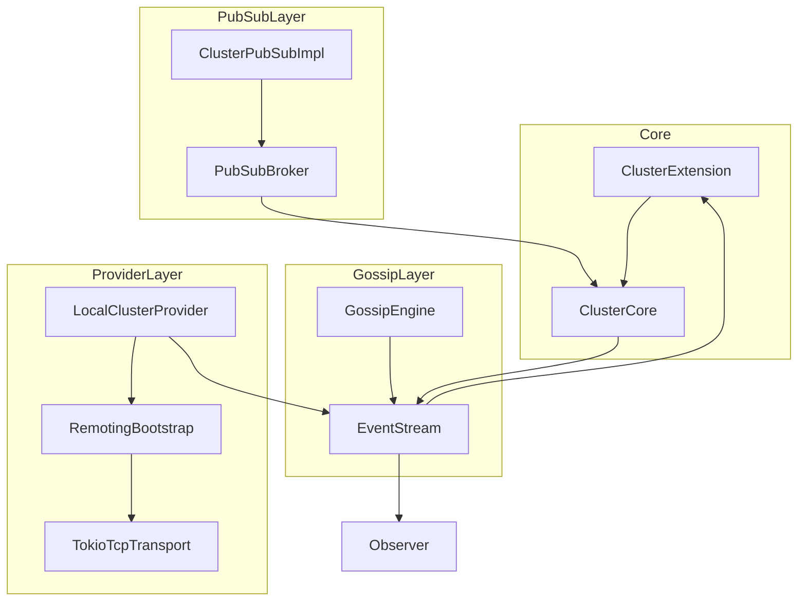
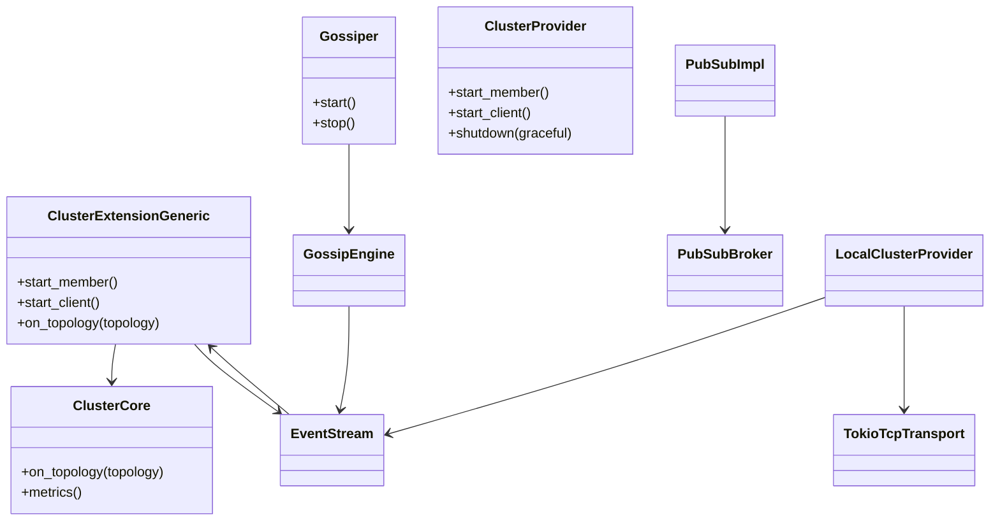

# 設計ドキュメント

## 概要
クラスタ拡張サンプルを EventStream 主導のトポロジ通知に統一し、ProtoActor-Go と同様に Provider/Gossiper がイベントを publish、ClusterExtension が購読して `ClusterCore::on_topology` を適用する流れを実働デモとして示す。Phase1 では静的トポロジ＋EventStream 統合で自動適用を実証し、Phase2 で GossipEngine と TokioTcpTransport を接続して動的 join/leave・PubSub 配布を検証する。core は no_std を前提に維持し、std/Tokio 実装はサンプル・テスト用として提供する。

### 目標 (Goals)
- 要件1: EventStream 経由でトポロジを自動適用し、手動 `on_topology` を廃止する。
- 要件2: TokioTcpTransport を用いた 2 ノード join/leave とメッセージ往復を実演し、クラスタイベントを観測可能にする。
- 要件3: Provider がトポロジイベントを発行し、ClusterExtension が購読して ClusterCore へ適用する経路を確立する。
- 要件4: TopicKind 連動の PubSub 配布を有効化し、サンプルで購読と配送ログを確認する。
- 要件5: metrics とドキュメントをサンプル挙動と一致させ、再現手順を明文化する。

### 非目標 (Non-Goals)
- Gossip プロトコルや MembershipTable の再設計は行わない（移植・結線に留める）。
- プロダクション向け etcd/zk provider を本体へ追加しない。サンプル専用 provider で差し替え方法のみ示す。
- CLI/UI 追加は行わず、ログと EventStream 出力で観測する。

## アーキテクチャ

### 既存アーキテクチャの把握
- `ClusterCore` は pubsub→gossip→provider の起動順と `on_topology` メトリクス更新を持つが、トポロジ通知は手動 `on_topology` に依存。
- サンプル `cluster_extension_no_std` / `cluster_extension_tokio` は Logging/No-op に依存し、実トランスポート統合がない。
- EventStream は既存の拡張イベント経路として利用可能（ProtoActor-Go も EventStream で topology を配布）。
- protoactor-go 同様、Provider は etcd/zk/test/automanaged など差し替え前提。本設計ではサンプル専用 Provider（Inproc/TCP）のみ追加する。

### ハイレベルアーキテクチャ


### 技術スタック / 設計判断
- Rust 2024、core は no_std を堅持し、std/Tokio 実装は `modules/cluster/src/std` と samples に限定。Tokio が使える箇所では Tokio 実装を利用。
- トポロジ通知は EventStream publish/subscribe に統一し、新規コールバック trait を導入しない。
- 1ファイル1型ルールを遵守し、テストは `*/tests.rs` に分離。

#### 追加の契約
- **トポロジ通知**: Provider/Gossip は `ClusterEvent::TopologyUpdated { topology, joined, left, blocked }` を EventStream に publish。ハッシュが前回と同一なら publish しない。
- **Pub/Sub 起動前提**: ClusterExtension は初期化時に `TopicActorKind` を必ず登録し、PubSubImpl 起動の前提とする。
- **ブロックリスト**: BlockListProvider の結果を `blocked` に含め、TopologyUpdated と同時に発行。

#### Remoting → Topology 変換仕様（LocalClusterProvider）
- Remoting/TokioTcpTransport の membership イベントを ClusterTopology に写像し、`ClusterEvent::TopologyUpdated` として EventStream に publish（同一ハッシュは抑止）。
  - Join: authority=host:port を `joined` に追加、`left` 空、`hash = fnv64(sorted(joined|left|version))`。
  - Leave/Disconnect: authority を `left` に追加、`joined` 空。
  - Version: Remoting の membership version を優先し、無ければ内部カウンタ。
  - BlockList: BlockListProvider の結果を `blocked` として付与。
- エラー: Remoting 由来エラーは `ClusterError::Provider` として StartupFailed/ShutdownFailed を EventStream に発火。

## システムフロー
- **Phase1（静的トポロジ＋EventStream）**: LocalClusterProvider（または StaticClusterProvider）が静的 ClusterTopology を EventStream に publish → ClusterExtension が購読し `ClusterCore::on_topology` を実行 → metrics/blocked/イベント更新を確認。GossipEngine は未使用。
- **Phase2（Gossip＋Tokio TCP）**: LocalClusterProvider が Remoting/TokioTcpTransport を起動し seed/authority を GossipEngine に渡す → GossipEngine/Remoting が join/leave を ClusterTopology に変換し EventStream へ publish → ClusterExtension が購読し `on_topology` → PubSubBroker/Remote メッセージ配送を実ノード間で検証。
- **シャットダウン**: `shutdown(graceful)` で PubSub→Gossip→Identity→MemberList の順に停止し、停止時はトポロジイベントを publish しない。最後に EventStream へ Shutdown/ShutdownFailed を発火。

## API ブループリント
### 追加 / 変更される型・トレイト（公開）
- `core/cluster_event.rs`: `ClusterEvent::TopologyUpdated { topology, joined, left, blocked }` を追加。
- `core/gossiper.rs`: start/stop は維持し、トポロジ通知は EventStream publish で行う（新規コールバックなし）。
- `core/cluster_provider.rs`: start_member/client/shutdown は維持し、トポロジ通知は EventStream publish に統一。
- `core/cluster_extension.rs`: EventStream 購読者を登録し、`TopologyUpdated` を受信したら `ClusterCore::on_topology` を呼ぶ。
- `std/provider/local_cluster_provider.rs`（新規・サンプル専用）: Remoting/TokioTcpTransport を起動し、membership 変更を `ClusterEvent::TopologyUpdated` として publish。protoactor-go の etcd/zk/test/automanaged provider の差し替え例を示す。
- `core/cluster_pub_sub_impl.rs`（新規）: PubSubBroker を駆動する ClusterPubSub 実装（no_std 対応）。イベント通知は EventStream 経由。

### シグネチャ スケッチ
```rust
pub enum ClusterEvent {
  Startup { address: String, mode: StartupMode },
  StartupFailed { address: String, mode: StartupMode, reason: String },
  Shutdown { address: String, mode: StartupMode },
  ShutdownFailed { address: String, mode: StartupMode, reason: String },
  TopologyUpdated { topology: ClusterTopology, joined: Vec<String>, left: Vec<String>, blocked: Vec<String> },
}

pub trait Gossiper: Send + Sync {
  fn start(&self) -> Result<(), &'static str>;
  fn stop(&self) -> Result<(), &'static str>;
  // トポロジは EventStream publish で通知
}

pub trait ClusterProvider: Send + Sync {
  fn start_member(&self) -> Result<(), ClusterProviderError>;
  fn start_client(&self) -> Result<(), ClusterProviderError>;
  fn shutdown(&self, graceful: bool) -> Result<(), ClusterProviderError>;
  // トポロジは EventStream publish で通知
}
```

### クラス／モジュール図


## クイックスタート / 利用例
- **cluster_extension_no_std/main.rs**: StaticClusterProvider/Gossiper/PubSub に差し替え、静的 `ClusterEvent::TopologyUpdated` を EventStream に publish して自動 `on_topology` を確認。Manual TickDriver を継続。
- **cluster_extension_tokio/main.rs**: NoopProvider/Logging* を LocalClusterProvider + (net-backed) Gossiper/PubSubImpl に置換し、2 ノード join/leave と PubSub メッセージ配送を実際に流す。EventStream publish/subscribe 方式でトポロジを適用し、冒頭コメントと README で provider 差し替え（etcd/zk/test/automanaged 等）手順を明示。

## データモデル
- トポロジ: 既存 `ClusterTopology { joined: Vec<String>, left: Vec<String>, hash }` を継続使用。`TopologyUpdated` に含めて配信。
- BlockList: `Vec<String>` を ClusterCore に保持し EventStream に含める。
- PubSub: Topic 名と subscriber authority を Broker が管理。永続化なし。

## エラーハンドリング
- Gossiper/Provider/PubSub start 失敗時は ClusterError 経由で StartupFailed を EventStream に発火し、起動を中断。
- トポロジ通知でハッシュが同一の場合は publish しない（重複抑止）。
- LocalClusterProvider が remoting bind に失敗した場合は理由付きで StartMember 失敗を返し、EventStream に StartupFailed を発火。
- metrics 無効時は MetricsError::Disabled をそのまま返す。

## テスト戦略
- **ユニット**: PubSubImpl の TopicKind 前提 publish/subscribe、ClusterExtension の EventStream 購読による重複ハッシュ抑止、LocalClusterProvider の Remoting→Topology 変換。
- **統合 (Phase1)**: 静的トポロジを EventStream publish → ClusterExtension が metrics/イベントを更新することを確認。
- **統合 (Phase2)**: Tokio 2 ノードで join/leave, BlockList 反映, Grain メッセージ往復, PubSub publish/subscribe を確認。`cluster_extension_tokio` を cargo test/example 実行で再現し、EventStream に `TopologyUpdated` が流れることを検証。
- **ドキュメント検証**: example.md の手順を CI で smoke 実行（可能なら doctest 形式）。

## no_std / std 方針
- core は no_std を維持し、cfg 分岐を std モジュールに閉じ込める。Tokio 実装は std レイヤとサンプルで使用。  
- Phase1/Phase2 ともに no_std 互換コードで記述し、ネットワーク依存部分のみ std/Tokio へ隔離。  
- 追加の Timer/Channel 抽象が必要になった場合は RuntimeToolbox 拡張で対応するが、本設計では EventStream ベースで新たな抽象を追加しない。

## 移行計画
- Phase1: 静的トポロジ＋EventStream 統合を実装し、手動 `on_topology` を削除。サンプル/テストを緑化。
- Phase2: GossipEngine と TokioTcpTransport を接続し、動的 join/leave・PubSub 配布を実装。Logging ダミーを撤去。

## リスクと緩和
- **Gossip 実装工数**: Phase2 で集中実装。Phase1 の静的トポロジで先に経路を確立しておくことでリスク低減。
- **no_std/ std 両対応の複雑さ**: ネットワーク依存コードを std に隔離し、core は EventStream/ClusterCore のみで完結させる。
- **破壊的変更**: EventStream 方式は既存拡張イベントと整合し、影響範囲を cluster crate に限定。コンパイルエラーで検知。
