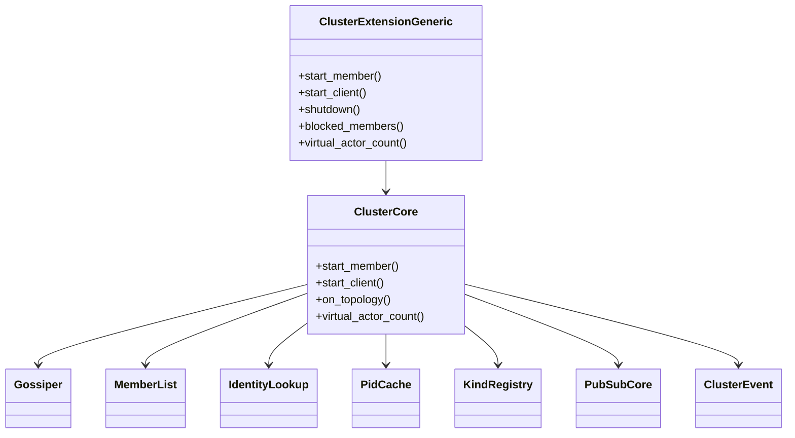

# 設計ドキュメント

## 概要
protoactor-go の `Cluster` 構造体を基盤に、すべてのクラスタロジックを no_std の core に実装する。クラスタの状態管理（MemberList/Gossiper/IdentityLookup/PidCache/Kind Registry/PubSub）とイベント生成（ClusterEvent）は core で完結させ、std 側には新規ロジックを置かない。ActorSystem 拡張も core の ExtensionId/Extension を用いて RuntimeToolbox 汎用に実装する。

### 目標 (Goals)
- protoactor-go 等価の Cluster を core だけで再現し、起動・停止・Topology 配信・BlockList 連携・Kind 登録を提供する。
- EventStream/metrics 連携も core から行い、std への依存を排除する。
- トポロジ変化を PID キャッシュとメトリクスに反映し、メトリクス無効時は明示的に未収集を返す。

### 非目標 (Non-Goals)
- Gossip プロトコルの再設計・拡張。
- TLS/認証・外部ストレージ。
- std 特有の機能追加（ロジックを std に置かない）。

## アーキテクチャ

### 既存アーキテクチャの把握
- protoactor-go Cluster: `Cluster` が `Gossiper`, `MemberList`, `PidCache`, `IdentityLookup`, `PubSub`, `ActivatedKind`, `Remote` を束ねる。
- fraktor-rs core: EventStream/Extension/ActorSystemGeneric/RemoteAuthority などは RuntimeToolbox 汎用で no_std 動作。これらを直接利用し、std への橋渡しは既存 actor/std が担う。

### ハイレベルアーキテクチャ
```mermaid
graph TB
  AS[ActorSystemGeneric<TB>] --> CLX[ClusterExtensionGeneric<TB>]
  CLX --> CC[ClusterCore]
  CC --> ML[MemberList]
  CC --> GS[Gossiper]
  CC --> IL[IdentityLookup]
  CC --> PC[PidCache]
  CC --> KR[KindRegistry/ActivatedKind]
  CC --> PS[PubSubCore]
  CC --> BL[BlockListProvider (from Remote core)]
  CC --> ES[EventStream (EventStreamEvent::Extension "cluster")]
  CC --> MET[ClusterMetrics?]
```
- ClusterCore が全ロジックと状態を保持し、EventStream に直接 `EventStreamEvent::Cluster` を発火。metrics は core 内で保持し、必要なら ClusterMetrics を更新（metrics_disabled 時は未収集を返す）。

### 技術スタック / 設計判断
- Rust 2024、`#![no_std]`。RuntimeToolbox 汎用 (TB: RuntimeToolbox) で actor/remote のコア API を利用。
- 依存方向: utils → actor/core → remote/core → cluster/core。std への依存ゼロ。
- protoactor-go のフィールド・責務をほぼ同名で移植し、構造体分割（1 ファイル 1 型）で Rust 流儀にする。

#### 主要設計判断
- **Decision**: ClusterExtensionGeneric<TB> と ClusterCore を core に置き、すべての制御・イベント生成を core 完結にする。
  **Rationale**: no_std で動作し、std 依存を排除することで組込み環境でも同一のクラスタ挙動を提供。
  **Trade-offs**: EventStream/metrics など観測周辺も core で扱うため、TB 実装に依存するが汎用性を優先。

## システムフロー

### 起動 (StartMember)
1. ClusterExtension.start_member() が Remote(core) と ClusterProvider を確認し、Remote core の `block_list_provider()`（戻り値: ArcShared<dyn BlockListProvider>）を取得して ClusterCore に注入。
2. ClusterCore: KindRegistry 初期化・IdentityLookup.setup(member)・MemberList.initialize_consensus()。
3. ClusterCore: ClusterProvider.start_member() を呼び、失敗時は ClusterEvent::StartupFailed を EventStreamEvent::Cluster で発火し ClusterError を返す。
4. ClusterCore: Gossiper.start()・PubSubCore.start(); 失敗は StartupFailed(reason) を EventStream に発火。
5. ClusterCore: ClusterEvent::Startup を `EventStreamEvent::Extension { name: "cluster", payload: AnyMessageGeneric::new(ClusterEvent) }` で発火し、metrics_enabled 時は `ClusterMetrics::update_members(member_list.len())` と `update_virtual_actors(kind_registry.virtual_actor_count())` を実行して初期化。

### 起動 (StartClient)
1. ClusterCore: ClusterProvider.start_client(); 失敗時は StartupFailed を EventStream に発火。
2. ClusterCore: IdentityLookup.setup(client)。
3. ClusterCore: ClusterEvent::Startup(mode=Client) を EventStreamEvent::Cluster で発火。

### トポロジイベント処理
- ClusterCore.on_topology(topology):
  - 直近ハッシュと比較し同一なら抑制（要件3.5）。
  - 変化あり: PidCache.invalidate(left) → MemberList 更新 → 事前注入済み BlockListProvider.blocked_members() で blocked を取得 → ClusterEvent::Topology {hash, joined, left, blocked} 生成。
  - EventStreamEvent::Extension("cluster") で発火し、metrics_enabled 時は `ClusterMetrics::update_members(member_list.len())` を呼び出す。

### グレースフルシャットダウン
1. ClusterCore: PubSub.stop → Gossiper.stop → IdentityLookup.shutdown → MemberList.stop。
2. ClusterCore: ClusterProvider.shutdown(graceful); 失敗は ClusterEvent::ShutdownFailed(reason) を EventStreamEvent::Extension("cluster") で発火。
3. ClusterCore: ClusterEvent::Shutdown を EventStreamEvent::Extension("cluster") で発火し、metrics_enabled 時は `ClusterMetrics::update_members(0)` と `update_virtual_actors(0)` でリセット。

## API ブループリント

### 型・トレイト一覧（追加／変更）
- `modules/cluster/src/core/cluster_extension_id.rs` — `ClusterExtensionId<TB>`: ExtensionId 実装 (core)。
- `modules/cluster/src/core/cluster_extension.rs` — `ClusterExtensionGeneric<TB>`: ActorSystem 拡張本体 (core)。
- `modules/cluster/src/core/cluster_core.rs` — `ClusterCore`: Cluster 本体。protoactor-go Cluster 相当。
- `modules/cluster/src/core/gossiper.rs` — `Gossiper`: Gossip 制御。
- `modules/cluster/src/core/member_list.rs` — `MemberList`: トポロジ追跡・ハッシュ計算。
- `modules/cluster/src/core/kind_registry.rs` — `KindRegistry` / `ActivatedKind`: Kind 登録。
- `modules/cluster/src/core/cluster_event.rs` — `ClusterEvent`: Startup/Shutdown/Topology。
- `modules/cluster/src/core/cluster_extension_config.rs` — `ClusterExtensionConfig`: gossip/pubsub/heartbeat/metrics/timeout/remote 設定。
- `modules/cluster/src/core/identity_lookup.rs` — `IdentityLookup`: member/client setup・shutdown・get。
- `modules/cluster/src/core/pid_cache.rs` — 既存を流用。
- `modules/cluster/src/core/pub_sub.rs` — PubSubCore。
- `modules/cluster/src/core/metrics_state.rs` — `MetricsDisabled` と metrics 有効フラグ管理。
- `modules/cluster/src/core/cluster_provider.rs` — `ClusterProvider` (trait): protoactor-go ClusterProvider 相当 (member/client 起動・shutdown)。
- `modules/cluster/src/core/cluster_provider_error.rs` — `ClusterProviderError`: Provider 失敗理由。
- `modules/remote/src/core/block_list_provider.rs` — `BlockListProvider` (trait): BlockList を取得（定義は remote core 側に置き、cluster はこれに依存）。
- `modules/cluster/src/core/cluster_metrics.rs` — `ClusterMetrics` (optional): メンバー数/VirtualActorCount を保持・更新。無効時は MetricsDisabled を返す。
- `modules/actor/src/core/extension/extension_id.rs`（既存）を利用し、`ClusterExtensionId<TB>` が ExtensionId を実装して ActorSystemGeneric へ登録されることを明示。
- プロバイダ関連は ArcShared で統一し、RemotingExtension のハンドルパターンと整合。
- `modules/actor/src/core/event_stream/event_stream_event.rs` に `Extension { name: String, payload: AnyMessageGeneric<TB> }` バリアントを追加し、cluster はこれを使用して依存逆転を避ける。

### シグネチャ スケッチ
```rust
// cluster_extension.rs (core)
pub struct ClusterExtensionGeneric<TB: RuntimeToolbox + 'static> {
  system: ArcShared<ActorSystemGeneric<TB>>,
  core: ClusterCore<TB>,
}
impl<TB: RuntimeToolbox + 'static> ClusterExtensionGeneric<TB> {
  pub fn start_member(&mut self) -> Result<(), ClusterError>;
  pub fn start_client(&mut self) -> Result<(), ClusterError>;
  pub fn shutdown(&mut self, graceful: bool) -> Result<(), ClusterError>;
  pub fn blocked_members(&self) -> Vec<String>; // Remote BlockList 委譲
  pub fn virtual_actor_count(&self) -> i64;
  pub fn new(
    system: ArcShared<ActorSystemGeneric<TB>>,
    config: ClusterExtensionConfig,
    provider: ArcShared<dyn ClusterProvider>,
    block_list_provider: ArcShared<dyn BlockListProvider>,
    event_stream: ArcShared<EventStreamGeneric<TB>>,
  ) -> Self;
}

// cluster_core.rs (core)
pub struct ClusterCore<TB: RuntimeToolbox + 'static> {
  config: ClusterExtensionConfig,
  gossiper: Gossiper<TB>,
  member_list: MemberList,
  identity_lookup: Box<dyn IdentityLookup<TB>>,
  pid_cache: PidCache,
  kind_registry: KindRegistry<TB>,
  pubsub: PubSubCore<TB>,
  metrics_enabled: bool,
  provider: ArcShared<dyn ClusterProvider>,
  block_list_provider: ArcShared<dyn BlockListProvider>, // remote core 定義のトレイト
  event_stream: ArcShared<EventStreamGeneric<TB>>,
  cluster_metrics: Option<ClusterMetrics>,
}
impl<TB: RuntimeToolbox + 'static> ClusterCore<TB> {
  pub fn start_member(&mut self) -> Result<(), ClusterError>; // EventStream へ内部発火
  pub fn start_client(&mut self) -> Result<(), ClusterError>;
  pub fn on_topology(&mut self, topology: ClusterTopology) -> Result<(), ClusterError>; // 生成と発火を内部で実施
  pub fn virtual_actor_count(&self) -> i64;
}

// cluster_event.rs
pub enum ClusterEvent {
  Startup { address: String, mode: StartupMode },
  StartupFailed { address: String, mode: StartupMode, reason: String },
  Shutdown { address: String, mode: StartupMode },
  ShutdownFailed { address: String, mode: StartupMode, reason: String },
  Topology { topology_hash: u64, joined: Vec<String>, left: Vec<String>, blocked: Vec<String> },
}
pub enum StartupMode { Member, Client }

// cluster_provider.rs
pub trait ClusterProvider: Send + Sync {
  fn start_member(&self) -> Result<(), ClusterProviderError>;
  fn start_client(&self) -> Result<(), ClusterProviderError>;
  fn shutdown(&self, graceful: bool) -> Result<(), ClusterProviderError>;
}
pub enum ClusterProviderError {
  StartMemberFailed(String),
  StartClientFailed(String),
  ShutdownFailed(String),
}
// block_list_provider.rs
pub trait BlockListProvider: Send + Sync {
  fn blocked_members(&self) -> Vec<String>;
}
// cluster_metrics.rs
pub struct ClusterMetrics {
  pub members: usize,
  pub virtual_actors: i64,
}
impl ClusterMetrics {
  pub fn update_members(&mut self, count: usize);
  pub fn update_virtual_actors(&mut self, count: i64);
}

// cluster_extension_id.rs
pub struct ClusterExtensionId<TB: RuntimeToolbox + 'static> {
  config: ClusterExtensionConfig,
  provider: ArcShared<dyn ClusterProvider>,
  block_list_provider: ArcShared<dyn BlockListProvider>, // remote core 由来
  event_stream: ArcShared<EventStreamGeneric<TB>>,
  phantom: PhantomData<TB>,
}
impl<TB: RuntimeToolbox + 'static> ClusterExtensionId<TB> {
  pub fn new(
    config: ClusterExtensionConfig,
    provider: ArcShared<dyn ClusterProvider>,
    block_list_provider: ArcShared<dyn BlockListProvider>, // remote core 提供
    event_stream: ArcShared<EventStreamGeneric<TB>>,
  ) -> Self;
}
impl<TB: RuntimeToolbox + 'static> ExtensionId<TB> for ClusterExtensionId<TB> {
  type Ext = ClusterExtensionGeneric<TB>;
  fn create_extension(&self, system: &ActorSystemGeneric<TB>) -> Self::Ext {
    ClusterExtensionGeneric::new(
      ArcShared::new(system.clone()),
      self.config.clone(),
      self.provider.clone(),
      self.block_list_provider.clone(),
      self.event_stream.clone(),
    )
  }
}

// ClusterExtension の登録例
// let id = ClusterExtensionId::<TB>::new(cfg, provider_arc.clone(), remote.block_list_provider(), event_stream.clone());
// system.extended().register_extension(&id);
```

## クラス／モジュール図


## クイックスタート / 利用例
```rust
fn bootstrap<TB: RuntimeToolbox + 'static>(
  system: &ActorSystemGeneric<TB>,
  cfg: ClusterConfig,
) -> Result<(), ClusterError> {
  let ext_id = ClusterExtensionId::<TB>::new(cfg);
  let ext = system.extended().register_extension(&ext_id);
  ext.start_member()
}
```

## 要件トレーサビリティ

| 要件ID | 要約 | コンポーネント | インターフェイス |
| --- | --- | --- | --- |
| 1 | 起動/終了 | ClusterExtensionGeneric, ClusterCore | start_member/start_client/shutdown |
| 2 | Kind 登録/Identity 初期化 | ClusterCore, KindRegistry, IdentityLookup | start_member/init_kinds |
| 3 | トポロジ連動 | ClusterCore, MemberList, PidCache | on_topology |
| 4 | Gossip/PubSub 起動 | ClusterCore, Gossiper, PubSubCore | start_member/start_client |
| 5 | 観測性 | ClusterCore (EventStream, Metrics) | ClusterEvent 発火/metrics_enabled |

## コンポーネント & インターフェイス

### ClusterCore (core)
- 責務: protoactor-go Cluster の全ロジック。起動、Topology 適用、Kind/Identity/PidCache/MemberList/PubSub 管理。
- 入出力: ClusterExtensionConfig、ClusterTopology、ClusterEvent、ClusterError。
- 依存: core のみ。RuntimeToolbox による Mutex/ArcShared/時間取得を使用。
- 契約: ハッシュ不変時は ClusterEvent を生成しない。PidCache 無効化は Left を元に行う。metrics_enabled=false の場合は metrics 要求で MetricsDisabled を返す。EventStream に直接 `EventStreamEvent::Cluster` を発火し、ClusterMetrics があれば更新する（std 依存なし）。

### ClusterExtensionGeneric (core)
- 責務: ActorSystemGeneric への拡張登録と core Cluster のライフサイクル呼び出し。
- 入出力: ClusterEvent を EventStreamEvent::Cluster として EventStream に発火。BlockList は Remote (core) の API から取得。
- 契約: 重要ロジックを持たず、core へ委譲。ログも EventStream 経由で発火する。`ClusterExtensionId<TB>` で ActorSystemGeneric へ登録し、config・event_stream・block_list_provider（Remote core 由来）・provider をコンストラクタで注入する。

### Gossiper (core)
- 責務: Gossip 開始/停止と MemberList 連動。起動失敗は ClusterError::GossipStart。

### MemberList (core)
- 責務: トポロジ追跡・ハッシュ計算・Joined/Left 抽出。

### KindRegistry / ActivatedKind (core)
- 責務: Kind 登録・TopicKind 自動登録。protoactor-go の ActivatedKind に対応。

### IdentityLookup (core)
- 責務: member/client モードの PID 解決。最新 membership version を使用。

### PidCache (core)
- 責務: PID キャッシュと authority 無効化。

### PubSubCore (core)
- 責務: PubSub 起動/停止と TopicKind 連動。

### Metrics (core)
- 責務: メンバー数/VirtualActorCount を保持し、metrics_enabled=false のとき `Err(MetricsDisabled)` を返す。

### ClusterProvider (core)
- 責務: member/client 起動と shutdown を外部プロバイダに委譲（protoactor-go ClusterProvider 相当）。
- 契約: start_member/start_client/shutdown を同期で返し、失敗時は ClusterProviderError を返す。ClusterCore は Provider 失敗を ClusterError に変換し、EventStream に記録する。

### BlockListProvider (core)
- 責務: BlockList を取得して ClusterEvent::Topology.blocked に埋め込む。実体は Remote core が提供。
- 契約: blocked_members() を提供し、ClusterExtension が Remote core から取得した実装を ClusterCore に注入する。

### EventStream / ClusterMetrics (core)
- 責務: ClusterEvent を `EventStreamEvent::Extension { name: "cluster", payload: AnyMessageGeneric }` として EventStream へ発火し、メンバー数/VirtualActorCount を ClusterMetrics で保持・更新。
- 契約: metrics_enabled=false 時は ClusterMetrics が None（未収集）であり、エラーは返さない。発火失敗はログのみ（ベストエフォート）。

## データモデル
- ClusterExtensionConfig: gossip/pubsub/heartbeat/timeout/metrics/remote 設定（core）。
- ClusterTopology: MemberList が保持するメンバー一覧とハッシュ（core）。
- ClusterEvent: Startup/StartupFailed/Shutdown/ShutdownFailed/Topology（core 生成、EventStreamEvent::Extension("cluster", AnyMessage) で配信）。Topology は blocked を含む。
- Metrics: メンバー数と VirtualActorCount（core 保持）。無効時は ClusterMetrics が None。

## エラーハンドリング
- ClusterError: Remote/Gossip/PubSub/Provider/Shutdown 失敗を区別（core 公開）。
- metrics 無効時は ClusterMetrics が None（未収集）であり、エラーは返さない。
- ClusterProvider 失敗時は ClusterEvent::StartupFailed/ShutdownFailed を EventStreamEvent::Cluster で必ず発火し、理由を含める。
- EventStream 発火失敗はロガー記録のみ（ベストエフォート）。

## テスト戦略
- コアユニット: トポロジハッシュ抑制、Joined/Left 抽出、PidCache 無効化、ClusterEvent 生成（Startup/StartupFailed/Shutdown/ShutdownFailed/Topology）、KindRegistry 自動 TopicKind 登録、metrics 無効時の応答。
- コアユニット: ClusterProvider 失敗時の StartupFailed/ShutdownFailed 発火、BlockListProvider 連携で blocked が埋まること。
- 統合 (core + actor/remote core): 2 ノード起動で start_member → topology 反映 → EventStream クラスタイベント受信 → PID キャッシュ削除 → BlockList 取得。
- 負荷: トポロジ不変時のイベント抑制確認。

## セキュリティ
- 本フェーズでは未対応。将来 TLS/認証を ClusterConfig/RemoteConfig 拡張で追加予定。

## パフォーマンス & スケーラビリティ
- ハッシュ比較でイベント/metrics 更新を抑制し、不要な通知を減らす。
- Gossip/PubSub 起動時間を metrics で計測可能にし、閾値超過時にログ。

## 移行戦略
- protoactor-go の Cluster 構造体をほぼそのまま Rust へ移植し、フィールド/責務名も揃える。利用側は ActorSystemGeneric への ExtensionId 登録を追加するだけで移行できる。
