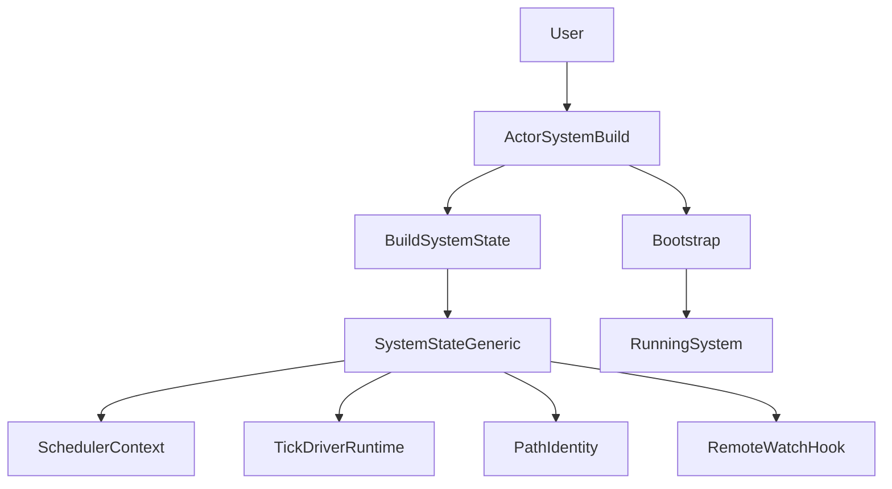
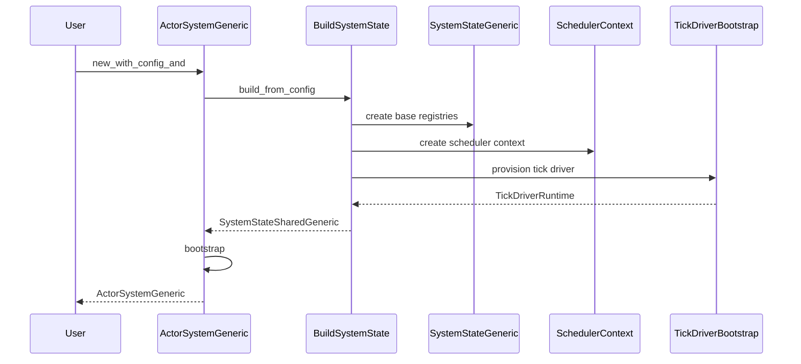
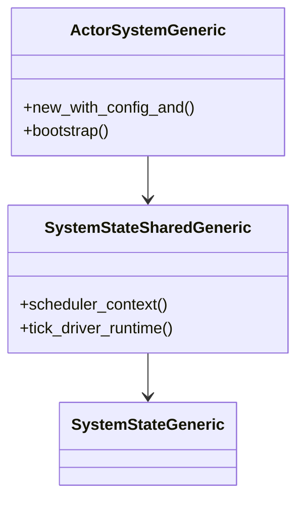

# 設計ドキュメント: system-state-generic-option-removal

## 概要
本変更は `SystemStateGeneric` が `Option` を使って未初期化状態を表現し、生成後に `install_*` / `apply_*` で後差し込みする設計を解消する。目的は「初期化順序の逆転」を不可能にし、`SystemStateGeneric` を常に完全初期化済みの状態だけで表現できるようにすることである。

利用者（ランタイム開発者・テスト作者・拡張実装者）は、`scheduler_context` / `tick_driver_runtime` / remoting / remote watch hook の可用性を `Option` 分岐で扱う必要がなくなり、ActorSystem 構築の入口が明確になる。副作用として、現状 `new_empty()` がプロダクション生成経路の内部で利用されている点（`root_started` を早期に立てる等）を解消し、起動前フック（configure）や extra top-level 登録の振る舞いを自然な順序へ戻す。

### 目標 (Goals)
- `SystemStateGeneric` から `Option` による未初期化表現を排除する（対象: scheduler_context/tick_driver_runtime/remoting_config/remote_watch_hook）。
- ActorSystem 構築フローで初期化順序（依存物→SystemState→bootstrap）を強制する。
- 呼び出し側の影響は `SystemStateSharedGeneric` で吸収し、`scheduler_context` / `tick_driver_runtime` は非 `Option` で参照できるようにする。
- `new_empty()` を `cfg(test)` / `feature = "test-support"` 専用で維持し、完全初期化済み状態を返す。
- 最終ゲートとして `./scripts/ci-check.sh all` を通す。

### 非目標 (Non-Goals)
- `SystemStateGeneric` 内部の全フィールド（各 `*SharedGeneric`）を再設計してロック粒度を全面変更すること。
- TickDriver/Scheduler の機能追加や新規ドライバ追加。
- Remoting 拡張や Cluster 拡張の機能追加。
- 既存 API の後方互換性維持（破壊的変更は許容するが、目的外の変更は避ける）。

## アーキテクチャ

### 既存アーキテクチャの把握
- `SystemStateGeneric::new()` が `scheduler_context/tick_driver_runtime/remoting_config/remote_watch_hook` を `None` で生成し、後から `apply_actor_system_config()` / `install_scheduler_context()` / `install_tick_driver_runtime()` / `register_remote_watch_hook()` で差し込む設計になっている。
- `ActorSystemGeneric::new_with_config_and()` が内部で `new_empty()` を呼び、生成後に設定適用と依存注入を行っているため、初期化順序が「SystemState → 依存物」になっている。
- `new_empty()` が `root_started` を早期に立てるため、起動前に許容したい操作（extra top-level 登録など）と意味論が衝突しうる。
- Remoting 設定は `PathIdentity` と `remoting_config: Option<RemotingConfig>` の二重管理になっている。
- Remote watch hook の未登録状態は `Option` で表現され、分岐を要する。

### ハイレベルアーキテクチャ
本変更では、ActorSystem 構築を「依存物の生成 → SystemState の構築 → bootstrap」に再配置し、SystemState は常に完全初期化済みとして生成する。



- `BuildSystemState` は構成（system 名、remoting、scheduler、tick driver）を受け取り、必要な依存物を先に生成して `SystemStateGeneric` を構築する。
- `RemoteWatchHook` は未登録時も常に存在し、既定は Noop 実装（常に未消費）とする。
- `RemotingConfig` は `PathIdentity` を単一ソースとして導出し、二重保持をやめる。
- `new_empty()` はテスト専用とし、デフォルト tick driver と scheduler context を含む完全初期化済み状態を返す。

### 技術スタック / 設計判断
- 既存の `RuntimeToolbox` / `SchedulerContextSharedGeneric` / `TickDriverBootstrap` をそのまま利用し、新規依存は追加しない。
- core 内で `#[cfg(feature = "std")]` 分岐は追加しない（既存方針に従う）。テスト専用分岐は `cfg(test)` / `feature = "test-support"` のみを用いる。

#### 主要設計判断
- **Decision**: SystemState の構築を「完全初期化済み生成」に切り替え、後差し込み API を不要化する  
  - **Context**: `Option` による未初期化表現が初期化順序の逆転と分岐の増殖を招いている  
  - **Alternatives**: 既存 API を残しつつ `Option` を保持したままガードを強化する  
  - **Selected Approach**: `ActorSystemGeneric::new_with_config_and` で依存物を先に生成し、それを含む `SystemStateGeneric` を生成してから bootstrap する  
  - **Rationale**: 未初期化状態を型で禁止でき、呼び出し側も `Option` を扱わない  
  - **Trade-offs**: 生成経路とテストの修正範囲が広い
- **Decision**: remote watch hook の未登録状態を Noop 実装で表現する  
  - **Context**: `Option` は “未登録” を表すが、分岐が必要になり意図が散る  
  - **Alternatives**: `Option` を残す / `Result` で未登録を返す  
  - **Selected Approach**: Noop hook（`handle_watch/unwatch` が常に `false`）を既定値として保持し、登録時は差し替える  
  - **Rationale**: `Option` を排除しつつ既存のフォールバック動作を維持できる  
  - **Trade-offs**: hook “未登録” を値で表すため、デバッグ時に状態を意識する必要がある
- **Decision**: remoting_config の二重管理を廃止し、PathIdentity から導出する  
  - **Context**: 2 箇所に同等情報があり、更新忘れや不整合リスクがある  
  - **Alternatives**: 片方を主として同期更新を厳密化する  
  - **Selected Approach**: `PathIdentity` を単一ソースとし、`remoting_config()` は必要時に `Option<RemotingConfig>` を組み立てて返す  
  - **Rationale**: 状態の一貫性を構造で担保できる  
  - **Trade-offs**: `RemotingConfig` を「保存された値」として参照する用途がある場合は調整が必要

## システムフロー
ActorSystem 構築時の制御フローを以下に示す。



## API ブループリント

### 型・トレイト一覧
変更対象（追加・変更）:
- `SystemStateGeneric<TB>`: `scheduler_context/tick_driver_runtime/remote_watch_hook/remoting_config` の表現変更
- `SystemStateSharedGeneric<TB>`: `scheduler_context()` / `tick_driver_runtime()` の返り値を非 `Option` 化、後差し込み API を整理
- `ActorSystemGeneric<TB>`: `new_with_config_and()` の構築順序変更、`new_empty()` の公開範囲をテスト専用化
- `TypedActorSystemGeneric` / `std::system::ActorSystem`: `new_empty()` の公開範囲をテスト専用化（core に追随）

### シグネチャ スケッチ
```rust
impl<TB: RuntimeToolbox + Default + 'static> ActorSystemGeneric<TB> {
  pub fn new_with_config_and<F>(
    user_guardian_props: &PropsGeneric<TB>,
    config: &ActorSystemConfigGeneric<TB>,
    configure: F,
  ) -> Result<Self, SpawnError>
  where
    F: FnOnce(&ActorSystemGeneric<TB>) -> Result<(), SpawnError>;

  #[cfg(any(test, feature = "test-support"))]
  pub fn new_empty() -> Self;
}

impl<TB: RuntimeToolbox + 'static> SystemStateGeneric<TB> {
  pub(crate) fn build_from_config(config: &ActorSystemConfigGeneric<TB>) -> Result<Self, SpawnError>
  where
    TB: Default;

  pub fn scheduler_context(&self) -> SchedulerContextSharedGeneric<TB>;
  pub fn tick_driver_runtime(&self) -> TickDriverRuntime<TB>;
  pub fn remoting_config(&self) -> Option<RemotingConfig>;

  pub(crate) fn register_remote_watch_hook(&self, hook: Box<dyn RemoteWatchHook<TB>>);
}

impl<TB: RuntimeToolbox + 'static> SystemStateSharedGeneric<TB> {
  pub fn scheduler_context(&self) -> SchedulerContextSharedGeneric<TB>;
  pub fn tick_driver_runtime(&self) -> TickDriverRuntime<TB>;
  pub fn remoting_config(&self) -> Option<RemotingConfig>;
}
```

## クラス／モジュール図


## クイックスタート / 利用例
```rust
#[cfg(any(test, feature = "test-support"))]
fn new_empty_provides_ready_runtime() {
  use fraktor_utils_rs::core::runtime_toolbox::NoStdToolbox;
  use crate::core::system::ActorSystemGeneric;

  let system = ActorSystemGeneric::<NoStdToolbox>::new_empty();
  let _ctx = system.scheduler_context();
  let _runtime = system.tick_driver_runtime();
}
```

### `new_empty()` の既定構成（テスト専用）
`new_empty()` は「プロダクションの生成経路で使わない」ことを前提に、テストの利便性を優先した既定構成を持つ。

- **tick driver**: `ManualTestDriver`（決定論的テスト向け）
- **scheduler**: `SchedulerConfig::default()` を基準に `runner_api_enabled = true`（ManualTestDriver の前提条件）
- **remoting**: 無効（canonical host/port は設定しない）
- **root_started**: `true`（SystemNotBootstrapped を避けるためのテスト都合。プロダクション生成経路では bootstrap 完了後にのみ `true` になる）

## 旧→新 API 対応表
| 旧 API / 型 | 新 API / 型 | 置換手順 | 備考 |
| --- | --- | --- | --- |
| `ActorSystemGeneric::new_with_config_and` が内部で `new_empty()` を使用 | `new_with_config_and` が `SystemStateGeneric::build_from_config` を使用 | 生成フローを差し替える | 起動前フックの意味論が自然になる |
| `SystemStateSharedGeneric::scheduler_context() -> Option<_>` | `SystemStateSharedGeneric::scheduler_context() -> SchedulerContextSharedGeneric<_>` | `is_some/expect/map` を除去し直接利用 | 既存の “未初期化” は発生しない |
| `SystemStateSharedGeneric::tick_driver_runtime() -> Option<_>` | `SystemStateSharedGeneric::tick_driver_runtime() -> TickDriverRuntime<_>` | `Option` 分岐を削除 | clone は executor_shutdown を持たない（既存踏襲）。ライフサイクル停止は保持元（SystemState/ActorSystem）で担保する |
| `SystemStateGeneric::install_scheduler_context` | 廃止（構築時に必須化） | 呼び出し箇所を `build_from_config` / `new_empty` に移す | テストは `new_empty()` 経由に寄せる |
| `SystemStateGeneric::install_tick_driver_runtime` | 廃止（構築時に必須化） | 同上 |  |
| `SystemStateGeneric::apply_actor_system_config` | 原則廃止（構築時に適用） | `build_from_config` 内へ移動 | 構築後の設定変更を禁止 |
| `ActorSystemGeneric::new_empty()` | `cfg(test)` / `test-support` 限定 | テスト以外からの参照を削除 | typed/std ラッパも同様に限定 |

## 要件トレーサビリティ
| 要件ID | 要約 | 実装コンポーネント | インターフェイス | 参照フロー |
| --- | --- | --- | --- | --- |
| 1.1 | SystemState は scheduler/tick driver を保持 | `SystemStateGeneric` | `build_from_config` | sequence |
| 1.2 | scheduler/tick driver API は非 Option | `SystemStateSharedGeneric` | `scheduler_context/tick_driver_runtime` | API |
| 1.3-1.4 | remoting config の有無と値整合 | `PathIdentity` / `SystemStateGeneric` | `remoting_config` | API |
| 1.5-1.6 | remote watch hook の既定と転送 | `RemoteWatchHook` | `register_remote_watch_hook` | send_system_message |
| 2.1-2.4 | 構築順序の強制と不足時エラー | `ActorSystemGeneric` | `new_with_config_and` | sequence |
| 3.1-3.4 | Shared 側で影響吸収 | `SystemStateSharedGeneric` | Delegation APIs | API |
| 4.1-4.4 | new_empty のテスト専用化 | `ActorSystemGeneric` | `new_empty` | N/A |
| 5.1-5.3 | CI・cfg・lint 方針 | repo 全体 | `ci-check.sh all` | N/A |

## コンポーネント & インターフェイス

### core/system（ActorSystem 構築）
- **責務**: 構成検証、SystemState 構築、guardian bootstrap の順序制御
- **入出力**:
  - 入力: `ActorSystemConfigGeneric<TB>`（tick driver を含む）
  - 出力: `ActorSystemGeneric<TB>`（完全初期化済み runtime を保持）
- **依存関係**:
  - Outbound: `SystemStateGeneric::build_from_config`、`TickDriverBootstrap`
  - Constraint: core 内 `cfg(feature="std")` 禁止
- **不変条件**:
  - `new_with_config_and` は SystemState を構築し終えてから bootstrap に入る
  - tick driver config が欠落している場合は起動を拒否する

### core/system（SystemState 構築）
- **責務**: event stream、dead letter、dispatchers/mailboxes、path identity、scheduler context、tick driver runtime を一括初期化して `SystemStateGeneric` を生成する
- **入出力**:
  - 入力: `ActorSystemConfigGeneric<TB>`
  - 出力: `SystemStateGeneric<TB>`
- **依存関係**:
  - `SchedulerContextSharedGeneric::with_event_stream`
  - `TickDriverBootstrap::provision`
- **不変条件**:
  - `scheduler_context` と `tick_driver_runtime` は常に初期化済み
  - `remote_watch_hook` は常に存在（既定は Noop）
  - remoting 設定の単一ソースは `PathIdentity`

### core/system（RemoteWatchHook）
- **責務**: watch/unwatch のリモート転送をオプション機能として提供する
- **方針**:
  - 既定は Noop hook（常に `false`）で、未登録時も分岐しない
  - 登録 API は “差し替え” とし、最後に登録した hook が有効になる

## エラーハンドリング

### エラーストラテジ
- 構築時に必要条件（tick driver config 等）を検証し、失敗は `SpawnError` で fail fast する。
- tick driver provisioning 失敗は `SpawnError` に変換し、呼び出し側が原因を追えるメッセージを含める。

## 終了処理（TickDriverRuntime / executor_shutdown）
`TickDriverRuntime` は「driver の停止」と「（存在する場合）scheduler executor の停止」をまとめて表現する。

- `TickDriverRuntime::shutdown(&mut self)` は以下を満たさなければならない:
  - tick driver を停止する（`driver.shutdown()`）
  - `executor_shutdown` が存在する場合は **必ず 1 回だけ** 実行する（`take()` により重複実行を防ぐ）
- `SystemStateGeneric` は内部に保持する “オリジナル” の `TickDriverRuntime` に対して drop 時に `shutdown()` を呼び、executor を含めて確実に停止させる。
- `SystemStateSharedGeneric::tick_driver_runtime()` が返す clone は `executor_shutdown` を持たない（既存踏襲）。従って、呼び出し側は clone の `shutdown()` に executor 停止の責務を期待してはならない。

## テスト戦略
- ユニットテスト（代表例）:
  - `SystemStateGeneric::build_from_config` が `scheduler_context/tick_driver_runtime` を必ず初期化して返す
  - remote watch hook 未登録時に watch/unwatch がフォールバック動作する
  - remoting config の有無が `ActorSystemConfigGeneric` と一致する
  - `TickDriverRuntime::shutdown` が executor_shutdown を 1 回だけ実行する
- 統合テスト（代表例）:
  - `ActorSystemGeneric::new_with_config_and` の configure フェーズで extra top-level 登録が可能である
  - `new_empty()` がテスト専用にコンパイルされる（`cfg(test)`/`test-support`）
- 最終確認:
  - `./scripts/ci-check.sh all` がエラー無しで完了する

## 移行戦略
- フェーズ1: `new_with_config_and` の内部生成順序を差し替え、`SystemStateGeneric` の対象 4 フィールドから `Option` を排除する。
- フェーズ2: テスト移行（`SystemState::new()` / `apply_*` / `install_*` の直呼び排除）
  - 「空の状態を作ってから差し込む」系のテストは、原則として `ActorSystemGeneric::new_empty()`（テスト用既定構成）へ置換する。
  - 構成差分（system 名・remoting・scheduler 設定・tick driver）を持つテストは、`ActorSystemConfigGeneric` を作り `SystemStateGeneric::build_from_config(&config)` 経由で state を構築する（`apply_actor_system_config` は使用しない）。
  - `new_with_config_and` を使うテストは、configure フェーズで extra top-level を登録できること（= root_started が bootstrap 完了まで `false`）を検証対象に含める。
- フェーズ3: `ci-check.sh all` を通し、回帰があれば影響範囲（boot/termination/watch/remoting）を優先的に修正する。
