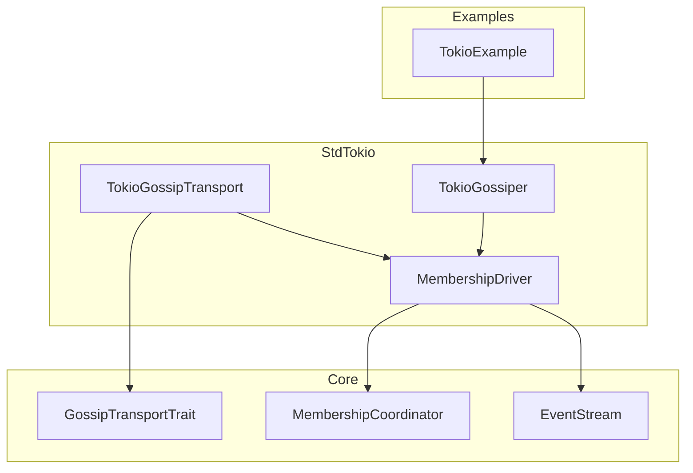
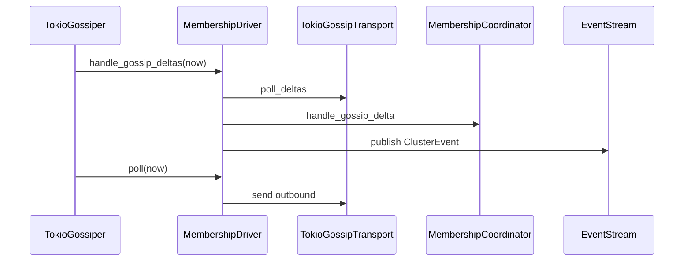

# 設計ドキュメント

## 概要
本設計は、Tokio 環境で動作する `GossipTransport` と `Gossiper` を std 層に追加し、クラスタの gossip を実ネットワークで駆動可能にする。対象は `modules/cluster/src/std` と `modules/cluster/examples` であり、core の no_std 境界を維持する。

この機能はクラスタ運用者が gossip を用いた会員情報の同期を実環境で検証するために利用する。既存の `MembershipCoordinatorDriverGeneric` と EventStream 経路を維持しつつ、Tokio の I/O と周期処理を標準構成として利用可能にする。

### 目標
- Tokio 環境で `GossipTransport` と `Gossiper` を提供し、std ビルドで利用可能にする。
- `MembershipCoordinatorDriverGeneric` 経由で `ClusterEvent` を EventStream へ publish できる。
- Tokio gossip サンプルで join/leave と TopologyUpdated を再現できる。

### 非目標
- protoactor-go の gossip wire 互換を導入しない。
- wire 形式の後方互換は維持しない（破壊的変更を許容する）。
- gossip アルゴリズムの再設計や合意方式の変更は行わない。
- etcd/consul/k8s/zk provider の統合は行わない。

## アーキテクチャ

### 既存アーキテクチャ分析（必要な場合）
- `core` に `GossipTransport` と `MembershipCoordinatorGeneric` が存在し、std には `MembershipCoordinatorDriverGeneric` がある。
- `Gossiper` は `ClusterCore` で起動されるが実体は `NoopGossiper` のみである。
- std サンプルは in-memory transport を用いており、Tokio を使った実ネットワーク経路がない。

### パターンと境界マップ
**アーキテクチャ統合**
- 選択したパターン: 既存 driver 拡張による std 実装追加
- 境界の切り方: gossip wire と I/O を std に隔離し、core には依存を追加しない
- 既存パターンの維持: `GossipTransport` の同期 API、EventStream 経由の `ClusterEvent` publish
- 新規コンポーネントの理由: Tokio I/O と周期処理は std 層でのみ成立するため
- ステアリング適合: no_std ファースト、1ファイル1型、shared wrapper 方針を維持



### 技術スタック

| レイヤ | 選定 / バージョン | 役割 | 備考 |
|-------|------------------|------|------|
| ランタイム / 実行基盤 | tokio (workspace) | gossip 送受信・周期処理 | std 機能で有効化 |
| メッセージング / イベント | UDP | GossipTransport のネットワーク層 | datagram サイズ制限あり |
| 互換性 / シリアライズ | serde + postcard (workspace) | gossip wire のエンコード/デコード | core には依存しない |
| 観測 / メトリクス | EventStream | ClusterEvent publish | 既存経路を維持 |

**補足**
- UDP は再送/信頼性を提供しないため、サンプル検証はローカルまたは同一 LAN を前提とする。
- wire 形式は破壊的変更を許容し、互換維持は行わない。

## システムフロー



## 要件トレーサビリティ

| 要件 | 概要 | 対応コンポーネント | インターフェイス | フロー |
|------|------|--------------------|------------------|--------|
| 1.1 | GossipOutbound を送信 | TokioGossipTransport | GossipTransport::send | 送信フロー |
| 1.2 | 送信失敗をエラー化 | TokioGossipTransport | GossipTransport::send | 送信フロー |
| 1.3 | 受信 delta を返却 | TokioGossipTransport | GossipTransport::poll_deltas | 受信フロー |
| 1.4 | 空キューで空返却 | TokioGossipTransport | GossipTransport::poll_deltas | 受信フロー |
| 2.1 | start で開始 | TokioGossiper | Gossiper::start | 周期フロー |
| 2.2 | stop で停止 | TokioGossiper | Gossiper::stop | 周期フロー |
| 2.3 | 起動中に周期処理 | TokioGossiper | 内部ループ | 周期フロー |
| 2.4 | start 失敗時にエラー | TokioGossiper | Gossiper::start | 周期フロー |
| 2.5 | stop 失敗時にエラー | TokioGossiper | Gossiper::stop | 周期フロー |
| 3.1 | Coordinator を更新 | MembershipDriver | handle_gossip_deltas | 受信フロー |
| 3.2 | EventStream へ通知 | MembershipDriver | publish_event | 受信フロー |
| 3.3 | outbound を送信 | MembershipDriver | apply_outcome | 送信フロー |
| 3.4 | transport 失敗の伝播 | TokioGossipTransport | GossipTransportError | 送信フロー |
| 4.1 | Tokio サンプル提供 | TokioExample | main | 実行フロー |
| 4.2 | TopologyUpdated の確認 | TokioExample | main | 実行フロー |
| 4.3 | join/leave 検証 | TokioExample | main | 実行フロー |
| 5.1 | std で利用可能 | StdTokio モジュール | std re-export | 依存境界 |
| 5.2 | no_std 影響なし | core 境界 | 依存分離 | 依存境界 |
| 5.3 | テスト成功 | std tests | tests.rs | 検証 |
| 5.4 | no_std/std build | CI | ci-check | 検証 |

## コンポーネントとインターフェイス

| コンポーネント | ドメイン/層 | 目的 | 要件対応 | 主要依存 (P0/P1) | 契約 |
|---------------|------------|------|----------|------------------|------|
| TokioGossipTransportConfig | Std | transport 設定を保持 | 1.1-1.4 | tokio (P1) | State |
| TokioGossipTransport | Std | GossipTransport の Tokio 実装 | 1.1-1.4, 3.3 | tokio net (P0) | Service |
| TokioGossiperConfig | Std | gossiper 周期設定を保持 | 2.1-2.5 | tokio time (P1) | State |
| TokioGossiper | Std | gossip の周期駆動 | 2.1-2.5, 3.1-3.3 | MembershipDriver (P0) | Service |
| membership_gossip_tokio | Examples | 動作検証用サンプル | 4.1-4.3 | TokioGossiper (P0) | Batch |

### Std

#### TokioGossipTransportConfig

| 項目 | 内容 |
|------|------|
| 目的 | UDP gossip transport の設定値を保持する |
| 対応要件 | 1.1, 1.3, 1.4 |

**責務と制約**
- bind 先アドレス、受信バッファサイズ、最大 datagram サイズを保持する。
- 0 バイトや極端に小さい max_datagram を拒否する。

**依存関係**
- Inbound: TokioGossipTransport — 生成時の参照（P0）
- Outbound: tokio net — socket 設定（P1）

**契約**: State

#### TokioGossipTransport

| 項目 | 内容 |
|------|------|
| 目的 | `GossipTransport` の Tokio 実装として UDP 送受信を担う |
| 対応要件 | 1.1-1.4, 3.3, 3.4 |

**責務と制約**
- `GossipOutbound.target` を `host:port` として解釈し、UDP 送信を行う。
- 受信 datagram を decode し、`poll_deltas` で drain する。
- outbound キュー満杯時は `GossipTransportError::SendFailed` を返す。
- no_std では利用不可であることを明確化する。

**依存関係**
- Inbound: MembershipCoordinatorDriverGeneric — send/poll の呼び出し（P0）
- Outbound: tokio net UdpSocket（P0）
- External: serde + postcard — wire の encode/decode（P1）

**契約**: Service

##### サービスインターフェイス（Rust）
```rust
pub struct TokioGossipTransportConfig {
  pub bind_addr: String,
  pub max_datagram_bytes: usize,
  pub outbound_capacity: usize,
}

pub struct TokioGossipTransport;

impl TokioGossipTransport {
  pub fn bind(
    config: TokioGossipTransportConfig,
    runtime: tokio::runtime::Handle,
  ) -> Result<Self, GossipTransportError>;
}

impl GossipTransport for TokioGossipTransport {
  fn send(&mut self, outbound: GossipOutbound) -> Result<(), GossipTransportError>;
  fn poll_deltas(&mut self) -> Vec<(String, MembershipDelta)>;
}
```
- 前提条件: `bind_addr` は有効な UDP アドレスである。
- 事後条件: `bind` 成功時に送受信タスクが起動済みである。

#### TokioGossiperConfig

| 項目 | 内容 |
|------|------|
| 目的 | gossip 周期処理の設定値を保持する |
| 対応要件 | 2.1-2.5 |

**責務と制約**
- `tick_interval` は 0 を許容しない。
- `tick_resolution` は `TimerInstant` の解像度として用いる。

**依存関係**
- Inbound: TokioGossiper — 生成時の参照（P0）
- Outbound: tokio time — interval 設定（P1）

**契約**: State

#### TokioGossiper

| 項目 | 内容 |
|------|------|
| 目的 | GossipTransport と MembershipCoordinatorDriver を周期駆動する |
| 対応要件 | 2.1-2.5, 3.1-3.3 |

**責務と制約**
- `start` で tokio タスクを起動し、interval で `handle_gossip_deltas` と `poll` を呼ぶ。
- `stop` でタスクを停止し、以降の周期処理を行わない。
- 共有 `MembershipCoordinatorSharedGeneric` を保持し、外部から join/leave を投入できる。

**依存関係**
- Inbound: ClusterCore — gossiper 起動（P1）
- Outbound: MembershipCoordinatorDriverGeneric（P0）
- External: tokio time/rt（P1）

**契約**: Service

##### サービスインターフェイス（Rust）
```rust
pub struct TokioGossiperConfig {
  pub tick_interval: core::time::Duration,
  pub tick_resolution: core::time::Duration,
}

pub struct TokioGossiper;

impl TokioGossiper {
  pub fn new(
    config: TokioGossiperConfig,
    coordinator: MembershipCoordinatorSharedGeneric<StdToolbox>,
    transport: TokioGossipTransport,
    event_stream: EventStreamSharedGeneric<StdToolbox>,
    runtime: tokio::runtime::Handle,
  ) -> Self;

  pub fn coordinator(&self) -> &MembershipCoordinatorSharedGeneric<StdToolbox>;
}

impl Gossiper for TokioGossiper {
  fn start(&mut self) -> Result<(), &'static str>;
  fn stop(&mut self) -> Result<(), &'static str>;
}
```
- 前提条件: `tick_interval` は 0 ではない。
- 事後条件: `start` 成功後は周期処理が動作する。

### Examples

#### membership_gossip_tokio

| 項目 | 内容 |
|------|------|
| 目的 | Tokio gossip の実動確認を行う |
| 対応要件 | 4.1-4.3 |

**責務と制約**
- 2 ノード分の `TokioGossiper` を起動し、join/leave を投入する。
- EventStream の `TopologyUpdated` を確認して終了する。
- 検証はローカルまたは同一 LAN を前提とし、再送は行わない。

**依存関係**
- Inbound: 開発者の実行コマンド（P0）
- Outbound: TokioGossiper, TokioGossipTransport（P0）

**契約**: Batch

## データモデル

### ドメインモデル
- `MembershipDelta` をワイヤ形式へ写像し、受信時に core 型へ戻す。
- core 型は変更せず、std 側に wire 構造体を定義する。

### データ契約と連携
- wire 形式は `GossipWireDeltaV1` とし、`from`/`to`/`entries` を保持する。
- `entries` は `GossipWireNodeRecord` で、`node_id`/`authority`/`status`/`version` を持つ。
- `status` は `NodeStatus` を u8 に写像し、未知値は decode 失敗として破棄する。
- wire 形式の互換維持は行わず、必要に応じて破壊的に変更する。

## エラーハンドリング

### 方針
- 送信失敗は `GossipTransportError::SendFailed` に集約する。
- decode 失敗は受信破棄とし、上位へは伝播しない（必要なら将来イベント化）。

### エラー分類と応答
**入力系**: 不正な target アドレス → `SendFailed`  
**システム系**: Socket bind/送信失敗 → `SendFailed`  
**ビジネス系**: なし

### 監視
- `MembershipCoordinatorDriverGeneric` の EventStream publish を利用する。
- transport の drop/error はテストで検証する。

## テスト戦略

- 単体テスト:
  - `TokioGossipTransport` の送信キュー満杯で `SendFailed` が返る。
  - `TokioGossipTransport` の受信 datagram が `poll_deltas` で返る。
  - `TokioGossiper` が start/stop を正しく遷移する。
- 統合テスト:
  - 2 ノードの tokio transport で delta が往復する。
  - gossiper の周期処理で `TopologyUpdated` が EventStream に出る。
- no_std/std の差分検証:
  - std ビルドで tokio gossip を有効化できる。
  - no_std ビルドでは tokio 依存が無い。

## オプション（必要な場合のみ）

### セキュリティ
- UDP の送信元は信頼できないため、将来的に許可リスト/ブロックリストを組み込める構成とする。

### 性能/スケーラビリティ
- outbound キュー容量と datagram サイズは config で制御する。
