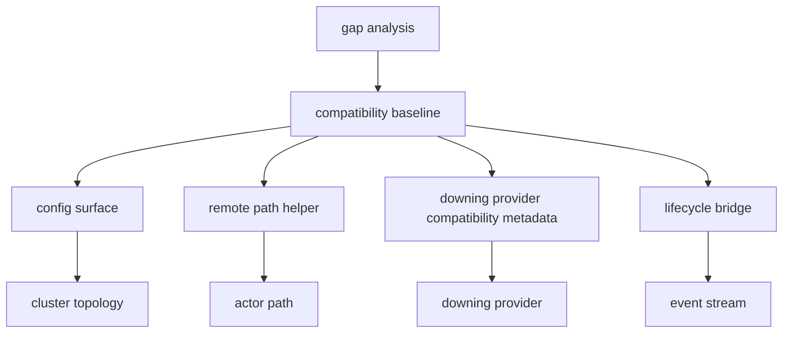
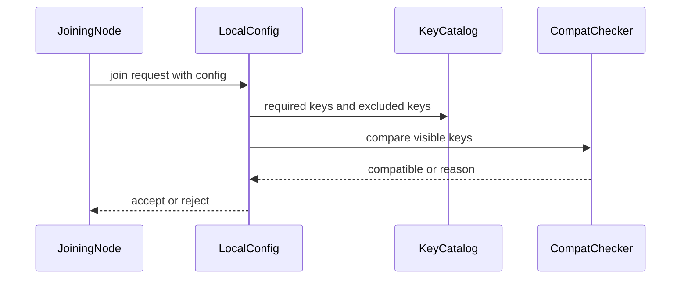
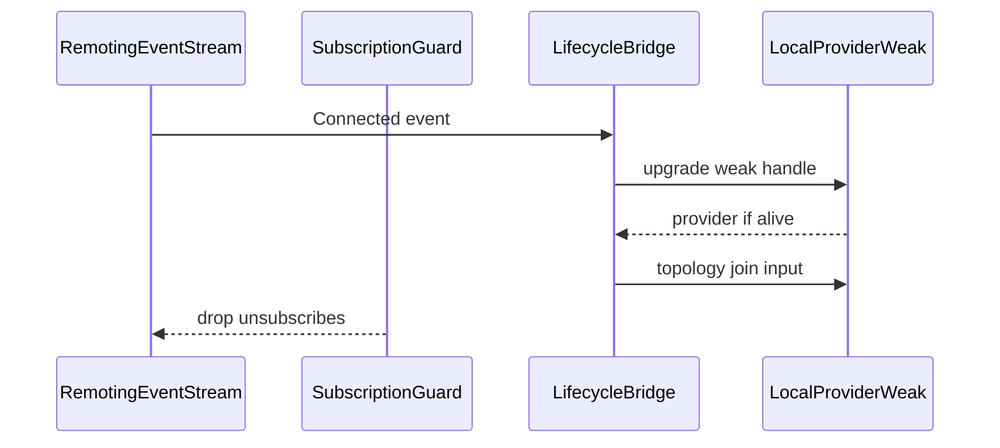

# Design Document

## Overview

この feature は、cluster gap analysis の trivial / easy active follow-up を、後続 spec が依存できる compatibility baseline として固定する。対象ユーザーは fraktor-rs cluster runtime 実装者と reviewer であり、config、remote path、provider hook、std lifecycle bridge の contract を同じ語彙で確認できるようにする。

既存実装には `ClusterApi::remote_path_of`、`subscribe_remoting_events`、`DowningProviderCompatibility`、`ClusterExtensionInstaller::with_downing_provider_factory` がある。この設計はそれらを置き換えず、config compatibility full key set と downing provider compatibility metadata を補い、gap analysis の完了証跡を持てる状態にする。

### Goals

- trivial / easy の4項目を実装・検証可能な baseline contract にする。
- `*-core` と `cluster-adaptor-std` の境界を維持する。
- downstream membership、gossip、downing、discovery、pubsub、serialization spec に責務を残す。

### Non-Goals

- full Split Brain Resolver、DowningStrategy、lease majority の decision model。
- `WeaklyUp`、Reachability matrix、GossipEnvelope、heartbeat protocol。
- generic discovery backend、SeedNodeProcess、DistributedPubSubMediator、cluster message serializer。
- Pekko HOCON loader、dynamic access、Akka/Pekko binary compatibility。

## Boundary Commitments

### This Spec Owns

- cluster join compatibility で比較する key catalog、比較対象外 key、checker composition の baseline。
- `ClusterApi::remote_path_of` 相当の canonical remote actor path contract。
- downing provider compatibility metadata の provider key / settings identity / factory surface。
- std remoting lifecycle bridge の subscription retention と weak provider lifetime contract。
- `docs/gap-analysis/cluster-gap-analysis.md` の trivial / easy 4項目に対する status 更新。

### Out of Boundary

- membership status model、reachability matrix、indirect connection handling。
- gossip merge、heartbeat sender/receiver、Cross-DC heartbeat。
- SBR decision actor、strategy evaluator、lease abstraction。
- discovery backend abstraction、seed node process。
- pubsub mediator protocol、cluster message serializer contract。

### Allowed Dependencies

- `openspec/specs/cluster-provider-boundary` の provider-neutral topology input contract。
- `openspec/specs/cluster-adaptor-std-remote-delivery` の remoting subscription lifetime contract。
- `openspec/specs/cluster-core-module-organization` の `extension`、`topology`、`downing_provider`、`cluster_provider` 境界。
- `fraktor_actor_core_kernel_rs::actor::actor_path` の canonical path primitive。
- `fraktor_actor_core_kernel_rs::event::stream::EventStreamSubscription` の drop-based unsubscribe contract。

### Revalidation Triggers

- `ClusterExtensionConfig` の public compatibility field が追加・削除される。
- `DowningProviderCompatibility` または `SplitBrainResolverSettings` の identity semantics が変わる。
- `ActorRef::canonical_path` または `ActorPath` formatting の contract が変わる。
- remoting lifecycle event names、subscription lifetime、provider shared/weak handle contract が変わる。
- downstream specs が baseline key catalog に依存する compatibility key を追加する。

## Architecture

### Existing Architecture Analysis

`fraktor-cluster-core-kernel-rs` は `extension` で cluster entrypoint と config を持ち、`topology` で join compatibility と observed topology contract を持つ。`downing_provider` は provider identity と no-op/default behavior を持ち、decision model 本体はまだ限定的である。`cluster-adaptor-std` は std-only lifecycle bridge を `cluster_provider` adaptor として持つ。

この feature は extension/config、topology compatibility、extension/api、downing_provider、std provider adaptor の既存 surface を拡張する。新しい umbrella module は導入しない。

### Architecture Pattern & Boundary Map



**Architecture Integration**:
- Selected pattern: existing boundary extension。既存 module boundary に小さな contract を足し、baseline spec が横断的な追跡単位になる。
- Domain/feature boundaries: config は core/topology、path は extension API、downing compatibility metadata は downing_provider + std/provider、lifecycle は cluster-adaptor-std が所有する。
- Existing patterns preserved: `no_std` core、std adaptor separation、one public type per file、sibling test file。
- New components rationale: config key catalog と downing compatibility metadata は gap close-out に必要な missing surface であり、既存 factory だけでは comparison 名と completion evidence が不足する。
- Steering compliance: core は `alloc` / no_std に留め、Tokio や event stream subscription lifetime は std adaptor 側へ置く。

### Technology Stack

| Layer | Choice / Version | Role in Feature | Notes |
|-------|------------------|-----------------|-------|
| Core runtime | Rust 2024 nightly workspace | config、path、downing compatibility contract | `no_std` + `alloc` を維持 |
| Std adaptor | `cluster-adaptor-std` | remoting lifecycle subscription retention と downing compatibility metadata | host lifecycle は std 側 |
| Eventing | actor-core EventStream | remoting lifecycle events と cluster topology events | drop-based subscription guard |
| Tests | cargo unit/integration tests | acceptance criteria の証明 | 対象 crate の targeted tests を優先 |

## File Structure Plan

### Directory Structure

```text
modules/cluster-core-kernel/src/
├── extension/
│   ├── cluster_extension_config.rs          # compatibility key surface を config へ接続する
│   ├── cluster_extension_config_test.rs     # compatibility key / exclusion / composition を検証する
│   ├── cluster_api.rs                       # remote_path_of contract を維持する
│   └── cluster_api_test.rs                  # local/remote/UID/error path を検証する
├── topology/
│   ├── join_config_compat_checker.rs        # checker composition contract を定義する
│   ├── cluster_compatibility_key.rs         # 比較対象 key identity
│   ├── cluster_compatibility_key_set.rs     # required / excluded key catalog
│   └── *_test.rs                            # sibling test files
└── downing_provider/
    ├── downing_provider_compatibility.rs    # provider key と SBR settings identity
    └── *_test.rs                            # sibling test files

modules/cluster-adaptor-std/src/
└── cluster_provider/
    ├── local_cluster_provider_ext.rs        # remoting subscription retention contract
    ├── downing_provider_compatibility.rs    # std から参照する compatibility metadata helper
    └── *_test.rs                            # lifecycle / factory tests
```

### Modified Files

- `modules/cluster-core-kernel/src/topology.rs` — 新しい compatibility key catalog を公開する。
- `modules/cluster-core-kernel/src/downing_provider.rs` — downing compatibility metadata を公開する。
- `modules/cluster-adaptor-std/src/cluster_provider.rs` — std 側から同じ compatibility metadata を参照できるようにする。
- `docs/gap-analysis/cluster-gap-analysis.md` — trivial / easy 4項目の status と evidence を更新する。

## System Flows



この flow は comparison key の見える化に限定する。設定 loader、HOCON parsing、dynamic access は扱わない。



subscription guard の保持中だけ lifecycle events が provider input になる。bridge は weak handle を使い、provider を延命しない。

## Requirements Traceability

| Requirement | Summary | Components | Interfaces | Flows |
|-------------|---------|------------|------------|-------|
| 1.1 | 比較対象 key と理由を返す | ClusterCompatibilityKeyCatalog, JoinCompatibilityComposition | `JoinConfigCompatChecker` | config compatibility |
| 1.2 | downing provider / SBR mismatch を検出する | DowningProviderCompatibility, ClusterExtensionConfig | `check_join_compatibility` | config compatibility |
| 1.3 | sensitive / local-only key を除外する | ClusterCompatibilityKeyCatalog | key catalog API | config compatibility |
| 1.4 | checker reason を合成する | JoinCompatibilityComposition | checker composition API | config compatibility |
| 1.5 | 後続 spec が参照できる語彙を公開する | ClusterCompatibilityKeyCatalog | public key constants | config compatibility |
| 2.1 | local ref を advertised authority 付き path にする | RemotePathHelper | `ClusterApi::remote_path_of` | remote path |
| 2.2 | 既存 remote authority を保持する | RemotePathHelper | `ActorPath` | remote path |
| 2.3 | canonical path 不在を失敗にする | RemotePathHelper | `ClusterResolveError` | remote path |
| 2.4 | UID を保持する | RemotePathHelper | `ActorUid` | remote path |
| 3.1 | provider key と SBR settings を config に反映する | DowningProviderCompatibility | provider factory API | downing compatibility metadata |
| 3.2 | no-op behavior を維持する | DowningProviderCompatibility | default provider behavior | downing compatibility metadata |
| 3.3 | decision model を実装しない | DowningProviderCompatibility | non-goal guard | downing compatibility metadata |
| 3.4 | provider decision failure を観測可能にする | DowningProviderCompatibility | downing error path | downing compatibility metadata |
| 4.1 | subscription guard を返す | TransportLifecycleBridge | `EventStreamSubscription` | lifecycle bridge |
| 4.2 | connected event を join input にする | TransportLifecycleBridge | `subscribe_remoting_events` | lifecycle bridge |
| 4.3 | drop 後に topology update しない | TransportLifecycleBridge | guard drop contract | lifecycle bridge |
| 4.4 | provider を強保持しない | TransportLifecycleBridge | weak provider handle | lifecycle bridge |
| 5.1 | membership reachability を下流に残す | ScopeGuard | roadmap boundary | none |
| 5.2 | gossip/downing/discovery/pubsub/serialization を下流に残す | ScopeGuard | roadmap boundary | none |
| 5.3 | gap analysis 更新を4項目に限定する | GapAnalysisUpdate | docs update | none |

## Components and Interfaces

| Component | Domain/Layer | Intent | Req Coverage | Key Dependencies | Contracts |
|-----------|--------------|--------|--------------|------------------|-----------|
| ClusterCompatibilityKeyCatalog | core/topology | join compatibility key の比較対象と除外対象を定義する | 1.1, 1.3, 1.5 | ClusterExtensionConfig P0 | State |
| JoinCompatibilityComposition | core/topology | 複数 checker の結果と reason を合成する | 1.1, 1.4 | JoinConfigCompatChecker P0 | Service |
| RemotePathHelper | core/extension | actor ref から canonical remote path を返す | 2.1, 2.2, 2.3, 2.4 | ActorPath P0, ClusterExtension P0 | Service |
| DowningProviderCompatibility | core/downing + std/provider | SBR provider identity と metadata を固定する | 3.1, 3.2, 3.3, 3.4 | DowningProviderCompatibility P0 | Service |
| TransportLifecycleBridge | std/provider | remoting lifecycle subscription と provider lifetime を接続する | 4.1, 4.2, 4.3, 4.4 | EventStreamSubscription P0, LocalClusterProviderWeak P0 | Event |
| GapAnalysisUpdate | docs | trivial / easy 4項目の status と evidence を更新する | 5.1, 5.2, 5.3 | roadmap P0 | Batch |

### core/topology

#### ClusterCompatibilityKeyCatalog

| Field | Detail |
|-------|--------|
| Intent | compatibility check の key identity と除外規則を提供する |
| Requirements | 1.1, 1.3, 1.5 |

**Responsibilities & Constraints**
- required key、optional comparison key、sensitive/local-only excluded key を区別する。
- public key は stable string として downstream spec が参照できる。
- HOCON loader や environment secret inspection は所有しない。

**Dependencies**
- Inbound: `ClusterExtensionConfig` — 現在の config snapshot を提供する (P0)
- Outbound: `ConfigValidation` — incompatible reason を返す (P0)

**Contracts**: Service [ ] / API [ ] / Event [ ] / Batch [ ] / State [x]

##### State Management
- State model: immutable key catalog。
- Persistence & consistency: runtime persistence なし。
- Concurrency strategy: shared mutable state を持たない。

#### JoinCompatibilityComposition

| Field | Detail |
|-------|--------|
| Intent | 複数 compatibility checker の結果を順序付きで合成する |
| Requirements | 1.1, 1.4 |

**Responsibilities & Constraints**
- checker ごとの incompatible reason を保持する。
- first failure だけを返す場合でも、どの checker が failed かを test で確認できる形にする。
- checker composition は config comparison に限定し、membership policy を呼ばない。

**Contracts**: Service [x] / API [ ] / Event [ ] / Batch [ ] / State [ ]

##### Service Interface

```rust
trait JoinConfigCompatChecker {
  fn check_join_compatibility(&self, joining: &ClusterExtensionConfig) -> ConfigValidation;
}
```

- Preconditions: local と joining の config snapshot が構築済みである。
- Postconditions: compatible または incompatible reason が返る。
- Invariants: sensitive/local-only excluded key は comparison result に影響しない。

### core/extension

#### RemotePathHelper

| Field | Detail |
|-------|--------|
| Intent | `ActorRef` を cluster advertised authority 付き canonical remote path に変換する |
| Requirements | 2.1, 2.2, 2.3, 2.4 |

**Responsibilities & Constraints**
- local canonical path には cluster startup address を authority として付与する。
- 既存 remote authority と UID は保持する。
- canonical path がない actor ref は error として扱う。

**Contracts**: Service [x] / API [ ] / Event [ ] / Batch [ ] / State [ ]

##### Service Interface

```rust
impl ClusterApi {
  pub fn remote_path_of(&self, actor_ref: &ActorRef) -> Result<ActorPath, ClusterResolveError>;
}
```

- Preconditions: cluster extension が install 済みである。
- Postconditions: canonical remote path または observable error を返す。
- Invariants: actor ref の PID や sender は変更しない。

### core/downing and std/provider

#### DowningProviderCompatibility

| Field | Detail |
|-------|--------|
| Intent | downing provider key と SBR settings identity を compatibility metadata として固定する |
| Requirements | 3.1, 3.2, 3.3, 3.4 |

**Responsibilities & Constraints**
- provider key と SBR settings identity を compatibility metadata に入れる。
- `NoopDowningProvider` fallback と custom provider factory の既存 behavior を変更しない。
- `SplitBrainResolver` actor、strategy evaluator、lease majority は作らない。
- provider-facing SBR hook と decision failure 変換は `cluster-downing-sbr-decision-model` に残す。

**Contracts**: Service [x] / API [ ] / Event [ ] / Batch [ ] / State [ ]

##### Service Interface

```rust
impl DowningProviderCompatibility {
  pub fn provider_key(&self) -> &str;
  pub fn sbr_settings_identity(&self) -> Option<&str>;
}
```

- Preconditions: provider key が empty でない。
- Postconditions: join compatibility と downstream downing spec が同じ metadata を参照できる。
- Invariants: decision behavior は provider 実装に委譲され、この spec は判定規則を定義しない。

### std/provider

#### TransportLifecycleBridge

| Field | Detail |
|-------|--------|
| Intent | remoting lifecycle events を provider input へ変換する subscription lifetime を固定する |
| Requirements | 4.1, 4.2, 4.3, 4.4 |

**Responsibilities & Constraints**
- `EventStreamSubscription` を caller が保持できる戻り値として返す。
- started provider のみ connected/quarantined events を topology input として扱う。
- weak provider handle を使い、subscription が provider を延命しない。

**Contracts**: Service [ ] / API [ ] / Event [x] / Batch [ ] / State [ ]

##### Event Contract
- Subscribed events: `RemotingLifecycleEvent::Connected`, `RemotingLifecycleEvent::Quarantined`
- Published events: provider 経由の `ClusterEvent::TopologyUpdated`
- Ordering / delivery guarantees: EventStream の live delivery に従う。subscription drop 後の delivery は保証しない。

## Data Models

### Domain Model

- `ClusterCompatibilityKey`: compatibility comparison の stable key identity。
- `ClusterCompatibilityKeySet`: required、optional、excluded key の immutable catalog。
- `DowningProviderCompatibility`: provider key と optional SBR settings identity。
- `ActorPath`: actor-core が所有する canonical actor path。
- `EventStreamSubscription`: std lifecycle bridge の lifetime guard。

### Data Contracts & Integration

- config comparison result は `ConfigValidation::Compatible` または `ConfigValidation::Incompatible { reason }`。
- remote path result は `Result<ActorPath, ClusterResolveError>`。
- lifecycle bridge は `EventStreamSubscription` を返し、drop が unsubscribe を表す。

## Error Handling

### Error Strategy

- config mismatch は panic ではなく `ConfigValidation::Incompatible` で返す。
- invalid actor path または canonical path 不在は `ClusterResolveError` で返す。
- provider が decision を返せない場合は downing flow の既存 error path で観測可能にする。
- lifecycle bridge は provider upgrade 失敗を no-op とし、provider を延命しない contract を優先する。

### Monitoring

- 新規 runtime metrics は導入しない。
- validation は unit tests と gap analysis evidence で行う。

## Testing Strategy

- `ClusterExtensionConfig` の compatibility tests で required key、excluded key、checker composition、downing/SBR/failure detector choice を検証する。
- `ClusterApi::remote_path_of` の既存 tests を維持し、local/remote/UID/error path が通ることを確認する。
- downing provider compatibility metadata は provider key、settings identity、no-op fallback、custom factory delegation を unit tests で検証する。
- `subscribe_remoting_events` は subscription retained/drop/provider weak lifetime を std tests で検証する。
- gap analysis は trivial / easy 4項目だけの status/evidence が更新され、downstream/deferred 項目が変わらないことを review する。

## Integration & Migration Notes

- 既存 public API を削除しない。
- compatibility key catalog は downstream spec の参照先になるため、key 名の変更は revalidation trigger として扱う。
- `SplitBrainResolverProvider` helper を追加する場合でも、decision model は no-op または caller-supplied provider に委譲する。

## Open Questions / Risks

- failure detector implementation choice の key shape は downstream gossip/heartbeat spec と衝突しないよう、identity だけを baseline にする。
- downing compatibility metadata の名称は Pekko term 由来のため許容するが、ambiguous suffix lint への対応が必要な場合は人間判断で exception を扱う。
