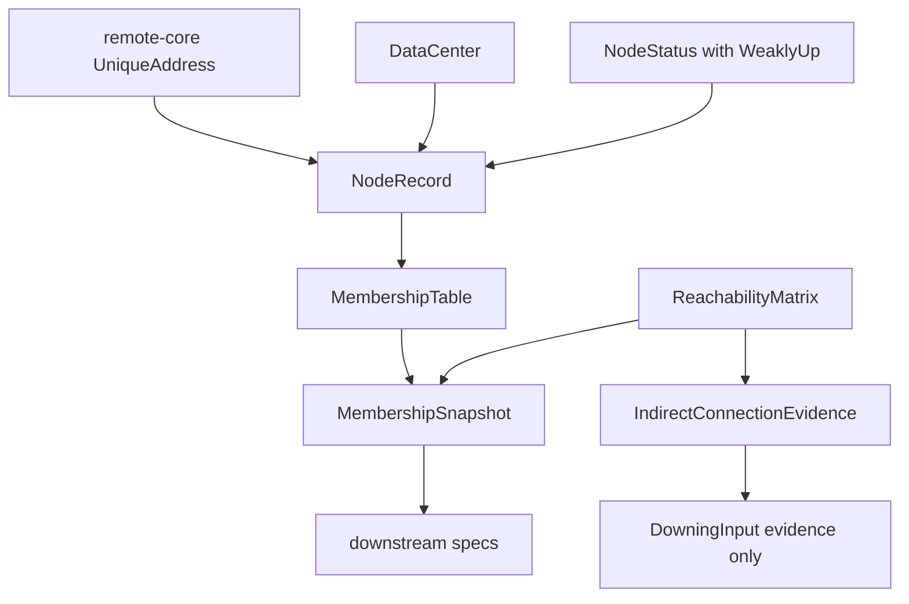
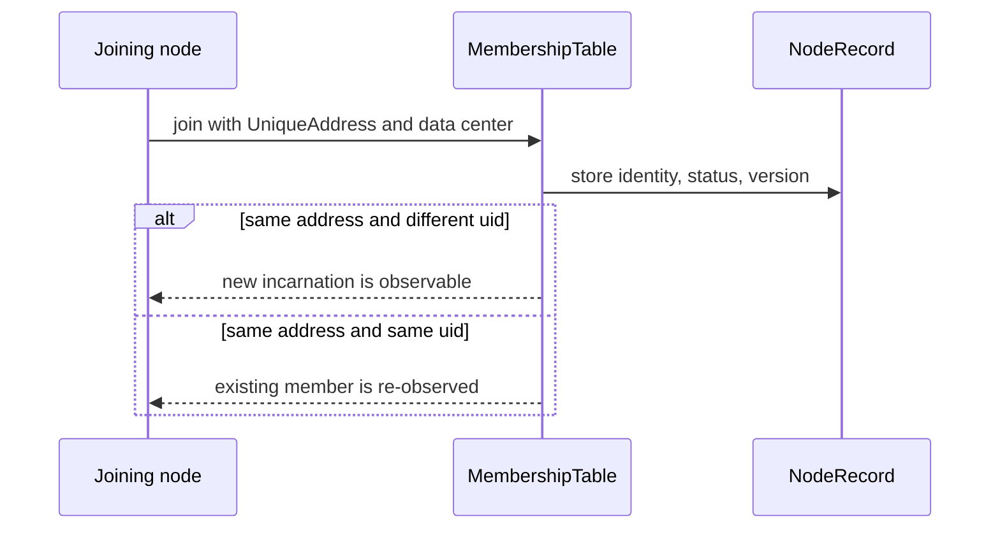
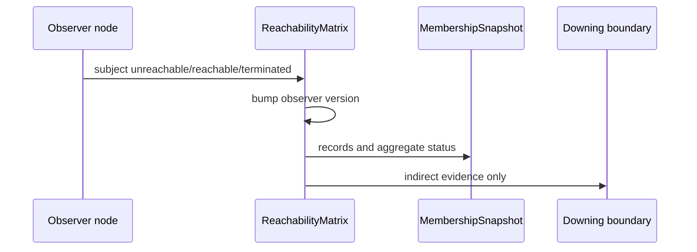

# Design Document

## Overview

この feature は、cluster membership が node incarnation、data center、暫定参加 status、reachability evidence を同じ snapshot contract で扱えるようにする。対象ユーザーは fraktor-rs cluster runtime 実装者と downstream spec 実装者であり、gossip/heartbeat、downing、pubsub が参照する membership 前提を安定させる。

既存実装には `NodeRecord`、`NodeStatus`、`MembershipTable`、`CurrentClusterState`、`MembershipCoordinator` がある。現在の model は authority 文字列と `Suspect` status を中心にしているため、Pekko comparison の `UniqueAddress`、data center、`WeaklyUp`、observer/subject reachability matrix、partial connectivity evidence を表現できる core contract へ拡張する。

### Goals

- member identity を address + uid の `UniqueAddress` semantics に揃える。
- data center と `WeaklyUp` を membership snapshot で観測可能にする。
- observer / subject / status / version を持つ `ReachabilityMatrix` を core/membership に追加する。
- indirect connection handling を downing policy ではなく evidence として公開する。

### Non-Goals

- GossipEnvelope、dedicated heartbeat protocol、CrossDcClusterHeartbeat。
- full Gossip merge、tombstone、seen digest、wire serialization。
- SplitBrainResolver、DowningStrategy、lease-based majority、downing execution。
- SeedNodeProcess、generic discovery adapter、DistributedPubSubMediator、message serializer。

## Boundary Commitments

### This Spec Owns

- membership record の authoritative identity としての address + uid semantics。
- member record / snapshot / current state における data center と `WeaklyUp` status。
- observer / subject / status / version を持つ reachability matrix と aggregate status contract。
- partial connectivity と indirect connection evidence の生成 contract。
- `docs/gap-analysis/cluster-gap-analysis.md` の該当5項目に対する evidence 更新。

### Out of Boundary

- heartbeat sender/receiver、sequence number、heartbeat response、Cross-DC heartbeat scheduling。
- gossip envelope、full gossip state merge、tombstone prune、seen digest。
- SBR strategy evaluation、responsible node selection、lease majority、down operation。
- discovery backend、seed node orchestration、pubsub topic registry gossip、cluster message serialization。

### Allowed Dependencies

- `cluster-active-compatibility-baseline` の config / provider compatibility 語彙。
- `fraktor-remote-core-rs::address::{Address, UniqueAddress}` の no_std identity primitive。
- 既存 `membership` module の `MembershipVersion`、`NodeRecord`、`NodeStatus`、`MembershipTable`、`CurrentClusterState`。
- 既存 `downing_provider` boundary の `FailureObservation` / `DowningInput`。

### Revalidation Triggers

- `fraktor-remote-core-rs::address::UniqueAddress` の equality、ordering、uid sentinel semantics が変わる。
- `NodeRecord` の public fields、constructor、snapshot serialization assumptions が変わる。
- `NodeStatus::is_active` または router / activation が参照する active member 判定が変わる。
- `ReachabilityMatrix` record shape、aggregate status precedence、version merge contract が変わる。
- Downing / pubsub / gossip specs が membership snapshot の reachability fields を consume し始める。

## Architecture

### Existing Architecture Analysis

`fraktor-cluster-core-kernel-rs` の `membership` module は `MembershipTable` を中心に node lifecycle と gossip delta を保持する。`NodeRecord` は `node_id`、`authority`、`status`、`version`、`join_version`、`app_version`、`roles` を持つ。failure detection は `MembershipCoordinator` が `NodeStatus::Suspect` と `ClusterEvent::MemberUnreachable` / `MemberReachable` に変換している。

`fraktor-remote-core-rs` には no_std の `Address` と `UniqueAddress` があり、Pekko の address + uid semantics を既に持つ。cluster-core は現在 production dependency として remote-core を持たないため、この feature は identity の重複実装を避ける代わりに、remote-core を core dependency として追加する。

### Architecture Pattern & Boundary Map



**Architecture Integration**:
- Selected pattern: existing membership boundary extension。既存 `membership` module の state model を拡張し、transport と decision policy は外へ出す。
- Domain/feature boundaries: identity/data center/status は `NodeRecord`、reachability evidence は `ReachabilityMatrix`、downing 連携は evidence input だけが責務を持つ。
- Existing patterns preserved: `no_std` core、1公開型1ファイル、sibling test file、Markdown は日本語、rustdoc は英語。
- New components rationale: `ReachabilityMatrix` と `IndirectConnectionEvidence` は `Suspect` status だけでは表現できない observer 差分を保持するために必要。
- Steering compliance: host runtime、Tokio、network I/O、heartbeat scheduling は `cluster-adaptor-std` または後続 spec に置く。

### Technology Stack

| Layer | Choice / Version | Role in Feature | Notes |
|-------|------------------|-----------------|-------|
| Core runtime | Rust 2024 nightly workspace | membership identity、status、reachability state | `no_std` + `alloc` を維持 |
| Remote identity | `fraktor-remote-core-rs` | `Address` / `UniqueAddress` の再利用 | production dependency 追加候補 |
| Data structure | `alloc::collections::BTreeMap` / `Vec` | deterministic reachability records | std 依存なし |
| Tests | cargo unit tests | state transition、snapshot、matrix、evidence の検証 | sibling `*_test.rs` |

## File Structure Plan

### Directory Structure

```text
modules/cluster-core-kernel/src/
├── membership.rs                         # 新しい membership 型の module wiring
├── membership/
│   ├── data_center.rs                    # data center domain primitive
│   ├── data_center_test.rs               # default / explicit data center tests
│   ├── node_record.rs                    # UniqueAddress と data center を保持する member record
│   ├── node_record_test.rs               # incarnation / ordering / data center tests
│   ├── node_status.rs                    # WeaklyUp と transition helper
│   ├── node_status_test.rs               # WeaklyUp transition / active helper tests
│   ├── reachability_status.rs            # Reachable / Unreachable / Terminated
│   ├── reachability_record.rs            # observer / subject / status / version record
│   ├── reachability_matrix.rs            # matrix update / aggregate / prune contract
│   ├── reachability_matrix_test.rs       # matrix behavior tests
│   ├── reachability_snapshot.rs          # snapshot payload for membership/current state
│   ├── indirect_connection_evidence.rs   # partial connectivity evidence
│   ├── indirect_connection_evidence_test.rs
│   ├── membership_snapshot.rs            # reachability snapshot を含める
│   ├── current_cluster_state.rs          # data center と reachability view を公開する
│   ├── membership_table.rs               # identity/data center/status transition を反映する
│   └── membership_coordinator.rs         # failure detection から matrix/evidence を更新する
└── downing_provider/
    ├── failure_observation.rs            # optional reachability evidence を参照する
    ├── failure_observation_kind.rs       # direct/indirect に必要な kind を整理する
    └── downing_input.rs                  # evidence input を受け取るが decision はしない
```

### Modified Files

- `modules/cluster-core-kernel/Cargo.toml` — `fraktor-remote-core-rs` を no_std production dependency として追加する。
- `modules/cluster-core-kernel/src/membership.rs` — `DataCenter`、`ReachabilityMatrix`、`ReachabilityRecord`、`ReachabilityStatus`、`ReachabilitySnapshot`、`IndirectConnectionEvidence` を公開する。
- `modules/cluster-core-kernel/src/membership/node_record.rs` — `UniqueAddress` と `DataCenter` を authoritative member data に追加する。
- `modules/cluster-core-kernel/src/membership/node_status.rs` — `WeaklyUp` と transition helper を追加する。
- `modules/cluster-core-kernel/src/membership/membership_table.rs` — join/rejoin、snapshot、status transition、reachability matrix update を接続する。
- `modules/cluster-core-kernel/src/membership/current_cluster_state.rs` — current state に data center と reachability snapshot を含める。
- `modules/cluster-core-kernel/src/downing_provider/*` — indirect connection evidence を input として渡せるようにするが、decision は実装しない。
- `docs/gap-analysis/cluster-gap-analysis.md` — active medium の該当5項目だけに evidence を追加する。

## System Flows





## Requirements Traceability

| Requirement | Summary | Components | Interfaces | Flows |
|-------------|---------|------------|------------|-------|
| 1.1 | address + uid を member identity にする | NodeRecord, MembershipTable | join input | join identity |
| 1.2 | 同じ address の別 uid を別 incarnation にする | NodeRecord, MembershipTable | identity comparison | join identity |
| 1.3 | 同一 UniqueAddress を再観測として扱う | MembershipTable | identity comparison | join identity |
| 1.4 | snapshot / delta に identity を含める | MembershipSnapshot, MembershipDelta | snapshot API | join identity |
| 1.5 | uid 未確定を同一視しない | NodeRecord, MembershipError | join validation | join identity |
| 2.1 | data center を member record に保持する | DataCenter, NodeRecord | join input | join identity |
| 2.2 | default data center を観測可能にする | DataCenter | default constructor | join identity |
| 2.3 | snapshot/current state に data center を保持する | MembershipSnapshot, CurrentClusterState | snapshot API | none |
| 2.4 | data center ごとの member view を提供する | MembershipTable, CurrentClusterState | filter API | none |
| 2.5 | Cross-DC heartbeat を所有しない | ScopeGuard | boundary | none |
| 3.1 | WeaklyUp status を観測可能にする | NodeStatus, MembershipTable | status transition | join identity |
| 3.2 | WeaklyUp から Up へ昇格する | NodeStatus, MembershipCoordinator | status transition | join identity |
| 3.3 | WeaklyUp の leave/down transition を定義する | NodeStatus, MembershipTable | transition helper | none |
| 3.4 | active view で暫定参加を判定できる | NodeStatus | helper API | none |
| 3.5 | SBR decision を行わない | ScopeGuard | boundary | none |
| 4.1 | observer/subject/status/version record を保持する | ReachabilityRecord, ReachabilityMatrix | matrix update | reachability |
| 4.2 | reachable record を prune する | ReachabilityMatrix | reachable update | reachability |
| 4.3 | terminated を unreachable より強く扱う | ReachabilityStatus, ReachabilityMatrix | aggregate status | reachability |
| 4.4 | subject ごとの aggregate status を返す | ReachabilityMatrix | aggregate query | reachability |
| 4.5 | reachability snapshot を含める | ReachabilitySnapshot, MembershipSnapshot | snapshot API | reachability |
| 5.1 | direct / indirect observation を区別する | IndirectConnectionEvidence | evidence API | reachability |
| 5.2 | partial connectivity を観測可能にする | ReachabilityMatrix, IndirectConnectionEvidence | classification API | reachability |
| 5.3 | observer 自身の状態を考慮する | ReachabilityMatrix | evidence generation | reachability |
| 5.4 | downing へ evidence だけ渡す | DowningInput, FailureObservation | downing input | reachability |
| 5.5 | evidence 不在時は direct reachability だけを使う | ReachabilityMatrix | evidence API | reachability |
| 6.1 | gossip/heartbeat を後続 spec に残す | ScopeGuard | boundary | none |
| 6.2 | SBR/downing strategy を後続 spec に残す | ScopeGuard | boundary | none |
| 6.3 | discovery/pubsub/serialization を後続 spec に残す | ScopeGuard | boundary | none |
| 6.4 | gap analysis 更新を5項目に限定する | GapAnalysisUpdate | docs update | none |

## Components and Interfaces

| Component | Domain/Layer | Intent | Req Coverage | Key Dependencies | Contracts |
|-----------|--------------|--------|--------------|------------------|-----------|
| NodeIdentityRecord | core/membership | `UniqueAddress` を member identity として `NodeRecord` に保持する | 1.1, 1.2, 1.3, 1.4, 1.5 | remote-core `UniqueAddress` P0 | State |
| DataCenterMembership | core/membership | data center primitive と member view を提供する | 2.1, 2.2, 2.3, 2.4, 2.5 | NodeRecord P0 | State |
| WeaklyUpStatus | core/membership | `WeaklyUp` と status transition helper を定義する | 3.1, 3.2, 3.3, 3.4, 3.5 | NodeStatus P0 | State |
| ReachabilityMatrix | core/membership | observer/subject reachability records と aggregate status を保持する | 4.1, 4.2, 4.3, 4.4, 4.5 | UniqueAddress P0 | State |
| IndirectConnectionEvidence | core/membership + downing input | partial connectivity を evidence として公開する | 5.1, 5.2, 5.3, 5.4, 5.5 | ReachabilityMatrix P0, DowningInput P1 | State |
| ScopeGuard | spec boundary | downstream scope を吸収しないことを保つ | 6.1, 6.2, 6.3 | roadmap P0 | Batch |
| GapAnalysisUpdate | docs | active medium 5項目の evidence を更新する | 6.4 | docs/gap-analysis P0 | Batch |

### core/membership

#### NodeIdentityRecord

| Field | Detail |
|-------|--------|
| Intent | member incarnation を address + uid で一意に識別する |
| Requirements | 1.1, 1.2, 1.3, 1.4, 1.5 |

**Responsibilities & Constraints**
- `NodeRecord` は `UniqueAddress` を authoritative identity として持つ。
- same address + different uid は別 incarnation として扱う。
- uid `0` など未確定 sentinel は確定 member と同一視しない。
- authority 文字列は表示・interop 補助として扱い、identity 判定の唯一の根拠にしない。

**Dependencies**
- External: `fraktor-remote-core-rs::address::UniqueAddress` — address + uid identity (P0)
- Inbound: `MembershipTable` — join/rejoin lifecycle (P0)
- Outbound: `MembershipSnapshot` / `MembershipDelta` — identity propagation (P0)

**Contracts**: Service [ ] / API [ ] / Event [ ] / Batch [ ] / State [x]

##### State Management
- State model: `NodeRecord` は `UniqueAddress`、`DataCenter`、status、versions、app_version、roles を保持する。
- Persistence & consistency: runtime persistence は持たず、snapshot/delta で identity を伝播する。
- Concurrency strategy: shared mutable state を増やさず、既存 `MembershipTable` の `&mut self` 更新に従う。

#### DataCenterMembership

| Field | Detail |
|-------|--------|
| Intent | member の data center を membership view に含める |
| Requirements | 2.1, 2.2, 2.3, 2.4, 2.5 |

**Responsibilities & Constraints**
- `DataCenter` は default と explicit name を区別できる domain primitive とする。
- `NodeRecord`、`MembershipSnapshot`、`CurrentClusterState` は data center を保持する。
- data center 別 view は filtering contract であり、Cross-DC heartbeat protocol を開始しない。

**Contracts**: Service [x] / API [ ] / Event [ ] / Batch [ ] / State [x]

##### Service Interface

```rust
impl MembershipSnapshot {
  pub fn members_in_data_center(&self, data_center: &DataCenter) -> Vec<NodeRecord>;
}
```

- Preconditions: snapshot は membership version と reachability snapshot を含む。
- Postconditions: 指定 data center の members だけを返し、record の identity/status/reachability 前提を失わない。
- Invariants: default data center は空文字ではなく明示名として扱う。

#### WeaklyUpStatus

| Field | Detail |
|-------|--------|
| Intent | join 後の暫定参加状態を `Up` と区別する |
| Requirements | 3.1, 3.2, 3.3, 3.4, 3.5 |

**Responsibilities & Constraints**
- `NodeStatus::WeaklyUp` を追加する。
- allowed transition は `Joining -> WeaklyUp -> Up`、`WeaklyUp -> Leaving/Dead/Removed` を含む。
- `is_active` とは別に `is_serving_member` または同等 helper で caller が暫定参加を判定できるようにする。
- SBR decision は行わない。

**Contracts**: Service [ ] / API [ ] / Event [ ] / Batch [ ] / State [x]

##### State Management
- State model: `WeaklyUp` は `Joining` と `Up` の間にある member status。
- Persistence & consistency: delta と event に通常の status transition として含まれる。
- Concurrency strategy: 既存 `MembershipTable` transition と同じ `&mut self` 更新。

#### ReachabilityMatrix

| Field | Detail |
|-------|--------|
| Intent | observer ごとの subject reachability evidence を保持する |
| Requirements | 4.1, 4.2, 4.3, 4.4, 4.5 |

**Responsibilities & Constraints**
- `ReachabilityRecord` は observer、subject、status、version を持つ。
- `ReachabilityStatus` は `Reachable`、`Unreachable`、`Terminated` を持つ。
- default reachable は record なしで表す。reachable update で observer row が全て reachable になる場合は prune する。
- aggregate status は `Terminated`、`Unreachable`、`Reachable` の優先順で返す。
- full gossip merge や wire format は所有しない。

**Contracts**: Service [x] / API [ ] / Event [ ] / Batch [ ] / State [x]

##### Service Interface

```rust
impl ReachabilityMatrix {
  pub fn unreachable(&mut self, observer: UniqueAddress, subject: UniqueAddress);
  pub fn reachable(&mut self, observer: UniqueAddress, subject: UniqueAddress);
  pub fn terminated(&mut self, observer: UniqueAddress, subject: UniqueAddress);
  pub fn aggregate_status(&self, subject: &UniqueAddress) -> ReachabilityStatus;
  pub fn snapshot(&self) -> ReachabilitySnapshot;
}
```

- Preconditions: observer と subject は確定済み `UniqueAddress` である。
- Postconditions: observer version が必要な場合だけ進み、snapshot は records と versions を保持する。
- Invariants: terminated record は reachable update で上書きされない。

#### IndirectConnectionEvidence

| Field | Detail |
|-------|--------|
| Intent | partial connectivity を downing policy ではなく evidence として表現する |
| Requirements | 5.1, 5.2, 5.3, 5.4, 5.5 |

**Responsibilities & Constraints**
- direct observer と subject の関係、他 observer の矛盾する observation、observer 自身の aggregate status を表す。
- evidence は `FailureObservation` または `DowningInput` へ渡せるが、`DowningDecision` は生成しない。
- partial connectivity がない場合は `None` または direct-only observation として扱う。

**Dependencies**
- Inbound: `ReachabilityMatrix` — evidence generation source (P0)
- Outbound: `downing_provider::FailureObservation` — downing input evidence (P1)

**Contracts**: Service [x] / API [ ] / Event [ ] / Batch [ ] / State [x]

##### Service Interface

```rust
impl ReachabilityMatrix {
  pub fn indirect_evidence_for(&self, subject: &UniqueAddress) -> Option<IndirectConnectionEvidence>;
}
```

- Preconditions: matrix は observer/subject records を持つ。
- Postconditions: partial connectivity が観測できる場合だけ evidence を返す。
- Invariants: evidence generation は node downing、quarantine、membership removal を実行しない。

### docs

#### GapAnalysisUpdate

| Field | Detail |
|-------|--------|
| Intent | active medium 5項目の実装 evidence を更新する |
| Requirements | 6.4 |

**Responsibilities & Constraints**
- 更新対象は `UniqueAddress` semantics、data center membership、`WeaklyUp` compatibility、`Reachability` matrix、indirect connection handling に限定する。
- Deferred Pekko concepts と downstream specs の項目を完了扱いにしない。

## Data Models

### Domain Model

- `UniqueAddress`: remote-core の address + uid。member incarnation の authoritative identity。
- `DataCenter`: default または explicit data center name。
- `NodeRecord`: `UniqueAddress`、data center、status、membership versions、app version、roles を持つ member record。
- `ReachabilityRecord`: observer `UniqueAddress`、subject `UniqueAddress`、status、version。
- `ReachabilityMatrix`: observer row と versions を持つ reachability state。
- `IndirectConnectionEvidence`: subject に対する direct/indirect/partial connectivity evidence。

### Logical Data Model

| Entity | Key | Main Attributes | Integrity Rule |
|--------|-----|-----------------|----------------|
| NodeRecord | `UniqueAddress` | data_center, status, version, join_version, roles | same address + different uid は別 incarnation |
| DataCenter | name | default flag or stable name | empty name は不可 |
| ReachabilityRecord | observer + subject | status, version | observer ごとの version が monotonic |
| ReachabilitySnapshot | matrix version set | records, observer versions | default reachable は record なし |
| IndirectConnectionEvidence | subject | direct status, conflicting observers, observer aggregate | decision を含めない |

## Testing Strategy

- `NodeRecord` / `MembershipTable` unit tests: same address + different uid、same `UniqueAddress` re-observation、uid 未確定 rejection、snapshot/delta identity propagation を検証する。
- `DataCenter` unit tests: default data center、explicit data center、data center filtering、current state propagation を検証する。
- `NodeStatus` / transition tests: `Joining -> WeaklyUp -> Up`、`WeaklyUp -> Leaving/Dead/Removed`、active helper の semantics を検証する。
- `ReachabilityMatrix` unit tests: unreachable/reachable/terminated update、version bump、reachable prune、aggregate precedence、snapshot propagation を検証する。
- `IndirectConnectionEvidence` unit tests: partial connectivity、observer 自身 unreachable、direct-only fallback、downing decision 非生成を検証する。
- crate checks: `cargo test -p fraktor-cluster-core-kernel-rs membership` と no_std 対象 check で remote-core dependency が std を引き込まないことを確認する。
