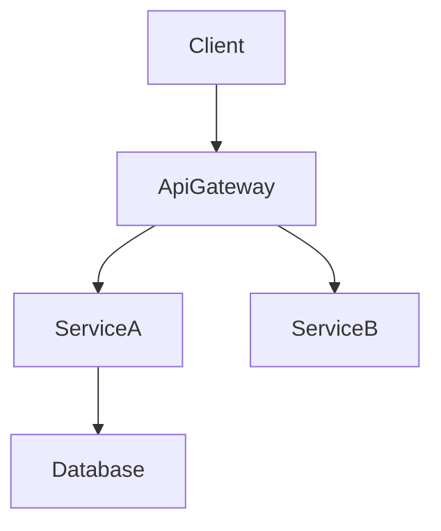

# 技術設計ルールと原則

## コア設計原則

### 1. 型安全性は絶対条件
- Rust の型システムを最大限活用し、`unsafe` の使用は最小限かつ理由を明記する
- すべてのパラメータ／戻り値に具体的な型を定義し、`Result` / `Option` で失敗経路を表現する
- 複雑な状態は `enum`（判別共用体）で表し、無効状態が生じないようにする
- ジェネリックや trait 境界は明示し、`where` 句で制約を正確に記述する

### 2. 設計と実装を分離
- **HOW ではなく WHAT** に集中し、振る舞いと契約を記述する
- メソッド本文やアルゴリズムではなく、前提条件／事後条件／不変条件を示す
- アーキテクチャ上の決定事項と責務分担を説明し、コード断片は極力避ける

### 3. 図による共有
- **小規模機能**: 簡易なコンポーネント図または省略
- **中規模**: アーキテクチャ図 + データ／制御フロー図
- **大規模**: アーキテクチャ、シーケンス、状態など複数図を併用
- **Mermaid で統一**: スタイル無し、純粋な構造のみを描く

### 4. コンポーネント設計ルール
- **単一責務**: 1 ファイル 1 型ルールに従い、役割を明確化
- **境界の明示**: ドメイン所有権と依存方向を明文化
- **依存の向き**: `utils → actor → app` など既定の層構造を守る
- **インターフェイス分離**: trait は用途ごとに小さく保ち、不要なメソッドを抱えない

### 5. データモデリング基準
- **ドメイン先行**: ビジネス概念 → 論理構造 → 物理実装の順に整理
- **整合性境界**: 集約／所有境界を明示し、一貫性確保方法を定義
- **正規化バランス**: パフォーマンスと整合性を両立させる
- **進化容易性**: バージョン管理や移行計画を前提に設計

### 6. エラーハンドリング哲学
- **Fail Fast**: 早期に検証し、明確な `Result` / `Error` を返す
- **Graceful Degradation**: 全停止ではなく部分機能で継続
- **利用者文脈**: 行動可能なエラーメッセージを設計
- **可観測性**: `tracing` やメトリクスで診断可能にする

### 7. 連携パターン
- **疎結合**: trait やチャネルで依存を最小化
- **契約優先**: 実装前に API/trait 契約を定義
- **バージョニング**: API の進化と互換戦略を計画
- **冪等性**: リトライ前提でメッセージ／コマンドを設計

## ドキュメント標準

### 言語とトーン
- **宣言的**: 「システムは～する」と言い切る
- **正確**: 抽象語ではなく具体的技術用語を使用
- **簡潔**: 必要最小限、冗長な説明を避ける
- **フォーマル**: プロとしての文体を維持

### 構造要件
- **階層構造**: 見出し階層で論点を整理
- **トレーサビリティ**: 要件 ↔ コンポーネントの対応を明記
- **網羅性**: 実装に必要な観点（API、データ、エラー、テスト等）をすべて含める
- **用語統一**: 同じ概念に異なる名前を付けない

## 図のガイドライン

### 図を入れる判断基準
- **アーキテクチャ図**: 3 つ以上のコンポーネント／外部システムが関わる場合
- **シーケンス図**: 呼び出しが複数ステップに及ぶ場合
- **状態／フロー図**: 状態遷移や意思決定が複雑な場合
- **ER 図**: データモデルが非自明な場合
- **省略可**: 単一コンポーネントの小変更のみ

### Mermaid ルール

- Mermaid 純正記法のみ（スタイル装飾禁止）
- ノード ID は英数字と `_` のみ（`@`, `/`, 先頭 `-` 禁止）
- ラベルには括弧や引用符を含めない
- エッジは制御／データフローの向きを示す
- `subgraph` は必要最小限に留める

## 品質メトリクス

### 設計コンプリートチェック
- すべての要件へ言及しているか
- 実装詳細を漏らしていないか
- コンポーネント境界が明確か
- エラーハンドリングが定義されているか
- テスト戦略が示されているか
- セキュリティが考慮されているか
- パフォーマンス目標が設定されているか
- 移行／ロールバック経路があるか

### 避けるべきアンチパターン
❌ 設計と実装コードの混在  
❌ あいまいなインターフェイス定義  
❌ エラー／異常系の欠落  
❌ 非機能要件の無視  
❌ 不必要に複雑なアーキテクチャ  
❌ 密結合な依存関係  
❌ データ整合性戦略の欠如  
❌ 依存分析の不足
