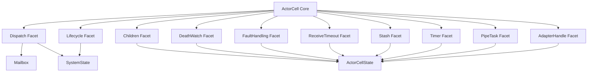

# 技術設計

## 概要

**Purpose（目的）**: 本機能は actor-core-kernel 保守者に、`ActorCell` の巨大 root file を責務別 facet として追跡できる構造を提供する。

**Users（ユーザー）**: fraktor-rs の actor runtime 実装者が、dispatch、lifecycle、fault handling、children、death watch、receive timeout、stash、timer、pipe task、adapter handle の変更を、該当 facet と test に限定して進める。

**Impact（影響）**: `ActorCell` の public type と観測可能な actor runtime 挙動を維持しつつ、`actor_cell.rs` を root orchestration に縮小し、`actor` module 直下の private sibling facet module に同一型 `impl ActorCell` を分割する。新しい runtime capability は追加しない。

### 目標

- `ActorCell` の既存 behavior（message dispatch、supervision、watch、timeout、stash/timer/pipe/adapter handle、lifecycle）を保持する。
- root `actor_cell.rs` を struct/create/accessor 中心に縮小し、`actor.rs` の既存 `pub use actor_cell::ActorCell` が leaf re-export として成立する状態を保つ。
- facet ごとの sibling test に既存回帰シナリオを分類し、保守者が責務単位で検証できる状態にする。

### 非目標

- `SystemState` / `SystemStateShared` の分割。
- `ActorCell` / `ActorShared` / `ChildRef` の public re-export 棚卸し。
- typed 層の facade/behavior 分離。
- 新しい public trait、public helper type、cell-level interceptor API の追加。
- mailbox selection、dispatcher policy、supervision strategy の新機能追加。

## 境界コミットメント

### このスペックが所有するもの

- `ActorCell` の同一型 `impl` を private sibling facet module に分割する構造。
- `ActorCellInvoker` と user/system message invocation の dispatch facet への移動。
- lifecycle、children、death watch、fault handling、receive timeout、stash、timer、pipe task、adapter handle の責務境界。
- `actor_cell_test.rs` の責務別 sibling test への分類と回帰保持。

### 境界外

- `ActorCell` の public API 削減または新規 public API 追加。
- `ActorCellState` の所有データ構造再設計。
- `Mailbox`、`MessageDispatcherShared`、`SystemStateShared` の契約変更。
- `SystemState` の registry 分割。
- `references/pekko` からの追加 API 移植。

### 許可する依存

- 既存 actor-core-kernel 内部型: `ActorCellStateShared`、`ActorShared`、`ReceiveTimeoutStateShared`、`ChildrenContainer`、`FailedInfo`、`WatchKind`、`WatchRegistrationKind`。
- 既存 dispatch/mailbox 型: `MessageDispatcherShared`、`DispatcherSender`、`Mailbox`、`MailboxPressureEvent`。
- 既存 system 型: `SystemStateShared`、`SystemStateWeak`、`FailureOutcome`、`GuardianKind`。
- 既存 scheduler/context_pipe/message_adapter 型。
- 依存方向: facet module は `actor` module 直下の private sibling implementation としてのみ存在し、外部 module から facet module へ直接依存させない。

### 再検証トリガー

- `SystemMessage` variant、`MessageInvoker` trait、`Mailbox` suspension/dispatch 契約の変更。
- `ActorCellState` の field ownership または `SharedAccess` 操作境界の変更。
- `ActorContext` の receive timeout / stash / timer / pipe helper 契約の変更。
- `ActorCell` の public re-export 方針の変更。

## アーキテクチャ

### 既存アーキテクチャ分析

- `modules/actor-core-kernel/src/actor/actor_cell.rs` は 1,809 行で、struct、create、dispatcher 接続、child registry、watch、stash、timer、pipe、adapter handle、fault handling、lifecycle、invoker を同居させている。
- `modules/actor-core-kernel/src/actor/actor_cell_test.rs` は 2,389 行で、children、death watch、fault handling、lifecycle、dispatch、stash、timer、pipe task、adapter handle の回帰が混在している。
- `ActorCellState` は既に状態保持専用型として存在するため、本設計は state ownership を変えず、状態を操作する振る舞いの配置を変える。
- `module-wiring-lint` は leaf module の直属親からの re-export のみを許可する。既存の `actor.rs` にある `pub use actor_cell::ActorCell` を維持するため、`actor_cell.rs` は child module を持たない leaf module のまま残す。
- facet module は `actor` module 直下の private sibling module とし、`ActorCell` への同一型 `impl` と `pub(super)` helper/accessor だけで連携する。これにより新しい public trait や delegate 型なしに分割できる。

### アーキテクチャパターンと境界マップ

採用パターン: **同一型 private sibling facet 分割**。`ActorCell` は単一の runtime container として `actor_cell.rs` に残し、`actor` module 直下の private sibling module が同一型 `impl ActorCell` を責務別に持つ。



**主要な設計判断**:

- facet は `actor.rs` から `mod actor_cell_dispatch;` のように private sibling module として取り込む。`pub mod` や `pub use` は追加しない。
- `actor_cell.rs` は `ActorCell` struct、`create`、identity/accessor、共有 helper に限定し、leaf module として維持する。
- `ActorCellInvoker` は dispatch facet に移し、message delivery と `SystemMessage` 分岐を root file から外す。
- children と death watch は分ける。supervision watch は両者をまたぐが、状態 machine 更新は children、watch/unwatch/terminated delivery は death watch に置く。
- receive timeout の user-message 成功後 reschedule 判定は dispatch から呼ぶ helper として receive timeout facet に置く。
- stash、timer、pipe task、adapter handle はそれぞれ独立した private facet に置く。これらは actor public behavior ではなく `ActorContext` の補助効果だが、単一の補助効果受け皿にまとめると新しい小型モノリスになるため分ける。

### 内部 visibility 契約

- facet module は `actor.rs` から `mod actor_cell_dispatch;` のように private sibling module として宣言する。`pub mod` や `pub use` は追加しない。
- `actor_cell.rs` は child module を持たない leaf module として維持し、`actor.rs` の `pub use actor_cell::ActorCell` を変更しない。
- root `actor_cell.rs` または sibling facet から呼ぶ必要がある helper/accessor は `pub(super)` に限定する。既存の `pub(crate)` method を維持する場合を除き、facet 分割のために新しい `pub(crate)` / `pub` item を追加しない。
- `ActorCellInvoker` は Dispatch Facet の private item として保持する。root `ActorCell::create` は `ActorCellInvoker` を直接構築せず、Dispatch Facet が提供する `pub(super)` factory/helper を通じて `MessageInvokerShared` を mailbox に install する。
- facet 間の連携は `ActorCell` の同一型 `impl` method または `pub(super)` helper/accessor に限定する。外部 module が `actor_cell_dispatch` などの facet module 名に依存する経路は作らない。
- implementation 中に visibility を広げる必要が出た場合は、公開面を広げる前に design を再検証する。

### 技術スタック

| レイヤー | 選択／バージョン | 機能内での役割 | メモ |
|-------|------------------|-----------------|------|
| actor core | Rust 2024 / nightly 固定 | private module 分割と同一型 impl | 新規 runtime 依存なし |
| 同期 | 既存 `ArcShared` / `SharedAccess` | 既存 state/actor/mailbox 共有の維持 | 直接 `Arc` / `Mutex` は追加しない |
| 検証 | 既存 unit test / dylint / clippy / no_std | 挙動保持と構造制約確認 | 新規 dev dependency なし |

## ファイル構造計画

### ディレクトリ構造

```text
modules/actor-core-kernel/src/actor/
├── actor_cell.rs                  # ActorCell struct, create, core accessors; remains a leaf module
├── actor_cell_dispatch.rs         # ActorCellInvoker, user/system message dispatch, mailbox pressure
├── actor_cell_dispatch_test.rs    # dispatch と mailbox pressure の回帰
├── actor_cell_lifecycle.rs        # create/stop/terminate/lifecycle publication
├── actor_cell_lifecycle_test.rs   # lifecycle と guardian termination の回帰
├── actor_cell_children.rs         # child registry, stop child, suspend/resume children, child stats
├── actor_cell_children_test.rs    # children container と child stop/restart stats の回帰
├── actor_cell_death_watch.rs      # watch/unwatch, terminated delivery, watch_with, dedup
├── actor_cell_death_watch_test.rs # DeathWatchNotification と watch_with の回帰
├── actor_cell_fault_handling.rs   # report failure, fault recreate, finish recreate, child failure directive
├── actor_cell_fault_handling_test.rs # restart/resume/escalate/fatal failure の回帰
├── actor_cell_receive_timeout.rs  # receive timeout context integration and reschedule decision
├── actor_cell_receive_timeout_test.rs # timeout cancel/reschedule の回帰
├── actor_cell_stash.rs            # stash/unstash と容量・rollback
├── actor_cell_stash_test.rs       # stash/unstash の回帰
├── actor_cell_timers.rs           # classic timer scheduling/cancel/cleanup
├── actor_cell_timers_test.rs      # timer scheduling/cancel の回帰
├── actor_cell_pipe_tasks.rs       # pipe_to_self/pipe_to task polling/delivery
├── actor_cell_pipe_tasks_test.rs  # pipe task delivery の回帰
├── actor_cell_adapter_handles.rs  # message adapter handle lifecycle
├── actor_cell_adapter_handles_test.rs # adapter handle stop/drop の回帰
└── actor_cell_test.rs             # create/accessor/module integration の最小 root 回帰
```

### 変更対象ファイル

- `modules/actor-core-kernel/src/actor.rs` — private facet module を `mod actor_cell_dispatch;` 形式で宣言する。`pub use actor_cell::ActorCell` は維持する。
- `modules/actor-core-kernel/src/actor/actor_cell.rs` — root orchestration へ縮小し、leaf module として維持する。
- `modules/actor-core-kernel/src/actor/actor_cell_*.rs` — facet ごとの同一型 `impl ActorCell` と private helper を配置する。
- `modules/actor-core-kernel/src/actor/actor_cell_test.rs` — root-level creation/accessor/integration 回帰だけを残す。
- `modules/actor-core-kernel/src/actor/actor_cell_*_test.rs` — 既存回帰シナリオを責務別に移動する。

## 要件トレーサビリティ

| 要件 | 要約 | コンポーネント | インターフェース | フロー |
|------|------|----------------|------------------|--------|
| 1.1 | user/system message の挙動保持 | Dispatch Facet | `MessageInvoker` 実装 | user/system dispatch |
| 1.2 | create/restart/stop/terminate の挙動保持 | Lifecycle Facet, FaultHandling Facet | `handle_create`, `handle_stop`, `finish_recreate` | lifecycle flow |
| 1.3 | invocation failure と supervisor notification の保持 | FaultHandling Facet, Children Facet | `report_failure`, `handle_failure` | failure flow |
| 1.4 | death watch の挙動保持 | DeathWatch Facet | watch/unwatch/notification helpers | death watch flow |
| 2.1 | dispatch 経路の追跡性 | Dispatch Facet | private sibling module boundary | source layout |
| 2.2 | lifecycle/termination の追跡性 | Lifecycle Facet | private sibling module boundary | source layout |
| 2.3 | supervision failure の追跡性 | FaultHandling Facet | private sibling module boundary | source layout |
| 2.4 | children と death watch の分離 | Children Facet, DeathWatch Facet | private sibling module boundary | source layout |
| 2.5 | receive timeout と補助効果の分離 | ReceiveTimeout Facet, Stash Facet, Timer Facet, PipeTask Facet, AdapterHandle Facet | private sibling module boundary | source layout |
| 3.1 | 既存 method 意味の維持 | 全 facet | 同一型 `impl ActorCell` | compile/test |
| 3.2 | public surface 非拡大 | ActorCell Core | private modules | module wiring |
| 3.3 | no_std と依存方向維持 | 全 facet | existing imports only | lint/no_std |
| 3.4 | sync abstraction 遵守 | 全 facet | `SharedAccess` | clippy/lint |
| 4.1 | facet sibling test | ActorCell Facet Tests | test modules | unit test |
| 4.2 | 既存回帰保持 | ActorCell Facet Tests | moved tests | unit test |
| 4.3 | targeted verification | 全体検証 | ci-check/cargo | validation |
| 4.4 | root file 1,000 行未満 | ActorCell Core | source layout | file size check |

## コンポーネントとインターフェース

| コンポーネント | ドメイン／レイヤー | 意図 | 要件カバー範囲 | 主要依存 | 契約 |
|----------------|--------------------|------|----------------|----------|------|
| ActorCell Core | actor-core-kernel | runtime container の identity、生成、共有 accessor、module wiring | 3.1, 3.2, 4.4 | ActorCellStateShared (P0), Mailbox (P0), SystemStateShared (P0) | State |
| Dispatch Facet | actor-core-kernel | user/system message と mailbox pressure の delivery bridge | 1.1, 2.1, 3.1 | MessageInvoker (P0), Mailbox (P0), FaultHandling Facet (P0) | Service |
| Lifecycle Facet | actor-core-kernel | create/stop/terminate と lifecycle event publication | 1.2, 2.2, 3.1 | SystemStateShared (P0), Children Facet (P0), DeathWatch Facet (P0) | Service |
| Children Facet | actor-core-kernel | child registry と child subtree suspend/resume/stop | 1.3, 2.4, 3.1 | ChildrenContainer (P0), SystemMessage (P0) | State |
| DeathWatch Facet | actor-core-kernel | watch/unwatch/terminated delivery と watch_with | 1.4, 2.4, 3.1 | ActorCellState (P0), SystemMessage (P0) | Service |
| FaultHandling Facet | actor-core-kernel | failure reporting、restart/resume/escalate、child failure directive | 1.2, 1.3, 2.3, 3.1 | Children Facet (P0), Lifecycle Facet (P0), SystemStateShared (P0) | Service |
| ReceiveTimeout Facet | actor-core-kernel | receive timeout cancel/reschedule 判断の局所化 | 2.5, 3.1 | ReceiveTimeoutStateShared (P0), ActorContext (P0) | Service |
| Stash Facet | actor-core-kernel | stash/unstash と rollback | 2.5, 3.1 | Mailbox (P0), ActorCellState (P0) | Service |
| Timer Facet | actor-core-kernel | timer scheduling/cancel/cleanup | 2.5, 3.1 | SchedulerShared (P0), SchedulerHandle (P0) | Service |
| PipeTask Facet | actor-core-kernel | pipe task polling/delivery/cleanup | 2.5, 3.1 | ContextPipeTask (P0), SystemStateShared (P0) | Service |
| AdapterHandle Facet | actor-core-kernel | message adapter handle lifecycle | 2.5, 3.1 | AdapterRefHandle (P0), AdapterLifecycleState (P0) | Service |
| ActorCell Facet Tests | test | 既存回帰の責務別保持 | 4.1, 4.2, 4.3 | all facets (P0) | Test |

### actor-core-kernel

#### ActorCell Core

| 項目 | 詳細 |
|------|------|
| 意図 | `ActorCell` の単一 runtime identity と生成境界を保持する |
| 要件 | 3.1, 3.2, 4.4 |

**責務と制約**
- `ActorCell` struct、`create`、`resolve_dispatcher_id`、`system`、`scheduler`、`make_context`、`pid/name/parent/tags/mailbox/actor_ref` など root-level identity/accessor を所有する。
- facet module は `actor` module 直下の private sibling module。外部 module から `actor_cell_dispatch` などへ依存させない。
- `actor_cell.rs` は child module を持たない leaf module として維持する。
- root file は root orchestration と module wiring に集中し、1,000 行を超えない。

**契約種別**: State [x]

**Implementation Notes（実装メモ）**
- Integration: `actor.rs` の `pub use actor_cell::ActorCell` は維持する。
- Validation: file line count、`actor_cell.rs` leaf module、module-wiring lint、type-per-file lint を確認する。
- Risks: root file に helper を残しすぎると facet 分割の効果が薄れる。

#### Dispatch Facet

| 項目 | 詳細 |
|------|------|
| 意図 | dispatcher/mailbox から actor callback へ入る境界を一箇所に集める |
| 要件 | 1.1, 2.1, 3.1 |

**責務と制約**
- `ActorCellInvoker` と `impl MessageInvoker` を所有する。
- root `ActorCell::create` から使う invoker 配線は `pub(super)` factory/helper として提供し、`ActorCellInvoker` 自体は facet 外へ公開しない。
- `PoisonPill`、`Kill`、`Identify`、`SystemMessage` 分岐、mailbox pressure callback を維持する。
- user invocation 成功後の receive timeout reschedule は ReceiveTimeout Facet の helper を呼ぶ。
- failure path は FaultHandling Facet の `report_failure` を呼ぶ。

**契約種別**: Service [x]

##### サービスインターフェース
```rust
impl MessageInvoker for ActorCellInvoker {
  fn invoke(&mut self, message: AnyMessage) -> Result<(), ActorError>;
  fn system_invoke(&mut self, message: SystemMessage) -> Result<(), ActorError>;
  fn invoke_mailbox_pressure(&mut self, event: &MailboxPressureEvent) -> Result<(), ActorError>;
}
```

#### Lifecycle Facet

| 項目 | 詳細 |
|------|------|
| 意図 | actor create/stop/terminate と lifecycle event publication を集約する |
| 要件 | 1.2, 2.2, 3.1 |

**責務と制約**
- `handle_create`、`handle_stop`、`finish_terminate`、`run_pre_start`、`publish_lifecycle`、termination marking を所有する。
- children termination が必要な場合は Children Facet を呼ぶ。
- termination 完了時の watcher 通知は DeathWatch Facet を呼ぶ。

**契約種別**: Service [x]

#### Children Facet

| 項目 | 詳細 |
|------|------|
| 意図 | child registry と child subtree 操作を `ChildrenContainer` 周辺に集める |
| 要件 | 1.3, 2.4, 3.1 |

**責務と制約**
- `register_child`、`unregister_child`、`stop_child`、`mark_child_dying`、`children`、children state predicates、`suspend_children`、`resume_children`、restart stats helpers を所有する。
- DeathWatch Facet が notification を受けたときの container state transition は children helper を介して扱う。

**契約種別**: State [x]

#### DeathWatch Facet

| 項目 | 詳細 |
|------|------|
| 意図 | watch/unwatch と terminated delivery を actor callback 境界として集約する |
| 要件 | 1.4, 2.4, 3.1 |

**責務と制約**
- user watch と supervision watch の区別を維持する。
- `terminated_queued` による dedup、custom `watch_with` message、`on_terminated` callback を維持する。
- children state change による `finish_recreate` / `finish_terminate` の呼び出し順序を維持する。

**契約種別**: Service [x]

#### FaultHandling Facet

| 項目 | 詳細 |
|------|------|
| 意図 | invocation failure と supervision directive の適用を集約する |
| 要件 | 1.2, 1.3, 2.3, 3.1 |

**責務と制約**
- `is_failed` / `set_failed` 系、`fault_recreate`、`finish_recreate`、`handle_kill`、`report_failure`、`handle_failure`、`handle_child_failure`、`clear_child_stats` を所有する。
- mailbox suspension、children suspension、failure outcome 記録の順序を維持する。
- lifecycle restart publication は Lifecycle Facet と明示的に連携する。

**契約種別**: Service [x]

#### ReceiveTimeout Facet

| 項目 | 詳細 |
|------|------|
| 意図 | user message 処理後の receive timeout 判断を局所化する |
| 要件 | 2.5, 3.1 |

**責務と制約**
- `AnyMessage::is_not_influence_receive_timeout` の扱いを維持する。
- actor restart/stop 時の receive timeout cancel は Lifecycle/FaultHandling から呼べる helper として提供する。

**契約種別**: Service [x]

#### Stash Facet

| 項目 | 詳細 |
|------|------|
| 意図 | stashed message の追加・再投入・rollback を局所化する |
| 要件 | 2.5, 3.1 |

**責務と制約**
- stash/unstash と rollback を所有する。
- mailbox enqueue failure の既存戻り値を握りつぶさない。
- stop/restart 時の cleanup helper は Lifecycle/FaultHandling から呼べるよう維持する。

**契約種別**: Service [x]

#### Timer Facet

| 項目 | 詳細 |
|------|------|
| 意図 | classic timer の scheduling と cancellation を局所化する |
| 要件 | 2.5, 3.1 |

**責務と制約**
- one-shot/fixed-delay/fixed-rate timer、active 判定、single/all cancel を所有する。
- scheduler error の既存戻り値を握りつぶさない。

**契約種別**: Service [x]

#### PipeTask Facet

| 項目 | 詳細 |
|------|------|
| 意図 | context pipe task の登録・poll・delivery を局所化する |
| 要件 | 2.5, 3.1 |

**責務と制約**
- pipe_to_self / pipe_to task の ID 採番、poll、delivery failure logging、cleanup を所有する。
- actor が terminated の場合の `PipeSpawnError::TargetStopped` を維持する。

**契約種別**: Service [x]

#### AdapterHandle Facet

| 項目 | 詳細 |
|------|------|
| 意図 | message adapter handle lifecycle を局所化する |
| 要件 | 2.5, 3.1 |

**責務と制約**
- adapter handle の採番、remove、drop 時 stop notification を所有する。
- actor stop/restart 時に adapter sender へ停止を通知する既存結果を維持する。

**契約種別**: Service [x]

## エラーハンドリング

- 既存の `ActorError` / `SendError` / `SchedulerError` / `PipeSpawnError` を維持する。
- fire-and-forget に見える system message send も、既存どおり `record_send_error` で観測する。
- refactor 中に `let _ =` や `.ok()` で failure を隠さない。既存で明示的に scheduling bool を使わない箇所は、lint で許可される形を維持する。

## テスト戦略

- Unit Tests:
  - Dispatch Facet: `PoisonPill` / `Kill` / `Identify` / system message 分岐 / mailbox pressure callback。
  - Children Facet: child registration、stop child、suspend/resume propagation、restart stats。
  - DeathWatch Facet: watch/unwatch、watch_with、terminated dedup、supervision-only watch。
  - FaultHandling Facet: `fault_recreate`、`finish_recreate`、`report_failure`、restart/resume/escalate/stop directive。
  - Stash Facet: stash/unstash と rollback。
  - Timer Facet: timer scheduling と cancellation。
  - PipeTask Facet: pipe task delivery と failure logging。
  - AdapterHandle Facet: adapter handle stop/drop。
- Integration Tests:
  - `cargo test -p fraktor-actor-core-kernel-rs actor_cell`
  - `cargo test -p fraktor-actor-core-kernel-rs actor_context`
  - dispatcher/mailbox pressure 周辺の既存 targeted tests。
- Structural Verification:
  - `./scripts/ci-check.sh ai fmt`
  - `./scripts/ci-check.sh ai dylint`
  - `./scripts/ci-check.sh ai clippy`
  - `./scripts/ci-check.sh ai no-std`

## 性能とスケーラビリティ

- 本仕様はファイル分割のみで runtime data path を増やさない。
- 新しい dynamic dispatch、trait object、lock、allocation を追加しない。
- receive timeout、stash、timer、pipe task の処理順序は既存と同じにする。
