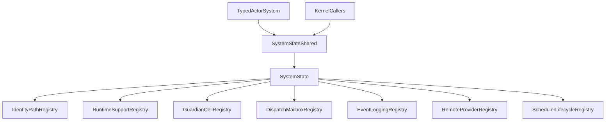
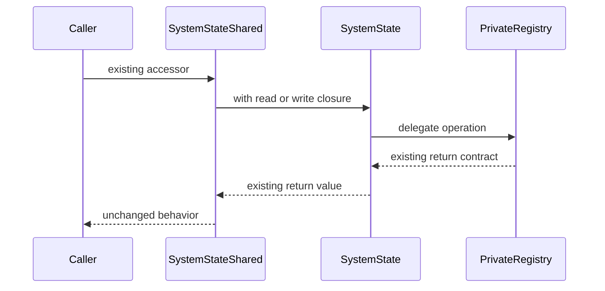

# 設計ドキュメント

## 概要
この設計は `SystemState` / `SystemStateShared` の外部契約を維持したまま、actor system 内部状態を subsystem registry へ分割する。`SystemState` は actor system state の public / crate-visible façade と構築手順を担い、runtime support、dispatcher / mailbox、event / logging、guardian / cells、remote / provider / deployment、scheduler / shutdown、identity / path の状態所有を private registry に委譲する。

### 目標
- 後続の mailbox / EventBus / CoordinatedShutdown workstream が無関係な system state を変更しなくてよい境界を作る。
- 既存 accessor、typed facade、cached handle、unit / integration test の観測挙動を維持する。
- `actor-core-kernel` の `no_std` + `alloc`、project-defined shared abstraction、module wiring lint 前提を維持する。

### 非目標
- mailbox resolution の新仕様を追加しない。
- 汎用 EventBus trait 族や classification contract を導入しない。
- CoordinatedShutdown task variant、typed system facade 分離、public re-export audit を取り込まない。
- remote / serialization の公開挙動を変更しない。

## 境界コミットメント

### このスペックが所有するもの
- `SystemState` / `SystemStateShared` の内部 registry 分離と既存 accessor の委譲。
- `actor-core-kernel` 内の private registry 型、module wiring、sibling tests。
- `SystemStateShared` が返す cached handle と既存 façade の互換性。

### 境界外
- `actor-eventbus-classification-contract` が所有する EventBus trait 族と classification behavior。
- `actor-mailbox-resolution-contract` が所有する mailbox selection precedence と queue type resolution。
- `actor-coordinated-shutdown-task-variants` が所有する cancellable / actor termination task variants。
- `actor-kernel-public-surface-audit` が所有する public re-export 見直し。

### 許可する依存
- 既存 `actor-core-kernel` の `system`, `actor`, `dispatch`, `event`, `serialization`, `remote` module。
- `fraktor_utils_core_rs::sync` の `ArcShared`, `SharedAccess`, `SharedLock`, `SharedRwLock` など project-defined shared abstraction。
- `alloc`, `core`, 既存 workspace dependency。新しい host runtime dependency は追加しない。

### 再検証トリガー
- `SystemStateShared` の public / crate-visible accessor signature を変更する場合。
- registry 型を `pub` / `pub use` して外部 crate から到達可能にする場合。
- dispatcher / mailbox、event / logging、guardian / cells、remote / provider、scheduler / shutdown の境界をまたぐ状態移動を行う場合。
- `actor-core-kernel` に `std`、Tokio、直接 `Arc` / `Mutex` / `spin` primitive を追加する場合。

## アーキテクチャ

### 既存アーキテクチャ分析
- `modules/actor-core-kernel/src/system/state/system_state.rs` は actor system 構築、identity、guardian、event、dispatch、remote、scheduler を同一型で保持する。
- `modules/actor-core-kernel/src/system/state/system_state_shared.rs` は `SharedRwLock<SystemState>` と cached handle を持つ façade であり、呼び出し元の多くはこの型を経由する。
- `CellsShared`、`ActorPathRegistry`、`RemoteAuthorityRegistry`、`Registries` は既に単一責務 registry として存在するため、新設 registry はこの粒度と命名に合わせる。

### アーキテクチャパターンと境界マップ
採用パターンは private leaf registry + façade delegation である。dependency direction は `leaf registry -> domain primitive`、`SystemState -> leaf registry`、`SystemStateShared -> SystemState façade` に固定し、leaf registry は `SystemStateShared` に依存しない。



### 技術スタック

| レイヤー | 選択／バージョン | 機能内での役割 | メモ |
|-------|------------------|-----------------|-------|
| Runtime core | Rust 2024 / `actor-core-kernel` | registry 型と façade 委譲 | `no_std` + `alloc` を維持 |
| Shared state | `fraktor_utils_core_rs::sync` | cached handle と closure-based access | 直接 `Arc` / `Mutex` は追加しない |
| Event / dispatch | 既存 `event`, `dispatch` module | registry に移す既存状態の依存先 | 新 behavior は追加しない |
| Host runtime | なし | core に直接追加しない | std/Tokio は adaptor 側に残す |

## ファイル構造計画

### ディレクトリ構造
```
modules/actor-core-kernel/src/system/state/
├── system_state.rs                         # SystemState façade と構築手順
├── system_state_shared.rs                  # SystemStateShared façade と cached handle
├── identity_path_registry.rs               # system identity、path identity、actor path、temp actor、extra top-level
├── identity_path_registry_test.rs          # identity / path registry の委譲単位テスト
├── runtime_support_registry.rs             # pid allocation、monotonic clock、ask futures、extensions、invoke guard、circuit breaker config
├── runtime_support_registry_test.rs        # runtime support 境界テスト
├── guardian_cell_registry.rs               # cells、name registries、guardian state
├── guardian_cell_registry_test.rs          # guardian / cell table 境界テスト
├── dispatch_mailbox_registry.rs            # dispatchers、mailboxes、mailbox shared set
├── dispatch_mailbox_registry_test.rs       # dispatcher / mailbox 委譲テスト
├── event_logging_registry.rs               # event stream、dead letters、logging filter、failure counters
├── event_logging_registry_test.rs          # event / logging 委譲テスト
├── remote_provider_registry.rs             # actor ref providers、remote hooks、remote authority、deployment factories
├── remote_provider_registry_test.rs        # remote / provider 委譲テスト
├── scheduler_lifecycle_registry.rs         # scheduler context、tick driver、termination state、root startup、start time
└── scheduler_lifecycle_registry_test.rs    # scheduler / lifecycle 委譲テスト
```

### 変更対象ファイル
- `modules/actor-core-kernel/src/system/state.rs` — 新 registry module を private sibling として宣言し、`system_state.rs` から使う bridge import を整理する。
- `modules/actor-core-kernel/src/system/state/system_state.rs` — field を registry grouping に置き換え、既存 public / crate-visible method signature を維持して registry へ委譲する。
- `modules/actor-core-kernel/src/system/state/system_state_shared.rs` — cached handle の取得元を維持し、必要な呼び出しだけ `SystemState` façade 経由の委譲に更新する。
- `modules/actor-core-kernel/src/system/state/system_state_test.rs` / `system_state_shared_test.rs` — 既存同等性テストを保持し、分割後の代表 accessor を追加する。

## システムフロー



`SystemStateShared` は呼び出し元に private registry を返さない。cached handle は `SystemStateShared::new` と `from_shared_rw_lock` で従来どおり clone 可能な handle として保持する。

## 要件トレーサビリティ

| 要件 | 要約 | コンポーネント | インターフェース | フロー |
|-------------|---------|------------|------------|-------|
| 1.1 | 既存公開挙動の維持 | SystemState, SystemStateShared | 既存 accessor | façade delegation |
| 1.2 | registry 型を公開しない | SystemState | private registry | façade delegation |
| 1.3 | typed facade の観測結果維持 | SystemStateShared, TypedActorSystem | cached handle | façade delegation |
| 2.1 | registry 境界の識別 | 全 registry | private state boundary | boundary map |
| 2.2 | dispatcher / mailbox の局所化 | DispatchMailboxRegistry | dispatcher / mailbox accessor | façade delegation |
| 2.3 | event / logging の局所化 | EventLoggingRegistry | event / logging accessor | façade delegation |
| 2.4 | guardian / cell table の局所化 | GuardianCellRegistry, IdentityPathRegistry | guardian / cell / path accessor | façade delegation |
| 3.1 | Shared abstraction 維持 | 全 registry, SystemStateShared | `Shared*` / `ArcShared` | cached handle |
| 3.2 | closure-based update 維持 | SystemStateShared, registry methods | `with_read` / `with_write` | façade delegation |
| 3.3 | cached handle 同一性維持 | SystemStateShared | cached handle methods | cached handle |
| 3.4 | 直接同期 primitive の追加禁止 | 全 registry | dependency rule | lint validation |
| 4.1 | `no_std` 維持 | 全 registry | crate boundary | cargo check |
| 4.2 | host runtime 依存禁止 | SchedulerLifecycleRegistry, DispatchMailboxRegistry | dependency rule | lint validation |
| 4.3 | module lint 前提維持 | module wiring, sibling tests | file layout | dylint |
| 5.1 | 既存テスト通過 | 全 registry | test suite | validation |
| 5.2 | 代表委譲経路の確認 | 全 registry | registry tests | validation |
| 5.3 | downstream spec の接続点 | boundary map | design boundary | downstream planning |

## コンポーネントとインターフェース

| コンポーネント | ドメイン／レイヤー | 意図 | 要件カバー範囲 | 主要依存 | 契約 |
|-----------|--------------|--------|--------------|----------|------|
| SystemState | actor-core-kernel / system | registry を束ねる façade | 1.1, 1.2, 2.1, 5.3 | private registries (P0) | Service, State |
| SystemStateShared | actor-core-kernel / shared façade | lock 境界と cached handle を維持 | 1.1, 1.3, 3.2, 3.3 | SystemState (P0) | Service |
| RuntimeSupportRegistry | actor-core-kernel / runtime support boundary | pid allocation、monotonic clock、ask futures、extensions、invoke guard、circuit breaker config を所有 | 1.1, 2.1, 3.1, 4.1 | ArcShared, AskFutures (P0) | State |
| IdentityPathRegistry | actor-core-kernel / system state | system identity と actor path 関連状態を所有 | 1.1, 2.4 | ActorPathRegistry (P0) | State |
| GuardianCellRegistry | actor-core-kernel / system state | cells、name registry、guardian state を所有し、child state は `ActorCell` 側に残す | 2.1, 2.4 | CellsShared, GuardiansState (P0) | State |
| DispatchMailboxRegistry | actor-core-kernel / dispatch boundary | dispatcher / mailbox state を所有 | 2.1, 2.2, 4.2 | Dispatchers, Mailboxes (P0) | State |
| EventLoggingRegistry | actor-core-kernel / event boundary | event stream、dead letter、logging / failure telemetry を所有 | 2.1, 2.3, 3.1 | EventStreamShared, DeadLetterShared (P0) | Event, State |
| RemoteProviderRegistry | actor-core-kernel / remote / serialization-adjacent boundary | remote hook、authority、provider、deployment factory を所有し、現行 `SystemState` にある serialization-adjacent setup 境界を固定する | 1.1, 2.1, 4.2 | RemoteAuthorityRegistry (P0) | State |
| SchedulerLifecycleRegistry | actor-core-kernel / lifecycle boundary | scheduler、tick driver、termination state、root startup、start time を所有 | 1.1, 2.1, 4.1, 4.2 | SchedulerContext, TerminationState (P0) | State |

### SystemState
**責務と制約**
- `SystemState::new` と `build_from_owned_config` の構築契約を維持する。
- 既存 accessor signature を維持し、内部では該当 registry へ委譲する。
- private registry を外部 crate へ re-export しない。

**契約種別**: Service [x] / State [x]
- Preconditions: registry は `SystemState` 構築時にすべて初期化される。
- Postconditions: 既存 accessor の戻り値と error contract は分割前と同等である。
- Invariants: `SystemState` 外から private registry 型へ直接到達できない。

### SystemStateShared
**責務と制約**
- `SharedRwLock<SystemState>` の lock 境界を維持する。
- `event_stream`、`dead_letter`、`cells`、remote hook、scheduler、delay provider、tick driver bundle などの cached handle を維持する。
- read-then-act を増やさず、更新が必要な操作は `with_write` 内で完結させる。

**契約種別**: Service [x]
- Preconditions: `SystemStateShared::new` は fully initialized `SystemState` を受け取る。
- Postconditions: clone された shared façade は同じ underlying state と cached handle 群を参照する。
- Invariants: caller は private registry の lock guard を受け取らない。

### Private Registry 群
**責務と制約**
- 各 registry は単一 subsystem の状態と、その subsystem に閉じる helper を所有する。
- registry 間の連携が必要な操作は `SystemState` に integration method として残す。
- 新しい shared ownership は既存 `Shared*` / `ArcShared` pattern に合わせる。
- `ActorCell` が所有する children / death watch / restart stats は registry へ移さず、`SystemStateShared::child_pids` は cell table lookup から `ActorCell::children()` を読む façade に留める。

**契約種別**: State [x]
- Preconditions: registry は `Default` または config-derived constructor で初期化される。
- Postconditions: registry 内の変更は該当 subsystem の accessor だけに反映される。
- Invariants: leaf registry は `SystemStateShared` に依存しない。

## データモデル

### ドメインモデル
- `SystemState`: actor system scoped state façade。
- `SystemStateShared`: concurrent access façade。
- `*Registry`: subsystem ごとの internal state owner。
- `Cached Handle`: lock 外で clone 可能な既存 shared handle。`SystemStateShared` が互換性のために保持する。

### 論理データモデル
- `RuntimeSupportRegistry`: `next_pid`、monotonic `clock`、`AskFutures`、`Extensions`、`invoke_guard_factory`、default / named `CircuitBreakerConfig`。
- `IdentityPathRegistry`: `PathIdentity`、`ActorPathRegistry`、`TempActors`、`ExtraTopLevels`。
- `GuardianCellRegistry`: `CellsShared`、`Registries`、`GuardiansState`、guardian alive flags。child relation は `ActorCell` の children facet が所有する。
- `DispatchMailboxRegistry`: `Dispatchers`、`Mailboxes`、`MailboxSharedSet`。
- `EventLoggingRegistry`: `EventStreamShared`、`DeadLetterShared`、`LoggingFilter`、failure counters。
- `RemoteProviderRegistry`: `ActorRefProviders`、provider callers、remote hooks、`RemoteAuthorityRegistry`、deployer / deployable factory registry。serializer registry の新契約は追加せず、現行 `SystemState` が持つ serialization-adjacent な deployment/provider setup の境界だけを安定化する。
- `SchedulerLifecycleRegistry`: `SchedulerContext`、tick driver bundle / stopper / snapshot、termination state、root started、start time。

## エラーハンドリング

### エラー戦略
- 既存 error 型を維持し、registry 分離のためだけに新しい公開 error を追加しない。
- `RemoteAuthorityError`、`MailboxRegistryError`、`DispatchersError`、`SpawnError`、`RegisterExtraTopLevelError` は既存 accessor の戻り値として維持する。
- registry 間の整合性に失敗するケースは、既存 call path の error contract へ戻す。

### 監視
- logging filter と event stream publish の経路は `EventLoggingRegistry` へ集約する。
- failure counters は観測値を維持し、メトリクス名や public event payload は変更しない。

## テスト戦略

### Unit Tests
- `dispatch_mailbox_registry_test.rs`: dispatcher lookup、canonical dispatcher id、mailbox factory / queue creation の委譲同等性。
- `runtime_support_registry_test.rs`: pid allocation、monotonic timestamp、ask future drain、extension lookup、circuit breaker config の委譲同等性。
- `event_logging_registry_test.rs`: event stream publish、dead letter snapshot、logging filter、failure counter の委譲同等性。
- `guardian_cell_registry_test.rs`: cell register / remove、guardian pid / alive、name assign / release の同等性。
- `remote_provider_registry_test.rs`: remote authority state transition、provider lookup、remote hook registration の同等性。
- `scheduler_lifecycle_registry_test.rs`: scheduler handle、tick driver snapshot、termination state、root startup gate、shutdown scheduler の同等性。

### Integration Tests
- `system_state_shared_test.rs`: cached handle が clone 後も同じ shared state を参照すること。
- typed system tests: `event_stream()`、`scheduler()`、`dispatchers()`、`child_pids()` の既存観測結果。
- actor-core-kernel system tests: spawn、actor path、dead letter、remote authority、scheduler shutdown の既存回帰。

### Validation
- `cargo test -p fraktor-actor-core-kernel-rs system::state --lib`
- `cargo test -p fraktor-actor-core-typed-rs --lib`
- `cargo check -p fraktor-actor-core-kernel-rs --lib --tests`
- 仕上げで `./scripts/ci-check.sh ai all`

## 性能とスケーラビリティ
- この spec は lock 粒度や runtime throughput の改善を目的にしない。
- registry 分離によって追加の heap allocation や lock acquisition が増えないことを実装レビューで確認する。
- cached handle は従来どおり lock 外 clone を維持し、hot path の余計な `with_read` を増やさない。
