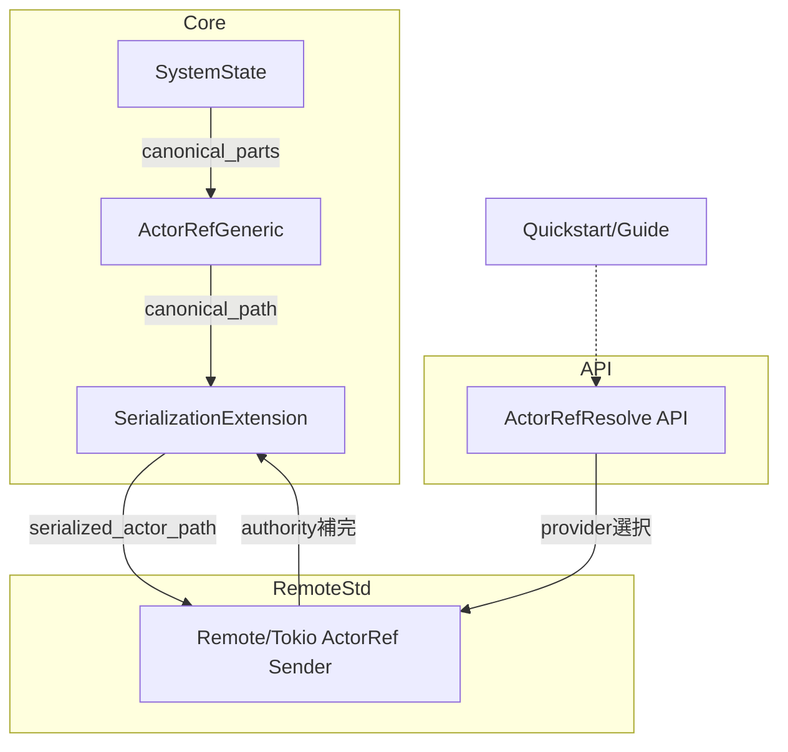
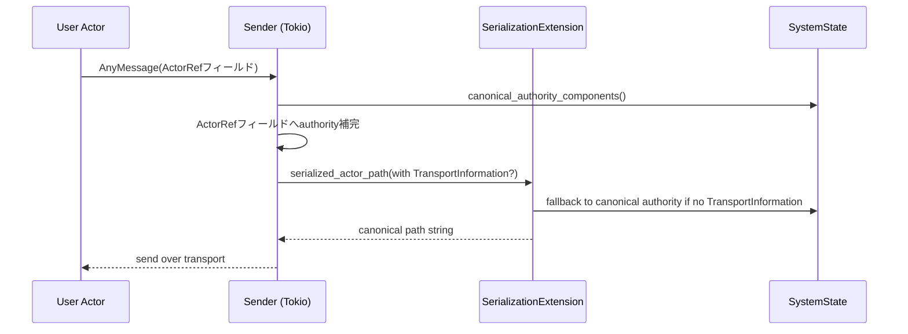
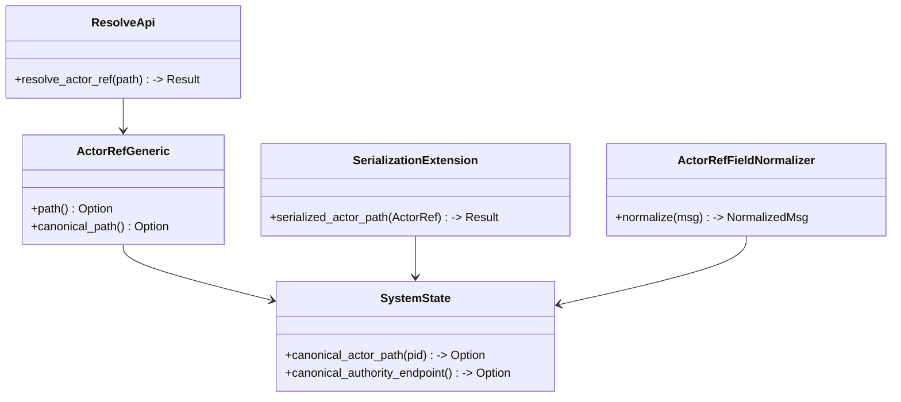

# 設計ドキュメント: actorref-canonical-address

## 概要
ActorRef を Pekko/Classic と同様に「論理パス + 公開アドレス」で一貫表現し、シリアライズやメッセージ転送時に自動でリモート可となるよう拡張する。利用者はローカルで取得した ActorRef をそのまま他ノードへ送信でき、明示的な provider 呼び出しや authority 手動注入が不要になる。影響範囲は actor/core のパス解決・シリアライズ、remote/std の送信補完、および Quickstart ドキュメント。

### 目標 (Goals)
- ActorRef が canonical URI（scheme + system + advertise host/port + path + UID）を公開できること。
- シリアライズ／デシリアライズで常に正しい公開アドレスが付与されること。
- 任意の ActorRef フィールドを含むメッセージが自動で authority 補完され、リモート配送と隔離判定が一貫すること。
- ActorPath からの解決 API を提供し、スキームに応じた provider を透過的に選択できること。
- Quickstart が自動 canonical 化フローを示すこと。

### 非目標 (Non-Goals)
- 新規トランスポート実装の追加（Tokio TCP 以外は対象外）。
- クラスター機能（gossip, shard など）の拡張。
- no_std 以外の外部依存追加。

## アーキテクチャ

### 既存アーキテクチャの把握
- ActorPathParts/ActorPath が canonical URI を生成可能だが、ActorRefGeneric::path() は authority なしのローカルパスを返す。
- SystemState が RemotingConfig を保持し canonical_actor_path を生成、ActorPathRegistry に登録。
- SerializationExtension は TransportInformation があればその address を適用、無ければ `local://` を付与するのみ。
- remote/std の provider 送信経路で reply_to に限り authority 補完あり。

### ハイレベルアーキテクチャ

- 既存パターンを維持しつつ、ActorRef/Serialization/Remoting/Docs に薄い拡張を加える段階導入（Option C）。

### 技術スタック / 設計判断
- 既存 Rust 2024 + no_std/std 二層構造を継続。外部依存追加なし。
- advertise アドレスが bind と異なる場合は RemotingConfig の `canonical_host` / `canonical_port` を「公開 (advertise) アドレス」として扱い、canonical URI 生成に使用する。bind はトランスポート層の設定に委譲し、必要なら RemotingConfig に bind/public を分離する拡張を検討する。

#### 主要設計判断
- **Decision**: ActorRef に `canonical_path()` を追加し、`path()` は現行互換で維持。  
  **Context**: 既存コードが `path()` をローカル表示に依存しているため互換性が必要。  
  **Alternatives**: `path()` を直接 canonical に変更。  
  **Selected Approach**: 新メソッド追加＋一部内部呼び出しを canonical 優先へ差し替え。  
  **Rationale**: 破壊的変更を避けつつ canonical を提供。  
  **Trade-offs**: 2 つの API を扱う認知コスト増だが移行安全性を確保。

- **Decision**: SerializationExtension で TransportInformation 不在時に SystemState の canonical authority を適用。  
  **Context**: 現行は `local://` 固定でリモート解決できない。  
  **Alternatives**: 送信パイプラインのみで補完。  
  **Selected Approach**: シリアライズ層でフォールバックし、送信経路補完と二重で安全。  
  **Rationale**: メッセージ保存・再送にも対応。  
  **Trade-offs**: RemotingConfig 未設定時は従来同様 `local://`。

- **Decision**: 送信前に ActorRef フィールドを走査し authority を補完する共通ヘルパを導入（後段で resolver へ抽出可能）。  
  **Context**: reply_to 以外の ActorRef を含むメッセージも正規化が必要。  
  **Alternatives**: 各 Sender 実装に都度実装。  
  **Selected Approach**: ヘルパ関数を作り、Tokio/Loopback Sender で共通利用。  
  **Rationale**: 重複排除とテスト容易性。  
  **Trade-offs**: 追加トラバースのオーバーヘッド（メッセージ内 ActorRef 数は少ない想定）。

## システムフロー
### シーケンス（送信時の canonical 補完）


## API ブループリント

### 型・トレイト一覧（追加/変更）
- `ActorRefGeneric<TB>`: `pub fn canonical_path(&self) -> Option<ActorPath>`（new）
- `SerializationExtension<TB>`: `serialized_actor_path` を canonical authority fallback 付きに拡張
- `TransportInformation`: 変更なし（利用優先度を明文化）
- `ActorSystem` / `ExtendedActorSystem`: `pub fn resolve_actor_ref(&self, path: ActorPath) -> Result<ActorRef, ResolveError>`（new）
- `ActorRefResolveError`（新規 enum, public）
- `ActorRefFieldNormalizer`（内部ヘルパ）: AnyMessage から ActorRef フィールドを抽出し authority を補完
- `RemotingConfig`: advertise アドレスを canonical として利用（既存フィールドで対応、不足時は拡張を検討）

### シグネチャ スケッチ
```rust
impl<TB: RuntimeToolbox> ActorRefGeneric<TB> {
  pub fn canonical_path(&self) -> Option<ActorPath>;
}

impl<TB: RuntimeToolbox> SerializationExtension<TB> {
  pub fn serialized_actor_path(&self, actor_ref: &ActorRefGeneric<TB>) -> Result<String, SerializationError>;
}

pub enum ActorRefResolveError {
  UnsupportedScheme,
  ProviderMissing,
  InvalidAuthority,
  NotFound,
}

impl ActorSystem {
  pub fn resolve_actor_ref(&self, path: ActorPath) -> Result<actor_prim::ActorRef, ActorRefResolveError>;
}
```

## クラス／モジュール図


## クイックスタート / 利用例（ドラフト）
```rust
// sender 側（Tokio TCP Quickstart 改稿案）
let system = ActorSystem::new_with_config(&Props::from_fn(Sender::new), &config)?;
let remote_path = ActorPath::from_parts(
  ActorPathParts::with_authority("tokio-tcp-receiver", Some((HOST, RECEIVER_PORT)))
    .with_scheme(ActorPathScheme::FraktorTcp)
    .with_guardian(GuardianKind::User)
).child("receiver-guardian");
let remote_ref = system.resolve_actor_ref(remote_path)?;
system.user_guardian_ref().tell(AnyMessage::new(StartPing { target: remote_ref }))?;
```

## 旧→新 API 対応表
| 旧 API / 型 | 新 API / 型 | 置換手順 | 備考 |
| --- | --- | --- | --- |
| `path()` をそのままリモート送信用に使用 | `canonical_path()` を取得して送信 | 送信前に canonical_path を利用。path() はローカル表示用に残す | 破壊的変更なし |
| 明示的 provider 呼び出しで ActorRef 生成 | `ActorSystem::resolve_actor_ref` | ActorPath を渡すだけで provider 選択 | Quickstart 更新 |
| SerializationExtension が `local://` フォールバックのみ | canonical authority フォールバックを追加 | RemotingConfig があれば自動で address 付与 | TransportInformation 優先 |

## 要件トレーサビリティ
| 要件ID | 要約 | 実装コンポーネント | インターフェイス | 参照フロー |
| --- | --- | --- | --- | --- |
| 1.1–1.6 | canonical URI 公開 | ActorRefGeneric, SystemState | canonical_path() | path生成 |
| 2.1–2.5 | シリアライズ時 address 付与 | SerializationExtension | serialized_actor_path() | serialize flow |
| 3.1–3.4 | ActorRef フィールド補完 | ActorRefFieldNormalizer, Sender | normalize() | send flow |
| 4.1–4.5 | resolve API | ActorSystem/Extended | resolve_actor_ref() | lookup |
| 5.1–5.3 | Doc/Quickstart更新 | docs/examples | サンプルコード | guide |

## コンポーネント & インターフェイス

### ActorRef 拡張
- 責務: canonical_path 生成。path() は現行互換。  
- 入力: pid, system state。出力: ActorPath (authority 付き/なし)。  
- 依存: SystemState::canonical_actor_path。  
- 契約: RemotingConfig 無しなら None/authority なしで返却。UID がある場合は付与。

### SerializationExtension 拡張
- 責務: ActorRef シリアライズ時に TransportInformation を最優先、無ければ RemotingConfig の advertise を付与、さらに無ければ `local://`。  
- エラー: RemotingConfig 不備は SerializationError::Uninitialized 相当で返却。  
- 依存: SystemState::canonical_authority_endpoint, TransportInformation。

### ActorRefFieldNormalizer（新規内部ヘルパ）
- 責務: AnyMessage/MessageEnvelope 内の ActorRef フィールドを走査し authority を補完、隔離状態ならエラーを返し EventStream 通知。  
- 入力: message, canonical_authority_components。出力: 正規化済み message。  
- 適用箇所: Tokio/Loopback Sender 前段。  
- 走査対象: `AnyMessage` ペイロードに含まれる `ActorRefGeneric` / `TypedActorRef` / `Untyped ActorRef` / `Option<ActorRef>` / `Vec<ActorRef>` を再帰的（深さ上限5）に探索し、`serde_json::Value` や生バイト列など内容不明のものはスキップ。  
- 抽出方法: 型判定で ActorRef 系を検出し、authority 補完したコピーに差し替え。未知型はスキップし Debug ログを記録。  
- テスト指針: reply_to 単体、Struct 内埋め込み、Vec/Option 包装、二重ネストを含むメッセージで補完／隔離拒否を検証。  
- 拡張性: 後で Resolver サービスに昇格可能。

### resolve_actor_ref API
- 責務: ActorPath（authority あり/なし）を受け、scheme に対応する provider から ActorRef を取得。authority なしの場合は canonical authority を注入後に処理。  
- エラー: UnsupportedScheme, ProviderMissing, InvalidAuthority, NotFound。  
- 依存: ExtendedActorSystem::actor_ref_provider 登録内容。

### ドキュメント/サンプル
- Quickstart を canonical_path + resolve_actor_ref 使用例に刷新。  
- Guides に「remoting config があれば address 自動付与」を明記。

## エラーハンドリング
- canonical_authority 未設定時: resolve_actor_ref は UnsupportedScheme/InvalidAuthority を返す。  
- 隔離状態 authority への補完時: 送信を拒否し EventStream に理由を出力。  
- シリアライズ時に address 決定不能: `local://` へフォールバックし、ログで警告。

## テスト戦略
- ユニット: canonical_path の有無、UID 付与、SerializationExtension fallback、Normalizer の補完と隔離拒否。  
- 統合: Tokio TCP Quickstart 改稿版で sender→receiver ping 往復（authority 自動付与確認）。  
- プロパティ: ActorPathFormatter + canonical_path の round-trip。  
- 追加: resolve_actor_ref の scheme/authority バリエーション。

## 移行戦略
- フェーズ1（最小導入）: canonical_path 追加、SerializationExtension fallback、resolve_actor_ref、Quickstart 改稿。  
- フェーズ2（共通化）: ActorRefFieldNormalizer を sender パイプラインへ適用、必要なら Resolver サービス抽出。  
- ロールバック: 新 API を未使用にすれば既存 path()/manual provider で動作継続。既存挙動を壊さないよう互換 API を維持。
