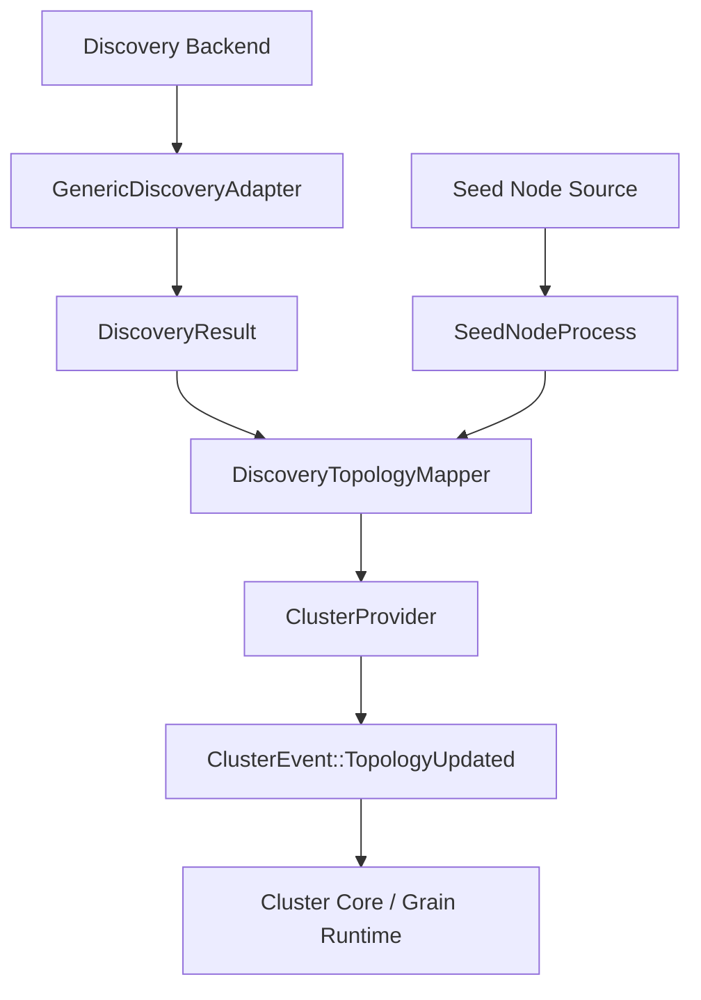
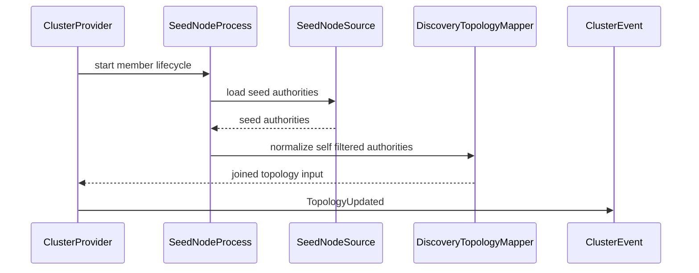
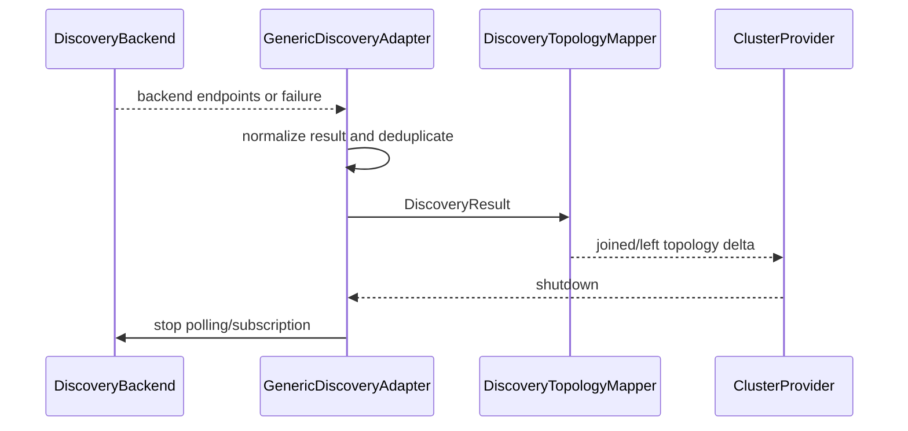

# 設計ドキュメント（Design Document）

## Overview（概要）

この feature は、`SeedNodeProcess` と generic discovery adapter を cluster provider boundary の拡張として定義する。対象ユーザーは fraktor-rs cluster runtime 実装者、std adaptor 実装者、reviewer であり、seed/discovery 由来の入力が provider-neutral topology input へ変換されることを確認できるようにする。

既存の `LocalClusterProvider` は seed list を保持し、join / leave を `ClusterEvent::TopologyUpdated` に変換できる。`cluster-adaptor-std` には AWS ECS polling と remoting lifecycle bridge がある。この設計はそれらを置き換えず、generic discovery backend と seed process の contract を追加し、cluster core の placement / membership が backend details に依存しない状態を固定する。

### Goals（目標）

- `SeedNodeProcess` を provider lifecycle 内の join input orchestration として定義する。
- generic discovery adapter が backend result を provider-neutral discovery result へ正規化する。
- topology input conversion を provider boundary に閉じ、membership / gossip / downing / pubsub / serialization を吸収しない。

### Non-Goals（非目標）

- `UniqueAddress`、data center、`WeaklyUp`、Reachability matrix。
- GossipEnvelope、cluster heartbeat、full Gossip merge / tombstone / seen digest。
- SplitBrainResolver、DowningStrategy、lease-based majority。
- DistributedPubSubMediator、topic registry gossip、cluster message serializer。
- AWS ECS / Kubernetes / DNS / cloud provider 固有 backend の完全実装。

## Boundary Commitments（境界コミットメント）

### This Spec Owns（この仕様が所有する範囲）

- Seed node source から provider-neutral join input へ変換する `SeedNodeProcess` contract。
- backend result を `DiscoveredAuthority` / `DiscoveryResult` として正規化する generic discovery adapter contract。
- std adaptor における discovery polling/subscription lifecycle と shutdown boundary。
- topology update へ変換する際の self filtering、dedup、invalid authority failure、block list 維持。
- `docs/gap-analysis/cluster-gap-analysis.md` の `SeedNodeProcess` と generic discovery adapter に対する evidence 更新。

### Out of Boundary（範囲外）

- membership status transition、reachability、indirect connection handling。
- gossip dissemination、heartbeat sender/receiver、CrossDcClusterHeartbeat。
- downing decision、SBR strategy evaluation、lease integration。
- pubsub mediator protocol、topic registry gossip / delta collection。
- cluster message serialization contract。
- provider-specific retry / auth / API policy と backend 完全互換。

### Allowed Dependencies（許可する依存）

- `cluster-active-compatibility-baseline` の provider/config/lifecycle baseline。
- `openspec/specs/cluster-provider-boundary` の provider-neutral topology input contract。
- `ClusterProvider` の start / join / leave / shutdown lifecycle。
- `ClusterEvent::TopologyUpdated`、`TopologyUpdate`、`ClusterTopology` の既存 topology publication contract。
- `LocalClusterProviderShared` / `LocalClusterProviderWeak` の lifetime boundary。
- std adaptor 側の Tokio task / timer / event subscription。ただし core contract へ `std` を漏らさない。

### Revalidation Triggers（再検証トリガー）

- `ClusterProvider` の lifecycle method または error semantics が変わる。
- `TopologyUpdate`、`ClusterTopology`、`ClusterEvent::TopologyUpdated` の field semantics が変わる。
- `LocalClusterProvider` の seed node storage、member set、block list handling が変わる。
- std adaptor の polling/subscription lifetime contract が変わる。
- downstream membership / gossip specs が discovery result に追加 identity を要求する。

## Architecture（アーキテクチャ）

### Existing Architecture Analysis（既存アーキテクチャ分析）

`fraktor-cluster-core-kernel-rs` は `cluster_provider` に provider port と local/static provider を持ち、`topology` に topology event contract を持つ。`LocalClusterProvider` は `with_seed_nodes` で seed node list を保持できるが、その list を SeedNodeProcess として lifecycle 化し、invalid / empty / self / duplicate を扱う contract は未整理である。

`fraktor-cluster-adaptor-std` は `local_cluster_provider_ext` で remoting lifecycle events を provider input に変換し、`aws_ecs_cluster_provider` で ECS task polling を topology update に変換する。generic discovery adapter はこの std adaptor 側に置き、core は provider-neutral result と seed process contract だけを所有する。

### Architecture Pattern & Boundary Map（アーキテクチャパターンと境界図）



**Architecture Integration**:
- Selected pattern: provider boundary extension。core は provider-neutral contract、std adaptor は backend execution と lifecycle bridge を所有する。
- Domain/feature boundaries: seed/discovery result normalization は provider boundary、membership convergence は downstream membership/gossip spec。
- Existing patterns preserved: `*-core` は `no_std`、std/Tokio/AWS SDK は adaptor 側、public type は原則1ファイル1型、test は sibling `_test.rs`。
- New components rationale: SeedNodeProcess と generic discovery adapter は active medium follow-up の missing surface であり、既存 local/static/AWS ECS provider の挙動を provider-neutral に揃えるために必要である。
- Steering compliance: Rust の port-and-adapter 方針を維持し、backend metadata を cluster core placement logic に漏らさない。

### Technology Stack（技術スタック）

| Layer | Choice / Version | Role in Feature | Notes |
|-------|------------------|-----------------|-------|
| Core runtime | Rust 2024 nightly workspace | discovery result、seed process、topology mapping contract | `no_std` + `alloc` を維持 |
| Std adaptor | `cluster-adaptor-std` | generic discovery backend bridge と lifecycle task | Tokio は std adaptor 内に限定 |
| Eventing | actor-core EventStream / cluster topology event | topology update publication | 既存 `ClusterEvent::TopologyUpdated` を使う |
| Tests | cargo unit/integration tests | seed/discovery/lifecycle/topology conversion の証明 | targeted crate tests を優先 |

## File Structure Plan（ファイル構成計画）

### Directory Structure（ディレクトリ構成）

```text
modules/cluster-core-kernel/src/
├── cluster_provider/
│   ├── seed_node_process.rs                 # seed source を join input に変換する core contract
│   ├── seed_node_process_test.rs            # empty/self/duplicate/invalid/shutdown behavior
│   ├── discovered_authority.rs              # provider-neutral discovered authority
│   ├── discovery_result.rs                  # discovery success/failure/empty result
│   ├── discovery_topology_mapper.rs         # discovery result から topology delta への正規化
│   └── discovery_topology_mapper_test.rs    # dedup/self filtering/block list 維持
└── cluster_provider.rs                      # 新しい core contract を公開する wiring

modules/cluster-adaptor-std/src/
└── cluster_provider/
    ├── generic_discovery_adapter.rs         # backend execution を provider lifecycle に接続する
    ├── generic_discovery_adapter_test.rs    # polling/subscription/failure/shutdown behavior
    ├── discovery_backend.rs                 # std backend trait と lifecycle input
    ├── discovery_backend_error.rs           # backend failure を観測可能にする error
    ├── seed_node_process_bridge.rs          # LocalClusterProvider への seed process bridge
    └── seed_node_process_bridge_test.rs     # Local/static/AWS ECS 既存 behavior との共存
```

### Modified Files（変更対象ファイル）

- `modules/cluster-core-kernel/src/cluster_provider.rs` — provider-neutral discovery / seed process contract を公開する。
- `modules/cluster-core-kernel/src/cluster_provider/local_cluster_provider_generic.rs` — seed process が使う advertised authority、seed nodes、member set input の接続点を明確にする。
- `modules/cluster-adaptor-std/src/cluster_provider.rs` — generic discovery adapter と seed process bridge を公開する。
- `modules/cluster-adaptor-std/src/cluster_provider/aws_ecs_cluster_provider.rs` — ECS discovery result を generic mapping contract と整合させる。ECS 固有完全互換は追加しない。
- `docs/gap-analysis/cluster-gap-analysis.md` — `SeedNodeProcess` と generic discovery adapter の status / evidence だけを更新する。

## System Flows（システムフロー）



SeedNodeProcess は seed authority を join input に変換する入口であり、join 成功後の membership convergence や gossip seen set は扱わない。



backend failure は topology を破壊せず lifecycle failure として観測する。adapter は provider より長く provider strong handle を保持しない。

## Requirements Traceability（要件トレーサビリティ）

| Requirement | Summary | Components | Interfaces | Flows |
|-------------|---------|------------|------------|-------|
| 1.1 | seed authority を topology join input に変換する | SeedNodeProcess, DiscoveryTopologyMapper | seed process contract | seed startup |
| 1.2 | self join 重複を防ぐ | SeedNodeProcess | self filtering rule | seed startup |
| 1.3 | empty seed を失敗にしない | SeedNodeProcess | lifecycle outcome | seed startup |
| 1.4 | invalid authority を failure として観測する | SeedNodeProcess, DiscoveryBackendError | failure result | seed startup |
| 1.5 | shutdown 後に join input を出さない | SeedNodeProcess, GenericDiscoveryAdapter | shutdown contract | discovery lifecycle |
| 2.1 | backend endpoint を neutral result にする | GenericDiscoveryAdapter, DiscoveredAuthority | discovery result | discovery lifecycle |
| 2.2 | backend failure で topology を破壊しない | GenericDiscoveryAdapter | failure outcome | discovery lifecycle |
| 2.3 | duplicate authority を除去する | DiscoveryTopologyMapper | dedup rule | discovery lifecycle |
| 2.4 | provider metadata を placement に渡さない | DiscoveredAuthority, DiscoveryTopologyMapper | metadata boundary | discovery lifecycle |
| 2.5 | 既存 provider behavior を壊さない | SeedNodeProcessBridge | compatibility bridge | discovery lifecycle |
| 3.1 | member start で seed/discovery を join input にする | ProviderLifecycleBridge | start member hook | seed startup |
| 3.2 | client start で full member 自己登録しない | ProviderLifecycleBridge | client mode hook | seed startup |
| 3.3 | refresh で delta だけ publish する | DiscoveryTopologyMapper | topology delta | discovery lifecycle |
| 3.4 | shutdown で lifecycle を停止する | GenericDiscoveryAdapter | shutdown contract | discovery lifecycle |
| 3.5 | lifecycle が provider を強保持しない | GenericDiscoveryAdapter | weak handle contract | discovery lifecycle |
| 4.1 | source に関係なく同じ topology contract を使う | DiscoveryTopologyMapper | topology update | seed/discovery flows |
| 4.2 | backend details を placement に渡さない | DiscoveredAuthority | boundary guard | discovery lifecycle |
| 4.3 | block list contract を維持する | DiscoveryTopologyMapper | topology update | seed/discovery flows |
| 4.4 | reachability / WeaklyUp を実装しない | ScopeGuard | roadmap boundary | none |
| 5.1 | gossip を downstream に残す | ScopeGuard | roadmap boundary | none |
| 5.2 | downing/SBR を downstream に残す | ScopeGuard | roadmap boundary | none |
| 5.3 | pubsub を downstream に残す | ScopeGuard | roadmap boundary | none |
| 5.4 | serialization を downstream に残す | ScopeGuard | roadmap boundary | none |
| 5.5 | gap analysis 更新を2項目に限定する | GapAnalysisUpdate | docs update | none |

## Components and Interfaces（コンポーネントとインターフェース）

| Component | Domain/Layer | Intent | Req Coverage | Key Dependencies | Contracts |
|-----------|--------------|--------|--------------|------------------|-----------|
| SeedNodeProcess | core/cluster_provider | seed authority を lifecycle-aware join input に変換する | 1.1, 1.2, 1.3, 1.4, 1.5, 3.1, 3.2 | ClusterProvider P0, DiscoveryTopologyMapper P0 | State, Service |
| DiscoveredAuthority | core/cluster_provider | backend-neutral authority identity を表す | 2.1, 2.4, 4.2 | none | State |
| DiscoveryResult | core/cluster_provider | success / empty / failure を provider boundary で表す | 2.1, 2.2, 3.3 | DiscoveredAuthority P0 | State |
| DiscoveryTopologyMapper | core/cluster_provider | discovery result を topology delta に正規化する | 1.1, 2.3, 3.3, 4.1, 4.3 | TopologyUpdate P0, BlockListProvider P1 | Service |
| GenericDiscoveryAdapter | std/cluster_provider | backend execution と provider lifecycle を接続する | 2.1, 2.2, 2.5, 3.4, 3.5 | DiscoveryBackend P0, LocalClusterProviderWeak P0 | Service, Batch |
| ProviderLifecycleBridge | std/cluster_provider | start member/client と seed/discovery lifecycle を接続する | 3.1, 3.2, 3.4 | ClusterProvider P0, SeedNodeProcess P0 | Service |
| ScopeGuard | spec boundary | 隣接 spec の責務を吸収しないことを検証する | 4.4, 5.1, 5.2, 5.3, 5.4 | roadmap P0 | Batch |
| GapAnalysisUpdate | docs | provider/discovery 2項目の evidence を更新する | 5.5 | gap analysis P0 | Batch |

### core/cluster_provider

#### SeedNodeProcess

| Field | Detail |
|-------|--------|
| Intent | seed node source を provider-neutral join input に変換する |
| Requirements | 1.1, 1.2, 1.3, 1.4, 1.5, 3.1, 3.2 |

**責務と制約**
- seed authority の empty / self / duplicate / invalid を lifecycle outcome として扱う。
- member mode では join input を生成し、client mode では full member 自己登録を避ける。
- shutdown 後は追加 topology input を生成しない。
- membership status、gossip、reachability は所有しない。

**依存関係**
- Inbound: `ClusterProvider` — provider lifecycle の起動点 (P0)
- Outbound: `DiscoveryTopologyMapper` — normalized topology delta 生成 (P0)
- Outbound: `ClusterProviderError` — invalid authority / lifecycle failure の報告 (P0)

**契約種別**: Service [x] / API [ ] / Event [ ] / Batch [ ] / State [x]

##### サービスインターフェース（Service Interface）

```rust
pub trait SeedNodeProcess {
  fn start_member(&mut self, input: SeedNodeInput) -> Result<DiscoveryResult, ClusterProviderError>;
  fn start_client(&mut self, input: SeedNodeInput) -> Result<DiscoveryResult, ClusterProviderError>;
  fn shutdown(&mut self) -> Result<(), ClusterProviderError>;
}
```

- Preconditions: advertised authority と seed node source が provider lifecycle から渡されている。
- Postconditions: member mode の valid remote seed は topology join input に変換される。
- Invariants: self authority は remote join input として重複しない。shutdown 後は input を生成しない。

#### DiscoveredAuthority

| Field | Detail |
|-------|--------|
| Intent | discovery backend に依存しない authority identity を表す |
| Requirements | 2.1, 2.4, 4.2 |

**責務と制約**
- authority string、source identity、observation time を保持する。
- provider-specific metadata は placement / membership input として公開しない。
- cloud API response や auth details を保持しない。

**依存関係**
- Inbound: `DiscoveryBackend` — endpoint を返す std backend (P0)
- Outbound: `DiscoveryResult` — normalized discovery outcome (P0)

**契約種別**: Service [ ] / API [ ] / Event [ ] / Batch [ ] / State [x]

##### 状態管理（State Management）

- State model: immutable authority value。
- Persistence & consistency: runtime persistence なし。refresh ごとに新しい result として扱う。
- Concurrency strategy: core value は `no_std` compatible な owned value として渡す。

#### DiscoveryResult

| Field | Detail |
|-------|--------|
| Intent | discovery success / empty / failure を provider boundary で表す |
| Requirements | 2.1, 2.2, 3.3 |

**責務と制約**
- success は discovered authorities を持つ。
- empty は lifecycle success だが join input なしとして扱う。
- failure は topology destructive update ではなく observable failure として扱う。

**依存関係**
- Inbound: `GenericDiscoveryAdapter` — backend execution outcome (P0)
- Outbound: `DiscoveryTopologyMapper` — topology delta 変換 (P0)

**契約種別**: Service [ ] / API [ ] / Event [ ] / Batch [ ] / State [x]

##### 状態管理（State Management）

- State model: `Discovered`, `Empty`, `Failed` の結果種別。
- Persistence & consistency: previous topology は mapper 側が差分計算に使う。failure だけで left delta を作らない。

#### DiscoveryTopologyMapper

| Field | Detail |
|-------|--------|
| Intent | discovery result を existing topology contract へ変換する |
| Requirements | 1.1, 2.3, 3.3, 4.1, 4.3 |

**責務と制約**
- duplicate authority を dedup する。
- previous authority set と current result から joined / left delta を生成する。
- block list provider の blocked members を既存 topology update と同じ形で含める。
- backend metadata を topology update に含めない。

**依存関係**
- Inbound: `DiscoveryResult` — normalized discovery outcome (P0)
- Outbound: `TopologyUpdate` — provider-neutral topology input (P0)
- Outbound: `BlockListProvider` — blocked member contract 維持 (P1)

**契約種別**: Service [x] / API [ ] / Event [x] / Batch [ ] / State [x]

##### サービスインターフェース（Service Interface）

```rust
pub trait DiscoveryTopologyMapper {
  fn apply(&mut self, result: DiscoveryResult) -> Result<Option<TopologyUpdate>, ClusterProviderError>;
}
```

- Preconditions: result は provider boundary で正規化済み。
- Postconditions: changed authorities がある場合だけ topology delta を返す。
- Invariants: failure result は existing topology を破壊しない。

### std/cluster_provider

#### GenericDiscoveryAdapter

| Field | Detail |
|-------|--------|
| Intent | std discovery backend を provider lifecycle に接続する |
| Requirements | 2.1, 2.2, 2.5, 3.4, 3.5 |

**責務と制約**
- polling または subscription の lifetime を provider lifecycle に合わせる。
- backend failure を `DiscoveryResult::Failed` 相当の observable outcome に変換する。
- provider strong handle を保持し続けない。
- Local / static / AWS ECS provider の既存 public behavior を壊さない。

**依存関係**
- Inbound: `ProviderLifecycleBridge` — start/shutdown boundary (P0)
- Outbound: `DiscoveryBackend` — std backend execution (P0)
- Outbound: `LocalClusterProviderWeak` — provider lifetime を延長しないための weak handle (P0)

**契約種別**: Service [x] / API [ ] / Event [ ] / Batch [x] / State [ ]

##### バッチ / ジョブ契約（Batch / Job Contract）

- Trigger: provider start または refresh interval。
- Input / validation: backend endpoint result を authority として検証する。
- Output / destination: `DiscoveryResult` を mapper へ渡す。
- Idempotency & recovery: duplicate result は delta なし。backend failure は previous topology を保持する。

#### ProviderLifecycleBridge

| Field | Detail |
|-------|--------|
| Intent | provider start mode と seed/discovery lifecycle を接続する |
| Requirements | 3.1, 3.2, 3.4 |

**責務と制約**
- member mode では seed/discovery を join input にする。
- client mode では full member 自己登録を生成しない。
- shutdown では seed process と discovery adapter の lifecycle を停止する。

**依存関係**
- Inbound: `ClusterProvider` — start/shutdown lifecycle (P0)
- Outbound: `SeedNodeProcess` — seed input orchestration (P0)
- Outbound: `GenericDiscoveryAdapter` — backend lifecycle (P0)

**契約種別**: Service [x] / API [ ] / Event [ ] / Batch [ ] / State [ ]

##### サービスインターフェース（Service Interface）

```rust
pub trait ProviderLifecycleBridge {
  fn start_member(&mut self) -> Result<(), ClusterProviderError>;
  fn start_client(&mut self) -> Result<(), ClusterProviderError>;
  fn shutdown(&mut self, graceful: bool) -> Result<(), ClusterProviderError>;
}
```

- Preconditions: provider advertised authority と discovery configuration が構築済み。
- Postconditions: lifecycle mode に応じた seed/discovery input だけが topology に流れる。
- Invariants: shutdown 後の polling/subscription は provider input を生成しない。

### spec boundary

#### ScopeGuard

| Field | Detail |
|-------|--------|
| Intent | 隣接 spec の責務を吸収しないための検証 boundary |
| Requirements | 4.4, 5.1, 5.2, 5.3, 5.4 |

**責務と制約**
- membership reachability、gossip、downing、pubsub、serialization の実装をこの spec に含めない。
- task と gap analysis 更新が provider/discovery 2項目に留まることを確認する。

**依存関係**
- Inbound: roadmap — downstream spec boundary (P0)

**契約種別**: Service [ ] / API [ ] / Event [ ] / Batch [x] / State [ ]

#### GapAnalysisUpdate

| Field | Detail |
|-------|--------|
| Intent | `SeedNodeProcess` と generic discovery adapter の evidence を更新する |
| Requirements | 5.5 |

**責務と制約**
- provider/discovery interop の implementation evidence だけを更新する。
- Deferred Pekko concepts と downstream spec 項目を完了扱いにしない。

**依存関係**
- Inbound: implementation tests — evidence source (P0)
- Outbound: `docs/gap-analysis/cluster-gap-analysis.md` — comparison status (P0)

**契約種別**: Service [ ] / API [ ] / Event [ ] / Batch [x] / State [ ]

## Data Models（データモデル）

### Domain Model（ドメインモデル）

- `SeedNodeInput`: advertised authority、seed authority list、startup mode を持つ seed process input。
- `DiscoveredAuthority`: provider-neutral authority、source identity、observation time を持つ discovery value。
- `DiscoveryResult`: discovered authorities、empty success、failure outcome を表す result。
- `TopologyUpdate`: 既存 cluster topology event payload。joined / left / blocked / observed_at を持つ。

### Logical Data Model（論理データモデル）

| Entity | Key | Attributes | Ownership |
|--------|-----|------------|-----------|
| SeedNodeInput | advertised authority + lifecycle mode | seed authorities, startup mode | core/cluster_provider |
| DiscoveredAuthority | authority | source identity, observed_at | core/cluster_provider |
| DiscoveryResult | observation tick | authorities or failure reason | core/cluster_provider |
| DiscoveryBackend | backend instance | polling/subscription lifecycle | std/cluster_provider |
| TopologyUpdate | topology hash | joined, left, members, blocked | existing topology contract |

**Consistency & Integrity**
- duplicate authorities は topology mapping 前に dedup する。
- backend failure は destructive `left` delta を生成しない。
- self authority は remote join input として重複させない。
- source identity は observability / debug 用であり placement input ではない。

## Testing Strategy（テスト戦略）

- SeedNodeProcess unit tests: empty seed、self filtering、duplicate seed、invalid authority、shutdown after start を検証する。
- DiscoveryTopologyMapper unit tests: success / empty / failure / duplicate / left delta / block list 維持を検証する。
- GenericDiscoveryAdapter std tests: backend success、temporary failure、refresh delta、shutdown stop、weak provider lifetime を検証する。
- Provider integration tests: Local provider の seed process bridge、static provider の no-discovery contract、AWS ECS provider の existing behavior 非破壊を検証する。
- Scope tests/review: tasks と gap analysis 更新が membership/gossip/downing/pubsub/serialization を完了扱いにしないことを確認する。
