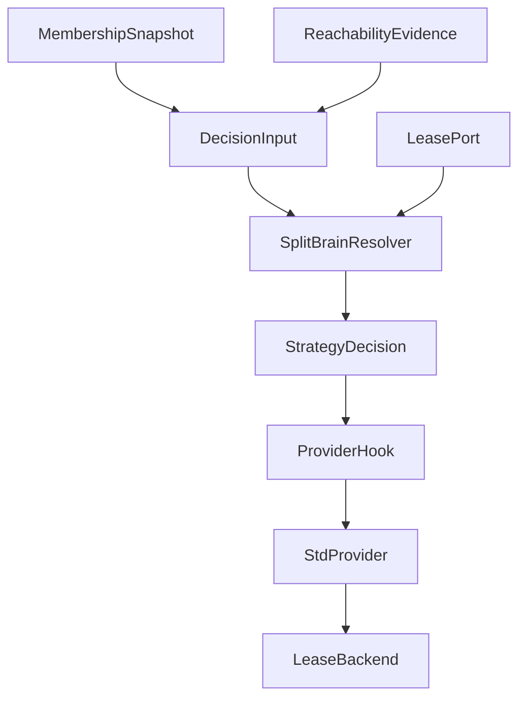
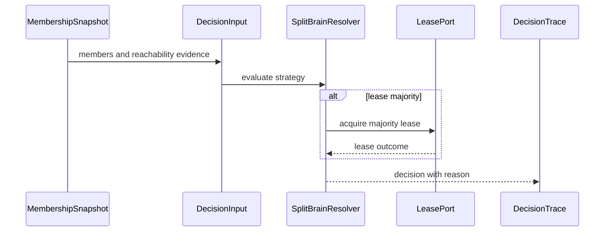
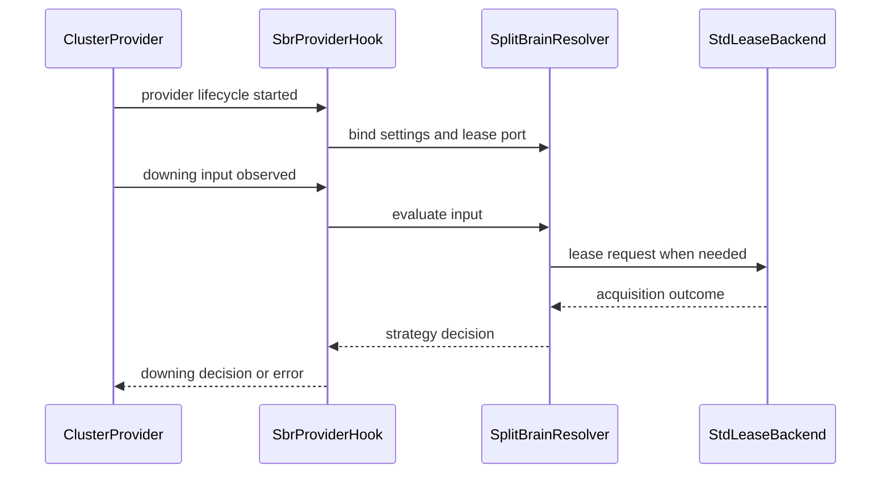
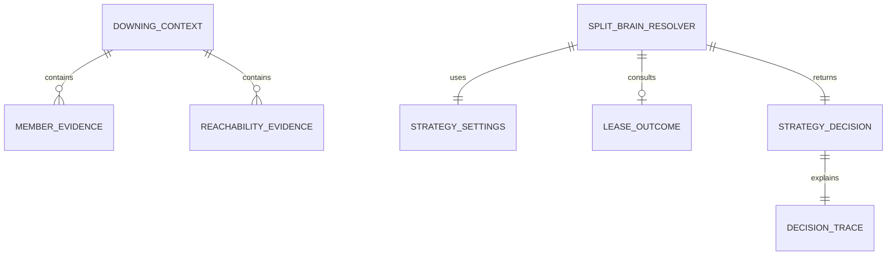

# Design Document

## Overview

この feature は、cluster downing が membership snapshot と reachability evidence を入力に、Split Brain Resolver strategy と lease majority を再現可能な decision contract として扱えるようにする。対象ユーザーは fraktor-rs cluster runtime 実装者、provider 実装者、spec reviewer であり、downing decision の根拠、保留理由、provider integration の責務境界を同じ語彙で確認できるようにする。

既存実装には `DowningProvider`、`DowningInput`、`DowningDecision`、`DowningProviderCompatibility`、`SplitBrainResolverSettings`、`SplitBrainResolverStrategy` がある。この設計は既存の provider hook を置き換えず、core/downing_provider に SBR evaluator、decision trace、lease majority port を追加し、std/provider は lifecycle と lease backend binding を担当する。

### Goals

- membership reachability evidence を SBR evaluation input として扱う。
- Split Brain Resolver strategy ごとの decision と trace を core contract にする。
- lease-based majority を `no_std` core の port と std/provider backend binding に分離する。
- provider-facing integration で SBR settings / provider key / decision hook を接続する。

### Non-Goals

- GossipEnvelope、heartbeat sender/receiver、CrossDcClusterHeartbeat。
- discovery provider、SeedNodeProcess、generic discovery adapter。
- DistributedPubSubMediator、topic registry gossip、cluster message serializer。
- Cluster Sharding rebalance、Cluster Singleton、remembered entity recovery、in-flight draining。
- Pekko Split Brain Resolver public API の完全互換 layer。

## Boundary Commitments

### This Spec Owns

- SBR evaluation input、decision target、decision trace、stable-after / down-all timeout の decision vocabulary。
- `SplitBrainResolver` と `DowningStrategy` decision model の core contract。
- `LeaseMajorityPort` と lease acquisition outcome vocabulary。
- provider-facing SBR integration の decision hook、settings identity、provider lifecycle cleanup expectation。
- `docs/gap-analysis/cluster-gap-analysis.md` の downing/SBR active follow-up に対する evidence 更新。

### Out of Boundary

- membership reachability matrix 自体の定義、merge、prune、snapshot ownership。
- gossip merge、heartbeat scheduling、wire envelope、Cross-DC heartbeat。
- discovery backend、seed node process、generic discovery adapter。
- pubsub mediator protocol、topic registry gossip、cluster message serializer。
- host-specific lease backend の concrete network protocol。

### Allowed Dependencies

- `cluster-membership-reachability-model` の `UniqueAddress`、data center、`WeaklyUp`、reachability snapshot、indirect connection evidence。
- `cluster-active-compatibility-baseline` の SBR provider-facing hook、provider key、settings identity。
- 既存 `downing_provider` module の `DowningProvider`、`DowningInput`、`DowningDecision`、`SplitBrainResolverSettings`、`SplitBrainResolverStrategy`。
- `fraktor-utils-core-rs` の portable time primitive。
- `cluster-adaptor-std` の provider lifecycle と host runtime binding。

### Revalidation Triggers

- upstream membership snapshot、reachability record、aggregate status、`WeaklyUp` semantics が変わる。
- `SplitBrainResolverSettings` または `SplitBrainResolverStrategy` の variant / timing semantics が変わる。
- `DowningProvider::decide` の signature、error type、lifetime expectation が変わる。
- provider lifecycle が pending operation の cleanup guarantee を変える。
- lease backend binding が retry、timeout、ownership semantics を core 側へ要求する。

## Architecture

### Existing Architecture Analysis

`fraktor-cluster-core-kernel-rs` の `downing_provider` module は downing hook と compatibility metadata を持つ。`NoopDowningProvider` は explicit down を `Down`、failure observation を `Defer` / `Keep` に変換するだけで、membership partition や lease majority は扱わない。

upstream membership spec は reachability matrix と indirect evidence を membership boundary で所有する。本 feature はその snapshot を読み、decision trace に変換する。membership へ downing policy を戻さず、std/provider へ strategy semantics を漏らさない。

### Architecture Pattern & Boundary Map



**Architecture Integration**:
- Selected pattern: core evaluator + port-and-adapter lease binding。decision semantics は core、host binding は std adaptor に置く。
- Domain/feature boundaries: membership は evidence、downing_provider は decision、cluster-adaptor-std は provider lifecycle と lease backend binding を所有する。
- Existing patterns preserved: `no_std` core、1公開型1ファイル、sibling test file、provider lifecycle は std 側。
- New components rationale: SBR decision は既存 `DowningDecision` だけでは理由・対象 partition・lease outcome を表現できないため、trace と strategy decision vocabulary を追加する。
- Steering compliance: Tokio、network I/O、host clock ownership は core に入れない。

### Technology Stack

| Layer | Choice / Version | Role in Feature | Notes |
|-------|------------------|-----------------|-------|
| Core runtime | Rust 2024 nightly workspace | SBR evaluator、decision trace、lease port | `no_std` + `alloc` を維持 |
| Cluster core | `fraktor-cluster-core-kernel-rs` | downing_provider contract | membership upstream type に依存 |
| Std adaptor | `fraktor-cluster-adaptor-std-rs` | provider lifecycle と lease backend binding | host I/O はここに限定 |
| Tests | cargo unit / integration tests | strategy、lease outcome、provider cleanup の検証 | targeted tests を優先 |

## File Structure Plan

### Directory Structure

```text
modules/cluster-core-kernel/src/
├── downing_provider.rs                         # 新しい SBR / lease 型を公開する module wiring
└── downing_provider/
    ├── downing_decision_context.rs             # membership snapshot と reachability evidence を評価入力にまとめる
    ├── downing_decision_context_test.rs        # 不足 evidence / explicit down / WeaklyUp 入力を検証する
    ├── downing_strategy.rs                     # strategy evaluation contract
    ├── downing_strategy_decision.rs            # keep/down/defer と対象 partition の decision vocabulary
    ├── downing_decision_trace.rs               # reason、tie-break、lease outcome の trace
    ├── split_brain_resolver.rs                 # SBR evaluator entrypoint
    ├── split_brain_resolver_test.rs            # strategy ごとの decision test
    ├── lease_majority_port.rs                  # core の lease acquisition port
    ├── lease_acquisition_outcome.rs            # acquired / denied / unavailable / unknown
    ├── lease_majority_decision.rs              # lease outcome と majority decision の結合結果
    ├── split_brain_resolver_provider.rs        # provider-facing core helper
    └── split_brain_resolver_provider_test.rs   # compatibility metadata と decision hook の test

modules/cluster-adaptor-std/src/
└── cluster_provider/
    ├── split_brain_resolver_provider.rs        # std provider lifecycle への SBR binding
    ├── lease_majority_backend.rs               # host lease backend trait / adapter boundary
    ├── lease_majority_backend_test.rs          # backend outcome / cleanup tests
    └── local_cluster_provider_ext.rs           # SBR provider helper を provider extension から接続する
```

### Modified Files

- `modules/cluster-core-kernel/src/downing_provider.rs` — SBR evaluator、strategy decision、lease port、provider helper を公開する。
- `modules/cluster-core-kernel/src/downing_provider/downing_input.rs` — explicit down と failure observation に加え、decision context への変換口を追加する。
- `modules/cluster-core-kernel/src/downing_provider/downing_decision.rs` — existing simple decision を維持し、trace 付き decision との変換を定義する。
- `modules/cluster-core-kernel/src/downing_provider/split_brain_resolver_settings.rs` — stable-after / down-all timeout の evaluation prerequisite を明確化する。
- `modules/cluster-core-kernel/src/downing_provider/split_brain_resolver_strategy.rs` — existing strategy identity を `DowningStrategy` evaluation contract と接続する。
- `modules/cluster-adaptor-std/src/cluster_provider.rs` — std SBR provider helper と lease backend adapter を公開する。
- `docs/gap-analysis/cluster-gap-analysis.md` — downing/SBR active follow-up の evidence を更新する。

## System Flows



SBR evaluation は membership evidence を読むだけで、membership state を変更しない。lease は core port の outcome として扱い、host I/O は std adaptor が所有する。



provider は SBR evaluator を呼び出すだけで、strategy semantics を再実装しない。provider stop/drop 時は std binding が pending lease operation と hook state を破棄する。

## Requirements Traceability

| Requirement | Summary | Components | Interfaces | Flows |
|-------------|---------|------------|------------|-------|
| 1.1 | snapshot と evidence を同じ input にする | DowningDecisionContext | decision context API | SBR evaluation |
| 1.2 | evidence 不足を保留にする | SplitBrainResolver, DowningDecisionTrace | strategy decision API | SBR evaluation |
| 1.3 | explicit down を直接扱う | DowningDecisionContext | `DowningInput` conversion | SBR evaluation |
| 1.4 | `WeaklyUp` / unreachable / terminated を区別する | DowningDecisionContext | membership input contract | SBR evaluation |
| 1.5 | protocol work を実行しない | ScopeGuard | boundary contract | none |
| 2.1 | strategy identity を区別する | DowningStrategy, SplitBrainResolver | strategy evaluation API | SBR evaluation |
| 2.2 | stable-after 未達を保留にする | SplitBrainResolver | settings contract | SBR evaluation |
| 2.3 | majority decision に対象を含める | DowningStrategyDecision, DowningDecisionTrace | decision trace API | SBR evaluation |
| 2.4 | tie-break / defer reason を trace に含める | DowningDecisionTrace | trace API | SBR evaluation |
| 2.5 | down-all timeout を守る | SplitBrainResolver | settings contract | SBR evaluation |
| 3.1 | lease 成功時だけ majority keep にする | LeaseMajorityDecision | lease port API | SBR evaluation |
| 3.2 | lease failure reason を返す | LeaseAcquisitionOutcome, DowningDecisionTrace | lease port API | SBR evaluation |
| 3.3 | lease 未設定を failure にする | SplitBrainResolverProviderHook | provider helper API | provider binding |
| 3.4 | lease 判断不能時に保留する | LeaseMajorityDecision | lease outcome API | SBR evaluation |
| 3.5 | core に host I/O を持ち込まない | LeaseMajorityPort, StdLeaseBackend | port contract | provider binding |
| 4.1 | provider key/settings を公開する | SplitBrainResolverProviderHook | compatibility metadata | provider binding |
| 4.2 | provider hook へ evaluator を接続する | SplitBrainResolverProviderHook | `DowningProvider` hook | provider binding |
| 4.3 | provider lifetime 外に pending operation を残さない | StdSplitBrainResolverProvider | lifecycle contract | provider binding |
| 4.4 | decision failure を error として返す | SplitBrainResolverProviderHook | error contract | provider binding |
| 4.5 | std/provider が semantics を所有しない | ScopeGuard | boundary contract | provider binding |
| 5.1 | gossip/heartbeat を out of boundary にする | ScopeGuard | roadmap boundary | none |
| 5.2 | discovery provider を out of boundary にする | ScopeGuard | roadmap boundary | none |
| 5.3 | pubsub/serialization を out of boundary にする | ScopeGuard | roadmap boundary | none |
| 5.4 | membership 変更時に revalidation する | RevalidationGuard | spec dependency | none |
| 5.5 | gap analysis 更新を downing/SBR に限定する | GapAnalysisUpdate | docs update | none |

## Components and Interfaces

| Component | Domain/Layer | Intent | Req Coverage | Key Dependencies | Contracts |
|-----------|--------------|--------|--------------|------------------|-----------|
| DowningDecisionContext | core/downing_provider | membership snapshot と reachability evidence を SBR input にまとめる | 1.1, 1.2, 1.3, 1.4 | membership snapshot P0 | State |
| DowningStrategy | core/downing_provider | strategy identity と evaluation prerequisite を接続する | 2.1, 2.2, 2.5 | SplitBrainResolverSettings P0 | Service |
| SplitBrainResolver | core/downing_provider | SBR strategy を評価し decision trace を返す | 1.2, 2.1, 2.2, 2.3, 2.4, 2.5 | DowningDecisionContext P0, LeaseMajorityPort P1 | Service |
| DowningStrategyDecision | core/downing_provider | keep/down/defer の対象 partition と reason を表現する | 2.3, 2.4, 3.2, 3.4 | SplitBrainResolver P0 | State |
| LeaseMajorityPort | core/downing_provider | lease acquisition outcome を core に渡す port | 3.1, 3.2, 3.3, 3.4, 3.5 | std lease backend P1 | Service |
| SplitBrainResolverProviderHook | core/downing_provider | provider metadata と `DowningProvider` hook を SBR evaluator に接続する | 4.1, 4.2, 4.4, 4.5 | DowningProviderCompatibility P0 | Service |
| StdSplitBrainResolverProvider | std/cluster_provider | provider lifecycle と lease backend binding を担当する | 3.5, 4.2, 4.3, 4.5 | SplitBrainResolverProviderHook P0 | Service |
| ScopeGuard | spec boundary | downstream protocol work を吸収しない境界を保持する | 1.5, 5.1, 5.2, 5.3, 5.4 | roadmap P0 | Batch |
| GapAnalysisUpdate | docs | downing/SBR follow-up の evidence を更新する | 5.5 | docs/gap-analysis P0 | Batch |

### core/downing_provider

#### DowningDecisionContext

| Field | Detail |
|-------|--------|
| Intent | SBR evaluation が読む snapshot と reachability evidence を一つの入力にする |
| Requirements | 1.1, 1.2, 1.3, 1.4 |

**Responsibilities & Constraints**
- membership snapshot、reachability aggregate、indirect evidence、evaluation time を保持する。
- explicit down は snapshot 不要の context として扱う。
- `WeaklyUp`、unreachable、terminated を失わずに evaluator へ渡す。
- gossip/heartbeat/discovery を実行しない。

**Dependencies**
- Inbound: membership snapshot — upstream membership state (P0)
- Inbound: `DowningInput` — existing provider input (P0)
- Outbound: `SplitBrainResolver` — strategy evaluation (P0)

**Contracts**: Service [ ] / API [ ] / Event [ ] / Batch [ ] / State [x]

##### State Management
- State model: immutable evaluation snapshot。
- Persistence & consistency: persistence なし。評価中に membership state を変更しない。
- Concurrency strategy: core は ownership 渡しまたは immutable borrow で扱う。

#### DowningStrategy

| Field | Detail |
|-------|--------|
| Intent | `SplitBrainResolverStrategy` を evaluator contract に接続する |
| Requirements | 2.1, 2.2, 2.5 |

**Responsibilities & Constraints**
- strategy identity と settings prerequisite を evaluator へ渡す。
- stable-after と down-all timeout の判定条件を公開する。
- strategy の concrete algorithm は `SplitBrainResolver` が実行する。

**Dependencies**
- Inbound: `SplitBrainResolverSettings` — active strategy と timing (P0)
- Outbound: `SplitBrainResolver` — strategy evaluation (P0)

**Contracts**: Service [x] / API [ ] / Event [ ] / Batch [ ] / State [ ]

##### Service Interface
```rust
trait DowningStrategy {
  fn evaluate(&self, context: &DowningDecisionContext) -> DowningStrategyDecision;
}
```
- Preconditions: context は membership snapshot または explicit down を含む。
- Postconditions: decision は `DowningDecisionTrace` を含む。
- Invariants: strategy evaluation は membership state を変更しない。

#### SplitBrainResolver

| Field | Detail |
|-------|--------|
| Intent | SBR settings と context から downing decision を返す |
| Requirements | 1.2, 2.1, 2.2, 2.3, 2.4, 2.5, 3.1, 3.4 |

**Responsibilities & Constraints**
- `KeepMajority`、`LeaseMajority`、`StaticQuorum`、`KeepOldest`、`DownAll` を strategy identity として評価する。
- stable-after 未達、tie、evidence 不足、lease unknown を defer reason として返す。
- decision target と keep partition を trace に含める。
- actor、scheduler、heartbeat は持たない。

**Dependencies**
- Inbound: `DowningDecisionContext` — evaluation input (P0)
- Inbound: `SplitBrainResolverSettings` — timing / strategy (P0)
- Outbound: `LeaseMajorityPort` — lease acquisition result (P1)

**Contracts**: Service [x] / API [ ] / Event [ ] / Batch [ ] / State [ ]

##### Service Interface
```rust
trait SplitBrainResolver {
  fn decide(&mut self, context: &DowningDecisionContext) -> DowningStrategyDecision;
}
```
- Preconditions: upstream membership snapshot の identity と reachability evidence が同じ version boundary に属する。
- Postconditions: result は simple `DowningDecision` へ変換可能な trace 付き decision である。
- Invariants: evaluator は host I/O を実行しない。

#### DowningStrategyDecision

| Field | Detail |
|-------|--------|
| Intent | decision result、対象 member、理由、lease outcome を保持する |
| Requirements | 2.3, 2.4, 3.2, 3.4 |

**Responsibilities & Constraints**
- keep/down/defer/all-down の category を保持する。
- affected member と retained member の partition を区別する。
- tie-break、stable-after、lease outcome、不足 evidence の reason を trace に残す。

**Dependencies**
- Inbound: `SplitBrainResolver` — decision producer (P0)
- Outbound: `DowningProvider` — simple decision への変換 (P1)

**Contracts**: Service [ ] / API [ ] / Event [ ] / Batch [ ] / State [x]

##### State Management
- State model: immutable decision result。
- Persistence & consistency: persistence なし。trace は test と provider error mapping の根拠になる。
- Concurrency strategy: shared mutation なし。

#### LeaseMajorityPort

| Field | Detail |
|-------|--------|
| Intent | lease backend の結果を SBR evaluator へ渡す |
| Requirements | 3.1, 3.2, 3.3, 3.4, 3.5 |

**Responsibilities & Constraints**
- acquired、denied、unavailable、unknown を区別する。
- core は backend の network I/O や retry を所有しない。
- lease 未設定は provider helper が failure として扱う。

**Dependencies**
- Inbound: `SplitBrainResolver` — lease majority evaluation (P0)
- Outbound: std lease backend — host-specific acquisition (P1)

**Contracts**: Service [x] / API [ ] / Event [ ] / Batch [ ] / State [ ]

##### Service Interface
```rust
trait LeaseMajorityPort {
  fn acquire_majority(&mut self, context: &DowningDecisionContext) -> LeaseAcquisitionOutcome;
}
```
- Preconditions: active strategy は `LeaseMajority` である。
- Postconditions: outcome は decision trace に含まれる。
- Invariants: core trait は backend implementation details を要求しない。

#### SplitBrainResolverProviderHook

| Field | Detail |
|-------|--------|
| Intent | provider metadata と `DowningProvider` hook を SBR evaluator に接続する |
| Requirements | 3.3, 4.1, 4.2, 4.4, 4.5 |

**Responsibilities & Constraints**
- provider key、SBR settings、strategy identity を compatibility metadata として公開する。
- `DowningProvider::decide` の既存 hook から SBR evaluator を呼ぶ。
- evaluator failure と lease 未設定を `ClusterProviderError` に map する。
- std/provider に decision semantics を重複させない。

**Dependencies**
- Inbound: `DowningProviderCompatibility` — provider identity (P0)
- Inbound: `SplitBrainResolverSettings` — SBR settings (P0)
- Outbound: `SplitBrainResolver` — decision evaluator (P0)

**Contracts**: Service [x] / API [ ] / Event [ ] / Batch [ ] / State [ ]

##### Service Interface
```rust
trait SplitBrainResolverProviderHook {
  fn compatibility(&self) -> DowningProviderCompatibility;
  fn decide(&mut self, input: &DowningInput) -> Result<DowningDecision, ClusterProviderError>;
}
```
- Preconditions: settings は compatibility metadata と同一 identity を持つ。
- Postconditions: provider が返す simple decision は trace 付き decision から導かれる。
- Invariants: provider hook は strategy semantics を再実装しない。

### std/cluster_provider

#### StdSplitBrainResolverProvider

| Field | Detail |
|-------|--------|
| Intent | std provider lifecycle と lease backend を core SBR hook へ接続する |
| Requirements | 3.5, 4.2, 4.3, 4.5 |

**Responsibilities & Constraints**
- lifecycle start 時に SBR hook と lease backend adapter を構成する。
- lifecycle stop/drop 時に pending lease operation と provider-owned state を破棄する。
- lease backend の timeout、retry、network I/O は std 側に閉じる。
- decision semantics は core hook に委譲する。

**Dependencies**
- Inbound: local cluster provider lifecycle — start / stop / drop (P0)
- Outbound: `SplitBrainResolverProviderHook` — core decision hook (P0)
- External: host lease backend — acquisition implementation (P1)

**Contracts**: Service [x] / API [ ] / Event [ ] / Batch [ ] / State [ ]

##### Service Interface
```rust
trait StdLeaseMajorityBackend {
  fn acquire(&mut self, request: LeaseMajorityRequest) -> LeaseAcquisitionOutcome;
}
```
- Preconditions: backend は provider lifecycle 内で所有される。
- Postconditions: stop/drop 後に pending operation は provider へ callback しない。
- Invariants: backend-specific errors は core outcome vocabulary に map される。

### spec boundary

#### ScopeGuard

| Field | Detail |
|-------|--------|
| Intent | downstream protocol work を downing/SBR spec が吸収しないようにする |
| Requirements | 1.5, 5.1, 5.2, 5.3, 5.4 |

**Responsibilities & Constraints**
- gossip heartbeat、discovery、pubsub、serialization を out of boundary として維持する。
- upstream membership shape の変更時は SBR revalidation を要求する。
- gap analysis 更新範囲を downing/SBR に限定する。

**Contracts**: Service [ ] / API [ ] / Event [ ] / Batch [x] / State [ ]

##### Batch / Job Contract
- Trigger: implementation close-out。
- Input / validation: roadmap と gap analysis の active follow-up。
- Output / destination: downing/SBR 項目だけの evidence。
- Idempotency & recovery: downstream spec 項目は変更しない。

## Data Models

### Domain Model



- `DowningDecisionContext`: evaluation time、members、reachability evidence、explicit down input を持つ。
- `MemberEvidence`: unique address、status、data center、roles、age/oldest ordering に必要な value を参照する。
- `ReachabilityEvidence`: observer、subject、status、version、indirect evidence を参照する。
- `LeaseAcquisitionOutcome`: acquired、denied、unavailable、unknown を区別する。
- `DowningStrategyDecision`: keep/down/defer/all-down、対象 partition、decision trace を保持する。

### Logical Data Model

**Structure Definition**:
- natural key は upstream `UniqueAddress`。
- decision context は snapshot-consistent な input として扱い、評価中に membership table を参照し続けない。
- lease outcome は strategy decision に一度だけ反映され、core に backend state を保持しない。

**Consistency & Integrity**:
- membership snapshot version と reachability version が矛盾する場合は defer reason にする。
- tie-break rule が未決定の場合は down decision へ進めず defer にする。
- provider hook の simple `DowningDecision` は trace 付き decision から導出する。

## Testing Strategy

- `DowningDecisionContext` tests: snapshot/evidence 不足、explicit down、`WeaklyUp` / unreachable / terminated 区別を検証する。
- `SplitBrainResolver` tests: `KeepMajority`、`StaticQuorum`、`KeepOldest`、`DownAll` の keep/down/defer と trace を検証する。
- `LeaseMajorityPort` tests: acquired、denied、unavailable、unknown、backend missing を検証する。
- provider hook tests: compatibility metadata、settings identity、decision failure mapping を検証する。
- std provider tests: lifecycle start/stop/drop と pending lease cleanup を検証する。
- boundary tests/review: gossip/discovery/pubsub/serialization ファイルを変更対象にしないことを review checklist で確認する。
