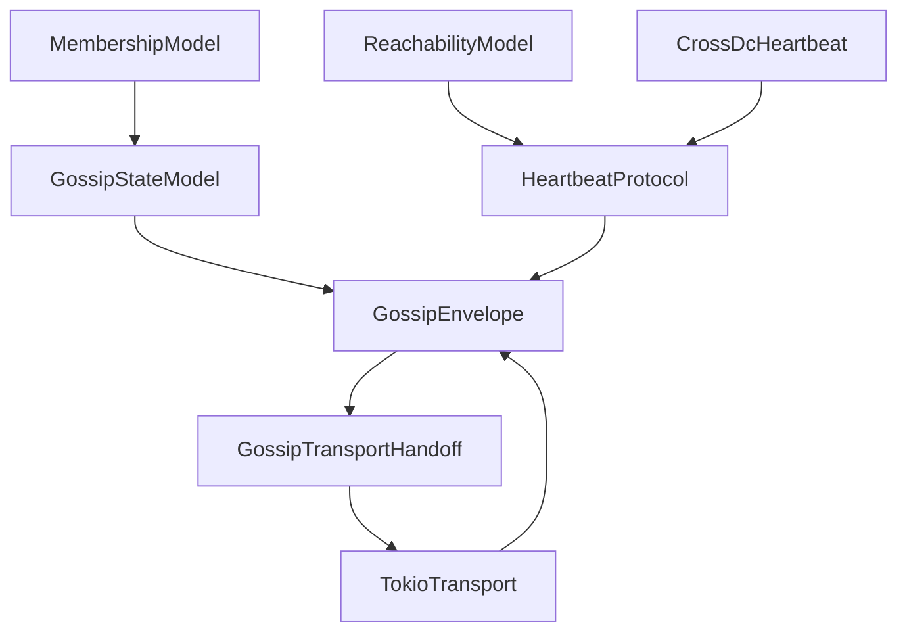
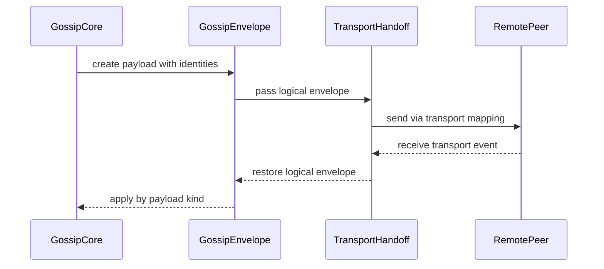
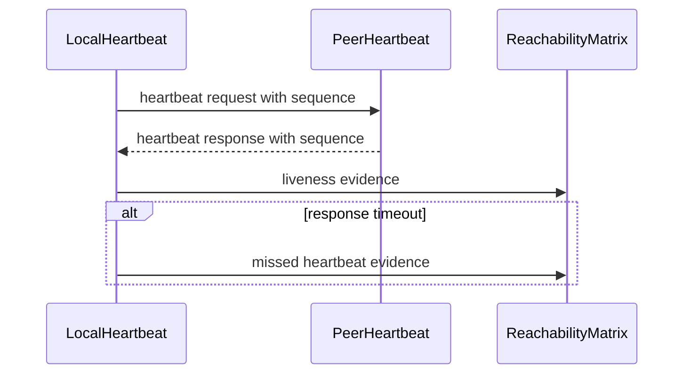
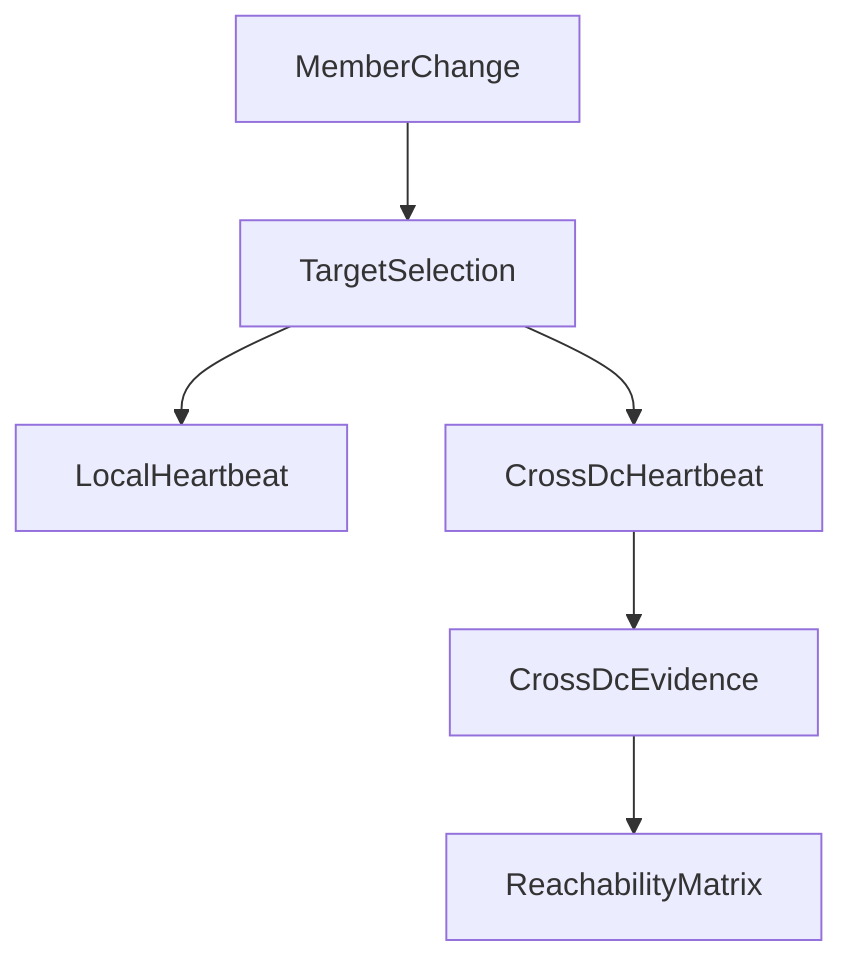

# Design Document

## Overview

この feature は、cluster membership の gossip と heartbeat を、identity-aware envelope、full gossip merge、tombstone、seen digest、dedicated heartbeat、Cross-DC heartbeat の contract として固定する。対象ユーザーは fraktor-rs cluster runtime 実装者と downstream spec 実装者であり、membership convergence と liveness evidence を同じ語彙で検証できるようにする。

既存実装には `GossipDisseminationCoordinator`、`GossipOutbound`、`VectorClock`、`GossipTransport`、`TokioGossipTransport`、`GossipWireDeltaV1` がある。現在は membership delta diffusion と ack tracking が中心で、from/to `UniqueAddress` を持つ envelope、full state merge、removed member tombstone、seen digest、heartbeat request / response、Cross-DC heartbeat が protocol contract として分離されていない。

### Goals

- `GossipEnvelope` を core contract として定義し、std transport は logical envelope handoff に限定し、versioned bytes は cluster message serialization contract に残す。
- full gossip state merge、tombstone retention、seen digest convergence を membership core に追加する。
- dedicated heartbeat request / response と first heartbeat expectation を failure detector 入力として公開する。
- data center membership を前提に Cross-DC heartbeat evidence を扱う。

### Non-Goals

- SplitBrainResolver、DowningStrategy、lease-based majority、downing execution。
- SeedNodeProcess、generic discovery adapter、provider lifecycle orchestration。
- DistributedPubSubMediator、topic registry gossip、pubsub delta collection。
- actor-core serialization registry や cluster message serializer framework 全体。

## Boundary Commitments

### This Spec Owns

- `GossipEnvelope` の identity、payload kind、deadline、version contract。
- membership core の full gossip state、merge rule、tombstone、seen digest。
- dedicated cluster heartbeat request / response、sequence number、first heartbeat expectation、liveness evidence。
- Cross-DC heartbeat target selection と data center pair 付き liveness evidence。
- std membership transport が logical envelope を送受信する handoff contract。
- `docs/gap-analysis/cluster-gap-analysis.md` の gossip / heartbeat 4項目に対する evidence 更新。

### Out of Boundary

- downing policy、responsible node selection、lease majority、member removal decision。
- seed node process、discovery backend、transport endpoint discovery。
- pubsub mediator protocol、topic registry ownership、pubsub registry gossip。
- versioned transport handoff、serde/postcard bytes、generic message serializer framework、Pekko binary compatibility、actor message serialization registry。

### Allowed Dependencies

- `cluster-membership-reachability-model` の `UniqueAddress`、data center、reachability matrix、indirect evidence。
- 既存 `membership` module の `MembershipTable`、`MembershipDelta`、`MembershipVersion`、`VectorClock`、`GossipDisseminationCoordinator`。
- 既存 std adaptor の `TokioGossipTransport`、`GossipWireDeltaV1`、`TokioGossiper`。
- `fraktor-remote-core-rs::address::UniqueAddress` の identity semantics。
- actor-core / remote-core の timer primitive と std adaptor の Tokio runtime。

### Revalidation Triggers

- `UniqueAddress`、`DataCenter`、`ReachabilityMatrix` の public shape または equality semantics が変わる。
- `MembershipDelta`、`MembershipSnapshot`、`NodeRecord` の merge 対象 field が変わる。
- `GossipTransport` の send / poll contract が envelope-aware に変わる。
- transport endpoint mapping または logical envelope handoff が変わる。
- downstream pubsub / serialization specs が gossip envelope payload kind を consume し始める。

## Architecture

### Existing Architecture Analysis

`fraktor-cluster-core-kernel-rs` の `membership` module は delta-based gossip を持ち、`GossipDisseminationCoordinator` が peer versions、seen set、vector clock を保持する。`GossipOutbound` は target authority と `MembershipDelta` だけを持つため、from/to identity と payload kind を transport 境界で検証できない。`MembershipTable` は heartbeat miss を `Suspect` へ変換するが、dedicated heartbeat request / response と reachability matrix evidence はまだ分離されていない。

`cluster-adaptor-std` は UDP transport と既存の gossip wire delta を持つ。今回の spec では bytes schema を拡張せず、logical envelope を transport boundary に渡す契約を定義し、membership merge semantics は core に残す。

### Architecture Pattern & Boundary Map



**Architecture Integration**:
- Selected pattern: core protocol + std wire adaptor。gossip semantics は core、logical handoff と runtime I/O は std adaptor に限定する。
- Domain/feature boundaries: merge/tombstone/seen は `GossipStateModel`、heartbeat evidence は `HeartbeatProtocol`、logical envelope handoff は `GossipTransportHandoff` が持つ。
- Existing patterns preserved: `no_std` core、std adaptor separation、1公開型1ファイル、sibling test file、targeted cargo tests。
- New components rationale: `GossipOutbound` と delta-only wire では from/to identity、payload kind、deadline、full merge、heartbeat response を表現できないため、protocol-level envelope が必要。
- Steering compliance: core は `alloc` までに留め、Tokio と UDP は std adaptor に残す。byte-level schema と serde/postcard 利用は `cluster-message-serialization-contract` に委譲する。

### Technology Stack

| Layer | Choice / Version | Role in Feature | Notes |
|-------|------------------|-----------------|-------|
| Core runtime | Rust 2024 nightly workspace | envelope、merge、tombstone、seen digest、heartbeat evidence | `no_std` + `alloc` を維持 |
| Remote identity | `fraktor-remote-core-rs` | `UniqueAddress` identity | upstream membership spec と同じ primitive |
| Std adaptor | Tokio + UDP transport | envelope logical envelope dispatch | semantic decision は持たない |
| Transport handoff | existing transport port | logical envelope dispatch | versioned bytes は後続 serialization spec |
| Tests | cargo unit/integration tests | merge、heartbeat、transport handoff、Cross-DC evidence の検証 | 対象 crate の targeted tests |

## File Structure Plan

### Directory Structure

```text
modules/cluster-core-kernel/src/
├── membership.rs                              # gossip / heartbeat protocol 型の module wiring
├── membership/
│   ├── gossip_envelope.rs                    # from/to identity、payload kind、deadline
│   ├── gossip_envelope_test.rs               # identity / deadline / payload kind tests
│   ├── gossip_payload_kind.rs                # delta / full state / seen digest / heartbeat
│   ├── gossip_state_snapshot.rs              # full gossip state payload
│   ├── gossip_state_merge.rs                 # deterministic merge result contract
│   ├── gossip_tombstone.rs                   # removed/dead member tombstone
│   ├── gossip_seen_digest.rs                 # peer seen version digest
│   ├── gossip_dissemination_coordinator.rs   # envelope-aware dissemination と full merge 接続
│   ├── heartbeat_request.rs                  # sequence number 付き heartbeat request
│   ├── heartbeat_response.rs                 # request に対応する heartbeat response
│   ├── heartbeat_evidence.rs                 # reachability matrix へ渡す evidence
│   ├── heartbeat_protocol_state.rs           # pending request と first heartbeat expectation
│   ├── cross_dc_heartbeat.rs                 # data center pair 付き heartbeat target/evidence
│   └── *_test.rs                             # sibling unit tests
```

```text
modules/cluster-adaptor-std/src/
└── membership/
    ├── gossip_transport_handoff.rs           # logical envelope handoff と peer mapping
    ├── gossip_transport_handoff_test.rs      # identity / payload kind / unknown peer tests
    ├── tokio_gossip_transport.rs             # envelope-aware send / poll
    └── *_test.rs                             # transport lifecycle / invalid handoff tests
```

### Modified Files

- `modules/cluster-core-kernel/src/membership.rs` — `GossipEnvelope`、`GossipPayloadKind`、`GossipStateSnapshot`、`GossipTombstone`、`GossipSeenDigest`、heartbeat protocol 型を公開する。
- `modules/cluster-core-kernel/src/membership/gossip_outbound.rs` — target-only delta payload から envelope-aware outbound へ移行する。
- `modules/cluster-core-kernel/src/membership/gossip_transport.rs` — envelope payload の send / poll contract を定義する。
- `modules/cluster-core-kernel/src/membership/gossip_dissemination_coordinator.rs` — full merge、seen digest、tombstone、deadline outcome を接続する。
- `modules/cluster-core-kernel/src/membership/membership_table.rs` — full gossip merge と tombstone retention に必要な state access を提供する。
- `modules/cluster-adaptor-std/src/membership.rs` — wire envelope modules を公開する。
- `modules/cluster-adaptor-std/src/membership/tokio_gossip_transport.rs` — logical envelope handoff と peer mapping を扱うように更新する。
- `docs/gap-analysis/cluster-gap-analysis.md` — gossip / heartbeat 4項目の status と evidence を更新する。

## System Flows







## Requirements Traceability

| Requirement | Summary | Components | Interfaces | Flows |
|-------------|---------|------------|------------|-------|
| 1.1 | from/to identity と version を持つ envelope | GossipEnvelope | envelope constructor | envelope send |
| 1.2 | payload kind を判定可能にする | GossipPayloadKind | payload enum | envelope send |
| 1.3 | deadline expired を正常送信扱いにしない | GossipEnvelope, GossipDispatchOutcome | dispatch check | envelope send |
| 1.4 | identity 未確定を失敗にする | GossipEnvelope | validation error | envelope send |
| 1.5 | std transport roundtrip で identity を保持する | GossipTransportHandoff | logical handoff | envelope send |
| 2.1 | full gossip state を merge する | GossipStateModel | merge service | full merge |
| 2.2 | conflict を deterministic に解決する | GossipMergeRule | merge result | full merge |
| 2.3 | removed/dead tombstone を保持する | GossipTombstone | tombstone state | full merge |
| 2.4 | tombstone を retention rule で prune する | GossipTombstoneSet | prune service | full merge |
| 2.5 | seen digest を更新する | GossipSeenDigest | seen update | seen digest |
| 2.6 | convergence を観測可能にする | GossipSeenDigest | convergence query | seen digest |
| 3.1 | heartbeat request を生成する | HeartbeatProtocolState | tick API | heartbeat |
| 3.2 | heartbeat response を生成する | HeartbeatResponder | response API | heartbeat |
| 3.3 | response を request と照合する | HeartbeatProtocolState | evidence API | heartbeat |
| 3.4 | first heartbeat timeout を evidence にする | HeartbeatProtocolState | timeout API | heartbeat |
| 3.5 | reachability input だけを渡す | HeartbeatEvidence | evidence event | heartbeat |
| 4.1 | cross-DC target を観測可能にする | CrossDcHeartbeat | target selection | cross-dc |
| 4.2 | cross-DC request を区別する | CrossDcHeartbeat | heartbeat kind | cross-dc |
| 4.3 | data center pair evidence を生成する | CrossDcHeartbeatEvidence | evidence event | cross-dc |
| 4.4 | membership 更新で target を更新する | CrossDcHeartbeat | membership input | cross-dc |
| 4.5 | routing/discovery/downing を決定しない | ScopeGuard | boundary | none |
| 5.1 | envelope を logical transport handoff へ渡す | GossipTransportHandoff | handoff API | envelope send |
| 5.2 | invalid logical transport payload を transport failure にする | GossipTransportHandoff | handoff validation | envelope send |
| 5.3 | heartbeat と gossip payload を区別する | GossipTransportHandoff | payload kind | heartbeat |
| 5.4 | peer endpoint mapping を保持する | TokioGossipTransport | peer map | envelope send |
| 5.5 | std transport が semantics を所有しない | ScopeGuard | boundary | none |
| 6.1 | downing を後続 spec に残す | ScopeGuard | boundary | none |
| 6.2 | discovery を後続 spec に残す | ScopeGuard | boundary | none |
| 6.3 | pubsub を後続 spec に残す | ScopeGuard | boundary | none |
| 6.4 | serialization framework を後続 spec に残す | ScopeGuard | boundary | none |
| 6.5 | gap analysis 更新を4項目に限定する | GapAnalysisUpdate | docs update | none |

## Components and Interfaces

| Component | Domain/Layer | Intent | Req Coverage | Key Dependencies | Contracts |
|-----------|--------------|--------|--------------|------------------|-----------|
| GossipEnvelope | core/membership | gossip と heartbeat payload の identity-aware envelope | 1.1, 1.2, 1.3, 1.4 | UniqueAddress P0, MembershipVersion P0 | State |
| GossipStateModel | core/membership | full gossip state merge、tombstone、seen digest を扱う | 2.1, 2.2, 2.3, 2.4, 2.5, 2.6 | MembershipTable P0, ReachabilityMatrix P0 | Service, State |
| HeartbeatProtocolState | core/membership | dedicated heartbeat request / response と timeout evidence | 3.1, 3.2, 3.3, 3.4, 3.5 | UniqueAddress P0, ReachabilityMatrix P1 | Service, Event, State |
| CrossDcHeartbeat | core/membership | data center pair 付き heartbeat target と evidence | 4.1, 4.2, 4.3, 4.4, 4.5 | DataCenterMembership P0, HeartbeatProtocolState P0 | Service, Event |
| GossipTransportHandoff | std/membership | envelope payload の logical handoff | 1.5, 5.1, 5.2, 5.3, 5.5 | GossipEnvelope P0 | API |
| TokioGossipTransport | std/membership | endpoint mapping と runtime I/O | 5.1, 5.2, 5.3, 5.4, 5.5 | GossipTransportHandoff P0, Tokio P0 | Service, Event |
| ScopeGuard | spec boundary | 隣接 spec の責務を吸収しない | 4.5, 5.5, 6.1, 6.2, 6.3, 6.4 | roadmap P0 | Batch |
| GapAnalysisUpdate | docs | gossip / heartbeat 4項目の evidence を更新する | 6.5 | docs/gap-analysis P0 | Batch |

### core/membership

#### GossipEnvelope

| Field | Detail |
|-------|--------|
| Intent | gossip / heartbeat payload を from/to identity と payload kind 付きで運ぶ |
| Requirements | 1.1, 1.2, 1.3, 1.4 |

**Responsibilities & Constraints**
- `UniqueAddress` の送信元と送信先を authoritative identity として持つ。
- payload kind は delta、full state、seen digest、heartbeat request、heartbeat response、cross-DC heartbeat を区別する。
- deadline expired は dispatch outcome として返し、transport send success と混同しない。
- authority string fallback は許可しない。

**Dependencies**
- External: `fraktor-remote-core-rs::address::UniqueAddress` — node incarnation identity (P0)
- Outbound: `GossipTransportHandoff` — logical transport handoff (P0)
- Inbound: `GossipStateModel` / `HeartbeatProtocolState` — payload generation (P0)

**Contracts**: Service [ ] / API [ ] / Event [ ] / Batch [ ] / State [x]

##### State Management
- State model: from、to、payload kind、membership version、deadline tick、payload。
- Persistence & consistency: runtime persistence なし。wire roundtrip と coordinator state で観測する。
- Concurrency strategy: envelope は immutable value とし、dispatch state は coordinator が保持する。

#### GossipStateModel

| Field | Detail |
|-------|--------|
| Intent | full gossip state と convergence state を deterministic に merge する |
| Requirements | 2.1, 2.2, 2.3, 2.4, 2.5, 2.6 |

**Responsibilities & Constraints**
- local state と remote state を member identity、membership version、reachability version、tombstone version で merge する。
- removed/dead member は tombstone として保持し、retention 条件を満たすまで再出現を抑止する。
- seen digest は peer identity ごとの observed version を保持し、active peer 全員の確認で convergence を返す。
- pubsub registry gossip や distributed-data CRDT merge は扱わない。

**Contracts**: Service [x] / API [ ] / Event [x] / Batch [ ] / State [x]

##### Service Interface

```rust
impl GossipStateModel {
  pub fn merge(&mut self, remote: GossipStateSnapshot) -> GossipMergeOutcome;
  pub fn mark_seen(&mut self, peer: UniqueAddress, version: MembershipVersion) -> GossipSeenDigest;
  pub fn prune_tombstones(&mut self, active_seen: &GossipSeenDigest) -> GossipTombstonePruneOutcome;
}
```

- Preconditions: remote snapshot は確定済み `UniqueAddress` を含む。
- Postconditions: merge outcome は applied records、conflicts、tombstones、seen digest changes を観測可能にする。
- Invariants: tombstone は stale member record より優先する。

##### Event Contract
- Published events: `Merged`, `ConflictDetected`, `TombstoneAdded`, `TombstonePruned`, `SeenDigestChanged`, `Converged`。
- Subscribed events: membership delta / full state envelope。
- Ordering / delivery guarantees: single coordinator instance 内の merge order に従う。network ordering は保証しない。

#### HeartbeatProtocolState

| Field | Detail |
|-------|--------|
| Intent | request / response と timeout を liveness evidence に変換する |
| Requirements | 3.1, 3.2, 3.3, 3.4, 3.5 |

**Responsibilities & Constraints**
- peer ごとの next sequence number と pending request を保持する。
- response は peer identity と sequence number で照合する。
- first heartbeat expectation と通常 timeout を区別して evidence 化する。
- reachability matrix への input を生成するだけで、downing decision は行わない。

**Contracts**: Service [x] / API [ ] / Event [x] / Batch [ ] / State [x]

##### Service Interface

```rust
impl HeartbeatProtocolState {
  pub fn tick(&mut self, now_ms: u64, peers: &[UniqueAddress]) -> Vec<HeartbeatRequest>;
  pub fn handle_request(&self, request: HeartbeatRequest) -> HeartbeatResponse;
  pub fn handle_response(&mut self, response: HeartbeatResponse, now_ms: u64) -> HeartbeatEvidence;
  pub fn collect_timeouts(&mut self, now_ms: u64) -> Vec<HeartbeatEvidence>;
}
```

- Preconditions: peers は current membership snapshot 由来である。
- Postconditions: response または timeout は `HeartbeatEvidence` として観測できる。
- Invariants: stale response は成功 evidence にしない。

#### CrossDcHeartbeat

| Field | Detail |
|-------|--------|
| Intent | data center をまたぐ heartbeat target と evidence を local heartbeat と区別する |
| Requirements | 4.1, 4.2, 4.3, 4.4, 4.5 |

**Responsibilities & Constraints**
- local data center と peer data center の差分から cross-DC target set を作る。
- heartbeat kind と evidence に data center pair を含める。
- membership update に応じて target を追加・削除する。
- routing、discovery、downing strategy は決めない。

**Contracts**: Service [x] / API [ ] / Event [x] / Batch [ ] / State [ ] 

##### Service Interface

```rust
impl CrossDcHeartbeat {
  pub fn update_targets(&mut self, snapshot: &MembershipSnapshot) -> CrossDcTargetChange;
  pub fn tick(&mut self, now_ms: u64) -> Vec<CrossDcHeartbeatRequest>;
  pub fn handle_response(&mut self, response: CrossDcHeartbeatResponse, now_ms: u64) -> CrossDcHeartbeatEvidence;
}
```

- Preconditions: snapshot は data center を持つ member records を含む。
- Postconditions: evidence は local/remote data center と peer identity を保持する。
- Invariants: same data center peer は cross-DC target にならない。

### std/membership

#### GossipTransportHandoff

| Field | Detail |
|-------|--------|
| Intent | envelope を logical transport payload として受け渡し、不正 payload を拒否する |
| Requirements | 1.5, 5.1, 5.2, 5.3, 5.5 |

**Responsibilities & Constraints**
- payload kind、from/to identity、peer mapping を transport handoff shape に含める。
- unknown payload kind、invalid identity、unknown peer は transport failure にする。
- bytes encoding は扱わず、versioned serialization は cluster-message-serialization-contract に残す。
- merge/tombstone/seen/heartbeat decision は core に戻す。

**Contracts**: Service [ ] / API [x] / Event [ ] / Batch [ ] / State [ ] 

##### API Contract

| Method | Input | Output | Errors |
|--------|-------|--------|--------|
| send | `GossipEnvelope` | dispatch result | invalid envelope, unknown peer |
| receive | transport event | `GossipEnvelope` | unknown peer, invalid envelope |

#### TokioGossipTransport

| Field | Detail |
|-------|--------|
| Intent | envelope-aware gossip payload を UDP transport で送受信する |
| Requirements | 5.1, 5.2, 5.3, 5.4, 5.5 |

**Responsibilities & Constraints**
- `UniqueAddress` と transport endpoint の peer mapping を保持する。
- outbound envelope を transport handoff にして送信し、inbound transport event を envelope として poll する。
- invalid handoff は transport failure として観測し、core semantics を std 側で処理しない。

**Contracts**: Service [x] / API [ ] / Event [x] / Batch [ ] / State [ ] 

##### Service Interface

```rust
trait GossipTransport {
  fn send(&mut self, outbound: GossipEnvelope) -> Result<(), GossipTransportError>;
  fn poll_envelopes(&mut self) -> Vec<Result<GossipEnvelope, GossipTransportError>>;
}
```

- Preconditions: peer mapping は membership/provider から供給される。
- Postconditions: successful poll は identity と payload kind を保持した envelope を返す。
- Invariants: std transport は merge rule を呼び出さない。

## Data Models

### Domain Model

- `GossipEnvelope`: from/to identity、payload kind、version、deadline、payload。
- `GossipStateSnapshot`: membership records、reachability snapshot、tombstones、seen digest。
- `GossipTombstone`: member identity、removed/dead version、retention marker。
- `GossipSeenDigest`: peer identity ごとの observed membership version。
- `HeartbeatRequest` / `HeartbeatResponse`: peer identity、sequence number、heartbeat kind。
- `HeartbeatEvidence`: reachable / missed / first-missed と response latency。
- `CrossDcHeartbeatEvidence`: local data center、remote data center、peer identity、evidence kind。

### Logical Data Model

**Structure Definition**:
- `GossipEnvelope` は payload kind ごとに variant を持ち、transport handoff は同じ kind と peer identity を保持する。
- `GossipStateSnapshot` は membership snapshot と reachability snapshot を同じ merge unit にする。
- `GossipTombstoneSet` は `UniqueAddress` を natural key とし、tombstone version で retention を判断する。
- `HeartbeatProtocolState` は peer identity + sequence number で pending request を識別する。

**Consistency & Integrity**:
- full merge は deterministic precedence rule に従い、local/remote input order で結果が変わらない。
- seen digest は active peer set と合わせて convergence を判定する。
- tombstone prune は convergence 後にだけ許可する。
- heartbeat evidence は reachability input であり、member status removal を直接行わない。

### Data Contracts & Integration

**Event Schemas**
- Gossip events: merge applied、conflict detected、tombstone added/pruned、seen digest changed、converged。
- Heartbeat events: request sent、response received、first heartbeat missed、heartbeat missed、cross-DC evidence generated。

**Transport Handoff Payloads**
- `GossipTransportEnvelope`: payload kind、from identity、to identity、membership version、deadline、logical payload。
- `HeartbeatTransportPayload`: heartbeat kind、sequence number、sender identity、receiver identity、data center pair optional。
- `SeenDigestTransportPayload`: peer identity + observed version entries。

Byte-level schema、frame version、serde/postcard 表現、payload bytes layout は `cluster-message-serialization-contract` に委譲する。

## Error Handling

### Error Strategy

- core validation errors は envelope construction、merge conflict outcome、heartbeat evidence として返す。
- std transport validation errors は `GossipTransportError` に集約し、invalid logical payload を membership state に適用しない。
- expired envelope は send failure ではなく dispatch outcome として扱い、retry / drop 判断を caller に残す。

### Error Categories and Responses

- **Invalid identity**: from/to `UniqueAddress` が未確定の場合は envelope construction を失敗させる。
- **Invalid transport handoff**: unknown payload kind、invalid identity、unknown peer は transport failure にする。
- **Stale protocol input**: stale response、stale full state、tombstoned member reappearance は outcome に記録し、silent success にしない。
- **Transport failure**: UDP send/receive failure は std adaptor の error として観測し、core merge semantics に混ぜない。

### Monitoring

- `GossipEvent` または追加 event で envelope expired、merge conflict、tombstone prune、seen digest change、heartbeat timeout を観測できるようにする。
- std adaptor は transport handoff failure と unknown peer rejection を tracing event として残せるようにする。

## Testing Strategy

### Unit Tests

- `GossipEnvelope` が from/to `UniqueAddress`、payload kind、deadline expired outcome を保持すること。
- full gossip merge が input order に依存せず deterministic result を返すこと。
- tombstone が stale member reappearance を抑止し、convergence 後に prune されること。
- seen digest が peer ごとの observed version を更新し、active peer convergence を返すこと。
- heartbeat request / response が sequence number で照合され、stale response を成功扱いにしないこと。
- Cross-DC target selection が same data center を除外し、data center pair evidence を生成すること。

### Integration Tests

- `GossipDisseminationCoordinator` が delta、full state、seen digest、heartbeat envelope を区別して処理すること。
- `TokioGossipTransport` が envelope wire roundtrip で identity と payload kind を保持すること。
- invalid logical transport payload が membership table に適用されず、transport failure として観測されること。
- heartbeat timeout evidence が reachability matrix input になり、downing decision を実行しないこと。

### Performance & Scalability

- seen digest と tombstone set は active peer / removed member 数に比例する deterministic structure を使う。
- payload size limit と bytes-level rejection は `cluster-message-serialization-contract` 側で扱い、この spec では full state が logical payload として apply 前に validation されることだけを確認する。
- Cross-DC target update は membership snapshot 更新時に実行し、heartbeat tick ごとに全 member を再分類しない。

## Supporting References

- `docs/gap-analysis/cluster-gap-analysis.md` — active follow-up の source of truth。
- `.kiro/specs/cluster-membership-reachability-model` — `UniqueAddress`、data center、reachability matrix の upstream contract。
- `modules/cluster-core-kernel/src/membership/gossip_dissemination_coordinator.rs` — existing delta diffusion / seen tracking implementation。
- `modules/cluster-adaptor-std/src/membership/tokio_gossip_transport.rs` — existing std UDP gossip transport。
