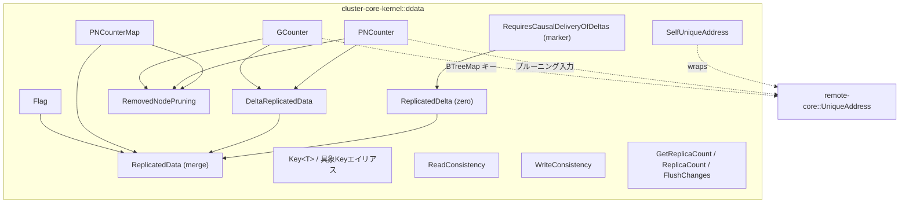
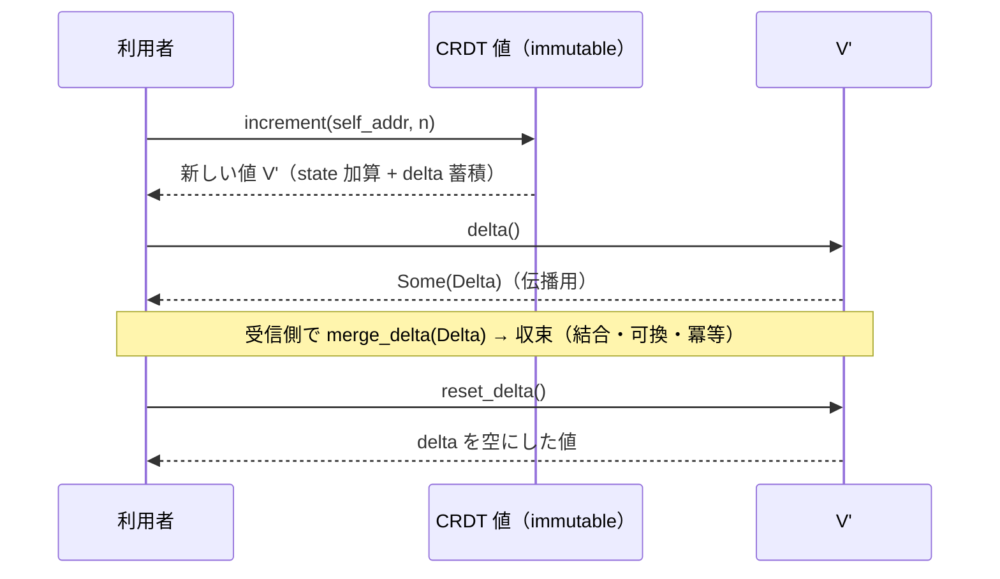

# 設計ドキュメント

## 概要

**Purpose（目的）**: Distributed Data / CRDT のデータ型語彙を `cluster-core-kernel` に先行定義し、Phase 3 の `Replicator` runtime をデータ型設計から切り離せるようにする。

**Users（ユーザー）**: cluster runtime 実装者が、状態ベース収束 CRDT（CvRDT）を一様な基底 SPI 越しに扱い、`Flag` / `GCounter` / `PNCounter` / `PNCounterMap` を merge・delta・プルーニング契約に従って利用するために使う。

**Impact（影響）**: 既存の cluster runtime には影響しない純粋な新規追加。`cluster-core-kernel` に `ddata` モジュールを 1 本増設し、membership / pub_sub などの既存モジュールとは独立した語彙を持ち込む。

### 目標
- 状態ベース収束 CRDT の基底 SPI（merge / delta / ノード除去プルーニング）を trait として定義する。
- 基本 CRDT 型（`Flag` / `GCounter` / `PNCounter` / `PNCounterMap`）を immutable value として実装し、merge 法則を property test で検証する。
- 型付き `Key`、自ノード識別 `SelfUniqueAddress`、read/write 整合性レベル、補助 protocol 語彙を `Replicator` 非依存の純粋な値型として定義する。
- 成功基準: 12 要件すべてが型・trait・テストに対応づき、`no_std` + alloc でコンパイルし、merge の結合・可換・冪等が property test で green。

### 非目標
- `Replicator` runtime / gossip 接続 / `ReplicatorSettings`（Phase 3）。
- `ORSet` / `ORMap` / `ORMultiMap` / `LWWRegister` / `LWWMap` / `VersionVector`（Phase 2）。
- `PNCounterMap` の observed-remove（conflict-free なキー削除）と delta 最適化（`ORMap` delta を要するため Phase 2 へ委譲）。
- `DurableStore`、typed `DistributedData` extension、CRDT の wire serialization。

## 境界コミットメント

### このスペックが所有するもの
- `ddata` モジュールと、その配下の CRDT 基底 SPI（`ReplicatedData` / `DeltaReplicatedData` / `ReplicatedDelta` / `RequiresCausalDeliveryOfDeltas` / `RemovedNodePruning`）。
- 基本 CRDT 値型 `Flag` / `GCounter` / `PNCounter` / `PNCounterMap` の状態表現・操作・merge 法則。
- 型付き `Key<T>` と具象 Key（型エイリアス）、`SelfUniqueAddress` newtype。
- read/write 整合性レベル語彙（`ReadConsistency` / `WriteConsistency`）と補助 protocol 語彙（`GetReplicaCount` / `ReplicaCount` / `FlushChanges`）。

### 境界外
- レプリケーション実行（誰がいつ merge/配送するか）。本スペックは「merge できる値」だけを定義し、merge を駆動しない。
- ノード一意識別子 `UniqueAddress` 型そのものの定義（remote-core が所有）。
- observed-remove / dot / version-vector / tombstone を要する CRDT とその delta。
- CRDT の serialization・整合性レベルの検証（`n >= 2` 等の妥当性判定は将来の `Replicator` が所有）。

### 許可する依存
- `fraktor_remote_core_rs::address::UniqueAddress`（ノード単位状態のキー、プルーニング入力）。
- `alloc`（`BTreeMap` / `BTreeSet` / `String` / `Vec`）と `core`（`time::Duration` / `marker::PhantomData` / `num::NonZeroUsize`）。
- 同一クレート内の他モジュールには依存しない（独立境界）。

### 再検証トリガー
- `ReplicatedData` / `DeltaReplicatedData` / `RemovedNodePruning` のメソッドシグネチャ変更 → 全 CRDT 実装と Phase 2/3 の下流が再検証。
- merge / delta / プルーニングの意味論変更（例: merge の冪等性を崩す変更）→ property test と下流が再検証。
- `SelfUniqueAddress` / `Key<T>` の形状変更 → typed facade・将来の Replicator API が再検証。
- 整合性レベル variant の追加・パラメータ変更 → 将来の `Replicator` 操作 API が再検証。

## アーキテクチャ

### 既存アーキテクチャ分析
- `cluster-core-kernel` は `#![cfg_attr(not(test), no_std)]` + `#![deny(cfg_std_forbid)]` + `extern crate alloc`。トップレベルは全て `pub mod`、`mod.rs` 禁止（`foo.rs` wiring + `foo/` 配下）。
- ノード識別は `fraktor_remote_core_rs::address::UniqueAddress`（`Clone + Eq + Ord + Hash` 導出済み）。`BTreeMap<UniqueAddress, _>` のキーに直接使える。membership は `node_record.unique_address` でこれを参照する。
- 既存値型は `const fn` アクセサ + CQS（更新は新しい値を返す）。内部可変性は使わない。
- property test 基盤（proptest）は cluster-core-kernel に未導入（actor-core-kernel / utils-core にのみ存在）。本スペックで `[dev-dependencies] proptest` を追加する。

### アーキテクチャパターンと境界マップ

**採用パターン**: Trait-based SPI + immutable value types。Pekko の CvRDT 設計（merge ベース）を Rust の所有権モデルへ逆輸入し、内部可変性を持たない純粋な値として表現する。



- ドメイン境界: 「merge できる値の定義」のみを所有し、replication 実行は持たない。
- 維持する既存パターン: 1 公開型 1 ファイル、sibling `_test.rs`、`const fn` + CQS、Pekko 命名優先。
- 新規コンポーネントの根拠: 各 trait/型は 12 要件に 1:1 で対応（要件トレーサビリティ参照）。

### 技術スタック

| レイヤー | 選択／バージョン | 機能内での役割 | メモ |
|-------|------------------|-----------------|-------|
| データ／ストレージ | `alloc::collections::{BTreeMap, BTreeSet}` | ノード単位状態・キー集合の決定的格納 | `HashMap`/`hashbrown` 不使用（順序決定性と no_std のため） |
| ランタイム | `core::time::Duration` / `core::num::NonZeroUsize` / `core::marker::PhantomData` | 整合性レベルのタイムアウト・型タグ | std 非依存 |
| テスト | `proptest`（dev-dependency 追加） | merge 法則の property test | `#[cfg(test)]` 下なので std 可 |

## ファイル構造計画

### ディレクトリ構造
```
modules/cluster-core-kernel/src/
├── ddata.rs                                  # wiring（mod 宣言 + pub use のみ）
└── ddata/
    ├── replicated_data.rs                    # trait ReplicatedData（merge）
    ├── delta_replicated_data.rs              # trait DeltaReplicatedData（delta/merge_delta/reset_delta）
    ├── replicated_delta.rs                   # trait ReplicatedDelta（zero）
    ├── requires_causal_delivery_of_deltas.rs # marker trait
    ├── removed_node_pruning.rs               # trait RemovedNodePruning
    ├── flag.rs                               # Flag（+ flag_test.rs: 法則 property test）
    ├── g_counter.rs                          # GCounter（+ g_counter_test.rs）
    ├── pn_counter.rs                         # PNCounter（+ pn_counter_test.rs）
    ├── pn_counter_map.rs                     # PNCounterMap（+ pn_counter_map_test.rs）
    ├── key.rs                                # Key<T> + 具象Keyエイリアス（+ key_test.rs）
    ├── self_unique_address.rs                # SelfUniqueAddress（+ self_unique_address_test.rs）
    ├── read_consistency.rs                   # enum ReadConsistency
    ├── write_consistency.rs                  # enum WriteConsistency
    ├── get_replica_count.rs                  # struct GetReplicaCount
    ├── replica_count.rs                      # struct ReplicaCount
    └── flush_changes.rs                      # struct FlushChanges
```

各実装ファイルは `#[cfg(test)] #[path = "<name>_test.rs"] mod tests;` で sibling テストを取り込む。trait ファイルと小さな語彙型ファイルにも、契約検証が要る場合のみ `_test.rs` を付ける。

### 変更対象ファイル
- `modules/cluster-core-kernel/src/lib.rs` — `pub mod ddata;` を追加。
- `modules/cluster-core-kernel/Cargo.toml` — `[dev-dependencies]` に `proptest` を追加。

> 具象 Key（`FlagKey` 等）は `pub type FlagKey = Key<Flag>;` の型エイリアスとして `key.rs` に置き、新規の公開型は増やさない（type-per-file-lint は型エイリアスを数えない）。

## 要件トレーサビリティ

| 要件 | 要約 | コンポーネント |
|------|------|----------------|
| 1 | merge 基底契約 | `ReplicatedData` |
| 2 | delta 対応契約 | `DeltaReplicatedData` / `ReplicatedDelta` / `RequiresCausalDeliveryOfDeltas` |
| 3 | ノード除去プルーニング | `RemovedNodePruning` |
| 4 | Flag | `Flag` |
| 5 | GCounter | `GCounter` |
| 6 | PNCounter | `PNCounter` |
| 7 | PNCounterMap（OR 削除は対象外） | `PNCounterMap` |
| 8 | Key / 自ノード識別 | `Key<T>` + 具象エイリアス / `SelfUniqueAddress` |
| 9 | 整合性レベル語彙 | `ReadConsistency` / `WriteConsistency` |
| 10 | 補助 protocol 語彙 | `GetReplicaCount` / `ReplicaCount` / `FlushChanges` |
| 11 | merge 法則 property test | 各 CRDT の `_test.rs` + proptest 戦略 |
| 12 | モジュール境界 / no_std | `ddata.rs` wiring / `lib.rs` / `Cargo.toml` |

## コンポーネントとインターフェース

### 設計判断: merge / 更新 API の形状

CRDT 値は immutable value としてモデル化し、merge・更新は **`&self` を読み取り、新しい `Self` を返す純粋関数** とする（`fn merge(&self, other: &Self) -> Self`、`fn increment(&self, node: &SelfUniqueAddress, n: u64) -> Self`）。

- **CQS 整合**: self を変更しないため、これらは「状態を進めない Query（戻り値あり）」であり CQS に違反しない（`immutability-policy.md` が禁ずる `&self` + 内部可変性ではない。内部可変性は一切使わない）。
- **`&mut self` を採らない理由**: CRDT は「置き換えられる値」であり、複数バージョンの保持・merge を伴う。in-place 変更より新値返却が CRDT 法則の検証（property test）と整合する。
- **`self` 消費を採らない理由**: `&self` 参照受けの方が呼び出し側で両オペランドを保持でき、merge 法則テストで `a.merge(b)` と `b.merge(a)` を同一値に対し評価しやすい。

### 基底 SPI

#### ReplicatedData（要件 1）
```rust
pub trait ReplicatedData: Clone {
  fn merge(&self, other: &Self) -> Self;
}
```
- Preconditions: なし（全域関数）。
- Postconditions: 返り値は `self` と `other` の join。元の値は不変。
- Invariants: 結合則・可換則・冪等性（要件 11 で検証）。Scala の自己参照型メンバ `type T` は Rust の `Self` に対応。

#### DeltaReplicatedData（要件 2）
```rust
pub trait DeltaReplicatedData: ReplicatedData {
  type Delta: ReplicatedDelta;
  fn delta(&self) -> Option<Self::Delta>;
  fn merge_delta(&self, delta: &Self::Delta) -> Self;
  fn reset_delta(&self) -> Self;
}
```
- `delta`: 最後の `reset_delta` 以降に蓄積した差分（無ければ `None`）。
- `merge_delta`: delta を全状態へ統合した新値。Phase 1 の delta 型は `Delta = Self`（`GCounter` / `PNCounter`）であり `merge_delta` は `merge` と一致する。
- `reset_delta`: 蓄積 delta を空にした新値。

#### ReplicatedDelta（要件 2）
```rust
pub trait ReplicatedDelta: ReplicatedData {
  /// 既存状態のないレプリカが delta を受けたときに開始する空の全状態。
  fn zero(&self) -> Self;
}
```
- Phase 1 では `Delta = Full`（同型）であるため `zero` は同型の空値を返す。`Delta != Full`（`ORMap` delta 等）の一般化は Phase 2 へ委譲する。

#### RequiresCausalDeliveryOfDeltas（要件 2）
```rust
pub trait RequiresCausalDeliveryOfDeltas: ReplicatedDelta {}
```
- delta が因果順序配送を要求することを表すマーカ契約。Phase 1 の基本 CRDT はいずれも実装しない（語彙としてのみ公開）。

#### RemovedNodePruning（要件 3）
```rust
pub trait RemovedNodePruning: ReplicatedData {
  fn modified_by_nodes(&self) -> BTreeSet<UniqueAddress>;
  fn need_pruning_from(&self, removed_node: &UniqueAddress) -> bool;
  fn prune(&self, removed_node: &UniqueAddress, collapse_into: &UniqueAddress) -> Self;
  fn pruning_cleanup(&self, removed_node: &UniqueAddress) -> Self;
}
```
- `prune`: 除去ノードの寄与を `collapse_into` へ移した新値。
- `pruning_cleanup`: 除去済みノードの残存エントリを取り除いた新値。

### 基本 CRDT 型

#### Flag（要件 4）
| 項目 | 詳細 |
|------|------|
| 状態 | `enabled: bool` |
| 契約 | `ReplicatedData` のみ（ノード状態・delta なし、プルーニング非対象） |
```rust
pub struct Flag { /* enabled: bool */ }
impl Flag {
  pub const fn disabled() -> Self;
  pub const fn is_enabled(&self) -> bool;
  pub fn switch_on(&self) -> Self;             // 既に有効なら同値
}
// merge: enabled = self.enabled || other.enabled（true が勝つ）
```

#### GCounter（要件 5）
| 項目 | 詳細 |
|------|------|
| 状態 | `state: BTreeMap<UniqueAddress, u64>`, `delta: BTreeMap<UniqueAddress, u64>` |
| 契約 | `ReplicatedData` + `DeltaReplicatedData`(Delta=Self) + `ReplicatedDelta` + `RemovedNodePruning` |
```rust
pub struct GCounter { /* state, delta */ }
impl GCounter {
  pub fn new() -> Self;                                   // 空
  pub fn increment(&self, node: &SelfUniqueAddress, n: u64) -> Self;  // n>=0、自ノードスロット加算 + delta 蓄積
  pub fn value(&self) -> u128;                            // 全スロット合計（オーバーフロー余裕のため u128）
}
// merge: 各 UniqueAddress スロットの最大値、キーの和集合。結果の delta は空。
// delta(): delta が空でなければ Some(GCounter{ state: delta, delta: empty })。
// merge_delta == merge（Delta=Self）。reset_delta: delta を空にした値。
// modified_by_nodes: state のキー集合。prune: state[removed] を collapse_into へ加算し removed を除去。
```
- 負の増分は型（`u64`）で排除する（要件 5.2）。

#### PNCounter（要件 6）
| 項目 | 詳細 |
|------|------|
| 状態 | `increments: GCounter`, `decrements: GCounter` |
| 契約 | `ReplicatedData` + `DeltaReplicatedData`(Delta=Self) + `ReplicatedDelta` + `RemovedNodePruning` |
```rust
pub struct PNCounter { /* increments, decrements */ }
impl PNCounter {
  pub fn new() -> Self;
  pub fn increment(&self, node: &SelfUniqueAddress, n: u64) -> Self;  // P 成分へ
  pub fn decrement(&self, node: &SelfUniqueAddress, n: u64) -> Self;  // N 成分へ
  pub fn value(&self) -> i128;                                        // P.value - N.value
}
// merge: increments.merge / decrements.merge を独立適用。
// delta / プルーニングは内部 2 GCounter へ委譲。
```

#### PNCounterMap（要件 7）
| 項目 | 詳細 |
|------|------|
| 状態 | `entries: BTreeMap<K, PNCounter>`（`K: Ord + Clone`） |
| 契約 | `ReplicatedData` + `RemovedNodePruning`（observed-remove・delta は **非対象**） |
```rust
pub struct PNCounterMap<K: Ord + Clone> { /* entries */ }
impl<K: Ord + Clone> PNCounterMap<K> {
  pub fn new() -> Self;
  pub fn increment(&self, node: &SelfUniqueAddress, key: K, n: u64) -> Self;
  pub fn decrement(&self, node: &SelfUniqueAddress, key: K, n: u64) -> Self;
  pub fn get(&self, key: &K) -> Option<i128>;
}
// merge: キー集合の和、同一キーは PNCounter merge。
// modified_by_nodes / prune / pruning_cleanup: 各 entry の PNCounter へ委譲。
```
- **境界**: observed-remove（並行更新で復活し得る conflict-free な `remove`）は提供しない。キー集合は grow-only union として扱う。conflict-free 削除は `VersionVector` / `ORMap` を要するため Phase 2 の OR/LWW スペックへ委譲する（要件 7.5）。Phase 1 では delta も持たない（`DeltaReplicatedData` を実装しない）。

### 識別子と Key（要件 8）

#### Key<T>
```rust
pub struct Key<T> { /* id: String, _marker: PhantomData<fn() -> T> */ }
impl<T> Key<T> {
  pub fn new(id: impl Into<String>) -> Self;
  pub fn id(&self) -> &str;
}
// PartialEq/Eq/Hash は id のみで判定（T は phantom、型に依らず id 一致で等価）。
pub type FlagKey = Key<Flag>;
pub type GCounterKey = Key<GCounter>;
pub type PNCounterKey = Key<PNCounter>;
pub type PNCounterMapKey<K> = Key<PNCounterMap<K>>;
```

#### SelfUniqueAddress
```rust
pub struct SelfUniqueAddress { /* unique_address: UniqueAddress */ }
impl SelfUniqueAddress {
  pub const fn new(unique_address: UniqueAddress) -> Self;
  pub const fn unique_address(&self) -> &UniqueAddress;
}
```
- カウンタ更新が自ノードを暗黙のグローバル状態ではなく明示引数として受け取るための newtype（要件 8.4）。

### 整合性レベル語彙（要件 9）
```rust
pub enum ReadConsistency {
  Local,
  From { n: usize, timeout: Duration },
  Majority { timeout: Duration, min_cap: usize },
  MajorityPlus { timeout: Duration, additional: usize, min_cap: usize },
  All { timeout: Duration },
}
pub enum WriteConsistency {
  Local,
  To { n: usize, timeout: Duration },
  Majority { timeout: Duration, min_cap: usize },
  MajorityPlus { timeout: Duration, additional: usize, min_cap: usize },
  All { timeout: Duration },
}
```
- 純粋な値型。`n >= 2` 等の妥当性検証は将来の `Replicator` が所有し、本スペックでは語彙のみ（要件 9.5）。`Duration` は `core::time::Duration`。

### 補助 protocol 語彙（要件 10）
```rust
pub struct GetReplicaCount;                 // レプリカ数問い合わせ
pub struct ReplicaCount { /* n: usize */ }  // 自ノードを含むレプリカ数
impl ReplicaCount { pub const fn new(n: usize) -> Self; pub const fn get(&self) -> usize; }
pub struct FlushChanges;                     // 購読者通知の即時フラッシュ
```
- いずれも `Replicator` runtime 非依存の純粋な語彙型（要件 10.4）。

## データモデル

- **GCounter / PNCounter の per-node 状態**: `BTreeMap<UniqueAddress, u64>`。merge は per-node 最大（join-semilattice）。`u64` per-node、合計は `u128`（`GCounter`）/ `i128`（`PNCounter`）でオーバーフロー余裕を持たせ、`alloc`-only で bignum 依存を避ける。
- **不変条件**: GCounter の各スロットは単調増加（grow-only）。Flag は false→true の一方向。これらが merge の単調性・冪等性を保証する。
- **決定性**: `BTreeMap`/`BTreeSet` により反復順序が決定的で、merge 結果と property test が再現可能。

## システムフロー



- プルーニングフロー: ノード除去確定後、`need_pruning_from(removed)` が真の値に `prune(removed, collapse_into)` を適用し、クラスタ全体で確定後に `pruning_cleanup(removed)` で残存を除去する（実行主体は本スペック外）。

## エラーハンドリング

- CRDT 操作は全域関数であり、ユーザー／システムエラーは発生しない。負の増分は型（`u64`）で排除する。
- `value()` のオーバーフローは `u128` / `i128` の採用で現実的範囲を超える。境界超過は将来の bignum 化で対応（本スペックでは非目標）。

## テスト戦略

### Unit Tests
- `Flag`: 初期 false、`switch_on` で true、merge で true 優先（要件 4.1–4.3）。
- `Key`: 同一 id・異なる型パラメータで等価、id 取得（要件 8.1–8.2）。
- `SelfUniqueAddress`: `UniqueAddress` 往復（要件 8.4）。
- `ReadConsistency` / `WriteConsistency`: 各 variant 構築とパラメータ保持（要件 9.1–9.4）。
- 補助 protocol: `ReplicaCount` の値保持、unit 型の存在（要件 10.1–10.3）。

### Property Tests（proptest、要件 11）
- 各 CRDT（`Flag` / `GCounter` / `PNCounter` / `PNCounterMap`）に対し、ランダムな `(UniqueAddress, 操作)` 列から生成した値で:
  - 可換則: `a.merge(b) == b.merge(a)`
  - 結合則: `a.merge(b.merge(c)) == a.merge(b).merge(c)`
  - 冪等性: `a.merge(a) == a`
- delta 対応 CRDT（`GCounter` / `PNCounter`）: `base.merge_delta(d) == base.merge(full_with_d)`（要件 11.4）。
- 戦略: 少数（2–4）の固定 `UniqueAddress` 集合上で増減操作列を生成し、`BTreeMap` の決定性を利用して値等価を比較する。

### Integration / no_std
- `cluster-core-kernel` の `no-std` ビルドが `ddata` 追加後も通ること（要件 12.2）。
- `cfg-std-forbid` / type-per-file / mod-file / ambiguous-suffix 等の dylint が green（要件 12）。
