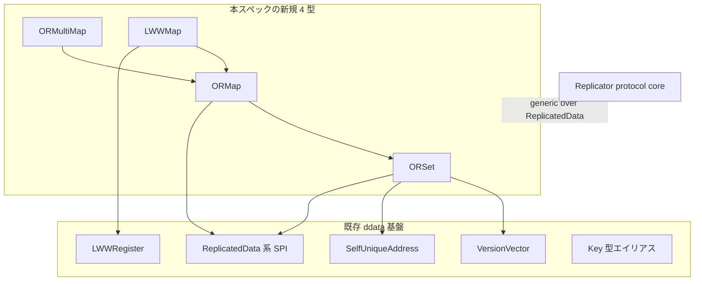

# 技術設計

## 概要

**Purpose（目的）**: 本機能は cluster の Distributed Data 利用者に、複数ノードで並行更新しても収束する observed-remove 系コレクション（`ORSet` / `ORMap` / `ORMultiMap` / `LWWMap`）を提供する。

**Users（ユーザー）**: cluster 上で共有状態を扱う利用者が、集合・キー付きマップ・多値マップ・キー単位 last-writer-wins マップを、既存 CRDT 基盤と同じ契約で利用する。

**Impact（影響）**: 現状 scalar 系 CRDT（`Flag` / `GCounter` / `PNCounter` / `PNCounterMap`）と `VersionVector` / `LWWRegister` のみの `ddata` モジュールに、Pekko parity（gap analysis カテゴリ9）で要求される観測除去コレクションを追加する。Replicator protocol core は generic（`D: ReplicatedData`）であり、変更せず新型を受け入れる。

### 目標
- `ORSet`（add-wins）/ `ORMap`（値 CRDT 再帰併合）/ `ORMultiMap`（多値）/ `LWWMap`（キー単位 LWW）を Pekko の収束規則に準拠して実装する。
- 4 型すべてが既存 CRDT 基底 SPI（`ReplicatedData` / `DeltaReplicatedData` / `RemovedNodePruning` / `RequiresCausalDeliveryOfDeltas`）に適合し、Replicator protocol へ変更なしで流せる。
- CRDT 則（可換律・結合律・冪等律）、差分 = 全状態併合の一致、退役ノード pruning の因果保存を property test で担保する。

### 非目標
- `Replicator` / `ReplicatorSettings` 実行体、`DistributedData` extension（classic / typed）、`ReplicatorMessageAdapter`、`DurableStore` SPI と std adapter（すべて Phase 3）。
- typed 層・std 層への新規 API 追加。
- `ORMultiMap` の `withValueDeltas` 差分最適化モード（収束結果は同一で、差分効率のみの最適化。将来の別変更へ繰り越す）。

## 境界コミットメント

### このスペックが所有するもの
- 公開型 `ORSet<A>` / `ORMap<K, V>` / `ORMultiMap<K, V>` / `LWWMap<K, V>` と、その公開操作・収束（merge）契約。
- 上記 4 型の `ReplicatedData` / `DeltaReplicatedData` / `RemovedNodePruning` / `RequiresCausalDeliveryOfDeltas` 実装。
- `VersionVector::subtract_dots`（ORSet の観測差分に使う因果プリミティブの新規メソッド）。
- `LWWRegister<T>` の `RemovedNodePruning` 実装（`LWWMap` の値型 pruning に必要）。
- `ddata/key.rs` への type alias 追加（`ORSetKey` / `ORMapKey` / `ORMultiMapKey` / `LWWMapKey`）。

### 境界外
- Replicator runtime（複製ループ、write/read repair、差分伝播の実行体）。
- `DistributedData` extension / typed adapter / `ReplicatorMessageAdapter` / `DurableStore` SPI / durable std adapter。
- Replicator protocol core（`Get` / `Update` / `Delete` / `Subscribe`）の変更（generic のため変更不要）。
- typed 層（`cluster-core-typed`）・std 層（`cluster-adaptor-std`）への追加。
- `ORMultiMap` の `withValueDeltas` モード。

### 許可する依存
- 既存基底 SPI: `ddata/replicated_data.rs`, `delta_replicated_data.rs`, `replicated_delta.rs`, `requires_causal_delivery_of_deltas.rs`, `removed_node_pruning.rs`。
- 既存プリミティブ: `ddata/version_vector.rs`（`VersionVector`）、`ddata/lww_register.rs`（`LWWRegister`）、`ddata/self_unique_address.rs`（`SelfUniqueAddress`）、`ddata/key.rs`（`Key`）、`membership` の `UniqueAddress`。
- `alloc`（`BTreeMap` / `BTreeSet` / `Vec`）。`core::convert::Infallible`。
- 依存方向: 基底 SPI・プリミティブ → `ORSet` → `ORMap` →（`ORMultiMap` / `LWWMap`）。左方向のみ参照し、逆方向参照は禁止。

### 再検証トリガー
- 基底 SPI（`ReplicatedData` / `DeltaReplicatedData` / `RemovedNodePruning`）のシグネチャ変更。
- `VersionVector` / `LWWRegister` / `SelfUniqueAddress` の公開契約変更。
- Replicator protocol core が `D: ReplicatedData` 以外の境界を要求するようになった場合。
- `UniqueAddress` の順序・等価性セマンティクスの変更（LWWMap の tie-break と ORSet の dot に影響）。

## アーキテクチャ

### 既存アーキテクチャ分析
- `ddata` は `*-core-kernel`（no_std + `alloc`）に属し、全 CRDT は `&self` → 新インスタンスのイミュータブル更新で実装される（内部可変性なし、CQS 準拠）。
- `PNCounterMap` が observed-remove map の前例で、per-key の `BTreeMap<UniqueAddress, u64>`（dots / removed_dots / removed_values）と delta バッファで因果的 tombstone を表現する。本設計はこの構造パターンを踏襲する。
- 構造 lint（1 ファイル 1 公開型 / `mod.rs` 禁止 / sibling `*_test.rs` / 親モジュールのバレル再エクスポート禁止）と `cfg_std_forbid`（no_std）を維持する。

### アーキテクチャパターンと境界マップ

採用パターン: **層化合成（layered composition）**。`ORSet` を観測除去の dot 基盤とし、`ORMap` がキー集合に `ORSet` を内包、`ORMultiMap` と `LWWMap` は `ORMap` の特殊化（値型固定）として薄く構成する。Pekko の `ORMap` が `ORSet` を内包する層構成に一致する。



**主要な設計判断**:
- **dot 基盤**: `ORSet` は per-element の dot を `VersionVector`（`Dot = VersionVector`、Pekko 同形）で持ち、観測差分に `VersionVector::subtract_dots` を新設して使う。因果プリミティブを `VersionVector` に集約し、ORSet を集合セマンティクスに専念させる（research Option A を採用）。
- **層化合成**: `ORMap<K, V>` はキー集合 `ORSet<K>` + 値 `BTreeMap<K, V>` で構成。`ORMultiMap<K, V>` = `ORMap<K, ORSet<V>>`、`LWWMap<K, V>` = `ORMap<K, LWWRegister<V>>` の内包合成（research Option C）。
- **`PruneError` 戦略**: `ORSet` / `LWWMap` / `ORMultiMap` は整数演算を持たないため `type PruneError = core::convert::Infallible`。`ORMap<K, V>` は `where V: RemovedNodePruning` の条件付き実装で `type PruneError = V::PruneError` を伝播する。
- **ORMap 値型安全性**: `put`（値の完全置換、因果履歴を保持しない）と `update`（値 CRDT の merge 更新）を分離。観測除去集合を値にする場合は `ORMultiMap` を使う契約を rustdoc で明示（Pekko の実行時例外に対応する静的 marker trait は導入しない＝簡素化）。
- **remove の node 不要**: `ORSet::remove` / `ORMap::remove` は既存 `PNCounterMap::remove(&self, key)` の在リポ慣行に合わせ node 引数を取らない（観測済み dot を removed 側へ記録する方式）。add 系は dot 採番のため `SelfUniqueAddress` を取る。

### 技術スタック

| レイヤー | 選択／バージョン | 機能内での役割 | メモ |
|-------|------------------|-----------------|-------|
| データ／ロジック | Rust 2024 / no_std + `alloc` | CRDT 型の状態・収束ロジック | `BTreeMap` / `BTreeSet` を使用、`std` 非依存 |
| テスト | 既存 `proptest` dev 依存（`cluster-ddata-core-types` で導入済み） | CRDT 則の property test | 新規依存追加なし |

> 新規ランタイム依存は追加しない。`proptest` は dev-dependency として既存導入分を再利用する。

## ファイル構造計画

### ディレクトリ構造
```
modules/cluster-core-kernel/src/ddata/
├── or_set.rs              # ORSet<A>: add-wins 観測除去集合（dot 基盤）
├── or_set_test.rs         # sibling テスト + property test
├── or_map.rs              # ORMap<K,V>: キー観測除去 + 値 CRDT 再帰併合
├── or_map_test.rs
├── or_multimap.rs         # ORMultiMap<K,V>: ORMap<K, ORSet<V>> 合成
├── or_multimap_test.rs
├── lww_map.rs             # LWWMap<K,V>: ORMap<K, LWWRegister<V>> 合成
└── lww_map_test.rs
```

### 変更対象ファイル
- `modules/cluster-core-kernel/src/ddata.rs` — 新 4 型の `mod` 宣言と最小 `pub use` を追加（バレル集約しない）。
- `modules/cluster-core-kernel/src/ddata/key.rs` — `ORSetKey<E>` / `ORMapKey<K,V>` / `ORMultiMapKey<K,V>` / `LWWMapKey<K,V>` の type alias を追加（既存の複数 alias 同居前例に倣う付随物）。
- `modules/cluster-core-kernel/src/ddata/version_vector.rs` — `subtract_dots` メソッドを追加（既存メソッドは不変更）。
- `modules/cluster-core-kernel/src/ddata/version_vector_test.rs` — `subtract_dots` のテストを追加。
- `modules/cluster-core-kernel/src/ddata/lww_register.rs` — `RemovedNodePruning` 実装を追加（`LWWMap` 値型 pruning に必要）。
- `modules/cluster-core-kernel/src/ddata/lww_register_test.rs` — pruning テストを追加。

> 各ファイルは 1 公開型に対応（type-per-file-lint）。`type Delta = Self` のため Delta 専用ファイルは不要。dot 差分ヘルパは `VersionVector` に集約するため ORSet 内に補助公開型を作らない。

## 要件トレーサビリティ

| 要件 | 要約 | コンポーネント | 主要インターフェース／契約 |
|------|------|----------------|----------------------------|
| 1.1–1.6 | ORSet add-wins / 観測除去 / 収束 | `ORSet` | `add` / `remove` / `contains` / `elements` / `ReplicatedData::merge` |
| 2.1–2.7 | ORMap キー観測除去 / 値再帰併合 / put-update 分離 | `ORMap` | `put` / `update` / `remove` / `get` / `entries` / `merge` |
| 3.1–3.5 | ORMultiMap 多値 / 空集合キー除去 | `ORMultiMap` | `add_binding` / `remove_binding` / `get` / `entries` / `merge` |
| 4.1–4.7 | LWWMap キー単位 LWW / tie-break | `LWWMap` | `put` / `put_with_clock` / `remove` / `get` / `entries` / `merge` |
| 5.1 | 基底契約適合 | 全 4 型 | `impl ReplicatedData` |
| 5.2, 5.4 | 差分 = 全状態併合 / 因果配送前提 | 全 4 型 | `impl DeltaReplicatedData`（`type Delta = Self`）, `RequiresCausalDeliveryOfDeltas` |
| 5.3 | 退役ノード pruning | 全 4 型 + `LWWRegister` | `impl RemovedNodePruning`, `VersionVector` pruning |
| 6.1 | イミュータブル更新 | 全 4 型 | `&self -> Self`、内部可変性なし |
| 6.2 | no_std / 構造 lint | `ddata.rs` 配線 + 各ファイル | type-per-file / mod.rs 禁止 / sibling test / 最小 `pub use` |
| 6.3 | CRDT 則（可換・結合・冪等） | 全 4 型 | property test |
| 6.4 | 既存 SPI 再利用（基盤型を新設しない） | 全 4 型 | 既存 SPI / `VersionVector` / `LWWRegister` を import |

## コンポーネントとインターフェース

| コンポーネント | レイヤー | 意図 | 要件 | 主要依存 | 契約 |
|----------------|----------|------|------|----------|------|
| `ORSet<A>` | ddata / core-kernel | add-wins 観測除去集合・dot 基盤 | 1.1–1.6, 5, 6 | `VersionVector` (P0), 基底 SPI (P0) | State |
| `ORMap<K,V>` | ddata / core-kernel | キー観測除去 + 値 CRDT 再帰併合 | 2.1–2.7, 5, 6 | `ORSet` (P0), 基底 SPI (P0) | State |
| `ORMultiMap<K,V>` | ddata / core-kernel | 多値バインディング | 3.1–3.5, 5, 6 | `ORMap` (P0), `ORSet` (P0) | State |
| `LWWMap<K,V>` | ddata / core-kernel | キー単位 last-writer-wins | 4.1–4.7, 5, 6 | `ORMap` (P0), `LWWRegister` (P0) | State |
| `VersionVector::subtract_dots` | ddata / core-kernel | 観測差分の因果プリミティブ | 1.3, 1.4, 5.3 | `VersionVector` (P0) | Service |
| `LWWRegister: RemovedNodePruning` | ddata / core-kernel | LWWMap 値型 pruning | 5.3 | `UniqueAddress` (P0) | State |

> 全コンポーネントは State 契約（CRDT 状態 + 収束）。以下に Rust シグネチャ（契約レベル、実装本体は含めない）と pre/post/invariant を示す。`A: Clone + Ord` / `K: Clone + Ord` / `V: ReplicatedData`（ORMap）等の境界は各型で明示する。

### ddata / core-kernel

#### `ORSet<A>`

| 項目 | 詳細 |
|------|------|
| 意図 | add-wins 観測除去集合。per-element dot で並行 add/remove を因果解決 |
| 要件 | 1.1–1.6, 5.1–5.4, 6.1–6.4 |

**責務と制約**
- 並行 add と remove では add を保持（add-wins）。remove は削除時点で観測済みの dot のみ取り消す。remove 後の再 add は新 dot で生存。
- データ所有: 自身の要素集合と per-element dot、全体 vvector。不変条件: 可視要素 ⇔ 当該要素の dot が空でない。

**契約種別**: State [x]

##### 公開インターフェース（契約）
```rust
impl<A: Clone + Ord> ORSet<A> {
    pub fn new() -> Self;
    pub fn add(&self, node: &SelfUniqueAddress, element: A) -> Self;   // 1.1
    pub fn remove(&self, element: &A) -> Self;                          // 1.2（node 不要、観測済み dot を記録）
    pub fn clear(&self) -> Self;                                        // 全削除（Pekko parity）
    pub fn contains(&self, element: &A) -> bool;                        // 1.5
    pub fn elements(&self) -> BTreeSet<A>;                              // 1.5
    pub fn len(&self) -> usize;
    pub fn is_empty(&self) -> bool;
}
// 1.3, 1.4, 1.6, 5.1: impl ReplicatedData for ORSet<A> { fn merge(&self, other: &Self) -> Self }
// 5.2, 5.4: impl DeltaReplicatedData (type Delta = Self) + RequiresCausalDeliveryOfDeltas
// 5.3: impl RemovedNodePruning (type PruneError = core::convert::Infallible)
```
- Preconditions: `add` は有効な `SelfUniqueAddress` を要する。
- Postconditions: `add(n, e)` 後 `contains(e)` が真。`remove(e)` 後、並行 add がなければ `contains(e)` が偽。`merge` は可換・結合・冪等。
- Invariants: `&self` のみ（新インスタンス返却、内部可変性なし）。merge は add-wins。

#### `ORMap<K, V>`

| 項目 | 詳細 |
|------|------|
| 意図 | キーを観測除去（`ORSet<K>`）で追跡し、値を CRDT として再帰併合 |
| 要件 | 2.1–2.7, 5.1–5.4, 6.1–6.4 |

**責務と制約**
- キー集合は add-wins。同一キーの並行 `update` は値 `V::merge` で収束。`remove` と他ノードの並行 `update` が競合した場合はキーを保持。
- `put` は値を完全置換し因果履歴を保持しない。観測除去集合を値にする用途は `ORMultiMap` を使う（rustdoc で明示）。

**契約種別**: State [x]

##### 公開インターフェース（契約）
```rust
impl<K: Clone + Ord, V: ReplicatedData> ORMap<K, V> {
    pub fn new() -> Self;
    pub fn put(&self, node: &SelfUniqueAddress, key: K, value: V) -> Self;   // 2.1（置換）
    pub fn update(&self, node: &SelfUniqueAddress, key: K, initial: V,
                  modify: impl FnOnce(&V) -> V) -> Self;                      // 2.4（既存値 or 初期値に適用）
    pub fn remove(&self, key: &K) -> Self;                                    // 2.3（node 不要）
    pub fn get(&self, key: &K) -> Option<&V>;                                 // 2.6
    pub fn entries(&self) -> &BTreeMap<K, V>;                                 // 2.6
    pub fn contains_key(&self, key: &K) -> bool;
    pub fn len(&self) -> usize;
    pub fn is_empty(&self) -> bool;
}
// 2.2, 2.7, 5.1: impl ReplicatedData（キー ORSet 併合 + 値 V::merge）
// 5.2, 5.4: impl DeltaReplicatedData (type Delta = Self) + RequiresCausalDeliveryOfDeltas
// 5.3: impl RemovedNodePruning for ORMap<K,V> where V: RemovedNodePruning { type PruneError = V::PruneError }
```
- Preconditions: `update`/`put` は有効な `SelfUniqueAddress` を要する。
- Postconditions: 同一キー並行 `update` → 値は `V::merge` で収束。`remove(k)` と並行 `update(k)` → `merge` 後にキー存続。`merge` は可換・結合・冪等。
- Invariants: `&self` のみ。キー集合は add-wins。`put` は履歴非保持（契約として明示）。

#### `ORMultiMap<K, V>`

| 項目 | 詳細 |
|------|------|
| 意図 | 1 キーに複数値（内部 `ORMap<K, ORSet<V>>`）。空集合キーは可視除去 |
| 要件 | 3.1–3.5, 5.1–5.4, 6.1–6.4 |

**契約種別**: State [x]

##### 公開インターフェース（契約）
```rust
impl<K: Clone + Ord, V: Clone + Ord> ORMultiMap<K, V> {
    pub fn new() -> Self;
    pub fn add_binding(&self, node: &SelfUniqueAddress, key: K, element: V) -> Self;       // 3.1
    pub fn remove_binding(&self, node: &SelfUniqueAddress, key: &K, element: &V) -> Self;  // 3.2
    pub fn get(&self, key: &K) -> Option<BTreeSet<V>>;                                     // 3.4
    pub fn entries(&self) -> BTreeMap<K, BTreeSet<V>>;                                     // 3.4
    pub fn contains_key(&self, key: &K) -> bool;
    pub fn len(&self) -> usize;
    pub fn is_empty(&self) -> bool;
}
// 3.3, 3.5, 5.1: impl ReplicatedData（内部 ORMap へ委譲）
// 5.2, 5.4: impl DeltaReplicatedData (type Delta = Self) + RequiresCausalDeliveryOfDeltas
// 5.3: impl RemovedNodePruning (type PruneError = core::convert::Infallible)
```
- Postconditions: `remove_binding` で値集合が空になったキーは `entries`/`get` から不可視。同一キー同一要素の並行 add/remove は add-wins。`merge` は可換・結合・冪等。
- Invariants: `&self` のみ。内部 `ORMap<K, ORSet<V>>` に委譲。`remove_binding` は内部 `ORMap::update`（node 採番）で値 ORSet を更新し、空なら `ORMap::remove`。

#### `LWWMap<K, V>`

| 項目 | 詳細 |
|------|------|
| 意図 | キー単位 last-writer-wins（内部 `ORMap<K, LWWRegister<V>>`） |
| 要件 | 4.1–4.7, 5.1–5.4, 6.1–6.4 |

**契約種別**: State [x]

##### 公開インターフェース（契約）
```rust
impl<K: Clone + Ord, V: Clone> LWWMap<K, V> {
    pub fn new() -> Self;
    pub fn put(&self, node: &SelfUniqueAddress, key: K, value: V,
               current_time_millis: i64) -> Self;                              // 4.1（default_clock）
    pub fn put_with_clock(&self, node: &SelfUniqueAddress, key: K, value: V,
                          clock: impl FnOnce(i64, &V) -> i64) -> Self;          // 4.5（clock 透過）
    pub fn remove(&self, key: &K) -> Self;                                      // 4.4
    pub fn get(&self, key: &K) -> Option<&V>;                                   // 4.6
    pub fn entries(&self) -> BTreeMap<K, V>;                                    // 4.6
    pub fn contains_key(&self, key: &K) -> bool;
    pub fn len(&self) -> usize;
    pub fn is_empty(&self) -> bool;
}
// 4.2, 4.3, 4.7, 5.1: impl ReplicatedData（内部 ORMap へ委譲、値は LWWRegister::merge）
// 5.2, 5.4: impl DeltaReplicatedData (type Delta = Self) + RequiresCausalDeliveryOfDeltas
// 5.3: impl RemovedNodePruning (type PruneError = core::convert::Infallible)
```
- Postconditions: 同一キー並行 put → 大きい timestamp の値を保持（4.2）、同値 timestamp は `UniqueAddress` 昇順で小さいノードの値（4.3）。`merge` は可換・結合・冪等。
- Invariants: `&self` のみ。値の LWW 解決は `LWWRegister::merge` に委譲。`get` は内部 `LWWRegister` の値参照を返す。

#### `VersionVector::subtract_dots`（既存型への追加）
```rust
impl VersionVector {
    /// Returns the dots present in `self` that are not observed by `vvector`.
    pub fn subtract_dots(&self, vvector: &VersionVector) -> VersionVector;   // 1.3, 1.4, 5.3
}
```
- Postconditions: 結果 ⊆ `self`。結果の各 `(n, v)` は `vvector.version_at(n) < v`。
- Invariants: pure（`&self`、新インスタンス）。既存メソッドは不変更。

#### `LWWRegister<T>: RemovedNodePruning`（既存型への追加）
- `modified_by_nodes` = `{ updated_by }`、`need_pruning_from(n)` = `updated_by == n`、`prune(removed, collapse)` = `updated_by == removed` なら `updated_by` を `collapse` に置換した新値、それ以外は self。`type PruneError = core::convert::Infallible`。要件 5.3。

## データモデル

### 内部構造（論理）

各型は `PNCounterMap` のパターン（per-key dot map + tombstone + delta バッファ）を踏襲する。実フィールド構成は実装時に確定するが、論理モデルは以下。

- **`ORSet<A>`**: 可視要素ごとの dot（`BTreeMap<A, VersionVector>`）+ 全体因果文脈 `VersionVector` + delta バッファ。要素の生存は dot の非空で表す。
- **`ORMap<K, V>`**: キー集合 `ORSet<K>` + 値 `BTreeMap<K, V>` + delta バッファ。キーの生存は内包 `ORSet<K>` が所有し、値は併合時に `V::merge`。
- **`ORMultiMap<K, V>`**: 内部 `ORMap<K, ORSet<V>>` 単一フィールドの newtype 合成。可視判定は値 `ORSet` が非空のキーのみ。
- **`LWWMap<K, V>`**: 内部 `ORMap<K, LWWRegister<V>>` 単一フィールドの newtype 合成。

### 整合性
- すべて状態ベース収束 CRDT。トランザクション境界なし（純データ型）。
- delta は `type Delta = Self`（自己参照）。`delta()` は未変更で `None`、`reset_delta()` は delta バッファを空にした新インスタンス。差分適用結果は全状態併合と一致する（5.2）。

## エラーハンドリング

### エラー戦略
- 4 型の操作は整数オーバーフロー等の失敗を持たないため、公開操作は `Result` を返さず常に `Self` を返す（`PNCounterMap` が `i128` 演算のため `Result` を返すのとは異なる）。
- `RemovedNodePruning::prune` の戻り値型: `ORSet` / `ORMultiMap` / `LWWMap` は `type PruneError = core::convert::Infallible`（失敗不能）。`ORMap<K, V>` は `type PruneError = V::PruneError` を伝播し、値型が失敗しうる場合のみ `Err` を返す。
- 戻り値の握りつぶし禁止（`.agents/rules/ignored-return-values.md`）: `Infallible` の `Result` は `?` で展開し握りつぶさない。

### 監視
- 純データ型のためログ/メトリクスは持たない（cluster runtime 側の責務）。

## テスト戦略

受け入れ基準から導出する。各テストは sibling `*_test.rs` に配置（tests-location-lint）。property test は既存 `proptest` を再利用。

### Unit Tests
- `ORSet`: 並行 add/remove で add-wins（1.3）、remove 後 re-add の生存（1.4）、`contains`/`elements` の整合（1.5）。
- `ORMap`: 同一キー並行 update の値 merge 収束（2.2）、remove vs 並行 update のキー存続（2.3）、`update` の初期値適用（2.4）、`put` 置換と `get`/`entries`（2.1, 2.6）。
- `ORMultiMap`: `remove_binding` で空集合キーが不可視（3.2）、同一キー同一要素の並行 add/remove で add-wins（3.3）。
- `LWWMap`: 大きい timestamp 勝ち（4.2）、同値 timestamp の `UniqueAddress` tie-break（4.3）、remove vs 並行 put のキー存続（4.4）。
- `VersionVector::subtract_dots`: 観測差分の正当性（結果 ⊆ self、各 dot が vvector 未観測）。
- `LWWRegister` pruning: `updated_by` が退役ノードのとき collapse 先へ置換（5.3）。

### Property Tests（6.3, 5.2）
- 各型: `merge` の可換律（`a.merge(b) == b.merge(a)`）、結合律（`(a.merge(b)).merge(c) == a.merge(b.merge(c))`）、冪等律（`a.merge(a) == a`）。
- 各型: 差分適用 = 全状態併合の一致（`reset` 後の一連の delta 適用結果が full merge と一致）（5.2）。
- 各型: 退役ノード pruning の因果保存（prune 前後で退役ノード以外の観測結果が不変）（5.3）。

### Integration / 構造検証（6.2, 6.4）
- no_std ビルド通過（`./scripts/ci-check.sh no-std` 相当）。
- 構造 lint（type-per-file / mod-file / tests-location / use-placement / redundant-fqcn / rustdoc / module-wiring）通過。
- 既存 SPI / `VersionVector` / `LWWRegister` を再利用し、基盤型を新設していないことを確認（6.4）。
