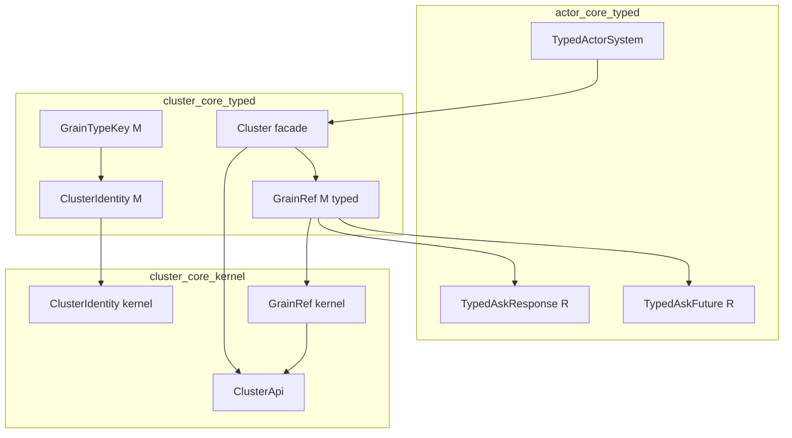
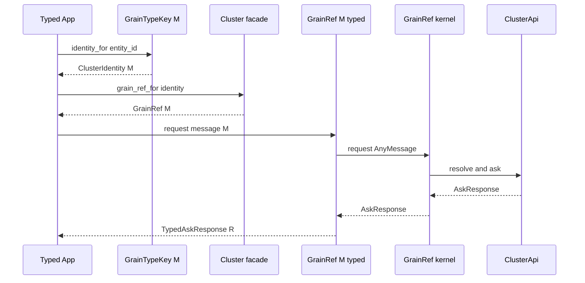

# 技術設計

## 概要

**Purpose（目的）**: この機能は typed actor の利用者に、メッセージ型でパラメータ化された型安全な Grain（virtual actor）参照を提供する。誤った型のメッセージ送信をコンパイル時に拒否し、untyped grain API を直接扱う必要をなくす。

**Users（ユーザー）**: typed actor で grain を呼び出すアプリケーション開発者が、宛先宣言（kind とメッセージ型の紐づけ）→ 参照取得 → tell / request / request_future という型安全なワークフローのために利用する。

**Impact（影響）**: 現在 untyped のみの grain API に対し、`cluster-core-typed` へ薄い typed facade を追加する。kernel（`cluster-core-kernel`）は無変更。actor-core-typed には応答型付け用の公開コンストラクタを2点追加する。

### 目標

- Pekko `EntityTypeKey[M]` / `EntityRef[M]` 相当の typed 宣言点と typed 参照を `cluster-core-typed` に定義する
- tell / request / request_future を型安全に提供し、誤った型の送信をコンパイル時に拒否する
- typed ActorSystem からの取得経路と、untyped API との明示的な相互変換を提供する

### 非目標

- typed behavior factory（Pekko `Entity[M, E]` / `EntityContext` 相当、Phase 2 / medium）
- grain の lifecycle（activation / passivation）・配置決定・message serialization の変更
- `ShardingEnvelope` / extractor SPI（cluster-sharding-extractor-contract が所有）

## 境界コミットメント

### このスペックが所有するもの

- typed 宣言点 `GrainTypeKey<M>`（kind とメッセージ型の紐づけ）の契約
- typed 参照 `GrainRef<M>`（cluster-core-typed）の契約: 型安全な tell / request / request_future、呼び出しオプション・codec のパススルー、識別の参照
- 取得経路: typed `Cluster` facade の `grain_ref_for` と、`GrainTypeKey::identity_for` による typed 識別の導出
- typed ↔ untyped の明示的相互変換 API（`from_kernel` / `as_kernel` / `into_kernel`）
- actor-core-typed の `TypedAskResponse<R>` / `TypedAskFuture<R>` への公開コンストラクタ `from_untyped` の追加（typed facade crate 向けの正規変換点として）

### 境界外

- kernel grain API（`GrainRef` / `GrainKey` / `GrainCodec` / `ClusterApi`）の変更 — 一切変更しない
- grain runtime（activation / passivation / placement / `GrainRpcRouter`）の挙動変更
- message envelope / extractor SPI — cluster-sharding-extractor-contract が所有
- typed behavior factory — Phase 2 の後続 spec が所有
- 「ついでに」既存 typed `Cluster` facade の既存メソッドのシグネチャを変える変更

### 許可する依存

- `cluster-core-typed` → `cluster-core-kernel`（kernel grain API・`ClusterApi`・エラー型の利用）
- `cluster-core-typed` → `actor-core-typed`（`TypedActorRef` / `TypedActorSystem` / `TypedAskResponse` / `TypedAskFuture`）
- `cluster-core-typed` → `actor-core-kernel`（`AnyMessage` / `AskResponse` 等のメッセージ基盤型）
- 依存制約: kernel 側から typed 層への依存を作らない（依存方向は typed → kernel の一方向）

### 再検証トリガー

- kernel `GrainRef` の呼び出しシグネチャ（`request` / `request_future` / `tell_with_sender`）の形状変更
- `ClusterIdentity`（kernel / typed）の識別構成（kind + entity id）の変更
- `TypedAskResponse` / `TypedAskFuture` の応答取り出し契約の変更
- `ClusterApi::try_from_system` の取得経路・エラー契約の変更

## アーキテクチャ

### 既存アーキテクチャ分析

- typed 層は「untyped kernel を `PhantomData` で包む薄い facade」パターンが確立済み（`TypedActorRef<M>`、typed `ClusterIdentity<M>`、`Cluster` facade）
- typed `ClusterIdentity<M>` は kind + entity id の合成識別として既に存在する。本設計はこれを識別の正本として再利用する
- 応答型付け（downcast + `try_unwrap`）は actor-core-typed の `TypedAskFuture<R>` が正本。重複実装を避け、公開コンストラクタ追加で再利用する

### アーキテクチャパターンと境界マップ



**Architecture Integration（アーキテクチャ統合）**:
- 採用パターン: 薄い typed facade（ロジックは kernel、typed 層は型の表明と委譲のみ）
- ドメイン／機能境界: 識別の正本は kernel `ClusterIdentity`、応答型付けの正本は actor-core-typed、本 spec は両者を grain 向けに接続する
- 維持する既存パターン: `PhantomData<fn() -> M>` による contravariant マーカー、`from_kernel` / `as_kernel` / `into_kernel` 変換命名、module-wiring-lint 準拠の lib.rs 配線、sibling `*_test.rs`
- 新規コンポーネントの根拠: `GrainTypeKey<M>` は kind とメッセージ型の対応を一箇所で宣言する Pekko `EntityTypeKey` 相当の最小点。typed `GrainRef<M>` は型安全な呼び出し面の提供点
- ステアリング準拠: `no_std` 境界維持、kernel 無変更（port-and-adapter の依存方向維持）、YAGNI（`get` の typed 化や `From`/`Into` 実装は導入しない）

### 技術スタック

| レイヤー | 選択／バージョン | 機能内での役割 | メモ |
|-------|------------------|-----------------|-------|
| cluster-core-typed | 既存 crate（`no_std` + `alloc`） | typed facade の追加先 | 新規依存なし |
| actor-core-typed | 既存 crate | 応答型付けの再利用元（公開面2点追加） | 新規依存なし |
| cluster-core-kernel | 既存 crate | 委譲先（無変更） | — |

## ファイル構造計画

### ディレクトリ構造

```
modules/cluster-core-typed/src/
├── grain_type_key.rs        # 新規: GrainTypeKey<M>（kind 宣言点）
├── grain_type_key_test.rs   # 新規: sibling テスト
├── grain_ref.rs             # 新規: typed GrainRef<M>（型安全な呼び出し面）
├── grain_ref_test.rs        # 新規: sibling テスト
├── cluster.rs               # 変更: grain_ref_for 追加
└── lib.rs                   # 変更: mod 宣言と pub use の追加
modules/cluster-core-typed/tests/
└── grain.rs                 # 新規: 統合テスト（取得経路と request 往復）
modules/actor-core-typed/src/dsl/
├── typed_ask_response.rs    # 変更: pub fn from_untyped(AskResponse) 追加
└── typed_ask_future.rs      # 変更: pub fn from_untyped(ActorFutureShared<AskResult>) 追加
```

> 1公開型1ファイル（type-per-file-lint）、sibling `*_test.rs`（tests-location-lint）、lib.rs は `mod` + 最小 `pub use`（module-wiring-lint）に準拠する。

## システムフロー



- 失敗系: 識別構築は `ClusterIdentityError`、facade 取得は `ClusterApiError::ExtensionNotInstalled`、呼び出しは `GrainCallError`、応答取り出しは `TypedAskError` をそのまま伝搬する（新規エラー型は導入しない）

## 要件トレーサビリティ

| 要件 | 要約 | コンポーネント | インターフェース | フロー |
|------|---------|------------|------------|-------|
| 1.1 | typed 識別の表現 | GrainTypeKey<M> / ClusterIdentity<M>（既存） | `identity_for` | 取得フロー |
| 1.2 | 不正識別の拒否 | GrainTypeKey<M> | `new` / `identity_for` → `ClusterIdentityError` | — |
| 1.3 | M に依らない同一宛先 | ClusterIdentity<M>（既存）→ kernel 識別 | `into_kernel` | — |
| 2.1 | typed 参照の提供 | GrainRef<M>（typed） | 型定義 | — |
| 2.2 | 誤型のコンパイル時拒否 | GrainRef<M> | `tell_with_sender(M)` / `request(M)` | compile_fail doctest |
| 2.3 | fire-and-forget 送信 | GrainRef<M> | `tell_with_sender` | — |
| 2.4 | 応答待ち呼び出し | GrainRef<M> | `request -> TypedAskResponse<R>` | request フロー |
| 2.5 | 非同期応答呼び出し | GrainRef<M> | `request_future -> TypedAskFuture<R>` | request フロー |
| 2.6 | 失敗種別の区別 | GrainRef<M> | `GrainCallError` / `TypedAskError` 伝搬 | 失敗系 |
| 2.7 | 識別の参照 | GrainRef<M> | `identity()` | — |
| 3.1 | typed システムからの取得 | Cluster facade 拡張 | `Cluster::get` → `grain_ref_for` | 取得フロー |
| 3.2 | 拡張未導入の拒否 | Cluster facade（既存挙動） | `ClusterApiError::ExtensionNotInstalled` | 失敗系 |
| 3.3 | オプション・codec 指定 | GrainRef<M> | `with_options` / `with_codec` | — |
| 4.1 | typed → untyped 変換 | GrainRef<M> | `as_kernel` / `into_kernel` | — |
| 4.2 | untyped → typed 変換 | GrainRef<M> | `from_kernel` | — |
| 4.3 | 暗黙変換の禁止 | GrainRef<M> / GrainTypeKey<M> | `From`/`Into` 非実装 | — |
| 4.4 | 往復での宛先保持 | GrainRef<M> | 変換 API + テスト | — |
| 5.1 | kernel 無変更 | 全体 | cluster-core-kernel に差分なし | — |
| 5.2 | lifecycle/配置の不変 | 全体 | runtime への変更なし | — |
| 5.3 | 隣接責務の不先取り | 全体 | envelope/extractor/factory 非導入 | — |
| 5.4 | 既存 typed facade の維持 | Cluster facade | 既存メソッド無変更（追加のみ） | — |

## コンポーネントとインターフェース

| コンポーネント | ドメイン／レイヤー | 意図 | 要件カバー範囲 | 主要依存 (P0/P1) | 契約 |
|-----------|--------------|--------|--------------|--------------------------|-----------|
| GrainTypeKey<M> | cluster-core-typed | kind とメッセージ型の宣言点 | 1.1, 1.2, 4.3 | ClusterIdentity<M> (P0) | Service |
| GrainRef<M>（typed） | cluster-core-typed | 型安全な grain 呼び出し面 | 1.3, 2.1–2.7, 3.3, 4.1–4.4 | kernel GrainRef (P0), TypedAskResponse/Future (P0) | Service |
| Cluster facade 拡張 | cluster-core-typed | typed システムからの取得経路 | 3.1, 3.2, 5.4 | ClusterApi (P0), GrainRef<M> (P0) | Service |
| TypedAskResponse/Future 公開化 | actor-core-typed | untyped 応答の型付け変換点 | 2.4, 2.5 | AskResponse (P0) | Service |

### cluster-core-typed

#### GrainTypeKey<M>

| 項目 | 詳細 |
|-------|--------|
| 意図 | grain の kind と受信メッセージ型の対応を一箇所で宣言する（Pekko `EntityTypeKey[M]` 相当） |
| 要件 | 1.1, 1.2, 4.3 |

**責務と制約**
- kind 文字列の保持と、entity id を与えた typed 識別（`ClusterIdentity<M>`）の導出のみを担う
- 識別の検証は kernel `ClusterIdentity::new` に委譲し、独自の検証規則を持たない
- `From` / `Into` による暗黙変換は実装しない

**依存**
- 流出: typed `ClusterIdentity<M>`（P0）— 識別の導出先

**契約種別**: Service [x]

##### サービスインターフェース

```rust
pub struct GrainTypeKey<M> {
  kind:     String,
  _message: PhantomData<fn() -> M>,
}

impl<M> GrainTypeKey<M> {
  /// Creates a type key for the given grain kind.
  pub fn new(kind: &str) -> Result<Self, ClusterIdentityError>;
  /// Returns the grain kind name.
  pub fn kind(&self) -> &str;
  /// Derives a typed identity for the given entity id.
  pub fn identity_for(&self, entity_id: &str) -> Result<ClusterIdentity<M>, ClusterIdentityError>;
}
```

- Preconditions: kind / entity id は kernel `ClusterIdentity` の検証規則を満たす（空文字等は `ClusterIdentityError`）
- Postconditions: `identity_for` の結果は `ClusterIdentity::<M>::new(kind, entity_id)` と同値
- Invariants: 同一 kind + entity id の識別は、`M` に依らず kernel 上では同一宛先（1.3）

**Implementation Notes（実装メモ）**
- Validation: `new` の時点で kind 単体の検証を行うため、kernel 検証をダミー entity id で通すのではなく、kind 検証規則を kernel `ClusterIdentityError` の語彙で表現する（実装時に kernel の検証関数の再利用可否を確認し、不可なら `identity_for` まで検証を遅延させ `new` は infallible にしてよい — 契約上の要点は「不正識別が `ClusterIdentityError` で拒否されること」）
- Risks: kind 検証規則が kernel と二重化しないよう、検証は必ず kernel 側 API を経由する

#### GrainRef<M>（typed）

| 項目 | 詳細 |
|-------|--------|
| 意図 | kernel `GrainRef` を包み、型安全な tell / request / request_future を提供する（Pekko `EntityRef[M]` 相当） |
| 要件 | 1.3, 2.1–2.7, 3.3, 4.1–4.4 |

**責務と制約**
- メッセージ構築（`AnyMessage::new`）と応答型付け（`TypedAskResponse` / `TypedAskFuture`）の型の表明のみを担い、呼び出しロジックは kernel に委譲する
- 識別・オプション・codec の状態は kernel `GrainRef` が正本（typed 層は状態を持たない）
- 応答 future は単一消費者前提（`TypedAskError::SharedReferences` の回避）を rustdoc に明記する

**依存**
- 流出: kernel `GrainRef`（P0）— 全呼び出しの委譲先
- 流出: `TypedAskResponse<R>` / `TypedAskFuture<R>`（P0）— 応答型付け
- 流出: `TypedActorRef<S>`（P1）— sender の typed 表現

**契約種別**: Service [x]

##### サービスインターフェース

```rust
pub struct GrainRef<M> {
  inner:    KernelGrainRef,
  _message: PhantomData<fn() -> M>,
}

impl<M: Any + Send + Sync + 'static> GrainRef<M> {
  /// Wraps an untyped grain reference with an asserted message type.
  pub fn from_kernel(inner: KernelGrainRef) -> Self;
  /// Returns the underlying untyped grain reference.
  pub fn as_kernel(&self) -> &KernelGrainRef;
  /// Unwraps into the underlying untyped grain reference.
  pub fn into_kernel(self) -> KernelGrainRef;
  /// Returns the typed identity of this reference.
  pub fn identity(&self) -> ClusterIdentity<M>;
  /// Returns a reference with the given call options applied.
  pub fn with_options(self, options: GrainCallOptions) -> Self;
  /// Returns a reference with the given codec applied.
  pub fn with_codec(self, codec: ArcShared<dyn GrainCodec>) -> Self;
  /// Sends a fire-and-forget message with an explicit sender.
  pub fn tell_with_sender<S>(&self, message: M, sender: &TypedActorRef<S>) -> Result<(), GrainCallError>
  where S: Send + Sync + 'static;
  /// Sends a request and returns a typed response handle.
  pub fn request<R>(&self, message: M) -> Result<TypedAskResponse<R>, GrainCallError>
  where R: Send + Sync + 'static;
  /// Sends a request and returns a typed response future.
  pub fn request_future<R>(&self, message: M) -> Result<TypedAskFuture<R>, GrainCallError>
  where R: Send + Sync + 'static;
}
```

- Preconditions: メッセージは `M`（それ以外はコンパイルエラー）。応答型 `R` は呼び出し側が表明する
- Postconditions: 呼び出し結果・失敗は kernel `GrainRef` と同一（`GrainCallError` をそのまま伝搬）。応答の型不一致は `TypedAskError::TypeMismatch` として取り出し時に判明する
- Invariants: `from_kernel` → `into_kernel` の往復で kernel 参照の識別・オプション・codec は変化しない（4.4）

**Implementation Notes（実装メモ）**
- Integration: rustdoc に compile_fail doctest を置き、`M` 以外の送信が拒否されることをテスト化する（2.2）
- Validation: 往復変換・identity 参照・オプション/codec パススルーは sibling テストで検証
- Risks: 応答型 `R` の表明ミスは実行時（取り出し時）の `TypeMismatch` になる。これは Pekko の `ask` と同等の制約であり、rustdoc に明記する

#### Cluster facade 拡張（grain_ref_for）

| 項目 | 詳細 |
|-------|--------|
| 意図 | typed `Cluster` facade から typed grain 参照を構築する取得経路（Pekko `ClusterSharding#entityRefFor` 相当） |
| 要件 | 3.1, 3.2, 5.4 |

**責務と制約**
- `ClusterApi`（`Clone` 済み）と typed 識別から kernel `GrainRef` を構築し、`GrainRef<M>` として返すだけの合成点
- 拡張未導入の拒否は既存 `Cluster::get`（`ClusterApiError::ExtensionNotInstalled`）の挙動をそのまま利用し、新しい失敗経路を導入しない
- 既存メソッドのシグネチャは変更しない（追加のみ）

**契約種別**: Service [x]

##### サービスインターフェース

```rust
impl Cluster {
  /// Builds a typed grain reference for the given typed identity.
  pub fn grain_ref_for<M>(&self, identity: &ClusterIdentity<M>) -> GrainRef<M>
  where M: Any + Send + Sync + 'static;
}
```

- Preconditions: `Cluster` は `Cluster::get` で取得済み（= cluster 拡張導入済み）
- Postconditions: 返る参照は `GrainRef::from_kernel(KernelGrainRef::new(api.clone(), identity.as_kernel().clone()))` と同値

### actor-core-typed

#### TypedAskResponse / TypedAskFuture の公開コンストラクタ

| 項目 | 詳細 |
|-------|--------|
| 意図 | untyped 応答を型付けする変換点を typed facade crate へ開放する |
| 要件 | 2.4, 2.5 |

**責務と制約**
- 既存の `pub(crate) fn from_generic` / `pub(crate) const fn new` と同じ実体を `pub fn from_untyped` として公開する（命名は `TypedActorRef::from_untyped` の前例に一致）
- 応答取り出し・エラー契約（`TypedAskError`）は一切変更しない

**契約種別**: Service [x]

##### サービスインターフェース

```rust
impl<R: Send + Sync + 'static> TypedAskResponse<R> {
  /// Wraps an untyped ask response with an asserted response type.
  #[must_use]
  pub fn from_untyped(response: AskResponse) -> Self;
}

impl<R: Send + Sync + 'static> TypedAskFuture<R> {
  /// Wraps an untyped ask future with an asserted response type.
  #[must_use]
  pub fn from_untyped(inner: ActorFutureShared<AskResult>) -> Self;
}
```

**Implementation Notes（実装メモ）**
- Integration: rustdoc に「typed facade crate（cluster-core-typed 等）が untyped 応答を型付けするための変換点」と明記する
- Risks: 公開面の拡大。用途を rustdoc で限定し、誤用（任意の場所での型表明）を抑止する

## エラーハンドリング

### エラー戦略

新規エラー型は導入しない。各段の失敗は既存契約をそのまま伝搬する。

| 段 | エラー型 | 発生条件 |
|----|---------|---------|
| 識別構築 | `ClusterIdentityError` | kind / entity id が不正（1.2） |
| facade 取得 | `ClusterApiError::ExtensionNotInstalled` | cluster 拡張未導入（3.2） |
| 呼び出し | `GrainCallError`（`ResolveFailed` / `RequestFailed` / `CodecFailed`） | 宛先解決・呼び出し・符号化の失敗（2.6） |
| 応答取り出し | `TypedAskError`（`TypeMismatch` / `SharedReferences` / `AskFailed`） | 応答型の不一致・future の多重参照・ask 失敗（2.6） |

### 監視

本 spec は契約のみを追加し、新しい観測点は導入しない（kernel の既存挙動に従う）。

## テスト戦略

- Unit Tests（sibling `*_test.rs`）:
  - `grain_type_key_test.rs`: kind 検証（空文字拒否 → `ClusterIdentityError`）、`identity_for` の導出値が `ClusterIdentity::new` と同値、不正 entity id の拒否（1.1, 1.2）
  - `grain_ref_test.rs`: `from_kernel` / `into_kernel` 往復で識別が保持される（4.1, 4.2, 4.4）、`identity()` が kind / entity id を返す（2.7）、`with_options` / `with_codec` が kernel へパススルーされる（3.3）、`M` 違いの識別が同一 kernel 宛先になる（1.3）
  - actor-core-typed: `from_untyped` で構築した `TypedAskResponse` / `TypedAskFuture` が既存の取り出し契約（`try_take` / `TypedAskError`）で動作する（2.4, 2.5）
- Doc Tests:
  - typed `GrainRef<M>` の rustdoc compile_fail: `M` 以外のメッセージ送信がコンパイルエラーになる（2.2）
- Integration Tests（`modules/cluster-core-typed/tests/grain.rs`）:
  - cluster 拡張導入済みシステムで `GrainTypeKey` → `Cluster::grain_ref_for` → `request` の往復が typed 応答を返す（2.4, 3.1）
  - cluster 拡張未導入システムで `Cluster::get` が `ExtensionNotInstalled` を返す（3.2）
  - `tell_with_sender` / `request_future` の送達と失敗伝搬（2.3, 2.5, 2.6）
- 非回帰:
  - cluster-core-typed / actor-core-typed / cluster-core-kernel の既存テストが無変更で green（5.1, 5.4）
  - cluster-core-kernel に差分が存在しないことを diff で確認（5.1, 5.2, 5.3）

## 性能とスケーラビリティ

- typed 層は `PhantomData<fn() -> M>` のみを追加する zero-cost wrapper であり、実行時オーバーヘッドは `AnyMessage` 構築（既存 untyped 経路と同一）に限られる。性能目標の変更はない。
