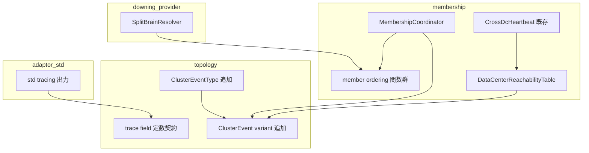
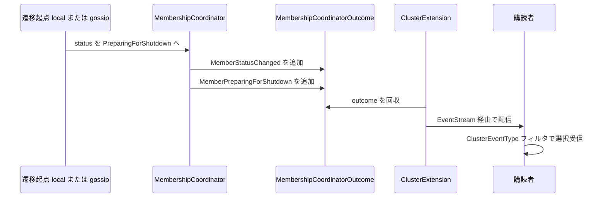
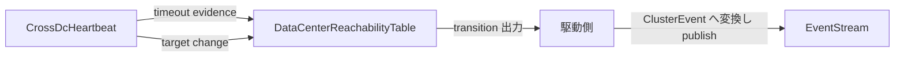

# 技術設計: cluster-membership-event-surface

## 概要

**Purpose（目的）**: この機能は cluster 実装者と運用者に、cluster membership の観測面 — Member Ordering (メンバー順序) の公開契約、Shutdown Progress Event (シャットダウン進行イベント)、Data Center Reachability (データセンター到達性) イベント、Cluster Lifecycle Trace Field (クラスタライフサイクル トレースフィールド) 契約 — を提供する。

**Users（ユーザー）**: cluster 実装者（downing / 将来の singleton 選出で順序契約を参照）と cluster 運用者（shutdown 進行・DC 到達性の購読、構造化トレースの解析）が利用する。

**Impact（影響）**: 既存の Membership State Transition (メンバーシップ状態遷移) の規則は一切変更せず、(1) 3 箇所に重複していたプライベートな oldest 判定を単一の公開契約へ集約し、(2) `ClusterEvent` / `ClusterEventType` に 4 つの variant を追加し、(3) std 層のアドホックな tracing field 名を契約参照に置き換える。

### 目標

- `NodeRecord::is_older_than` を比較の正本とする Member Ordering (メンバー順序) の公開契約を提供し、coordinator / SBR の重複実装を集約する
- shutdown 進行と DC 到達性変化を `ClusterEventType` フィルタで選択購読できるイベントとして配信する
- cluster lifecycle の主要遷移に対する単一のトレースフィールド名契約を定義し、std 層の出力を準拠させる

### 非目標

- full cluster shutdown を開始する command path（gap analysis Phase 2 / 別 spec）
- Downing Decision (ダウン判断) / Member Removal (メンバー除去) の実行、SBR runtime loop
- `CrossDcHeartbeat` の std 駆動ループ配線（evidence 生成の実運転は本 spec の外）
- イベント payload の wire serialization（cluster-message-serialization-contract の領域）
- singleton 選出・placement 決定

## 境界コミットメント

### このスペックが所有するもの

- Member Ordering (メンバー順序) の公開契約: 比較・age 整列・最古メンバー特定の関数群と、その決定性（tie-break 含む）
- `ClusterEvent` / `ClusterEventType` の 4 つの新 variant: `MemberPreparingForShutdown` / `MemberReadyForShutdown` / `UnreachableDataCenter` / `ReachableDataCenter` の形状と発行規則
- DC 到達性の集約判定（unreachable ラッチ + 復帰判定）の状態モデルと遷移出力
- Cluster Lifecycle Trace Field (クラスタライフサイクル トレースフィールド) の field 名語彙（単一公開定義）
- std 層 3 ファイルの tracing 出力の契約準拠化

### 境界外

- Membership State Transition (メンバーシップ状態遷移) の規則変更（status 遷移の追加・変更は行わない）
- `ClusterApi` / `ClusterCommand` への command 追加
- `CrossDcHeartbeat` の駆動配線と evidence 生成の実運転（本 spec はラッチの契約と接続点定義まで）
- 順序契約を**使った**選出・配置の決定（KeepOldest の判定規則自体は cluster-downing-sbr-decision-model の所有）
- MembershipEvent（内部 metrics 向けイベント）への variant 追加

### 許可する依存

- `membership` の既存型: `NodeRecord`（`is_older_than` / `join_version`）、`MembershipSnapshot`、`DataCenter`、`CrossDcHeartbeatEvidence`、`CrossDcHeartbeatTargetChange`、`MembershipCoordinatorOutcome`
- `topology` の既存型: `ClusterEvent`、`ClusterEventType`
- EventStream への発行は既存の `MembershipCoordinatorOutcome` → `ClusterExtension` publish 経路のみを使う（新しい発行経路を作らない）
- std 層は `tracing` クレートと core の trace field 契約に依存してよい

### 再検証トリガー

- `ClusterEvent` variant の形状（フィールド）変更 → 購読者・typed 層・wire 連携 spec の再確認
- `NodeRecord::is_older_than` / `join_version` の意味変更 → 順序契約と SBR KeepOldest の再検証
- `emit_status_change` の経路変更（発行集約の解体） → shutdown 進行イベントの全経路カバレッジ再確認
- `CrossDcHeartbeat` の target 管理・evidence 形状の変更 → DC ラッチの入力契約再確認

## アーキテクチャ

### 既存アーキテクチャ分析

- イベント発行: 状態変更は `MembershipCoordinatorOutcome.member_events: Vec<ClusterEvent>` に蓄積され、`ClusterExtension` が EventStream（`EventStreamEvent::Extension { name: "cluster" }`）へ publish する。status 遷移の発行は coordinator 内の `emit_status_change` ヘルパーに集約されており、local command 系・gossip 系の両経路が通る。
- 購読: `ClusterApi::subscribe` が `ClusterEventType` の集合でフィルタする。`ClusterEventType::matches` は網羅 match であり、variant 追加はコンパイルエラーで全対応箇所を検出できる。
- pure 状態機械パターン: `CrossDcHeartbeat` は coordinator 非統合の独立した値型（`update_targets` / `tick` / `collect_timeouts`）で、駆動は呼び出し側責務。本設計の DC ラッチはこれと同型にする。
- 順序判定: `oldest_authority`（coordinator）、`role_leaders`（coordinator）、`oldest_active_member`（SBR）が `is_older_than` ベースの同一比較を重複実装している。

### アーキテクチャパターンと境界マップ

**Architecture Integration（アーキテクチャ統合）**:

- 採用パターン: 既存の「outcome 蓄積 → EventStream publish」と「pure 状態機械 + 呼び出し側駆動」を踏襲（research.md: Option C ハイブリッド）
- ドメイン境界: 順序契約と DC ラッチは `membership`、イベント語彙と trace field 契約は `topology`、出力準拠は `cluster-adaptor-std`
- 新規コンポーネントの根拠: member_ordering（重複集約）、DC ラッチ（既存に該当機能なし）、trace field（契約の単一定義が存在しない）
- ステアリング準拠: `no_std` core、1 公開型 1 ファイル、sibling `_test.rs`、CQS、内部可変性なし



依存方向: `topology`（語彙）← `membership`（状態機械・発行）← `downing_provider` / `extension`。std は core の契約のみ参照する。逆方向の import は禁止。

### 技術スタック

| レイヤー | 選択／バージョン | 機能内での役割 | メモ |
|-------|------------------|-----------------|-------|
| core | Rust 2024 / `no_std` + alloc | 順序契約・ラッチ・イベント語彙・trace field 契約 | 新規依存なし |
| std adaptor | `tracing`（既存依存） | trace field 契約に準拠した構造化出力 | 依存追加なし |

## ファイル構造計画

### ディレクトリ構造（新規ファイル）

```
modules/cluster-core-kernel/src/
├── membership/
│   ├── member_ordering.rs                      # 順序契約: 比較・age 整列・oldest 特定（pub fn 群）
│   ├── member_ordering_test.rs                 # 決定性・tie-break・空集合のテスト
│   ├── data_center_reachability_table.rs       # DC 到達性ラッチ（pure 状態機械）
│   ├── data_center_reachability_table_test.rs  # ラッチ遷移・自DC除外・ゼロ件削除のテスト
│   └── data_center_reachability_transition.rs  # ラッチの遷移出力 enum
└── topology/
    ├── cluster_lifecycle_trace_field.rs        # trace field 名の pub const 契約（単一定義）
    └── cluster_lifecycle_trace_field_test.rs   # field 名の一意性テスト
```

### 変更対象ファイル

- `modules/cluster-core-kernel/src/topology/cluster_event.rs` — 4 variant 追加（`MemberPreparingForShutdown` / `MemberReadyForShutdown` / `UnreachableDataCenter` / `ReachableDataCenter`）。フィールドは既存 variant の規約（`node_id` / `authority` / `observed_at`、DC 系は `data_center`）に従う
- `modules/cluster-core-kernel/src/topology/cluster_event_type.rs` — 対応する 4 variant 追加と `matches` の網羅 match 更新
- `modules/cluster-core-kernel/src/membership/membership_coordinator.rs` — (1) `emit_status_change` で `to` が shutdown 系のとき専用イベントを併発、(2) `oldest_authority` / `role_leaders` の比較ロジックを member_ordering 参照へ置換
- `modules/cluster-core-kernel/src/downing_provider/split_brain_resolver.rs` — `oldest_active_member` を削除し member_ordering 参照へ置換（フィルタは呼び出し側に残す）
- `modules/cluster-core-kernel/src/membership.rs` — 新モジュール宣言と pub use（wiring のみ）
- `modules/cluster-core-kernel/src/topology.rs` — 同上
- `modules/cluster-adaptor-std/src/membership/tokio_gossiper.rs` — tracing 出力を trace field 契約準拠に修正
- `modules/cluster-adaptor-std/src/membership/tokio_gossip_transport.rs` — 同上
- `modules/cluster-adaptor-std/src/cluster_provider/aws_ecs_cluster_provider.rs` — 同上

## システムフロー

shutdown 進行イベントの配信（local command 経路と gossip 経路が同じ発行点を通る）:



DC 到達性ラッチ（駆動側が `CrossDcHeartbeat` と `DataCenterReachabilityTable` を併走させる）:



フロー上の判断: ラッチは全観測対象 unreachable で `BecameUnreachable` を 1 回だけ出力し（ラッチ）、復帰は観測対象 1 件以上の reachable evidence で `BecameReachable` を 1 回出力する。自 DC の evidence は入力段階で無視する。

## 要件トレーサビリティ

| 要件 | 要約 | コンポーネント | インターフェース | フロー |
|------|------|----------------|------------------|-------|
| 1.1 | 決定的な全順序 | member_ordering | `member_age_order` 比較 | — |
| 1.2 | 同一 view に同一の並び | member_ordering | pure 関数（状態なし） | — |
| 1.3 | age ordering | member_ordering | `age_ordered` | — |
| 1.4 | 決定的 tie-break | member_ordering | `is_older_than` の authority tie-break を正本化 | — |
| 1.5 | 最古メンバー特定 | member_ordering | `oldest_member` | — |
| 1.6 | 空 view の明示結果 | member_ordering | `Option<&NodeRecord>` = `None` | — |
| 2.1 | PreparingForShutdown イベント | ClusterEvent + coordinator | `MemberPreparingForShutdown` variant | shutdown シーケンス |
| 2.2 | ReadyForShutdown イベント | ClusterEvent + coordinator | `MemberReadyForShutdown` variant | shutdown シーケンス |
| 2.3 | member 識別情報 | ClusterEvent | variant フィールド `node_id` / `authority` | — |
| 2.4 | 開始と完了の区別 | ClusterEventType | 専用 variant 2 つ + `matches` | — |
| 2.5 | remote 由来遷移の観測 | coordinator | `emit_status_change` 集約点での併発 | shutdown シーケンス |
| 3.1 | DC unreachable イベント | DataCenterReachabilityTable + ClusterEvent | `observe` → `BecameUnreachable` → `UnreachableDataCenter` | DC ラッチフロー |
| 3.2 | DC 復帰イベント | DataCenterReachabilityTable + ClusterEvent | `observe` → `BecameReachable` → `ReachableDataCenter` | DC ラッチフロー |
| 3.3 | DC 識別子 | ClusterEvent | variant フィールド `data_center` | — |
| 3.4 | 自 DC の除外 | DataCenterReachabilityTable | `self_data_center` による入力無視 | DC ラッチフロー |
| 3.5 | member 単位イベントとの区別 | ClusterEventType | 専用 variant 2 つ | — |
| 3.6 | downing 非実行 | DataCenterReachabilityTable | 出力は遷移 enum のみ（down 操作なし） | — |
| 4.1 | 遷移種別ごと一意な field 名 | cluster_lifecycle_trace_field | `pub const` 群 | — |
| 4.2 | member 識別 field 名 | cluster_lifecycle_trace_field | `pub const` 群 | — |
| 4.3 | 単一の公開定義 | cluster_lifecycle_trace_field | 1 ファイル 1 契約 | — |
| 4.4 | std 出力の契約準拠 | std tracing 準拠化 | trace field 定数の参照 | — |
| 5.1 | 遷移規則の不変更 | coordinator 変更 | `emit_status_change` への併発追加のみ | — |
| 5.2 | shutdown command 非追加 | （変更なしの確認） | `ClusterApi` / `ClusterCommand` 不変 | — |
| 5.3 | 選出・配置の非実行 | member_ordering | pure query のみ | — |
| 5.4 | 既存イベント種別の維持 | ClusterEvent / coordinator | variant 追加のみ・`MemberStatusChanged` 併発維持 | — |

## コンポーネントとインターフェース

| コンポーネント | ドメイン／レイヤー | 意図 | 要件カバー範囲 | 主要依存 (P0/P1) | 契約 |
|-----------|--------------|--------|--------------|--------------------------|-----------|
| member_ordering | membership | 順序契約の単一正本 | 1.1–1.6, 5.3 | NodeRecord (P0) | Service |
| DataCenterReachabilityTable | membership | DC 到達性ラッチ | 3.1–3.6 | CrossDcHeartbeat 出力型 (P0) | Service, State |
| ClusterEvent / ClusterEventType 拡張 | topology | 観測イベント語彙 | 2.1–2.4, 3.3, 3.5, 5.4 | — | Event |
| MembershipCoordinator 変更 | membership | 発行点での併発と順序委譲 | 2.1, 2.2, 2.5, 5.1 | member_ordering (P0), ClusterEvent (P0) | Event |
| SplitBrainResolver 変更 | downing_provider | oldest 判定の委譲 | 1.5（参照側） | member_ordering (P0) | Service |
| cluster_lifecycle_trace_field | topology | trace field 名の単一契約 | 4.1–4.3 | — | State |
| std tracing 準拠化 | adaptor-std | 契約準拠の構造化出力 | 4.4 | trace field 契約 (P0), tracing (P1) | — |

### membership 層

#### member_ordering

| 項目 | 詳細 |
|-------|--------|
| 意図 | Member Ordering (メンバー順序) の比較・整列・oldest 特定を単一ファイルで提供する |
| 要件 | 1.1, 1.2, 1.3, 1.4, 1.5, 1.6, 5.3 |

**責務と制約**
- 比較の正本は `NodeRecord::is_older_than`（`join_version` + authority tie-break）。member_ordering は独自の比較規則を定義しない
- pure query のみ（状態を持たない）。フィルタ（active / leader-eligible / role）は呼び出し側責務（research.md: 直交設計の判断）

**依存**
- 流入: `MembershipCoordinator`（leader / role leader 算出）、`SplitBrainResolver`（KeepOldest）— いずれも P0
- 流出: `NodeRecord` — P0

**契約種別**: Service [x]

##### サービスインターフェース

```rust
/// Total order comparison by membership age (oldest first).
pub fn member_age_order(a: &NodeRecord, b: &NodeRecord) -> core::cmp::Ordering;

/// Returns records sorted oldest-first. Input order does not affect the result.
pub fn age_ordered<'a>(records: &'a [NodeRecord]) -> alloc::vec::Vec<&'a NodeRecord>;

/// Returns the oldest member, or `None` when `records` is empty.
pub fn oldest_member(records: &[NodeRecord]) -> Option<&NodeRecord>;
```

- Preconditions（事前条件）: なし（空スライス可）
- Postconditions（事後条件）: 同一入力集合に対して常に同一の順序（1.2）。`oldest_member` は `age_ordered` の先頭と一致（1.5）
- Invariants（不変条件）: `member_age_order` は全順序（反対称・推移・完全性）。tie は authority で一意に解決（1.4）

**Implementation Notes（実装メモ）**
- Integration: `oldest_authority` / `role_leaders`（coordinator）と `oldest_active_member`（SBR）の比較部分をこの契約の参照へ置き換え、置換後に既存テストが無変更で通ることを挙動同値の証明とする
- Validation: 順序の決定性は入力順をシャッフルした property 風テストで検証
- Risks: 置換時のフィルタ条件の取り違え（active / leader-eligible は呼び出し側に残すこと）

#### DataCenterReachabilityTable

| 項目 | 詳細 |
|-------|--------|
| 意図 | cross-DC 観測対象の evidence から DC 単位の到達性遷移をラッチ付きで導出する |
| 要件 | 3.1, 3.2, 3.4, 3.6 |

**責務と制約**
- `CrossDcHeartbeat` と同型の「pure 状態機械 + 呼び出し側駆動」。Shared 化しない（駆動側が所有する値型）
- 出力は `DataCenterReachabilityTransition` のみ。down 操作・membership 変更を行わない（3.6）
- 自 DC（構築時に与える `self_data_center`）宛の evidence は入力段階で無視する（3.4）
- 観測対象が空になった DC はエントリを削除し、削除時に遷移を出力しない（research.md の判断）

**依存**
- 流入: 駆動側（`CrossDcHeartbeat` を tick する将来の配線）— P1
- 流出: `CrossDcHeartbeatEvidence` / `CrossDcHeartbeatTargetChange` / `DataCenter` — P0

**契約種別**: Service [x] / State [x]

##### サービスインターフェース

```rust
pub struct DataCenterReachabilityTable { /* self_data_center + DC ごとの観測対象到達性 + ラッチ状態 */ }

impl DataCenterReachabilityTable {
  pub fn new(self_data_center: DataCenter) -> Self;

  /// Synchronizes the observed target set from cross-DC heartbeat target changes.
  pub fn apply_target_change(&mut self, change: &CrossDcHeartbeatTargetChange);

  /// Feeds availability evidence and returns a latched transition when the
  /// data center level reachability changes.
  pub fn observe(&mut self, evidence: &CrossDcHeartbeatEvidence) -> Option<DataCenterReachabilityTransition>;

  /// Read-only view of currently unreachable data centers.
  pub fn unreachable_data_centers(&self) -> alloc::vec::Vec<DataCenter>;
}

pub enum DataCenterReachabilityTransition {
  BecameUnreachable { data_center: DataCenter },
  BecameReachable { data_center: DataCenter },
}
```

- Preconditions: なし
- Postconditions: 全観測対象 unreachable で `BecameUnreachable` を**一度だけ**返す（ラッチ、3.1）。ラッチ後に観測対象のいずれかが reachable evidence を示した最初の `observe` で `BecameReachable` を返す（3.2）
- Invariants: 自 DC のエントリは存在しない（3.4）。遷移出力は状態変化時のみ（同状態の evidence は `None`）

##### 状態管理
- State model: DC ごとに観測対象集合と member 単位到達性、DC 単位ラッチ（reachable / unreachable）を保持
- Persistence & consistency: 揮発（再構築は target change の再適用で行う）
- Concurrency strategy: なし（駆動側所有の値型、`&mut self`）

**Implementation Notes（実装メモ）**
- Integration: イベントへの変換（transition → `ClusterEvent::UnreachableDataCenter` / `ReachableDataCenter`）と publish は駆動側契約。std 駆動配線は境界外（`CrossDcHeartbeat` 本体と同じ段階性）
- Validation: テストは evidence 直接投入で遷移列を検証（ラッチ・復帰・自 DC 無視・ゼロ件削除）
- Risks: `observe` は状態前進 + 出力収集の API であり、`CrossDcHeartbeat::collect_timeouts` と同型の許容パターン（CQS 違反ではなく不可避な状態前進）として扱う

#### MembershipCoordinator（変更）

| 項目 | 詳細 |
|-------|--------|
| 意図 | shutdown 進行イベントの併発と、順序判定の member_ordering への委譲 |
| 要件 | 2.1, 2.2, 2.5, 5.1 |

**責務と制約**
- `emit_status_change` で `to == PreparingForShutdown` のとき `MemberPreparingForShutdown` を、`to == ReadyForShutdown` のとき `MemberReadyForShutdown` を、従来の `MemberStatusChanged` の**後に**併発する（順序固定、5.4）
- 発行点は `emit_status_change` のみ。local command 系・gossip 系の両経路が同ヘルパーを通るため、要件 2.5 は追加の経路なしで満たされる
- 状態遷移の規則（どの status からどの status へ遷移できるか）は変更しない（5.1）

**契約種別**: Event [x]

##### イベント契約
- Published events: `MemberPreparingForShutdown { node_id, authority, observed_at }`、`MemberReadyForShutdown { node_id, authority, observed_at }`（既存 variant のフィールド型規約に一致させる）
- Ordering / delivery guarantees: 同一遷移では `MemberStatusChanged` → 専用イベントの順で outcome に積む。配信保証は既存 EventStream に従う

**Implementation Notes（実装メモ）**
- Integration: `MembershipCoordinatorOutcome` / `ClusterExtension` の publish 経路は無変更
- Validation: local 遷移と gossip merge 由来遷移の両方で専用イベントが併発されることを coordinator テストで検証
- Risks: `emit_status_change` を通らない status 反映経路が将来追加されると 2.5 が崩れる（再検証トリガーに記載）

### topology 層

#### ClusterEvent / ClusterEventType 拡張

| 項目 | 詳細 |
|-------|--------|
| 意図 | 観測イベント語彙への 4 variant 追加 |
| 要件 | 2.1, 2.2, 2.3, 2.4, 3.3, 3.5, 5.4 |

**責務と制約**
- `ClusterEvent` に 4 variant、`ClusterEventType` に対応 4 variant と `matches` のアームを追加する。既存 variant の削除・形状変更は行わない（5.4）
- shutdown 進行 2 種・DC 到達性 2 種はそれぞれ独立した `ClusterEventType` を持ち、購読者が種別フィルタで選択できる（2.4, 3.5）

**契約種別**: Event [x]

**Implementation Notes（実装メモ）**
- Integration: variant 追加に伴うコンパイルエラー箇所（`matches` 等）の修正が完了の判定。typed 層は `TypedActorRef<ClusterEvent>` のため構造変更なし
- Validation: `ClusterEventType::matches` の新アームをテストで網羅
- Risks: なし（網羅性チェックで機械的に検出される）

#### cluster_lifecycle_trace_field

| 項目 | 詳細 |
|-------|--------|
| 意図 | cluster lifecycle 遷移の構造化トレースフィールド名の単一公開契約 |
| 要件 | 4.1, 4.2, 4.3 |

**責務と制約**
- 遷移種別（join / up / leave / removal / shutdown 進行 / DC 到達性変化）ごとに一意な値を持つ `pub const` 群と、member 識別（node id / authority）・data center を表す field 名 const を定義する
- 出力責務を持たない（`no_std` の語彙契約のみ）。型階層・trait は作らない（research.md: simplification の判断）

**契約種別**: State [x]

##### 状態管理
- State model: コンパイル時定数のみ（実行時状態なし）

**Implementation Notes（実装メモ）**
- Validation: 遷移種別値の一意性をテストで検証（4.1）
- Risks: const 契約は使用強制が弱い — std 側の準拠はレビューと grep で担保（4.4 のテスト対象）

### downing_provider 層

#### SplitBrainResolver（変更）

要約のみ: `oldest_active_member`（プライベート重複実装）を削除し、active フィルタ済み集合への `member_ordering::oldest_member` 適用に置き換える。KeepOldest の判定規則・trace 形状は変更しない。既存 SBR テストが無変更で通ることを完了条件とする（要件 1.5 の参照側、5.1 と同趣旨の挙動維持）。

### adaptor-std 層

#### std tracing 準拠化

要約のみ: `tokio_gossiper.rs` / `tokio_gossip_transport.rs` / `aws_ecs_cluster_provider.rs` の cluster lifecycle 関連 tracing 出力を、trace field 契約の const 参照に置き換える（4.4）。出力タイミング・ログレベルは変更しない。

## データモデル

### ドメインモデル

本 spec が追加するのはイベント値と判定状態のみで、集約・永続エンティティの変更はない。

- `ClusterEvent` 新 variant（値オブジェクト）: `MemberPreparingForShutdown` / `MemberReadyForShutdown`（member 識別 + 観測時刻）、`UnreachableDataCenter` / `ReachableDataCenter`（`data_center` + 観測時刻）
- `DataCenterReachabilityTransition`（値オブジェクト）: ラッチ遷移の 2 variant
- `DataCenterReachabilityTable`（状態モデル）: DC → (観測対象集合, member 到達性, ラッチ) の揮発マップ。不変条件: 自 DC エントリなし、遷移出力は状態変化時のみ

### データ契約と統合

- イベントスキーマのバージョニングと wire 表現は cluster-message-serialization-contract の所有領域であり、本 spec は in-process の Rust 型のみを定義する

## エラーハンドリング

### エラー戦略

本 spec の追加面は pure query と値型状態機械であり、新しいエラー型・失敗経路を導入しない。

- member_ordering: 空入力は `Option::None` で表現する（1.6）。panic しない
- `DataCenterReachabilityTable`: 不正・無関係な evidence（未知 DC、自 DC、未知 subject）は無視して `None` を返す（観測契約として安全側）
- イベント発行: 既存の EventStream 配信失敗の扱い（既存契約）に従い、本 spec で変更しない

### 監視

trace field 契約自体が本 spec の監視成果物である。core はイベントと契約を提供し、出力は std 層の責務とする。

## テスト戦略

### Unit Tests

1. member_ordering: 入力順をシャッフルしても `age_ordered` が同一の並びを返す（1.1, 1.2）
2. member_ordering: `join_version` 同値の member が authority tie-break で一意に並ぶ（1.4）、空スライスで `oldest_member` が `None`（1.6）
3. DataCenterReachabilityTable: 全観測対象 unreachable で `BecameUnreachable` が一度だけ出力され、以後の同状態 evidence は `None`（3.1 ラッチ）
4. DataCenterReachabilityTable: ラッチ後の reachable evidence で `BecameReachable`（3.2）、自 DC evidence の無視（3.4）、観測対象ゼロ件 DC のエントリ削除（遷移出力なし）
5. cluster_lifecycle_trace_field: 遷移種別 const 値の一意性（4.1）
6. ClusterEventType: 新 4 variant の `matches` 対応（2.4, 3.5）

### Integration Tests

1. coordinator: local の leave→shutdown 系遷移で `MemberStatusChanged` の後に `MemberPreparingForShutdown` / `MemberReadyForShutdown` が outcome に積まれる（2.1, 2.2, 5.4 併発順序）
2. coordinator: gossip merge 由来の shutdown 系遷移でも専用イベントが発行される（2.5）
3. `ClusterApi::subscribe`: 新 `ClusterEventType` だけを指定した購読者が shutdown 進行イベントのみを受信する（2.4）
4. SBR KeepOldest: member_ordering 委譲後に既存の `split_brain_resolver` テストが無変更で通る（1.5 参照側・挙動同値）
5. coordinator: 委譲後に leader / role leader 算出の既存テストが無変更で通る（5.1）
