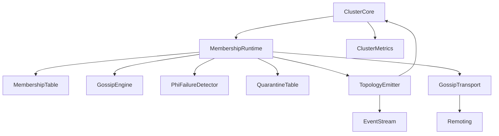
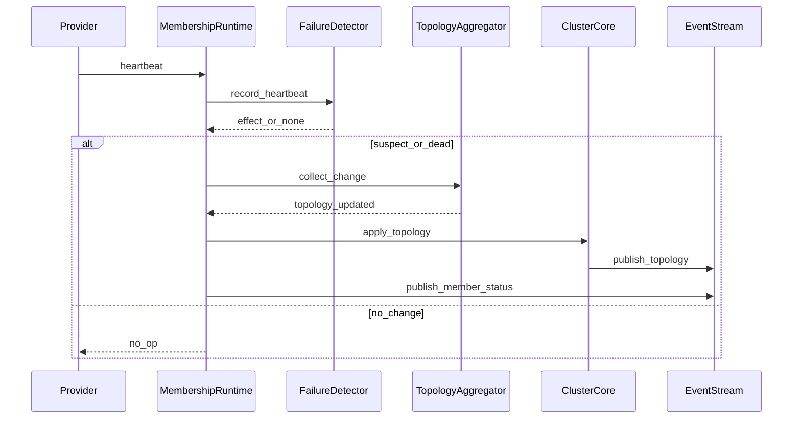
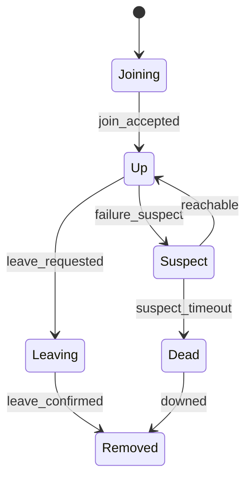
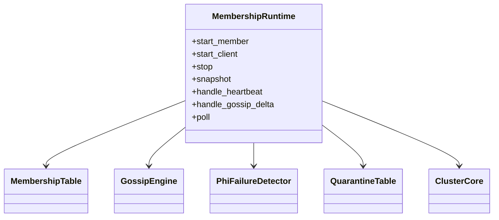
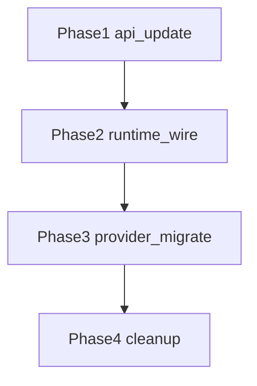

# 設計ドキュメント

## 概要
本設計は cluster モジュールに Membership/Gossip 基盤を定義し、メンバー状態遷移、失敗検知、隔離、トポロジ更新、メトリクス/イベント連動を一貫した契約で扱う。未起動時の拒否、状態遷移の妥当性検証、同周期の変更集約を備え、運用判断のぶれを減らす。

主な利用者は cluster を組み込む開発者と運用者であり、ノードの起動/停止・障害時の判断を自動化し、EventStream での観測と ClusterCore 反映を確実化する。既存の ClusterCore/LocalClusterProviderGeneric を維持しつつ、core に MembershipRuntime を導入し、NodeStatus/ClusterEvent/ClusterTopology を拡張する。

### 目標 (Goals)
- Membership/Gossip の起動/停止と未起動時拒否を明確化する
- Join/Alive/Suspect/Dead を含む状態遷移と隔離ルールを一貫させる
- TopologyUpdated の集約生成と ClusterCore 反映、メトリクス更新、EventStream 配信を同期させる
- 現在の Membership スナップショットと隔離一覧を常に参照可能にする

### 非目標 (Non-Goals)
- 外部クラスタ管理サービスの実装や永続ストレージの導入
- 分散合意やリーダー選出の追加
- remoting 以外の新規トランスポート実装

## アーキテクチャ

### 既存アーキテクチャの把握
- `ClusterCore` はトポロジ適用、メトリクス更新、EventStream 発火を担う
- `MembershipTable` と `GossipEngine` が既に存在し、版本管理と差分配布の土台がある
- `PhiFailureDetector` が `remote/core` にあり、到達不能の検知を提供できる
- `IdentityTable` は隔離マップを保持し、解決時に隔離を優先する
- `LocalClusterProviderGeneric` は単純な join/leave で TopologyUpdated を発火する

### ハイレベルアーキテクチャ

- MembershipRuntime を core に配置し、no_std で完結する状態機械とイベント生成を担当する
- std 拡張は remoting 受信や transport 連携のみを扱い、core に `cfg` を追加しない
- EventStream 発火はロック外で行う設計とし、デッドロックを避ける

### 技術スタック / 設計判断
- 時刻は `RuntimeToolbox::clock()` の `TimerInstant` を用い、単調増加のタイムスタンプを付与する
- 期間/間隔は `Duration` で保持し、`TimerInstant` と合成して期限判定する
- 共有は `ArcShared<ToolboxMutex<...>>` を既定とし、状態変更 API は `&mut self` を基本とする
- 失敗検知は `PhiFailureDetector` を再利用し、Suspect/Reachable の効果を状態遷移に反映する
- Gossip は `GossipEngine` と `GossipTransport` に分離し、Transport 依存を core から切り離す

#### 主要設計判断
- **Decision**: `MembershipRuntime` を core に導入し、Membership/Gossip/FailureDetector を統合する  
  **Context**: 現状は LocalClusterProviderGeneric が単純な join/leave で TopologyUpdated を発火しており、失敗検知や隔離の契約が不十分  
  **Alternatives**: ClusterCore に直接ロジックを埋め込む / provider ごとに実装する  
  **Selected Approach**: `MembershipRuntime` に状態機械と集約を集約し、`ClusterCore` は適用と観測に集中する  
  **Rationale**: 1 箇所で状態遷移と集約ルールを管理でき、core/std 境界も守れる  
  **Trade-offs**: 新規モジュールと API が増える

- **Decision**: `NodeStatus` に `Suspect` と `Dead` を追加し、隔離を `QuarantineTable` と分離する  
  **Context**: 現状の `Unreachable` だけでは疑いと確定が区別できず、要件の Suspect/Dead を満たせない  
  **Alternatives**: `Unreachable` のみで状態管理する / `IdentityTable` の隔離だけで運用する  
  **Selected Approach**: Suspect と Dead を状態として明示し、隔離は期限付きテーブルで管理する  
  **Rationale**: 状態遷移の意図が明確になり、無効遷移の検出が容易  
  **Trade-offs**: 既存の `Unreachable` 前提の箇所を更新する必要がある

- **Decision**: TopologyUpdated は同周期の変更を集約し、タイムスタンプと現行メンバー一覧を必須とする  
  **Context**: 重複イベントや変化のない更新が発生しやすく、要件に合致しない  
  **Alternatives**: 逐次イベント発火 / ClusterCore で後処理する  
  **Selected Approach**: `MembershipRuntime` 内の集約バッファでまとめて発火し、`ClusterCore` で適用する  
  **Rationale**: 変更のない周期を除外でき、メトリクス/イベント連動を同期できる  
  **Trade-offs**: バッファ管理のための追加状態が必要

## システムフロー

### 代表フロー: 失敗検知からトポロジ更新


### トポロジ集約ポリシー
- `MembershipRuntime` は変更をバッファし、`topology_emit_interval` 経過時点で単一の `TopologyUpdated` を生成する
- `poll(now)` は集約ウィンドウの境界判定を行い、変更が存在しない場合はイベントを生成しない
- 集約ウィンドウは `next_topology_emit_at`（`TimerInstant`）で管理し、`now >= next_topology_emit_at` で確定する

### 状態遷移


## API ブループリント

### 型・トレイト一覧
- `modules/cluster/src/core/membership_runtime.rs`: `pub struct MembershipRuntime<TB>`  
  Membership/Gossip/FailureDetector を統合する実行時コンポーネント
- `modules/cluster/src/core/membership_runtime_shared.rs`: `pub struct MembershipRuntimeShared<TB>`  
  `ArcShared<ToolboxMutex<...>>` による共有ラッパー
- `modules/cluster/src/core/membership_runtime_state.rs`: `pub enum MembershipRuntimeState`  
  `Stopped | Member | Client`
- `modules/cluster/src/core/membership_runtime_config.rs`: `pub struct MembershipRuntimeConfig`  
  閾値、タイムアウト、Gossip 有効化など
- `modules/cluster/src/core/membership_runtime_outcome.rs`: `pub struct MembershipRuntimeOutcome`  
  生成されたイベントと送信すべき Gossip の集合
- `modules/cluster/src/core/gossip_transport.rs`: `pub trait GossipTransport`  
  Gossip の送受信契約
- `modules/cluster/src/core/quarantine_table.rs`: `pub struct QuarantineTable`  
  期限付き隔離の管理
- `modules/cluster/src/core/quarantine_entry.rs`: `pub struct QuarantineEntry`  
  authority, reason, expires_at を保持する view
- `modules/cluster/src/core/node_status.rs`: `pub enum NodeStatus`  
  `Suspect` と `Dead` を追加
- `modules/cluster/src/core/cluster_event.rs`: `pub enum ClusterEvent`  
  `MemberStatusChanged` などを追加、`TopologyUpdated` に timestamp と members を追加
- `modules/cluster/src/core/cluster_topology.rs`: `pub struct ClusterTopology`  
  変更集合（joined/left/dead）と hash を保持し、現行メンバー一覧は `ClusterEvent::TopologyUpdated.members` に分離する

### シグネチャ スケッチ
```rust
pub struct MembershipRuntimeConfig {
  pub phi_threshold: f64,
  pub suspect_timeout: Duration,
  pub dead_timeout: Duration,
  pub quarantine_ttl: Duration,
  pub gossip_enabled: bool,
  pub gossip_interval: Duration,
  pub topology_emit_interval: Duration,
}

pub enum MembershipRuntimeState {
  Stopped,
  Member,
  Client,
}

pub struct MembershipRuntimeOutcome {
  pub topology_event: Option<ClusterEvent>,
  pub member_events: Vec<ClusterEvent>,
  pub gossip_outbound: Vec<GossipOutbound>,
  pub membership_events: Vec<MembershipEvent>,
}

pub struct MembershipRuntime<TB: RuntimeToolbox + 'static> {
  // fields omitted
}

impl<TB: RuntimeToolbox + 'static> MembershipRuntime<TB> {
  pub fn new(config: MembershipRuntimeConfig, table: MembershipTable, detector: PhiFailureDetector) -> Self;
  pub fn state(&self) -> MembershipRuntimeState;
  pub fn start_member(&mut self) -> Result<(), MembershipRuntimeError>;
  pub fn start_client(&mut self) -> Result<(), MembershipRuntimeError>;
  pub fn stop(&mut self) -> Result<(), MembershipRuntimeError>;
  pub fn snapshot(&self) -> MembershipSnapshot;
  pub fn quarantine_snapshot(&self) -> Vec<QuarantineEntry>;

  pub fn handle_join(
    &mut self,
    node_id: String,
    authority: String,
    now: TimerInstant,
  ) -> Result<MembershipRuntimeOutcome, MembershipError>;

  pub fn handle_leave(
    &mut self,
    authority: &str,
    now: TimerInstant,
  ) -> Result<MembershipRuntimeOutcome, MembershipError>;

  pub fn handle_heartbeat(&mut self, authority: &str, now: TimerInstant) -> MembershipRuntimeOutcome;
  pub fn handle_gossip_delta(
    &mut self,
    peer: &str,
    delta: MembershipDelta,
    now: TimerInstant,
  ) -> MembershipRuntimeOutcome;

  pub fn poll(&mut self, now: TimerInstant) -> MembershipRuntimeOutcome;
}

pub trait GossipTransport {
  fn send(&mut self, outbound: GossipOutbound) -> Result<(), GossipTransportError>;
  fn poll_deltas(&mut self) -> Vec<(String, MembershipDelta)>;
}
```

## クラス／モジュール図


## クイックスタート / 利用例
```rust
fn membership_runtime_flow<TB: RuntimeToolbox + 'static>(
  runtime: &mut MembershipRuntime<TB>,
  now: TimerInstant,
) {
  let _ = runtime.start_member();

  let _ = runtime.handle_join("node-a".to_string(), "127.0.0.1:12000".to_string(), now);
  let outcome = runtime.handle_heartbeat("127.0.0.1:12000", now);

  for outbound in outcome.gossip_outbound {
    let _ = outbound;
  }

  let _snapshot = runtime.snapshot();
  let _quarantine = runtime.quarantine_snapshot();
}
```

## 旧→新 API 対応表

| 旧 API / 型 | 新 API / 型 | 置換手順 | 備考 |
| --- | --- | --- | --- |
| `NodeStatus::Unreachable` | `NodeStatus::Suspect` / `NodeStatus::Dead` | 失敗検知で `Suspect` へ遷移し、期限超過で `Dead` へ遷移 | 旧 `Unreachable` 判定は `Dead` 扱いに統一 |
| `ClusterEvent::TopologyUpdated { topology, joined, left, blocked }` | `ClusterEvent::TopologyUpdated { topology, members, joined, left, dead, blocked, observed_at }` | 既存購読側に timestamp と members を追加対応 | 変更集合と現行メンバー一覧を同時通知 |
| `LocalClusterProviderGeneric::on_member_join/leave` | `MembershipRuntime::handle_join/handle_leave` | Provider は Runtime へ委譲し、集約結果を publish | EventStream 発火は Runtime 経由 |

## 要件トレーサビリティ

| 要件ID | 要約 | 実装コンポーネント | インターフェイス | 参照フロー |
| --- | --- | --- | --- | --- |
| 1.1 | 起動時に基盤を稼働 | MembershipRuntime | start_member | sequence |
| 1.3 | 未起動時に拒否 | MembershipRuntime | handle_* | sequence |
| 2.3 | Suspect 状態 | MembershipRuntime / NodeStatus | handle_heartbeat | state |
| 3.1 | 隔離イベント | QuarantineTable / ClusterEvent | quarantine | sequence |
| 3.3 | 隔離中の再参加拒否 | MembershipRuntime / QuarantineTable | handle_join | component |
| 3.5 | 隔離一覧の参照 | QuarantineTable | snapshot | component |
| 4.1 | TopologyUpdated 生成 | MembershipRuntime | poll | sequence |
| 4.2 | 変更なしは生成しない | MembershipRuntime | poll | aggregation |
| 4.3 | 同周期の集約 | MembershipRuntime | poll | aggregation |
| 5.4 | タイムスタンプ付与 | ClusterEvent | TopologyUpdated | sequence |

## コンポーネント & インターフェイス

### MembershipRuntime
- 責務: 状態遷移、失敗検知の反映、Gossip 差分配布、TopologyUpdated 集約、イベント生成
- 入出力: join/leave/heartbeat/gossip_delta を受け取り、ClusterEvent と GossipOutbound を生成
- 依存関係: `MembershipTable`, `GossipEngine`, `PhiFailureDetector`, `QuarantineTable`, `RuntimeToolbox`
- 外部依存の調査結果: Gossip と phi 失敗検知の併用は Akka/Pekko の運用パターンと整合する
- 追加ルール: `handle_join` は `QuarantineTable` を参照し、隔離中は参加を拒否し理由を返す
- 追加ルール: `IdentityTable` は `QuarantineTable` のスナップショットで同期し、隔離状態の単一ソースは `QuarantineTable` とする

#### 契約定義
**Component Interface**
```rust
pub trait MembershipRuntimePort {
  fn start_member(&mut self) -> Result<(), MembershipRuntimeError>;
  fn stop(&mut self) -> Result<(), MembershipRuntimeError>;
  fn snapshot(&self) -> MembershipSnapshot;
  fn poll(&mut self, now: TimerInstant) -> MembershipRuntimeOutcome;
}
```
- 前提条件: state が `Member` 以外のとき、入力は `NotStarted` で失敗する
- 事後条件: 状態遷移は `NodeStatus` の許可された遷移のみを適用する
- 不変条件: authority は一意、`Dead` と `Removed` はアクティブ集合に含めない

### GossipTransport
- 責務: `GossipOutbound` の送信と受信差分の収集
- 入出力: `send` で delta を送信し、`poll_deltas` で受信差分を返す
- 依存関係: remoting または in-memory transport
- 外部依存の調査結果: ピア間の状態共有は gossip が最小構成で成立する

#### 契約定義
**Component Interface**
```rust
pub trait GossipTransport {
  fn send(&mut self, outbound: GossipOutbound) -> Result<(), GossipTransportError>;
  fn poll_deltas(&mut self) -> Vec<(String, MembershipDelta)>;
}
```
- 前提条件: peer は既知の authority である
- 事後条件: 送信失敗は `GossipTransportError` で通知する

### QuarantineTable
- 責務: 隔離理由と期限の保持、期限満了の解放、一覧取得
- 入出力: `quarantine`, `clear`, `poll_expired`, `snapshot`
- 依存関係: `TimerInstant`
- 外部依存の調査結果: 隔離期間は再参加拒否に用い、期限満了後の復帰を許可する
- 単一ソース: 隔離判定は `QuarantineTable` を唯一の根拠とし、`IdentityTable` にはスナップショットを同期する

### ClusterCore
- 責務: TopologyUpdated を適用し、メトリクス更新と EventStream 発火を統合
- 入出力: `apply_topology_for_external` で適用結果を返し、発火は呼び出し側が行う
- 依存関係: `ClusterMetrics`, `EventStreamSharedGeneric`

### イベント契約
- 発行イベント:
  - `ClusterEvent::TopologyUpdated { topology, members, joined, left, dead, blocked, observed_at }`
  - `ClusterEvent::MemberStatusChanged { node_id, authority, from, to, observed_at }`
  - `ClusterEvent::MemberQuarantined { authority, reason, observed_at }`
  - `ClusterEvent::TopologyApplyFailed { reason, observed_at }`
- 購読イベント:
  - `TopologyUpdated` は ClusterCore へ反映し、EventStream から購読される
  - 状態遷移イベントは観測用途で購読される

### ドメインモデル
- エンティティ: `Member` (node_id, authority, status), `QuarantineEntry` (authority, reason, expires_at)
- ルール:
  - `Joining -> Up -> Suspect -> Dead` の順で遷移し、`Dead` はアクティブ集合から除外する
  - `Leaving -> Removed` を許可し、`Removed` は再参加までアクティブ集合に含めない
  - `Suspect` の解除は `Reachable` 効果でのみ許可する

## データモデル

### 論理データモデル
- `MembershipTable`: authority をキーにした versioned state
- `QuarantineTable`: authority と期限、理由を保持する
- `ClusterTopology`: 変更集合と現行メンバー一覧のスナップショット

### 物理データモデル
- 永続化は行わず、全てメモリ内保持
- `BTreeMap`/`Vec` による deterministic な順序保持を継続

### データ契約 / 連携
- EventStream へは `ClusterEvent` を payload として送出
- `MembershipSnapshot` は handshake 用の読み取り専用構造とする
 - `observed_at` は `RuntimeToolbox::clock()` の `TimerInstant` を使用する

## エラーハンドリング

### エラーストラテジ
- `NotStarted` は即時失敗として返す
- 無効な状態遷移は `MembershipError::InvalidTransition` として記録
- Gossip 送信失敗は `GossipTransportError` で返し、再送は呼び出し側が判断する
- 隔離中の参加は `MembershipError::Quarantined` とし、`MemberQuarantined` を発火する

### エラー分類と応答
- ユーザエラー: 無効な join/leave の要求
- システムエラー: Gossip 送信失敗、Topology 適用失敗
- ビジネスロジックエラー: 不正遷移、隔離中の再参加

### モニタリング
- EventStream へ `MemberStatusChanged` と `MemberQuarantined` を発火
- メトリクスは `ClusterMetrics` を更新し、メンバー数や隔離数を観測する

## テスト戦略
- ユニットテスト: 状態遷移、無効遷移検出、隔離期限の解放、Gossip 集約
- 統合テスト: `ClusterCore` 反映、EventStream 配信、TopologyUpdated 集約の一貫性
- パフォーマンステスト: 1000 ノード相当の Gossip fan-out と集約遅延を検証

## 追加セクション（必要時のみ）

### セキュリティ
- 隔離理由は外部入力を直接表示しない運用を前提とする
- Gossip payload は既存の remoting 認証方針に従う

### パフォーマンス & スケーラビリティ
- TopologyUpdated を周期集約することでイベント増幅を抑制する
- FailureDetector は観測間隔と閾値を config 化し、環境ごとに調整可能とする

### 移行戦略

- Phase1: `NodeStatus` と `ClusterEvent` の拡張を反映
- Phase2: `MembershipRuntime` を core に追加し、LocalClusterProviderGeneric から利用
- Phase3: std 側 transport 連携を `GossipTransport` に寄せる
- Phase4: 旧 `Unreachable` 前提の分岐を削除
