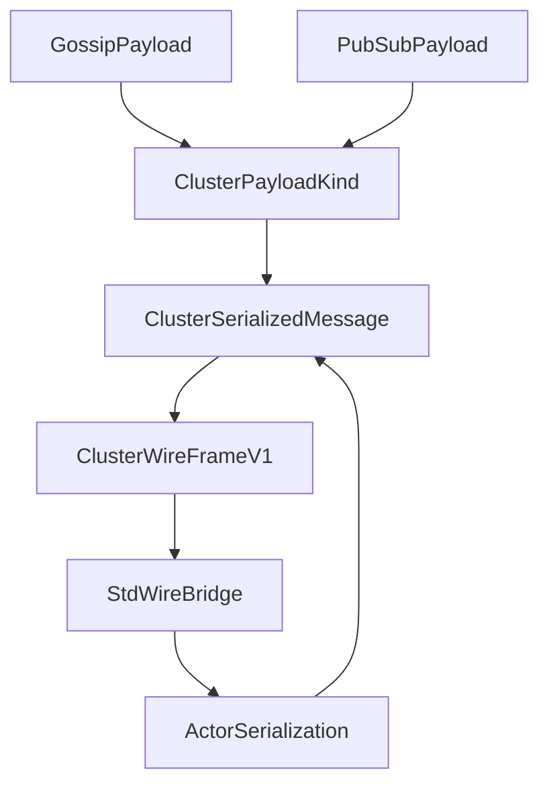
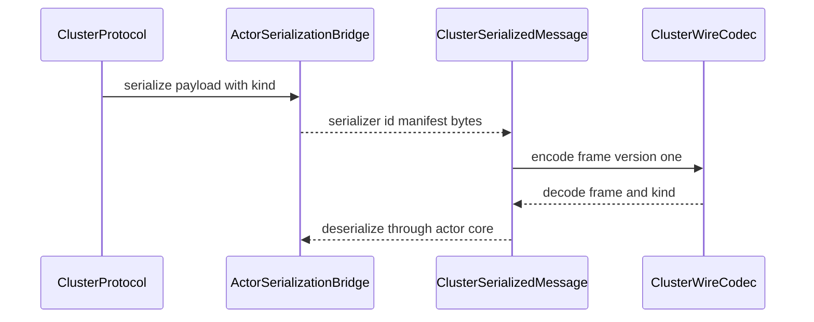
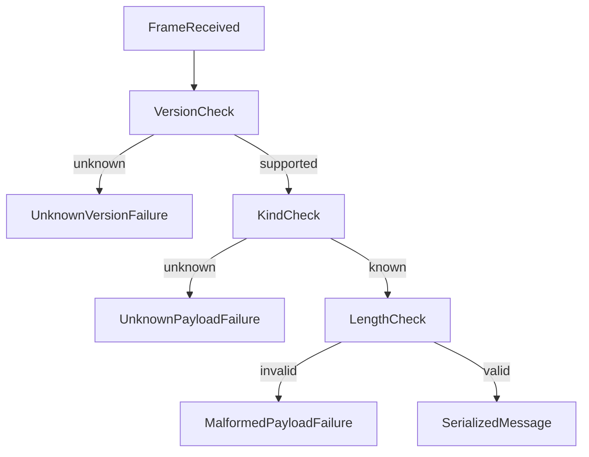

# Design Document

## Overview

この feature は、cluster message の serialization contract を `actor-core` の既存 serialization subsystem と cluster std/wire の間に置く。gossip envelope payload と pubsub mediator payload は、それぞれ upstream spec の core contract を保ったまま、同じ serialized message metadata と versioned wire frame で扱えるようにする。

既存の `fraktor-actor-core-kernel-rs` には `SerializationExtension`、`Serializer`、`SerializerWithStringManifest`、`SerializedMessage`、`SerializerId` がある。cluster 側には grain codec と pubsub delivery payload があるが、gossip/pubsub cluster message を統一して actor-core serialization と std/wire へ渡す contract はまだ分離されていない。

### Goals

- cluster message payload kind、serializer id、manifest、payload bytes を持つ no_std core contract を定義する。
- actor-core serialization の `SerializedMessage` と cluster message kind を橋渡しする。
- std adaptor に versioned wire frame encode/decode を置き、unknown version / unknown payload / malformed payload を明示的に拒否する。
- gossip semantics、pubsub semantics、remote transport lifecycle、protobuf binary compatibility をこの spec から除外する。

### Non-Goals

- gossip merge、seen digest、heartbeat evidence、reachability update。
- pubsub mediator command application、delivery target selection、registry delta apply。
- remote transport association、socket lifecycle、Tokio task orchestration。
- actor-core serialization subsystem 全体の再設計。
- Pekko / protobuf wire protocol の完全 binary compatibility。

## Boundary Commitments

### This Spec Owns

- cluster message payload kind と actor-core manifest preservation rule。
- actor-core `SerializedMessage` と cluster payload kind を組み合わせる core-level bridge model。
- std/wire の versioned frame shape、encode/decode failure contract。
- unknown version、unknown payload kind、unknown manifest、malformed payload の failure 分類。
- `docs/gap-analysis/cluster-gap-analysis.md` の cluster message serializer contract follow-up に対する evidence 更新。

### Out of Boundary

- gossip payload の merge / heartbeat / reachability semantics。
- pubsub payload の mediator state / delivery / registry semantics。
- remote transport lifecycle、association handshake、backpressure、retry。
- protobuf schema 生成、Akka/Pekko binary compatibility migration layer。
- actor-core serialization registry の登録方式や serializer trait の再設計。

### Allowed Dependencies

- `fraktor-actor-core-kernel-rs::serialization::{SerializedMessage, SerializerId, SerializationExtension, SerializationCallScope}`。
- upstream `cluster-gossip-heartbeat-protocol` の `GossipEnvelope` payload kind extension point。
- upstream `cluster-pubsub-mediator-protocol` の `TopicRegistryGossipPayload` / mediator payload contract。
- std adaptor の existing postcard / serde usage pattern。
- `alloc` collections and bytes in core contracts; Tokio and network I/O only in std adaptor consumers.

### Revalidation Triggers

- `SerializedMessage` の field、encoding layout、manifest handling、serializer id semantics が変わる。
- `Serializer` / `SerializerWithStringManifest` / `SerializationExtension` の public API が変わる。
- gossip envelope payload kind または pubsub registry payload kind が追加・改名される。
- std/wire frame version、payload kind tag、length field、error category が変わる。
- future interoperability spec が protobuf binary compatibility を要求する。

## Architecture

### Existing Architecture Analysis

`actor-core` の serialization は `SerializedMessage` に serializer id、optional manifest、payload bytes を保持する。`SerializationExtension` は registered serializer を使って `serialize` / `deserialize` を行い、manifest-aware serializer も扱える。remote-core の `EnvelopePayload` も serializer id、manifest、bytes を持つため、cluster message も同じ metadata model に揃えられる。

`cluster-adaptor-std` の membership wire は `GossipWireDeltaV1` と postcard/serde を使う。これは membership delta 専用であり、gossip envelope payload と pubsub payload の両方を actor-core serialization metadata 付きで運ぶ共通 frame ではない。

### Architecture Pattern & Boundary Map



**Architecture Integration**:
- Selected pattern: core contract + std wire bridge。payload kind と actor-core serialized metadata は core、byte-level frame encode/decode は std adaptor に置く。
- Domain/feature boundaries: `ClusterSerializedMessage` は message metadata、`ClusterWireFrameV1` は wire shape、`ClusterWireDecodeFailure` は failure taxonomy を持つ。
- Existing patterns preserved: `no_std` core、std adaptor separation、1公開型1ファイル、sibling test file、rustdoc は英語、Markdown は日本語。
- New components rationale: gossip wire と pubsub delivery が個別 codec を持ち続けると serializer id / manifest / unknown payload handling が分散するため、cluster message 専用の contract が必要。
- Steering compliance: actor-core serialization は再設計せず、cluster core が必要とする接続点だけを定義する。

### Technology Stack

| Layer | Choice / Version | Role in Feature | Notes |
|-------|------------------|-----------------|-------|
| Actor serialization | existing `actor-core` serialization | serializer id / manifest / bytes の source of truth | registry 再設計はしない |
| Cluster core | Rust 2024 nightly workspace | payload kind と serialized message bridge | `no_std` + `alloc` |
| Std wire | serde + postcard pattern | versioned frame encode/decode | std adaptor に限定 |
| Tests | cargo unit/integration tests | bridge roundtrip、unknown payload、boundary guard | targeted tests |

## File Structure Plan

### Directory Structure

```text
modules/cluster-core-kernel/src/
├── message_serialization.rs                         # cluster message serialization modules の wiring
├── message_serialization/
│   ├── cluster_message_payload_kind.rs              # gossip / pubsub payload kind
│   ├── cluster_message_payload_kind_test.rs         # tag stability / unknown handling tests
│   ├── cluster_message_manifest.rs                  # actor-core manifest preservation rule
│   ├── cluster_message_manifest_test.rs             # manifest preservation tests
│   ├── cluster_serialized_message.rs                # payload kind + actor SerializedMessage bridge
│   ├── cluster_serialized_message_test.rs           # metadata preservation tests
│   ├── cluster_message_deserialize_failure.rs       # unknown payload / manifest failure taxonomy
│   └── actor_serialization_bridge.rs                # SerializationExtension 接続点
```

```text
modules/cluster-adaptor-std/src/
├── message_wire.rs                                  # std wire bridge modules の wiring
└── message_wire/
    ├── cluster_wire_frame_v1.rs                     # frame version / kind / serializer metadata / bytes
    ├── cluster_wire_frame_v1_test.rs                # encode/decode roundtrip and malformed frame tests
    ├── cluster_wire_codec.rs                        # frame encode/decode API
    ├── cluster_wire_codec_test.rs                   # unknown version / unknown kind tests
    ├── cluster_wire_decode_failure.rs               # std wire decode failure taxonomy
    └── cluster_wire_bridge.rs                       # ClusterSerializedMessage <-> wire frame bridge
```

### Modified Files

- `modules/cluster-core-kernel/src/lib.rs` — `message_serialization` module を公開する。
- `modules/cluster-core-kernel/src/message_serialization.rs` — payload kind、manifest、serialized message bridge 型を最小公開する。
- `modules/cluster-adaptor-std/src/lib.rs` — `message_wire` module を公開する。
- `modules/cluster-adaptor-std/src/message_wire.rs` — std wire frame / codec / bridge 型を公開する。
- `modules/cluster-adaptor-std/Cargo.toml` — 必要なら existing serde/postcard dependency を message wire で使うことを明示する。
- `docs/gap-analysis/cluster-gap-analysis.md` — cluster message serializer contract follow-up の evidence を更新する。

## System Flows





## Requirements Traceability

| Requirement | Summary | Components | Interfaces | Flows |
|-------------|---------|------------|------------|-------|
| 1.1 | actor-core metadata を保持する | ClusterSerializedMessage, ActorSerializationBridge | bridge API | serialize flow |
| 1.2 | serializer 未登録を failure にする | ActorSerializationBridge | serialization error | serialize flow |
| 1.3 | manifest を wire bridge へ渡す | ClusterSerializedMessage | metadata access | serialize flow |
| 1.4 | manifest なし roundtrip を kind/id に限定する | ClusterSerializedMessage | validation | serialize flow |
| 2.1 | payload kind を明示する | ClusterMessagePayloadKind | kind enum | serialize flow |
| 2.2 | gossip semantics を評価しない | ScopeGuard | boundary | none |
| 2.3 | pubsub semantics を評価しない | ScopeGuard | boundary | none |
| 2.4 | unknown kind を復元しない | ClusterWireDecodeFailure | decode failure | failure flow |
| 2.5 | manifest route failure を actor-core failure として保持する | ClusterMessageManifest, ActorSerializationBridge | manifest preservation / deserialize API | failure flow |
| 3.1 | versioned wire frame を表現する | ClusterWireFrameV1 | encode API | serialize flow |
| 3.2 | kind と serialized message を復元する | ClusterWireCodec | decode API | serialize flow |
| 3.3 | length mismatch を拒否する | ClusterWireDecodeFailure | decode failure | failure flow |
| 3.4 | transport lifecycle を実行しない | ScopeGuard | boundary | none |
| 4.1 | unknown version を failure にする | ClusterWireDecodeFailure | decode failure | failure flow |
| 4.2 | unknown payload kind を failure にする | ClusterWireDecodeFailure | decode failure | failure flow |
| 4.3 | serializer lookup failure を actor-core error として扱う | ActorSerializationBridge | deserialize API | serialize flow |
| 4.4 | fallback message に変換しない | ClusterWireCodec | decode invariant | failure flow |
| 4.5 | schema 変更を revalidation trigger にする | ScopeGuard | boundary | none |
| 5.1 | gossip semantics を実行しない | ScopeGuard | boundary | none |
| 5.2 | pubsub semantics を実行しない | ScopeGuard | boundary | none |
| 5.3 | Tokio / socket lifecycle を定義しない | ScopeGuard | boundary | none |
| 5.4 | protobuf 完全互換を scope 外にする | ScopeGuard | boundary | none |
| 5.5 | actor-core 再設計を避ける | ActorSerializationBridge | bridge API | serialize flow |

## Components and Interfaces

| Component | Domain/Layer | Intent | Req Coverage | Key Dependencies | Contracts |
|-----------|--------------|--------|--------------|------------------|-----------|
| ClusterMessagePayloadKind | cluster core | gossip / pubsub payload kind を安定 tag として表す | 2.1, 2.4, 4.2 | upstream specs P0 | State |
| ClusterMessageManifest | cluster core | actor-core manifest を opaque に保持し、payload kind tag と二重管理しない | 2.5, 4.4 | actor SerializedMessage P0 | Service, State |
| ClusterSerializedMessage | cluster core | payload kind と actor-core serialized metadata を束ねる | 1.1, 1.3, 1.4, 3.2 | SerializedMessage P0 | State |
| ActorSerializationBridge | cluster core + actor-core boundary | SerializationExtension と cluster message kind を接続する | 1.1, 1.2, 4.3, 5.5 | SerializationExtension P0 | Service |
| ClusterWireFrameV1 | std/wire | versioned wire shape を定義する | 3.1, 3.3 | ClusterSerializedMessage P0 | API |
| ClusterWireCodec | std/wire | frame encode/decode と failure mapping を提供する | 3.2, 3.3, 4.1, 4.2, 4.4 | ClusterWireFrameV1 P0 | Service |
| ScopeGuard | spec boundary | 隣接 spec の責務を吸収しない | 2.2, 2.3, 3.4, 4.5, 5.1, 5.2, 5.3, 5.4 | roadmap P0 | Batch |
| GapAnalysisUpdate | docs | serializer follow-up の evidence を更新する | 4.5, 5.4 | docs/gap-analysis P0 | Batch |

### cluster core

#### ClusterMessagePayloadKind

| Field | Detail |
|-------|--------|
| Intent | cluster message の protocol family を wire 上で識別する |
| Requirements | 2.1, 2.4, 4.2 |

**Responsibilities & Constraints**
- `Gossip` と `PubSub` を stable tag で表す。
- unknown raw tag は known kind に丸めない。
- payload の意味論は upstream specs に残す。

**Contracts**: Service [ ] / API [ ] / Event [ ] / Batch [ ] / State [x]

##### State Management
- State model: stable numeric tag、display name、actor-core manifest preservation rule。
- Invariants: unknown tag は `ClusterWireDecodeFailure::UnknownPayloadKind` になる。

#### ClusterMessageManifest

| Field | Detail |
|-------|--------|
| Intent | actor-core manifest を opaque metadata として保持し、cluster payload kind の復元境界を検証する |
| Requirements | 2.5, 4.4 |

**Responsibilities & Constraints**
- actor-core manifest は serializer/setup が所有する opaque string として扱い、cluster prefix を強制しない。
- payload kind と actor-core manifest を二重管理せず、cluster family の識別は `ClusterMessagePayloadKind` の stable tag に限定する。
- manifest がない payload は actor-core serializer id と payload kind の組み合わせを保持し、fallback 型に変換しない。

**Contracts**: Service [x] / API [ ] / Event [ ] / Batch [ ] / State [x]

##### Service Interface

```rust
impl ClusterMessageManifest {
  pub fn from_actor_manifest(manifest: Option<&str>) -> Self;
}
```

- Preconditions: frame payload kind は decode 済み known kind である。
- Postconditions: manifest は actor-core deserializer へ欠落なく渡される。
- Invariants: manifest preservation は payload bytes と actor-core manifest semantics を解釈せず、unknown manifest / route mismatch は actor-core deserialize failure として観測する。

#### ClusterSerializedMessage

| Field | Detail |
|-------|--------|
| Intent | cluster payload kind と actor-core `SerializedMessage` を一体で保持する |
| Requirements | 1.1, 1.3, 1.4, 3.2 |

**Responsibilities & Constraints**
- serializer id、manifest、payload bytes を actor-core `SerializedMessage` と同じ意味で保持する。
- payload kind を必須にする。
- metadata-only container であり、gossip/pubsub semantics を実行しない。

**Contracts**: Service [ ] / API [ ] / Event [ ] / Batch [ ] / State [x]

##### State Management
- State model: payload kind、serialized message。
- Persistence & consistency: runtime persistence なし。wire roundtrip と actor serialization roundtrip で検証する。
- Concurrency strategy: immutable value として扱う。

#### ActorSerializationBridge

| Field | Detail |
|-------|--------|
| Intent | actor-core serialization extension と cluster message kind を接続する |
| Requirements | 1.1, 1.2, 4.3, 5.5 |

**Responsibilities & Constraints**
- `SerializationExtension::serialize` 結果を `ClusterSerializedMessage` に包む。
- cluster wire へ渡す serialize は `SerializationCallScope::Remote` を使い、actor-core の manifest discipline を維持する。
- `SerializationExtension::deserialize` failure を cluster 独自 fallback に変換しない。
- actor-core registry、serializer trait、setup API を変更しない。

**Dependencies**
- External: `SerializationExtension` — serialization source of truth (P0)
- Inbound: gossip/pubsub protocol implementations — typed payload input (P1)
- Outbound: `ClusterSerializedMessage` — bridge output (P0)

**Contracts**: Service [x] / API [ ] / Event [ ] / Batch [ ] / State [ ]

##### Service Interface

```rust
trait ActorSerializationBridge {
  fn serialize_cluster_message(
    &self,
    kind: ClusterMessagePayloadKind,
    scope: SerializationCallScope,
    message: &(dyn Any + Send + Sync),
  ) -> Result<ClusterSerializedMessage, SerializationError>;

  fn deserialize_cluster_message(
    &self,
    message: &ClusterSerializedMessage,
    type_hint: Option<TypeId>,
  ) -> Result<Box<dyn Any + Send + Sync>, SerializationError>;
}
```

- Preconditions: caller が payload kind と serialization scope を選ぶ。wire bridge caller は `SerializationCallScope::Remote` を渡す。
- Postconditions: success は actor-core serialized metadata を保持する。
- Invariants: failure は actor-core serialization failure として返し、Remote scope で manifest が要求される場合は欠落を成功扱いしない。

### std/wire

#### ClusterWireFrameV1

| Field | Detail |
|-------|--------|
| Intent | cluster serialized message の versioned wire representation を定義する |
| Requirements | 3.1, 3.3 |

**Responsibilities & Constraints**
- frame version、payload kind tag、serializer id、manifest presence/length、payload length、payload bytes を保持する。
- version one 以外の decode は failure にする。
- frame は transport lifecycle や peer endpoint を持たない。

**Contracts**: Service [ ] / API [x] / Event [ ] / Batch [ ] / State [ ]

##### API Contract

| Method | Input | Output | Errors |
|--------|-------|--------|--------|
| encode | `ClusterSerializedMessage` | `Vec<u8>` | payload too large |
| decode | `&[u8]` | `ClusterSerializedMessage` | unknown version, unknown kind, malformed payload |

#### ClusterWireCodec

| Field | Detail |
|-------|--------|
| Intent | wire bytes と core serialized message の相互変換を行う |
| Requirements | 3.2, 3.3, 4.1, 4.2, 4.4 |

**Responsibilities & Constraints**
- supported version と known payload kind だけを復元する。
- payload length mismatch、trailing bytes、invalid manifest encoding を malformed payload にする。
- decode failure 時に actor message 生成、dead-letter conversion、transport retry を行わない。

**Dependencies**
- Inbound: std transport consumer — bytes input (P1)
- Outbound: `ClusterSerializedMessage` — decoded result (P0)
- Outbound: `ClusterWireDecodeFailure` — typed failure (P0)

**Contracts**: Service [x] / API [x] / Event [ ] / Batch [ ] / State [ ]

##### Service Interface

```rust
trait ClusterWireCodec {
  fn encode(&self, message: &ClusterSerializedMessage) -> Result<Vec<u8>, ClusterWireEncodeFailure>;
  fn decode(&self, bytes: &[u8]) -> Result<ClusterSerializedMessage, ClusterWireDecodeFailure>;
}
```

- Preconditions: message は known payload kind を持つ。
- Postconditions: decode success は actor-core serialization metadata を失わない。
- Invariants: decode failure は payload bytes を解釈済み message に変換しない。

## Data Models

### Domain Model

- `ClusterMessagePayloadKind`: `Gossip`、`PubSub`、future known kind の stable tag。
- `ClusterMessageManifest`: optional actor manifest の preservation rule。
- `ClusterSerializedMessage`: payload kind + `SerializedMessage`。
- `ClusterWireFrameV1`: versioned wire frame。
- `ClusterWireDecodeFailure`: unknown version、unknown payload kind、unknown manifest、malformed payload。

### Logical Data Model

**Structure Definition**:
- `ClusterSerializedMessage` は actor-core `SerializedMessage` を所有し、serializer id / manifest / bytes の意味を変更しない。
- `ClusterWireFrameV1` は core message metadata を wire 用 field に分解するが、transport endpoint や delivery state を含めない。
- payload kind は protocol family の識別だけを行い、payload bytes の domain semantics は扱わない。

**Consistency & Integrity**:
- unknown payload kind tag は decode failure になり、actor-core manifest は serializer/manifest route の解決まで opaque に保持される。
- unsupported version は decode 前に拒否する。
- malformed length は payload bytes を actor-core deserializer に渡す前に拒否する。

### Data Contracts & Integration

**Wire Payloads**
- `ClusterWireFrameV1`: `version: u16`、`payload_kind: u16`、`serializer_id: u32`、`manifest: Option<String>`、`payload_len: u32`、`payload_bytes: Vec<u8>`。
- No protobuf binary compatibility guarantee. この frame は fraktor-rs runtime contract であり、Pekko wire protocol migration layer ではない。

## Error Handling

### Error Strategy

- actor-core serialization failure は `SerializationError` として保持する。
- std wire decode failure は `ClusterWireDecodeFailure` に集約する。
- actor-core manifest は cluster 側で独自解釈せず、unknown serializer / unknown manifest / manifest route mismatch は actor-core serialization failure として保持する。
- unknown payload は success / empty message / dead-letter message に変換しない。

### Error Categories and Responses

- **Unknown version**: unsupported frame version を受信した場合に返す。
- **Unknown payload kind**: known frame version だが payload kind tag が未定義の場合に返す。
- **Unknown manifest**: actor-core deserializer または manifest route が manifest を解決できない場合に返す。
- **Malformed payload**: length mismatch、invalid manifest bytes、trailing bytes、payload size excess を返す。
- **Serializer lookup failure**: actor-core registry が serializer id を解決できない場合は actor-core serialization failure として扱う。

### Monitoring

- std adaptor consumer は decode failure category を tracing event として記録できる。
- core bridge は serialization failure を握りつぶさず、caller が dead-letter や drop policy を選べるようにする。

## Testing Strategy

### Unit Tests

- `ClusterSerializedMessage` が payload kind、serializer id、manifest、payload bytes を保持すること。
- `ClusterMessagePayloadKind` が unknown raw tag を known kind に丸めないこと。
- `ClusterMessageManifest` が actor-core manifest を opaque に保持し、payload kind tag と二重管理しないこと。
- unknown manifest / manifest route mismatch が actor-core deserialize failure として観測できること。
- `ActorSerializationBridge` が `SerializationExtension` の serializer id / manifest を失わず、Remote scope の manifest requirement と未登録 serializer failure を返すこと。
- `ClusterWireCodec` が version one frame を roundtrip し、metadata を保持すること。
- unknown version、unknown payload kind、length mismatch、invalid manifest bytes が typed failure になること。

### Integration Tests

- gossip payload contract 由来の serialized message が semantics evaluation なしで wire roundtrip すること。
- pubsub payload contract 由来の serialized message が mediator state mutation なしで wire roundtrip すること。
- actor-core custom serializer を登録した場合に serializer id / manifest が cluster wire roundtrip 後も deserialize に使われること。
- decode failure が transport lifecycle や retry 処理を起動しないこと。

### Boundary Validation

- `cluster-core-kernel` が `std` 直接依存を増やさないこと。
- `cluster-adaptor-std` の wire bridge が gossip merge / pubsub delivery target selection を import しないこと。
- protobuf schema や Pekko binary compatibility fixtures をこの spec の必須成果物にしないこと。

## Integration & Migration Notes

- 既存 `actor-core` serialization の `SerializedMessage` を source of truth とし、cluster 側で serializer registry を複製しない。
- gossip / pubsub upstream specs が payload kind extension point を変更した場合は、この spec の kind tag と actor-core manifest preservation rule を再検証する。
- `docs/gap-analysis/cluster-gap-analysis.md` は実装完了時に cluster message serializer contract の active follow-up だけ evidence 更新する。

## Open Questions / Risks

- kind tag の具体的な numeric allocation は実装時に既存 wire tag と衝突しない範囲で固定する。
- `ClusterMessageManifest` は actor-core manifest を prefix validation せず、cluster family の識別は payload kind tag に限定する。
- future protobuf compatibility spec が必要になった場合、この frame を互換 layer として拡張せず、別 spec で migration adapter を扱う。
