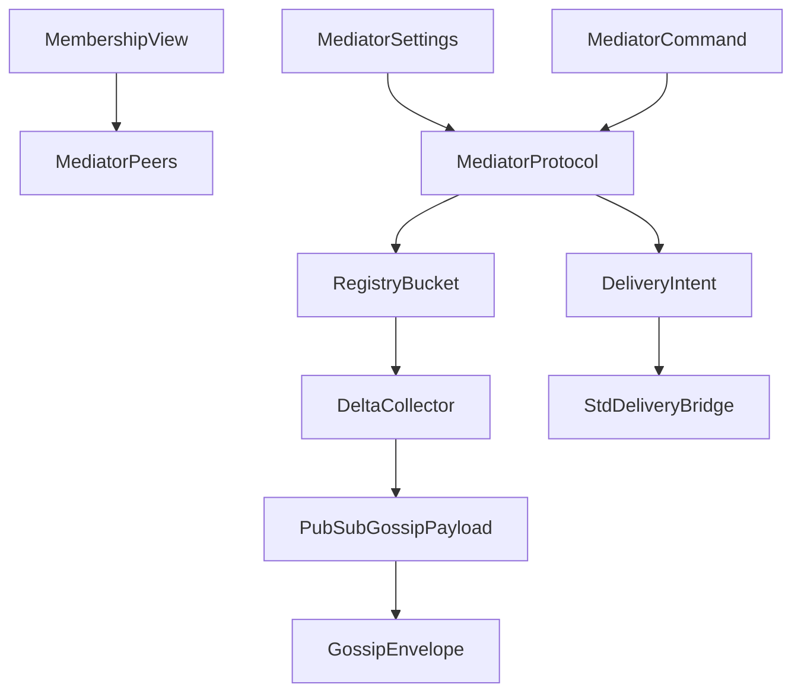
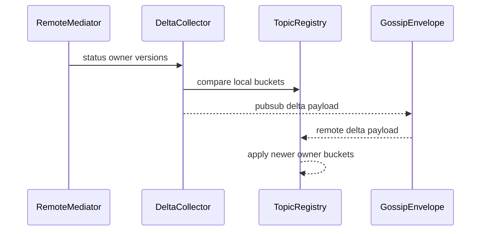
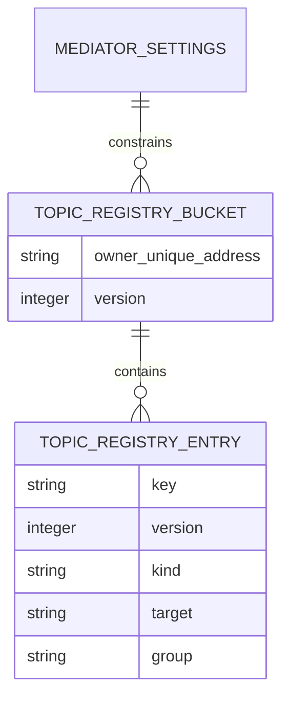

# Design Document

## Overview

この feature は、cluster pub-sub の mediator protocol を core contract として定義し、topic publish、path `Send` / `SendToAll`、settings、topic registry gossip / delta collection を同じ registry model で扱えるようにする。対象ユーザーは fraktor-rs cluster runtime 実装者、std adaptor 実装者、後続の cluster message serialization spec 実装者である。

既存実装には `PubSubBroker`、`ClusterPubSub`、`PubSubApi`、`PubSubDeliveryActor` がある。現在の実装は local topic broker と delivery execution が中心で、Pekko comparison の `DistributedPubSubMediator` command protocol、path registry、settings、bucket status / delta exchange が明示的な contract になっていない。

### Goals

- DistributedPubSubMediator 相当の command / acknowledgement / query protocol を core/pub_sub に定義する。
- `DistributedPubSubSettings` 相当の role、routing、gossip interval、removed TTL、max delta elements、dead-letter behavior を no_std core で扱う。
- `Send` / `SendToAll` を topic publish とは別の path registry semantics として固定する。
- topic / path registry の owner bucket、version、delta collection、removed entry pruning を core contract にする。
- gossip envelope と membership active view を利用しつつ、それらの substrate や decision policy を所有しない。

### Non-Goals

- gossip envelope framing、heartbeat scheduling、transport implementation。
- SplitBrainResolver、DowningStrategy、lease-based majority。
- SeedNodeProcess、generic discovery adapter。
- cluster message serializer framework、Pekko binary compatibility、Distributed Data / CRDT。
- full Pekko public API parity または typed pubsub topic API の再設計。

## Boundary Commitments

### This Spec Owns

- mediator command、acknowledgement、query、delivery intent の protocol shape。
- `DistributedPubSubSettings` 相当の pubsub mediator settings。
- path registry と topic subscription registry の entry semantics。
- `Send` / `SendToAll` / `Publish` の delivery target selection semantics。
- topic registry status / delta collection / removed entry retention。
- pubsub registry payload を gossip substrate に渡すための core-level payload contract。
- `docs/gap-analysis/cluster-gap-analysis.md` の pubsub active follow-up 4項目に対する evidence 更新。

### Out of Boundary

- `GossipEnvelope` の from/to identity、deadline、wire framing、heartbeat payload。
- membership merge、reachability matrix merge、downing decision。
- discovery backend、seed node lifecycle、provider orchestration。
- serializer registry、wire schema、cluster message serializer compatibility。
- std runtime task scheduling、Tokio transport、actual network I/O。

### Allowed Dependencies

- `cluster-membership-reachability-model` の `UniqueAddress`、member role、active / removed member view、reachability evidence。
- `cluster-gossip-heartbeat-protocol` の gossip payload substrate と envelope payload kind extension point。
- 既存 `pub_sub` module の `PubSubTopic`、`PubSubSubscriber`、`PublishRequest`、`PublishAck`、`PubSubError`、`DeliveryPolicy`。
- `fraktor-utils-core-rs` の shared / time abstraction と `alloc` collections。
- std adaptor の `PubSubDeliveryActor` は delivery intent execution のみで core protocol を消費する。

### Revalidation Triggers

- `UniqueAddress`、member role、active member status、removed member semantics が変わる。
- gossip envelope payload kind、deadline、dispatch outcome、status/delta scheduling が変わる。
- `PubSubSubscriber`、actor path、cluster identity の equality / ordering semantics が変わる。
- `PubSubConfig` や existing delivery policy が settings と重複するように拡張される。
- downstream `cluster-message-serialization-contract` が pubsub payload wire schema を定義する。

## Architecture

### Existing Architecture Analysis

`fraktor-cluster-core-kernel-rs` の `pub_sub` module は local broker と delivery policy を持つ。`PubSubBroker` は topic 作成、subscribe / unsubscribe、active subscriber、metrics、topic options を管理し、`PubSubPublisher` と `BatchingProducer` は message serialization と batch delivery に接続する。

`cluster-adaptor-std` の `PubSubDeliveryActor` は serialized batch を actor message へ戻し、local `ActorRef` または `ClusterIdentity` へ送る。これは delivery execution であり、cluster-wide mediator registry や gossip delta semantics は持たない。

### Architecture Pattern & Boundary Map



**Architecture Integration**:
- Selected pattern: core mediator state machine + std delivery bridge。protocol と registry semantics は core、actor delivery execution は std adaptor に置く。
- Domain/feature boundaries: command validation は `MediatorProtocol`、settings は `DistributedPubSubSettings`、path semantics は `PubSubPathSemantics`、registry gossip は `TopicRegistryDeltaCollector` が持つ。
- Existing patterns preserved: `no_std` core、port-and-adapter、1公開型1ファイル、sibling test file、Markdown は日本語、rustdoc は英語。
- New components rationale: existing `PubSubBroker` だけでは owner bucket、path registry、status/delta exchange、removed TTL を表現できないため、mediator protocol と registry delta model を追加する。
- Steering compliance: Tokio、network I/O、host clock、wire codec は std adaptor または downstream serialization spec に残す。

### Technology Stack

| Layer | Choice / Version | Role in Feature | Notes |
|-------|------------------|-----------------|-------|
| Core runtime | Rust 2024 nightly workspace | mediator protocol、settings、registry state、delta collection | `no_std` + `alloc` を維持 |
| Membership input | upstream membership model | active member、role filter、owner identity | merge semantics は所有しない |
| Gossip substrate | upstream gossip envelope | pubsub status / delta payload transport | framing と heartbeat は所有しない |
| Std adaptor | existing std pubsub delivery actor | delivery intent execution | protocol semantics は変更しない |
| Tests | cargo unit / integration tests | protocol、settings、path routing、delta collection、boundary guard | targeted check を優先 |

## File Structure Plan

### Directory Structure

```text
modules/cluster-core-kernel/src/
├── pub_sub.rs                                      # mediator protocol modules の wiring
├── pub_sub/
│   ├── distributed_pub_sub_settings.rs            # role / routing / gossip / retention settings
│   ├── distributed_pub_sub_settings_test.rs       # defaults / validation / max delta tests
│   ├── mediator_command.rs                        # Put / Remove / Subscribe / Publish / Send command
│   ├── mediator_command_test.rs                   # command validation tests
│   ├── mediator_ack.rs                            # SubscribeAck / UnsubscribeAck / query result
│   ├── mediator_delivery_mode.rs                  # Publish / Send / SendToAll delivery mode
│   ├── pub_sub_path.rs                            # canonical path key semantics
│   ├── pub_sub_path_test.rs                       # empty / canonicalization / ordering tests
│   ├── mediator_delivery_intent.rs                # core delivery outcome for std bridge
│   ├── topic_registry_entry.rs                    # path entry / topic subscription entry
│   ├── topic_registry_bucket.rs                   # owner bucket and versioned content
│   ├── topic_registry_bucket_test.rs              # put/remove/version/tombstone tests
│   ├── topic_registry_status.rs                   # owner version map for status exchange
│   ├── topic_registry_delta.rs                    # bounded delta payload
│   ├── topic_registry_delta_collector.rs          # maxDeltaElements and version-order chunking
│   ├── topic_registry_delta_collector_test.rs     # status/delta/chunking/prune tests
│   ├── topic_registry_gossip_payload.rs           # status / delta payload for gossip substrate
│   └── distributed_pub_sub_mediator_state.rs      # command application and delivery selection
```

```text
modules/cluster-adaptor-std/src/
└── pub_sub/
    ├── pub_sub_delivery_actor.rs                  # existing delivery execution bridge
    └── pub_sub_delivery_actor_test.rs             # delivery intent execution tests when needed
```

### Modified Files

- `modules/cluster-core-kernel/src/pub_sub.rs` — mediator protocol、settings、registry gossip 型を公開する。
- `modules/cluster-core-kernel/src/pub_sub/pub_sub_api.rs` — public facade が mediator command / settings を利用できる導線を追加する。
- `modules/cluster-core-kernel/src/pub_sub/cluster_pub_sub.rs` — existing `ClusterPubSub` trait と mediator state の接続点を整理する。
- `modules/cluster-core-kernel/src/pub_sub/pub_sub_error.rs` — settings validation、path validation、ignored delta outcome に必要な error variant を追加する。
- `modules/cluster-adaptor-std/src/pub_sub/pub_sub_delivery_actor.rs` — core delivery intent を実行できる bridge に限定して更新する。
- `docs/gap-analysis/cluster-gap-analysis.md` — pubsub active follow-up 4項目の evidence を更新する。

## System Flows

```mermaid
sequenceDiagram
    participant Actor as LocalActor
    participant Mediator as MediatorProtocol
    participant Registry as TopicRegistryBucket
    Actor->>Mediator: Put path target
    Mediator->>Registry: upsert path entry
    Registry-->>Mediator: bucket version advanced
    Actor->>Mediator: Send path message
    Mediator->>Registry: select matching path entries
    Mediator-->>Actor: delivery intent
```



## Requirements Traceability

| Requirement | Summary | Components | Interfaces | Flows |
|-------------|---------|------------|------------|-------|
| 1.1 | Put が path registry entry を作る | MediatorProtocol, TopicRegistryEntry | mediator command | path send |
| 1.2 | Remove が registry delta になる | MediatorProtocol, TopicRegistryBucket | mediator command | registry gossip |
| 1.3 | Subscribe が ack と topic entry を作る | MediatorProtocol, TopicRegistryEntry | mediator command | registry gossip |
| 1.4 | Unsubscribe が ack と remove delta を作る | MediatorProtocol, TopicRegistryBucket | mediator command | registry gossip |
| 1.5 | Publish が topic delivery intent を作る | MediatorProtocol, DeliveryIntent | mediator command | path send |
| 1.6 | query が registry snapshot を返す | MediatorProtocol | query API | none |
| 2.1 | settings が mediator behavior を保持する | DistributedPubSubSettings | settings constructor | none |
| 2.2 | role filter が gossip target を絞る | MediatorPeers, DistributedPubSubSettings | membership input | registry gossip |
| 2.3 | routing mode が Send に使われる | PubSubPathSemantics | routing mode | path send |
| 2.4 | unsupported routing が configuration error になる | DistributedPubSubSettings | validation | none |
| 2.5 | max delta elements が delta collection を制限する | TopicRegistryDeltaCollector | delta API | registry gossip |
| 2.6 | no-subscriber behavior が dead-letter intent を作る | MediatorProtocol, DeliveryIntent | settings | path send |
| 3.1 | Send が one-of delivery intent を作る | PubSubPathSemantics | mediator command | path send |
| 3.2 | local affinity が local entry を優先する | PubSubPathSemantics | target selection | path send |
| 3.3 | SendToAll が all matching targets を選ぶ | PubSubPathSemantics | mediator command | path send |
| 3.4 | all-but-self が local owner を除外する | PubSubPathSemantics | target selection | path send |
| 3.5 | invalid path/payload が validation failure になる | MediatorCommand | validation | none |
| 3.6 | no matching entry が drop/dead-letter intent になる | MediatorProtocol | delivery intent | path send |
| 4.1 | local mutation が owner bucket version を進める | TopicRegistryBucket | state update | registry gossip |
| 4.2 | status から不足 delta を収集する | TopicRegistryDeltaCollector | status API | registry gossip |
| 4.3 | delta chunk が version order で bounded になる | TopicRegistryDeltaCollector | delta API | registry gossip |
| 4.4 | remove entry が tombstone として残る | TopicRegistryBucket | remove API | registry gossip |
| 4.5 | TTL 満了後に tombstone を prune する | TopicRegistryBucket | prune API | registry gossip |
| 4.6 | unknown owner delta を ignored outcome にする | TopicRegistryDeltaCollector | apply API | registry gossip |
| 5.1 | membership current state で peer set を更新する | MediatorPeers | membership input | registry gossip |
| 5.2 | removed member bucket を候補から外す | MediatorPeers, TopicRegistryBucket | membership input | path send |
| 5.3 | gossip tick が status/delta payload を作る | TopicRegistryGossipPayload | gossip payload | registry gossip |
| 5.4 | gossip envelope framing を所有しない | ScopeGuard | boundary | registry gossip |
| 5.5 | reachability/downing を所有しない | ScopeGuard | boundary | none |
| 6.1 | std adaptor が delivery intent だけ実行する | StdDeliveryBridge | delivery intent | path send |
| 6.2 | serializer framework を定義しない | ScopeGuard | boundary | none |
| 6.3 | core no_std 境界を維持する | ScopeGuard | build boundary | none |
| 6.4 | downing/discovery を downstream に残す | ScopeGuard | boundary | none |
| 6.5 | gap analysis 更新を pubsub 4項目に限定する | GapAnalysisUpdate | docs update | none |

## Components and Interfaces

| Component | Domain/Layer | Intent | Req Coverage | Key Dependencies | Contracts |
|-----------|--------------|--------|--------------|------------------|-----------|
| DistributedPubSubSettings | core/pub_sub | mediator behavior の設定 contract | 2.1, 2.2, 2.3, 2.4, 2.5, 2.6 | Membership view P1 | State |
| MediatorProtocol | core/pub_sub | command validation と delivery intent generation | 1.1, 1.2, 1.3, 1.4, 1.5, 1.6, 3.5, 3.6 | Settings P0, RegistryBucket P0 | Service, State |
| PubSubPathSemantics | core/pub_sub | Send / SendToAll path target selection | 3.1, 3.2, 3.3, 3.4 | RegistryBucket P0 | Service |
| TopicRegistryBucket | core/pub_sub | owner bucket、entry version、tombstone を保持する | 4.1, 4.4, 4.5, 5.2 | UniqueAddress P0 | State |
| TopicRegistryDeltaCollector | core/pub_sub | status comparison、bounded delta、apply outcome | 2.5, 4.2, 4.3, 4.6 | RegistryBucket P0, Settings P0 | Service, Batch |
| TopicRegistryGossipPayload | core/pub_sub + gossip boundary | pubsub status / delta payload を gossip substrate に渡す | 5.3, 5.4 | GossipEnvelope P1 | Event |
| MediatorPeers | core/pub_sub + membership boundary | role filter と active member view から peer set を作る | 2.2, 5.1, 5.2, 5.5 | Membership model P0 | State |
| StdDeliveryBridge | std/pub_sub | core delivery intent を actor delivery として実行する | 6.1 | PubSubDeliveryActor P0 | Service |
| ScopeGuard | spec boundary | 隣接 spec の責務を吸収しない | 5.4, 5.5, 6.2, 6.3, 6.4 | roadmap P0 | Batch |
| GapAnalysisUpdate | docs | pubsub active follow-up 4項目の evidence を更新する | 6.5 | docs/gap-analysis P0 | Batch |

### core/pub_sub

#### DistributedPubSubSettings

| Field | Detail |
|-------|--------|
| Intent | mediator の role、routing、gossip、retention、delta chunking、dead-letter behavior を保持する |
| Requirements | 2.1, 2.2, 2.3, 2.4, 2.5, 2.6 |

**Responsibilities & Constraints**
- role filter は optional で、未指定なら active members 全体を対象にする。
- routing mode は `Send` path delivery の target selection に限定する。
- gossip interval と removed TTL は core では duration value として保持し、host scheduling は持たない。
- max delta elements は `TopicRegistryDeltaCollector` の hard limit とする。

**Dependencies**
- Inbound: `PubSubApi` / `ClusterPubSub` — configuration input (P1)
- Outbound: `MediatorPeers` — role filter evaluation (P0)
- Outbound: `TopicRegistryDeltaCollector` — max delta elements (P0)

**Contracts**: Service [ ] / API [ ] / Event [ ] / Batch [ ] / State [x]

##### State Management
- State model: role, routing mode, gossip interval, removed TTL, max delta elements, no-subscriber behavior。
- Persistence & consistency: runtime persistence を持たず、mediator initialization と tests で観測する。
- Concurrency strategy: immutable value object として扱う。

#### MediatorProtocol

| Field | Detail |
|-------|--------|
| Intent | mediator command を registry mutation、query result、delivery intent に変換する |
| Requirements | 1.1, 1.2, 1.3, 1.4, 1.5, 1.6, 3.5, 3.6 |

**Responsibilities & Constraints**
- `Put` / `Remove` は path registry entry を更新する。
- `Subscribe` / `Unsubscribe` は topic registry entry を更新し、ack を返す。
- `Publish` は topic subscription に基づく delivery intent を生成する。
- invalid path / payload / unsupported settings は typed error として返す。
- no-subscriber behavior は drop または dead-letter intent として表す。

**Dependencies**
- Outbound: `TopicRegistryBucket` — registry mutation (P0)
- Outbound: `PubSubPathSemantics` — path delivery target selection (P0)
- Outbound: `StdDeliveryBridge` — delivery intent consumer (P1)

**Contracts**: Service [x] / API [ ] / Event [x] / Batch [ ] / State [x]

##### Service Interface
```rust
trait DistributedPubSubMediatorProtocol {
  fn apply_command(&mut self, command: MediatorCommand) -> Result<MediatorOutcome, PubSubError>;
  fn on_membership_view(&mut self, view: PubSubMembershipView) -> MediatorPeerUpdate;
  fn on_registry_payload(&mut self, payload: TopicRegistryGossipPayload) -> TopicRegistryApplyOutcome;
}
```
- Preconditions: command は validated path/topic/subscriber を持つ。
- Postconditions: registry mutation は owner bucket version を進め、delivery は intent として返る。
- Invariants: topic entry と path entry は同じ key 空間で衝突しない。

##### Event Contract
- Published events: registry changed、subscribe ack、unsubscribe ack、delivery intent、ignored delta。
- Subscribed events: membership view update、registry status / delta payload。
- Ordering / delivery guarantees: local mutation order は owner bucket version で表現する。

#### PubSubPathSemantics

| Field | Detail |
|-------|--------|
| Intent | `Send` / `SendToAll` の path target selection を topic publish から分離する |
| Requirements | 3.1, 3.2, 3.3, 3.4 |

**Responsibilities & Constraints**
- canonical path key で matching path entry を検索する。
- `Send` は settings routing mode に従って one-of target を選ぶ。
- local affinity は local owner entry を優先するが、存在しない場合は cluster-wide candidates を使う。
- `SendToAll` は all-but-self の場合に local owner を除外する。

**Dependencies**
- Inbound: `MediatorProtocol` — command execution (P0)
- Outbound: `TopicRegistryBucket` — path entry lookup (P0)

**Contracts**: Service [x] / API [ ] / Event [ ] / Batch [ ] / State [ ]

##### Service Interface
```rust
trait PubSubPathSelector {
  fn select_send_target(&self, input: SendPathInput) -> Result<DeliveryIntent, PubSubError>;
  fn select_send_to_all_targets(&self, input: SendToAllPathInput) -> Result<DeliveryIntent, PubSubError>;
}
```
- Preconditions: path は空でなく canonical key に変換済み。
- Postconditions: selected targets は path entry に限定される。
- Invariants: topic subscription entry は path selection に混入しない。

#### TopicRegistryBucket

| Field | Detail |
|-------|--------|
| Intent | owner ごとの topic / path registry content と version を保持する |
| Requirements | 4.1, 4.4, 4.5, 5.2 |

**Responsibilities & Constraints**
- owner は `UniqueAddress` を使う。
- entry は path registration、topic subscription、removed tombstone を区別する。
- local mutation ごとに monotonic version を進める。
- removed entry は TTL と convergence rule に従って prune する。

**Dependencies**
- External: membership `UniqueAddress` — owner identity (P0)
- Inbound: `MediatorProtocol` — mutation (P0)
- Outbound: `TopicRegistryDeltaCollector` — status / delta generation (P0)

**Contracts**: Service [ ] / API [ ] / Event [ ] / Batch [ ] / State [x]

##### State Management
- State model: owner, bucket version, sorted entries, entry version, entry kind。
- Persistence & consistency: persistent storage は持たず、gossip delta で peer と同期する。
- Concurrency strategy: `&mut self` mutation と value snapshot を基本にする。

#### TopicRegistryDeltaCollector

| Field | Detail |
|-------|--------|
| Intent | registry status comparison と bounded delta collection を提供する |
| Requirements | 2.5, 4.2, 4.3, 4.6 |

**Responsibilities & Constraints**
- peer status の owner version map と local buckets を比較する。
- max delta elements を超えない chunk を version order で生成する。
- unknown owner、removed member、stale version は ignored outcome にする。
- serializer payload shape は定義せず、core data contract だけを扱う。

**Dependencies**
- Inbound: `MediatorProtocol` / gossip tick — status request (P0)
- Outbound: `TopicRegistryGossipPayload` — status / delta payload (P0)
- External: membership active owner set — accepted owner validation (P0)

**Contracts**: Service [x] / API [ ] / Event [ ] / Batch [x] / State [ ]

##### Batch / Job Contract
- Trigger: registry gossip tick または remote status reception。
- Input / validation: peer owner versions、active owner set、settings max delta elements。
- Output / destination: `TopicRegistryGossipPayload::Status` または `Delta`。
- Idempotency & recovery: stale delta apply は ignored outcome とし、新しい bucket version だけを反映する。

#### TopicRegistryGossipPayload

| Field | Detail |
|-------|--------|
| Intent | gossip substrate が運べる pubsub registry status / delta payload を表す |
| Requirements | 5.3, 5.4 |

**Responsibilities & Constraints**
- payload kind は pubsub registry status と pubsub registry delta を区別する。
- registry version と owner bucket versions を保持する。
- `GossipEnvelope` の identity、deadline、wire framing は所有しない。

**Dependencies**
- Outbound: upstream `GossipEnvelope` payload kind extension point (P1)
- Inbound: `TopicRegistryDeltaCollector` — payload creation (P0)

**Contracts**: Service [ ] / API [ ] / Event [x] / Batch [x] / State [ ]

##### Event Contract
- Published events: pubsub registry status, pubsub registry delta。
- Subscribed events: remote status, remote delta。
- Ordering / delivery guarantees: registry entry order は bucket version と entry version で決まる。

#### MediatorPeers

| Field | Detail |
|-------|--------|
| Intent | membership view から mediator peer set と accepted owner set を導出する |
| Requirements | 2.2, 5.1, 5.2, 5.5 |

**Responsibilities & Constraints**
- role filter と active member status を使って peer set を作る。
- removed / downed / left member の bucket を delivery candidate から外す。
- reachability evidence は delivery candidate evaluation の入力としてだけ読む。
- membership merge、reachability update、downing decision は行わない。

**Dependencies**
- External: membership current state and reachability snapshot (P0)
- Outbound: `TopicRegistryDeltaCollector` — accepted owner validation (P0)
- Outbound: `PubSubPathSemantics` — local owner / remote owner filtering (P0)

**Contracts**: Service [ ] / API [ ] / Event [ ] / Batch [ ] / State [x]

### std/pub_sub

#### StdDeliveryBridge

| Field | Detail |
|-------|--------|
| Intent | core delivery intent を std actor delivery として実行する |
| Requirements | 6.1 |

**Responsibilities & Constraints**
- `DeliveryIntent` の target と payload を既存 `PubSubDeliveryActor` / delivery endpoint へ渡す。
- core が決めた `Send` / `SendToAll` / `Publish` semantics を変更しない。
- serializer framework や wire compatibility は定義しない。

**Dependencies**
- Inbound: `MediatorProtocol` delivery intent (P0)
- Outbound: `PubSubDeliveryActor` — actual actor delivery (P0)
- External: actor serialization extension — existing message conversion (P1)

**Contracts**: Service [x] / API [ ] / Event [ ] / Batch [ ] / State [ ]

##### Service Interface
```rust
trait PubSubDeliveryIntentExecutor {
  fn execute(&mut self, intent: MediatorDeliveryIntent) -> Result<DeliveryReport, PubSubError>;
}
```
- Preconditions: intent は core protocol で validation 済み。
- Postconditions: delivery result は `DeliveryReport` として返る。
- Invariants: std 側は target selection を再計算しない。

## Data Models

### Domain Model

- `MediatorCommand`: `Put`、`Remove`、`Subscribe`、`Unsubscribe`、`Publish`、`Send`、`SendToAll`、query command。
- `MediatorOutcome`: ack、query result、registry mutation、delivery intent、dead-letter intent、ignored outcome。
- `DistributedPubSubSettings`: role、routing mode、gossip interval、removed TTL、max delta elements、no-subscriber behavior。
- `TopicRegistryBucket`: owner、bucket version、entries。
- `TopicRegistryEntry`: path registration、topic subscription、removed tombstone。
- `TopicRegistryGossipPayload`: status owner versions、bounded delta buckets。

### Logical Data Model



**Consistency & Integrity**
- owner bucket version は local owner の mutation order を表す。
- entry key は path registration と topic subscription で namespace を分ける。
- removed tombstone は older delta による resurrection を防ぐ。
- active owner set に含まれない owner delta は ignored outcome にする。

## Error Handling

- invalid path、empty topic、unsupported routing mode、invalid max delta elements は `PubSubError` の typed variant として扱う。
- stale delta、unknown owner、removed owner delta は failure ではなく ignored outcome として観測可能にする。
- no-subscriber delivery は settings に従い drop または dead-letter intent にする。
- std delivery failure は existing `DeliveryReport` / `DeliveryStatus` で返し、core registry state を直接変更しない。

## Testing Strategy

- `distributed_pub_sub_settings_test.rs`: default settings、unsupported routing、max delta validation、dead-letter behavior。
- `mediator_command_test.rs`: Put / Remove / Subscribe / Unsubscribe / Publish / query command の validation と ack。
- `pub_sub_path_test.rs`: `Send` local affinity、`SendToAll` all-but-self、invalid path、no matching target。
- `topic_registry_bucket_test.rs`: owner bucket version、entry variant、remove tombstone、TTL prune。
- `topic_registry_delta_collector_test.rs`: status comparison、max delta chunking、unknown owner ignored outcome、stale delta。
- std adaptor test: `DeliveryIntent` を existing `PubSubDeliveryActor` が実行し、target selection を再計算しないこと。
- integration / no_std check: `cluster-core-kernel` が std 直接依存を増やさないこと。

## Security and Performance Considerations

- registry delta は max delta elements で bounded にし、過大 payload を core contract で防ぐ。
- unknown owner delta を ignored outcome にすることで removed member の registry resurrection を防ぐ。
- role filter は operator が意図しない mediator peer を gossip target に含めないための境界として扱う。
- delivery payload serialization は既存 actor serialization extension と downstream serializer spec に委譲し、この仕様で binary compatibility を約束しない。

## Integration & Migration Notes

- 既存 `PubSubBroker` は local topic state と metrics の実装資産として再利用する。
- `ClusterPubSub` trait は mediator command を受ける facade として段階的に拡張する。
- `PubSubDeliveryActor` は delivery execution bridge に留め、registry gossip や target selection を移さない。
- `docs/gap-analysis/cluster-gap-analysis.md` は実装完了時に pubsub active follow-up 4項目だけ evidence 更新する。

## Open Questions / Risks

- actor path canonicalization を actor-core のどの型に寄せるかは実装時に確認する。
- downstream serializer spec が pubsub payload wire schema を定義するとき、`TopicRegistryGossipPayload` の field naming を再検証する。
- existing `DeliveryPolicy` と mediator routing mode の語彙が重複する場合、path `Send` 用 routing mode と topic delivery policy を混ぜないようにする。
