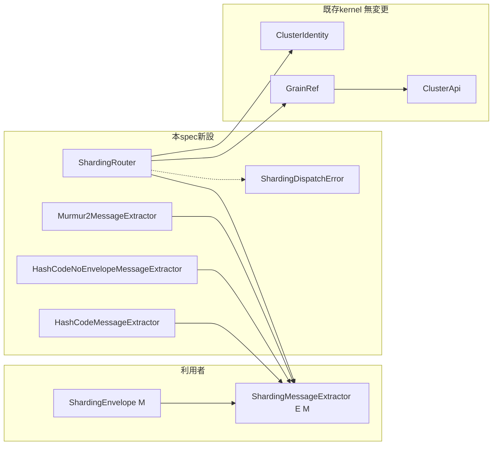
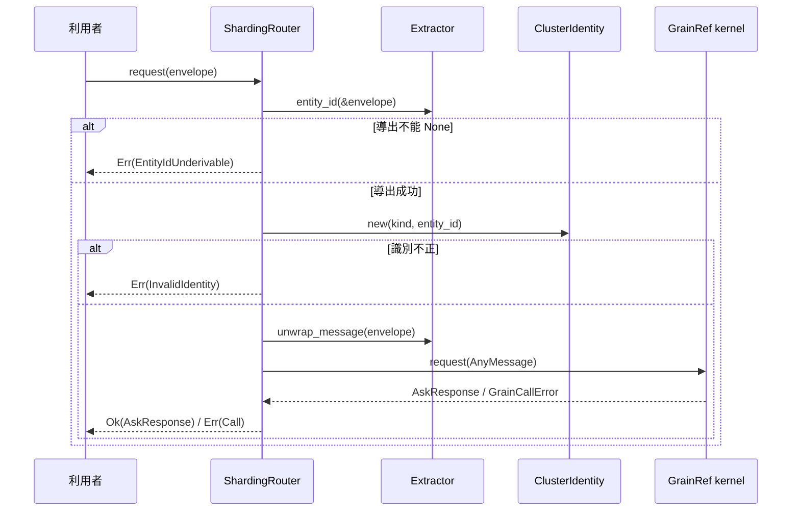

# 設計ドキュメント

## 概要

**Purpose（目的）**: 本機能は grain 利用者に、メッセージから宛先（entity id / shard id）を導出する差し替え可能な抽出契約と、その標準実装群（HashCode / HashCodeNoEnvelope / Kafka 互換 Murmur2）を提供する。

**Users（ユーザー）**: grain を使う actor アプリケーション開発者が、宛先の明示構築を繰り返す代わりにルーティング規則を一箇所で宣言し、envelope ベースの送信に再利用する。後続の shard allocation spec は本契約の shard id 導出を入力として利用する。

**Impact（影響）**: 現在の「呼び出し元が `ClusterIdentity` を毎回明示構築する」設計に、extractor 経由の解決・送信経路（`ShardingRouter`）を**追加**する。既存の grain 配送経路・placement 決定・serialization 契約は一切変更しない。

### 目標

- Pekko `ShardingEnvelope[M]` / `ShardingMessageExtractor[E, M]` 相当の最小契約を `cluster-core-kernel` の grain パッケージに定義する
- HashCode（envelope あり / なし）と Kafka 互換 Murmur2 の標準実装を pure な計算として提供する
- extractor 経由で既存 `GrainRef` に合流する接続点を提供し、明示構築経路と同一の宛先解決を保証する

### 非目標

- shard id に基づく配置決定・shard allocation / rebalance（後続 spec の責務。本 spec は shard id を「導出できる」契約まで）
- `ClusterShardingSettings` 相当の包括設定契約
- wire serialization の変更、placement（ノード選択）規則の変更、activation / passivation
- typed facade（cluster-core-typed）への typed envelope / typed router の追加（kernel 契約で要件を満たせるため本 spec では行わない）

## 境界コミットメント

### このスペックが所有するもの

- envelope 表現（`ShardingEnvelope<M>`: entity id + 内部メッセージ）の契約
- extractor 契約（`ShardingMessageExtractor<E, M>`: entity id 導出 / shard id 導出 / 内部メッセージ取り出し）
- 標準実装群（`HashCodeMessageExtractor` / `HashCodeNoEnvelopeMessageExtractor` / `Murmur2MessageExtractor`）とそのハッシュ仕様の固定
- 接続点 `ShardingRouter`（kind + extractor から `ClusterIdentity` を導出し既存 `GrainRef` へ委譲する合成点）と専用エラー `ShardingDispatchError`

### 境界外

- shard id を消費する配置決定（shard allocation / rebalance — gap analysis Phase 3）
- placement（`RendezvousHasher` / `PlacementCoordinatorCore`）の決定規則
- `SerializedMessage` / `GrainCodec` / wire format（cluster-message-serialization-contract が所有）
- typed 層の envelope / router wrapper（必要になった時点で別 spec として cluster-core-typed に追加）
- grain の activation / passivation / lifecycle

### 許可する依存

- `cluster-core-kernel` 内部: `ClusterIdentity`（識別の正本・検証規則）、`GrainRef`（送信実行の正本）、`ClusterApi`（解決基盤）、`GrainCallError`
- `alloc`（String / Box）— no_std で完結し、std / host 機能には依存しない
- 逆方向依存の禁止: 既存の `GrainRef` / `ClusterApi` / placement が本 spec の新型に依存してはならない

### 再検証トリガー

- `ShardingMessageExtractor` の操作シグネチャ（3操作・Option 契約）の変更 → 後続 allocation spec と利用側の再検証
- 標準実装のハッシュ仕様（FNV-1a 定数・Murmur2 定数）の変更 → shard 割当の互換性再検証
- `ClusterIdentity` の検証規則変更（上流） → `ShardingRouter` の識別導出の再検証
- envelope の形状変更 → extractor 全実装と利用側の再検証

## アーキテクチャ

### 既存アーキテクチャ分析

- 現状の宛先決定: 呼び出し元 → `ClusterIdentity::new(kind, entity_id)` → `GrainRef::new(api, identity)` → tell / request。メッセージからの抽出規則は存在しない（research.md 参照）
- `GrainRpcRouter` は解決済み `GrainKey` を受け取る配送機構であり、本 spec は触れない
- 維持する統合ポイント: `GrainRef` の送信面（tell_with_sender / request / request_future / with_options / with_codec）が送信実行の正本

### アーキテクチャパターンと境界マップ



**Architecture Integration（アーキテクチャ統合）**:
- 採用パターン: SPI（trait 契約）+ 合成点。抽出規則は trait に、送信実行は既存 `GrainRef` に残し、`ShardingRouter` が両者を合成する
- ドメイン／機能境界: 「どの entity / shard か」（本 spec）と「どのノードに置くか」（placement / allocation）を分離
- 維持する既存パターン: 1公開型1ファイル、sibling テスト、エラー型の独立ファイル、kernel の no_std + alloc
- 新規コンポーネントの根拠: extractor trait は差し替え点そのもの。Router は既存経路を無変更に保つための追加合成点。専用エラーは既存 `GrainCallError` の網羅 match を壊さないため
- ステアリング準拠: port-first（trait が port、標準実装と Router が同 crate 内の実装）、参照実装の命名優先（Pekko の型名を踏襲）

### 技術スタック

| レイヤー | 選択／バージョン | 機能内での役割 | メモ |
|-------|------------------|-----------------|-------|
| cluster-core-kernel | 既存 crate（no_std + alloc） | 全新型の追加先 | 新規外部依存なし |
| ハッシュ | in-repo 実装（FNV-1a 32bit / Murmur2） | 標準実装の shard id 導出 | build vs adopt は research.md 参照 |

## ファイル構造計画

### ディレクトリ構造

```
modules/cluster-core-kernel/src/grain/
├── sharding_envelope.rs                        # 新規: ShardingEnvelope<M>
├── sharding_envelope_test.rs                   # 新規: sibling テスト
├── sharding_message_extractor.rs               # 新規: trait ShardingMessageExtractor<E, M>
├── sharding_message_extractor_test.rs          # 新規: sibling テスト（利用者定義実装の受け入れ検証）
├── hash_code_message_extractor.rs              # 新規: HashCode 標準実装（+ 固定 FNV-1a 仕様）
├── hash_code_message_extractor_test.rs         # 新規: sibling テスト
├── hash_code_no_envelope_message_extractor.rs  # 新規: envelope なし標準実装
├── hash_code_no_envelope_message_extractor_test.rs # 新規: sibling テスト
├── murmur2_message_extractor.rs                # 新規: Kafka 互換 Murmur2 標準実装（murmur2 fn は private）
├── murmur2_message_extractor_test.rs           # 新規: Kafka リファレンスベクタテスト
├── sharding_router.rs                          # 新規: ShardingRouter（接続点）
├── sharding_router_test.rs                     # 新規: sibling テスト（fixture は grain_ref_test.rs を踏襲）
├── sharding_dispatch_error.rs                  # 新規: ShardingDispatchError（エラー型は独立ファイル）
└── sharding_extractor_config_error.rs          # 新規: ShardingExtractorConfigError（構築時検証エラー、標準実装のテストで検証）
```

### 変更対象ファイル

- `modules/cluster-core-kernel/src/grain.rs` — 新規 mod 宣言と最小 pub use の追加のみ（module-wiring-lint 準拠）

## システムフロー



- 失敗系: 導出不能は `ShardingDispatchError::EntityIdUnderivable`、識別不正は `InvalidIdentity(ClusterIdentityError)`、解決・送信・符号化の失敗は `Call(GrainCallError)` をそのまま包んで伝搬する（新しい失敗種別を `GrainCallError` に追加しない）

## 要件トレーサビリティ

| 要件 | 要約 | コンポーネント | インターフェース | フロー |
|------|---------|------------|------------|-------|
| 1.1 | entity id + 内部メッセージの保持 | ShardingEnvelope<M> | `new` / フィールド | — |
| 1.2 | 構築時の値の参照 | ShardingEnvelope<M> | `entity_id()` / `message()` | — |
| 1.3 | 内部メッセージの型保持 | ShardingEnvelope<M> | 型パラメータ `M` | — |
| 2.1 | entity id 導出 | ShardingMessageExtractor | `entity_id` | 送信フロー |
| 2.2 | shard id 導出 | ShardingMessageExtractor | `shard_id` | — |
| 2.3 | 内部メッセージ取り出し | ShardingMessageExtractor | `unwrap_message` | 送信フロー |
| 2.4 | 利用者定義規則の受け入れ | ShardingMessageExtractor（trait） | trait 実装 | — |
| 2.5 | 導出不能の識別 | ShardingMessageExtractor | `entity_id -> Option` | 失敗系 |
| 3.1 | HashCode 実装 | HashCodeMessageExtractor | `new(number_of_shards)` | — |
| 3.2 | envelope なし実装 | HashCodeNoEnvelopeMessageExtractor | `new(number_of_shards, extract_fn)` | — |
| 3.3 | Murmur2 実装 | Murmur2MessageExtractor | `new(number_of_shards)` | — |
| 3.4 | Kafka リファレンス一致 | Murmur2MessageExtractor | 参照ベクタテスト | — |
| 3.5 | 決定性 | 標準実装 3 種 | 固定ハッシュ仕様 | — |
| 3.6 | 環境非依存 | 標準実装 3 種 | pure 計算（no_std） | — |
| 4.1 | extractor 経由の宛先解決 | ShardingRouter | `grain_ref_for` / 送信 3 操作 | 送信フロー |
| 4.2 | 明示構築との同一宛先 | ShardingRouter | `ClusterIdentity::new` への合流 | — |
| 4.3 | 導出不能の送信拒否 | ShardingRouter / ShardingDispatchError | `Err(EntityIdUnderivable)` | 失敗系 |
| 4.4 | 既存送信手段の維持 | 全体 | GrainRef 公開面の不変 | — |
| 5.1 | 既存配送契約の維持 | 全体 | kernel 既存ファイル差分なし（grain.rs 配線のみ） | — |
| 5.2 | placement 不変 | 全体 | RendezvousHasher / PlacementCoordinator 無変更 | — |
| 5.3 | allocation 不先取り | 全体 | shard id の消費側を導入しない | — |
| 5.4 | serialization 不変 | 全体 | SerializedMessage / GrainCodec 無変更 | — |

## コンポーネントとインターフェース

| コンポーネント | ドメイン／レイヤー | 意図 | 要件カバー範囲 | 主要依存 (P0/P1) | 契約 |
|-----------|--------------|--------|--------------|--------------------------|-----------|
| ShardingEnvelope<M> | kernel/grain | entity id + 内部メッセージの組 | 1.1–1.3 | なし | Service |
| ShardingMessageExtractor<E, M> | kernel/grain | 宛先導出の差し替え契約 | 2.1–2.5 | なし | Service |
| HashCode / NoEnvelope / Murmur2 実装 | kernel/grain | 標準ルーティング規則 | 3.1–3.6 | ShardingEnvelope (P1) | Service |
| ShardingRouter | kernel/grain | 抽出と送信実行の合成点 | 4.1–4.3 | Extractor (P0), ClusterIdentity (P0), GrainRef (P0) | Service |
| ShardingDispatchError | kernel/grain | 接続点の失敗種別 | 4.3 | GrainCallError (P0) | Service |

### kernel / grain

#### ShardingEnvelope<M>

| 項目 | 詳細 |
|-------|--------|
| 意図 | 宛先 entity id と内部メッセージを組で運ぶ（Pekko `ShardingEnvelope[M]` 相当） |
| 要件 | 1.1, 1.2, 1.3 |

**責務と制約**
- entity id（String）と内部メッセージ（M）の保持・参照のみ。検証は持たない（識別の検証は `ClusterIdentity::new` の責務）
- `M` の型パラメータで内部メッセージの型を保持する（1.3）

**契約種別**: Service [x]

##### サービスインターフェース

```rust
pub struct ShardingEnvelope<M> {
  entity_id: String,
  message:   M,
}

impl<M> ShardingEnvelope<M> {
  pub fn new(entity_id: impl Into<String>, message: M) -> Self;
  pub fn entity_id(&self) -> &str;
  pub fn message(&self) -> &M;
  pub fn into_message(self) -> M;
}
```

- Postconditions: `entity_id()` / `message()` は構築時に与えた値を返す（1.2）

#### ShardingMessageExtractor<E, M>

| 項目 | 詳細 |
|-------|--------|
| 意図 | メッセージ E から entity id / shard id / 内部メッセージ M を導出する差し替え契約（Pekko `ShardingMessageExtractor[E, M]` 相当） |
| 要件 | 2.1, 2.2, 2.3, 2.4, 2.5 |

**責務と制約**
- 3 操作のみの薄い契約。状態を持つ実装も可（shard 数等の設定値）
- 導出は pure（host 機能・ノード状態に依存しない）
- shard id は `String`（Pekko parity。根拠は research.md）

**契約種別**: Service [x]

##### サービスインターフェース

```rust
pub trait ShardingMessageExtractor<E, M>: Send + Sync {
  /// Derives the entity id, or `None` when it cannot be derived.
  fn entity_id(&self, message: &E) -> Option<String>;
  /// Derives the shard id for the given entity id.
  fn shard_id(&self, entity_id: &str) -> String;
  /// Unwraps the inner message.
  fn unwrap_message(&self, message: E) -> M;
}
```

- Preconditions: なし（任意の E を受け付け、導出不能は `None` で表現する — 2.5）
- Invariants: 同一入力に対して同一の導出結果（実装規約として rustdoc に明記 — 3.5, 3.6 の前提）

#### 標準実装群（HashCode / HashCodeNoEnvelope / Murmur2）

| 項目 | 詳細 |
|-------|--------|
| 意図 | ハッシュベースの標準ルーティング規則 | 
| 要件 | 3.1, 3.2, 3.3, 3.4, 3.5, 3.6 |

**責務と制約**
- いずれも `number_of_shards: u32`（> 0）を保持し、`shard_id = (hash(entity_id) % number_of_shards).to_string()` を返す
- `HashCodeMessageExtractor<M>`: `E = ShardingEnvelope<M>`。entity id は envelope から取り出す（常に `Some`）。ハッシュは FNV-1a 32bit（固定仕様を rustdoc に明記）
- `HashCodeNoEnvelopeMessageExtractor<M>`: `E = M`。entity id 導出は構築時に与えられた利用者定義関数（`Box<dyn Fn(&M) -> Option<String> + Send + Sync>`）に委譲。`unwrap_message` は恒等
- `Murmur2MessageExtractor<M>`: `E = ShardingEnvelope<M>`。Kafka `DefaultPartitioner` 互換（`toPositive(murmur2(utf8_bytes)) % n`、seed `0x9747B28C`、m `0x5BD1E995`）。murmur2 関数は同ファイル内 private
- `new(number_of_shards)` は `number_of_shards == 0` を拒否する（構築時検証。`Result` で `ShardCountZero` 相当を返すか panic-free な検証とするかは、kernel 既存の構築検証パターン（`ClusterIdentity::new` が `Result`）に合わせ `Result` とする）

**契約種別**: Service [x]

##### サービスインターフェース

```rust
pub struct HashCodeMessageExtractor<M> { /* number_of_shards */ }
impl<M> HashCodeMessageExtractor<M> {
  pub fn new(number_of_shards: u32) -> Result<Self, ShardingExtractorConfigError>;
}
impl<M> ShardingMessageExtractor<ShardingEnvelope<M>, M> for HashCodeMessageExtractor<M> { /* 3操作 */ }

pub struct HashCodeNoEnvelopeMessageExtractor<M> { /* number_of_shards + extract fn */ }
impl<M> HashCodeNoEnvelopeMessageExtractor<M> {
  pub fn new(
    number_of_shards: u32,
    extract_entity_id: Box<dyn Fn(&M) -> Option<String> + Send + Sync>,
  ) -> Result<Self, ShardingExtractorConfigError>;
}
impl<M> ShardingMessageExtractor<M, M> for HashCodeNoEnvelopeMessageExtractor<M> { /* 3操作 */ }

pub struct Murmur2MessageExtractor<M> { /* number_of_shards */ }
impl<M> Murmur2MessageExtractor<M> {
  pub fn new(number_of_shards: u32) -> Result<Self, ShardingExtractorConfigError>;
}
impl<M> ShardingMessageExtractor<ShardingEnvelope<M>, M> for Murmur2MessageExtractor<M> { /* 3操作 */ }
```

- Postconditions: 同一 (entity_id, number_of_shards) → 同一 shard id（3.5）。Murmur2 は Kafka リファレンスベクタと一致（3.4）
- 補足: 構築時検証エラー `ShardingExtractorConfigError`（`ShardCountZero`）は独立ファイルのエラー型として追加する（エラー型分離ルール）

**Implementation Notes（実装メモ）**
- Validation: Murmur2 の参照ベクタは Kafka `Utils.murmur2` 由来の既知値をテストに焼き込み、出典をコメントに記録（3.4）
- Risks: FNV-1a 定数の暗黙変更 → 既知ベクタの sibling テストで固定

#### ShardingRouter

| 項目 | 詳細 |
|-------|--------|
| 意図 | (kind, extractor) を保持し、メッセージから宛先を導出して既存 `GrainRef` へ委譲する接続点 |
| 要件 | 4.1, 4.2, 4.3 |

**責務と制約**
- 宛先導出（extractor → `ClusterIdentity::new(kind, entity_id)`）と既存 `GrainRef` への委譲のみ。送信実行・リトライ・codec は `GrainRef` が正本
- options / codec の指定は `grain_ref_for` で得た `GrainRef` に対して既存 API（`with_options` / `with_codec`）で行う（送信面を重複させない）
- 既存型（`GrainRef` / `ClusterApi` / `GrainCallError`）に変更を加えない（5.1）

**依存**
- 流出: `ShardingMessageExtractor<E, M>`（P0）、`ClusterIdentity`（P0）、`GrainRef` / `ClusterApi`（P0）

**契約種別**: Service [x]

##### サービスインターフェース

```rust
pub struct ShardingRouter<E, M, X>
where
  X: ShardingMessageExtractor<E, M>, {
  api:       ClusterApi,
  kind:      String,
  extractor: X,
  /* PhantomData<(E, M)> */
}

impl<E, M, X> ShardingRouter<E, M, X>
where
  M: Any + Send + Sync + 'static,
  X: ShardingMessageExtractor<E, M>,
{
  pub fn new(api: ClusterApi, kind: &str, extractor: X) -> Self;
  /// Resolves a grain reference for the given message without sending.
  pub fn grain_ref_for(&self, message: &E) -> Result<GrainRef, ShardingDispatchError>;
  pub fn tell_with_sender(&self, message: E, sender: &ActorRef) -> Result<(), ShardingDispatchError>;
  pub fn request(&self, message: E) -> Result<AskResponse, ShardingDispatchError>;
  pub fn request_future(&self, message: E) -> Result<ActorFutureShared<AskResult>, ShardingDispatchError>;
}
```

- Preconditions: `ClusterApi` 取得済み（= cluster 拡張導入済み）
- Postconditions: `grain_ref_for` の結果は `GrainRef::new(api.clone(), ClusterIdentity::new(kind, extractor.entity_id(message)))` と同値（4.2）。導出不能は `Err(EntityIdUnderivable)`、識別不正は `Err(InvalidIdentity)`（4.3）
- Invariants: 同一 (kind, entity id) は明示構築経路と同一の grain 宛先（4.2）

**Implementation Notes（実装メモ）**
- Integration: 送信 3 操作は導出 → unwrap → `AnyMessage::new` → 既存 `GrainRef` 同名操作への委譲
- Validation: 明示構築との宛先一致は `grain_ref_for(...).identity()` の比較で sibling テスト検証（4.2）
- Risks: GrainRef と似た送信面を持つことによる責務混同 → rustdoc で「導出 + 委譲のみ。送信の正本は GrainRef」と明記

#### ShardingDispatchError

| 項目 | 詳細 |
|-------|--------|
| 意図 | 接続点の失敗種別（導出不能 / 識別不正 / 呼び出し失敗） |
| 要件 | 4.3 |

```rust
pub enum ShardingDispatchError {
  /// Entity id could not be derived from the message.
  EntityIdUnderivable,
  /// Derived identity was rejected by the kernel validation rules.
  InvalidIdentity(ClusterIdentityError),
  /// Underlying grain call failed.
  Call(GrainCallError),
}
```

- 既存 `GrainCallError` には variant を追加しない（5.1）

## データモデル

本 spec は永続データを持たない。ドメインモデルは envelope（値オブジェクト）と extractor（規則）のみで、上記コンポーネント定義が全てである。

## エラーハンドリング

| 段 | エラー型 | 発生条件 |
|----|---------|---------|
| 構築 | `ShardingExtractorConfigError::ShardCountZero` | shard 数 0 の標準実装構築 |
| 導出 | `ShardingDispatchError::EntityIdUnderivable` | extractor が `None` を返す（2.5, 4.3） |
| 識別 | `ShardingDispatchError::InvalidIdentity` | 導出された entity id / kind が既存検証規則で不正 |
| 呼び出し | `ShardingDispatchError::Call(GrainCallError)` | 解決・送信・符号化の失敗（既存契約をそのまま包む） |

## テスト戦略

- Unit Tests（sibling `*_test.rs`）:
  - `sharding_envelope_test.rs`: 構築値の参照一致（1.1, 1.2）
  - `sharding_message_extractor_test.rs`: 利用者定義 extractor（テストローカル実装）が trait 経由で 3 操作を提供できる（2.1–2.4）、導出不能の `None`（2.5）
  - `hash_code_message_extractor_test.rs`: envelope からの導出（3.1）、決定性（同一入力 → 同一 shard id、3.5）、shard 数 0 の拒否、既知ベクタによるハッシュ仕様固定
  - `hash_code_no_envelope_message_extractor_test.rs`: 利用者定義導出の適用と同一 shard 規則（3.2）、導出不能の伝搬
  - `murmur2_message_extractor_test.rs`: Kafka リファレンスベクタとの一致（3.3, 3.4）、決定性（3.5, 3.6）
  - `sharding_router_test.rs`: extractor 経由の解決が明示構築と同一宛先（4.1, 4.2）、導出不能・識別不正の拒否（4.3）、送信 3 操作の委譲（fixture は `grain_ref_test.rs` の system fixture を踏襲）
- 非回帰:
  - kernel 既存テストが無変更で green（5.1, 5.2, 5.4）
  - 既存ファイルの差分が `grain.rs`（配線）のみであることを diff で確認（5.1）
  - shard id を消費する配置決定コードを導入していないことを確認（5.3）

## 性能とスケーラビリティ

- extractor は送信ごとの軽量な pure 計算（ハッシュ 1 回 + 文字列構築）であり、既存経路への性能影響はない（extractor 未使用経路は完全に不変）

## Pekko 対応表

| Pekko | fraktor |
|-------|---------|
| `ShardingEnvelope[M]` | `ShardingEnvelope<M>` |
| `ShardingMessageExtractor[E, M]` | `ShardingMessageExtractor<E, M>` |
| `HashCodeMessageExtractor[M]` | `HashCodeMessageExtractor<M>` |
| `HashCodeNoEnvelopeMessageExtractor[M]` | `HashCodeNoEnvelopeMessageExtractor<M>` |
| `Murmur2MessageExtractor[M]` | `Murmur2MessageExtractor<M>` |
| sharding region 入口での extractor 適用 | `ShardingRouter`（既存 `GrainRef` への合成点） |
