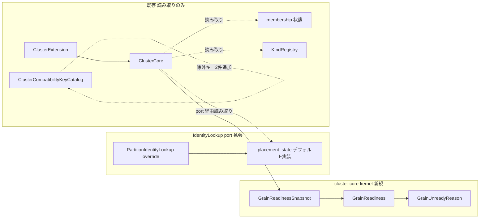
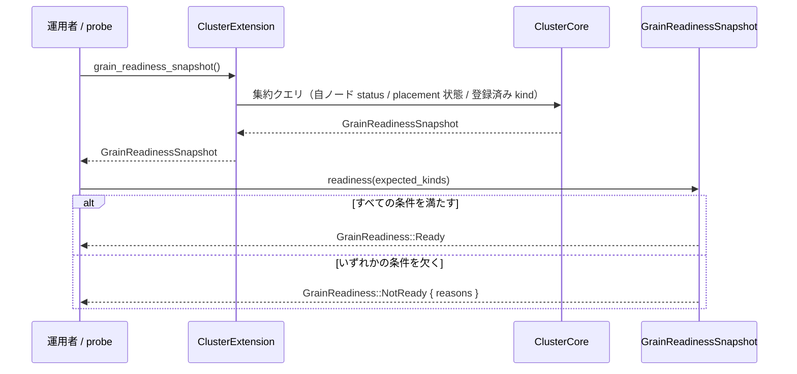

# 設計ドキュメント

## 概要

**Purpose（目的）**: 本機能はクラスタ運用者に、(1) grain runtime がトラフィックを受けられる状態かを導出する純粋な readiness 判定契約とその公開手段（core の読み取りアクセサ）、(2) grain / placement 領域の join 互換キーの目録整備（比較対象外設定の除外理由の明示）を提供する。

**Users（ユーザー）**: クラスタ運用者が readiness probe / ロードバランサの判断材料として判定を呼び出す（core API は std を含むホスト環境からそのまま利用できる）。join 互換チェックの利用者は、目録から grain / placement 設定の比較範囲（現状は理由付きで全て対象外）を確認できる。

**Impact（影響）**: 現在「readiness の集約 view が存在しない」「目録に grain / placement 領域のキーが存在しない」状態に、純粋判定の3型・`IdentityLookup` port の読み取りクエリ・extension の読み取りアクセサ・除外キー2件を**追加**する。既存の placement / activation / join 評価の挙動は一切変更しない。ホスト層（adaptor-std）には何も追加しない（core が契約を定義しホスト層が従う依存方向の原則。core を呼ぶだけの便宜層は作らない）。

### 目標

- Pekko `ClusterShardingHealthCheck` 相当の readiness 判定を「入力スナップショット + pure クエリ」として `cluster-core-kernel` に定義する
- 判定入力の写しを構築する読み取りアクセサを `ClusterExtension` に提供し、std を含むホスト環境から1呼び出しで利用できるようにする
- placement 調整状態の観測を `IdentityLookup` port のデフォルト実装付きクエリとして追加する（既存実装は無変更）
- `ClusterCompatibilityKeyCatalog` に grain / placement 領域の除外キーを理由付きで登録する（Pekko `JoinConfigCompatCheckSharding` の現状 fraktor における正直な対応）

### 非目標

- required な join 比較の追加（config 所有化とともに Phase 2 の包括設定契約スペックが行う）
- HTTP 等の probe endpoint 実装（公開アクセサまで。endpoint 配線は利用者責務）
- adaptor-std への便宜ラッパー（core API を呼ぶだけの std 層は依存方向の原則に反するため設けない）
- sticky な health check 状態機械（Pekko の「一度 ready なら以後 ready」は状態を持つため、必要なら呼び出し側で実現する）
- membership 状態の忠実度向上（現状の core は在籍メンバーを Up と報告する。判定は入力駆動なので、忠実度が将来向上すれば判定はそのまま追従する）
- liveness 判定、metrics、placement / activation の挙動変更

## 境界コミットメント

### このスペックが所有するもの

- readiness 判定の契約: 入力スナップショット（`GrainReadinessSnapshot`）、判定結果（`GrainReadiness`）、原因種別（`GrainUnreadyReason`）と判定規則の固定仕様
- `IdentityLookup` port の placement 状態読み取りクエリ（デフォルト実装付き `placement_state()`）と `PartitionIdentityLookup` の override
- スナップショット構築の読み取りアクセサ（`ClusterExtension::grain_readiness_snapshot` と `ClusterCore` の集約クエリ）
- 目録上の grain / placement 領域の除外キー2件とその理由文

### 境界外

- join 互換の合成評価ロジック（`JoinCompatibilityComposition` / `check_join_compatibility` — 無変更で利用）
- `PartitionIdentityLookupConfig` の config 所有化と required key の追加（Phase 2）
- membership / placement の状態遷移規則（読み取りのみ）
- membership 状態の忠実度（`current_cluster_state_snapshot` が在籍メンバーを Up と報告する現状の改善は別スコープ）
- probe endpoint・HTTP サーバ・ヘルスチェックフレームワーク統合
- adaptor-std への追加（本 spec の成果物は core で完結する）

### 許可する依存

- `cluster-core-kernel` 内部: `NodeStatus` / `CurrentClusterState`（membership）、`PlacementCoordinatorState` / `IdentityLookup`（activation）、`KindRegistry`（grain）、`ClusterCompatibilityKey`（topology）
- 逆方向依存の禁止: 既存の membership / placement / join 評価コードが本 spec の新型に依存してはならない。ホスト層（adaptor-std）から core を呼ぶだけの便宜層を新設してはならない（dylint で強制される依存方向の原則）

### 再検証トリガー

- `NodeStatus` / `PlacementCoordinatorState` の variant 追加・意味変更 → readiness 判定規則（稼働状態・解決可能状態の集合）の再検証
- 互換キー目録の構造変更（配列・アクセサ） → 除外キー登録の再検証
- Phase 2 で required key を追加するとき → 除外キーとの名前空間整合（`cluster.sharding.*`）の再検証

## アーキテクチャ

### 既存アーキテクチャ分析

- 判定入力の所在: kind 登録状態は `KindRegistry::contains` / `all`（`&self`）で観測可能。自ノードの membership 状態は `ClusterCore::current_cluster_state_snapshot()` の自ノード record から取得する（現状の実装は在籍メンバーを `Up` と報告するため、実質「topology 上の在籍」を反映する。判定は入力駆動なので忠実度向上に自動追従する）。placement 調整状態（`PlacementCoordinatorState`）は `PartitionIdentityLookup` 内部の `PlacementCoordinatorCore::state()` に隠れており、`IdentityLookup` trait は公開していない — 本 spec が port にデフォルト実装付きクエリを追加する
- `ClusterExtension` には core への薄い読み取りアクセサの先行例（`virtual_actor_count`）がある
- 目録は `REQUIRED_KEYS` / `CONDITIONAL_KEYS` / `EXCLUDED_KEYS` の3配列 + `excluded_keys()` 等のアクセサで、excluded key は合成評価に参加しない

### アーキテクチャパターンと境界マップ



**Architecture Integration（アーキテクチャ統合）**:
- 採用パターン: 値オブジェクト + pure クエリ（判定）、port のデフォルト実装付きクエリ（placement 状態の観測）、読み取りアクセサ（公開手段）、目録追加（join compat）
- ドメイン／機能境界: 「状態の写しを作る」（core の集約クエリ + extension アクセサ）と「写しから判定する」（pure クエリ）を分離。ホスト層には何も置かない — core が port / 契約を定義しホスト層が従う依存方向を維持する
- 維持する既存パターン: 1公開型1ファイル、sibling テスト、excluded key の理由文文体、extension の読み取りアクセサ形式、trait のデフォルト実装による非破壊拡張（`IdentityLookup::resolve` 等の先行例）
- ステアリング準拠: 判定は no_std 完結（要件 4.3）、参照実装の命名を踏まえつつ fraktor の grain 語彙で命名

### 技術スタック

| レイヤー | 選択／バージョン | 機能内での役割 | メモ |
|-------|------------------|-----------------|-------|
| cluster-core-kernel | 既存 crate（no_std + alloc） | 判定3型 + port 拡張 + アクセサ + 目録除外キー | 新規外部依存なし。ホスト層への追加なし |

## ファイル構造計画

### ディレクトリ構造

```
modules/cluster-core-kernel/src/grain/
├── grain_readiness_snapshot.rs        # 新規: GrainReadinessSnapshot（入力値 + readiness クエリ）
├── grain_readiness_snapshot_test.rs   # 新規: sibling テスト（判定規則の全分岐）
├── grain_readiness.rs                 # 新規: GrainReadiness（Ready / NotReady{reasons}）
├── grain_unready_reason.rs            # 新規: GrainUnreadyReason（原因種別 enum）
```

### 変更対象ファイル

- `modules/cluster-core-kernel/src/grain.rs` — 配線（mod + pub use）のみ
- `modules/cluster-core-kernel/src/activation/identity_lookup.rs` — `placement_state()` クエリの追加（デフォルト実装 `NotReady` を返す。既存実装型は無変更で従来挙動を維持）
- `modules/cluster-core-kernel/src/activation/partition_identity_lookup.rs` — `placement_state()` の override（内部の placement coordinator の状態を返す）
- `modules/cluster-core-kernel/src/activation/partition_identity_lookup_test.rs` — override の検証追加
- `modules/cluster-core-kernel/src/extension/cluster_core.rs` — snapshot 構築の集約クエリ追加（自ノード record の status / port 経由の placement 状態 / 登録済み kind の読み取りのみ）
- `modules/cluster-core-kernel/src/extension/cluster_core_test.rs` — 集約クエリの検証追加
- `modules/cluster-core-kernel/src/extension/cluster_extension.rs` — `grain_readiness_snapshot()` 読み取りアクセサの追加（`virtual_actor_count` と同形式）
- `modules/cluster-core-kernel/src/extension/cluster_extension_test.rs` — 起動前 NotReady / 起動後 Ready の end-to-end 検証追加
- `modules/cluster-core-kernel/src/topology/cluster_compatibility_key_catalog.rs` — 除外キー2件（const + `EXCLUDED_KEYS` 配列拡張）
- `modules/cluster-core-kernel/src/topology/cluster_compatibility_key_catalog_test.rs` — 除外キーの登録・理由・非評価の検証追加

## システムフロー



- 判定規則（固定仕様、rustdoc に明記）:
  - 自ノードの稼働状態 = `NodeStatus::Up | NodeStatus::WeaklyUp`（自ノードが members に存在しない場合は非稼働）
  - placement の解決可能状態 = `PlacementCoordinatorState::Member | Client`（`NotReady` / `Stopped` は解決不能）
  - kind 条件 = `expected_kinds` のすべてが登録済み（空集合なら条件は自明に成立 — 要件 1.6）
  - 3条件をすべて満たすとき `Ready`、欠けた条件ごとに `GrainUnreadyReason` を積んだ `NotReady` を返す

## 要件トレーサビリティ

| 要件 | 要約 | コンポーネント | インターフェース | フロー |
|------|---------|------------|------------|-------|
| 1.1 | 観測可能な入力のみから導出 | GrainReadinessSnapshot | フィールド構成 | 判定フロー |
| 1.2 | 3条件成立で ready | GrainReadinessSnapshot | `readiness` | 判定フロー |
| 1.3 | placement 解決不能 → 理由付き not ready | GrainUnreadyReason | `PlacementNotReady` | 失敗系 |
| 1.4 | 自ノード非稼働 → 理由付き not ready | GrainUnreadyReason | `SelfNodeNotUp` | 失敗系 |
| 1.5 | kind 未登録 → 理由付き not ready | GrainUnreadyReason | `KindNotRegistered` | 失敗系 |
| 1.6 | 期待 kind 空なら kind 条件を課さない | GrainReadinessSnapshot | `readiness` | — |
| 1.7 | 同一入力 → 同一結果 | GrainReadinessSnapshot | pure クエリ（`&self`） | — |
| 2.1 | 呼び出し時点の状態を反映した写しを返す | ClusterExtension::grain_readiness_snapshot | 読み取りアクセサ | 判定フロー |
| 2.2 | 判定は要件 1 の契約そのもの | GrainReadinessSnapshot | `readiness`（core のみに存在） | 判定フロー |
| 2.3 | endpoint 実装を含まない | ClusterExtension::grain_readiness_snapshot | アクセサのみ提供 | — |
| 3.1 | 除外キーを理由付きで識別可能 | ClusterCompatibilityKeyCatalog | 除外キー2件 | — |
| 3.2 | 除外キーは合成評価対象外 | ClusterCompatibilityKeyCatalog | `EXCLUDED_KEYS` 配置 | — |
| 3.3 | 将来拡張の選定基準 | ClusterCompatibilityKeyCatalog | rustdoc 記載 | — |
| 4.1 | placement / activation 挙動不変 | 全体 | 読み取り専用追加 | — |
| 4.2 | 既存 join 評価結果不変 | 全体 | 合成評価ロジック無変更 | — |
| 4.3 | 判定は host 機能非依存 | 判定3型 | no_std 完結 | — |
| 4.4 | liveness を扱わない | 判定3型 | readiness のみ | — |

## コンポーネントとインターフェース

| コンポーネント | ドメイン／レイヤー | 意図 | 要件カバー範囲 | 主要依存 (P0/P1) | 契約 |
|-----------|--------------|--------|--------------|--------------------------|-----------|
| GrainReadinessSnapshot | kernel/grain | 判定入力の写し + pure 判定クエリ | 1.1–1.7, 2.2 | NodeStatus (P0), PlacementCoordinatorState (P0) | Service |
| GrainReadiness / GrainUnreadyReason | kernel/grain | 判定結果と原因種別 | 1.3–1.5, 4.4 | なし | Service |
| IdentityLookup::placement_state | kernel/activation | placement 状態の port 経由観測（デフォルト実装付き） | 1.1 | PlacementCoordinatorState (P0) | Service |
| ClusterExtension::grain_readiness_snapshot | kernel/extension | core 状態から写しを構築する読み取りアクセサ（公開手段） | 2.1, 2.3 | ClusterCore (P0) | Service |
| 目録除外キー2件 | kernel/topology | 比較対象外の明示 | 3.1–3.3 | ClusterCompatibilityKey (P0) | Service |

### kernel / grain

#### GrainReadinessSnapshot

| 項目 | 詳細 |
|-------|--------|
| 意図 | 呼び出し時点の runtime 状態の写しと、そこからの pure な readiness 導出 |
| 要件 | 1.1–1.7 |

**責務と制約**
- 入力: 自ノードの `NodeStatus`（members に不在なら `None`）、`PlacementCoordinatorState`、登録済み kind 名の集合
- 判定はスナップショットに対する `&self` クエリで、副作用・host 依存なし（1.7, 4.3）
- 写しの鮮度は呼び出し時点に固定（継続監視は呼び出し側責務 — rustdoc 明記）

**契約種別**: Service [x]

##### サービスインターフェース

```rust
pub struct GrainReadinessSnapshot {
  self_status:      Option<NodeStatus>,
  placement_state:  PlacementCoordinatorState,
  registered_kinds: Vec<String>,
}

impl GrainReadinessSnapshot {
  pub fn new(
    self_status: Option<NodeStatus>,
    placement_state: PlacementCoordinatorState,
    registered_kinds: Vec<String>,
  ) -> Self;
  /// Derives readiness from this snapshot (pure query).
  pub fn readiness(&self, expected_kinds: &[String]) -> GrainReadiness;
}
```

- Postconditions: 同一スナップショット・同一 `expected_kinds` に対して同一の結果（1.7）。`expected_kinds` が空なら kind 条件は課さない（1.6）

#### GrainReadiness / GrainUnreadyReason

```rust
pub enum GrainReadiness {
  /// The grain runtime can accept traffic.
  Ready,
  /// The grain runtime cannot accept traffic yet.
  NotReady {
    /// All conditions that are not satisfied.
    reasons: Vec<GrainUnreadyReason>,
  },
}

pub enum GrainUnreadyReason {
  /// Self node is absent from membership or not in an accepting status.
  SelfNodeNotUp { status: Option<NodeStatus> },
  /// Placement coordination cannot resolve placements.
  PlacementNotReady { state: PlacementCoordinatorState },
  /// An expected kind is not registered.
  KindNotRegistered { kind: String },
}
```

- 欠けた条件は**すべて** reasons に積む（最初の1件で打ち切らない）— 運用者が複数原因を一度に観測できる

### kernel / activation

#### IdentityLookup::placement_state（port 拡張）

```rust
pub trait IdentityLookup: Send + Sync {
  // 既存操作は無変更…

  /// Returns the current placement coordination state.
  ///
  /// The default implementation reports `NotReady`, matching the default
  /// `resolve` behavior. Implementations backed by a placement coordinator
  /// override this to report the coordinator state.
  fn placement_state(&self) -> PlacementCoordinatorState {
    PlacementCoordinatorState::NotReady
  }
}
```

- デフォルト実装により既存の実装型（`NoopIdentityLookup`、テストローカル実装）は無変更（trait の `resolve` デフォルトが `NotReady` を返す先行例と整合）
- `PartitionIdentityLookup` が override し、内部 placement coordinator の `state()` を返す
- core が port を定義し実装側が従う依存方向そのもの（`&self` の読み取りクエリ — CQS 準拠）

### kernel / extension

#### ClusterExtension::grain_readiness_snapshot（公開手段）

```rust
impl ClusterExtension {
  /// Builds a snapshot of the inputs for grain readiness derivation.
  ///
  /// The snapshot reflects the runtime state at the time of the call.
  /// Continuous monitoring is the caller's responsibility. Probe endpoint
  /// wiring (HTTP servers etc.) is out of scope and owned by the caller.
  pub fn grain_readiness_snapshot(&self) -> GrainReadinessSnapshot;
}
```

- `ClusterCore` に集約クエリを追加し、(1) 自ノードの status（`current_cluster_state_snapshot` の自ノード record。現状の実装は在籍メンバーを `Up` と報告するため実質「在籍」を反映 — 忠実度向上時は自動追従）、(2) port 経由の placement 状態、(3) 登録済み kind 名、の読み取りのみで構築する（既存状態遷移には触れない）
- `virtual_actor_count` と同じアクセサ形式。core API のため std を含むホスト環境からそのまま呼び出せる（2.1, 2.3）
- 判定は写しの `readiness` クエリ（要件 1 の契約そのもの）でのみ行う — ホスト層に判定規則を置く余地がない（2.2）

### kernel / topology

#### 目録除外キー2件

```rust
impl ClusterCompatibilityKeyCatalog {
  pub const SHARDING_IDENTITY_LOOKUP_CHOICE: ClusterCompatibilityKey =
    ClusterCompatibilityKey::excluded("cluster.sharding.identity-lookup.choice", /* reason */);
  pub const SHARDING_IDENTITY_LOOKUP_TUNING: ClusterCompatibilityKey =
    ClusterCompatibilityKey::excluded("cluster.sharding.identity-lookup.tuning", /* reason */);
}
```

- 理由文は既存 excluded key の文体を踏襲（choice: factory 注入で config 非所有のため比較しない / tuning: ローカルチューニング値のため一致不要）
- `EXCLUDED_KEYS` 配列にのみ追加（required / conditional には追加しない — 3.2）
- 将来拡張の選定基準（一致しないと配送・配置の正しさが壊れる値のみ — 3.3）を目録の rustdoc に記載

## データモデル

本 spec は永続データを持たない。判定3型は値オブジェクトであり、上記コンポーネント定義が全てである。

## エラーハンドリング

| 段 | 表現 | 発生条件 |
|----|---------|---------|
| 判定 | `GrainReadiness::NotReady { reasons }` | 稼働・解決可能・kind 登録のいずれかの条件を欠く（エラー型ではなく判定結果として表現） |

- 本 spec に失敗系のエラー型はない。判定は常に成功し、結果が ready / not ready を表す

## テスト戦略

- Unit Tests（sibling `*_test.rs`）:
  - `grain_readiness_snapshot_test.rs`: 3条件成立で Ready（1.2）、placement NotReady / Stopped で `PlacementNotReady`（1.3）、自ノード不在・Joining 等で `SelfNodeNotUp`（1.4）、未登録 kind で `KindNotRegistered`（1.5）、期待 kind 空で kind 条件を課さない（1.6）、複数条件欠如で reasons が複数積まれる、同一入力2回で同一結果（1.7）
  - `partition_identity_lookup_test.rs`（追記）: `placement_state()` が内部 coordinator の状態を返す。デフォルト実装が `NotReady` を返す（テストローカル実装で確認）
  - `cluster_extension_test.rs`（追記）: 実 system fixture で起動前のアクセサ呼び出しが NotReady を導く写しを返し（理由観測可能）、member 起動 + kind 登録後は Ready を導く写しを返す（2.1, 2.2）
  - `cluster_compatibility_key_catalog_test.rs`（追記）: 除外キー2件が `excluded_keys()` に理由付きで含まれ（3.1）、`required_keys()` / `conditional_keys()` に含まれない（3.2）
- 非回帰:
  - 既存の join 互換テスト・membership / placement テストが無変更で green（4.1, 4.2）
  - 判定3型のファイルが `alloc` / `core` のみに依存（4.3 — no_std チェックで担保）

## 性能とスケーラビリティ

- 判定は呼び出しごとの軽量な読み取り + 純粋計算であり、ホットパス（メッセージ配送）には一切関与しない

## Pekko 対応表

| Pekko | fraktor |
|-------|---------|
| `ClusterShardingHealthCheck` | `ClusterExtension::grain_readiness_snapshot` + `GrainReadinessSnapshot::readiness` |
| health check の sticky 挙動 | 非採用（呼び出し側責務） |
| `JoinConfigCompatCheckSharding`（state-store-mode 比較） | 現状は除外キー2件の目録整備（required 比較は Phase 2 で config 所有化とともに） |
