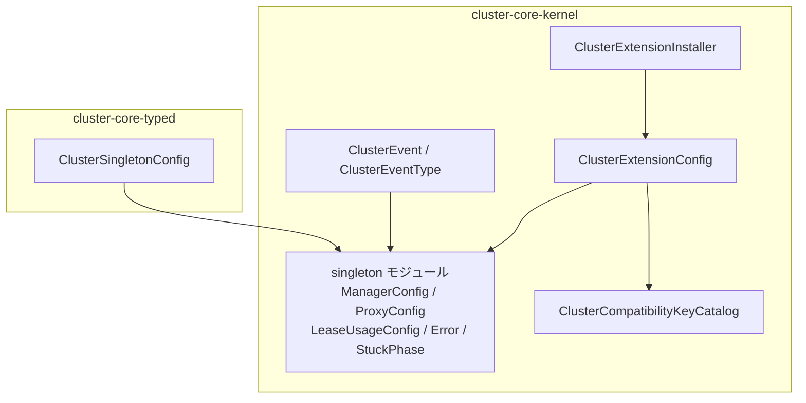
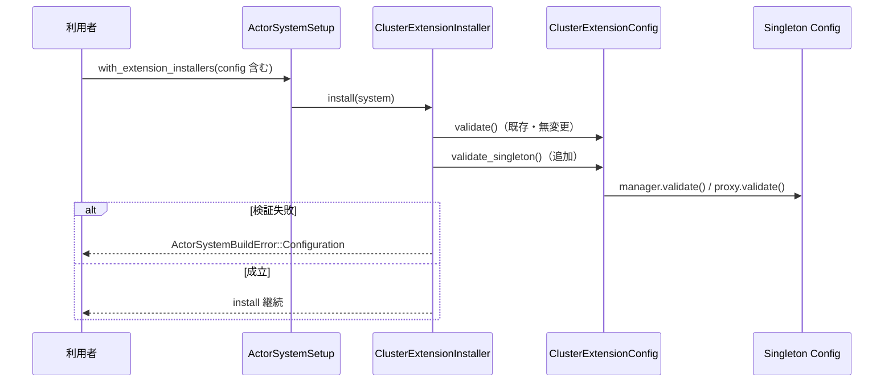

# 技術設計: cluster-singleton-settings-contract

## 概要

**Purpose（目的）**: この機能は cluster 運用者と typed API 利用者に、Cluster Singleton の設定・検証・参加互換性・観測の契約を提供する。Phase 3 で singleton manager / proxy の runtime（oldest 選出・handover 状態機械・メッセージバッファリング）を実装する前に、設定契約を独立して固定する。

**Users（ユーザー）**: cluster 運用者は singleton の動作パラメータを ActorSystem 構築時の Cluster Configuration (クラスタ設定) として指定し、Join Compatibility (参加互換性) の Compatibility Mismatch Reason (互換性不一致理由) から member 間の設定ずれを判断する。typed API 利用者は統合設定から manager / proxy 設定を導出する。

**Impact（影響）**: `cluster-core-kernel` に singleton 専用モジュールを新設し、既存の `ClusterExtensionConfig` / `ClusterEvent` / `ClusterCompatibilityKeyCatalog` に配線を追加する。既存の公開契約は削除・変更しない（追加のみ）。

### 目標

- `ClusterSingletonManagerConfig` / `ClusterSingletonProxyConfig` / typed `ClusterSingletonConfig` / `LeaseUsageConfig` を Pekko 既定値互換のデフォルト付きで定義する
- install / start 境界の Cluster Configuration Validation (クラスタ設定検証) に singleton 設定の検証を組み込む
- `cluster.singleton` を Join Compatibility (参加互換性) のキーとして追加し、不一致フィールド名を理由に含める
- stuck 検知条件（リトライ上限の決定的導出）と通知語彙（`ClusterEvent::SingletonHandOverStuck`）を契約として定義する

### 非目標

- singleton manager / proxy の runtime 状態機械（oldest 選出、handover 実行、メッセージバッファリング、location 追跡）
- lease backend の実装、coordinated shutdown との handover 連携
- stuck 検知の計数状態機械（リトライ計数の実行は Phase 3 runtime の責務）
- Pekko `ClusterSingletonSetup`（Extension 差し替え用テストフック）の再現
- std 層（`cluster-adaptor-std`）への追加

## 境界コミットメント

### このスペックが所有するもの

- singleton manager / proxy / typed 統合 / lease の設定型と、その既定値・setter・getter・検証
- `ClusterSingletonConfigError` による検証エラーの語彙
- `cluster.singleton` の Join Compatibility (参加互換性) キーと、不一致フィールド名を列挙する mismatch detail
- `ClusterEvent::SingletonHandOverStuck` variant と `ClusterEventType::SingletonHandOverStuck` フィルタ、および stuck 局面の語彙（`SingletonStuckPhase`）
- リトライ上限の決定的導出式（`max_hand_over_retries()`）
- `ClusterExtensionConfig` への singleton 設定フィールドの追加と install 境界での検証配線

### 境界外

- `SingletonHandOverStuck` を発行する runtime（検知の実行・リトライ計数は Phase 3 spec が所有する）
- lease の取得・更新プロトコル（`LeaseUsageConfig` は設定 2 項目のみを所有し、SBR の lease 語彙とは結合しない）
- singleton の配置決定ロジック（Member Ordering (メンバー順序) 契約は cluster-membership-event-surface が所有済み）
- `MembershipCoordinatorConfig` 等の既存設定構造の再編
- 「ついでに」既存の互換キー方式（failure detector / pubsub の 2 流儀）を統一すること

### 許可する依存

- `cluster-core-kernel` 内部: `singleton` モジュールは `core::time::Duration` と `alloc` のみに依存する。`topology/cluster_event.rs` は `singleton::SingletonStuckPhase` を payload として参照できる（membership 型を参照する既存前例と同型）
- `extension/cluster_extension_config.rs` は `singleton` モジュールの設定型に依存できる（failure_detector への既存依存と同型）
- proxy 設定の data center 項目は `membership::DataCenter` を再利用する（kernel 内モジュール間参照の既存前例どおり）
- `cluster-core-typed` は `cluster-core-kernel` の singleton 設定型に依存できる（typed → kernel の既存方向）
- 新しい外部 crate は追加しない。no_std + alloc を維持する

### 再検証トリガー

- 設定型のフィールド・既定値・検証規則・`max_hand_over_retries()` の導出式が変わる場合（Phase 3 runtime spec は本契約を参照して実装するため）
- `ClusterEvent::SingletonHandOverStuck` のフィールド形状が変わる場合（購読側・Phase 3 発行側の双方に影響）
- `cluster.singleton` キーの分類（required）や mismatch detail の形式が変わる場合
- Phase 3 で stuck 発行 runtime を追加する場合（本契約のテスト発行による検証を実発行の統合テストで置き換えること）

## アーキテクチャ

### 既存アーキテクチャ分析

`ClusterExtensionConfig` は既に downing_provider / failure_detector / pub_sub の 3 ドメイン設定を集約し、`ClusterExtensionInstaller::install` が `config.validate()` を実行して `ActorSystemBuildError::Configuration` で拒否する。Join Compatibility (参加互換性) は `JOIN_COMPATIBILITY_CHECKS` 配列の `JoinCompatibilityCheck { key, mismatch_detail }` で宣言され、failure detector は「設定全体で 1 キー + `difference_field_names` による差異フィールド列挙」方式を取る。

観測契約は `ClusterEvent` enum に variant を追加し `EventStreamEvent::Extension { name: "cluster", payload }` で publish、購読は `ClusterApi::subscribe` + `ClusterEventType` フィルタという慣行が cluster-membership-event-surface で直近に確立済みである。

singleton 設定はこの 2 つの確立済みパターンの適用であり、新しいアーキテクチャ要素を導入しない。

### アーキテクチャパターンと境界マップ

採用パターンはハイブリッド拡張である。型の所有は新規 `singleton` モジュールに閉じ、配線（検証委譲・互換キー・install・イベント語彙）は既存経路への接続のみを追加する（research.md の Option C）。



依存方向: typed → kernel、extension → singleton、topology → singleton。singleton モジュールは他モジュールへ依存しない（`membership::DataCenter` の型参照は proxy 設定のフィールド型としてのみ）。

### 技術スタック

| レイヤー | 選択／バージョン | 機能内での役割 | メモ |
|-------|------------------|-----------------|-------|
| Core contract | Rust 2024 / `cluster-core-kernel` | 設定型・検証・互換キー・イベント語彙 | no_std + alloc を維持 |
| Typed layer | Rust 2024 / `cluster-core-typed` | 統合設定と manager / proxy への導出 | フラットなファイル構成に追従 |
| 参照実装 | Pekko `cluster-tools/reference.conf` | 既定値の正本 | 1s / 15 回 / 1s / 1000 / 5s |

## ファイル構造計画

### ディレクトリ構造（新規ファイル）

```text
modules/cluster-core-kernel/src/
├── singleton.rs                                  # wiring（mod 宣言と pub use のみ）
└── singleton/
    ├── cluster_singleton_manager_config.rs      # manager 設定型 + validate + max_hand_over_retries
    ├── cluster_singleton_manager_config_test.rs
    ├── cluster_singleton_proxy_config.rs        # proxy 設定型 + validate
    ├── cluster_singleton_proxy_config_test.rs
    ├── lease_usage_config.rs                    # lease 設定スロット（実装名 + リトライ間隔）
    ├── lease_usage_config_test.rs
    ├── cluster_singleton_config_error.rs        # 検証エラー enum + Display
    ├── cluster_singleton_config_error_test.rs
    ├── singleton_stuck_phase.rs                   # stuck 局面 enum（BecomingOldest / HandingOver）
    └── singleton_stuck_phase_test.rs

modules/cluster-core-typed/src/
├── cluster_singleton_config.rs                  # typed 統合設定 + to_manager_config / to_proxy_config
└── cluster_singleton_config_test.rs
```

### 変更対象ファイル

- `modules/cluster-core-kernel/src/lib.rs` — `pub mod singleton;` の追加
- `modules/cluster-core-kernel/src/topology/cluster_event.rs` — `SingletonHandOverStuck` variant の追加（観測契約）
- `modules/cluster-core-kernel/src/topology/cluster_event_type.rs`（+ `_test.rs`）— `SingletonHandOverStuck` variant と `matches` arm の追加
- `modules/cluster-core-kernel/src/topology/cluster_compatibility_key_catalog.rs`（+ `_test.rs`）— `SINGLETON: required("cluster.singleton")` の追加と `required_keys()` への組み込み
- `modules/cluster-core-kernel/src/extension/cluster_extension_config.rs`（+ `_test.rs`）— singleton 設定フィールド・setter・getter・`validate_singleton()`・`JOIN_COMPATIBILITY_CHECKS` エントリ（`singleton_config_mismatch_detail`）の追加
- `modules/cluster-core-kernel/src/extension/cluster_extension_installer.rs`（+ `_test.rs`）— install 境界での `validate_singleton()` 呼び出しの追加
- `modules/cluster-core-kernel/src/extension/cluster_api_test.rs` — stuck 通知の購読フィルタ統合テスト追加（EventStream 経由のテスト発行）
- `modules/cluster-core-typed/src/lib.rs` — typed 統合設定の mod 宣言と pub use の追加

## システムフロー

install 境界での検証と Join Compatibility (参加互換性) のフロー。既存経路（実線部）は変更せず、singleton の検証・チェックを同じ境界に追加する。



Join Compatibility は既存の `JoinCompatibilityComposition` が `JOIN_COMPATIBILITY_CHECKS` を走査する経路に乗るため、フロー変更はない（配列へのエントリ追加のみ）。

## 要件トレーサビリティ

| 要件 | 要約 | コンポーネント | インターフェース | フロー |
|------|------|------------|------------|-------|
| 1.1 | manager 設定の保持 | ClusterSingletonManagerConfig | フィールド + getter | — |
| 1.2 | manager 既定値 | 同上 | `new()` / `Default` | — |
| 1.3 | removal margin 未指定の区別 | 同上 | `removal_margin: Option<Duration>` | — |
| 1.4 | lease スロットの保持 | LeaseUsageConfig | `lease_config: Option<LeaseUsageConfig>` | — |
| 2.1 | proxy 設定の保持 | ClusterSingletonProxyConfig | フィールド + getter | — |
| 2.2 | proxy 既定値 | 同上 | `new()` / `Default` | — |
| 2.3 | buffer size 0 の許容 | 同上 | `validate()`（0 を有効値とする） | — |
| 3.1 | typed 一括指定 | ClusterSingletonConfig (typed) | フィールド + setter | — |
| 3.2 | manager 導出の無損失 | 同上 | `to_manager_config(name)` | — |
| 3.3 | proxy 導出の無損失 | 同上 | `to_proxy_config(name)` | — |
| 3.4 | typed 既定値の一致 | 同上 | `Default`（kernel 既定値委譲） | — |
| 4.1 | 同一境界での検証 | ClusterExtensionInstaller | `validate_singleton()` 呼び出し | install フロー |
| 4.2 | buffer size 範囲検証 | ClusterSingletonProxyConfig | `BufferSizeOutOfRange` | install フロー |
| 4.3 | ゼロ以下間隔の拒否 | Manager / Proxy Config | `NonPositive*Interval` | install フロー |
| 4.4 | 空 singleton 名の拒否 | Manager / Proxy Config | `EmptySingletonName` | install フロー |
| 4.5 | lease 不成立の拒否 | LeaseUsageConfig | `EmptyLeaseImplementation` / `NonPositiveLeaseRetryInterval` | install フロー |
| 4.6 | 成立時の install 継続 | ClusterExtensionInstaller | `Ok(())` 経路 | install フロー |
| 5.1 | 互換性確認への組み込み | ClusterExtensionConfig | `JOIN_COMPATIBILITY_CHECKS` エントリ | 既存 compat フロー |
| 5.2 | 不一致項目の特定 | singleton_config_mismatch_detail | `difference_field_names` | 既存 compat フロー |
| 5.3 | 一致時は拒否しない | 同上 | detail が `None` を返す経路 | 既存 compat フロー |
| 6.1 | install 境界での受け取り | ClusterExtensionConfig | `with_singleton_*_config` | install フロー |
| 6.2 | 未指定でも既定値 install | 同上 | `new()` が既定値を内包 | install フロー |
| 6.3 | 既存構成の無影響 | 同上 | 追加フィールドのみ（既存 API 無変更） | — |
| 7.1 | リトライ上限の決定的導出 | ClusterSingletonManagerConfig | `max_hand_over_retries()` | — |
| 7.2 | stuck 通知の内容定義 | ClusterEvent | `SingletonHandOverStuck { singleton_name, phase, observed_at }` | — |
| 7.3 | stuck 通知の識別 | ClusterEventType | `SingletonHandOverStuck` + `matches` | 購読フィルタ |
| 7.4 | 通知契機の状態遷移禁止 | ClusterEvent（rustdoc 契約） | 観測専用 payload（ハンドラなし） | — |
| 8.1 | 既存検証・互換判定の維持 | 全変更対象 | 追加のみ（既存シグネチャ無変更） | — |
| 8.2 | runtime 先取り禁止 | singleton モジュール | 純粋データ型のみ（実行系なし） | — |
| 8.3 | 既存公開契約の維持 | 全変更対象 | variant / キー / フィールドの追加のみ | — |

## コンポーネントとインターフェース

| コンポーネント | ドメイン／レイヤー | 意図 | 要件カバー範囲 | 主要依存 | 契約 |
|-----------|--------------|--------|--------------|----------|-----------|
| ClusterSingletonManagerConfig | kernel/singleton | manager 設定の保持・検証・導出 | 1, 4.3, 4.4, 7.1 | LeaseUsageConfig | Service |
| ClusterSingletonProxyConfig | kernel/singleton | proxy 設定の保持・検証 | 2, 4.2–4.4 | membership::DataCenter | Service |
| LeaseUsageConfig | kernel/singleton | lease スロットの 2 項目保持 | 1.4, 4.5 | なし | Service |
| ClusterSingletonConfigError | kernel/singleton | 検証エラーの語彙 | 4.2–4.5 | なし | Service |
| SingletonStuckPhase | kernel/singleton | stuck 局面の語彙 | 7.2 | なし | State |
| ClusterSingletonConfig | typed | 統合設定と導出 | 3 | kernel singleton 型 | Service |
| ClusterExtensionConfig（変更） | kernel/extension | 設定集約・検証委譲・互換チェック | 4.1, 5, 6 | singleton 型 | Service |
| ClusterEvent / ClusterEventType（変更） | kernel/topology | stuck 観測語彙とフィルタ | 7.2–7.4 | SingletonStuckPhase | Event |

### singleton 層

#### ClusterSingletonManagerConfig

| 項目 | 詳細 |
|-------|--------|
| 意図 | singleton manager の動作パラメータを保持し、検証とリトライ上限導出を所有する |
| 要件 | 1.1, 1.2, 1.3, 1.4, 4.3, 4.4, 7.1 |

**責務と制約**
- フィールドと既定値（Pekko `reference.conf` 互換）:
  - `singleton_name: String` — 既定 `"singleton"`
  - `role: Option<String>` — 既定 `None`（role 制約なし）
  - `removal_margin: Option<Duration>` — 既定 `None`（downing 側の margin に従う状態。明示値と型で区別する。要件 1.3）
  - `hand_over_retry_interval: Duration` — 既定 1 秒
  - `min_hand_over_retries: u32` — 既定 15
  - `lease_config: Option<LeaseUsageConfig>` — 既定 `None`
- `FailureDetectorConfig` パターンに従う: `new()` + `Default`（`new()` 委譲）+ `with_*` setter chain + getter。setter / getter は `#[must_use]`
- CQS: 検証・導出は `&self` の Query、設定変更は `with_*` の値移動（self 消費 builder）

##### サービスインターフェース

```rust
impl ClusterSingletonManagerConfig {
  pub fn new() -> Self;
  pub fn with_singleton_name(self, name: &str) -> Self;
  pub fn with_role(self, role: &str) -> Self;
  pub const fn with_removal_margin(self, margin: Duration) -> Self;
  pub const fn with_hand_over_retry_interval(self, interval: Duration) -> Self;
  pub const fn with_min_hand_over_retries(self, retries: u32) -> Self;
  pub fn with_lease_config(self, lease: LeaseUsageConfig) -> Self;
  // getters: singleton_name() / role() / removal_margin() /
  //          hand_over_retry_interval() / min_hand_over_retries() / lease_config()
  pub fn validate(&self) -> Result<(), ClusterSingletonConfigError>;
  pub fn max_hand_over_retries(&self) -> u32;
  pub fn difference_field_names(&self, other: &Self) -> Vec<&'static str>;
}
```

- Preconditions: なし（`validate()` 前でも全メソッドは全域関数）
- Postconditions: `validate()` が `Ok(())` を返す設定は要件 4 の全基準を満たす
- Invariants: `max_hand_over_retries()` は同一設定に対して常に同じ値を返す（決定的。要件 7.1）

**導出式**（Pekko と一致）:

```text
max_hand_over_retries = max(min_hand_over_retries, margin_ticks + 3)
  margin_ticks = removal_margin（None は 0 扱い）÷ hand_over_retry_interval（ミリ秒系で切り捨て除算）
  hand_over_retry_interval が 0 の場合は margin_ticks = 0（除算回避。validate() はゼロ間隔を拒否するが導出は全域関数として定義）
```

**検証規則**: 空 `singleton_name` → `EmptySingletonName`、`hand_over_retry_interval` ゼロ → `NonPositiveHandOverRetryInterval`、lease 保持時は `LeaseUsageConfig::validate()` へ委譲。

#### ClusterSingletonProxyConfig

| 項目 | 詳細 |
|-------|--------|
| 意図 | singleton proxy の動作パラメータを保持し、検証を所有する |
| 要件 | 2.1, 2.2, 2.3, 4.2, 4.3, 4.4 |

**責務と制約**
- フィールドと既定値:
  - `singleton_name: String` — 既定 `"singleton"`
  - `role: Option<String>` — 既定 `None`
  - `data_center: Option<DataCenter>` — 既定 `None`（`membership::DataCenter` を再利用）
  - `singleton_identification_interval: Duration` — 既定 1 秒
  - `buffer_size: u32` — 既定 1000
- API 形状は manager 設定と同型（`new()` / `Default` / `with_*` / getter / `validate()` / `difference_field_names()`）

**検証規則**: 空 `singleton_name` → `EmptySingletonName`、`singleton_identification_interval` ゼロ → `NonPositiveIdentificationInterval`、`buffer_size > 10000` → `BufferSizeOutOfRange`。`buffer_size == 0` は「バッファリングなし」を意味する有効値として受理する（要件 2.3）。

#### LeaseUsageConfig

| 項目 | 詳細 |
|-------|--------|
| 意図 | lease 設定スロットの 2 項目（実装識別名・リトライ間隔）のみを保持する |
| 要件 | 1.4, 4.5 |

```rust
impl LeaseUsageConfig {
  pub fn new(lease_implementation: &str, lease_retry_interval: Duration) -> Self;
  pub fn lease_implementation(&self) -> &str;
  pub const fn lease_retry_interval(&self) -> Duration;
  pub fn validate(&self) -> Result<(), ClusterSingletonConfigError>;
}
```

- `Default` は提供しない（lease 実装名に意味のある既定値が存在しないため。スロット自体の既定は manager 設定側の `Option` が `None` で表現する）
- 検証規則: 空 `lease_implementation` → `EmptyLeaseImplementation`、`lease_retry_interval` ゼロ → `NonPositiveLeaseRetryInterval`
- SBR の lease 語彙（`LeaseAcquisitionOutcome`）とは結合しない（境界外）

#### ClusterSingletonConfigError

| 項目 | 詳細 |
|-------|--------|
| 意図 | singleton 設定検証の失敗理由を原因項目特定可能な variant で表現する |
| 要件 | 4.2, 4.3, 4.4, 4.5 |

```rust
pub enum ClusterSingletonConfigError {
  EmptySingletonName,
  BufferSizeOutOfRange { value: u32 },
  NonPositiveHandOverRetryInterval,
  NonPositiveIdentificationInterval,
  EmptyLeaseImplementation,
  NonPositiveLeaseRetryInterval,
}
```

- `Display` を実装し、原因項目を英語メッセージで提示する（`FailureDetectorConfigError` と同型）。installer が `ActorSystemBuildError::Configuration` へ文字列化して載せる

#### SingletonStuckPhase

| 項目 | 詳細 |
|-------|--------|
| 意図 | stuck 通知の「停滞の局面」を型で表現する |
| 要件 | 7.2 |

```rust
pub enum SingletonStuckPhase {
  /// Waiting to become the oldest member's singleton host.
  BecomingOldest,
  /// Hand-over to the next oldest member is in progress.
  HandingOver,
}
```

`Clone, Copy, Debug, PartialEq, Eq` を derive する。20 行以下だが `ClusterEvent` の payload として topology から参照されるため独立ファイルとする（type-per-file）。

### typed 層

#### ClusterSingletonConfig

| 項目 | 詳細 |
|-------|--------|
| 意図 | manager / proxy 共通項目の一括指定と、singleton 名を与えた導出を提供する |
| 要件 | 3.1, 3.2, 3.3, 3.4 |

**責務と制約**
- フィールド: `role` / `data_center` / `singleton_identification_interval` / `removal_margin` / `hand_over_retry_interval` / `min_hand_over_retries` / `buffer_size` / `lease_config`（Pekko typed `ClusterSingletonSettings` と同構成）
- 既定値は kernel の manager / proxy 既定値と一致させる（要件 3.4）。一致は導出経由のテストで保証する

##### サービスインターフェース

```rust
impl ClusterSingletonConfig {
  pub fn new() -> Self;
  // with_* setters（kernel と同形）
  pub fn to_manager_config(&self, singleton_name: &str) -> ClusterSingletonManagerConfig;
  pub fn to_proxy_config(&self, singleton_name: &str) -> ClusterSingletonProxyConfig;
}
```

- Postconditions: 導出結果の各項目は統合設定の対応項目と一致する（無損失。要件 3.2 / 3.3）。manager に存在しない項目（identification 間隔・buffer size・data center）は manager 導出に影響せず、proxy に存在しない項目（removal margin・handover リトライ）も同様
- 検証は導出先の `validate()` に委ねる（typed 側で検証を二重定義しない）

### extension 層（変更）

#### ClusterExtensionConfig

| 項目 | 詳細 |
|-------|--------|
| 意図 | singleton 設定を既存の設定集約・検証・互換チェック経路に配線する |
| 要件 | 4.1, 4.6, 5.1, 5.2, 5.3, 6.1, 6.2, 6.3, 8.1, 8.3 |

**責務と制約**
- フィールド追加: `singleton_manager_config: ClusterSingletonManagerConfig`、`singleton_proxy_config: ClusterSingletonProxyConfig`（いずれも `new()` で既定値を内包。要件 6.2）
- setter / getter 追加: `with_singleton_manager_config` / `with_singleton_proxy_config` / `singleton_manager_config()` / `singleton_proxy_config()`
- **検証の追加方針**: 既存 `validate() -> Result<(), FailureDetectorConfigError>` のシグネチャは変更しない（要件 8.1 / 8.3）。新規 `validate_singleton(&self) -> Result<(), ClusterSingletonConfigError>` を追加し、manager → proxy の順に委譲する。installer が両者を同じ install 境界で連続実行する（要件 4.1）。検証エラー型の統一は Phase 3 以降の再設計対象として持ち越す
- **互換チェックの追加**: `JOIN_COMPATIBILITY_CHECKS` に `JoinCompatibilityCheck::new(ClusterCompatibilityKeyCatalog::SINGLETON, singleton_config_mismatch_detail)` を追加。`singleton_config_mismatch_detail` は manager / proxy の `difference_field_names()` を `manager.` / `proxy.` プレフィックス付きで結合し、差異がなければ `None` を返す（要件 5.2 / 5.3。failure detector 方式と同型）

#### ClusterExtensionInstaller

| 項目 | 詳細 |
|-------|--------|
| 意図 | install 境界で singleton 検証を既存検証と同時に実行する |
| 要件 | 4.1, 4.6, 6.1 |

- `install` 内の既存 `config.validate()` 直後に `config.validate_singleton()` を追加し、失敗は同じ `ActorSystemBuildError::Configuration` へ写像する
- 成立時は従来どおり install を継続する（要件 4.6）

### topology 層（変更）

#### ClusterEvent / ClusterEventType 拡張

| 項目 | 詳細 |
|-------|--------|
| 意図 | stuck 通知の語彙と購読フィルタを定義する |
| 要件 | 7.2, 7.3, 7.4, 8.3 |

##### イベント契約

```rust
// ClusterEvent に追加する variant
SingletonHandOverStuck {
  /// Name of the singleton whose hand-over is not progressing.
  singleton_name: String,
  /// Phase in which the hand-over is stuck.
  phase: SingletonStuckPhase,
  /// Timestamp captured when the stall was observed.
  observed_at: TimerInstant,
},
```

- Published events: 本 spec では発行 runtime を追加しない。発行点は Phase 3 が所有する（再検証トリガー参照）。識別契約はテストが `EventStreamEvent::Extension { name: "cluster", payload }` 経由で発行して検証する
- 順序／配信保証: 既存 ClusterEvent と同じ（EventStream のベストエフォート配信）
- `ClusterEventType::SingletonHandOverStuck` を追加し、`matches` の網羅 match に arm を加える（要件 7.3）
- rustdoc に観測専用契約を明記する: この variant は観測ペイロードであり、受信を契機に Membership State Transition (メンバーシップ状態遷移) や Downing Decision (ダウン判断) を実行してはならない（要件 7.4）。本 spec はこの variant を消費するハンドラを追加しないため、構造的にも遷移経路が存在しない

#### ClusterCompatibilityKeyCatalog 拡張

- `pub const SINGLETON: ClusterCompatibilityKey = ClusterCompatibilityKey::required("cluster.singleton");` を追加し、`required_keys()` 配列へ組み込む（要件 5.1）

## データモデル

### ドメインモデル

- 設定型 4 つ（manager / proxy / typed 統合 / lease）はいずれも不変条件を `validate()` で外付け検証する値オブジェクト。フィールドは構築後 `with_*` による値移動でのみ変更される（内部可変性なし、共有なし）
- `Option<Duration>`（removal margin）と `Option<LeaseUsageConfig>`（lease スロット）は「未指定」を型で表現し、センチネル値を使わない
- `SingletonStuckPhase` は stuck 局面の閉じた語彙（2 値 enum）。Phase 3 で局面が増える場合は再検証トリガーに該当する

### データ契約と統合

- 互換キー `cluster.singleton` の不一致理由は `ConfigValidation::Incompatible { reason }` に `manager.<field>` / `proxy.<field>` 形式のフィールド名列挙で載る。`JoinCompatibilityComposition` による複数 checker の `;` 結合は既存のまま
- `SingletonHandOverStuck` は `EventStreamEvent::Extension` payload としてシリアライズされない（プロセス内観測のみ）。リモート伝搬は本 spec の対象外

## エラーハンドリング

### エラー戦略

- 検証エラーは `ClusterSingletonConfigError` の variant で原因項目を特定可能にし、install 境界で `ActorSystemBuildError::Configuration(format!("{error:?}"))` へ写像する（failure detector と同じ写像形式）
- `validate()` / `validate_singleton()` の `Result` は installer で必ず `?` 伝播し、握りつぶさない
- 導出関数 `max_hand_over_retries()` は全域関数として定義し、panic 経路を持たない（ゼロ間隔は margin_ticks = 0 として扱う）

### 監視

- 本 spec の観測面は `SingletonHandOverStuck` の語彙定義のみ。発行・ログ・メトリクスは Phase 3 runtime の責務

## テスト戦略

### Unit Tests

1. **manager 既定値**: `new()` / `Default` が name "singleton" / role なし / removal margin `None` / 1s / 15 / lease なしを返す（1.2, 1.3）
2. **proxy 既定値と buffer size 0**: 既定 1s / 1000、`buffer_size = 0` が `validate()` を通過（2.2, 2.3）
3. **検証拒否 6 種**: 空名 / buffer size 10001 / ゼロ handover 間隔 / ゼロ identification 間隔 / 空 lease 実装名 / ゼロ lease 間隔がそれぞれ対応 variant で拒否される（4.2–4.5）
4. **導出の決定性**: 同一設定で `max_hand_over_retries()` が常に同値。`removal_margin: None` → `max(15, 3)`、margin 26s / interval 1s → `max(15, 29) = 29`、ゼロ間隔でも panic しない（7.1）
5. **typed 導出の無損失**: 非既定値で構築した統合設定から導出した manager / proxy の全項目が一致。既定の統合設定からの導出が kernel 既定値と一致（3.1–3.4）
6. **difference_field_names**: 単一フィールド差・複数フィールド差・差なしの列挙が正しい（5.2, 5.3）

### Integration Tests

1. **install 境界の拒否と継続**: 不正 singleton 設定を載せた `ClusterExtensionConfig` で installer が `ActorSystemBuildError::Configuration` を返し、既定値設定では install が成立する（4.1, 4.6, 6.1, 6.2）
2. **Join Compatibility 不一致**: singleton 設定が異なる 2 つの config 間で `cluster.singleton` キーの `Incompatible` 理由に差異フィールド名が含まれ、一致時は互換と判定される（5.1–5.3）
3. **stuck 通知の購読識別**: `EventStreamEvent::Extension` 経由でテスト発行した `SingletonHandOverStuck` を `ClusterEventType::SingletonHandOverStuck` フィルタの購読者だけが受信し、他フィルタの購読者は受信しない（7.2, 7.3。`cluster_api_test.rs` の既存パターンに追加）
4. **非回帰**: 既存の cluster 3 クレートの全テストが無変更で通過する（8.1, 8.3）。singleton モジュールが実行系を持たないことは公開 API 表面（純粋データ型のみ）で担保する（8.2）
