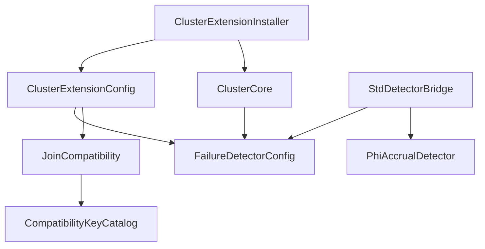
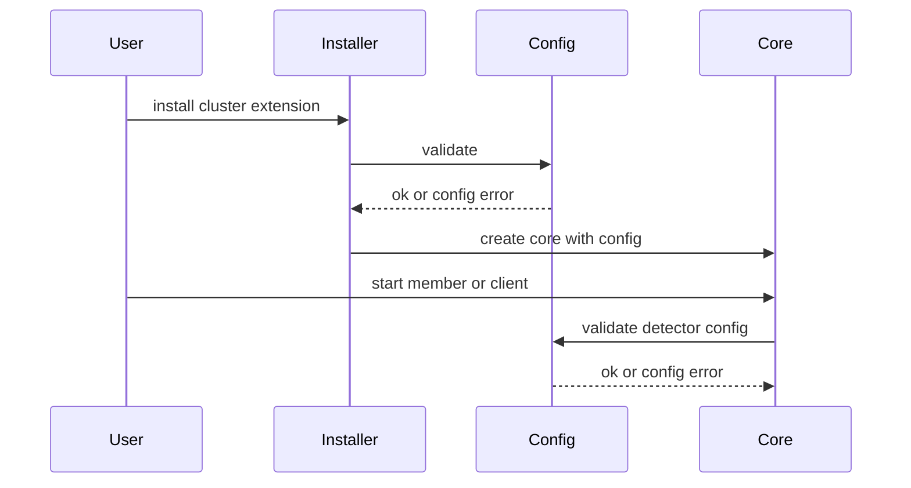
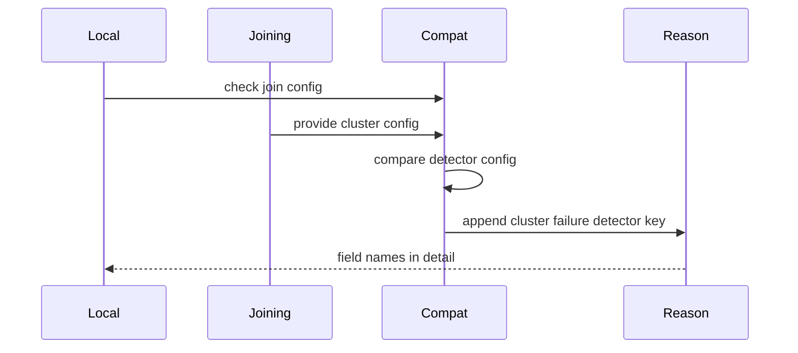

# Technical Design

## Overview

この設計は、Failure Detector Configuration (故障検出器設定) を Cluster Configuration (クラスタ設定) の明示的な contract として追加する。cluster 実装者は `FailureDetectorConfig` で Availability Evidence (可用性観測証拠) の観測パラメータを保持し、cluster 運用者は Join Compatibility (参加互換性) の Compatibility Mismatch Reason (互換性不一致理由) から設定差分を判断できる。

影響範囲は cluster-core の configuration / validation / compatibility と、cluster-adaptor-std の Phi Accrual bridge に限定する。Failure Detector Algorithm Selection (故障検出器アルゴリズム選択)、Downing Decision (ダウン判断)、Member Removal (メンバー除去) は扱わない。

### Goals

- `FailureDetectorConfig` を Cluster Configuration (クラスタ設定) として保持し、既存 cluster membership path と同等の default を提供する。
- install / start 境界で Cluster Configuration Validation (クラスタ設定検証) を実行し、invalid config を Join Compatibility (参加互換性) と分けて扱う。
- `cluster.failure-detector` を Join Compatibility (参加互換性) の single key として追加し、差分のある観測パラメータ名を診断に含める。
- std 環境で `FailureDetectorConfig` を `PhiAccrualFailureDetector` 生成へ渡す。

### Non-Goals

- Failure Detector Algorithm Selection (故障検出器アルゴリズム選択) の public API 化。
- Split Brain Resolver execution actor、provider down execution loop、lease coordination backend の追加。
- Cluster Singleton、Cluster Client、Receptionist、Distributed Data / CRDT、Pekko public API parity の実装。
- `MembershipCoordinatorConfig` の timeout / gossip policy を Failure Detector Configuration (故障検出器設定) に移すこと。

## Boundary Commitments

### This Spec Owns

- `FailureDetectorConfig` の public value object、default、builder-style setter、getter、validation。
- Failure Detector Configuration (故障検出器設定) の Cluster Configuration (クラスタ設定) への保持。
- Cluster Configuration Validation (クラスタ設定検証) の install / start 境界接続。
- `cluster.failure-detector` の Join Compatibility (参加互換性) key と Compatibility Mismatch Reason (互換性不一致理由) の field 差分 detail。
- std 環境で `FailureDetectorConfig` から Phi Accrual detector を生成する bridge。
- `docs/gap-analysis/cluster-gap-analysis.md` の該当 gap 更新。

### Out of Boundary

- `cluster.failure-detector.choice` を required key にすること。
- Failure Detector Algorithm Selection (故障検出器アルゴリズム選択) の enum / registry / plugin surface。
- Failure Detector (故障検出器) に Downing Decision (ダウン判断) や Member Removal (メンバー除去) を持たせること。
- Membership Coordination Policy (メンバーシップ調停ポリシー) の suspect / dead / quarantine / gossip interval 設計変更。
- remote watcher 側の detector default 変更。

### Allowed Dependencies

- `cluster-core-kernel` は `core::time::Duration` と `alloc` を使えるが、std 依存を追加しない。
- `cluster-core-kernel` は cluster-core 内の `FailureDetector` trait / `DefaultFailureDetectorRegistry` / Join Compatibility (参加互換性) infrastructure に依存できる。
- `cluster-adaptor-std` は `fraktor_remote_core_rs::failure_detector::PhiAccrualFailureDetector` と `fraktor_remote_core_rs::address::Address` に依存できる。
- 新しい外部 crate は追加しない。

### Revalidation Triggers

- `FailureDetectorConfig` の field、default 値、validation rule、duration 単位が変わる場合。
- `ClusterCompatibilityKeyCatalog` の `cluster.failure-detector` / `cluster.failure-detector.choice` の分類が変わる場合。
- `DefaultFailureDetectorRegistry` の factory contract が resource key aware に変わる場合。
- `MembershipCoordinatorConfig` から `phi_threshold` を削除または意味変更する場合。
- `PhiAccrualFailureDetector::new` の parameter order / unit が変わる場合。

## Architecture

### Existing Architecture Analysis

cluster-core は portable contract と state coordination を持ち、std adaptor は Tokio や concrete detector binding を持つ。`ClusterExtensionConfig` は既に PubSub と Downing Provider の Join Compatibility (参加互換性) を扱い、`ClusterCompatibilityKeyCatalog` は required / conditional / excluded key を分けている。

現状の `MembershipCoordinatorConfig` は `phi_threshold` と timeout / gossip policy を同じ struct に持つ。この設計では互換性を壊さず、new `FailureDetectorConfig` を Cluster Configuration (クラスタ設定) の source とし、Membership Coordination Policy (メンバーシップ調停ポリシー) への広い移行は行わない。

### Architecture Pattern & Boundary Map

Selected pattern は Hybrid Extension である。Failure Detector Configuration (故障検出器設定) の型と validation は新 component に閉じ、existing cluster config / compatibility / start flow には接続だけを追加する。



Dependency direction: `FailureDetectorConfig` → `ClusterExtensionConfig` → `ClusterCompatibilityKeyCatalog` / `ClusterCore` → `cluster-adaptor-std bridge`。core layer は std bridge へ依存しない。

### Technology Stack

| Layer | Choice / Version | Role in Feature | Notes |
|-------|------------------|-----------------|-------|
| Core contract | Rust 2024 / `cluster-core-kernel` | `FailureDetectorConfig`、validation、Join Compatibility (参加互換性) | no_std + alloc を維持 |
| std adaptor | Rust 2024 / `cluster-adaptor-std` | `FailureDetectorConfig` を Phi Accrual detector へ接続 | 新規外部 crate なし |
| Remote core | existing `PhiAccrualFailureDetector` | concrete detector implementation | algorithm selection は公開しない |
| Documentation | Markdown | gap analysis 更新 | `CONTEXT.md` 用語に合わせる |

## File Structure Plan

### Directory Structure

```text
modules/cluster-core-kernel/src/
├── failure_detector.rs
├── failure_detector/
│   ├── failure_detector_config.rs
│   ├── failure_detector_config_test.rs
│   ├── failure_detector_config_error.rs
│   └── failure_detector_config_error_test.rs
├── extension/
│   ├── cluster_extension_config.rs
│   ├── cluster_extension_config_test.rs
│   ├── cluster_extension_installer.rs
│   ├── cluster_extension_installer_test.rs
│   ├── cluster_core.rs
│   ├── cluster_core_test.rs
│   └── cluster_error.rs
└── topology/
    ├── cluster_compatibility_key_catalog.rs
    └── cluster_compatibility_key_catalog_test.rs

modules/cluster-adaptor-std/src/
└── membership/
    ├── configured_phi_accrual_detector_factory.rs
    └── configured_phi_accrual_detector_factory_test.rs

docs/gap-analysis/
└── cluster-gap-analysis.md
```

### Modified Files

- `modules/cluster-core-kernel/src/failure_detector.rs` — `FailureDetectorConfig` と `FailureDetectorConfigError` を公開する。
- `modules/cluster-core-kernel/src/extension/cluster_extension_config.rs` — `failure_detector_config` field、getter、`with_failure_detector_config`、`validate()`、Join Compatibility (参加互換性) check を追加する。
- `modules/cluster-core-kernel/src/extension/cluster_extension_installer.rs` — install 前に `config.validate()` を実行し、失敗を `ActorSystemBuildError::Configuration` へ変換する。
- `modules/cluster-core-kernel/src/extension/cluster_core.rs` — `FailureDetectorConfig` を保持し、`start_member` / `start_client` の先頭で validation する。
- `modules/cluster-core-kernel/src/extension/cluster_error.rs` — Cluster Configuration Validation (クラスタ設定検証) failure を表す variant を追加する。
- `modules/cluster-core-kernel/src/topology/cluster_compatibility_key_catalog.rs` — required key `cluster.failure-detector` を追加し、`cluster.failure-detector.choice` は excluded のままにする。
- `modules/cluster-adaptor-std/src/membership.rs` — std bridge helper を公開する。
- `docs/gap-analysis/cluster-gap-analysis.md` — Failure Detector Configuration (故障検出器設定) gap を完了扱いへ更新し、out-of-boundary 項目を混ぜない。

## System Flows

### Configuration validation flow



validation は provider / pubsub / gossiper start より前に実行する。invalid Failure Detector Configuration (故障検出器設定) は Join Compatibility (参加互換性) へ流さない。

### Join compatibility flow



Compatibility Mismatch Reason (互換性不一致理由) の key は `cluster.failure-detector` に固定し、detail に `phi_threshold` など差分 field 名を含める。

## Requirements Traceability

| Requirement | Summary | Components | Interfaces | Flows |
|-------------|---------|------------|------------|-------|
| 1.1 | config 保持 | `FailureDetectorConfig`, `ClusterExtensionConfig` | `failure_detector_config()` | Configuration validation flow |
| 1.2 | default 維持 | `FailureDetectorConfig` | `new()` | Configuration validation flow |
| 1.3 | 指定値保持 | `FailureDetectorConfig`, `ClusterExtensionConfig` | `with_failure_detector_config`, `with_*` setters | Configuration validation flow |
| 1.4 | algorithm selection 非要求 | `ClusterCompatibilityKeyCatalog`, std bridge | excluded key guard | Join compatibility flow |
| 2.1 | Phi Accrual parameters | `FailureDetectorConfig` | field getters | Configuration validation flow |
| 2.2 | observation fields 区別 | `FailureDetectorConfig` | `difference_field_names()` | Join compatibility flow |
| 2.3 | policy fields 除外 | `FailureDetectorConfig`, `MembershipCoordinatorConfig` | struct field boundary | N/A |
| 2.4 | duration semantics | `FailureDetectorConfig`, std bridge | `Duration` getters, millis conversion | Configuration validation flow |
| 3.1 | install / start validation | `ClusterExtensionInstaller`, `ClusterCore` | `validate()` | Configuration validation flow |
| 3.2 | phi threshold validation | `FailureDetectorConfigError` | `InvalidPhiThreshold` | Configuration validation flow |
| 3.3 | max sample size validation | `FailureDetectorConfigError` | `ZeroMaxSampleSize` | Configuration validation flow |
| 3.4 | duration zero validation | `FailureDetectorConfigError` | `ZeroMinStandardDeviation`, `ZeroFirstHeartbeatEstimate` | Configuration validation flow |
| 3.5 | acceptable pause zero valid | `FailureDetectorConfig` | `validate()` | Configuration validation flow |
| 3.6 | validation と compatibility 分離 | `ClusterError`, `ConfigValidation` | `Configuration` error vs incompatible reason | Configuration validation flow |
| 4.1 | join 対象化 | `ClusterExtensionConfig` | `check_join_compatibility` | Join compatibility flow |
| 4.2 | 一致時 accept | `ClusterExtensionConfig` | `failure_detector_configs_are_compatible` | Join compatibility flow |
| 4.3 | 不一致時 reject | `ClusterExtensionConfig` | `ConfigValidation::Incompatible` | Join compatibility flow |
| 4.4 | single key | `ClusterCompatibilityKeyCatalog` | `FAILURE_DETECTOR` | Join compatibility flow |
| 4.5 | field names in reason | `FailureDetectorConfig` | `difference_field_names()` | Join compatibility flow |
| 4.6 | choice key 非必須 | `ClusterCompatibilityKeyCatalog` | `FAILURE_DETECTOR_CHOICE` excluded | Join compatibility flow |
| 5.1 | std observation reflection | std bridge | `ConfiguredPhiAccrualDetectorFactory` | Configuration validation flow |
| 5.2 | duration meaning preserved | std bridge | millis conversion from `Duration` | Configuration validation flow |
| 5.3 | downing / removal 非追加 | boundary guards | no new downing responsibility | N/A |
| 6.1 | SBR execution 等除外 | boundary guards, docs | docs update | N/A |
| 6.2 | algorithm selection 除外 | boundary guards, catalog | excluded key guard | Join compatibility flow |
| 6.3 | gap docs 更新 | docs | `cluster-gap-analysis.md` | N/A |
| 6.4 | deferred parity 非成果 | docs | scope text | N/A |

## Components and Interfaces

| Component | Domain / Layer | Intent | Req Coverage | Key Dependencies | Contracts |
|-----------|----------------|--------|--------------|------------------|-----------|
| `FailureDetectorConfig` | cluster-core / failure_detector | Availability Evidence (可用性観測証拠) の観測パラメータを保持する | 1.1, 1.2, 1.3, 2.1, 2.2, 2.3, 2.4, 3.2, 3.3, 3.4, 3.5, 4.5, 5.2 | `core::time::Duration` P0 | Service, State |
| `FailureDetectorConfigError` | cluster-core / failure_detector | config validation failure を型で表す | 3.2, 3.3, 3.4, 3.6 | none P0 | Service |
| `ClusterExtensionConfig` integration | cluster-core / extension | Cluster Configuration (クラスタ設定) と Join Compatibility (参加互換性) へ接続する | 1.1, 1.3, 3.1, 3.6, 4.1, 4.2, 4.3, 4.4, 4.5, 4.6 | `FailureDetectorConfig` P0, key catalog P0 | Service, State |
| `ClusterCompatibilityKeyCatalog` integration | cluster-core / topology | stable compatibility keys を更新する | 1.4, 4.4, 4.6, 6.2 | `ClusterCompatibilityKey` P0 | State |
| `ClusterExtensionInstaller` validation | cluster-core / extension | install 境界で validation failure を返す | 3.1, 3.6 | `ClusterExtensionConfig` P0 | Service |
| `ClusterCore` validation | cluster-core / extension | start 境界で validation failure を返す | 3.1, 3.6 | `FailureDetectorConfig` P0 | Service, State |
| `ConfiguredPhiAccrualDetectorFactory` | cluster-adaptor-std / membership | std 環境で config を concrete detector 生成へ接続する | 5.1, 5.2, 5.3 | remote-core Phi Accrual P0 | Service |
| gap analysis docs | docs | feature 完了時の scope を明示する | 6.1, 6.3, 6.4 | `CONTEXT.md` P1 | Documentation |

### cluster-core / failure_detector

#### `FailureDetectorConfig`

| Field | Detail |
|-------|--------|
| Intent | Failure Detector Configuration (故障検出器設定) の value object |
| Requirements | 1.1, 1.2, 1.3, 2.1, 2.2, 2.3, 2.4, 3.5, 4.5, 5.2 |

**Responsibilities & Constraints**

- `phi_threshold: f64`、`max_sample_size: usize`、`min_standard_deviation: Duration`、`acceptable_heartbeat_pause: Duration`、`first_heartbeat_estimate: Duration` だけを保持する。
- default は cluster membership path の既存値に合わせる: `1.0`, `10`, `1ms`, `0ms`, `10ms`。
- suspect timeout、dead timeout、quarantine ttl、gossip interval を持たない。
- builder-style setter は値を保持するだけで validation を実行しない。

**Service Interface**

```rust
pub struct FailureDetectorConfig;

impl FailureDetectorConfig {
  pub fn new() -> Self;
  pub fn with_phi_threshold(self, value: f64) -> Self;
  pub fn with_max_sample_size(self, value: usize) -> Self;
  pub fn with_min_standard_deviation(self, value: Duration) -> Self;
  pub fn with_acceptable_heartbeat_pause(self, value: Duration) -> Self;
  pub fn with_first_heartbeat_estimate(self, value: Duration) -> Self;
  pub fn validate(&self) -> Result<(), FailureDetectorConfigError>;
  pub fn difference_field_names(&self, other: &Self) -> Vec<&'static str>;
}
```

- Preconditions: none for setters.
- Postconditions: `validate()` returns success only for a positive finite threshold, nonzero sample size, nonzero min standard deviation, and nonzero first heartbeat estimate.
- Invariants: `acceptable_heartbeat_pause == 0` is valid.

#### `FailureDetectorConfigError`

| Field | Detail |
|-------|--------|
| Intent | Cluster Configuration Validation (クラスタ設定検証) failure の reason を型で表す |
| Requirements | 3.2, 3.3, 3.4, 3.6 |

**Service Interface**

```rust
pub enum FailureDetectorConfigError {
  InvalidPhiThreshold,
  ZeroMaxSampleSize,
  ZeroMinStandardDeviation,
  ZeroFirstHeartbeatEstimate,
}
```

- Preconditions: produced only by `FailureDetectorConfig::validate()`.
- Postconditions: each variant maps to exactly one invalid field category.
- Invariants: this error is not used for Join Compatibility (参加互換性) mismatch.

### cluster-core / extension

#### `ClusterExtensionConfig` integration

| Field | Detail |
|-------|--------|
| Intent | Cluster Configuration (クラスタ設定) aggregate と Join Compatibility (参加互換性) の接続 |
| Requirements | 1.1, 1.3, 3.1, 3.6, 4.1, 4.2, 4.3, 4.4, 4.5, 4.6 |

**Responsibilities & Constraints**

- `failure_detector_config: FailureDetectorConfig` を保持し、`new()` で default を設定する。
- `with_failure_detector_config` と getter を追加する。
- `validate()` は Failure Detector Configuration (故障検出器設定) の validation を委譲する。
- Join Compatibility (参加互換性) check は `cluster.failure-detector` key を使い、detail に `difference_field_names()` の結果を含める。
- `required_join_compatibility_keys()` は Failure Detector Configuration (故障検出器設定) について `cluster.failure-detector` だけを追加し、観測パラメータごとの metadata key は増やさない。

**Service Interface**

```rust
impl ClusterExtensionConfig {
  pub fn with_failure_detector_config(self, config: FailureDetectorConfig) -> Self;
  pub fn failure_detector_config(&self) -> &FailureDetectorConfig;
  pub fn validate(&self) -> Result<(), FailureDetectorConfigError>;
}
```

#### `ClusterExtensionInstaller` and `ClusterCore`

| Field | Detail |
|-------|--------|
| Intent | install / start 境界で invalid config を fail fast する |
| Requirements | 3.1, 3.6 |

**Responsibilities & Constraints**

- `ClusterExtensionInstaller::install` は provider/pubsub/gossiper/identity setup 前に `config.validate()` を呼ぶ。
- `ClusterCore::new` は `FailureDetectorConfig` clone を保持する。
- `ClusterCore::start_member` / `start_client` は provider/pubsub/gossiper start 前に validation を呼ぶ。
- install failure は `ActorSystemBuildError::Configuration(String)`、start failure は `ClusterError::Configuration(FailureDetectorConfigError)` として返す。

### cluster-core / topology

#### `ClusterCompatibilityKeyCatalog` integration

| Field | Detail |
|-------|--------|
| Intent | Failure Detector Configuration (故障検出器設定) の stable compatibility key を定義する |
| Requirements | 1.4, 4.4, 4.6, 6.2 |

**Responsibilities & Constraints**

- `FAILURE_DETECTOR: ClusterCompatibilityKey = required("cluster.failure-detector")` を追加する。
- `required_keys()` に `FAILURE_DETECTOR` を含める。
- `FAILURE_DETECTOR_CHOICE` は excluded のままにし、required / conditional に含めない。

### cluster-adaptor-std / membership

#### `ConfiguredPhiAccrualDetectorFactory`

| Field | Detail |
|-------|--------|
| Intent | std 環境で FailureDetectorConfig を Phi Accrual detector construction へ接続する |
| Requirements | 5.1, 5.2, 5.3 |

**Responsibilities & Constraints**

- `FailureDetectorConfig` の duration を millis へ変換して `PhiAccrualFailureDetector::new` に渡す。
- `PhiAccrualAdapter` は cluster-core の `FailureDetector` trait だけを実装する。
- helper は fixed Phi Accrual bridge であり、Failure Detector Algorithm Selection (故障検出器アルゴリズム選択) を提供しない。

**Service Interface**

```rust
pub struct ConfiguredPhiAccrualDetectorFactory;

impl ConfiguredPhiAccrualDetectorFactory {
  pub fn new(config: FailureDetectorConfig, monitored_address: Address) -> Self;
  pub fn create(&self) -> Box<dyn FailureDetector + Send>;
}
```

## Data Models

### Domain Model

- `FailureDetectorConfig` は value object であり、Cluster Configuration (クラスタ設定) の一部として immutable に比較される。
- `FailureDetectorConfigError` は validation result であり、Compatibility Mismatch Reason (互換性不一致理由) ではない。
- `ClusterCompatibilityKeyCatalog::FAILURE_DETECTOR` は Join Compatibility (参加互換性) の stable key であり、field-level metadata ではない。

### Logical Data Model

| Field | Type | Default | Validation |
|-------|------|---------|------------|
| `phi_threshold` | `f64` | `1.0` | positive finite |
| `max_sample_size` | `usize` | `10` | nonzero |
| `min_standard_deviation` | `Duration` | `1ms` | nonzero |
| `acceptable_heartbeat_pause` | `Duration` | `0ms` | zero allowed |
| `first_heartbeat_estimate` | `Duration` | `10ms` | nonzero |

## Error Handling

### Error Strategy

- Invalid Failure Detector Configuration (故障検出器設定) は Cluster Configuration Validation (クラスタ設定検証) failure として返す。
- Join Compatibility (参加互換性) failure は `ConfigValidation::Incompatible { reason }` のまま扱う。
- std bridge の duration millis conversion は saturating conversion を使い、validation 済みの nonzero duration を zero にしないよう test で確認する。

### Error Categories and Responses

- Configuration error: `FailureDetectorConfigError`。install では actor system build configuration failure、start では `ClusterError` に変換する。
- Compatibility error: `cluster.failure-detector mismatch: phi_threshold, max_sample_size` のような reason を返す。

## Testing Strategy

### Unit Tests

- `FailureDetectorConfig::new()` が `1.0`, `10`, `1ms`, `0ms`, `10ms` を返すことを検証する。Covers 1.2, 2.1, 2.2.
- `FailureDetectorConfig::validate()` が invalid threshold、zero sample size、zero min standard deviation、zero first heartbeat estimate を拒否し、zero acceptable pause を許可することを検証する。Covers 3.2, 3.3, 3.4, 3.5.
- `difference_field_names()` が差分のある観測パラメータ名だけを返すことを検証する。Covers 4.5.
- `ClusterCompatibilityKeyCatalog` が `cluster.failure-detector` を required に含め、`cluster.failure-detector.choice` を excluded のままにすることを検証する。Covers 1.4, 4.4, 4.6, 6.2.

### Integration Tests

- `ClusterExtensionConfig::new()` が default Failure Detector Configuration (故障検出器設定) を保持し、custom config を `with_failure_detector_config` で保持することを検証する。Covers 1.1, 1.3.
- local / joining config の Failure Detector Configuration (故障検出器設定) が一致する場合に join compatibility が compatible になることを検証する。Covers 4.1, 4.2.
- 不一致の場合に `ConfigValidation::Incompatible` となり、reason に `cluster.failure-detector` と差分 field 名が含まれることを検証する。Covers 4.3, 4.4, 4.5.
- invalid config が installer で `ActorSystemBuildError::Configuration` へ変換され、Join Compatibility (参加互換性) failure にならないことを検証する。Covers 3.1, 3.6.
- `ClusterCore::start_member` / `start_client` が invalid config を provider/pubsub/gossiper start 前に返すことを検証する。Covers 3.1, 3.6.

### std Bridge Tests

- `ConfiguredPhiAccrualDetectorFactory` が config の threshold、sample size、duration millis を `PhiAccrualFailureDetector` へ渡すことを検証する。Covers 5.1, 5.2.
- factory helper が Downing Decision (ダウン判断) や Member Removal (メンバー除去) の API を持たないことを public surface で確認する。Covers 5.3.

### Documentation Tests

- `docs/gap-analysis/cluster-gap-analysis.md` の Failure Detector Configuration (故障検出器設定) 項目が完了扱いになり、deferred scope を成果として書かないことを確認する。Covers 6.1, 6.3, 6.4.

## Performance & Scalability

- Join Compatibility (参加互換性) の detector config comparison は fixed field 数の比較であり、member 数に比例しない。
- `difference_field_names()` は mismatch 時だけ small `Vec<&'static str>` を生成する。
- std bridge は detector creation 時に duration millis conversion を行い、heartbeat path で configuration lookup を繰り返さない。

## Migration Strategy

- Existing `ClusterExtensionConfig::new()` callers は default `FailureDetectorConfig` により source compatibility を維持する。
- Existing tests that construct `DefaultFailureDetectorRegistry` manually can migrate from ad hoc Phi Accrual constructor values to `FailureDetectorConfig::new()` where appropriate.
- `MembershipCoordinatorConfig::phi_threshold` はこの spec では削除しない。後続の policy cleanup が必要な場合は別 spec で revalidation する。
