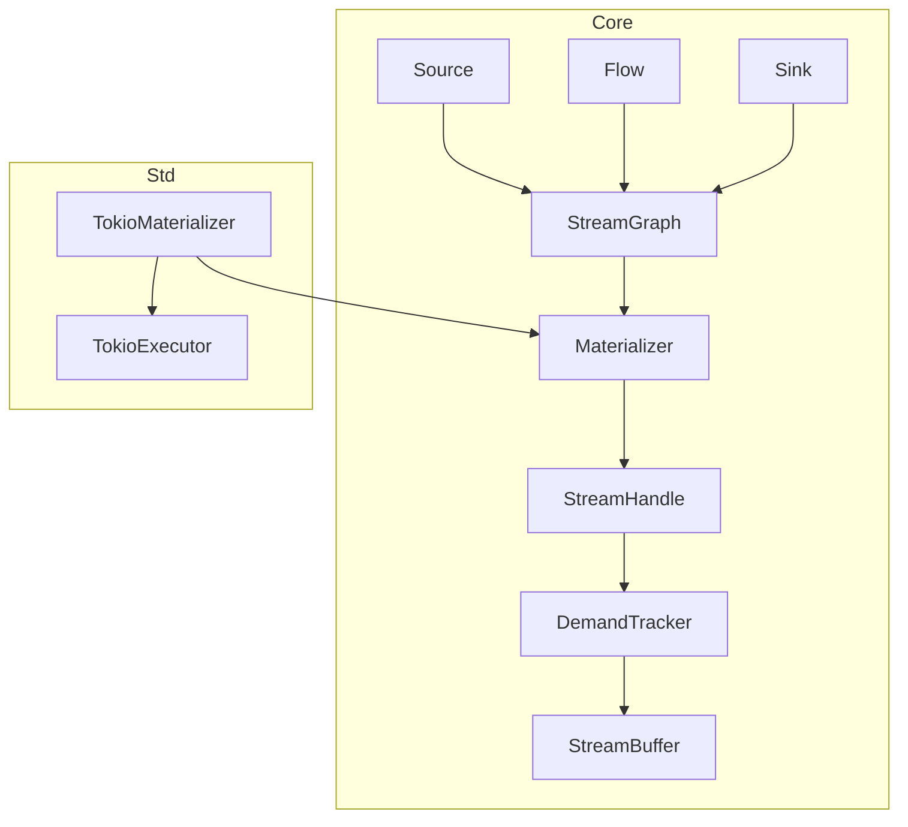
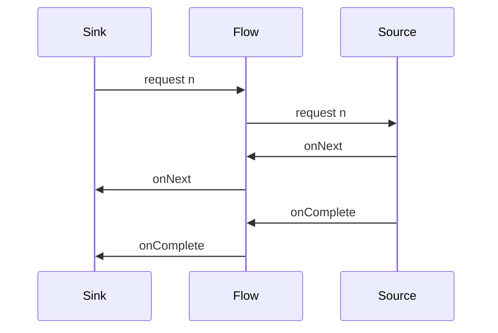
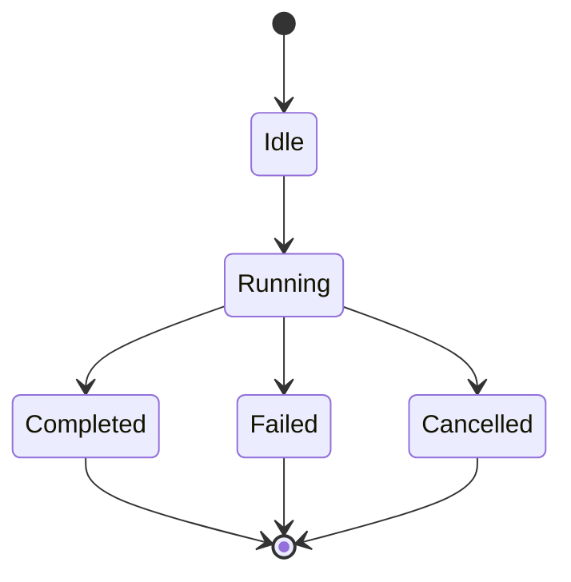

# 設計ドキュメント: fraktor-streams

## 概要
fraktor-streams は fraktor-rs にストリーム処理の最小コアを追加し、no_std でも利用できる Source/Flow/Sink と Materializer を提供する。需要伝播とバックプレッシャの契約を明文化し、実行モデルを core と std で分離することで、埋め込み環境とホスト環境の両方で一貫したストリーム API を実現する。

利用者は no_std 環境では手動駆動または外部実行器による進行を選択でき、std 環境では Tokio Materializer による自動駆動を利用する。ストリームの合成とマテリアライズ値の規則を固定し、完了・失敗・キャンセルの伝播を観測可能な契約として定義する。

影響範囲は新規クレート `fraktor-streams-rs`（`modules/streams`）に限定し、既存の actor/remote/cluster とは独立させる。将来的な ActorSystem 統合は設計で接点を示すが、このフェーズでは実装しない。

### 目標
- no_std でコンパイル可能なストリームの最小 API を提供する
- Source/Flow/Sink の合成とマテリアライズ値の規則を定義する
- std 環境向け Materializer で実行統合できる設計にする
- examples で最小構成の利用例を提供できる設計にする

### 非目標
- フル機能の Pekko Streams 相当オペレータ群
- Graph DSL や高度な最適化
- ActorSystem との自動連携や分散ストリーム

## アーキテクチャ

### 既存アーキテクチャ分析
- `core` は no_std 前提、`std` 実装は `std` 配下に隔離する。
- 共有所有権は `ArcShared`、同期は `ToolboxMutex` を標準とする。
- バックプレッシャ向けのキューは `modules/utils` の共通実装を必ず再利用する。
- `modules/streams/src/core` と `modules/streams/src/std` の 2 階層で独立配置し、actor への直接依存は避ける。

### パターンと境界マップ
**アーキテクチャ統合**
- 選択したパターン: データフロー型（Reactive Streams 準拠の需要伝播）
- 境界の切り方: ストリームコアは `core` に閉じ、実行ブリッジは `std` に限定
- 既存パターンの維持: core/std 分離・ArcShared/ToolboxMutex の共有ラッパ
- 新規コンポーネントの理由: ストリーム処理は actor/remote と異なる責務のため新規クレートで分離
- ステアリング適合: no_std ファースト、Less is more、YAGNI を維持
- 参照実装: `references/pekko/stream` の Source/Flow/Sink/Materializer を最小 API 設計の起点とする
 - 需要伝播の契約: request(n) は n > 0、需要は合算し上限に達した場合は Unbounded とみなす



### 技術スタック

| レイヤ | 選定 / バージョン | 役割 | 備考 |
|-------|------------------|------|------|
| ランタイム / 実行基盤 | no_std core + Tokio std | 実行駆動の分離 | std は tokio を利用 |
| クレート / 配置 | fraktor-streams-rs | 独立ストリーム層 | `modules/streams` |
| データ / 永続化 | なし | 対象外 | |
| メッセージング / イベント | `modules/utils` queue | バッファ/需要制御 | OverflowPolicy を利用 |
| 監視 / メトリクス | `EventStream`（将来統合） | 観測接点 | 本フェーズは拡張ポイントのみ |
| 互換性 / シリアライズ | なし | 対象外 | |

## システムフロー

### 需要とデータの伝播


### StreamHandle の状態遷移


## 要件トレーサビリティ

| 要件 | 概要 | 対応コンポーネント | インターフェイス | フロー |
|------|------|--------------------|------------------|--------|
| 1.1 | Source/Flow/Sink 型安全 | StreamGraph, Source, Flow, Sink | StreamStage | 需要とデータ伝播 |
| 1.2 | 型不一致の拒否 | StreamGraph | StreamGraph::connect | - |
| 1.3 | 接続関係の保持 | StreamGraph | StreamGraph | - |
| 2.1 | 合成後グラフ | StreamGraph, RunnableGraph | StreamGraph::build | - |
| 2.2 | マテリアライズ値 | Materializer, StreamHandle | Materializer::materialize | - |
| 2.3 | 合成規則の一貫性 | Materializer | Materializer | - |
| 3.1 | Materializer 起動 | Materializer | Materializer::start | 状態遷移 |
| 3.2 | Materializer 停止 | Materializer, StreamHandle | Materializer::shutdown | 状態遷移 |
| 3.3 | 実行状態管理 | StreamHandle | StreamHandle | 状態遷移 |
| 4.1 | 需要伝播 | DemandTracker | DemandTracker | 需要とデータ伝播 |
| 4.2 | 需要なしの抑止 | DemandTracker, StreamBuffer | DemandTracker | 需要とデータ伝播 |
| 4.3 | バックプレッシャ抑制 | StreamBuffer | StreamBuffer | - |
| 5.1 | 完了通知 | StreamHandle | StreamHandle | 需要とデータ伝播 |
| 5.2 | エラー伝播 | StreamHandle, StreamError | StreamHandle | 需要とデータ伝播 |
| 5.3 | キャンセル伝播 | StreamHandle | StreamHandle::cancel | 需要とデータ伝播 |
| 6.1 | core no_std | コア全体 | - | - |
| 6.2 | std 依存隔離 | TokioMaterializer | - | - |
| 6.3 | core API 無依存 | コア全体 | - | - |
| 7.1 | std 実行統合 | TokioMaterializer, TokioDriver | - | - |
| 7.2 | Materializer で実行基盤利用 | TokioMaterializer | TokioMaterializer | - |
| 7.3 | std 無効時の無依存 | core 全体 | - | - |
| 8.1 | examples 提供 | Examples | - | - |
| 8.2 | core への std 非侵入 | Examples | - | - |
| 8.3 | 最小合成の動作提示 | Examples | - | - |

## コンポーネントとインターフェイス

ストリーム関連の型は `modules/streams/src/core` と `modules/streams/src/std` に配置し、1ファイル1型のルールを維持する。

| コンポーネント | ドメイン/層 | 目的 | 要件対応 | 主要依存 (P0/P1) | 契約 |
|---------------|------------|------|----------|------------------|------|
| StreamGraph | Core | グラフ合成と型検証 | 1.1, 1.2, 1.3, 2.1 | utils queue(P1) | Service |
| Source/Flow/Sink | Core | ストリーム構成要素 | 1.1 | StreamGraph(P0) | Service |
| Materializer | Core | マテリアライズとライフサイクル | 2.2, 2.3, 3.1, 3.2 | StreamHandle(P0) | Service |
| StreamHandle | Core | 実行状態・完了/失敗/キャンセル | 3.3, 5.1, 5.2, 5.3 | DemandTracker(P0) | State |
| DemandTracker/StreamBuffer | Core | 需要伝播とバッファ制御 | 4.1, 4.2, 4.3 | utils queue(P0) | State |
| TokioMaterializer | Std | 実行基盤統合 | 7.1, 7.2, 7.3 | tokio(P0) | Service |
| Examples | Std | 最小利用例の提供 | 8.1, 8.2, 8.3 | TokioMaterializer(P0), Source/Flow/Sink(P0) | API |

### Core

#### StreamGraph

| 項目 | 内容 |
|------|------|
| 目的 | ストリーム構成要素の接続関係と型整合性を管理する |
| 対応要件 | 1.1, 1.2, 1.3, 2.1 |
| オーナー/レビュー | - |

**責務と制約**
- Source/Flow/Sink の接続を保持し、型不一致を拒否する
- RunnableGraph へ変換するための静的情報を保持する
- no_std で完結し、std 依存を持たない
- マテリアライズ値の合成規則は MatCombine で指定し、未指定時は KeepLeft を用いる

**依存関係**
- Inbound: Source/Flow/Sink — 接続情報の登録（P0）
- Outbound: RunnableGraph — 合成結果の生成（P0）
- External: なし

**契約**: Service [x] / API [ ] / Event [ ] / Batch [ ] / State [ ]

##### サービスインターフェイス（Rust）
```rust
pub trait StreamGraph {
  fn connect(
    &mut self,
    upstream: PortId,
    downstream: PortId,
    combine: MatCombine
  ) -> Result<(), StreamError>;
  fn build(self) -> Result<RunnableGraph, StreamError>;
}
```
- 前提条件: すべてのポートが型整合している
- 事後条件: 合成済み RunnableGraph を返す
- 不変条件: 接続関係は破壊されない

#### Source/Flow/Sink

| 項目 | 内容 |
|------|------|
| 目的 | ストリームの入口・変換・出口を型安全に表現する |
| 対応要件 | 1.1 |
| オーナー/レビュー | - |

**責務と制約**
- 入出力型と形状を明示し、Graph へ登録可能にする
- 1ファイル1型で配置し、内部合成は trait で共通化する

**依存関係**
- Inbound: 利用者コード — 構成定義（P0）
- Outbound: StreamGraph — 構成登録（P0）
- External: なし

**契約**: Service [x] / API [ ] / Event [ ] / Batch [ ] / State [ ]

##### サービスインターフェイス（Rust）
```rust
pub trait StreamStage {
  type In;
  type Out;
  fn shape(&self) -> StreamShape;
}
```
- 前提条件: shape は不変
- 事後条件: Graph 合成で利用できる
- 不変条件: 入出力型の整合

#### Materializer

| 項目 | 内容 |
|------|------|
| 目的 | RunnableGraph を実行状態へ変換し、ライフサイクルを管理する |
| 対応要件 | 2.2, 2.3, 3.1, 3.2 |
| オーナー/レビュー | - |

**責務と制約**
- マテリアライズ値を合成規則で返却する
- start/shutdown でストリーム全体を制御する
- no_std で動作可能な最小 API を維持する
- no_std では実行タスクを持たず、StreamHandle::drive による手動進行を前提とする

**依存関係**
- Inbound: RunnableGraph — 実行対象（P0）
- Outbound: StreamHandle — 実行状態管理（P0）
- External: なし

**契約**: Service [x] / API [ ] / Event [ ] / Batch [ ] / State [ ]

##### サービスインターフェイス（Rust）
```rust
pub trait Materializer {
  fn start(&mut self) -> Result<(), StreamError>;
  fn materialize(&mut self, graph: RunnableGraph) -> Result<Materialized, StreamError>;
  fn shutdown(&mut self) -> Result<(), StreamError>;
}
```
- 前提条件: start 済みである
- 事後条件: Materialized が返り、合成済みマテリアライズ値が取得できる
- 不変条件: 合成規則は固定

#### StreamHandle

| 項目 | 内容 |
|------|------|
| 目的 | 実行状態・完了/失敗/キャンセルを管理する |
| 対応要件 | 3.3, 5.1, 5.2, 5.3 |
| オーナー/レビュー | - |

**責務と制約**
- 完了/失敗/キャンセルの状態遷移を一貫させる
- demand とバッファの状態を可視化可能にする
- no_std では drive によって実行を前進させる

**依存関係**
- Inbound: Materializer — 実行開始（P0）
- Outbound: DemandTracker — 需要伝播（P0）
- External: なし

**契約**: Service [ ] / API [ ] / Event [ ] / Batch [ ] / State [x]

##### サービスインターフェイス（Rust）
```rust
pub trait StreamHandle {
  fn state(&self) -> StreamState;
  fn cancel(&mut self) -> Result<(), StreamError>;
  fn drive(&mut self) -> DriveOutcome;
}
```
- 前提条件: Running 状態
- 事後条件: Cancelled へ遷移
- 不変条件: 状態遷移は単方向

#### DemandTracker / StreamBuffer

| 項目 | 内容 |
|------|------|
| 目的 | 需要伝播とバッファ制御を担う |
| 対応要件 | 4.1, 4.2, 4.3 |
| オーナー/レビュー | - |

**責務と制約**
- request n を上流へ伝播し、需要なし時は生成を抑止する
- バッファは `modules/utils` の Queue を使用する
- request(0) は無効として StreamError に変換する
- 需要が上限に達した場合は Unbounded として扱う

**依存関係**
- Inbound: StreamHandle — 需要調整（P0）
- Outbound: StreamBuffer — バッファ制御（P0）
- External: utils queue — バッファ実体（P0）

**契約**: Service [ ] / API [ ] / Event [ ] / Batch [ ] / State [x]

### Std

#### TokioMaterializer

| 項目 | 内容 |
|------|------|
| 目的 | Tokio 実行基盤でストリームを駆動する |
| 対応要件 | 7.1, 7.2, 7.3 |
| オーナー/レビュー | - |

**責務と制約**
- Tokio runtime 上で Materializer を自動駆動する
- core へ std 依存を持ち込まない

**依存関係**
- Inbound: 利用者コード — std 実行環境（P0）
- Outbound: Materializer — 実行制御（P0）
- External: tokio — タスク/タイマ（P0）

**契約**: Service [x] / API [ ] / Event [ ] / Batch [ ] / State [ ]

##### サービスインターフェイス（Rust）
```rust
pub trait TokioMaterializer {
  fn start(&mut self) -> Result<(), StreamError>;
  fn shutdown(&mut self) -> Result<(), StreamError>;
}
```
- 前提条件: tokio runtime が有効
- 事後条件: 実行タスクが起動/停止する
- 不変条件: core API への依存方向は維持される

#### Examples

| 項目 | 内容 |
|------|------|
| 目的 | examples で最小利用例を提供する |
| 対応要件 | 8.1, 8.2, 8.3 |
| オーナー/レビュー | - |

**責務と制約**
- Source/Flow/Sink と Materializer の最小合成を示す
- std 環境で実行可能であり、core へ std 依存を持ち込まない
- actor などの他モジュールへ依存しない

**依存関係**
- Inbound: 利用者コード — 参照/実行（P0）
- Outbound: なし
- External: tokio — 実行基盤（P0）

**契約**: Service [ ] / API [x] / Event [ ] / Batch [ ] / State [ ]

## データモデル

### ドメインモデル
- StreamGraph（合成単位）
- RunnableGraph（実行単位）
- StreamHandle（実行状態）
- Demand（需要量）

### 論理データモデル
- StageId/PortId: 接続と型整合の識別子
- Demand: `Finite(u64)`（1..=u64::MAX）または `Unbounded`
- MatCombine: `KeepLeft` / `KeepRight` / `KeepBoth` / `KeepNone`（合成は左から右に適用）
- Materialized: `StreamHandle` と合成済みマテリアライズ値の組
- DriveOutcome: `Progressed` / `Idle`
- StreamState: Idle/Running/Completed/Failed/Cancelled

### データ契約と連携
- なし（外部シリアライズは対象外）

## エラーハンドリング

### 方針
- `StreamError` による統一エラー型
- 回復可能: 不正な接続/未起動/需要不足
- 致命的: 実行時エラー/内部不整合

### エラー分類と応答
**入力系**: 型不一致/未接続/request(0) → 明確な拒否理由  
**システム系**: 実行中の失敗 → 失敗状態へ遷移し下流へ伝播  
**ビジネス系**: 対象外

### 監視
- 失敗/完了/キャンセルは状態遷移として記録
- 将来の EventStream 連携を想定した拡張ポイントを保持

## テスト戦略

- 単体テスト:
  - StreamGraph の型不一致拒否
  - Demand 伝播と需要不足時の抑止
  - StreamHandle の状態遷移
- 統合テスト:
  - Source->Flow->Sink の最小構成が完了まで動く
  - エラー伝播が下流に到達する
  - TokioMaterializer が start/stop を実行できる
- no_std/std の差分検証:
  - core の no_std ビルド
  - std 有効時の Materializer ビルド

## オプション

### 性能/スケーラビリティ
- バッファ容量は OverflowPolicy と組み合わせて調整する
- demand 伝播は O(1) の更新を基本とする

## Supporting References
- 詳細な調査結果は `research.md` に集約
- 参照元: `references/pekko/stream/src/main/scala/org/apache/pekko/stream/Materializer.scala`
- 参照元: `references/pekko/stream/src/main/scala/org/apache/pekko/stream/scaladsl/Source.scala`
- 参照元: `references/pekko/stream/src/main/scala/org/apache/pekko/stream/scaladsl/Flow.scala`
- 参照元: `references/pekko/stream/src/main/scala/org/apache/pekko/stream/scaladsl/Sink.scala`
