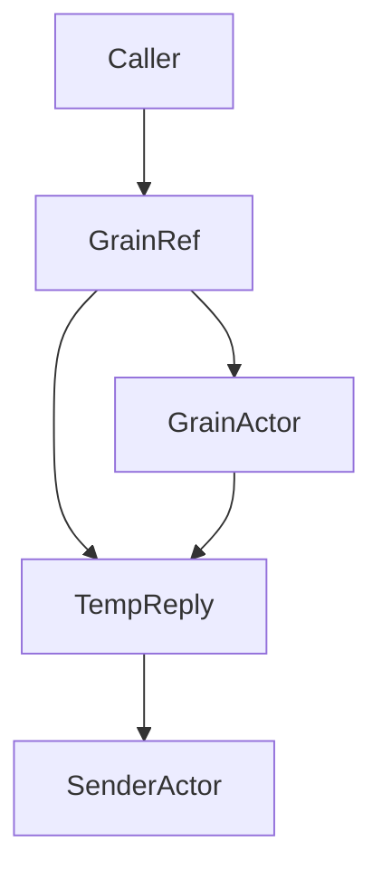
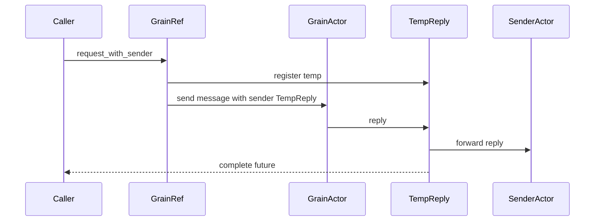

# 設計ドキュメント

## 概要
本機能は、GrainRef に送信者（ユーザが用意したアクター参照）を明示できる API を追加し、Grain からの返信が送信アクターへ確実に届く経路を提供する。主な価値は untyped ベースの sender 返信モデルを維持しつつ、非アクター送信の temp reply actor との整合性を保つことにある。

利用者は `tell_with_sender` / `request_with_sender` を通じて sender を指定し、返信の配送先を制御できる。既存の `request` / `request_future` は温存し、送信者未指定時の temp reply actor 方式を維持する。

### 目標
- sender 指定 API を追加し、Grain 返信を指定したアクター参照へ配送する
- retry/timeout/失敗通知など既存の呼び出し特性を維持する
- ask 応答ハンドルは返信と同一内容で完了する

### 非目標
- typed API の設計変更
- temp reply actor を廃止する大規模な再設計
- 送信者指定時に future を返さない API への変更

## アーキテクチャ

### 既存アーキテクチャ分析（必要な場合）
- GrainRef は temp reply actor を生成し、`AnyMessageGeneric::with_sender` で sender を設定して送信する
- retry/timeout は temp reply actor を前提に再送・クリーンアップを行う
- sender 伝搬は `AnyMessageGeneric` → `message_invoker` → `ActorContext` で確立されている

### Architecture Pattern & Boundary Map（パターンと境界マップ）
**アーキテクチャ統合**
- 選択したパターン: 既存の temp reply actor を拡張し、返信の転送と future 完了を同一機構で実現
- 境界の切り方: GrainRef の API 拡張に留め、他モジュールの API を増やさない
- 既存パターンの維持: sender は message envelope に保持し ActorContext に反映する
- 新規コンポーネントの理由: 新規の専用プロキシは追加せず既存構成の拡張に留める
- ステアリング適合: Less is more / YAGNI を維持



### Technology Stack & Alignment（技術スタック）

| レイヤ | 選定 / バージョン | 役割 | 備考 |
|-------|------------------|------|------|
| ランタイム / 実行基盤 | fraktor-actor-rs core | ActorRef / sender 伝搬 | 既存構成を流用 |
| メッセージング / イベント | AnyMessageGeneric / EventStream | sender 伝搬 / 失敗通知 | 新規依存なし |
| 監視 / メトリクス | GrainEvent / GrainMetrics | 既存通知を踏襲 | 変更なし |

## システムフロー

### request_with_sender フロー


## 要件トレーサビリティ

| 要件 | 概要 | 対応コンポーネント | インターフェイス | フロー |
|------|------|--------------------|------------------|--------|
| 1.1 | sender 指定送信 | GrainRefGeneric | tell_with_sender | request_with_sender フロー |
| 1.2 | ask 応答ハンドル返却 | GrainRefGeneric | request_with_sender | request_with_sender フロー |
| 1.3 | 既存解決/送信手順 | GrainRefGeneric | resolve_with_retry | request_with_sender フロー |
| 1.4 | オプション意味維持 | GrainRetryRunnable | retry/timeout | request_with_sender フロー |
| 1.5 | future 完了内容の一致 | GrainReplySender | forward + complete | request_with_sender フロー |
| 2.1 | sender への返信配送 | GrainReplySender | forward | request_with_sender フロー |
| 2.2 | 未指定時の既存挙動 | GrainRefGeneric | request | 既存 request フロー |
| 2.3 | 返信先取り違え防止 | GrainReplySender | per-call reply sender | request_with_sender フロー |
| 3.1 | 解決失敗の返却 | GrainRefGeneric | request_with_sender | request_with_sender フロー |
| 3.2 | 送信失敗の返却 | GrainRefGeneric | tell_with_sender | request_with_sender フロー |
| 3.3 | 失敗イベント通知 | GrainEvent | publish | request_with_sender フロー |
| 4.1 | サンプルコード | Examples | cluster_extension_* | 例示フロー |
| 4.2 | 既存例更新 | Examples | cluster_extension_* | 例示フロー |

## Components & Interface Contracts（コンポーネントとインターフェイス）

| コンポーネント | ドメイン/層 | 目的 | 要件対応 | 主要依存 (P0/P1) | 契約 |
|---------------|------------|------|----------|------------------|------|
| GrainRefGeneric | Cluster Core | sender 指定 API と既存呼び出しの統合 | 1.1, 1.2, 1.3, 1.4, 3.1, 3.2 | ClusterApi(P0), AnyMessageGeneric(P0) | Service |
| GrainReplySender | Cluster Core | 返信の forward と future 完了 | 1.5, 2.1, 2.3 | ActorFutureShared(P0), ActorRefGeneric(P0) | Service |
| GrainRetryRunnable | Cluster Core | retry/timeout と失敗通知 | 1.4, 3.3 | Scheduler(P0), GrainEvent(P1) | Service |
| Cluster examples | Examples | sender 指定 API の利用例 | 4.1, 4.2 | GrainRefGeneric(P0) | API |

### Cluster Core

#### GrainRefGeneric

| 項目 | 内容 |
|------|------|
| 目的 | sender 指定 API を追加し、既存呼び出しと統合する |
| 対応要件 | 1.1, 1.2, 1.3, 1.4, 3.1, 3.2 |

**責務と制約**
- 送信者指定 API の提供（tell/request）
- 既存の解決・送信・timeout/retry フローの再利用
- no_std/std 境界は既存 `RuntimeToolbox` のまま

**依存関係**
- Inbound: Cluster API 利用者 — GrainRef API 呼び出し（P0）
- Outbound: ClusterApiGeneric — PID 解決（P0）
- Outbound: AnyMessageGeneric — sender 付きメッセージ作成（P0）

**契約**: Service [x] / API [ ] / Event [ ] / Batch [ ] / State [ ]

##### サービスインターフェイス（Rust）
```rust
impl<TB: RuntimeToolbox + 'static> GrainRefGeneric<TB> {
  pub fn tell_with_sender(
    &self,
    message: &AnyMessageGeneric<TB>,
    sender: &ActorRefGeneric<TB>,
  ) -> Result<(), GrainCallError>;

  pub fn request_with_sender(
    &self,
    message: &AnyMessageGeneric<TB>,
    sender: &ActorRefGeneric<TB>,
  ) -> Result<AskResponseGeneric<TB>, GrainCallError>;
}
```
- 前提条件: sender はユーザが用意したアクター参照である
- 事後条件: request_with_sender の future は sender に配送された返信と同じ内容で完了する
- 不変条件: 既存 `request`/`request_future` の振る舞いを変更しない

**実装ノート**
- 統合ポイント: `resolve_with_retry` / `GrainCallOptions` / `publish_grain_event`
- バリデーション: `GrainCodec` が有効な場合は既存の検証を流用
- リスク: sender 指定と未指定の混在時の取り違えはテストで検証する

#### GrainReplySender

| 項目 | 内容 |
|------|------|
| 目的 | 返信を sender に転送しつつ future を完了させる |
| 対応要件 | 1.5, 2.1, 2.3 |

**責務と制約**
- 返信を sender に転送
- 同一返信で future を完了
- temp reply actor として `/temp` 登録される
- sender が未指定の場合は従来通り future 完了のみを行う
- sender が指定された場合は同一返信で future 完了と sender への転送を同時に行う

**依存関係**
- Inbound: GrainRefGeneric — 返信ハンドル作成（P0）
- Outbound: ActorRefGeneric — sender への転送（P0）
- Outbound: ActorFutureSharedGeneric — future 完了（P0）

**契約**: Service [x] / API [ ] / Event [ ] / Batch [ ] / State [ ]

##### サービスインターフェイス（Rust）
```rust
pub struct GrainReplySender<TB: RuntimeToolbox + 'static> {
  // 返信完了用 future と、任意の転送先 sender
}
```
- 前提条件: 返信メッセージは AnyMessageGeneric として受信する
- 事後条件: 返信は sender に転送され、future は同じ内容で完了する
- 不変条件: sender 未指定時は既存の完了動作のみを行う

**実装ノート**
- 統合ポイント: temp reply actor 登録/解除
- バリデーション: sender 転送失敗時は future 完了を優先し、失敗イベントで観測可能にする
- リスク: 二重配送を防ぐため、sender 転送は 1 回だけ行う

#### GrainRetryRunnable

| 項目 | 内容 |
|------|------|
| 目的 | retry/timeout の既存動作を sender 指定時にも維持 |
| 対応要件 | 1.4, 3.3 |

**責務と制約**
- retry/timeout 時の再送と失敗通知
- temp reply actor のクリーンアップを継続

**実装ノート**
- 統合ポイント: `schedule_retry_with_system` の既存使用
- リスク: sender 指定であっても再送は同じ sender を設定する

### Examples

#### cluster_extension_* examples

| 項目 | 内容 |
|------|------|
| 目的 | sender 指定 API の利用例を示す |
| 対応要件 | 4.1, 4.2 |

**実装ノート**
- 統合ポイント: `GrainRefGeneric::request_with_sender` を使った例に更新
- バリデーション: 返信が sender アクターへ届くことをログで確認できる
- リスク: 既存の例を壊さないため、従来の request 例は残すか明示的に置き換える

## データモデル
変更なし。

## エラーハンドリング

### 方針
- 既存の `GrainCallError` / `ClusterRequestError` を維持
- sender 転送失敗は送信失敗として EventStream に通知し、呼び出し側には future 完了で返す

### エラー分類と応答
- 入力系: 無効メッセージ → 既存の送信エラー
- システム系: 解決失敗/送信失敗/タイムアウト → 既存のエラーとイベント
- ビジネス系: Grain 側の判断に委譲

### 監視
- `GrainEvent::CallFailed` / `CallTimedOut` / `CallRetrying` を継続利用

## テスト戦略

- 単体テスト
  - sender 指定で返信が future に到達する
  - sender 指定で返信が sender へ配送される
  - sender 指定と未指定の混在で取り違えが起きない
- 統合テスト
  - cluster_extension_tokio で sender 指定の往復が成功する
  - cluster_extension_no_std で sender 指定の往復が成功する

## オプション

### 性能/スケーラビリティ
- 返信転送の追加コストは sender への 1 回送信のみ
- retry/timeout の回数と負荷は既存の `GrainCallOptions` に従う
