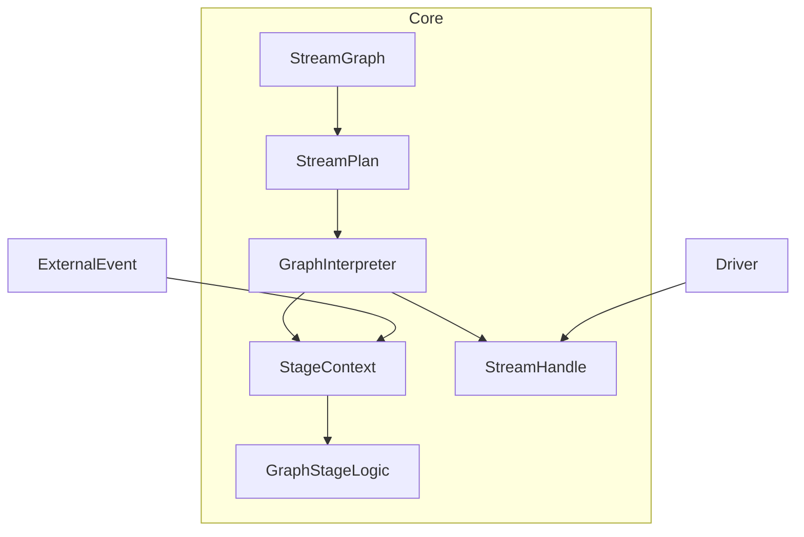
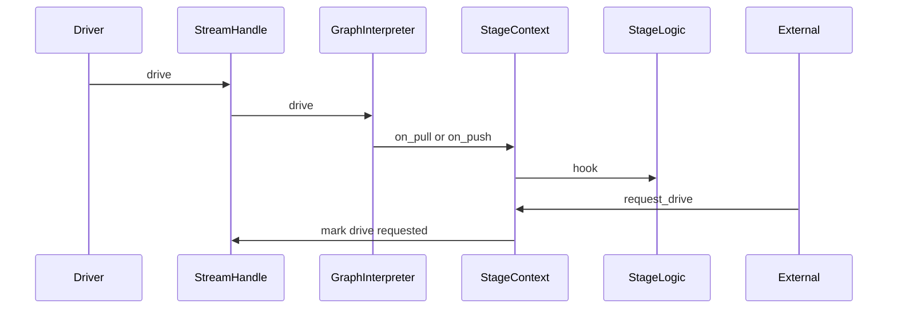

# 設計ドキュメント

---
**目的**: 実装者間の解釈ずれを防ぎ、実装の一貫性を担保するための設計情報を提供する。

**方針**:
- 実装判断に直結するセクションのみを残す
- 誤実装を誘発しない範囲で簡潔に書く
- 複雑さに応じて詳細度を調整する
- 長文より図・表を優先する
- Rust 向けに **型・所有権・エラー・no_std/std 境界** を明示する

**警告**: 1000 行に近づく場合、機能が過剰に複雑であり設計の簡素化が必要。
---

## 概要
本設計は、fraktor-streams の実行系を GraphStage 中心に再構成し、拡張性と Pekko 互換性を高めるための基盤を定義する。利用者は既存の Source/Flow/Sink DSL を維持しつつ、GraphStage のフックで拡張可能なストリーム処理を実現する。

この変更は core 実行系（StreamGraph/GraphInterpreter/StageContext）に集中し、駆動スケジューリングや実行環境との統合は拡張側の責務とする。公開 API の大枠は保持しつつ、実行契約は GraphStage に一本化される。

### 目標
- GraphStage をストリーム実行の唯一の抽象として統合する
- ステージライフサイクルと需要駆動を GraphStage フックで表現する
- 外部イベントからの再駆動を安全に受け付ける

### 非目標
- fan-in/out を含む複雑な GraphDSL の追加
- ActorRef Source/Sink などの高機能コンビネータの追加
- 駆動スケジューリングの具体実装（拡張側で扱う）

## アーキテクチャ

### 既存アーキテクチャ分析（必要な場合）
- 現状は `SourceLogic`/`FlowLogic`/`SinkLogic` が実行経路を担い、GraphStage は実行系に接続されていない。
- `GraphInterpreter` は直列パイプライン前提で、イベント駆動の拡張に不向き。
- `StreamHandle` は駆動境界として機能しており、この責務は維持する。

### パターンと境界マップ
**アーキテクチャ統合**
- 選択したパターン: GraphStage 中心のイベント駆動インタプリタ
- 境界の切り方: core は GraphStage 定義と実行、駆動スケジューリングは拡張側に委譲
- 既存パターンの維持: Source/Flow/Sink DSL
- 新規コンポーネントの理由: StageContext に再駆動の契約を追加し外部イベント連携を可能にする
- ステアリング適合: no_std と FQCN 原則を維持し、std 依存は拡張側へ隔離



### 技術スタック

| レイヤ | 選定 / バージョン | 役割 | 備考 |
|-------|------------------|------|------|
| ランタイム / 実行基盤 | fraktor-streams core / workspace | GraphStage 実行系 | 既存スタック維持 |
| データ / 永続化 | 変更なし | 該当なし | - |
| 監視 / メトリクス | 変更なし | 該当なし | - |
| 互換性 / シリアライズ | 変更なし | 該当なし | - |

## システムフロー



## 要件トレーサビリティ

| 要件 | 概要 | 対応コンポーネント | インターフェイス | フロー |
|------|------|--------------------|------------------|--------|
| 1.1 | GraphStageLogic を生成 | GraphInterpreter | GraphStage | マテリアライズ |
| 1.2 | GraphStage 定義で構築 | StreamGraph | StreamGraph | グラフ構築 |
| 1.3 | GraphStage フックで実行 | GraphInterpreter | GraphStageLogic | drive |
| 1.4 | 無効定義は失敗 | StreamGraph, GraphInterpreter | StreamGraph | マテリアライズ |
| 2.1 | 開始フックを一度呼ぶ | GraphInterpreter | GraphStageLogic | start |
| 2.2 | 完了伝播 | GraphInterpreter | GraphStageLogic | complete |
| 2.3 | 失敗通知 | GraphInterpreter | GraphStageLogic | error |
| 2.4 | キャンセルで終了 | StreamHandle, GraphInterpreter | StreamHandle | cancel |
| 3.1 | on_pull 通知 | GraphInterpreter, StageContext | StageContext | drive |
| 3.2 | on_push 通知 | GraphInterpreter, StageContext | StageContext | drive |
| 3.3 | 需要なし送出禁止 | GraphInterpreter | StageContext | drive |
| 3.4 | 需要超過抑止 | GraphInterpreter | StageContext | drive |
| 4.1 | 外部イベント再駆動 | StageContext, StreamHandle | StageContext | request_drive |
| 4.2 | 停止後は無視 | StageContext, StreamHandle | StageContext | request_drive |
| 4.3 | 影響なしなら不変 | GraphInterpreter | GraphStageLogic | drive |

## コンポーネントとインターフェイス

| コンポーネント | ドメイン/層 | 目的 | 要件対応 | 主要依存 (P0/P1) | 契約 |
|---------------|------------|------|----------|------------------|------|
| StreamGraph | Core | GraphStage 定義の構築と検証 | 1.2, 1.4 | StreamPlan(P0) | State |
| GraphInterpreter | Core | GraphStage 実行と需要制御 | 1.1, 1.3, 2.1-2.4, 3.1-3.4 | StageContext(P0) | Service |
| StageContext | Core | フック呼び出しと再駆動受付 | 3.1-3.4, 4.1-4.3 | StreamHandle(P0) | Service |
| StreamHandle | Core | drive/cancel の公開窓口 | 2.4, 4.1, 4.2 | GraphInterpreter(P0) | Service |

### Core

#### StreamGraph

| 項目 | 内容 |
|------|------|
| 目的 | GraphStage 定義を束ね、実行可能な計画へ変換する |
| 対応要件 | 1.2, 1.4 |

**責務と制約**
- Source/Flow/Sink から GraphStage 定義を収集する
- 接続や型の整合を検証し、無効定義は失敗とする
- no_std を維持し std 依存を持たない

**依存関係**
- Inbound: Source/Flow/Sink DSL — 定義入力（P0）
- Outbound: StreamPlan — 実行計画の生成（P0）

**契約**: Service [ ] / API [ ] / Event [ ] / Batch [ ] / State [x]

**実装ノート**
- 統合ポイント: 既存の StreamGraph/StageDefinition を GraphStage 由来へ置換する
- バリデーション: グラフ接続の整合チェックを継続する
- リスク: 既存 DSL の合成規則変更に注意する

#### GraphInterpreter

| 項目 | 内容 |
|------|------|
| 目的 | GraphStageLogic を駆動しストリームの状態を遷移させる |
| 対応要件 | 1.1, 1.3, 2.1-2.4, 3.1-3.4 |

**責務と制約**
- ステージの開始・完了・失敗・キャンセルを統一的に処理する
- 需要とバッファを基準に on_pull/on_push を発火する
- グラフ実行の状態遷移を一元的に管理する

**需要駆動規約**
- 需要が 0 から正に遷移したとき、on_pull を 1 回だけ通知する
- on_pull が発火した後、on_push/on_complete/on_error のいずれかが起きるまで on_pull を再通知しない
- 需要が残っていない状態で push が要求されたならば、StreamError::DemandExceeded として失敗させる
- on_push 前に pull が重複して呼ばれたならば、StreamError::InvalidDemand として失敗させる
- 終端状態では on_pull/on_push/request_drive を発火しない

**依存関係**
- Inbound: StreamHandle — drive/cancel の起点（P0）
- Outbound: StageContext — フック実行と需要制御（P0）

**契約**: Service [x] / API [ ] / Event [ ] / Batch [ ] / State [ ]

##### サービスインターフェイス（Rust）
```rust
pub trait StreamExecutor {
  fn start(&mut self) -> Result<(), StreamError>;
  fn drive(&mut self) -> DriveOutcome;
  fn cancel(&mut self) -> Result<(), StreamError>;
  fn state(&self) -> StreamState;
}
```
- 前提条件: start は未開始状態でのみ呼び出す
- 事後条件: drive は状態遷移を伴う可能性がある
- 不変条件: 終端状態の再駆動は状態を変更しない

**実装ノート**
- 統合ポイント: 既存 GraphInterpreter の実行パスを GraphStage へ統合する
- バリデーション: 需要不足時は送出しないことを保証する
- リスク: 直列前提の最適化が崩れる可能性がある

#### StageContext

| 項目 | 内容 |
|------|------|
| 目的 | GraphStageLogic へ実行コンテキストを提供し再駆動を受け付ける |
| 対応要件 | 3.1-3.4, 4.1-4.3 |

**責務と制約**
- pull/push/complete/fail を通じて需要制御を表現する
- 外部イベントから再駆動要求を受け付ける
- ストリーム停止後の再駆動要求は無視する

**依存関係**
- Inbound: GraphInterpreter — フック実行の入口（P0）
- Outbound: StreamHandle — 再駆動の要求先（P0）

**契約**: Service [x] / API [ ] / Event [ ] / Batch [ ] / State [ ]

##### サービスインターフェイス（Rust）
```rust
pub trait StageContext<In, Out> {
  fn pull(&mut self);
  fn grab(&mut self) -> In;
  fn push(&mut self, out: Out);
  fn complete(&mut self);
  fn fail(&mut self, error: StreamError);
  fn request_drive(&self);
}
```
- 前提条件: request_drive はストリームが実行中である
- 事後条件: drive 要求が記録され、外部ドライバが次回 drive できる
- 不変条件: 終端状態では request_drive が無効

**実装ノート**
- 統合ポイント: 既存 StageContext へ再駆動契約を追加する
- バリデーション: 再駆動が無効な状態を明示的に抑止する
- リスク: 外部イベントが過剰に drive 要求を発生させる

#### StreamHandle

| 項目 | 内容 |
|------|------|
| 目的 | ストリーム駆動とキャンセルの公開窓口を提供する |
| 対応要件 | 2.4, 4.1, 4.2 |

**責務と制約**
- drive/cancel/state の契約を公開する
- 外部イベントによる再駆動の窓口になる

**依存関係**
- Inbound: 外部ドライバ — drive 呼び出し（P0）
- Outbound: GraphInterpreter — 実行本体（P0）

**契約**: Service [x] / API [ ] / Event [ ] / Batch [ ] / State [ ]

##### サービスインターフェイス（Rust）
```rust
pub trait StreamHandle {
  fn id(&self) -> StreamHandleId;
  fn state(&self) -> StreamState;
  fn drive(&self) -> DriveOutcome;
  fn cancel(&self) -> Result<(), StreamError>;
}
```
- 前提条件: drive は開始済みのストリームに限る
- 事後条件: drive は内部状態を前進させる
- 不変条件: 終端状態では drive が状態を変えない

**実装ノート**
- 統合ポイント: StageContext の再駆動要求を StreamHandle に集約する
- バリデーション: 終端状態の drive/cancel を無害化する
- リスク: drive 要求が連続しても idempotent であることを担保する

## データモデル

### ドメインモデル
- 変更なし

### 論理データモデル
- 変更なし

### 物理データモデル（必要な場合）
- 変更なし

### データ契約と連携
- 変更なし

## エラーハンドリング

### 方針
- `StreamError` を基準に失敗状態へ遷移させる
- 外部イベントは終端状態では無視し、エラー化しない

### エラー分類と応答
**入力系**: 不正なステージ定義 → マテリアライズ失敗  
**システム系**: 実行中の異常 → StreamError::Failed へ集約  
**ビジネス系**: 該当なし  

### 監視
- 既存の StreamHandle 状態を利用し、追加の監視要件は設けない

## テスト戦略

- 単体テスト: GraphStageLogic の on_start/on_pull/on_push 呼び出し順序
- 単体テスト: 需要不足時の送出抑止と drive の idempotent 動作
- 単体テスト: request_drive が終端状態で無害であること
- 統合テスト: StreamHandle と GraphInterpreter の再駆動フラグ連携
