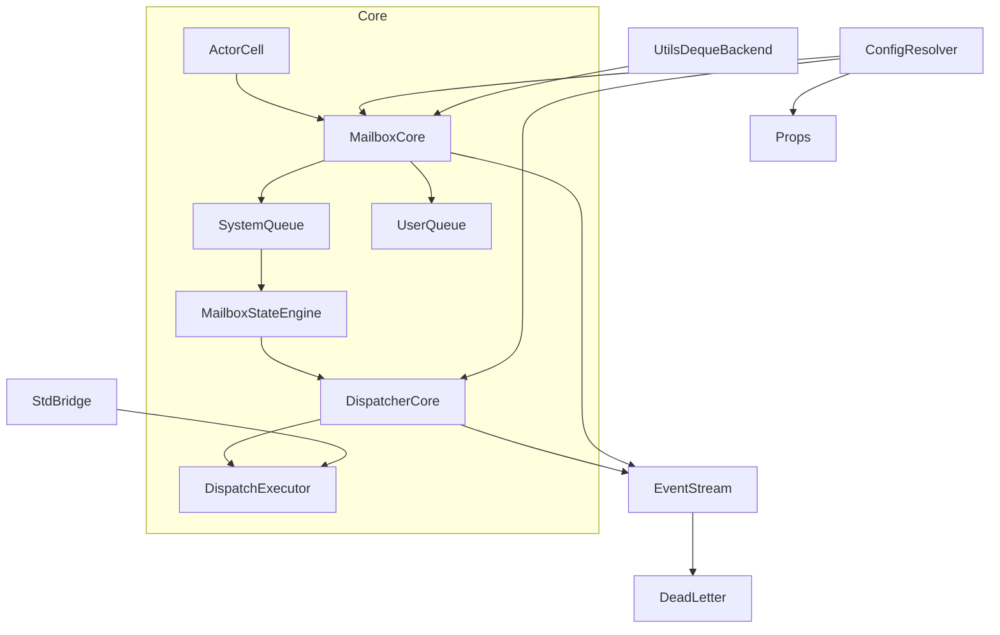
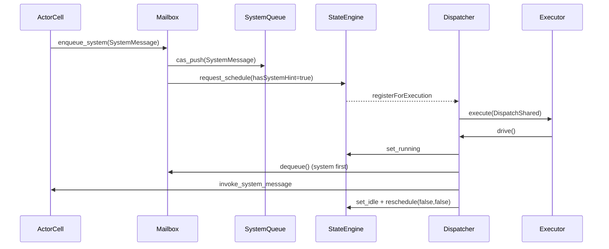
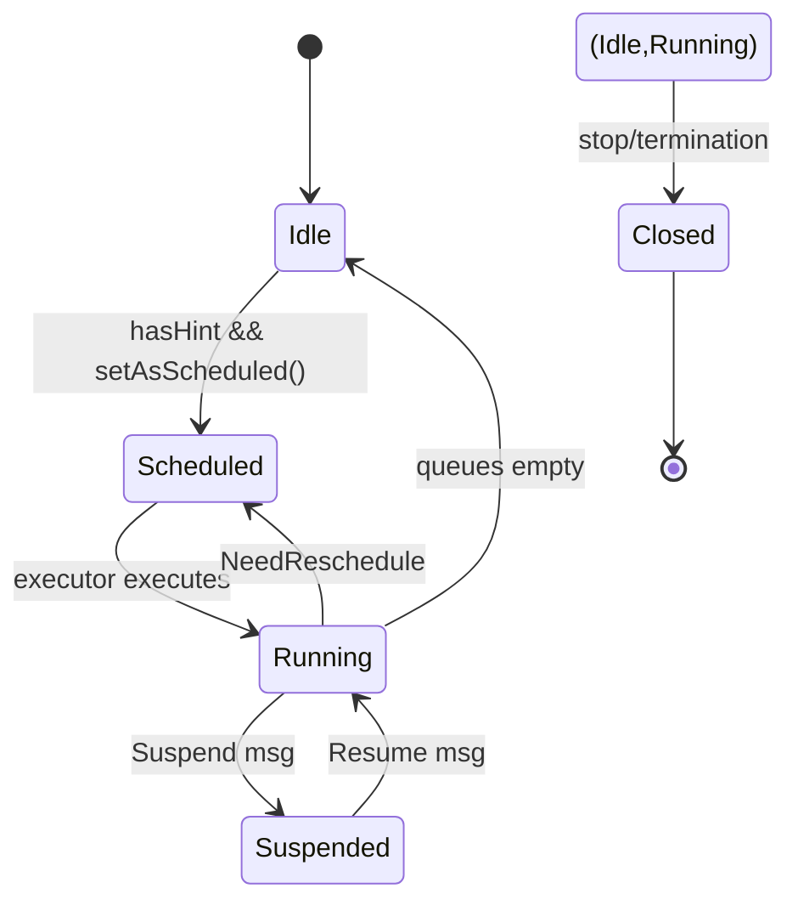
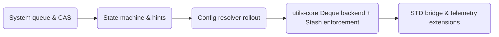

# Overview
cellactor-rs の Mailbox/Dispatcher パイプラインを Pekko 互換の動作保証へリファクタリングし、system message 優先度、バックプレッシャー、設定解決、STD ブリッジ、観測性を段階的に実現する。ターゲットは runtime core を運用するプラットフォーム開発者および actor ライブラリ利用者であり、既存 API 互換を保ちつつ determinism と構成柔軟性を高める。

ユーザは runtime core（no_std）と actor-std（Tokio 等）を統一 API で扱い、SystemMessage 処理や Mailbox キャパシティを制御しつつ、Stash/Configurator といった Pekko 流の操作を Rust 上で再現できる。これにより運用者は設定駆動で dispatcher/mailbox を差し替え、観測性担当は EventStream によるメトリクスメッセージから状態を追跡できる。

### Goals
- SystemMailbox/Dispatcher を Pekko 互換仕様（system queue CAS、registerForExecution ヒント、RejectedExecution リトライ）へ揃える。
- Mailbox バックプレッシャー、Stash 対応、utils-core Deque backend を統合し、Block 戦略や `RequiresMessageQueue<Deque>` を満たす。
- Config resolver/STD ブリッジ/Telemetry 拡張を通じて設定駆動アーキテクチャと可観測性を提供し、段階移行を可能にする。

### Non-Goals
- Actor API（Props/Typed API）の大幅な機能追加や DSL 変更。
- Protoactor や他ランタイムとの完全互換化。
- 永続化ストアや外部クラスタリングへの対応（今後の拡張対象）。

## Architecture

### Existing Architecture Analysis
- **MailboxGeneric** は system/user キューを分離せず FIFO 処理に近い簡素構造で、system queue CAS や Stash 前提の deque API を欠く。`QueueHandles` は VecRingBackend の MPSC を直接 expose し、Block 時は `QueueOfferFuture` を返すのみ。
- **DispatcherGeneric/Core** は Idle/Running の 2 状態と inline executor 頼りの schedule で、hasMessageHint/hasSystemMessageHint を考慮しない。RejectedExecution ハンドリングは無い。
- **Config/Props** は `DispatcherConfig::from_executor` 程度で、`Mailboxes.scala` のような解決層や `RequiresMessageQueue` チェックを行っていない。
- **STD ブリッジ** (`actor-std`) は Tokio thread pool を `spawn_blocking` で呼ぶだけで、waker/notify 連携や backpressure 起点のレスケジュールが無い。

### High-Level Architecture

**Architecture Integration**
- 既存パターン（ActorCell→Mailbox→Dispatcher→Executor）を維持しつつ、SystemQueue・StateEngine・ConfigResolver・StdBridge を差し込む。
- 新コンポーネントは `modules/actor-core/src/mailbox/system_queue.rs` など独立ファイルとして 2018 モジュール構造を遵守。
- no_std/STD の二層構造を保ちながら、utils-core（lock-free MPSC + Deque backend）で抽象度を統一。
- Steering で定義された FQCN import、type-per-file、イベント駆動観測を継続。

### Technology Alignment
- Rust nightly + no_std を前提に、`portable-atomic` / `spin` / `ArcShared` を継続利用。新規外部依存は不要。
- utils-core へ Deque backend と WaitQueue 拡張を追加するが、既存 `VecRingStorage` を re-use し storage 増分のみ。
- Config resolver は既存 Props API を維持し、ホスト側が Rust API で登録した `DispatcherConfig`/`MailboxConfig` を `Props::with_dispatcher` 等が参照するだけなので呼び出し側の型変化は不要。
- STD ブリッジは `actor-std` 内部で Tokio/Thread executors をラップし、core へ新 trait を導入しない。

### Key Design Decisions
1. **Decision**: System queue を lock-free CAS リストとして mailbox に内包し、system drain 後に registerForExecution false hints を再送する。
   - **Context**: SystemMessage ordering と DeadLetter フォールバックを Pekko と揃える必要がある。
   - **Alternatives**: (a) `VecDeque` をそのまま使う、(b) Mutex ベース list、(c) CAS ベース単方向リスト。
   - **Selected Approach**: (c) CAS list を `AtomicPtr<SystemQueueNode>` で実装し、enqueue 失敗時は unlink + retry。drain 時は LIFO→FIFO 変換し DeadLetter へ送る。
   - **Rationale**: Pekko 互換の determinism と lock contention の少なさを両立。
   - **Trade-offs**: 実装複雑度上昇、unsafe ブロックの慎重な検証が必要。

2. **Decision**: Mailbox state machine を Scheduled/Suspended/Running/Closed + suspend counter + NeedReschedule flag に拡張。
   - **Context**: registerForExecution hint、Stash suspend/resume、Block 戦略を deterministic にする必要。
   - **Alternatives**: (a) 既存 bool/single state、(b) Rust enum + AtomicU32、(c) 抽象ステートマシン trait。
   - **Selected Approach**: (b) `AtomicU32` に bitfield を割り当て（primary state + suspend count + scheduled bit）し、Pekko の `Mailbox.Status` を模倣。
   - **Rationale**: Pekko と同一論理を再現しやすく、CAS で競合制御がしやすい。
   - **Trade-offs**: 状態遷移を誤ると livelock の恐れ、包括的テストが必須。

3. **Decision**: Config resolver を `Dispatchers`/`Mailboxes` として追加し、Props から dispatcher/mailbox ID を **Rust API で登録された** `DispatcherConfig`/`MailboxConfig` に必ずマッピングする。
   - **Context**: Pekko の `Dispatchers.lookup`/`Mailboxes.getMailboxType` 機構をファイルに依存せず Rust コード内で再現する必要。
   - **Alternatives**: (a) Props に直接ロジックを書く、(b) SystemState に配置、(c) サービスモジュール化。
   - **Selected Approach**: (c) `modules/actor-core/src/config/dispatchers.rs` 等で Resolver + Registry を定義し、ホストアプリが `Dispatchers::register(id, DispatcherConfig)` / `Mailboxes::register(id, MailboxConfig)` を呼んだ後に ActorSystem を起動する。Props の `with_dispatcher("custom-id")` 等は Resolver を経由して構造体を取得し、既存 `DispatcherConfig`/`MailboxConfig` 型をそのまま利用する。
   - **Rationale**: API ベースで設定を差し替えられるため、ビルド時に型安全に構成でき、外部ファイルのパースやフォーマット差異に依存しない。
   - **Trade-offs**: 初期ブートストラップで Resolver に適切な登録を行わないと ActorSystem 生成が失敗するため、起動コードに追加の初期化手順が必要。

## System Flows

### SystemMessage Dispatch Flow

### Mailbox State Machine

### Migration Phases

## Requirements Traceability
| Req | サマリ | 主担当コンポーネント | インターフェース | 対応フロー |
| --- | --- | --- | --- | --- |
| R1 | system message 優先 + CAS | `SystemQueue`, `MailboxStateEngine` | `enqueue_system`, `system_drain` | SystemMessage Dispatch |
| R2 | Dispatcher scheduling/リトライ | `DispatcherCore`, `DispatchExecutorAdapter` | `register_for_execution`, `execute` | Sequence + State Machine |
| R3 | Backpressure/Block/Stash | `MailboxCore`, `DequeBackend`, `BackpressurePublisher` | `enqueue_user`, `MailboxOfferFuture`, `StashDeque` | State Machine |
| R4 | Telemetry/Dump | `MailboxInstrumentation`, `DispatcherDump` | `publish_metrics`, `export_dump` | System Flow (EventStream) |
| R5 | Mailbox state machine | `MailboxStateEngine` | `set_as_scheduled`, `set_as_idle` | State diagram |
| R6 | Config 駆動解決 | `Dispatchers`, `Mailboxes` | `resolve_dispatcher(id)`, `resolve_mailbox(requirement)` | Migration P3 |
| R7 | STD ブリッジ | `StdBridge`, `TokioAdapter` | `spawn_async`, `yield_waker` | System Flow extension |
| R8 | Future handshake | `MailboxOfferFuture`, `MailboxPollFuture`, `ScheduleWaker` | `poll_pending`, `poll_user_future` | Sequence |
| R9 | utils-core queue capability | `DequeBackend`, `QueueCapabilityRegistry` | `push_front`, `pop_front`, `ensure_blocking_future` | Migration P4 |

## Components and Interfaces

### System Queue Layer
- **SystemQueueNode** (`modules/actor-core/src/mailbox/system_queue.rs`)
  - Fields: `next: AtomicPtr<SystemQueueNode>`, `message: SystemMessage`, `deadletter_on_fail: bool`。
  - API: `fn push(&self, msg: SystemMessage) -> Result<(), SystemQueueError>`、`fn drain(&self) -> SystemMessageList`。
  - Error: `SystemQueueError::Full` は DeadLetter に転送。
- **SystemQueueObserver**: dequeue 後に `EventStream` へ `MailboxMetricsEvent` を publish。

### Mailbox State Engine
- Located at `mailbox/state_engine.rs`。`AtomicU32` で bitfield を管理。
- API: `fn request_schedule(&self, hints: ScheduleHints) -> bool`, `fn set_running(&self)`, `fn set_idle(&self, need_reschedule: bool)`。
- Maintains suspend counter, scheduled bit, closed flag。
- Interacts with Dispatcher via `ScheduleHints { has_user_hint, has_system_hint }`。

### Backpressure & Deque Infrastructure
- **DequeBackend MVP** (`utils-core/src/collections/queue/deque_backend.rs`)
  - `SpinMutex<VecDeque<T>>` を backend に持つ single-consumer multi-producer deque を提供。`offer_back/offer_front` と `poll_front/poll_back` をサポートし、Block 戦略時は `DequeOfferFuture` で待機する。
  - WaitQueue 連携で `offer_blocking_*` が `QueueOfferFuture` 互換の wake を受け取れるようにし、Mailbox 側の Block 戦略で利用する。
- **QueueCapabilityRegistry**
  - `QueueCapability::{Mpsc, Deque, BlockingFuture}` を宣言し、Mailbox/Props/Spawner が必要 capability を検証できるようにする。欠落時は `QueueCapabilityError::Missing` を返し、SpawnError に紐付ける。
- **BackpressurePublisher フェーズ分割**
  1. *Phase BP-1 (この iteration)*: MailboxInstrumentation が 75% 以上で `EventStreamEvent::MailboxPressure` を publish。Dispatcher 抑制や DeadLetter 連携はまだしない。
  2. *Phase BP-2*: DispatcherCore が `MailboxPressureEvent` を消費し、StateEngine 経由で registerForExecution 頻度を抑制する。BackpressurePublisher が Dispatcher へヒントを渡すための hook を追加する。
- **StashDequeHandle ロードマップ**
  - ステップ0: Mailbox に Deque backend を初期化する capability を追加し、RequiresMessageQueue 検証の土台を作る（本 iteration）。
  - ステップ1: `actor-core/src/stash/` に `DequeHandle` と `StashConfig` を導入し、Props が要件を宣言できるようにする（次 iteration）。
  - ステップ2: Typed/Classic API へ stash/unstash を公開し、Deque capability を runtime で強制する。

### Blocking Strategy & Timeout API
- Mailbox の Block 戦略は `QueueOfferFuture`/`DequeOfferFuture` で「空きが出るまで待機」するが、Pekko 互換の timeout/DeadLetter 処理を追加するには runtime 全体でタイマー抽象化が必要。
- **Timer Abstraction**: SystemState に monotonic clock があるものの、Future 経由で timeout を伝搬する API が未定義。次フェーズで `DelayFuture`（tokio/no_std 切り替え可能）を導入し、`MailboxOfferFuture::with_timeout(Duration)` を設計する。
- **Timeout Handling Flow**: Mailbox enqueue → (Block strategy) → Timeout 発生で DeadLetter + `Result::Err` を返す → DispatcherSender が送信者へ伝播。design にこのフローを明記。

### Backpressure/Dispatcher Integration (新セクション)
1. MailboxInstrumentation が `MailboxPressureEvent` を publish。
2. SystemState が PressureEvent を EventStream へ流しつつ、将来的に Dispatcher へ Notification を転送する hook を持つ。
3. DispatcherCore/StateEngine が pressure 状態を保持し、registerForExecution の頻度や throughput を調整。
4. BackpressurePublisher は EventStream 経由の telemetry に加え、`ScheduleHints` へ「backpressure active」ビットを追加予定（今後の iteration）。

### RequiresMessageQueue & Stash (更新)
- `RequiresMessageQueue` 相当の仕組みは Rust 側に存在しないため、以下の MVP を採用：
  - Props に `MailboxRequirement` を追加し（例: `MailboxRequirement::Deque`）、Spawner が `QueueCapabilityRegistry` を用いて検証する。
  - Mailbox 生成時に capability を宣言し、欠落時は `SpawnError::MailboxCapabilityMissing { requirement, mailbox }` を返す。
  - Stash 本体は次フェーズで導入し、`StashDequeHandle` が `DequeBackend` を wrap する。

### Dispatcher Enhancements
- **DispatcherCore v2** (`dispatcher/dispatcher_core.rs`)
  - `register_for_execution` で `hasMessageHint/hasSystemMessageHint` を受け取り、`MailboxStateEngine::request_schedule` を呼び出す。
  - `execute_with_retry` で executor の `RejectedExecution` を 2 回リトライ後に `EventStream` へ `LogEvent::Error` を publish。
- **DispatchExecutorAdapter**
  - Interface: `fn execute(&self, task: DispatchShared) -> Result<(), DispatchError>`。
  - STD 側（Tokio/Thread）と no_std Inline executor を抽象化。

### Config Resolution
- **Dispatchers** (`config/dispatchers.rs`)
  - Stores map<`DispatcherId`, `DispatcherDescriptor`>。
  - API: `fn register(id: &str, cfg: DispatcherConfig)` / `fn resolve(id: &str) -> Result<DispatcherDescriptor, ConfigError>`。
  - `DispatcherDescriptor` includes `throughput`, `deadline`, `executor_adapter`。
- **Mailboxes** (`config/mailboxes.rs`)
  - Maintains requirement bindings: `RequiresMessageQueue<Trait>` → `MailboxType`。
  - API: `fn register(id: &str, cfg: MailboxConfig)` / `resolve_mailbox(props: &Props, dispatcher_config: &DispatcherDescriptor) -> Result<MailboxTypeDescriptor, ConfigError>`。
  - Handles Deque requirement mismatch → `ConfigError::RequirementMismatch`。
  - Host アプリは ActorSystem を生成する前に両サービスへ登録を行い、Props/ActorCell は常にこれらを経由して設定を取得する。

### utils-core Queue Capability Registry
- Adds `QueueCapability` enum (Mpsc, Deque, BlockingFuture)。`Deque` capability は `DequeBackend` の SpinMutex 実装を返し、`BlockingFuture` capability は `QueueOfferFuture`/`QueuePollFuture` を生成できる backend であることを示す。
- `QueueCapabilityRegistry::ensure(capability)` で backend 実装を提供。Mailbox 初期化時に `QueueCapabilitySet { mpsc: bool, deque: bool, blocking_future: bool }` を宣言し、registry が未実装 capability の場合は build エラー (`QueueCapabilityError::Missing`) を返す。
- Registry は `ArcShared<QueueCapabilityProvider>` を返し、Mailbox が system/user queue と stash queue を初期化する際に同じ provider から適切な backend を得るため、MPSC/Deque の互換性が保証される。

### STD Bridge & Telemetry
- **StdBridge** (`actor-std/src/bridge/scheduler.rs`)
  - `ScheduleAdapter` trait を新設し、no_std では `InlineScheduleAdapter` が、STD では `TokioScheduleAdapter`/`ThreadScheduleAdapter` が `create_waker()` と `spawn_scheduled(task: DispatchShared, hints: ScheduleHints)` を実装する。`ScheduleWaker` は adapter を引数に取り、Tokio では `tokio::task::waker_ref` を用いた waker を返し、no_std では従来の spin-loop waker を返す。
  - MailboxOfferFuture/MailboxPollFuture は `ScheduleAdapter::create_waker()` が生成した waker で poll されるため、STD/nostd どちらでも NeedReschedule が正しく通知される。RejectedExecution 発生時は `StdBridge::notify_rejected()` が adapter 経由で `EventStream` へ backpressure イベントを publish し、同時に `MailboxStateEngine::set_idle(false)` を呼び出す。
- **DispatcherDump** (`actor-std/src/diagnostics/dispatcher_dump.rs`)
  - API: `fn dump(&self) -> DispatcherDump` (per actor queue length, executing worker IDs)。
  - Called via runtime admin API or CLI。

## Data Models

### Domain Concepts
- **DispatcherDescriptor**: `{ id: String, throughput: usize, deadline_ms: Option<u64>, mailbox_type: Option<String>, executor_kind: ExecutorKind }`。
- **MailboxTypeDescriptor**: `{ id, capacity: Option<usize>, overflow: OverflowStrategy, requires_deque: bool }`。
- **ScheduleHints**: bitflags representing presence of system/user work。
- **StashConfig**: `{ capacity: usize, requires_deque: bool }`。Props 由来。

### Data Contracts & Integration
- **EventStreamEvent::MailboxPressure**: `{ pid: Pid, user_percent: u8, capacity: Option<usize>, timestamp: Duration }`。
- **DispatcherDump** JSON (admin API): `[{ actor: String, pid: Pid, mailbox_user_len: usize, state: String, worker: Option<String> }]`。
- **Config Provisioning API**: ホストアプリは `Dispatchers::register(id, DispatcherConfig)` / `Mailboxes::register(id, MailboxConfig)` を ActorSystem 初期化前に呼び出し、設定ファイルではなく Rust コード内で型安全に構成する。

## Error Handling
- **SystemQueueError**: `Full`, `CasConflict`, `Closed` → `DeadLetterReason::MailboxFull` or re-enqueue。
- **DispatchError**: `RejectedTwice`, `ExecutorUnavailable` → EventStream log + `MailboxStateEngine::set_idle(false)`。
- **ConfigError**: `UnknownDispatcher`, `UnknownMailbox`, `RequirementMismatch` → Actor creation失敗 (`SpawnError::InvalidProps`)。
- **StashOverflowError**: capacity 超過で `DeadLetterReason::MailboxFull` + log。
- **TelemetryPublishError**: EventStream subscriber未登録でも noop（fail open）。

### Monitoring
- MailboxInstrumentation に `MailboxPressure` publish を追加。
- DispatcherDump を `SystemState` へ登録し CLI から取得。
- `tokio-console` 連携用に `StdBridge` で `tracing` span を emit。

## Testing Strategy
- **Unit**
  1. SystemQueue push/drain の CAS 再試行。
  2. MailboxStateEngine suspend/resume + register hints。
  3. Dispatchers requirement 解決と mismatched error。
  4. DequeBackend push_front/pop_front + Block future。
  5. StdBridge RejectedExecution リトライ。
- **Integration**
  1. ActorCell→Mailbox→Dispatcher end-to-end で system message ordering。
  2. Props から dispatcher/mailbox ID を割り当てて actor spawn。
  3. Stash trait を有効化した actor で stash/unstash
  4. EventStream から MailboxPressure/DispatcherDump を取得。
  5. Tokio executor 上で大量 enqueue を行い backpressure future が正しく待機する。
- **Performance/Load**
  1. System queue CAS 実装の contention 測定 (multi-core)。
  2. Block strategy で長時間 backpressure 時の GC/alloc を監視。
  3. DispatcherDump のオーバーヘッド計測 (<5% 目標)。

## Security Considerations
- Config resolver はホストアプリから渡された `DispatcherConfig`/`MailboxConfig` だけを扱い、外部ファイルやユーザ入力を受け付けない。
- DispatcherDump API はデフォルトでローカル管理者のみ利用可にし、PII（メッセージ内容）を含めず queue 長のみを返す。
- MailboxPressure イベントはログスパム防止のため rate-limit を設ける。

## Performance & Scalability
- System queue CAS は 1 actor あたり O(1) enqueue/dequeue を維持し、1 スレッドあたり 1M ops/s を目標。
- Block 戦略の Future は `WaitQueue` を O(1) で wake/disarm する。
- Dispatcher throughput/deadline 設定によりフェアネスとバッチ処理を両立（デフォルト 300 msg/loop）。
- StdBridge は Tokio runtime の `yield_now` を組み合わせ、長時間の busy-spin を避ける。

## Migration Strategy
1. **P1**: System queue/CAS を導入（feature flag `pekko-system-queue`）。旧 queue を fallback として保持。
2. **P2**: State engine + register hints + RejectedExecution リトライを有効化。メトリクスを比較し安定を確認。
3. **P3**: Config resolver を ship。既存 Props は旧挙動を default とし、新 resolver を opt-in。CI で新旧を並走。
4. **P4**: utils-core Deque backend を導入し、Stash actor のみ opt-in。Block 戦略の telemetry を追加。
5. **P5**: StdBridge/Tokio adapter + dispatcher dump をデフォルト化し、古い `spawn_blocking` 経路を削除。

Rollback は各フェーズで feature flag を戻すことで即時無効化できる。
