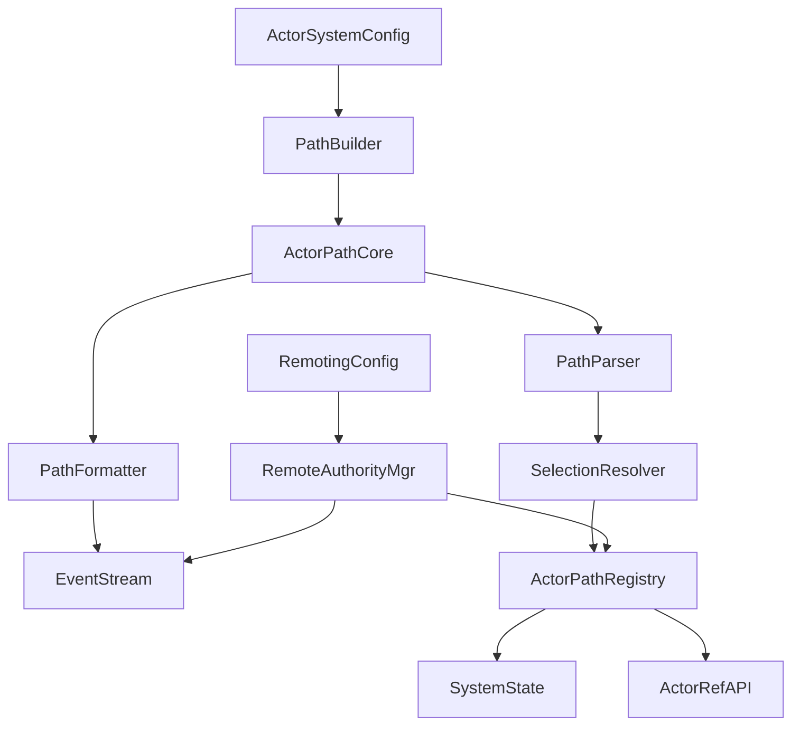
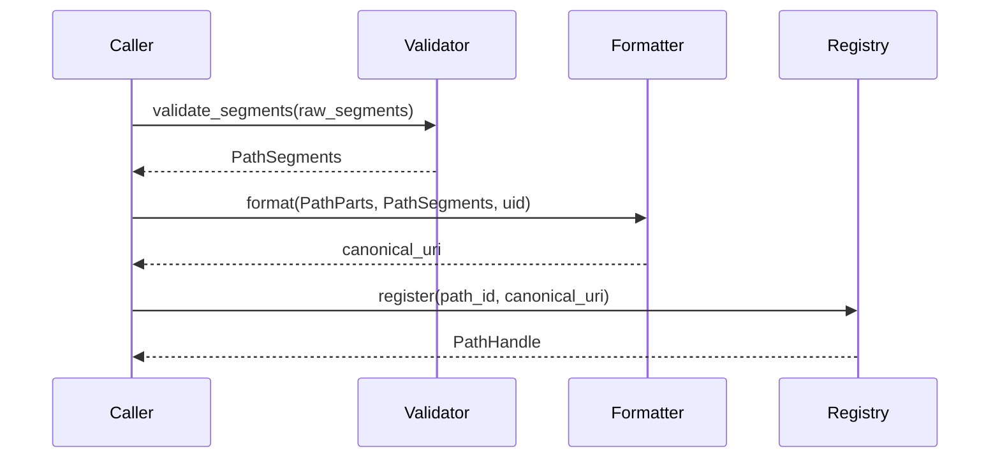
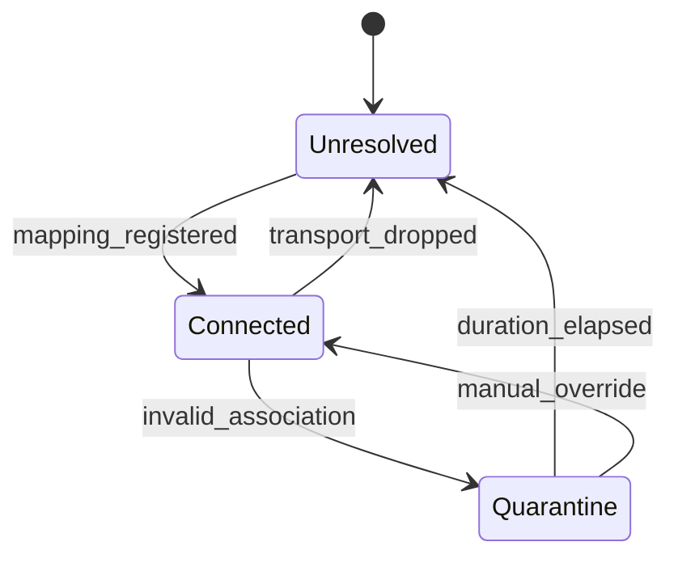
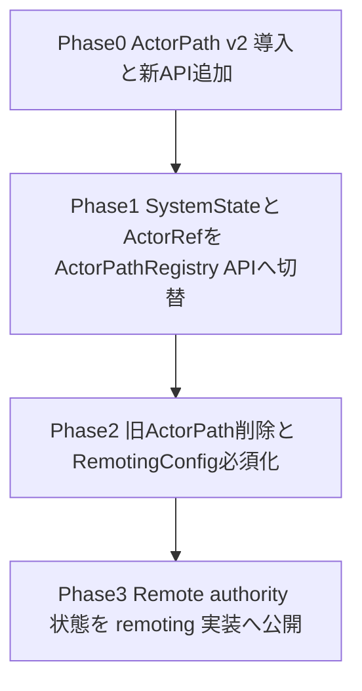

# Design Document

## Overview
fraktor ランタイムの ActorPath を Pekko 互換仕様へ拡張し、ログ・DeadLetter・Remoting すべてで同一の URI 形式を提供する。ユーザは ActorSelection や監視 API から Pekko と同じパス規約を前提にでき、将来的な remoting 実装を阻害しない。

本機能は ActorSystem の内部モジュール（`actor_prim`, `system`, `config`）が対象であり、外部 API は ActorSystemConfig/RemotingConfig などの明示的な型経由でパラメータ化する。これにより no_std 環境でも設定ファイルに依存せずに起動時 API だけで設定できる。

### Goals
- Pekko 互換の ActorPath 正規化／文字列表現を Rust 値オブジェクトとして再設計する。
- ActorSelection・DeathWatch・Remote authority 管理を同一 ActorPath モデル上で実現する。
- 設定ファイルを導入せず、`ActorSystemConfig` / `RemotingConfig` API から隔離期間や authority を上書きできるようにする。

### Non-Goals
- remoting トランスポートやシリアライザ本体は実装しない（別 Spec で扱う）。
- クラスタメンバー管理や Gossip 等の高位プロトコルは対象外。
- 既存の `ActorRef` API 互換性維持以上の外向き API 追加は行わない。

## Architecture

### Existing Architecture Analysis
- 現状 `actor_prim::actor_path::ActorPath` は単なる `Vec<String>` でルート `/` のみを扱い、authority・スキーム・UID が欠落している。
- `SystemState::actor_path` が PID から path を再構築しているが、正規化やキャッシュは無い。`ActorSelection` の相対解決や `%` エンコードも未実装。
- 設定は `config::*` レジストリ（dispatchers/mailboxes）に限定され、ActorSystem 全体設定は未定義。隔離期間などは値を持つ場所が無い。

### High-Level Architecture

**Architecture Integration**:
- 既存 `actor_prim` 層に `actor_path/` ディレクトリを新設し、各型を 1 ファイル配置する 2018 モジュール構成を維持。
- `ActorPathRegistry` を `system` 層に追加し、`SystemState` と `ActorRef` がここを介してパス情報へアクセスする。
- `ActorSystemConfig` / `RemotingConfig` を `config` 層で公開し、ランタイム起動時に API 経由で設定を注入する。
- Remote authority 状態（未解決/接続/隔離）は `RemoteAuthorityManager` で一元管理し、後続の remoting 実装がこの API を介する。

### Technology Stack and Design Decisions

#### Technology Alignment
- `actor-core` は `#![no_std]` のため、`alloc::String`, `Vec`, `ArrayVec` を利用しつつ `heapless::Vec` を必要箇所で選択する。
- 共有状態は既存ポリシーどおり `ArcShared<T>` + `RuntimeToolbox::MutexFamily`／`hashbrown::HashMap` で保護し、`portable-atomic` による UID 予約カウンタを利用する。
- 参照実装は `references/pekko/actor/...` と `references/protoactor-go/...` を一次資料とし、RFC2396 文字検証・UID 無視比較など Pekko 仕様を Rust イディオムに写像する。

#### Key Design Decisions
- **Decision**: ActorPath を `ActorPathParts`（スキーム・システム名・authority）と `PathSegments`（検証済みセグメント）に分割し、値オブジェクト階層を設ける。
  - **Context**: 既存 Struct は単一 `Vec<String>` のため正規化や UID 付与の責務が集中しバリデーションが分岐。一貫性を保つ仕組みが無い。
  - **Alternatives**: (1) 現行 Struct を拡張しフィールドを増やす、(2) 外部 Formatter が平文を保持、(3) ルートから子を辿る都度文字列連結。
  - **Selected Approach**: `ActorPath` 本体には `ActorPathParts` + `PathSegments` + `Option<ActorUid>` を保持し、Formatter/Parser はこれら値オブジェクトを介してのみ操作する。
  - **Rationale**: `no_std` でも型安全な分割ができ、単一責務のファイル構成とも整合する。Equality 判定やキャッシュが `PathSegments` ハッシュへ集約される。
  - **Trade-offs**: 値オブジェクトが増えファイル数が多くなるが lint 方針（1 ファイル 1 型）に適合する。
- **Decision**: 隔離期間や authority、システム名は `ActorSystemConfig` / `RemotingConfig` API で注入し、設定ファイルを前提にしない。
  - **Context**: 指示どおり設定ファイルを導入できず、将来の組み込みターゲットでも同じ API を使う必要がある。
  - **Alternatives**: (1) グローバル定数で固定、(2) builder ではなく `SystemState` に直接渡す、(3) Feature flag で compile-time 設定。
  - **Selected Approach**: `ActorSystemBuilder`（既存起動コード）に `with_actor_system_config` を追加し、`ActorSystemConfig` が `RemotingConfig` を内包。ユーザは API 経由で Duration や authority を指定。
  - **Rationale**: API 統一でテストもしやすく、`actor-core` の構成原則（config レジストリ）とも合致。
  - **Trade-offs**: 新しい Config 型の導入で初期化 API に破壊的変更が入る。
- **Decision**: Remote authority 状態をステートマシンとして `RemoteAuthorityManager` に隔離し、未解決/接続/隔離の遷移と InvalidAssociation 発火を一括制御する。
  - **Context**: Requirement 4 が状態遷移の整合を要求。SystemState に直書きすると複雑化し、後続 remoting 実装のテストも困難。
  - **Alternatives**: (1) `SystemState` に HashMap を内包、(2) `ActorPathRegistry` で状態も持つ、(3) EventStream に直接状態イベントを流すのみ。
  - **Selected Approach**: `RemoteAuthorityManager` が `HashMap<Authority, AuthorityState>` を保持し、`ActorPathRegistry` と EventStream を観測者として扱う。状態遷移 API は非同期でも deterministic。
  - **Rationale**: 状態図通りの遷移をテストしやすく、remoting モジュールが依存すべき明確な境界を提供。
  - **Trade-offs**: 新たな同期コスト（Mutex）が増える。
- **Decision**: RFC2396 準拠の汎用 URI パーサー層を `actor_path/uri_parser.rs` に分離し、その出力を `ActorPathParser` がドメイン検証する二段構えにする。
  - **Context**: 直接 `ActorPathParser` で文字列操作を行うと RFC のバリエーション（authority フォーマット、IPv6、percent-encoding など）のデバッグが困難になり、将来の remoting 拡張で URI 解析を再利用できない。
  - **Alternatives**: (1) 既存パーサーを強化し RFC 差分を都度吸収、(2) 外部クレート（`url` など）へ依存、(3) AST なしで分岐処理を積み増す。
  - **Selected Approach**: `UriParser` が RFC2396 に沿って `UriParts { scheme, authority, path, query, fragment }` を生成し、`ActorPathParser` はその AST から `pekko`/`pekko.tcp` 判定・guardian セグメント検証・UID サフィックス処理を実施する。エラー種別は汎用 (`UriError`) と ActorPath 固有 (`ActorPathError`) に分離し、ログやテストで原因を切り分ける。
  - **Rationale**: レイヤー分離により URI パース自体の再利用性とテスタビリティが向上し、ActorPath 仕様変更時も上位層のみを修正すればよい。
  - **Trade-offs**: 2 層分の型とテストが増えるが、`UriParser` を他モジュール（例: future remoting transport config）で再利用できるため長期的な保守コストを削減できる。

## Guardian パスとデフォルトセグメント
- `ActorSystemConfig` は `default_segments: GuardianSegments` を保持し、`GuardianSegments::System`（`["system"]`）と `GuardianSegments::User`（`["user"]`）の 2 種を提供する。起動時に ActorSystemBuilder が `ActorPathParts` と組み合わせて `pekko://<system>/<guardian>` を形成し、Pekko と同じ `/system`・`/user` ルートを常に先頭へ挿入する。
- `ActorPathBuilder`（`actor_path/path_builder.rs` 追加予定）が `ActorPath::child` を経由してもガーディアンより上位へ遡れないよう `RootKind` をトラッキングし、`ActorSelectionResolver` が `..` を解釈する際に `RootKind::contains(segment_index)` を参照してルート逸脱を検出する。逸脱時は `ActorPathError::RelativeEscape` を返す。
- authority 未指定 (`PathParts.authority.is_none()`) の場合でも formatter は `pekko://<system>/<guardian>/<segments>` を必ず生成し、guardian 名称を省略しない。`GuardianSegments` は `ActorSystemConfig::with_default_segments(GuardianSegments::User)` のように API で選択でき、`spawn_system`/`spawn_user` がそれぞれ該当ガーディアンを利用する。
- 予約セグメント（`$` 始まり）は guardian 配下の system actors のみに許可する。`PathSegment::new` が `$` 始まりを拒否し、System 側で必要な `$system` や `$user` は `GuardianSegments` による内部生成でのみ作成することで、ユーザ入力からの侵入を防ぐ。

## System Flows

### ActorPath 正規化シーケンス

### Remote authority 状態遷移

### Remote authority 配送シーケンス
1. `ActorSelectionResolver` が `ActorPathParts.authority = Some(authority)` のパスを解釈するとき、`RemoteAuthorityManager::state(authority)` を参照する。`Unresolved` なら `ActorPathRegistry::defer_send(authority, envelope)` を呼び出してエンベロープを延期キューに積み、同時に `RemoteAuthorityManager::mark_unresolved(authority)` が EventStream へ通知する。
2. ハンドシェイク完了や手動設定で `RemoteAuthorityManager::set_mapping(authority, address)` が呼ばれると `AuthorityState::Connected` へ遷移し、`ActorPathRegistry::poll_deferred(authority)` を即座に実行して保留メッセージを到達順に取り出し、Router へ再投入する。各配送は `authority` の canonical URI でログされる。
3. `InvalidAssociation` ／リトライ失敗などのイベントを受けた場合、`mark_quarantine(authority, reason)` が `AuthorityState::Quarantine { deadline }` を確立し、`deadline = now + quarantine_duration`（`RemotingConfig` 由来）を記録する。以降の `defer_send` 要求は即座に拒否され、`InvalidAssociation` が送信者ごと（エンベロープ単位）に `EventStream` へ発行される。
4. `quarantine_duration` 経過後は `RemoteAuthorityManager::try_lift_quarantine(authority, now)` が `AuthorityState::Unresolved` に戻し、保留キューをクリアして再解決サイクルを再開する。マニュアル解除 (`manual_override`) が呼ばれた場合は期限を無視して即座に `Connected` へ遷移し、再試行を許可する。

## Requirements Traceability
| Requirement | Summary | Components | Interfaces | Flows |
|-------------|---------|------------|-----------|-------|
| R1 | Canonical 文字列表現 | ActorPathValidator, ActorPathFormatter, ActorPathRegistry | `ActorPath::to_canonical`, `ActorPathFormatter::format` | ActorPath 正規化シーケンス |
| R2 | 解析と検証 | ActorPathParser, ActorSelectionResolver | `ActorPathParser::parse`, `ActorSelectionResolver::resolve_relative` | ActorPath 正規化シーケンス |
| R3 | 等価性・UID 予約・隔離 | ActorPathComparator, ActorPathRegistry, RemoteAuthorityManager | `ActorPathComparator::eq`, `ActorPathRegistry::reserve_uid`, `RemoteAuthorityManager::emit_invalid_association` | Remote authority 状態遷移 |
| R4 | Authority 状態管理 | RemoteAuthorityManager, RemotingConfig API | `RemoteAuthorityManager::set_state`, `RemotingConfig::quarantine_duration` | Remote authority 状態遷移 |

## Components and Interfaces

### actor_prim 層
- **`actor_path/segment.rs` (`PathSegment`)**: RFC2396 文字種と `$` 禁止の検証を行う値オブジェクト。`fn new(raw: &str) -> Result<Self, ActorPathError>` は `%HH` デコードを許容し、元の文字列と正規化後を保持。
- **`actor_path/parts.rs` (`ActorPathParts`)**: `scheme: ActorPathScheme`, `system: SystemName`, `authority: Option<PathAuthority>` を保持。`ActorSystemConfig` から生成され、`no_std` でも `&'static str` を使ってコピー回数を制限。
- **`actor_path/uri_parser.rs` (`UriParser`)**: `fn parse(input: &str) -> Result<UriParts<'_>, UriError>` が RFC2396 の階層的 URI（スキーム・authority・パス・クエリ・フラグメント）を AST に落とし込む。`percent_decode`・IPv6 literal・ユーザ情報等はここで扱い、ActorPath 固有の禁止要件は上位レイヤーへ委譲する。
- **`actor_path/uid.rs` (`ActorUid`)**: `u64` ラッパー。`ActorRef` 再生成時に `ActorPathRegistry` が UID 予約を判断する。
- **`actor_path/path.rs` (`ActorPath`)**: `parts`, `segments: PathSegments`, `uid: Option<ActorUid>` を束ねる不変構造。`fn child(&self, segment: PathSegment) -> Self` は親セグメントを再検証しない。
- **`actor_path/formatter.rs` (`ActorPathFormatter`)**: `fn format(path: &ActorPath) -> CanonicalUri`。`alloc::String` バッファを内部再利用し、authority の有無で分岐。
- **`actor_path/parser.rs` (`ActorPathParser`)**: `fn parse(input: &str) -> Result<ActorPath, ActorPathError>`。内部で `UriParser::parse` を呼び出し、戻り値から `pekko`/`pekko.tcp` スキーム検証・guardian パス確認・UID サフィックス検出を行う。`UriError` は `ActorPathError::InvalidUri(UriError)` としてラップし、RFC 違反と ActorPath 規約違反を区別できるようにする。
- **`actor_path/validator.rs` (`ActorPathValidator`)**: 入口すべてで呼ばれる。`fn validate_segment(segment: &str)` / `fn validate_relative(path: &str)` を提供。
- **`actor_path/comparator.rs` (`ActorPathComparator`)**: `fn eq(lhs, rhs)` が system/authority/segments だけを見る。`fn hash(path)` は UID 無視ハッシュを返す。
- **`actor_selection/resolver.rs` (`ActorSelectionResolver`)**: `fn resolve(base: &ActorPath, selection: &ActorSelectionExpr) -> Result<ActorPath, ActorPathError>`。`..` 処理と未解決 authority の保留を `ActorPathRegistry` に通知。

### system 層
- **`system/actor_path_registry.rs` (`ActorPathRegistry`)**: `HashMap<Pid, ActorPathHandle>` を保持。`reserve_uid(pid, uid)`、`canonical_path(pid)`、`defer_send(authority, envelope)` を提供し、`RemoteAuthorityManager` と連携して延期キューを管理。UID 予約は `UidReservation { uid, deadline: Instant }` を `FastHashMap<PathHash, Reservation>` に格納し、`DEFAULT_UID_RESERVATION = Duration::from_secs(5 * 24 * 3600)` を初期値として適用する。`RemotingConfig::quarantine_duration` を `ActorSystemConfig` 経由で注入し、`ReservationPolicy::from_config(config.remoting.quarantine_duration)` が上書きした Duration を registry に配布する。`reserve_uid` は同一パスの生存確認後に `Instant::now + duration` を記録し、再生成時に `UidReserved` を返して禁止期間を明示する。`poll_expired(now)` を system tick から呼び出し、期限切れエントリを削除して再利用を解放する。
- **`system/remote_authority.rs` (`RemoteAuthorityManager`)**: `AuthorityState`（`Unresolved`, `Connected`, `Quarantine`）ごとに `hashbrown::HashMap<PathAuthority, AuthorityEntry>` を持つ。`fn set_mapping(authority, address)`、`fn mark_quarantine(authority, reason)`、`fn poll_deferred(authority)` を提供し、EventStream へ `QuarantinedEvent` を発行。
- **`system/system_state.rs` 拡張**: 既存 `actor_path` ロジックを `ActorPathRegistry` API 呼び出しに置き換え、PID→パス復元コストを削減。`register_temp_actor` は `ActorPathRegistry::insert_temp` を呼ぶ。

### config 層
- **`config/actor_system_config.rs` (`ActorSystemConfig`)**: `system_name`, `default_authority`, `default_scheme`, `default_segments` などを保持。`ActorSystemBuilder` に `with_actor_system_config` を追加して API 化。
- **`config/remoting_config.rs` (`RemotingConfig`)**: `canonical_hostname`, `canonical_port`, `quarantine_duration: core::time::Duration`, `quarantine_override: Option<Duration>`。`with_quarantine_duration(Duration)` などの builder API を提供し、`ActorSystemConfig` から参照される。

## Data Models

### Domain Model
- **ActorPath**: `(scheme, system, authority?, segments, uid?)`。segments は順序付きで `Vec<PathSegment>`、`uid` は `Option<ActorUid>`。
- **PathAuthority**: `host: HostName`, `port: Option<u16>`, `protocol: AuthorityProtocol`。`HostName` は 255 文字制限と ASCII ドット許可ルールを保持。
- **AuthorityState**: `Unresolved { deferred: Vec<Envelope> }`, `Connected { endpoint: SocketAddrLike }`, `Quarantine { deadline: Instant }`。

### Logical Data Model
| Entity | Attributes | Invariants |
|--------|------------|------------|
| PathSegment | `raw: String`, `decoded: SmallVec<u8, 32>` | `$` 以外で始まる・RFC2396 に一致 |
| ActorPathHandle | `pid`, `hash`, `canonical_uri: ArcShared<String>` | `hash` は UID を含まない |
| QuarantineEntry | `authority`, `deadline`, `reason` | `deadline` 経過後にのみ状態遷移 |

## Error Handling
- **`ActorPathError`**: `InvalidScheme`, `InvalidSegment { index }`, `UnsupportedAuthority`, `RelativeEscape`, `PercentDecode`, `Quarantined { authority }`。全て `Display` 実装を持ち EventStream へ転送可能。
- **`PathResolutionError`**: `PidUnknown`, `AuthorityUnresolved`, `AuthorityQuarantined`, `UidReserved`。`ActorSelectionResolver` と `ActorPathRegistry` で共有。
- **戦略**: Validator が fail-fast で `Result` を返し、`SystemState` はエラーを DeadLetter + EventStream へ発行。`AuthorityQuarantined` は `RemoteAuthorityManager` が `InvalidAssociation` を生成し、送信側へ即座に返却する。

## Testing Strategy
- **Unit**: `PathSegment` の ASCII/パーセントエンコード検証、`ActorPathParser` のスキーム/authority/UID 解析、`ActorPathComparator` の UID 無視比較、`RemoteAuthorityManager` のステートマシン遷移。
- **Unit 追加**: `UriParser` 単体で RFC2396 テストベクトル（スキームの大文字小文字、IPv6 host、クエリ/フラグメント混在など）を検証し、その結果を `ActorPathParser` のモックで差し替え可能にする。
- **Integration**: `SystemState::actor_path` から `ActorPathRegistry` 経由で canonical URI が得られること、`ActorSelectionResolver` が `..` を正しく扱い未解決 authority を延期すること、`RemotingConfig` で設定した隔離期間が registry に反映されること。
- **Property/Load**: ランダムセグメント入力で `format(parse(x)) == canonical(x)`、10^5 エントリの PID からパス再構築を行っても O(log n) 以内で応答するかをベンチマーク。

## Security Considerations
- ホスト名・セグメントは `%` デコード後に ASCII 範囲へ再検証し、ログ注入やパストラバーサルを防ぐ。
- `ActorPathParser` は `pekko` / `pekko.tcp` 以外のスキームを即座に拒否し、未知プロトコルの authority を registry へ追加しない。
- `RemoteAuthorityManager` は隔離中に Deferred キューをクリアし、再試行 flood を抑制。`quarantine_duration` は API 経由でのみ設定可能で、極端に短い値は `Duration >= 1s` バリデーションを掛ける。

## Performance & Scalability
- `PathSegments` は `SmallVec<[PathSegment; 8]>` を利用し、短いパスを heap allocation 無しで処理。長大なパスはフォールバックで `Vec` を用いる。
- `ActorPathRegistry` は `FastHashBuilder`（hashbrown 互換）を使い、PID→path/UID キャッシュを O(1) で提供。`ArcShared<String>` を reuse し重複文字列を避ける。
- Remote authority の Deferred キューは `VecDeque` でメッセージ爆発を抑え、`RemotingConfig` で同時保留数上限を設定できるようにする。

## Migration Strategy

- **Rollback**: Phase1 では feature flag `actor_path_v1` を残し、`ActorPathRegistry` を経由せず旧 `SystemState::actor_path` へ戻せるようにする。
- **Validation**: 各フェーズで `scripts/ci-check.sh all` を実行し、`actor_path` 関連テストを `cargo nextest run actor_path` (追加予定) で検証。
