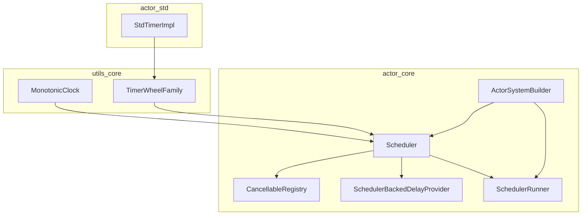
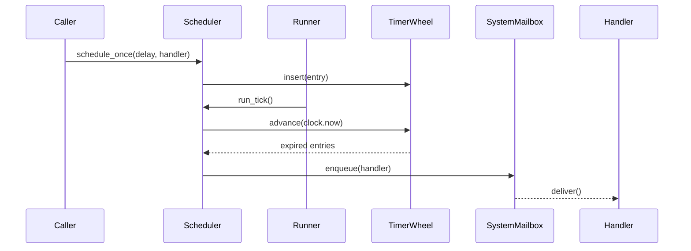
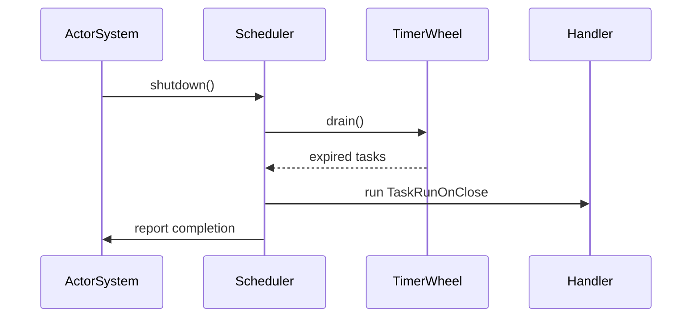
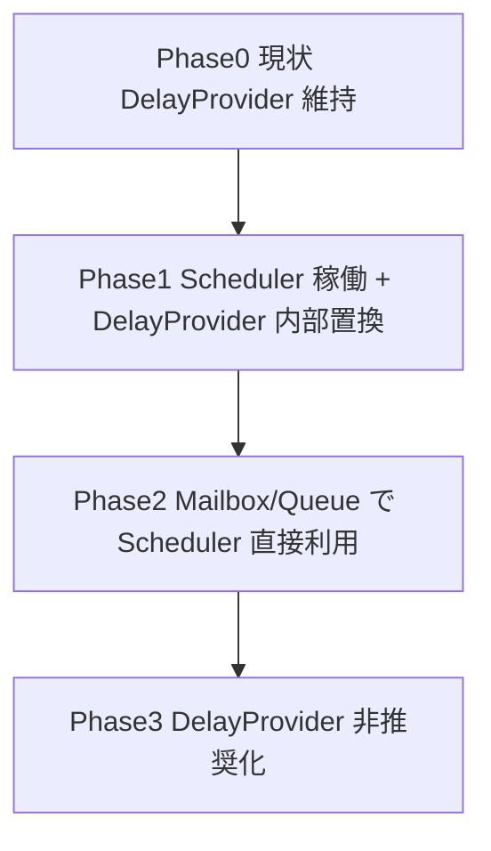
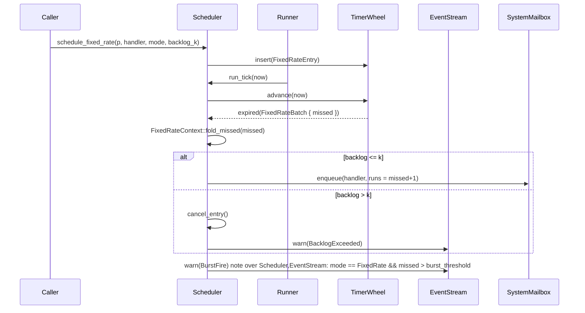

# Design Document

## Overview
本機能は Pekko 互換の Scheduler を fraktor-rs に導入し、ActorSystem 全体に deterministic なタイマー／周期実行基盤を提供する。ディスパッチャや mailbox、Remoting 等の内部機能が共通 Scheduler を介して遅延・周期処理を行えるようになり、Pekko と同じ API 契約（scheduleOnce／scheduleAtFixedRate 等）を Rust/no_std 環境で再現する。
利用者は ActorSystem 構築時に Scheduler を自動的に取得し、DelayProvider や system mailbox からの遅延実行が一貫したタイマー精度・観測性を得られる。導入により、従来個別実装だった DelayFuture も Scheduler 上の単発タイマーに集約され、診断や統計取得も統一される。

### Goals
- Pekko 互換 API（scheduleOnce/fixedRate/fixedDelay/cancelable）を ActorSystem に実装
- RuntimeToolbox 経由で monotonic clock と timer wheel を差し替え可能にする
- observability（EventStream, metrics, diagnostics）とテスト用仮想クロックを提供

### Non-Goals
- Quartz など長期ジョブスケジューラとの統合
- エンジン外部の cron 連携や分散スケジューラ機能
- Remoting プロトコルの具体実装（別 spec で扱う）

## Architecture

### Existing Architecture Analysis
- 依存方向: `utils-core → actor-core → actor-std` を維持。タイマー/クロックの Primitive は utils-core で提供し、actor-core は RuntimeToolbox を通じて利用する。
- 既存 DelayProvider/DelayFuture は mailbox/queue timeout で広く使用されており、破壊的変更を避けるため Scheduler ベースの実装に裏側のみ差し替える。
- EventStream / system mailbox など既存観測パスを再利用し、Scheduler から直接アクターへメッセージを push しない。

### High-Level Architecture

**Architecture Integration**
- 既存パターン: RuntimeToolbox を介した抽象、system mailbox 経由配送、EventStream ベース監視。
- 新規コンポーネント: `MonotonicClock`, `TimerWheelFamily`, `Scheduler`, `SchedulerRunner`, `SchedulerBackedDelayProvider`, `CancellableHandle`。
- 技術整合: utils-core に no_std 互換の TimerWheel と clock を実装し、std 実装は actor-std で `Instant::now()` を利用。
- Mailbox と同様の event loop パターンを SchedulerRunner が流用し、no_std では同期ループ、std では tokio task で tick を駆動する。

### Technology Stack and Design Decisions
- `utils-core/time`: `MonotonicClock`（tick 64bit, resolution 指定）, `TimerInstant`, `TimerWheel`（固定長スロット + overflow priority queue）、`TimerEntryMode`。
- `RuntimeToolbox` 拡張: `type Clock`, `type Timer`, `fn clock(&self)`, `fn timer(&self)` を追加し、NoStdToolbox は SysTick/DWT ベースクロック、actor-std は `Instant` + `tokio::time` 連携を提供。
- Actor-side: `Scheduler<TB>` が timer wheel を poll して `SchedulerCommand` を処理、`SchedulerHandle` が `Cancellable` として利用可能。

## Deterministic Execution Guarantees
- **FIFO Preservation**: `Scheduler::schedule_*` は `TimerCommandQueue`（lock-free `ToolboxMpscQueue` + 単調増加する `sequence_id`）に投入し、`run_tick` は `sequence_id` 昇順に `TimerWheel` へ登録する。各スロットは `SlotQueue`（固定長 `ArrayQueue`）で構成し、同一 tick で満期になったエントリは挿入順にデキューされることで Requirement 1 AC2 を満たす。
- **Tick Drift Budget**: `TimerWheelConfig` が `resolution_ns` と `drift_budget_pct`（既定 5%）を保持し、`SchedulerDiagnostics::drift_monitor` が `deadline` と `now` の差分を監視する。許容ドリフトを超過すると `SchedulerWarning::DriftExceeded { observed_ns }` を EventStream と診断ストリームへ送信し、R1 AC3 の決定的挙動を担保する。
- **max_frequency API**: `Scheduler::max_frequency()` は `Hertz::from_nanos(resolution_ns)` を返し、ActorSystemBuilder 経由で DelayProvider や subsystem へ共有する。`RuntimeToolbox` 実装は `TimerWheelConfig` を提供し、std/no_std 間で同一の上限値を保証する。
- **ManualClock Integration**: 決定論テストでは `ManualClock::advance(n)` が `run_tick` を同期実行し、`drift_monitor` をゼロドリフトに保つ。`deterministic_mode` はタスク ID と発火時刻をログし、Requirement 1 AC1 と Requirement 5 AC1-AC2 のリプレイ検証を実現する。
- **ClockKind 切替**: `MonotonicClock` trait に `fn kind(&self) -> ClockKind`（`Deterministic` / `Realtime`）を追加し、`SchedulerRunner` は `kind` に応じて `RunnerMode::Manual`（ManualClock: `advance` 呼び出しのみで tick 進行）または `RunnerMode::Async`（StdClock: tokio task で `resolution` 間隔起床）を選択する。`drift_monitor` は `Deterministic` では 0 許容、`Realtime` では `drift_budget_pct` を適用するよう分岐し、同一実装でテスト/本番を賄う。

**Key Design Decisions**
1. **Decision**: RuntimeToolbox へ clock/timer ファミリをぶら下げる抽象
   - **Context**: no_std / std 両対応かつ deterministic 動作が必要
   - **Alternatives**: (a) グローバル static タイマー、(b) DelayProvider 直接拡張、(c) Toolbox へ注入
   - **Selected**: (c) Toolbox へ `type Clock`/`type Timer`
   - **Rationale**: 依存方向を守りつつ差し替え容易。テストで ManualClock 実装が可能
   - **Trade-offs**: Toolbox API が増加、導入時に全 TB 実装の更新が必要
2. **Decision**: TimerWheel + overflow priority queue
   - **Context**: 数千単位のタイマーを no_std メモリ制約下で処理しつつ、長期遅延を扱う必要がある
   - **Alternatives**: (a) binary heap 単体, (b) hierarchical wheel, (c) 固定長 wheel + overflow priority queue
   - **Selected**: (c)
   - **Rationale**: 近傍期限は O(1) で処理し、wheel 範囲外は `BinaryHeap` に蓄積し threshold に達したら wheel へ再挿入することでドリフトを抑える
   - **Trade-offs**: 再挿入時に heap 操作コストが発生するが対象は遠未来タイマーに限定される
3. **Decision**: DelayProvider を Scheduler facade に置き換え
   - **Context**: 既存 mailbox timeout の互換性
   - **Alternatives**: (a) DelayProvider 廃止、(b) DelayProvider を scheduler wrapper、(c) DelayProvider を scheduler とは独立
   - **Selected**: (b)
   - **Rationale**: 既存 API を維持しながら実装を集約
   - **Trade-offs**: scheduler 実装が DelayProvider の追加要件を意識する必要がある

## System Flows
### タイマー登録と発火


### Shutdown/TaskRunOnClose


### SchedulerRunner モード切替
- `RunnerMode::Manual`（ManualClock, kind = Deterministic）: `ActorSystem` がテスト用 RuntimeToolbox を構築すると `SchedulerRunner` はハードウェアループを持たず、`ManualClock::advance` が直接 `run_tick` を呼ぶ。`drift_monitor` はゼロドリフトを期待し、逸脱は即 `SchedulerWarning::DriftExceeded` となる。
- `RunnerMode::Async`（StdInstantClock, kind = Realtime）: ActorSystemBuilder が std Toolbox を組み立てる際に tokio task を起動し、`resolution` ごとに `run_tick` を呼び出す。`drift_monitor` は `drift_budget_pct`（5%）を許容し、閾値超過のみ警告する。
- どちらのモードでも `SchedulerLifecycleHook` と Diagnostics の API は共通で、切り替えは `MonotonicClock::kind()` を見るだけで完結する。

## Requirements Traceability
| Requirement | Summary | Components | Interfaces | Flows |
| --- | --- | --- | --- | --- |
| R1 | ドリフト制御・上限・エラー報告 | MonotonicClock, TimerWheelConfig, Scheduler | `schedule_once`, `max_frequency`, diagnostics API | Timer登録/発火フロー |
| R2 | 周期・fixedレート・保留 | Scheduler, TimerEntryMode, CancellableRegistry | `schedule_fixed_rate`, `schedule_fixed_delay` | Timer登録/発火フロー |
| R3 | Toolbox連携・TaskRunOnClose | RuntimeToolbox, SchedulerLifecycleHook | `RuntimeToolbox::timer`, `Scheduler::shutdown` | Shutdown フロー |
| R4 | 並行安全・メトリクス | CancellableRegistry, EventStreamAdapter | `SchedulerHandle`, `emit_warning` | Timer登録/発火 |
| R5 | テスト/診断 | ManualClock, DiagnosticsRecorder, DumpFormatter | `SchedulerDiagnostics::enable`, `ManualClock::advance` | Timer登録/発火, Shutdown |

## Components and Interfaces
### utils_core/time
- **MonotonicClock**: `fn now(&self) -> TimerInstant`; 実装: `SysTickClock`, `StdInstantClock`。`TimerInstant` は `ticks: u64`, `resolution_ns: u32`。
- **TimerWheelFamily**: `fn insert(&self, entry: TimerEntry) -> TimerHandleId`, `fn cancel(&self, id)`, `fn poll_expired(&self, cx) -> Poll<ExpiredEntry>`。内部で固定長 wheel を tick で進め、範囲外のエントリは `BinaryHeap` + `SmallVec` で保持し threshold 到達時に wheel へ再挿入する。
- **TimerEntry**: `TimerEntryMode`（OneShot/FixedRate/FixedDelay）、`deadline: TimerInstant`, `payload: TimerAction`。
- **ManualClock/ManualTimer**: テスト用実装。`advance(duration)` で wheel を強制 tick。

### utils_core/delay
- **SchedulerBackedDelayProvider**: 既存 DelayProvider を実装し、`scheduler.schedule_once(duration, DelayFutureWaker)` を内部的に使用。
- **DelayFuture**: 変更点は handle/cancel を新 Scheduler ハンドルに委譲。API 互換。

### actor_core/scheduler
- **Scheduler<TB>**: `fn schedule_once`, `fn schedule_fixed_rate`, `fn schedule_fixed_delay`, `fn cancel(handle)`、`fn run_tick(&mut self, now: TimerInstant)`。内部に `TimerCommandQueue`, `CancellableRegistry`, `TaskRunOnCloseQueue`, `OverflowReinserter` を持つ。
- **SchedulerHandle**: `impl Cancellable`。`cancel()` は registry を通じて TimerWheel と同期。
- **SchedulerRunner**: MailboxDispatcher と同じ event-loop パターンで Scheduler を駆動。no_std では同期ループで `run_tick` を呼び、std では tokio task + DelayFuture を用いて `resolution` 間隔で起床。
- **SchedulerDiagnostics**: 決定論モードログ、dump 生成、EventStream 通知。
- **SchedulerLifecycleHook**: ActorSystem shutdown 時に `Scheduler::shutdown` を呼び、TaskRunOnClose を処理。

#### Pekko API シグネチャ写像
| Pekko Scheduler API (Scaladoc) | Rust public API シグネチャ案 | Actor 配送セマンティクス | 備考 |
| --- | --- | --- | --- |
| `scheduleOnce(delay, receiver, message, dispatcher, sender)` | `pub fn schedule_once<M: SchedulerMessage>(delay: Duration, receiver: ActorRef<M>, message: M, dispatcher: DispatcherId, sender: Option<ActorRef<AnyMessage>>)` | 満期時に `SystemMailboxBridge::enqueue(receiver, DispatcherEnvelope { dispatcher, sender, msg })` を呼び出し、SystemMailbox が Supervisor/DeathWatch 順序を維持したまま配送する。 | dispatcher/sender は Pekko と同等に optional を許容し、sender 未指定時は `ActorRef::no_sender()` をセット。 |
| `scheduleAtFixedRate(initialDelay, interval, receiver, message, dispatcher, sender)` | `pub fn schedule_at_fixed_rate<M>(initial_delay: Duration, interval: Duration, receiver: ActorRef<M>, message_factory: FixedRatePayload<M>, dispatcher: DispatcherId, sender: Option<ActorRef<AnyMessage>>)` | `FixedRateContext` が `missed_runs` を持ち、`SchedulerRunner` が batch 発火ごとに `SystemMailboxBridge` を経由して `ExecutionBatch` 情報付きメッセージを enqueue。 | message_factory が `ExecutionBatch` を受け取りメッセージを生成し、ミス Tick をまとめて処理。 |
| `scheduleWithFixedDelay(initialDelay, delay, receiver, message, dispatcher, sender)` | `pub fn schedule_with_fixed_delay<M>(initial_delay: Duration, delay: Duration, receiver: ActorRef<M>, message: M, dispatcher: DispatcherId, sender: Option<ActorRef<AnyMessage>>)` | `Scheduler` が各実行完了後に次回 deadline を再計算し、SystemMailbox へ逐次 enqueue。`FixedDelayContext` が進行状況を追跡。 | 固定遅延モードでは backlog 折り畳みを行わず、`sender` は毎回同じ参照を維持。 |
| `scheduleOnce(delay, runnable, executor)` 等 Runnable 版 | `pub fn schedule_once_fn<F>(delay: Duration, dispatcher: DispatcherId, f: F) where F: FnOnce() + Send + 'static` | Runnable 版は内部で `SystemMailboxBridge::enqueue_runnable(dispatcher, f)` を呼び出し、アクターではなく dispatcher へ直接送出。 | DelayProvider やテストフック向け。 |

`DispatcherId` は既存 Dispatcher レジストリが管理し、`Scheduler` API では必須引数として公開する。Actor 側のユーティリティ（例: `Context::schedule_once`) では dispatcher/sender を `ctx.dispatcher_id()` / `ctx.self_ref()` から暗黙に取得するラッパーを提供する計画とし、Pekko 互換 API の表面仕様を明示的に固定する。

#### SystemMailbox ブリッジ詳細
1. `Scheduler::schedule_*` は `SchedulerCommand::EnqueueDelayedEnvelope { receiver, dispatcher, sender, payload, handle_id }` を生成し、TimerWheel にエントリを登録する。
2. `run_tick` で期限到来したコマンドを取り出し、`SystemMailboxBridge` へ転送。Bridge は `DispatcherEnvelope { dispatcher_id, receiver_pid, sender, message, handle_id }` を構築し `SystemMailbox::enqueue_system` を呼ぶ。
3. `SystemMailbox` は既存 `SystemMessage` 優先ルールを維持しつつ、`SchedulerEnvelope` を `UserMessagePriority::Delayed` で処理。enqueue 直前に `CancellableRegistry::is_cancelled(handle_id)` を参照し、キャンセル済みであれば破棄して `SchedulerMetrics::dropped_total` を更新する。これにより Supervisor 戦略や DeathWatch 通知より後に遅延メッセージが割り込まないだけでなく、キャンセル整合性を担保する。
4. `DelayProvider` や内部ユーティリティは `SchedulerFacade` を介して上記 API をラップし、ActorRef を持たないケース（Future waker 等）でも SystemMailbox を経由した deterministic な配送を確保する。

このブリッジ手順により、Pekko/Proto.Actor が期待する「Scheduler は直接アクターを実行せず、mailbox 経由で保証された順序を保つ」という要件 (R3 AC4) を Rust 実装にも適用できる。

#### CancellableRegistry と競合セマンティクス
- **同期原語**: `CancellableState`（`Pending`, `Scheduled`, `Executing`, `Cancelled`）を `ToolboxAtomicU8` で保持し、ロックレスに状態遷移を制御する。`SchedulerHandle` は `state.compare_exchange` により自身の状態を更新し、`CancellableRegistry` も同じ原語を参照する。
- **状態機械**:

| 現状態 | イベント | 新状態 | 備考 |
| --- | --- | --- | --- |
| Pending | `schedule_*` 成功 | Scheduled | TimerWheel へ登録済み。`handle_id` を割り当て。 |
| Scheduled | `cancel()` (成功) | Cancelled | `TimerWheel::cancel(handle_id)` へ伝播。戻り値 true を返す。 |
| Scheduled | `run_tick` で取得 | Executing | `run_tick` が `compare_exchange(Scheduled→Executing)` に成功した場合のみハンドラ実行。 |
| Executing | ハンドラ完了 | Cancelled | 実行終了後に `state.store(Cancelled)`。`cancel()` は false を返し idempotent。 |
| Cancelled | 以降の `cancel()` | Cancelled | 常に false を返却。 |

- **競合解消**:
  1. `cancel()` は `state.compare_exchange(Scheduled→Cancelled)` のみを成功条件とし、すでに `Executing/Cancelled` の場合は false を返して Requirement R4 AC2-AC3 を満たす。
  2. `run_tick` は `Scheduled` 状態のエントリだけを取り出し、`Executing` へ遷移できなかった場合（= cancel 済み）にはハンドラを呼ばずに破棄する。
  3. `SystemMailboxBridge` が生成する `SchedulerEnvelope` には `handle_id` を含め、enqueue 直前に `CancellableRegistry::is_cancelled(handle_id)` を参照する。キャンセル済みなら `SchedulerEnvelope` を破棄し、ユーザ視点で「is_cancelled==true なのにメッセージが届く」ことを防ぐ。
  4. `cancel()` が `Executing` へ遷移済みのエントリに競合した場合、戻り値は false だがハンドラは既に 1 回のみ実行中であり、実行完了時に `state.store(Cancelled)`。SystemMailbox 側も `handle_id` を見て enqueue 済みメッセージを破棄するため二重配送にならない。
- **is_cancelled レポート**: `SchedulerHandle::is_cancelled()` は `state.load(Ordering::Acquire) == Cancelled` で判定し、`run_tick` 側の `store` と `cancel()` 側の `compare_exchange` を `Release` で行うことで可視性を保証。R4 AC4 を満たす。
- **多重登録/Quota**: `CancellableRegistry` は `system_quota` チェック後に `Pending→Scheduled` への遷移を行い、Quota 超過時には state を `Cancelled` へ即座に更新して `SchedulerError::QuotaExceeded` を返す。これにより、キャンセル済みハンドルが wheel に残らず、バックプレッシャ計測も正確に行える。

このセマンティクスにより、キャンセルと発火が競合してもハンドラが二重に実行されず、`cancel()` の戻り値規約（初回 true/以降 false）と `is_cancelled` の一貫性を保証する。

#### 診断・ダンプ API（Requirement 5）
- **ManualClock Harness (R5 AC1)**: `ManualClock` と `ManualTimer` は `SchedulerRunner` と同じ `run_tick` を直接呼び出す `advance(duration)` 実装を持つ。`SchedulerDiagnostics::with_manual_clock(clock: ManualClockHandle)` を呼ぶと `RunnerMode::Manual` に切り替わり、テストコードは `manual_clock.advance(n)` → `scheduler.diagnostics().last_fire_batch()` の順で determinism を検証できる。
- **Deterministic Log (R5 AC2)**: `SchedulerDiagnostics` に `enable_deterministic_log(buffer: &'static mut RingBuffer<SchedulerFireRecord>)` API を設け、各 `schedule/fire/cancel` で `SchedulerFireRecord { timer_id, scheduled_at, deadline, fired_at, executor }` を記録。ログは `SchedulerReplayTrace` としてシリアライズ可能で、リプレイテストや fuzz の seed 入力として利用する。
- **診断ストリーム (R5 AC3)**: `DiagnosticsChannel` を `EventStream` のサブチャンネルとして追加し、`SchedulerDiagnostics::subscribe(kind)` で `ScheduleEvent`, `FireEvent`, `CancelEvent`, `DriftWarning` などを購読可能にする。各イベントは `SchedulerDiagnosticEvent` enum にまとめ、no_std でも利用できるよう `heapless::spsc::Queue` をバックエンドへ採用。
- **Property/Fuzz API (R5 AC4)**: `SchedulerProperties` モジュールに `fn assert_monotonic(&self)` や `fn inject_random_cancel(seed)` を提供し、プロパティテストや fuzz ハーネスから `SchedulerHarness` 経由でスケジューラ内部状態へアクセスできるようにする。`ManualClock` + `DeterministicLog` を組み合わせ、tick 単調性や固定レート補償の不変条件を検証する。
- **Dump 要求 (R5 AC5)**: `SchedulerDiagnostics::dump(fmt: DumpFormat)` が `SchedulerDump` 構造体を生成し、`DumpFormat::Text` では `wheel_offset`, `active_slots`, `overflow_size`, `periodic_jobs[{job_id, mode, backlog, last_fire}]`, `pending_commands` を表形式で整形。`DumpRequest` は `ActorSystemDiagnostics` 経由で CLI/テレメトリから呼び出せるよう、`SchedulerDumpRequest` メッセージを SystemMailbox へ送って `SchedulerDumpReply` を返す。no_std では `fmt::Write` ベース、std では `io::Write` にも対応させ、埋め込みとホストの双方でダンプを取得できる。

これらの診断 API を通じて、Requirement 5 の手動 tick、決定論ログ、ストリーム通知、プロパティ検証、ダンプ出力の全要件を Scheduler 単体で満たす。

### actor_core/integration
- **ActorSystemBuilder**: `with_scheduler_config`、`build()` 内で RuntimeToolbox から clock/timer を取得し、Scheduler を初期化。
- **SystemMailboxBridge**: Scheduler からの発火を system mailbox に enqueue。
- **DelayProvider registration**: ActorSystem 構築時に SchedulerBackedDelayProvider を各コンポーネントへ注入。

### actor_std implementations
- **StdInstantClock**: `MonotonicClock` for std。`Instant::now()` をナノ秒へ変換。
- **StdTimerWheelImpl**: `TimerWheelFamily` for std。`tokio::time::sleep_until` と `SchedulerRunner` を利用し、非同期に `run_tick` を呼び出しつつ no_std wheel と同じ API に合わせる。

## Capacity & Backpressure
- **SystemTimerQuota**: `SchedulerConfig` に `system_quota`（同時稼働タイマーと周期ジョブの合計上限）を持たせ、`schedule_*` 呼び出しは `active_total >= system_quota` の時点で `SchedulerError::QuotaExceeded` を返す。拒否時には `SchedulerWarning::QuotaReached { limit }` を EventStream へ発行し、上位でバックプレッシャを検知できるようにする。
- **TimerPriority**: `TimerEntry` に `priority: PriorityClass (High|Normal|Low)` を持たせ、優先度は呼び出し元 API で指定（ActorSystem 内部用途は High、ユーザジョブは Normal/Low）。
- **Wheel Saturation Policy**: `TimerWheelFamily` がスロット/overflow いずれかの容量しきい値に達した場合、`PriorityDropQueue` が `Low -> Normal -> High` の順にエントリを選び、キャンセル処理を伴う `SchedulerWarning::DroppedLowPriority { job_id, priority }` を EventStream へ通知する。ドロップ後は `active_total` から差し引き、`system_quota` の範囲に戻るまで処理を繰り返す。
- **Metrics**: `SchedulerMetrics` に `active_total`, `periodic_total`, `dropped_total`, `quota_limit` を追加し、バックプレッシャ状態の監視と要件 R4 AC5-AC7 の可視化を保証する。
- **Overflow Reinsertion Strategy**: `TimerWheelConfig` に `overflow_heap_capacity`（デフォルト `system_quota` と同数）と `overflow_reinsertion_threshold_pct`（デフォルト 75%）を設け、overflow heap の使用率が閾値を超えた場合に再挿入プロセスを起動する。`run_tick` ごとに `reinsertion_batch_limit`（デフォルト 100 エントリ）まで遠未来タイマーを wheel へ戻し、1 tick あたりの再挿入時間を限定する。再挿入で wheel 範囲へ収まり切らない場合は次 tick 以降に持ち越し、同時に `SchedulerWarning::OverflowNearCapacity` を EventStream へ送出して監視側へ通知する。ドロップ判定は再挿入後も `overflow_heap_capacity` を超過した時点で `Wheel Saturation Policy` にフォールバックする。
    - `overflow_heap_capacity` と `overflow_reinsertion_threshold_pct` は `heap_len >= capacity * threshold / 100` を条件に再挿入をトリガする。例: capacity=10_000, threshold=75 なら heap サイズ 7_500 超で起動。
    - 再挿入アルゴリズム擬似コード:
      ```text
      fn reinsertion_pass(now_tick):
          moved = 0
          while moved < reinsertion_batch_limit && overflow_heap.peek_deadline() <= wheel_max_deadline(now_tick):
              entry = overflow_heap.pop_min()      // O(log n)
              slot = calc_slot(entry.deadline)
              if slot.is_full():
                  break    // wheel saturation policy へ委譲
              slot.push(entry)
              moved += 1
          if overflow_heap.len() > overflow_heap_capacity:
              drop_low_priority_entries()
      ```
    - Worst-case コストは `O(log n) * reinsertion_batch_limit`（デフォルト 100）で、`resolution=10ms` でも 5% ドリフト内に収まるよう Performance セクションで基準値を提示する。
    - `Wheel Saturation Policy` との優先順位: (1) overflow 再挿入 → (2) wheel slot 飽和検知 → (3) priority drop の順に評価する。

## Error Handling
- **InvalidDelay**: `SchedulerError::InvalidDelay` として `delay <= 0` や `delay / tick_nanos > IntMax` を返却。呼び出し元は Result ハンドリング。
- **CapacityExceeded**: TimerWheel スロットが飽和した場合 `SchedulerError::CapacityExceeded` を返し、EventStream に警告。
- **ShutdownInProgress**: shutdown 後の schedule 呼び出しは `SchedulerError::Shutdown`。
- **TaskRunOnClose Failure**: handler 内エラーは捕捉せず propagate、ただし EventStream で通知し subsequent handler が継続できるようにする。
- **Handler Panic Strategy**: `TimerEntry` の `payload` は `SchedulerTask` trait（`fn run(&self) -> Result<(), HandlerError>`）を実装し、`run_tick` は `Ok(Err(e))` を検知した際に `SchedulerWarning::HandlerFailed { job_id, error: e }` を EventStream へ送る。panic に対しては catch_unwind 等で介入せず（no_std 方針で unwind 非対応）、タスク側は panic-free であること、もしくは panic 発生時にはランタイムが即 abort することを前提にする。`CancellableRegistry` は失敗したジョブを `is_cancelled = true` に更新し二重実行を防止する。Actor メッセージ処理は `ActorCellGeneric::invoke_user_message`（`modules/actor-core/src/actor_prim/actor_cell.rs`）で従来どおり直接 `Actor::receive` を呼び出し、panic を捕捉しないポリシーを維持する。
- **Overflow/Wheel Saturation 順序**: `run_tick` 内では (1) overflow 再挿入、(2) wheel slot 飽和検知、(3) priority drop の順に判定し、前段で条件を満たした場合は即座に次フローへ委譲する。これにより Requirement 4 AC6 の優先順位をドキュメントで固定する。
- **Enqueue 後キャンセル**: `SchedulerEnvelope` に `handle_id` を含め、SystemMailbox が配送直前に `CancellableRegistry::is_cancelled(handle_id)` をチェックする。キャンセル済みであれば `SchedulerMetrics::dropped_total` を増やしつつ破棄し、Requirement 4 AC2-AC4 の厳密な保証を守る。

## Testing Strategy
- **Unit**: TimerWheel tick/overflow、SchedulerHandle cancel、ManualClock advance、Diagnostics dump。
- **Integration**: ActorSystem + Scheduler で schedule_once/fixed_rate/fixed_delay、shutdown TaskRunOnClose、DelayProvider 経由の timeout。
- **Property**: ドリフト検証（`advance` vs expected deadline）、固定レート補償（GC バーストシミュレーション）。
- **Performance**: no_std wheel ベンチ（1k/10k timers）、overflow heap 再挿入コスト、std 実装での burst ハンドリング。
- **Performance**: no_std wheel ベンチ（1k/10k timers）、overflow heap 再挿入コスト（`O(log n) * reinsertion_batch_limit` が tick あたり 100 pop/push 以内に収まることを確認）、std 実装での burst ハンドリング。

## Performance & Scalability
- **Targets**: 1 tick = 10ms デフォルト、最大遅延 = 2^20 tick、1 アクターシステムあたり同時タイマー 10k。
- **Scaling**: wheel サイズは設定可能、overflow は `BinaryHeap` + `SmallVec` で保持し `wheel_range_threshold = ticks_per_slot * slots` に近づいた時点で再挿入。std 版は tokio task で `SchedulerRunner` が tick を駆動。
- **Metrics**: active timers, periodic jobs, dropped timers を `SchedulerMetrics` にエクスポート。

## Migration Strategy

- **Rollback**: Phase1 では旧 DelayProvider 実装を feature flag で残し、問題時に切り替え可能。
- **Validation**: 各 phase で `scripts/ci-check.sh all` と専用 Scheduler テストスイートを実行。
- **Feature Flag 詳細**: Phase1 では Cargo feature `scheduler-new`（デフォルト有効）で新 Scheduler を利用し、`--no-default-features --features scheduler-legacy` で旧 DelayProvider に切り替え可能とする。ランタイム本体では cfg を導入せず DelayProvider 実装層のみで切り替える。
- **置換対象リストと優先度**: Phase1 で `DelayFuture`, `Mailbox::poll_timeout`, `RemoteAuthority` タイムアウトなど `rg "DelayProvider"` で洗い出した 12 箇所を優先置換。Phase2 では Mailbox/Queue が直接 Scheduler API を呼ぶよう改修し、DelayProvider は facade のみを残す。
- **Rollback ポリシー**: プロジェクト方針「破壊的変更を恐れずに最適化」を尊重し、rollback は Phase1 の検証期間（CI + nightly ベンチマーク）に限定。Phase2 以降は `scheduler-new` を唯一のパスとし、不具合時は spec/design の追補で対処する。
### 周期ジョブのバックログ処理


`FixedRateContext` は各周期ジョブに紐づく状態であり、`last_fire`, `missed_runs`, `mode`（FixedRate/FixedDelay）と `backlog_limit` を保持する。`run_tick` は `TimerWheel` から受け取った `FixedRateBatch` を `missed_runs` に折り畳み、`handler` へ `ExecutionBatch { runs: u32, mode }` を渡す。`backlog_limit` を超えた場合はジョブをキャンセルし `SchedulerWarning::BacklogExceeded { job_id }` を EventStream へ出力する。GC などで `missed_runs` が `burst_threshold`（デフォルト `resolution * 10` 相当）を超えたときは `SchedulerWarning::BurstFire` を送信し、上位で観測できるようにする。
