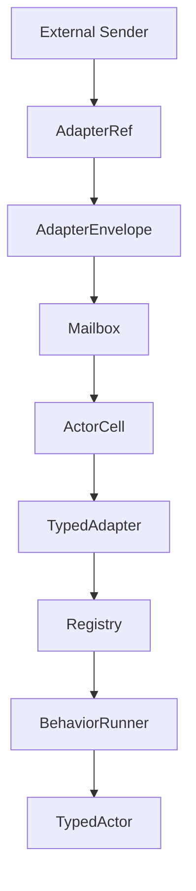
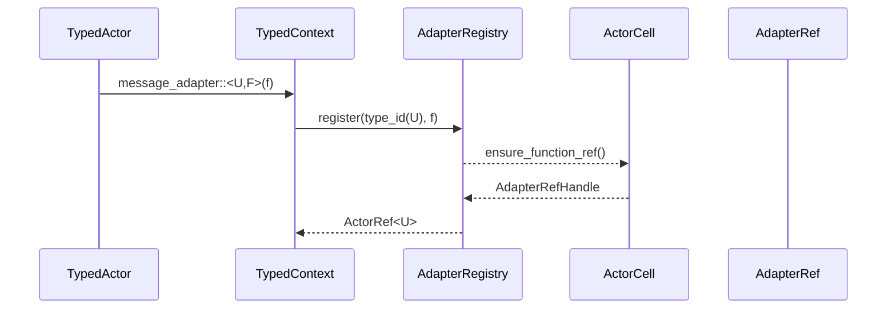
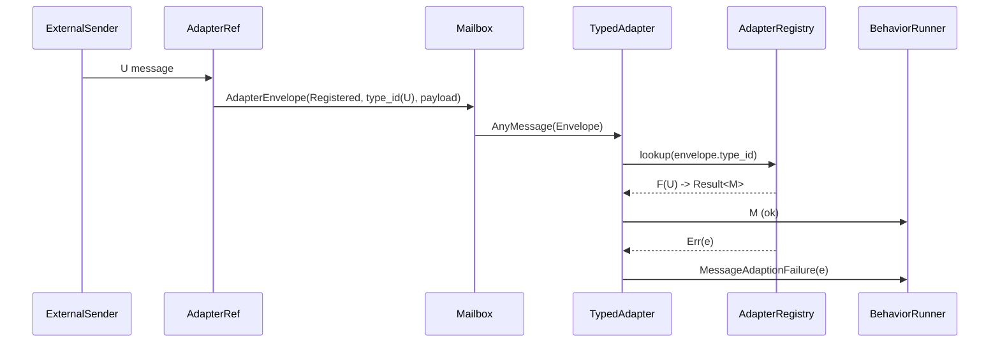
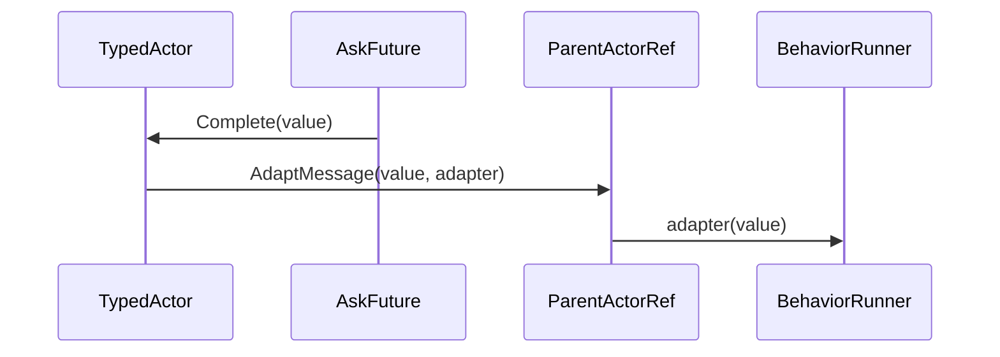
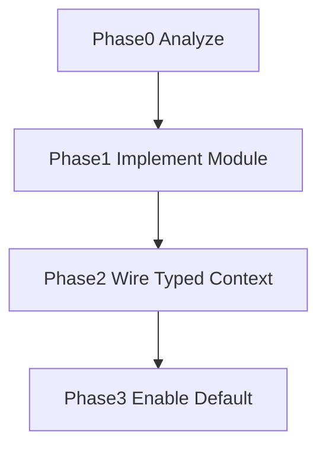

# Overview
Pekko Typed と同等の MessageAdapter 機構を `actor-core` に追加し、外部プロトコルで到着する異種メッセージ型を既存 Typed アクターの受信型へ安全に変換するアダプタを提供する。新モジュールは `typed::message_adapter` 配下でレジストリ、アダプタ用 `FunctionRef` 相当、内部エンベロープを提供し、Typed API から 1 クラス 1 登録ポリシーを守りつつ no_std 環境でも動作する。これにより、protoactor-go や Pekko から移植されたアクターが追加マイクロサービスや Bus イベントを型安全に受信できる。

ユーザは Typed アクターのコンテキスト経由でアダプタを登録し、返された `ActorRef<U>` を別マネージャや Classic API に公開する。外部から渡された `U` 型メッセージは `AdapterRefSender` が `AdaptWithRegisteredMessageAdapter` エンベロープへ包み、親アクターのメールボックスに投入される。Typed 側では `TypedActorAdapter` が `_messageAdapters` を逆順探索して最初にマッチした変換クロージャを実行し、結果を本来の `M` 型として `BehaviorRunner` に渡す。

### Goals
- Typed API (`message_adapter`, `spawn_message_adapter`) を提供し、Pekko Typed 互換の登録ライフサイクルを実現する。
- 変換クロージャの実行を親アクターと同一スレッドへ拘束し、`MessageAdaptionFailure` シグナルで失敗を監督経路へ伝搬する。
- `FunctionRef` 相当の軽量 `ActorRef` をアクター停止/再起動時に自動破棄し、未解放リソースとメモリリークを防ぐ。

### Non-Goals
- 新しい背圧メトリクスや Telemetry 公開は行わない。
- MessageAdapter での自動リトライやフィルタリング（型ベース以外）は対象外とする。
- Classic API や std 専用の追加 API は提供しない（`actor-std` 側の橋渡しは別 spec）。

## Architecture

### Existing Architecture Analysis
- Typed アクターは `TypedActorAdapter` が `ActorContextGeneric` を `TypedActorContextGeneric` に包んで `BehaviorRunner` を駆動する構造（`modules/actor-core/src/typed/typed_actor_adapter.rs`）。
- メールボックスへのユーザメッセージ投入は `ActorRefSender` を介して `DispatcherSenderGeneric` が担い、`AnyMessageGeneric` が payload + reply_to を保持（`modules/actor-core/src/messaging/any_message.rs`）。
- シグナルは `BehaviorSignal::{Started,Stopped,Terminated}` に限定されており、型変換失敗を通知する経路が存在しない（`modules/actor-core/src/typed/behavior_signal.rs`）。
- `TypedActorContextGeneric` は spawn/watch などの便宜メソッドのみ提供し、状態を保持しないためアダプタ登録情報を持てない。

### High-Level Architecture
新モジュール `typed::message_adapter` がアクター単位の `MessageAdapterRegistry` を管理し、`AdapterRefSender` を通じて親アクターのメールボックスへ特殊エンベロープを送出する。`TypedActorAdapter` はレジストリを所有し、Typed コンテキストはレジストリ API を委譲してアダプタを登録/解除する。再起動・停止フックでレジストリと `AdapterRefSender` を自動クリアする。



- **既存パターンの継承**: ArcShared/ToolboxMutex による no_std セーフな共有、`1 ファイル 1 型` 規約、EventStream/DeadLetter 連携なし。
- **新規コンポーネント**: `MessageAdapterRegistry`, `AdapterRefSender`, `AdapterEnvelope`, `AdapterPayload`, `MessageAdaptionFailure`、Typed API 拡張。
- **技術整合性**: `alloc::vec::Vec` と `TypeId` で型マッチングを行い、登録時にはクロージャを `ArcShared<dyn AdapterFnErased<M>>` へ型消去して保持。
- **ステアリング遵守**: ランタイム本体に `#[cfg(feature = "std")]` を追加せず、Typed API のみで完結。

### Technology Alignment
- 依存クレートは追加しない。`ArcShared`/`ToolboxMutex` を流用し、AdapterRef も `ActorRefSender` 実装として `actor-core` 内で完結させる。
- `TypeId` と `Any` を使うことで generics を崩さずに型判定を実現。`alloc` 依存は既存コンポーネント同様に許容される。
- 追加ファイルは `modules/actor-core/src/typed/message_adapter/{registry.rs,adapter_ref.rs,envelope.rs,error.rs}` のように 2018 モジュール構造へ分割。

### Key Design Decisions
1. **Decision**: レジストリ状態を `TypedActorAdapter` が所有しつつ、AdapterRef が親ライフサイクルを感知できる `ArcShared` ベースの番兵を併設する。
   - **Context**: `ActorContextGeneric` は毎メッセージ生成のため永続状態を保持できず、AdapterRef 側ではライフサイクル判定用の参照が必要。
   - **Alternatives**: (a) `ActorCell` に汎用状態を追加、(b) `SystemState` にグローバル格納。
   - **Selected Approach**: Typed アクター固有の `MessageAdapterRegistryOwner` を `TypedActorAdapter` 内に保持し、内部で `ArcShared<AdapterLifecycleState>` を管理して `WeakShared` を配布する。実際の `Vec<AdapterEntry>` は owner のローカルに置き、Typed コンテキストは owner から借用するハンドルを通じてミュータブル操作を行う。
   - **Rationale**: Typed 領域だけで完結しつつ、AdapterRef が親存続を検出可能。再起動/停止時に owner ごと再生成すればライフサイクルが一致する。
   - **Trade-offs**: 番兵用 ArcShared/WeakShared の割り当てコストが発生するため、登録数が多い場合のベンチマークが必要。

2. **Decision**: `AdapterRefSender` を `ActorRefSender` 実装として `FunctionRef` 相当を実現。
   - **Context**: Pekko Typed では `FunctionRef` を ActorCell に登録し、親停止時に自動 removal。
   - **Alternatives**: (a) 通常の `ActorRefGeneric` を複製、(b) `AskReplySender` を流用。
   - **Selected Approach**: Pid を持たない軽量 sender を作り、`ActorCell` に `adapter_handles: Vec<AdapterRefHandle>` を追加して停止時/Terminated で drop。
   - **Rationale**: 観測・監視の整合性を保ちつつ、mailbox を二重に持たない。
   - **Trade-offs**: ActorCell の stop 処理に新しいクリーンアップ手順が増える。

3. **Decision**: 新しい内部エンベロープ/シグナル型を導入。
   - **Context**: 現行 `AnyMessageGeneric` では通常メッセージと区別できず、失敗時に監督へ伝搬できない。
   - **Alternatives**: (a) `Any` の downcast で判定、(b) 既存 `SystemMessage` を流用。
   - **Selected Approach**: Registered 経路は `AdapterEnvelope::Registered` へ包み、Inline/ask は `AdaptMessage` を用いる。いずれも `MessageAdaptionFailure` と `BehaviorSignal::AdapterFailed` を介して失敗を伝搬する。
   - **Rationale**: Pekko Typed と同様の責務分割を維持しつつ、no_std 環境でも型安全な伝搬を実現できる。
   - **Trade-offs**: `BehaviorSignal` を破壊的変更するため Typed API 全体でビルドが必要。

## System Flows

### アダプタ登録フロー


### 変換・失敗伝搬フロー


### ask / AdaptMessage フロー


## Requirements Traceability
| 要件 | サマリ | コンポーネント | インターフェース | フロー |
| --- | --- | --- | --- | --- |
| R1.1-1.4 | 登録・FunctionRef ライフサイクル | `MessageAdapterRegistry`, `AdapterRefSender`, `ActorCellGeneric` 拡張 | `TypedActorContext::message_adapter`, `Registry::ensure_function_ref`, `ActorCell::drop_adapter_refs` | 登録フロー |
| R2.1-2.4 | 型変換と `AdaptMessage` | `AdapterEnvelope`, `TypedActorAdapter`, `TypedActorContext::spawn_message_adapter`, `TypedActorRef::ask` | `Registry::lookup`, `AdaptMessage` | 変換フロー |
| R3.1-3.3 | 失敗伝播 | `MessageAdaptionFailure`, `BehaviorSignal`, `MessageInvokerPipeline` | `Registry::adapt`, `TypedActorAdapter::emit_failure`, `BehaviorRunner::handle_signal` | 変換フロー |

## Components and Interfaces

### Typed Message Adapter Module

#### MessageAdapterRegistry<M, TB>
- **責務**: 型 ID ごとの変換クロージャを保持し、逆順検索・登録・解除・全削除・AdapterRef 向けライフサイクル番兵を提供。
- **主要データ**: `Vec<AdapterEntry<M, TB>>`, `Option<AdapterRefHandle<TB>>`, `ArcShared<AdapterLifecycleState<TB>>`。
- **API**:
  ```rust
  pub fn register<U>(&mut self, type_id: TypeId, adapter: AdapterFn<U, M>) -> Result<ActorRefGeneric<TB>, AdapterError>;
  pub fn adapt(&self, payload: AdapterPayload) -> AdapterOutcome<M>;
  pub fn clear(&mut self);
  pub fn downgrade_lifecycle(&self) -> WeakShared<AdapterLifecycleState<TB>>;
  ```
- **制約**: `register` はアクター・スレッド専用（`&mut self`）として expose し、番兵の `ArcShared` は AdapterRef が親停止を検知するためだけに使用する。クロージャ自体は `AdapterEntry` 内で `ArcShared<dyn AdapterFnErased<M>>` に格納し、`Send/Sync` は要求しない。
- **ライフサイクル**: Registered アダプタのみを保持し、Inline/ask 経路は `AdaptMessage` で処理してレジストリを汚さない。

#### AdapterEntry<M, TB>
- **役割**: `TypeId` と `ArcShared<dyn AdapterFnErased<M>>` を保持。Inline/ask アダプタはレジストリに載せない。
- **メタデータ**: 登録順序（Vec の挿入位置）で優先度を表現し、`TypeId` 重複時は既存エントリを除去。
- **AdapterFn 定義**: `type AdapterFn<U, M> = dyn Fn(U) -> AdapterResult<M>` とし、`AdapterResult<M> = Result<M, AdapterFailure>`。登録時に `AdapterFnErased` へ型消去して格納することで変換失敗を `MessageAdaptionFailure` へ一貫して伝搬できる。

#### AdapterFnErased<M>
- **責務**: 型ごとに異なるクロージャを実行時に型消去して管理する。
- **インターフェース**:
  ```rust
  pub trait AdapterFnErased<M>: 'static {
      fn type_id(&self) -> TypeId;
      fn invoke(&self, payload: AdapterPayload) -> AdapterResult<M>;
  }
  ```
- **生成**: `register` 時に `AdapterFnWrapper<U, F>` を構築し `ArcShared<dyn AdapterFnErased<M>>` として保持。`invoke` では `payload.try_downcast::<U>()` を呼び、失敗した場合は `AdapterResult::Err(AdapterFailure::TypeMismatch(TypeId))` を返す。

- **構造**: `AdaptMessage<U, M>` が値とクロージャ（`Fn(U) -> Result<M, AdapterFailure>`）を保持し、親アクターのメールボックスで評価される。
- **役割**: `TypedActorRef::ask` や `spawn_message_adapter` が返す一時 `ActorRef` は `AdaptMessage` を生成して `self` へ送るだけで、レジストリには何も追加しない。
- **ライフサイクル**: メッセージ処理が終わればクロージャごとに drop されるため、追加のリソース管理は不要。

#### AdapterPayload
- **責務**: 所有権付き `ArcShared<dyn Any>` を保持し、アダプタにムーブセマンティクスでデータを渡す。型 ID は `ArcShared` の `type_id` から動的に取得する。
- **API**:
  ```rust
  pub struct AdapterPayload(ArcShared<dyn Any>);

  impl AdapterPayload {
      pub fn type_id(&self) -> TypeId;
      pub fn try_downcast<U: 'static>(self) -> Result<ArcShared<U>, AdapterPayload>;
      pub fn into_any(self) -> ArcShared<dyn Any>;
  }
  ```
- **メモリモデル**: `try_downcast` が成功した場合 `ArcShared<U>` を返すため、`AdapterFnWrapper<U, F>` は `ArcShared::try_unwrap`（もしくは `into_owned` ヘルパ）で `U` を取り出し `Fn(U)` を実行できる。失敗した場合は元の `AdapterPayload` を返して `TypedActorAdapter` 側で DeadLetter へ回せる。

#### AdapterLifecycleState<TB>
- **責務**: 親アクターの存続を表す番兵。AdapterRefSender が `WeakShared` から upgrade することで停止済みかを判断する。
- **構造**: `generation: AtomicU64`, `dead_letter: DeadLetterPublisher<TB>`。`drop_adapter_refs` 時に `generation` をインクリメントし、未配送メッセージを DeadLetter へ送る際のメタ情報を保持。

#### AdapterRefSender<TB>
- **構造**: `mailbox_sender: DispatcherSenderHandle<TB>`, `dispatcher: DispatcherGeneric<TB>`, `lifecycle_weak: WeakShared<AdapterLifecycleState<TB>>`, `handle_id: ActorRefHandleId`。
- **生成フロー**:
  1. `register` が `AdapterRefSender::new(handle_id)` を構築し、`ActorCell::register_adapter_ref` で同じ `handle_id` を保存する。
  2. `actor_ref.clone()` でも `handle_id` を保持したまま複製されるため、DeadLetter ログや監視で一貫した識別子を利用できる。
- **API**:
  ```rust
  impl ActorRefSender for AdapterRefSender {
      fn send(&self, message: AnyMessageGeneric<TB>) -> Result<(), SendError<TB>>;
  }
  ```
- **ライフサイクル**: `ActorCell` に `adapter_handles: ToolboxMutex<Vec<AdapterRefHandle>, TB>` を追加し、停止時に drop。`lifecycle_weak.upgrade()` が失敗した場合は即座に `SendError::TargetStopped` を返し、DeadLetter/EventStream にも記録してから呼び出し元へ伝播する。
- **型情報**: `send` は `message.payload().type_id()` から `TypeId` を取得し、`AdapterEnvelope::Registered` の `type_id` フィールドへ埋め込む。これにより要件で定義した `envelope.type_id` とレジストリ検索が一致する。
- **ハンドル取得**: `mailbox_sender` は `ActorCell::obtain_dispatcher_sender_handle()` で一度だけ取得し、AdapterRef が drop された時点で `ActorCell` 側の `adapter_handles` から除去される。

#### AdapterEnvelope
- **Variant**: `Registered { type_id: TypeId, payload: AdapterPayload, reply_to: Option<ActorRefGeneric<TB>> }`。
- **型整合性**: `AdapterRefSender::send` が `let type_id = payload.type_id();` を実行して `type_id` フィールドへ保存し、`AdapterPayload` と常に一致させる。`TypedActorAdapter` は `debug_assert_eq!(envelope.type_id, envelope.payload.type_id())` を行い、乖離が見つかった場合は `AdapterError::EnvelopeCorrupted` を DeadLetter へ通知してメッセージを破棄する。
- **生成責務**: Registered メッセージのみ `AdapterRefSender` が `AdapterEnvelope` へ包む。Inline/ask は `AdaptMessage` を使う。

#### AdapterError / AdapterOutcome
- **Error**:
  - `AdapterError::RegistryFull`: `Vec<AdapterEntry>` が `MAX_ADAPTERS` に達した場合に返す。
  - `AdapterError::TypeMismatch(TypeId)`: `AdapterFnErased` が downcast に失敗した場合など、登録済みクロージャの型と `AdapterEnvelope::type_id` が一致しない場合に返す。
  - `AdapterError::EnvelopeCorrupted`: `TypedActorAdapter` が `envelope.type_id != envelope.payload.type_id()` を検知した場合に DeadLetter へ通知してメッセージを破棄する。
- **Outcome**: `AdapterOutcome::Converted(M)`, `AdapterOutcome::Failure(AdapterFailure)`, `AdapterOutcome::NotFound`。Inline/ask は `AdaptMessage` で処理されるため `AdapterOutcome` には登場しない。

### Actor Runtime Touchpoints

#### TypedActorAdapter<M, TB>
- **変更点**: `struct TypedActorAdapter { actor: Box<dyn TypedActor>, adapters: MessageAdapterRegistry<M, TB> }`。
- **フロー**:
  - `pre_start`: `adapters.clear()` を呼び、初回登録時に `ActorCell` から `DispatcherSender` を取得し `AdapterRefSender` を生成。
  - `receive`: `match message.payload().downcast_ref::<AdapterEnvelope>()` で Registered メッセージを検出し、`adapters.adapt` の結果に応じて `BehaviorRunner` へ `M` または `BehaviorSignal::AdapterFailed` を送る。Inline/ask は `AdaptMessage` 経由で `actor_ref` に直接届き、`TypedActorAdapter` がクロージャを実行する。
  - `post_stop` / `on_terminated`: `adapters.clear()` と `ActorCell::drop_adapter_refs` を呼び出し。

#### ActorCellGeneric<TB>
- **拡張**: `adapter_refs: ToolboxMutex<Vec<AdapterRefHandle>, TB>` を追加し、`handle_stop` と `handle_recreate` で解放。
- **API**:
  ```rust
  pub fn register_adapter_ref(&self, sender: AdapterRefSender<TB>) -> ActorRefHandleId;
  pub fn drop_adapter_refs(&self);
  pub fn obtain_dispatcher_sender_handle(&self) -> DispatcherSenderHandle<TB>;
  ```
- **ActorRefHandleId**: `register_adapter_ref` が返すハンドル ID で、`AdapterRefSender` が保持する。`drop_adapter_refs` は ID 単位で `DispatcherSenderHandle` をクローズし、DeadLetter へ "registered-adapter-{id}" ラベルを付与する。
- **目的**: 親アクター終了時にアダプタ宛に飛ぶ未配送メッセージを DeadLetter へ流す前に sender を無効化し、`AdapterRefSender::send` が `SendError::TargetStopped` を返した後に `DeadLetter` へ記録するという挙動を deterministic に保証。

#### BehaviorSignal / BehaviorRunner
- **追加シグナル**: `BehaviorSignal::AdapterFailed(AdapterFailure)`。
- **処理**: `BehaviorRunner::dispatch_signal` が `AdapterFailed` を受けた場合、まず `system.event_stream()` へ `EventStreamEvent::AdapterFailure` (将来拡張用 placeholder) を publish し、次に `Behavior::handle_signal` に渡す。既定ハンドラは `ActorError` 化して supervisor に伝搬。

#### MessageInvokerPipeline
- **before_user**: AdapterEnvelope を検出しない（`TypedActorAdapter` が担当）。reply_to の復元は既存ロジックを再利用。

### Typed API Surface

#### TypedActorContextGeneric<'a, M, TB>
- **新メソッド**:
  ```rust
  pub fn message_adapter<U, F>(&mut self, adapter: F) -> Result<TypedActorRef<U, TB>, AdapterError>
  where U: Send + 'static, F: Fn(U) -> Result<M, AdapterFailure> + 'static;

  pub fn spawn_message_adapter<U, F>(&mut self, name: Option<&str>, adapter: F) -> Result<TypedActorRef<U, TB>, AdapterError>
  where U: Send + 'static, F: Fn(U) -> Result<M, AdapterFailure> + 'static;
  ```
- **実装**: `TypedActorContextGeneric` が保持する `MessageAdapterHandle<'a, M, TB>`（`TypedActorAdapter` から渡される）に委譲。

#### TypedActorRefGeneric<M, TB>
- **ask 連携**: `ask` の `map_response` 内で `AdaptMessage { value, adapter }` を生成し、自分自身（親アクター）へ送信する。`AdapterEnvelope` やレジストリを経由せずに inline 応答を処理する。

## Error Handling
- **Adapter 登録エラー**: 型 ID 競合時は既存エントリを置き換えるためエラーなし。リソース不足時のみ `AdapterError::RegistryFull` を返す（最大エントリ数は const で定義）。
- **型変換失敗**: `AdapterFn` が `Result<M, AdapterFailure>` を返す設計とし、Err の場合は `MessageAdaptionFailure` シグナルを生成。
- **エンベロープ破損**: `TypedActorAdapter` は `envelope.type_id == envelope.payload.type_id()` を検証し、ミスマッチ時は `AdapterError::EnvelopeCorrupted` を DeadLetter に記録して該当メッセージを破棄する。
- **Unhandled**: どのエントリも一致しない場合は `AdapterOutcome::NotFound` とし、`TypedActorAdapter` が `ActorCell::unhandled` へ委譲して DeadLetter へ転送。
- **監督**: `MessageAdaptionFailure` は `BehaviorRunner` で `ActorError::recoverable` に変換し、SupervisorStrategy が再起動/停止を判断。
- **停止済み AdapterRef**: `AdapterRefSender::send` が `lifecycle_weak` の upgrade に失敗した場合は enqueue せず `SendError::TargetStopped` を返しつつ DeadLetter へ `AdapterRefStopped` メッセージを記録し、外部送信者が即座に失敗を検知できる。

## Testing Strategy
- **Unit**
  - `MessageAdapterRegistry` の登録/置換/クリアロジック。
  - `AdapterRefSender` が `AnyMessageGeneric` を正しく包むこと。
  - `TypedActorContext::message_adapter` が `AdapterError` を surface すること。
- **Integration**
  - Typed actor へ複数 adapter を登録し、優先度と型マッチングが期待通りに動く。
  - `spawn_message_adapter` + `ask` の応答経路で `AdaptMessage` が親スレッドで評価される。
  - アクター停止/再起動時に adapter が自動解放され、新しい登録がクリーンに行える。
- **E2E**
  - docs/examples に feature flag なしで組み込み、外部バスから typed actor へ bridging。
- **Performance**
  - 単一 actor に 32 個の adapter を登録し、1M メッセージ/秒でのレイテンシを測定。
  - `AdapterEnvelope` 経由の GC/alloc を `heaptrack` 相当の no_std ツールで確認。

## Security Considerations
- Adapter 登録クロージャは actor 内部 state へアクセスできるが実行は親アクター単一スレッドに限定されるため、境界は `'static` のみを要求し `Send`/`Sync` は不要とする（`Rc`/`RefCell` 等のローカル状態も保持できる）。クロージャは TypedActorAdapter 内だけで評価され、AdapterRefSender からは参照できない。
- 外部送信者は adapter の `ActorRef` を通じて typed actor と同等の ACL を得るため、より細かい権限制御を行いたい場合は上位層の spec で対応する。

## Performance & Scalability
- `Vec<AdapterEntry>` は登録数が小さい前提（10s 程度）だが、探索は逆順線形。必要なら将来的に `VecDeque` か `heapless::LinearMap` へ置換できるよう `const MAX_ADAPTERS` を導入。
- `AdapterRefSender` は既存 `DispatcherSender` を共有するため、余分な mailbox/スレッドを消費しない。送信時に `TypeId` を clone せず `u64` へ圧縮する（`TypeId::as_u64()` equivalent）ことで `no_std` でも軽量に保つ。

## Migration Strategy

- **Phase0**: ギャップ分析済み。`message_adapter` 用モジュール skeleton を生成。
- **Phase1**: `typed::message_adapter` モジュールとユニットテストを追加。既存コードからは未参照。
- **Phase2**: `TypedActorAdapter`, `ActorCell`, `TypedActorContext`, `BehaviorSignal` にフックを追加し、feature flag なしでビルド。
- **Phase3**: ドキュメント/ガイド更新と新 API 公開。`./scripts/ci-check.sh all` を実行して互換性を確認。
