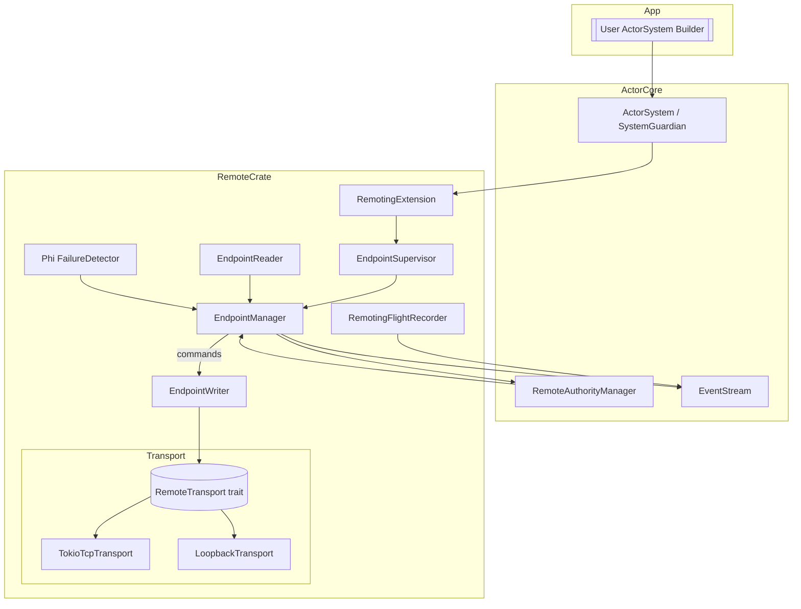
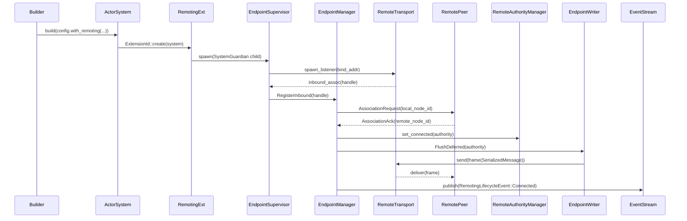
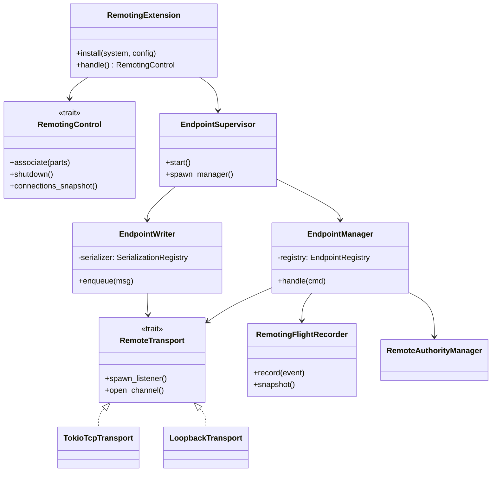

#  設計ドキュメント: pekko-remote-foundation

## 概要
Remoting 基盤は ActorSystem の SystemGuardian 領域に拡張として常駐し、Pekko/Protoactor ライクなエンドポイント管理・トランスポート抽象・観測機構を Rust/no_std でも再利用できる形で提供する。ユーザは RemotingExtension を有効化するだけで、Tokio TCP や将来のカスタムトランスポートを切り替えられる。

主利用者は ActorSystem を構築するアプリケーション開発者と、運用時に監視を行う SRE。開発者は Quickstart で示す数行の初期化コードを呼び出すだけでリモート通信が有効になり、SRE は EventStream/FlightRecorder を通じてエンドポイント状態とメトリクスを取得できる。既存 SystemState に `RemoteAuthorityManager` が存在するため、今回の追加で state machine・トランスポート・観測を補完する。

### 目標 (Goals)
- SystemGuardian 拡張として RemotingExtension を実装し、RemotingConfig を基にトランスポート／エンドポイント FSM を自動起動する。
- EndpointManager/Writer/Reader/Fault Detector/Flight Recorder を API/trait レベルで定義し、Tokio TCP 実装と no_std ループバック実装を差し替え可能にする。
- Quickstart ガイドとサンプルコードを提供し、開発者が低レベル API に触れず ActorSystem と Remoting を同時初期化できるようにする。

### 非目標 (Non-Goals)
- TLS/認証やクラスターシャーディング等の高機能 remoting。今回の設計は foundation に限定する。
- 完全な Protoactor 互換の wire format。まずは SerializedMessage + length-prefixed framing に留める。
- 既存 `fraktor-actor-rs` コアへ std 依存を追加しない。Remoting は別 crate (`fraktor-remote-rs`) で提供する。

## アーキテクチャ

### 既存アーキテクチャの把握
- ActorSystem は `SystemState` 内で `RemoteAuthorityManager` と EventStream を既に持っており、Authority 状態通知 (Connected/Quarantine) は実装済み。
- 拡張登録は `ExtensionId` を介して行い、SystemGuardian がライフサイクルを管理する。
- RemotingConfig は canonical host/port と隔離期間だけを持ち、実際のトランスポートや Endpoint FSM は未実装。

### ハイレベルアーキテクチャ

- ActorSystem 起動時に RemotingExtension が SystemGuardian 配下の EndpointSupervisor を spawn。Supervisor が EndpointManager/Writer/Reader/FailureDetector を構築し、RemoteAuthorityManager と EventStream を監視。
- RemoteTransport trait が std/no_std 切替を吸収し、Tokio 環境では `TokioTcpTransport`、no_std では `LoopbackTransport` を提供。
- FlightRecorder は transport と EndpointManager からイベントを受け取り、EventStream へ RemotingLifecycleEvent/メトリクスを発火する。

### 技術スタック / 設計判断
- `fraktor-remote-rs` crate: `#![no_std]` + `alloc`、feature `std` で Tokio 依存を有効化。ActorSystem 側は extension 経由で参照するだけで依存方向を actor→remote にはしない。
- Transport 抽象: `RemoteTransport` trait が `spawn_listener`, `open_channel`, `send`, `close`, `set_backpressure_hooks` を提供し、Tokio 実装は `tokio::net::TcpStream` を包む。Pekko の RemoteTransport と同様にプロトコル別 mapping を実現する。citeturn0search1
- Endpoint FSM: Pekko の EndpointManager (Idle/Active/Gated/Quarantined) を参考に、`AssociationState` enum と `EndpointRegistry` を提供。`RemoteAuthorityManager` を registry backend として再利用し、`Quarantine` の deadline 管理も一元化。citeturn0search0
- FailureDetector: Pekko の RemoteWatcher と同様に heartbeats を送受信し、Suspect/Reachable を EndpointManager へ通知する役割を分離する。citeturn0search3
- FlightRecorder: Artery の RemotingFlightRecorder にならい、イベントを ring buffer に蓄積し、JFR 互換イベント構造を設計する。citeturn0search5

#### 主要設計判断
1. **Decision**: Remoting を SystemGuardian 拡張として実装する。
   - **Context**: ActorSystem 側の lifecycle と toolbox に統合する必要がある。
   - **Alternatives**: ActorSystem 実装へ直接組み込み／独立プロセス。
   - **Selected Approach**: Extension を作成し、SystemGuardian 子に EndpointSupervisor を spawn。
   - **Rationale**: 既存 extension フレームと guardian 監視を流用でき、core への循環依存を避けられる。
   - **Trade-offs**: Extension API の安定化が必要。
2. **Decision**: Transport を trait で抽象化し、Tokio/Loopback 実装を提供。
   - **Context**: no_std/no-alloc 環境との差し替え要求。
   - **Alternatives**: Tokio 固定／チャンネル経由の in-process 実装。
   - **Selected Approach**: `RemoteTransport<TB>` + `TransportFactory` を導入し、RemotingConfig の scheme を参照して生成。
   - **Rationale**: Pekko 同様にプロトコル別 transport を切替可能、std 依存を remote crate に閉じ込められる。
   - **Trade-offs**: 抽象コスト増、最初の実装は TCP のみ。
3. **Decision**: FlightRecorder/FailureDetector を独立モジュールに分離。
   - **Context**: 観測と健康監視は SRE に重要で、EventStream 統合が要件。
   - **Alternatives**: EndpointManager 内部でログ。
   - **Selected Approach**: `remoting/flight_recorder.rs` と `remoting/failure_detector/phi.rs` を新設。
   - **Rationale**: 単一責務と再利用性を確保。Artery FlightRecorder のメトリクス構造に追従。citeturn0search5
   - **Trade-offs**: 追加モジュールによるファイル数増。

## システムフロー


## API ブループリント

### 型・トレイト一覧
| 型/トレイト | 可視性 | 責務 |
| --- | --- | --- |
| `RemotingExtension<TB>` | `pub(crate)` (actor crate re-export禁止) | ActorSystem 拡張。トランスポート/エンドポイント初期化と `RemotingControl` 提供 |
| `RemotingControl` | `pub` | 高レベル操作 (`associate`, `shutdown`, `connections_snapshot`) |
| `RemoteTransport<TB>` | `pub(crate)` | トランスポート抽象 (listen/open/send/close/backpressure) |
| `TransportFactory` | `pub(crate)` | RemotingConfig + scheme → Concrete transport インスタンス生成 |
| `EndpointSupervisor` | `pub(crate)` | SystemGuardian 子 actor struct。EndpointManager/Writer/Reader を束ねる |
| `EndpointManager` | `pub(crate)` | Association FSM + deferred queue drain |
| `EndpointWriter` | `pub(crate)` | System/User message優先送出、SerializedMessage 化 |
| `EndpointReader` | `pub(crate)` | 受信 frame を deserialize して ActorSystem へ転送 |
| `RemoteNodeId` | `pub(crate)` | system name/host/port/uid を保持する値オブジェクト |
| `AssociationState` | `pub(crate)` | Unassociated/Associating/Connected/Quarantined |
| `RemotingFlightRecorder` | `pub(crate)` | メトリクス記録 + EventStream 公開 |
| `PhiFailureDetector` | `pub(crate)` | Heartbeat 判定と Suspect/Reachable 通知 |
| `RemotingQuickstartDoc` | docs/guides | Quickstart ガイド markdown (non-code asset) |

### シグネチャ スケッチ
```rust
pub struct RemotingExtension<TB: RuntimeToolbox> {
  control: RemotingControl,
}
impl<TB: RuntimeToolbox> Extension<TB> for RemotingExtension<TB> {}
impl<TB: RuntimeToolbox> RemotingExtension<TB> {
  pub fn new(system: &ActorSystemGeneric<TB>, config: &RemotingExtensionConfig) -> Result<Self, RemotingError>;
  pub fn handle(&self) -> RemotingControl;
}

pub trait RemotingControl {
  fn associate(&self, address: &ActorPathParts) -> Result<(), RemotingError>;
  fn quarantine(&self, authority: &str, reason: QuarantineReason);
  fn shutdown(&self) -> Result<(), RemotingError>;
  fn connections_snapshot(&self) -> Vec<RemoteAuthoritySnapshot>;
}

pub trait RemoteTransport<TB: RuntimeToolbox>: Send + Sync {
  fn spawn_listener(&self, bind: &TransportBind) -> Result<TransportHandle, TransportError>;
  fn open_channel(&self, remote: &TransportEndpoint) -> Result<TransportChannel, TransportError>;
  fn send(&self, channel: &TransportChannel, payload: &[u8]) -> Result<(), TransportError>;
  fn close(&self, channel: TransportChannel);
  fn install_backpressure_hook(&self, hook: Box<dyn BackpressureHook + Send + Sync>);
}

pub enum EndpointManagerCommand {
  RegisterInbound { handle: TransportHandle },
  Associate { endpoint: TransportEndpoint },
  FlushDeferred { authority: String },
  Quarantine { authority: String, reason: QuarantineReason },
  PublishMetrics,
}
```

## クラス／モジュール図


## クイックスタート / 利用例
```rust
fn bootstrap_remoting() -> Result<ActorSystem, RemotingError> {
  let user_guardian_props = PropsGeneric::<StdToolbox>::from(|ctx| {
    // ...
    Ok(())
  });

  let remoting_extension_config = RemotingExtensionConfig::default()
    .with_canonical_host("127.0.0.1")
    .with_canonical_port(25520);
  let extensions_config = ExtensionsConfig::default()
    .with_extension_config(remoting_extension_config)
    // .with_extension_config(cluster_extension_config) // 後々追加予定
    ;

  let system = ActorSystemBuilder::new(user_guardian_props)
    .with_tick_driver(StdTickDriverConfig::tokio_quickstart()) // ActorSystemConfigの設定項目を専用メソッドで簡単に設定できる
    .with_extensions_config(extensions_config) // ExtensionsConfigをActorSystemConfigにアサインするメソッド
    .build()?; // エクステンションが有効になったActorSystemが起動する

  Ok(system)
}
```

## 旧→新 API 対応表
| 旧 API / 型 | 新 API / 型 | 置換手順 | 備考 |
| --- | --- | --- | --- |
| Remoting 未提供 | `ActorSystemBuilder::with_extensions_config` | RemotingExtensionConfig を builder に渡す | SystemGuardian 配下に自動で EndpointSupervisor を spawn |
| 明示的 Transport 実装なし | `RemoteTransport` + `TransportFactory` | RemotingConfig に scheme を記述 (`fraktor.tcp://`) | ユーザはトランスポート具象型へアクセス不要 |
| 監視ログ手動収集 | `RemotingFlightRecorder`/EventStream | EventStream を購読する監視コードへ差し替え | RemotingLifecycleEvent で listen/associate/gate を通知 |

## 要件トレーサビリティ
| 要件ID | 実装コンポーネント | インターフェイス | 備考 |
| --- | --- | --- | --- |
| 1.1-1.5 | RemotingExtension, TransportFactory, RemoteTransport | `builder.with_extensions_config`, `spawn_listener`, `send` | scheme ごとの transport, backpressure hook, framing |
| 1.6 | RemotingQuickstartDoc, Quickstart sample | n/a | ドキュメントと example コードを docs/guides/remoting-quickstart.md に追加 |
| 2.1-2.5 | EndpointManager, EndpointRegistry, RemoteAuthorityManager | `handle(cmd)`, `state()` | FSM が Associating/Connected/Quarantined を遷移し、理由/時刻を保持 |
| 3.1-3.5 | EndpointWriter, SerializedMessage, DeadLetter | `enqueue`, `serialize_message` | system message 優先送出、reply_to metadata、at-most-once を明示 |
| 4.1-4.5 | EventPublisher, RemotingFlightRecorder, PhiFailureDetector | `publish`, `record`, `heartbeat_tick` | EventStream にライフサイクル/メトリクス、ハートビート監視、ヘルススナップショット |

## コンポーネント & インターフェイス

### Remoting Extension 層
- **責務**: ActorSystem と RemotingConfig を受け取り、EndpointSupervisor/RemoteTransport を初期化。高レベル制御用 `RemotingControl` を exposing。
- **入出力**: 入力=ActorSystem, RemotingConfig。出力=RemotingControl, EventStream イベント。
- **依存関係**: `ActorSystemGeneric`, `SystemGuardian`, `RemoteAuthorityManager`, `EventStream`, `TransportFactory`。
- **契約**:
```rust
pub struct RemotingControlHandle {
  pub fn associate(&self, authority: &str) -> Result<(), RemotingError>;
  pub fn shutdown(&self) -> Result<(), RemotingError>;
}
```
前提: ActorSystem が TickDriver を起動済み。事後条件: EndpointSupervisor が起動し、Transport が listen。

### Endpoint 管理層
- **責務**: Association FSM、UID handshake、遅延キュー flush、Quarantine 判定。
- **入出力**: Transport handle / inbound payload、RemoteAuthorityManager state、SystemMessage queue。
- **依存関係**: `RemoteAuthorityManagerGeneric`, `SerializedMessage`, `AnyMessageGeneric`, `RemotingFlightRecorder`。
- **契約**:
```rust
pub enum AssociationState {
  Unassociated,
  Associating { attempt: u32 },
  Connected { remote_id: RemoteNodeId },
  Quarantined { deadline: Option<u64>, reason: QuarantineReason },
}
```
前提: Authority key = `host:port` を canonical に統一。事後条件: state 変更時 EventStream へ通知。

### トランスポート層
- **責務**: TCP (std) / loopback (no_std テスト) transport 提供。長さプリフィクス framing を強制。
- **入出力**: `TransportBind`, `TransportEndpoint`, `[u8]` frame。
- **依存関係**: `tokio::net`, `RuntimeToolbox` timers。
- **契約**: `send` は at-most-once; backpressure hook で EndpointWriter へ `BackpressureSignal` を返す。

### 観測/メトリクス層
- **責務**: FlightRecorder は `RemotingMetric` (latency, queue 深さ, error rate) を ring buffer に蓄積、EventStream に公開。FailureDetector はヘルススナップショット API を EndpointRegistry へ提供。
- **入出力**: `RemotingEvent`, heartbeats, EventStream。
- **依存関係**: `EventStream`, `SchedulerContext`（ハートビート周期）。
- **契約**:
```rust
pub struct RemotingMetric {
  pub authority: String,
  pub latency_ms: u32,
  pub deferred_depth: u16,
  pub last_error: Option<RemotingError>,
}
```

### ドキュメントフロー
- **責務**: Quickstart ガイド (`docs/guides/remoting-quickstart.md`) にサンプルコード、設定例、トラブルシュートを掲載。Rustdoc では英語、Markdown は日本語。
- **契約**: システム構築 + RemotingExtension 初期化 + associate の 3 ステップを doctest 形式で掲載。

## データモデル
### 論理データモデル
- `RemoteNodeId`: `{ system: String, host: String, port: Option<u16>, uid: ActorUid }`
- `AssociationHandshake`: `{ protocol: ActorPathScheme, node: RemoteNodeId, capabilities: CapabilityFlags, nonce: u64 }`
- `RemotingEnvelope`: `{ header: AssociationHeader, payload: SerializedMessage, sequence_no: u64, priority: MessagePriority }`
- `RemoteAuthoritySnapshot`: `{ authority: String, state: AuthorityState, last_change: u64, deferred_count: u32 }`

### データ契約 / 連携
| エンティティ | シリアライズ | 備考 |
| --- | --- | --- |
| AssociationHandshake | `bincode` (no_std) + `prost` optional | header 長さ固定で、transport 先頭に付与 |
| RemotingEnvelope | length-prefixed `[u8]` | SerializedMessage を内包、manifest/serializer_id を維持 |
| RemotingMetric | EventStream JSON 表現 | 運用監視ツールへストリーム |

## エラーハンドリング
### エラーストラテジ
- Transport 起動失敗 → `RemotingExtension::new` が `RemotingError::TransportUnavailable` を返し、ActorSystem 構築を中断。
- ハンドシェイク失敗 → EndpointManager が Quarantine 状態へ遷移し、DeadLetter + EventStream に通知。
- シリアライズ失敗 → EndpointWriter が `DeadLetter` へ投入し、`EventStreamEvent::Serialization` を発火。

### エラー分類と応答
- **ユーザ構成エラー**: RemotingConfig 不備 → 初期化時に `Err`。再起動で解消。
- **リモート不達**: EndpointManager が Quarantine → DeadLetter + RemotingLifecycleEvent::Gated。
- **内部障害**: Transport IO 例外 → FlightRecorder に記録し、EndpointSupervisor が Transport を再構築。

### モニタリング
- EventStream で RemotingLifecycleEvent (ListenStarted, AssociationAttempt, Connected, Quarantined, Shutdown)。
- FlightRecorder メトリクスを `RemotingControl::connections_snapshot` から取得可能。
- `PhiFailureDetector` が Suspect/Reachable を EndpointManager/DeadLetter へ伝播。

## テスト戦略
- **ユニットテスト**: `EndpointManager` FSM、`RemoteTransport` length framing、`PhiFailureDetector` 閾値判定。
- **統合テスト**: LoopbackTransport で association/flush、TokioTcpTransport で実コネクション、Quarantine 復旧。
- **E2E**: `modules/remote/tests/quickstart.rs` が Quickstart シナリオ (system A/B ping-pong) を検証。
- **パフォーマンス**: `criterion` ベンチで EndpointWriter enqueue latency、Transport send throughput。

## セキュリティ
- 現段階では平文 TCP のみ。Transport trait に `TransportSecurity` パラメータを予約し、将来 TLS 実装を追加しやすい設計とする。
- ハンドシェイクには nonce を含め、古い UID の再接続を検出。

## パフォーマンス & スケーラビリティ
- EndpointWriter は per-authority の `VecDeque` と `ArcShared` mailbox を利用し、バックプレッシャー時は `BackpressureHook` で DeferredQueue を抑制。
- FlightRecorder で RTT・queue 深さをモニタし、SRE がしきい値を設定できるようにする。

## 移行戦略
- Phase 1: LoopbackTransport + Extension skeleton を実装し、CI へ `remoting_loopback` テストを追加。
- Phase 2: TokioTcpTransport を追加し、Quickstart/ドキュメントを公開。Feature フラグ `remote-tokio` で有効化。
- Phase 3: FailureDetector/FlightRecorder を接続し、EventStream で監視可視化。旧コードからの移行は ActorSystemConfig に `with_remoting` を追加するだけで完了。
