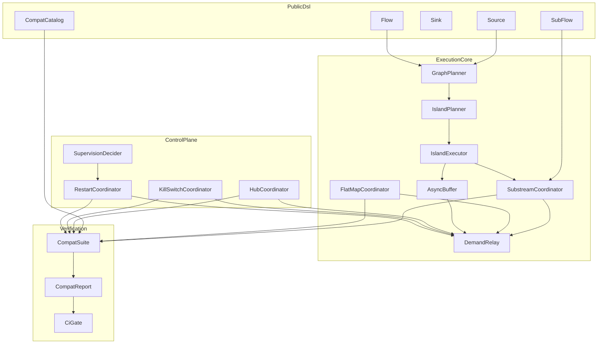
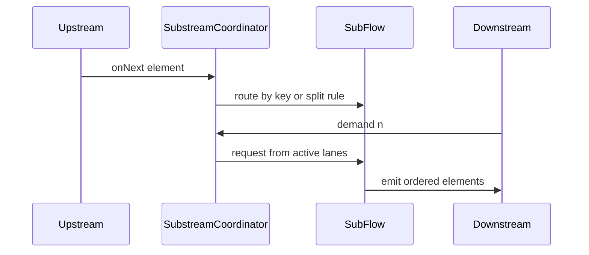
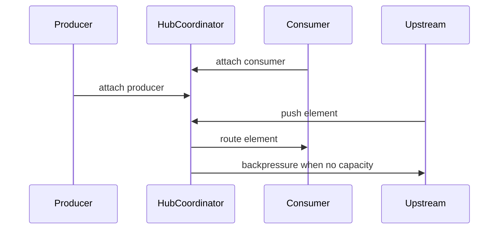
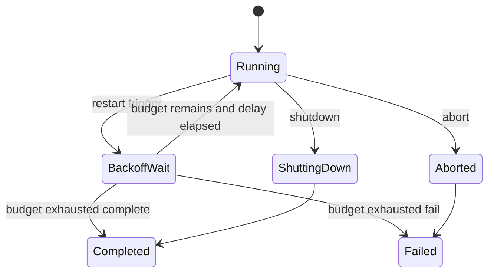
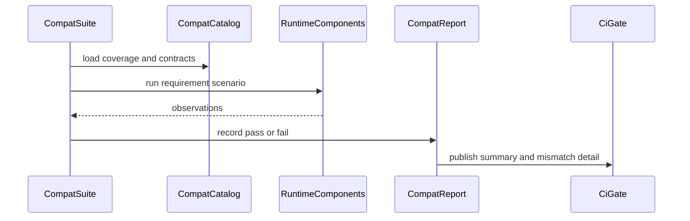

# 設計ドキュメント: pekko-stream-must-compat-fraktor-streams-rs

## 概要
本設計は、`modules/streams` を Pekko Streams の互換MUST（`emits / backpressures / completes / fails`）に合わせるための中核アーキテクチャを定義する。現行の `Tuple/Vec` 近似と eager 実行では Substream・flatMap・Hub・KillSwitch・Restart・async boundary の契約を同時に満たせないため、`SubFlow` 中心モデルへの再設計を採用する。

本仕様の利用者は、Pekko 互換移植を行うストリーム設計者と運用者である。利用者は Source/Flow/Sink API 上で同等概念を選択でき、制御面（KillSwitch/Restart）と検証面（互換スイート）を同じ契約で扱える。

影響範囲は `modules/streams/src/core` と互換検証テスト群であり、後方互換性維持は要件外とする。破壊的変更は許容し、仕様準拠・no_std 維持・CI通過を優先する。

### 目標
- Substream 演算子を `SubFlow` 第一級モデルへ再定義する
- flatMap/Hub/KillSwitch/Restart/async boundary を demand 伝播前提で再設計する
- 受け入れ条件 `1.1`〜`9.4` を要件ID単位で検証可能にする
- `core` no_std 制約を維持したまま互換MUSTを満たす

### 非目標
- Pekko 全演算子の一括実装
- 後方互換を維持するための旧API温存
- `modules/streams` 以外への横断的再設計

## アーキテクチャ

### 既存アーキテクチャ分析
- `group_by/split_*` は `SubFlow` ではなく `Source<(Key, Out)>` / `Source<Vec<Out>>` 近似であり、substream lifecycle を表現できない
- `flat_map_concat/flat_map_merge` は内側ストリームを eager 収集しており、`breadth` 到達時の上流 backpressure 契約が不足している
- `async_boundary` は no-op で、fused/async の実行分離が存在しない
- Hub と KillSwitch は最小実装で、materialization 順序や「初回制御優先」契約が不十分
- RestartBackoff は固定 tick 中心で、指数バックオフと予算超過終端の明示が不足

### Architecture Pattern & Boundary Map
**Architecture Integration**
- 選択パターン: `SubFlow` 中心のデータフロー + 制御プレーン分離
- 境界:
  - Public DSL 境界: Source/Flow/Sink/SubFlow 公開契約
  - Execution Core 境界: Interpreter・substream・demand 伝播
  - Control Plane 境界: Hub/KillSwitch/Restart/Supervision
  - Verification 境界: 互換性検証スイートと要件ID対応レポート
- 既存維持: `core` no_std、`alloc` 前提、過剰抽象回避
- 新規導入の理由: Pekko MUST 契約を型と状態機械で直接表現するため



### Technology Stack & Alignment

| Layer | Choice / Version | Role in Feature | Notes |
|-------|------------------|-----------------|-------|
| Core Runtime | Rust `no_std` + `alloc` (`modules/streams`) | 演算子意味論と状態機械 | `std` 依存を持ち込まない |
| Graph Execution | 既存 `GraphInterpreter` の再編 | substream/async island 実行 | 単一線形前提を撤廃 |
| Control | Hub/KillSwitch/Restart core 実装 | 動的接続と外部停止・再起動 | 状態遷移を明示 |
| Verification | 仕様テスト + CI (`./scripts/ci-check.sh all`) | 要件ID単位の互換検証 | 不一致箇所をレポート化 |
| Reference | `references/pekko` | 互換意味論の基準 | 実装ではなく契約を参照 |

### Pekko参照契約（本設計で固定）
- Dynamic Hub:
  - `MergeHub` は単一 consumer が追従できない場合に全 producer を backpressure する。
  - `BroadcastHub` は consumer 不在時に upstream を backpressure する（デフォルトで drop しない）。
  - `PartitionHub` は consumer 不在時に upstream を backpressure する。consumer 不在時は partitioner を呼ばない。
  - `PartitionHub` の MUST 範囲では「`-1` による drop ルーティング」を採用しない（要件4.4と整合）。
- 入力検証:
  - `flatMapMerge` の `breadth >= 1`、Hub の `bufferSize > 0` 等、無効引数は構築時に失敗させる。
- Substream:
  - `mergeSubstreams` は無制限マージ（`mergeSubstreamsWithParallelism(Int.MaxValue)` と同等）である。
  - `concatSubstreams` は `mergeSubstreamsWithParallelism(1)` と同等である。
- API Surface:
  - `groupBy/splitWhen/splitAfter` は `SubFlow` を返し、`mergeSubstreams/concatSubstreams` で `Source/Flow` に明示的に戻す。
  - substream 演算子は `SubFlow` を第一級とし、`Tuple/Vec` 近似の戻り値は採用しない。
- Async Boundary:
  - `asyncBoundary` は fused 区間を island に分割し、island 間の需要伝播は境界バッファ経由で行う。
  - island 実行は計画 (`IslandPlanner`) と駆動 (`IslandExecutor`) を分離し、実行責務を混在させない。
- Restart:
  - `RestartSettings` は `minBackoff`, `maxBackoff`, `randomFactor`, `maxRestarts`, `maxRestartsWithin` を持つ。
  - fail/complete のいずれでも再起動し、`maxRestartsWithin` を超えて再起動が発生しなければ backoff を `minBackoff` にリセットする。
  - `maxRestarts` 到達時の終端は Pekko 互換MUST範囲では `Complete` を既定とする。
    （`Fail` は互換MUST外の拡張オプション）
  - 実運用は単調時計 + jitter 供給器を注入し、互換検証では固定 seed により決定論を確保する。
- Supervision:
  - `splitWhen/splitAfter` では `restart` を `resume` と同等に扱う。

参照:
- `references/pekko/docs/src/main/paradox/stream/stream-dynamic.md`
- `references/pekko/stream/src/main/scala/org/apache/pekko/stream/scaladsl/Hub.scala`
- `references/pekko/stream/src/main/scala/org/apache/pekko/stream/impl/fusing/StreamOfStreams.scala`
- `references/pekko/stream/src/main/scala/org/apache/pekko/stream/scaladsl/SubFlow.scala`
- `references/pekko/stream/src/main/scala/org/apache/pekko/stream/Attributes.scala`
- `references/pekko/stream/src/main/scala/org/apache/pekko/stream/impl/fusing/ActorGraphInterpreter.scala`
- `references/pekko/stream/src/main/scala/org/apache/pekko/stream/RestartSettings.scala`
- `references/pekko/docs/src/main/paradox/stream/stream-flows-and-basics.md`
- `references/pekko/docs/src/main/paradox/stream/stream-composition.md`
- `references/pekko/docs/src/main/paradox/stream/operators/Source-or-Flow/groupBy.md`
- `references/pekko/docs/src/main/paradox/stream/operators/Source-or-Flow/flatMapConcat.md`
- `references/pekko/docs/src/main/paradox/stream/operators/Source-or-Flow/flatMapMerge.md`
- `references/pekko/docs/src/main/paradox/stream/operators/Source-or-Flow/splitWhen.md`
- `references/pekko/docs/src/main/paradox/stream/operators/Source-or-Flow/splitAfter.md`

## システムフロー

### F1: Substream 分岐統合フロー


### F2: Hub 動的接続フロー


### F3/F4/F5: 制御と非同期境界


フロー決定事項:
- `async_boundary` は実行アイランドを分割し、境界バッファ飽和時は上流へ backpressure を返す
- `IslandPlanner` は `ExecutionPlan` 生成に専念し、island 駆動・wake・境界 drain は `IslandExecutor` が担う
- `IslandExecutor` の wake 条件は `downstream demand` / `upstream push` / `boundary writable` / `control signal` に固定する
- `shutdown/abort` は初回制御のみ有効、後続制御は無視する
- Restart は fail/complete を同一トリガとして扱い、予算とバックオフで遷移を決定する

### F6: 互換検証フロー


## 要件トレーサビリティ

| Requirement | Summary | Components | Interfaces | Flows |
|-------------|---------|------------|------------|-------|
| 1.1 | MUST演算子の公開選択 | CompatCatalog, Source, Flow, Sink | `PekkoCompatOperatorCatalog::lookup` | F1 |
| 1.2 | 非対応/不正引数の明示失敗 | CompatCatalog, GraphPlanner | `lookup`, `plan` | F1 |
| 1.3 | 入力/終端/失敗契約の一貫提示 | CompatCatalog, CompatReport | `coverage`, `render_contract` | F6 |
| 1.4 | 対応範囲の識別可能性 | CompatCatalog, CompatReport | `coverage` | F6 |
| 2.1 | `group_by` でキー別振り分け | SubstreamCoordinator, SubFlow | `on_element` | F1 |
| 2.2 | `group_by` キー上限超過で失敗 | SubstreamCoordinator | `on_element` | F1 |
| 2.3 | `split_when` で要素先頭新規化 | SubstreamCoordinator | `on_element` | F1 |
| 2.4 | `split_after` で要素末尾保持 | SubstreamCoordinator | `on_element` | F1 |
| 2.5 | substream 統合で欠落なし | SubFlow, FlatMapCoordinator | `merge_substreams`, `merge_substreams_with_parallelism`, `concat_substreams` | F1 |
| 2.6 | substream圧力の上流伝播 | DemandRelay, SubstreamCoordinator | `on_demand` | F1 |
| 3.1 | `flat_map_concat` 逐次開始 | FlatMapCoordinator | `on_outer_element` | F1 |
| 3.2 | `flat_map_merge` breadth到達で抑止 | FlatMapCoordinator, DemandRelay | `on_outer_element` | F1 |
| 3.3 | 内側ストリーム順序保持 | FlatMapCoordinator | `on_inner_event` | F1 |
| 3.4 | 回復なし時は全体失敗 | FlatMapCoordinator, RestartCoordinator | `on_inner_event` | F4 |
| 4.1 | MergeHub受信側先行有効化 | HubCoordinator | `attach_producer`, `attach_consumer` | F2 |
| 4.2 | BroadcastHub consumer不在時圧力 | HubCoordinator, DemandRelay | `on_element` | F2 |
| 4.3 | 新規購読者は接続後要素受信 | HubCoordinator | `attach_consumer` | F2 |
| 4.4 | PartitionHub単一有効購読者割当 | HubCoordinator | `on_element` | F2 |
| 4.5 | consumer不在時の規約応答 | HubCoordinator | `on_element`, `fallback` | F2 |
| 5.1 | shutdownで上流取消し下流完了 | KillSwitchCoordinator | `shutdown` | F3 |
| 5.2 | abortで上流取消し下流失敗 | KillSwitchCoordinator | `abort` | F3 |
| 5.3 | 初回制御後の後続無視 | KillSwitchCoordinator | `shutdown`, `abort` | F3 |
| 5.4 | SharedKillSwitch事前生成と同時制御 | KillSwitchCoordinator, SharedKillSwitch | `flow`, `link` | F3 |
| 5.5 | 未発火時の通常処理継続 | KillSwitchCoordinator, DemandRelay | `state` | F3 |
| 6.1 | fail/complete起因再起動 | RestartCoordinator | `on_stage_terminal` | F4 |
| 6.2 | backoff待機中の発行停止と圧力 | RestartCoordinator, DemandRelay | `poll` | F4 |
| 6.3 | 予算超過時の終端 | RestartCoordinator | `on_stage_terminal` | F4 |
| 6.4 | `supervision_resume` でスキップ継続 | SupervisionDecider | `on_stage_error` | F4 |
| 6.5 | `supervision_restart` で状態初期化 | SupervisionDecider | `on_stage_error` | F4 |
| 6.6 | split系の restart==resume | SupervisionDecider, SubstreamCoordinator | `on_stage_error` | F4 |
| 7.1 | 境界なしで fused 実行 | GraphPlanner | `plan` | F5 |
| 7.2 | 境界ありで実行区間分離 | IslandPlanner, IslandExecutor | `plan`, `install` | F5 |
| 7.3 | 区間内順序保持 | IslandExecutor, AsyncBuffer | `tick`, `push`, `drain` | F5 |
| 7.4 | バッファ飽和時の圧力返却 | IslandExecutor, AsyncBuffer, DemandRelay | `tick`, `push` | F5 |
| 8.1 | 演算子別期待結果判定 | CompatSuite | `run_case` | F6 |
| 8.2 | core no_std ビルド維持 | CiGate | `check_core_no_std` | F6 |
| 8.3 | 不一致箇所の識別提示 | CompatReport | `record_mismatch` | F6 |
| 8.4 | 全受入条件の再現検証可能性 | CompatSuite, RequirementSpecHarness | `run_requirement` | F6 |
| 9.1 | 破壊的変更許容 | MigrationPolicyGuard | `allow_breaking_change` | F6 |
| 9.2 | 変更後テスト/CI通過必須 | CiGate | `check_full_ci` | F6 |
| 9.3 | 不要な旧挙動維持コード排除 | MigrationPolicyGuard | `reject_legacy_guard` | F6 |
| 9.4 | 仕様準拠と簡潔性優先 | MigrationPolicyGuard, CompatCatalog | `validate_priority` | F6 |

## Components & Interface Contracts

| Component | Domain/Layer | Intent | Req Coverage | Key Dependencies (P0/P1) | Contracts |
|-----------|--------------|--------|--------------|--------------------------|-----------|
| CompatCatalog | Public DSL | 互換演算子の契約と対応範囲を提供 | 1.1-1.4, 9.4 | GraphPlanner(P0), CompatReport(P1) | Service, State |
| SubstreamSurface | Public DSL | Source/Flow 上で substream 操作を提供する | 2.1-2.6, 3.1 | SubstreamCoordinator(P0) | Service |
| SubstreamCoordinator | Execution Core | group/split/merge/concat の状態制御 | 2.1-2.6, 6.6 | DemandRelay(P0), AsyncBuffer(P1) | Service, State |
| FlatMapCoordinator | Execution Core | concat/merge の内側ストリーム制御 | 3.1-3.4 | DemandRelay(P0), RestartCoordinator(P1) | Service, State |
| IslandPlanner | Execution Core | fused/async 境界ごとの実行計画を作る | 7.1-7.4 | GraphPlanner(P0), AsyncBuffer(P0) | Service |
| IslandExecutor | Execution Core | island 実行を駆動し wake/backpressure を仲介する | 7.2-7.4 | IslandPlanner(P0), AsyncBuffer(P0), DemandRelay(P0) | Service, State |
| HubCoordinator | Control Plane | Merge/Broadcast/Partition の動的接続制御 | 4.1-4.5 | DemandRelay(P0) | Service, State |
| KillSwitchCoordinator | Control Plane | shutdown/abort と shared flow 差し込み | 5.1-5.5 | DemandRelay(P0) | Service, State |
| RestartCoordinator | Control Plane | backoff 予算と再起動遷移の制御 | 6.1-6.6 | SupervisionDecider(P0), BackoffClock(P0), JitterGenerator(P0) | Service, State |
| SupervisionDecider | Control Plane | stage障害時の resume/restart/stop 判定 | 6.4-6.6 | SubstreamCoordinator(P1), RestartCoordinator(P0) | Service |
| CompatSuite | Verification (tests) | tests 側で要件ID単位の互換検証を実行する | 8.1-8.4 | CompatReport(P0), CiGate(P1) | Batch, State |
| MigrationPolicyGuard | Verification (tests) | tests 側で破壊的変更ポリシー適合を確認する | 9.1-9.4 | CiGate(P0), CompatCatalog(P1) | Service |
| CiGate | Verification (tests) | tests 側で CI 通過条件を統合評価する | 8.2, 9.2 | CompatSuite(P0) | Batch |

### Public DSL

#### CompatCatalog

| Field | Detail |
|-------|--------|
| Intent | 互換MUST演算子の可用性と契約を一元管理する |
| Requirements | 1.1, 1.2, 1.3, 1.4, 9.4 |

**Responsibilities & Constraints**
- 演算子キーから契約を引き当てる
- 非対応/無効引数は `CompatError` で失敗理由を返す
- coverage 情報はドキュメントと検証系の両方で再利用する

**Dependencies**
- Inbound: Source/Flow/Sink API 呼び出し (P0)
- Outbound: GraphPlanner への契約適用 (P0)
- External: なし

**Contracts**: Service [x] / API [ ] / Event [ ] / Batch [ ] / State [x]

##### Service Interface
```rust
pub trait PekkoCompatOperatorCatalog {
    fn lookup(&self, key: OperatorKey) -> Result<OperatorContract, CompatError>;
    fn coverage(&self) -> &'static [OperatorCoverage];
}
```
- Preconditions: `OperatorKey` は公開APIから構築される
- Postconditions: 互換対象なら契約を返す
- Invariants: coverage 定義は要件IDと1:1対応を保つ

#### SubstreamSurface

| Field | Detail |
|-------|--------|
| Intent | Source/Flow のサーフェス上で substream 生成・統合を提供する |
| Requirements | 2.1, 2.5, 2.6, 3.1 |

**Responsibilities & Constraints**
- `group_by/split_when/split_after` は Source/Flow から直接返す
- `merge_substreams/merge_substreams_with_parallelism/concat_substreams` は `Vec` を出力する Source/Flow 上で実行する
- materialized value の規約を `Source/Flow` と整合させる
- MUST 範囲の引数は `validate_positive_argument` で構築時に検証する

**Dependencies**
- Inbound: Source/Flow の substream 演算子 (P0)
- Outbound: SubstreamCoordinator (P0)
- External: なし

**Contracts**: Service [x] / API [ ] / Event [ ] / Batch [ ] / State [ ]

##### Service Interface
```rust
impl<Out, Mat> Source<Out, Mat> {
    pub fn group_by<Key, F>(
        self,
        max_substreams: usize,
        key_fn: F,
    ) -> Result<Source<(Key, Out), Mat>, StreamDslError>;
    pub fn split_when<F>(self, predicate: F) -> Source<Vec<Out>, Mat>;
    pub fn split_after<F>(self, predicate: F) -> Source<Vec<Out>, Mat>;
}

impl<In, Out, Mat> Flow<In, Out, Mat> {
    pub fn group_by<Key, F>(
        self,
        max_substreams: usize,
        key_fn: F,
    ) -> Result<Flow<In, (Key, Out), Mat>, StreamDslError>;
    pub fn split_when<F>(self, predicate: F) -> Flow<In, Vec<Out>, Mat>;
    pub fn split_after<F>(self, predicate: F) -> Flow<In, Vec<Out>, Mat>;
}

impl<Out, Mat> Source<Vec<Out>, Mat> {
    pub fn merge_substreams(self) -> Source<Out, Mat>;
    pub fn merge_substreams_with_parallelism(
        self,
        parallelism: usize,
    ) -> Result<Source<Out, Mat>, StreamDslError>;
    pub fn concat_substreams(self) -> Source<Out, Mat>;
}

impl<In, Out, Mat> Flow<In, Vec<Out>, Mat> {
    pub fn merge_substreams(self) -> Flow<In, Out, Mat>;
    pub fn merge_substreams_with_parallelism(
        self,
        parallelism: usize,
    ) -> Result<Flow<In, Out, Mat>, StreamDslError>;
    pub fn concat_substreams(self) -> Flow<In, Out, Mat>;
}
```
- Preconditions: `max_substreams` / `parallelism` は正の値である
- Postconditions: 無効引数は stream 構築時点で `StreamDslError::InvalidArgument` を返す
- Invariants: 実行中に引数整合性が崩れない

##### 公開API契約（実装整合）

| 対象 | 採用シグネチャ | 意味論契約 | Mat規約 |
|------|----------------|------------|---------|
| `Source::group_by/split_when/split_after` | `Source<(Key, Out), Mat>` / `Source<Vec<Out>, Mat>` | 分岐と分割の意味論を保持 | 生成時に upstream の Mat を保持 |
| `Flow::group_by/split_when/split_after` | `Flow<In, (Key, Out), Mat>` / `Flow<In, Vec<Out>, Mat>` | 分岐と分割の意味論を保持 | 生成時に upstream の Mat を保持 |
| `Source<Vec<Out>>::merge_substreams` | `Source<Out, Mat>` | `parallelism = usize::MAX` 相当のマージ | flatten 後も Mat を変更しない |
| `Source<Vec<Out>>::concat_substreams` | `Source<Out, Mat>` | `parallelism = 1` 相当の連結 | flatten 後も Mat を変更しない |
| `Flow<In, Vec<Out>>::merge_substreams` | `Flow<In, Out, Mat>` | `parallelism = usize::MAX` 相当のマージ | flatten 後も Mat を変更しない |
| `Flow<In, Vec<Out>>::concat_substreams` | `Flow<In, Out, Mat>` | `parallelism = 1` 相当の連結 | flatten 後も Mat を変更しない |

補足:
- Mat を合成する必要がある場合は `to_mat/via_mat` の既存規約を使い、暗黙合成を導入しない。
- 破壊的変更は要件9に基づき許容し、旧シグネチャ互換層は導入しない。

##### Validation Contract
```rust
pub const fn validate_positive_argument(
    name: &'static str,
    value: usize,
) -> Result<usize, StreamDslError>;
```

### Execution Core

#### SubstreamCoordinator

| Field | Detail |
|-------|--------|
| Intent | substream lifecycle と demand 伝播を制御する |
| Requirements | 2.1, 2.2, 2.3, 2.4, 2.5, 2.6, 6.6 |

**Responsibilities & Constraints**
- キー別ルーティングと分割境界判定を管理する
- active substream 数、キー上限、完了状態を保持する
- 下流 demand に応じて lane へ pull を配分する
- split 系 supervision 特則（restart==resume）を適用する

**Dependencies**
- Inbound: GraphPlanner の実行イベント (P0)
- Outbound: DemandRelay (P0)
- External: なし

**Contracts**: Service [x] / API [ ] / Event [ ] / Batch [ ] / State [x]

##### Service Interface
```rust
pub trait SubstreamCoordinator<In, Out> {
    fn on_element(&mut self, element: In) -> StepResult<Out>;
    fn on_demand(&mut self, demand: Demand) -> DemandEffect;
}
```

#### FlatMapCoordinator

| Field | Detail |
|-------|--------|
| Intent | flat_map_concat / flat_map_merge の内側実行を管理する |
| Requirements | 3.1, 3.2, 3.3, 3.4 |

**Responsibilities & Constraints**
- concat では単一 lane 完了後に次 lane を開始する
- merge では `breadth` 上限到達時に outer pull を抑止する
- lane 内順序を保持し、復旧なし失敗は全体失敗へ昇格する

**Dependencies**
- Inbound: SubstreamCoordinator (P0)
- Outbound: RestartCoordinator (P1), DemandRelay (P0)
- External: なし

**Contracts**: Service [x] / API [ ] / Event [ ] / Batch [ ] / State [x]

##### Service Interface
```rust
pub trait FlatMapCoordinator<In, Out> {
    fn on_outer_element(&mut self, element: In) -> StepResult<Out>;
    fn on_inner_event(&mut self, lane: LaneId, event: InnerEvent<Out>) -> StepResult<Out>;
}
```

#### IslandPlanner

| Field | Detail |
|-------|--------|
| Intent | fused 実行と async 境界分割の計画を生成する |
| Requirements | 7.1, 7.2, 7.3, 7.4 |

**Responsibilities & Constraints**
- `async_boundary` なし区間を単一 island として融合する
- `async_boundary` あり区間で island と境界バッファを挿入する
- island 内順序と境界圧力伝播の契約を plan に埋め込む

**Dependencies**
- Inbound: GraphPlanner (P0)
- Outbound: IslandExecutor (P0)
- External: なし

**Contracts**: Service [x] / API [ ] / Event [ ] / Batch [ ] / State [ ]

##### Service Interface
```rust
pub trait ExecutionIslandPlanner {
    fn plan(&self, graph: StreamGraph) -> Result<ExecutionPlan, CompatError>;
}
```

#### IslandExecutor

| Field | Detail |
|-------|--------|
| Intent | island 実行を駆動し、境界越しの圧力伝播を一元化する |
| Requirements | 7.2, 7.3, 7.4 |

**Responsibilities & Constraints**
- `ExecutionPlan` を install し、island ごとの drive ループを実行する
- wake 条件（需要/入力/境界書込可/制御イベント）以外では不要な再駆動を行わない
- 境界バッファ飽和時は `DemandRelay` を通じて upstream backpressure を返す
- island 内順序は保持し、順序保証は island 間で混在させない

**Dependencies**
- Inbound: IslandPlanner (P0), 下流 demand (P0), 上流イベント (P0)
- Outbound: AsyncBuffer (P0), DemandRelay (P0), SubstreamCoordinator (P1)
- External: なし

**Contracts**: Service [x] / API [ ] / Event [ ] / Batch [ ] / State [x]

##### Service Interface
```rust
pub trait ExecutionIslandExecutor {
    fn install(&mut self, plan: ExecutionPlan) -> Result<(), CompatError>;
    fn on_downstream_demand(&mut self, demand: Demand) -> DemandEffect;
    fn on_upstream_event(&mut self, event: UpstreamEvent) -> DriveOutcome;
    fn tick(&mut self) -> DriveOutcome;
}
```

### Control Plane

#### HubCoordinator

| Field | Detail |
|-------|--------|
| Intent | MergeHub/BroadcastHub/PartitionHub の動的接続と配信を統制する |
| Requirements | 4.1, 4.2, 4.3, 4.4, 4.5 |

**Responsibilities & Constraints**
- producer/consumer の接続順序制約を管理する
- `MergeHub`: consumer が未接続または追従不能の場合、全 producer へ backpressure を返す
- `BroadcastHub`: consumer 不在時は pending バッファへ保持し、満杯時は upstream backpressure（デフォルト drop なし）
- `PartitionHub`: consumer 不在時は upstream backpressure。consumer 不在時は partitioner を呼ばない
- `PartitionHub`: MUST 範囲では `-1` drop ルートを許可せず、無効なルーティング値は `HubError::InvalidRoute` として失敗
- Partition では 1要素1購読者割当を保証する

**Dependencies**
- Inbound: Source 側 push (P0)
- Outbound: DemandRelay (P0)
- External: なし

**Contracts**: Service [x] / API [ ] / Event [ ] / Batch [ ] / State [x]

##### Service Interface
```rust
pub trait DynamicHubCoordinator<Out> {
    fn attach_producer(&mut self, producer: ProducerId) -> Result<(), HubError>;
    fn attach_consumer(&mut self, consumer: ConsumerId) -> Result<(), HubError>;
    fn on_element(&mut self, element: Out) -> HubStep<Out>;
}

pub enum HubStep<Out> {
    Deliver(Out),
    Buffered,
    Backpressure,
    Fail(HubError),
}
```

#### KillSwitchCoordinator

| Field | Detail |
|-------|--------|
| Intent | KillSwitch の停止契約と shared flow 差し込みを保証する |
| Requirements | 5.1, 5.2, 5.3, 5.4, 5.5 |

**Responsibilities & Constraints**
- `shutdown/abort` の初回制御を確定し後続呼び出しを無視する
- 上流キャンセルと下流終端の整合を保つ
- `SharedKillSwitch.flow()` で materialization 前の共有差し込み点を提供する

**Dependencies**
- Inbound: 外部制御呼び出し (P0)
- Outbound: DemandRelay (P0), StreamGraph (P1)
- External: なし

**Contracts**: Service [x] / API [ ] / Event [ ] / Batch [ ] / State [x]

##### Service Interface
```rust
pub trait KillSwitchCoordinator {
    fn shutdown(&mut self) -> ControlOutcome;
    fn abort(&mut self, cause: StreamError) -> ControlOutcome;
}

pub trait SharedKillSwitchFlow {
    fn flow<In, Out>(&self) -> Flow<In, Out, NotUsed>;
}
```

#### RestartCoordinator

| Field | Detail |
|-------|--------|
| Intent | backoff 付き再起動と supervision 分岐を管理する |
| Requirements | 6.1, 6.2, 6.3, 6.4, 6.5, 6.6 |

**Responsibilities & Constraints**
- fail/complete を同一再起動トリガとして処理する
- backoff 待機中は emit を止め、上流 demand を抑止する
- `resume/restart/stop` を supervision 設定で決定する
- backoff は指数増加 + jitter（`random_factor`）で計算し、`maxRestartsWithin` を超えて再起動が発生しない場合は `min_backoff` へ戻す
- `max_restarts` 到達時は `on_max_restarts` で定義された終端へ遷移する（互換MUST既定は `Complete`）
- restart 過程は lossy であることを明示し、観測イベントで可視化する
- 時間源は `BackoffClock`、jitter 源は `JitterGenerator` として注入し、`std` 依存の時刻/乱数呼び出しを直接持たない
- 互換検証プロファイルでは固定 seed の `JitterGenerator` を用いて再現性を保証する

**Dependencies**
- Inbound: Stage terminal/error イベント (P0)
- Outbound: DemandRelay (P0), SubstreamCoordinator (P1)
- External: BackoffClock (P0), JitterGenerator (P0)

**Contracts**: Service [x] / API [ ] / Event [ ] / Batch [ ] / State [x]

##### Service Interface
```rust
pub trait BackoffClock {
    fn now(&self) -> MonotonicTime;
}

pub trait JitterGenerator {
    fn next_unit_interval(&mut self) -> f64;
    fn reseed(&mut self, seed: u64);
}

pub enum RestartLimitTerminalAction {
    Complete,
    Fail(StreamError),
}

pub struct BackoffPolicy {
    pub min_backoff: Duration,
    pub max_backoff: Duration,
    pub random_factor: f64,
    pub max_restarts: usize,
    pub max_restarts_within: Duration,
    pub restart_on: RestartOnPredicate,
    pub on_max_restarts: RestartLimitTerminalAction,
    pub jitter_seed: Option<u64>,
}

pub trait RestartBackoffCoordinator {
    fn configure(
        &mut self,
        policy: BackoffPolicy,
        clock: &dyn BackoffClock,
        jitter: &mut dyn JitterGenerator,
    ) -> Result<(), CompatError>;
    fn on_stage_terminal(&mut self, reason: TerminalReason) -> RestartDecision;
    fn on_stage_error(&mut self, error: StreamError) -> SupervisionDecision;
    fn poll(&mut self) -> RestartTick;
}
```
- Preconditions: `BackoffPolicy::on_max_restarts` は互換MUSTプロファイルで `Complete` を指定する
- Preconditions: 互換検証時は `jitter_seed` を必須化し、`BackoffClock` は単調時刻を返す
- Postconditions: `max_restarts` 到達時に `on_max_restarts` に従い確定終端する

#### SupervisionDecider

| Field | Detail |
|-------|--------|
| Intent | stage障害時の supervision 判定を一元化する |
| Requirements | 6.4, 6.5, 6.6 |

**Responsibilities & Constraints**
- stage と例外種別から `resume/restart/stop` を決定する
- `split_when/split_after` では `restart` を `resume` と同等に扱う
- decider の判定は deterministic で再現可能である

**Dependencies**
- Inbound: RestartCoordinator からの障害通知 (P0)
- Outbound: RestartCoordinator への判定返却 (P0)
- External: なし

**Contracts**: Service [x] / API [ ] / Event [ ] / Batch [ ] / State [ ]

##### Service Interface
```rust
pub trait SupervisionDecider {
    fn decide(&self, stage: StageKind, error: &StreamError) -> SupervisionDecision;
}
```

### Verification

#### CompatSuite（tests）

| Field | Detail |
|-------|--------|
| Intent | 要件ID単位で互換MUSTを検証し不一致を記録する |
| Requirements | 8.1, 8.3, 8.4 |

**Responsibilities & Constraints**
- `emits/backpressures/completes/fails` の観測結果をケースごとに判定する
- 要件IDごとに再現可能なテストシナリオを維持する
- mismatch は再実行可能な文脈付きで記録する
- 実装配置は `modules/streams/tests/compat_validation.rs` と `modules/streams/tests/requirement_traceability.rs` に限定する

**Dependencies**
- Inbound: CompatCatalog, 各Coordinator (P0)
- Outbound: CompatReport, CiGate (P0)
- External: なし

**Contracts**: Service [ ] / API [ ] / Event [ ] / Batch [x] / State [x]

##### Batch / Job Contract
- Trigger: CI またはローカル互換検証実行
- Input / validation: 要件IDと演算子シナリオ定義
- Output / destination: `CompatReport`（要件ID別の pass/fail）
- Idempotency & recovery: 同一シナリオ + 同一 seed + 同一 clock 条件で再実行時に同一判定を返す

#### MigrationPolicyGuard（tests）

| Field | Detail |
|-------|--------|
| Intent | 破壊的変更許容ポリシーを機械的に評価する |
| Requirements | 9.1, 9.2, 9.3, 9.4, 8.2 |

**Responsibilities & Constraints**
- 後方互換維持コードを残さない方針をチェックする
- `core` no_std 検証と全体 CI 成功をマージ条件にする
- 仕様準拠より弱い判断を拒否する
- 実装配置は `modules/streams/tests/compat_validation.rs` に限定する

**Dependencies**
- Inbound: CompatReport, CI 実行結果 (P0)
- Outbound: マージ可否判定 (P0)
- External: `./scripts/ci-check.sh all` (P0)

**Contracts**: Service [x] / API [ ] / Event [ ] / Batch [x] / State [ ]

## データモデル

### Domain Model
- Aggregate: `StreamExecutionAggregate`
  - 実行計画、substream 状態、制御状態（KillSwitch/Restart）を一貫更新する
- Entity:
  - `SubflowLane`（laneごとの順序と demand を保持）
  - `HubEndpoint`（producer/consumer 接続状態）
- Value Object:
  - `SubflowId`, `LaneId`, `Demand`, `BackoffBudget`, `OperatorKey`, `MonotonicTime`, `JitterSeed`
  - `SubstreamLimit`, `MergeParallelism`, `MergeBreadth`, `HubBufferSize`, `StartAfterNrOfConsumers`
  - `BackoffPolicy`
- Domain Event:
  - `SubflowOpened`, `SubflowClosed`, `BackoffEntered`, `KillSwitchTriggered`, `CompatMismatchFound`

### Logical Data Model
- `SubstreamStateTable`
  - key: `SubflowId`
  - columns: `lane_state`, `pending_demand`, `is_closed`, `last_error`
- `HubConnectionTable`
  - key: `HubId`
  - columns: `producers`, `consumers`, `routing_policy`, `availability`
- `RestartStateTable`
  - key: `StageId`
  - columns: `restart_count`, `window_started_at`, `next_retry_at`, `decision`, `jitter_seed`, `last_backoff`
- `CompatibilityCaseTable`
  - key: `RequirementId`
  - columns: `scenario_name`, `expected`, `actual`, `status`, `diagnostic`

**Consistency & Integrity**
- `SubstreamStateTable` と `RestartStateTable` の更新は同一実行tick内で原子的に扱う
- `KillSwitchTriggered` 後は状態遷移を単方向に固定する
- `RequirementId` は `N.M` 形式のみ許可する

### Data Contracts & Integration
- Compatibility report contract:
  - `requirement_id: RequirementId`
  - `operator: OperatorKey`
  - `expected_observation: ObservationSet`
  - `actual_observation: ObservationSet`
  - `result: Pass | Fail`
  - `diagnostic: DiagnosticDetail`

## エラーハンドリング

### Error Strategy
- 契約違反（不正引数・非対応演算子）は即時 `CompatError` を返す
- 実行時障害は `StreamError` で段階的に分類し、supervision 設定により `resume/restart/stop` を選択する
- KillSwitch/Restart は状態機械を通じて重複イベントを吸収する
- 引数検証は「Graph構築前」に完了させ、実行中の panic ではなく構築時エラーへ収束させる

### Error Categories and Responses
- User Errors:
  - 不正引数: 失敗理由と対象演算子を返す
  - 非対応演算子: coverage 情報へ誘導する
- System Errors:
  - Hub 接続不備: backpressure または規約失敗を返す
  - バッファ飽和: 上流へ pressure 返却
- Business Logic Errors:
  - 要件期待との差分: `CompatMismatchFound` として収集し CI で fail

## テスト戦略

- 契約テスト:
  - `1.1`〜`9.4` を要件ID単位で 1 ケース以上作成する
  - 要件IDトレーサビリティ行列を `modules/streams/tests/requirement_traceability.rs` で維持する
  - substream と flatMap は順序・pressure・終端を同時観測する
- 統合テスト:
  - Hub 動的接続（receiver-first, consumer late join, no consumer）
  - SharedKillSwitch の複数ストリーム同時制御
  - Restart+supervision+split 特則の組み合わせ
- ビルド/CI:
  - `core` no_std ビルド検証
  - `./scripts/ci-check.sh all` を最終ゲートとして必須化

## 前提とデフォルト
- 互換MUST達成のための破壊的変更は許容する（要件9）
- 旧API互換層は原則導入しない。必要時は短命で削除計画を同時に定義する
- 性能最適化は意味論互換の成立後に行う
