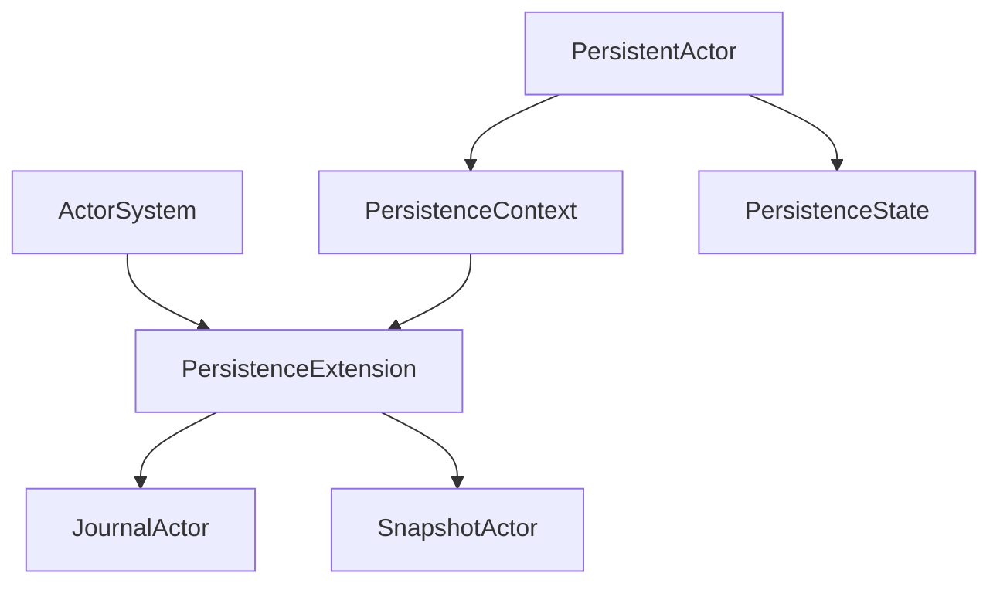
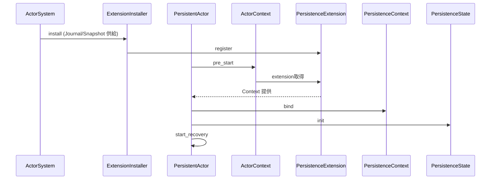
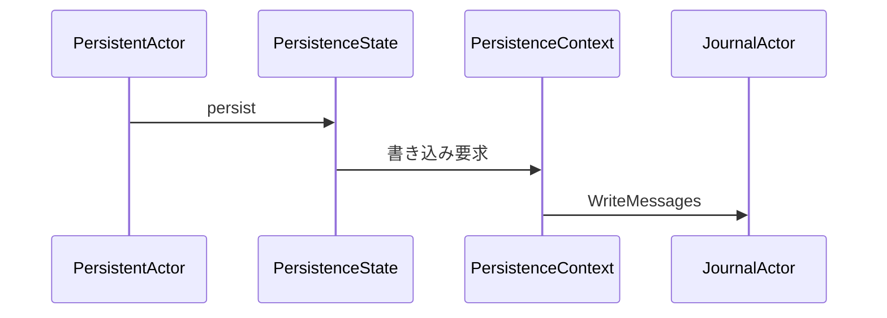

# 設計ドキュメント: persistence-actor-api-hidden

## 概要
本機能は永続化サブシステム内部の Journal と Snapshot の ActorRef をユーザAPIから隠蔽し、Pekko 互換の利用体験に合わせることを目的とする。利用者は persistence_id のみを指定し、永続化の初期化や内部通信はシステム側で自動的に整備される。

永続化機能は継承ではなく合成で提供する。`PersistentActorBase` のような基底構造は設けず、永続化の通信経路は `PersistenceContext`、状態とキュー処理は `PersistenceState` に分離する。Actor は両者を明示的に所有し、`PersistentActorAdapter` が `pre_start` で自動初期化と復旧開始を保証する。利用者は `persistent_props` / `spawn_persistent` のみを使い、Adapter を意識しない。

### 目標
- 永続アクターの構成から Journal/Snapshot の ActorRef を排除する
- 永続化コンテキストと状態の合成パターンを提供する
- no_std 境界と既存拡張機構に沿った初期化経路を確立する
- `PersistentActorBase` を廃止し、明示的な状態とコンテキストに統一する
- `persistence_id` の単一ソースを Actor に固定する

### 非目標
- 永続化ジャーナル実装の差し替え機構の刷新
- 新しい永続化ストレージや外部依存の追加
- 既存の永続化フロー（persist/recovery/snapshot）の仕様変更

### 設計原則
- **所有権の明示**: 永続化状態は Actor が所有し、`&mut self` で更新する
- **IO 境界の分離**: Journal/Snapshot への送信は `PersistenceContext` に集約する
- **合成による責務分離**: 状態・通信・利用 API をそれぞれ独立させる
- **自動初期化**: `pre_start` で初期化・復旧開始を自動実行し、手動呼び出しを不要にする
- **単一入口**: 永続アクター生成は `persistent_props` / `spawn_persistent` に集約する

## アーキテクチャ

### 既存アーキテクチャ分析（必要な場合）
- `PersistentActorBase::new` が ActorRef を要求しており、API 隠蔽要件に反する
- 基底構造は状態と IO 境界を不可視にし、Rust の所有権設計と合わない
- `PersistenceExtensionGeneric` は ActorRef を保持するが、ActorSystem からの取得経路が不足
- Extension 機構は `ExtendedActorSystemGeneric` と `ExtensionInstaller` により既存パターンが確立されている

### パターンと境界マップ
**アーキテクチャ統合**
- 選択したパターン: ExtensionInstaller + ExtensionId + Context/State 分離 + Adapter 初期化
- 境界の切り方: ActorSystem が拡張を所有し、Actor は `PersistenceContext` と `PersistenceState` を合成して永続化機能を利用する
- 既存パターンの維持: Extension 登録と取得の仕組み
- 新規コンポーネントの理由: ActorRef を公開せず、IO 境界と状態管理を明確に分離するため
- ステアリング適合: no_std 境界、拡張機構、命名規約を維持



### 技術スタック

| レイヤ | 選定 / バージョン | 役割 | 備考 |
|-------|------------------|------|------|
| ランタイム / 実行基盤 | fraktor-actor-rs core | Extension 登録/取得 | 既存機構を利用 |
| データ / 永続化 | fraktor-persistence-rs core | Journal/Snapshot 操作 | 新規依存なし |
| メッセージング / イベント | AnyMessageGeneric | 内部メッセージ送信 | 既存 API を継続 |
| 監視 / メトリクス | EventStream | 変更なし | 本件対象外 |
| 互換性 / シリアライズ | 既存 Serializer | 変更なし | 本件対象外 |

## システムフロー

### 初期化フロー


### 永続化操作フロー


## 要件トレーサビリティ

| 要件 | 概要 | 対応コンポーネント | インターフェイス | フロー |
|------|------|--------------------|------------------|--------|
| 1.1 | ActorRef を要求しない | PersistenceContext, PersistentActor | Context API | 初期化/永続化 |
| 1.2 | 自動初期化 | PersistentActorAdapter, PersistentProps | Adapter/Props API | 初期化 |
| 1.3 | persistence_id 変更なし | PersistentActorAdapter, PersistenceState | State API | 初期化 |
| 1.4 | 複数 actor の独立性 | PersistenceExtension | Extension API | 初期化 |
| 1.5 | ActorRef を公開しない | PersistenceContext | Context API | 初期化/永続化 |
| 2.1 | コンテキスト提供 | PersistenceExtension, PersistenceContext | Context API | 初期化 |
| 2.2 | コンテキスト経由操作 | PersistenceContext, PersistenceState | Context API | 永続化 |
| 2.3 | 命名規約 | PersistenceContext | 命名指針 | なし |
| 3.1 | 拡張登録の維持 | PersistenceExtensionId | ExtensionId API | 初期化 |
| 3.2 | 未登録時の起動失敗 | PersistentActorAdapter | Adapter API | 初期化 |
| 3.3 | 拡張共有 | PersistenceExtension | Extension API | 初期化 |
| 3.4 | 通常操作継続 | PersistentActor, PersistenceState | Persist API | 永続化 |
| 4.1 | no_std 境界 | PersistenceContext, PersistenceState | core API | なし |
| 4.2 | ActorRef 指定不要 | PersistenceContext | Context API | 永続化 |
| 4.3 | persistence_id だけで構成 | PersistentActorAdapter, PersistenceState | State API | 初期化 |
| 5.1 | core/std 境界遵守 | PersistenceContext, PersistenceExtension | 設計指針 | なし |
| 5.2 | エラーハンドリング指針 | PersistentActor, PersistenceContext | init API | 初期化 |
| 5.3 | 簡素化方針 | 全体 | 設計指針 | なし |
| 5.4 | 共有ラッパ指針 | PersistenceExtension | Extension API | なし |
| 5.5 | examples 更新 | Examples | サンプル構成 | なし |

## コンポーネントとインターフェイス

| コンポーネント | ドメイン/層 | 目的 | 要件対応 | 主要依存 (P0/P1) | 契約 |
|---------------|------------|------|----------|------------------|------|
| PersistenceExtensionId | Core/Extension | 拡張登録の入口 | 3.1, 3.3 | Extension(P0) | Service |
| PersistenceExtensionInstaller | Core/Extension | 拡張をブートストラップする | 1.2, 3.1, 3.2 | ActorSystem(P0) | Service |
| PersistenceExtension | Core/Extension | Journal/Snapshot ActorRef を保持 | 1.4, 3.3, 3.4 | JournalActor(P0), SnapshotActor(P0) | Service |
| PersistenceContext | Core | ActorRef を隠蔽した永続化操作面 | 1.1, 1.5, 2.1, 2.2 | PersistenceExtension(P0) | Service |
| PersistenceState | Core | 永続化状態とバッチ制御 | 1.2, 1.3, 3.4, 4.3 | PersistenceContext(P0) | State |
| PersistentActorAdapter | Core | 自動初期化と復旧開始の保証 | 1.2, 3.2, 4.3 | PersistenceState(P0), PersistenceContext(P0) | Service |
| PersistentActor | Core | 永続化操作 API | 3.4, 4.2 | PersistenceState(P0), PersistenceContext(P0) | Service |
| PersistentProps | Core | Adapter 適用済み Props 生成 | 1.2, 4.2 | PersistentActorAdapter(P0) | API |
| Examples | Docs | 前例踏襲の利用例 | 5.5 | 既存 examples(P1) | API |

### Core

#### PersistenceExtensionId

| 項目 | 内容 |
|------|------|
| 目的 | ActorSystem へ永続化拡張を登録する識別子 |
| 対応要件 | 3.1, 3.3 |

**責務と制約**
- ExtensionId パターンに従って拡張を生成する
- no_std で動作する拡張生成のみを許容
- Journal/Snapshot の供給元を保持する

**依存関係**
- Inbound: ActorSystemGeneric — 登録呼び出し（P0）
- Outbound: PersistenceExtension — 生成（P0）

**契約**: Service [x] / API [ ] / Event [ ] / Batch [ ] / State [ ]

##### サービスインターフェイス（Rust）
```rust
pub struct PersistenceExtensionId<J, S> {
  journal: J,
  snapshot_store: S,
}

impl<TB, J, S> ExtensionId<TB> for PersistenceExtensionId<J, S>
where
  TB: RuntimeToolbox + 'static,
  J: Journal + Clone + Send + Sync + 'static,
  S: SnapshotStore + Clone + Send + Sync + 'static,
{
  type Ext = PersistenceExtensionSharedGeneric<TB>;
  fn create_extension(&self, system: &ActorSystemGeneric<TB>) -> Self::Ext;
}
```
- 前提条件: ActorSystem が初期化済みである
- 事後条件: PersistenceExtension が登録される
- 不変条件: core/no_std 境界を破らない

#### PersistenceExtensionInstaller

| 項目 | 内容 |
|------|------|
| 目的 | ActorSystem ブート時に拡張を登録する |
| 対応要件 | 1.2, 3.1, 3.2 |

**責務と制約**
- ActorSystem の extension_installers 経由で登録される
- 失敗時は起動失敗を返す
- Journal/Snapshot の供給元を保持し、拡張生成に渡す

**依存関係**
- Inbound: ActorSystemGeneric — bootstrap（P0）
- Outbound: PersistenceExtensionId — 登録（P0）

**契約**: Service [x] / API [ ] / Event [ ] / Batch [ ] / State [ ]

##### サービスインターフェイス（Rust）
```rust
pub struct PersistenceExtensionInstaller<J, S> {
  journal: J,
  snapshot_store: S,
}

impl<TB, J, S> ExtensionInstaller<TB> for PersistenceExtensionInstaller<J, S>
where
  TB: RuntimeToolbox + 'static,
  J: Journal + Clone + Send + Sync + 'static,
  S: SnapshotStore + Clone + Send + Sync + 'static,
{
  fn install(&self, system: &ActorSystemGeneric<TB>) -> Result<(), ActorSystemBuildError>;
}
```
- 前提条件: ActorSystem の bootstrap 中である
- 事後条件: PersistenceExtension が登録される
- 不変条件: ActorRef を公開 API へ出さない

#### PersistenceExtension

| 項目 | 内容 |
|------|------|
| 目的 | Journal/Snapshot ActorRef をシステム側で保持する |
| 対応要件 | 1.4, 3.3, 3.4 |

**責務と制約**
- ActorRef を外部 API へ公開しない
- 拡張として system に登録され、複数アクターから参照される
- 共有参照として `*Shared` ラッパを利用し、`shared-wrapper-design` に従う
- 内部アクター生成は system guardian 経由で行う
- Journal/Snapshot の供給は Installer から受け取る

**依存関係**
- Inbound: PersistenceContext — 参照（P0）
- Outbound: JournalActor/SnapshotActor — 永続化処理（P0）

**契約**: Service [x] / API [ ] / Event [ ] / Batch [ ] / State [ ]

##### サービスインターフェイス（Rust）
```rust
pub struct PersistenceExtensionGeneric<TB: RuntimeToolbox + 'static> {
  // ActorRef は内部に保持し、公開しない
}

impl<TB: RuntimeToolbox + 'static> PersistenceExtensionGeneric<TB> {
  pub fn context(&self) -> PersistenceContext<TB>;
}
```
- 前提条件: Extension 登録済み
- 事後条件: コンテキスト生成が可能
- 不変条件: ActorRef を公開 API へ出さない

#### PersistenceContext

| 項目 | 内容 |
|------|------|
| 目的 | 永続化操作の合成パターンを提供する |
| 対応要件 | 1.1, 1.5, 2.1, 2.2 |

**責務と制約**
- ActorRef を隠蔽した永続化操作 API を提供する
- `PersistentActor` と `PersistenceState` からの操作を受ける
- core/no_std で完結する
- 共有が必要な場合は `*Shared` を用い、内部可変性を持ち込まない

**依存関係**
- Inbound: PersistentActor, PersistenceState — 操作要求（P0）
- Outbound: PersistenceExtension — 内部参照（P0）

**契約**: Service [x] / API [ ] / Event [ ] / Batch [ ] / State [ ]

##### サービスインターフェイス（Rust）
```rust
pub struct PersistenceContext<TB: RuntimeToolbox + 'static>;

impl<TB: RuntimeToolbox + 'static> PersistenceContext<TB> {
  pub fn send_write_messages(&self, message: JournalMessage<TB>) -> Result<(), PersistenceError>;
  pub fn send_snapshot_message(&self, message: SnapshotMessage<TB>) -> Result<(), PersistenceError>;
}
```
- 前提条件: Extension 登録済み
- 事後条件: 永続化メッセージが送信される
- 不変条件: ActorRef を外部へ公開しない

#### PersistenceState

| 項目 | 内容 |
|------|------|
| 目的 | 永続化状態とバッチ制御を保持する |
| 対応要件 | 1.2, 1.3, 3.4, 4.3 |

**責務と制約**
- persistence_id、シーケンス番号、pending handler、recovery 状態を保持する
- 永続化メッセージの生成とバッチ制御を行う
- ActorRef を保持しない
- 状態変更は `&mut self` を通じて明示する
- persistence_id の単一ソースは Actor 側に固定する
- `PersistenceState::new` は Adapter 内部専用とする

**依存関係**
- Inbound: PersistentActor — 操作（P0）
- Outbound: PersistenceContext — 永続化操作（P0）

**契約**: Service [ ] / API [ ] / Event [ ] / Batch [ ] / State [x]

##### サービスインターフェイス（Rust）
```rust
pub struct PersistenceState<A, TB: RuntimeToolbox + 'static>;

impl<A, TB: RuntimeToolbox + 'static> PersistenceState<A, TB> {
  pub(crate) fn new(persistence_id: String) -> Self;
  pub fn bind_context(&mut self, context: PersistenceContext<TB>) -> Result<(), PersistenceError>;
  pub fn persistence_id(&self) -> &str;
}
```
- 前提条件: bind_context は PersistentActorAdapter の pre_start で呼び出される
- 事後条件: 永続化操作が可能
- 不変条件: persistence_id は不変

#### PersistentActorAdapter

| 項目 | 内容 |
|------|------|
| 目的 | 自動初期化と復旧開始を保証する |
| 対応要件 | 1.2, 3.2, 4.3 |

**責務と制約**
- `pre_start` で拡張取得・コンテキスト結合・復旧開始を実行する
- persistence_id は `Eventsourced::persistence_id()` を唯一のソースとする
- ActorRef をユーザへ露出しない
- public API から直接生成できない
- `persistent_props` / `spawn_persistent` でのみ生成される

**依存関係**
- Inbound: ActorSystem — アクター生成（P0）
- Outbound: PersistenceExtension — コンテキスト取得（P0）

**契約**: Service [x] / API [ ] / Event [ ] / Batch [ ] / State [ ]

##### サービスインターフェイス（Rust）
```rust
pub struct PersistentActorAdapter<A, TB: RuntimeToolbox + 'static> {
  actor: A,
}

impl<A, TB> Actor<TB> for PersistentActorAdapter<A, TB>
where
  A: PersistentActor<TB>,
  TB: RuntimeToolbox + 'static,
{
  fn pre_start(&mut self, ctx: &mut ActorContextGeneric<'_, TB>) -> Result<(), ActorError>;
}
```
- 前提条件: Extension は登録済み
- 事後条件: 永続化初期化と recovery 開始が完了する
- 不変条件: persistence_id は Actor が提供する

#### PersistentActor

| 項目 | 内容 |
|------|------|
| 目的 | 永続化操作 API を提供する |
| 対応要件 | 3.4, 4.2 |

**責務と制約**
- Context と State を合成して永続化操作を実行する
- ActorRef をユーザに要求しない
- 既存の継承ベース API に依存しない

**依存関係**
- Inbound: Actor 実装 — コマンド処理（P0）
- Outbound: PersistenceState, PersistenceContext — 永続化操作（P0）

**契約**: Service [x] / API [ ] / Event [ ] / Batch [ ] / State [ ]

##### サービスインターフェイス（Rust）
```rust
pub trait PersistentActor<TB: RuntimeToolbox + 'static>: Eventsourced<TB> {
  fn persistence_context(&self) -> &PersistenceContext<TB>;
  fn persistence_state(&mut self) -> &mut PersistenceState<Self, TB>;
}
```
- 前提条件: `PersistentActorAdapter` が pre_start で初期化を完了している
- 事後条件: 永続化操作が可能
- 不変条件: ActorRef を公開しない

#### PersistentProps

| 項目 | 内容 |
|------|------|
| 目的 | Adapter 適用済み Props と spawn を提供する |
| 対応要件 | 1.2, 4.2 |

**責務と制約**
- `PersistentActorAdapter` を内部で必ず適用する
- ユーザに Adapter を露出しない

**依存関係**
- Inbound: Actor 実装 — 生成（P0）
- Outbound: PropsGeneric / ActorSystemGeneric — 生成・spawn（P0）

**契約**: Service [ ] / API [x] / Event [ ] / Batch [ ] / State [ ]

**補足**: 詳細インターフェイスは「公開APIの入口」を参照

## データモデル
変更なし。

## エラーハンドリング

### 方針
- `PersistenceError` を境界エラーとして使用し、`ActorError` へ変換する
- Extension 未登録時は明示的なエラーに分類し、起動失敗を返す
- `rust-error-handling` の方針に沿い、回復可能性でエラー分類を行う

### エラー分類と応答
**入力系**: Extension 未登録 → 起動失敗（ActorError）  
**システム系**: メッセージ送信失敗 → `PersistenceError::MessagePassing`

### 監視
- 起動失敗は EventStream/DeadLetter の既存メトリクスで把握する

## テスト戦略

- 単体テスト
  - ExtensionId 登録で PersistenceExtension を取得できること
  - ExtensionInstaller の登録で PersistenceExtension が install されること
  - Extension 未登録時に init が失敗すること
  - PersistenceContext が ActorRef を公開しないこと（API 監視）
  - PersistenceState が persistence_id を保持し、更新しないこと
  - PersistentActorAdapter が pre_start で初期化と recovery を開始すること
- 統合テスト
  - 既存 persistence_flow のシナリオが ActorRef 手渡しなしで通ること
- examples
  - `persistent_counter_no_std` を新 API に移行

## オプション（必要な場合のみ）

### マイグレーション
- `PersistentActorBase` を廃止し、`PersistenceState` と `PersistenceContext` へ置換する
- 後方互換は不要とし、旧 API は削除する

## 公開APIの入口

### persistent_props / spawn_persistent
- `PersistentActorAdapter` を内部で強制適用する唯一の生成経路
- Adapter は public API から露出しない

```rust
pub fn persistent_props<TB, A>(factory: impl FnOnce() -> A + Send + Sync + 'static) -> PropsGeneric<TB>
where
  TB: RuntimeToolbox + 'static,
  A: PersistentActor<TB> + 'static;

pub fn spawn_persistent<TB, A>(
  system: &ActorSystemGeneric<TB>,
  props: &PropsGeneric<TB>,
) -> Result<ActorRefGeneric<TB>, SpawnError>
where
  TB: RuntimeToolbox + 'static,
  A: PersistentActor<TB> + 'static;
```

## Supporting References
- `.kiro/specs/persistence-actor-api-hidden/research.md`
