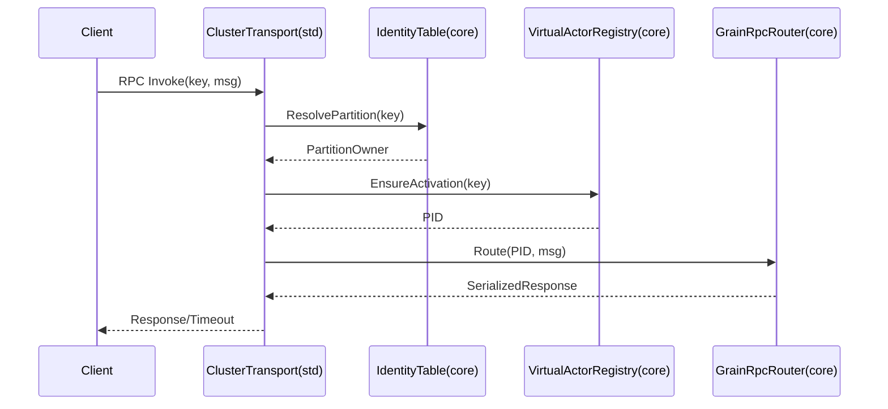
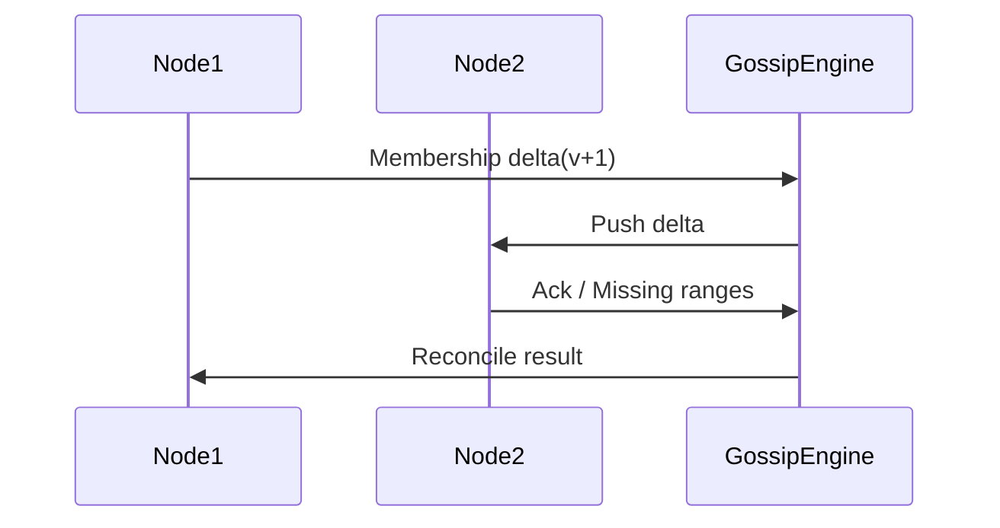
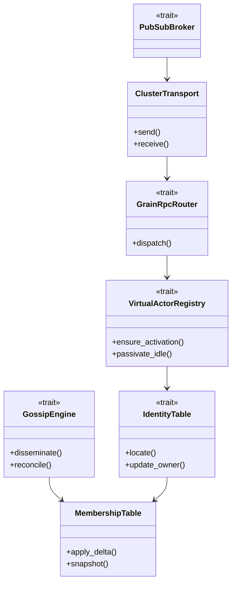

# 設計ドキュメント

## 概要
protoactor-go 互換のクラスタ機能を Rust ランタイムへ移植し、Virtual Actor（グレイン）と RPC/publish-subscribe を最小構成で提供する。ノード参加・メンバーシップ一致・Gossip ベースのコンセンサス・Identity Lookup・リモートメッセージ送達を統合し、低依存で no_std コアとの整合性を保つ。

### 目標 (Goals)
- メンバーシップ/Gossip/Quarantine を統合したクラスタ基盤を提供する。
- Virtual Actor の自動アクティベーションと Grain RPC 呼び出し経路を確立する。
- Quickstart で 2+ ノードを即時起動し、リモートメッセージと RPC の成功を確認できる。

### 非目標 (Non-Goals)
- ストレージ永続化プラグイン（State Store）の実装。
- TLS/認証認可などセキュリティ拡張（別 spec）。
- フル機能 PubSub 配信品質 (exactly-once) の実装。

## アーキテクチャ

### 既存アーキテクチャの把握
- ワークスペースは `modules/utils` → `modules/actor` → `modules/remote` の一方向依存とし、クラスタ機能のコアロジックは no_std の `modules/cluster/src/core/`(以下core) に置き、`modules/cluster/src/std/`(以下std) はラッパー・ドライバ・アダプタのみを持つ。
- 1 ファイル 1 型、2018 モジュール、`mod.rs` 禁止。`modules/cluster/src/core` 側で `#[cfg(feature="std")]` を使わない。

### ハイレベルアーキテクチャ
```mermaid
graph TB
    subgraph core
        Membership[MembershipTable]
        Identity[IdentityTable]
        VirtualActor[VirtualActorRegistry]
        RpcRouter[GrainRpcRouter]
        Gossip[GossipEngine]
    end
    subgraph std
    Transport[ClusterTransport]
    Heartbeat[HeartbeatDriver]
    Serializer[MessageSerializerRegistry]
    Provider[ClusterProvider]
    PidCache[PidCache]
    end
    EventStream[EventStream]
    PubSub[PubSubBroker (optional)]
    Rendezvous[RendezvousHasher]
    Quickstart[QuickstartBootstrap]

    Transport --> Membership
    Transport --> Gossip
    Heartbeat --> Membership
    Gossip --> Membership
    Provider --> Transport
    Rendezvous --> Identity
    PidCache --> Transport
    Identity --> PidCache
    Membership --> Identity
    Identity --> VirtualActor
    VirtualActor --> RpcRouter
    RpcRouter --> Transport
    PubSub --> Transport
    Gossip --> EventStream
    RpcRouter --> EventStream
    VirtualActor --> EventStream
    Quickstart --> Transport
    Quickstart --> VirtualActor
```
- core: 無状態ロジックとテーブル管理。std: ネットワーク I/O・シリアライズ・ハートビート。
- Steering 原則の層分離と FQCN import を維持。

-### 技術スタック / 設計判断
- Transport: 抽象化されたトランスポート（`modules/remote` と同じ方針）。core はトランスポート詳細を持たず、`WireEnvelope`/`WireMessage` インターフェイスでバイト列を扱うのみ。std では `modules/remote` 提供の `TokioTcpTransport` を流用／薄いアダプタで接続する。
- ワイヤエンコード: protobuf/（必要なら）gRPC は std 側のみで使用。core は no_std 制約のためシリアライザ非依存で、`SerializerRegistry` trait を経由してバイト配列を扱う。
- スキーマ互換: `SerializerRegistry` に `supported_schema_versions()` と `negotiate(schema_version)` を持たせ、ClusterTransport 初期ハンドシェイクで双方のサポートバージョンを交換し、一致しない場合は明示エラー＋EventStream/メトリクスへ記録する。
- Gossip: バージョン付きメンバーシップと差分ブロードキャスト、シード優先の最終決定。
- Virtual Actor: 値キーによる一貫ルーティングとアイドル時アンロード、自動再アクティベーション。
- Grain RPC: プロトバッファスキーマを std 側でコード生成し RPC stub を提供（protoactor-go 相当）。core からはバイナリエンベロープ経由で型非依存に扱う。
- ClusterProvider: ネットワークやプロセス間通信の実装を差し替えるための抽象（例: in-memory, Tcp）。
- Rendezvous ハッシュ: GrainKey を PartitionId へ安定的に割当て、再配置を最小化する。
- PidCache: GrainKey → PID の短期キャッシュで解決負荷とネットワーク往復を低減（TTL・失効イベントを持つ）。
- Consensus Checks: Gossip 収束を担保するための健全性チェック（バージョン矛盾検出、シード優先決定、分断検出）を組み込み、テスト容易性のためビルダーを用意する。

#### 主要設計判断
- **Decision**: Gossip + versioned membership を core で保持し、Transport は std に閉じ込める。
  **Context**: no_std を壊さずクラスタを扱う必要。
  **Alternatives**: 全て std 側に寄せる案（core から参照不可）、CRDT 専用実装。
  **Selected Approach**: core にテーブルとデフューズロジック、std が送受信。
  **Rationale**: 両環境で一貫した状態機械を共有しつつ I/O 依存を隔離。
  **Trade-offs**: core 境界でのコピーコストが増える。
- **Decision**: Virtual Actor と Grain RPC を IdentityTable 上の一貫キーで束ね、アクティベーション/ルーティングを同一コンポーネントで扱う。
  **Rationale**: Orleans/Proto.Actor に倣い、配置と呼び出しを分離しない方がシンプルかつスループット安定。
- **Decision**: Partition 割当てに Rendezvous ハッシュを用い、PidCache を併用する。
  **Context**: protoactor-go の `rendezvous.go` / `pid_cache.go` 相当でキー再配置を抑制し解決を低遅延化。
  **Alternatives**: 一様ハッシュリングのみ、またはキャッシュなし。
  **Selected Approach**: Rendezvous で安定割当てし、PidCache でホットキーを低遅延化。
  **Trade-offs**: キャッシュ失効と一致判定が増えるが、往復削減が見込める。
- **Decision**: ClusterProvider 抽象を std 側に設け、テスト用インメモリと本番 TCP/QUIC を切替可能にする。
  **Context**: protoactor-go の `cluster_provider.go` 相当。
  **Trade-offs**: 抽象化により DI が増えるが、移植性とテスト性を確保。

## システムフロー

### アクティベーション & RPC シーケンス（要件5,6）


### Gossip & メンバーシップ収束（要件1,7）


## API ブループリント

### 型・トレイト一覧（1ファイル1型方針）
+### 型・トレイト一覧（1ファイル1型方針）
- `modules/cluster/src/core/membership_table.rs`: `MembershipTable`（状態: Joining/Up/Leaving/Removed/Unreachable、バージョン管理）
- `modules/cluster/src/core/membership_delta.rs`: `MembershipDelta`
- `modules/cluster/src/core/gossip_engine.rs`: `GossipEngine`
- `modules/cluster/src/core/consensus_checks.rs`: `ConsensusChecks`（シード優先・矛盾検出）
- `modules/cluster/src/core/identity_table.rs`: `IdentityTable`（キー→PartitionOwner→PID）
- `modules/cluster/src/core/rendezvous.rs`: `RendezvousHasher`
- `modules/cluster/src/core/pid_cache.rs`: `PidCache`
- `modules/cluster/src/core/virtual_actor_registry.rs`: `VirtualActorRegistry`
- `modules/cluster/src/core/grain_rpc_router.rs`: `GrainRpcRouter`
- `modules/cluster/src/core/pubsub_broker.rs`（SHOULD）：`PubSubBroker`
- `modules/cluster/src/core/metrics_sink.rs`（SHOULD）：`ClusterMetricsSink`
- `modules/cluster/src/std/transport.rs`: `ClusterTransport`
- `modules/cluster/src/std/heartbeat_driver.rs`: `HeartbeatDriver`
- `modules/cluster/src/std/serializer_registry.rs`: `SerializerRegistry`
- `modules/cluster/src/std/cluster_provider.rs`: `ClusterProvider`
- `modules/cluster/src/std/pid_cache_service.rs`: `PidCacheService`（PidCache ラッパー、観測フック付き）
- `modules/cluster/src/std/remote_transport_adapter.rs`: `RemoteTransportAdapter`（`modules/remote` の `TokioTcpTransport` を接続）
- `modules/cluster/src/std/quickstart_bootstrap.rs`: `QuickstartBootstrap`（要件8）

### シグネチャ スケッチ
```rust
pub struct MembershipTable<V> {
    version: V,
}
impl<V: VersionClock> MembershipTable<V> {
    pub fn apply_delta(&mut self, delta: MembershipDelta) -> Result<(), MembershipError>;
    pub fn snapshot(&self) -> MembershipSnapshot;
}

pub trait GossipEngine {
    fn disseminate(&mut self, delta: MembershipDelta);
    fn reconcile(&mut self, incoming: MembershipDelta) -> GossipResult;
}

pub trait IdentityTable {
    fn locate(&self, key: &GrainKey) -> PartitionOwner;
    fn update_owner(&mut self, partition: PartitionId, owner: NodeId);
}

pub trait PidCache {
    fn get(&self, key: &GrainKey) -> Option<Pid>;
    fn put(&mut self, key: GrainKey, pid: Pid, ttl: Duration);
    fn invalidate(&mut self, key: &GrainKey);
}

pub trait VirtualActorRegistry {
    fn ensure_activation(&mut self, key: GrainKey, node: NodeId) -> Result<Pid, ActivationError>;
    fn passivate_idle(&mut self, now: Tick, idle_ttl: Duration);
}

pub trait GrainRpcRouter {
    fn dispatch(&self, target: Pid, message: SerializedMessage) -> Result<SerializedMessage, RpcError>;
}

pub trait PubSubBroker {
    fn create_topic(&mut self, topic: TopicName) -> Result<(), PubSubError>;
    fn publish(&mut self, topic: TopicName, msg: SerializedMessage) -> PubSubResult;
    fn subscribe(&mut self, topic: TopicName, pid: Pid) -> Result<(), PubSubError>;
}

pub trait ClusterProvider {
    fn spawn_gossip_actor(&self, config: ProviderConfig) -> Result<ProviderHandle, ProviderError>;
    fn broadcast(&self, envelope: WireMessage) -> Result<(), ProviderError>;
}
```

## クラス／モジュール図


## クイックスタート / 利用例
```rust
// pseudo-code (std feature)
fn quickstart() -> Result<(), ClusterError> {
    let bootstrap = QuickstartBootstrap::default()
        .with_seed("node1:4050")
        .with_seed("node2:4051");
    let system = bootstrap.start()?;
    let pid = system.spawn_virtual_actor::<EchoGrain>("user:123")?;
    let reply = system.rpc(pid, EchoRequest::new("hi"), Duration::from_secs(3))?;
    assert_eq!(reply.msg(), "hi");
    Ok(())
}
```

## 要件トレーサビリティ

| 要件ID | 実装コンポーネント | インターフェイス | 備考 |
| --- | --- | --- | --- |
| 1 | MembershipTable, GossipEngine | `apply_delta`, `snapshot` | ハートビートは HeartbeatDriver がトリガ |
| 2 | IdentityTable | `locate`, `update_owner` | Canonical ActorPath 生成 |
| 3 | GrainRpcRouter, ClusterTransport | `dispatch`, `send/receive` | 遅延キューは Transport 内部 |
| 4 | GossipEngine, ClusterTransport | `reconcile`, `send` | InvalidAssociation を transport が EventStream に発火 |
| 5 | VirtualActorRegistry | `ensure_activation`, `passivate_idle` | アイドル TTL 管理 |
| 6 | GrainRpcRouter | `dispatch` | タイムアウト/シリアライズ検証 |
| 7 | GossipEngine | `disseminate/reconcile` | 収束時間メトリクス |
| 8 | QuickstartBootstrap | `start` | 2ノード起動とサンプル spawn |
| 9 | PubSubBroker | `publish/subscribe` | OPTIONAL |
| 10 | ClusterMetricsSink | `emit_*` | OPTIONAL |

## コンポーネント & インターフェイス

### Membership / Gossip
- 責務: メンバー状態とバージョン管理、差分計算、収束確認。
- 入出力: `MembershipDelta`, `MembershipSnapshot`。Outbound: Transport 送信、EventStream 通知。
- 依存: HeartbeatDriver（std）からのハートビート欠落イベント。
- 外部依存: なし（core 完結）。
- コンセンサスポリシー: シード優先 → 多数決 → 手動介入の順で決定。conflicting view を検出した場合、GossipEngine はシードノードのビューを採択しつつ EventStream に衝突情報を記録し、再収束を確認するまで write を保守的に拒否する。
- 収束状態機械: `Diffusing`（デルタ拡散）→ `Reconciling`（欠損レンジ再送、優先度付き）→ `Confirmed`（全ノードが最新バージョンを ack）。`Diffusing` は収束タイマー（デフォルト 1s）内に必要 ack を集め、足りなければ `Reconciling` でレンジ送信を指数バックオフ（最大3回）。シードノードが >50% 合意（またはシード単独構成）を得たら `Confirmed` へ遷移し、conflict 検出時は即座に `Reconciling` へ戻し拒否ビューを EventStream/メトリクスへ記録する。

### Identity / Virtual Actor
- 責務: グレインキー→Partition→Owner 解決、一貫 PID 付与、アイドル passivation、自動再アクティベーション。
- 入出力: `GrainKey`, `PartitionOwner`, `Pid`, `ActivationRecord`。
- 外部依存: MembershipTable で所有者を決定、EventStream へ activation イベントを発火。
- 解決ステータス: Resolver は `ResolveResult::{Ready(pid), Unreachable(node_id), Quarantine(authority, reason)}` を返す。PartitionOwner が `Removed/Unreachable` なら即座に `Unreachable` を返し送信を禁止。authority が `Quarantine` なら隔離理由付きで `Quarantine` を返し、ClusterTransport は送信しない。RemoteAuthorityManager と同一の状態機械を共有し、解決時に最新ステータスを参照する。
- 状態保持/再配置方針: MVP はステートレスを基本としつつ、利用者が提供する任意のスナップショット（ActivationRecord に `snapshot: Option<Vec<u8>>` と `version` を追加）を Transport 経由で再配置ノードへ転送できる軽量フックを持つ。スナップショット未提供の場合は stateless とみなし処理を継続するが、状態が必要なのに欠落していれば隔離理由付きエラーで応答する。

### Grain RPC
- 責務: スキーマ検証、タイムアウト、順序保持、リトライポリシー。プロトバッファを prost で生成し、コード生成 CLI でスタブを作成。
- 入出力: `SerializedMessage`, `RpcResult`。Outbound: Transport。
- 依存: SerializerRegistry（std）で codec を選択。
- 並列度と順序: 同一 GrainKey に対して `concurrency_limit`（デフォルト 1）と `queue_depth` を設定し、上限超過時は `queue_drop_policy (drop_oldest|reject_new)` で制御する。シリアルキューで順序を保持し、ドロップ/拒否時は理由を含め EventStream/metrics に出力する。

### PubSub（SHOULD）
- 責務: Topic の作成・購読・配信。分断時の遅延バッファ or ドロップポリシーを設定で制御。
- 依存: Transport、MembershipTable（トポロジ情報）。

### 観測性（SHOULD）
- 責務: EventStream + メトリクスエクスポート。メトリクス種別: メンバーシップ収束時間、RPC レイテンシ、遅延キュー長、隔離イベント数。
- 依存: ClusterMetricsSink を std 側で exporter 実装（prometheus/text, log）。

### Transport / Heartbeat（std）
- 責務: 接続管理、送受信キュー、遅延キュー、隔離状態。ハートビート送出と欠落検知。
- 依存: SerializerRegistry で codec 選択。MembershipTable へハートビート結果を通知。トランスポート実装は `modules/remote` の抽象に準拠し、デフォルトで `TokioTcpTransport`（std）を RemoteTransportAdapter 経由で利用する。
- 遅延キューとバックプレッシャ: `queue_capacity` と `drop_policy (drop_oldest|reject_new)` を設定値として持ち、ordering scope は PID 単位で保持。`Disconnected` 期間中は上限まで遅延キューに積み、超過時は DeadLetter + EventStream/metrics を必須で発火。`Connected` 復帰後に排出した件数も EventStream に記録する。
- クォーランティン自動解除: `quarantine_deadline`（例: デフォルト 30s）を持ち、HeartbeatDriver もしくは専用タイマで RemoteAuthorityManager の `poll_quarantine_expiration` を周期起動する。期限超過時は `Disconnected` へ遷移し再接続を許可、イベントを EventStream/監査ログに必ず記録する。手動解除コマンドも同経路で即時 `Disconnected` へ戻す。

### ClusterProvider / PidCache（std）
- 責務: ネットワーク実装の差し替え（in-memory/TCP/QUIC）と、GrainKey→PID の短期キャッシュで解決の往復を削減。
- 依存: Transport と IdentityTable にフックし、キャッシュ失効時に EventStream へ通知。
- 失効戦略: GossipDelta 適用（owner 変更/Removed/Unreachable）、Quarantine への遷移、手動解除時に `invalidate` を必須実行。TTL と最大エントリ数は設定可能とし、溢れた場合は LRU で失効し EventStream にドロップを報告。

### Quickstart
- 責務: 2ノード起動、デフォルト設定生成、サンプルアクター spawn/RPC を一括実行し成功/失敗を表示。

## データモデル
- Membership: `NodeId`, `Authority`, `Status`, `Version`, `SeenAt`.
- Gossip Delta: `from_version`, `to_version`, `entries`.
- PID 解決: `ResolveResult`（`Ready(Pid)`, `Unreachable(NodeId)`, `Quarantine{authority, reason}`）。
- Grain Identity: `GrainKey`（string/bytes）, `PartitionId`（u32 consistent hash）。
- ActivationRecord: `pid`, `snapshot: Option<Vec<u8>>`, `version`（再配置用の軽量スナップショット）。
- RPC Message: `type_id`（または `type_url`）、`bytes`, `schema_version`。
- PubSub: `TopicName`, `SubscriptionId`, `DeliveryPolicy`.
- Transport キュー: `queue_capacity`, `drop_policy`, `ordering_scope`(PID), `delayed_count`（再送記録用）。
- ワイヤプロトコル（std 側）: `cluster.proto`（member events / heartbeat / identity）、`gossip.proto`（デルタ・収束確認）、`grain.proto`（Virtual Actor RPC）、`pubsub.proto`（トピック作成・発行・購読）を protoactor-go と同じフィールド番号で維持し、std feature 時のみ prost / gRPC 実装を生成。core は no_std のためこれらに直接依存せず、`WireEnvelope`（type_id + bytes）抽象で扱う。新規フィールド追加時は reserved 番号を避けるバージョニングポリシーを設計として規定。
- スキーマネゴシエーション: `supported_schema_versions: Vec<u32>` をハンドシェイクで交換し、最も高い共通バージョンを選択。共通バージョンが無い場合は接続を拒否し理由を EventStream/メトリクスに記録。

## エラーハンドリング
- 失敗分類: `MembershipError`（衝突/過去バージョン）, `RpcError`（timeout, serialization, unreachable）, `ActivationError`（ownerなし, passivation race）, `TransportError`。
- Graceful Degradation: 隔離中は明示ステータス返却、遅延キュー溢れは DeadLetter。
- 監視: EventStream で失敗イベント種別と原因を発火。

## テスト戦略
- ユニット: Gossip 差分適用、IdentityTable の一貫ルーティング、VirtualActorRegistry の passivation/再アクティブ、RpcRouter のタイムアウト。
- 統合: 2ノードでの参加/離脱・メッセージ送達順序・隔離/解除、Quickstart 成功経路。
- 負荷: Gossip 収束時間測定、遅延キュー溢れ時の DeadLetter 件数。

## 追加セクション

### パフォーマンス & スケーラビリティ
- 目標: Gossip 収束 < 1s（LAN/3ノード想定）、RPC p50 < 10ms（同一ラック）。
- 戦略: バージョン差分送信・優先度付き reconciliation、遅延キュー上限設定、アイドル passivation でリソース回収。

### 移行戦略
- フェーズ1: core テーブルと Gossip 差分ロジック実装（ネットワーク無しでユニットテスト）。
- フェーズ2: std Transport + Heartbeat + RPC Router を統合し、Quickstart E2E を作成。
- フェーズ3: PubSub/観測性（SHOULD）を拡張し、メトリクス/ダッシュボード雛形を追加。
