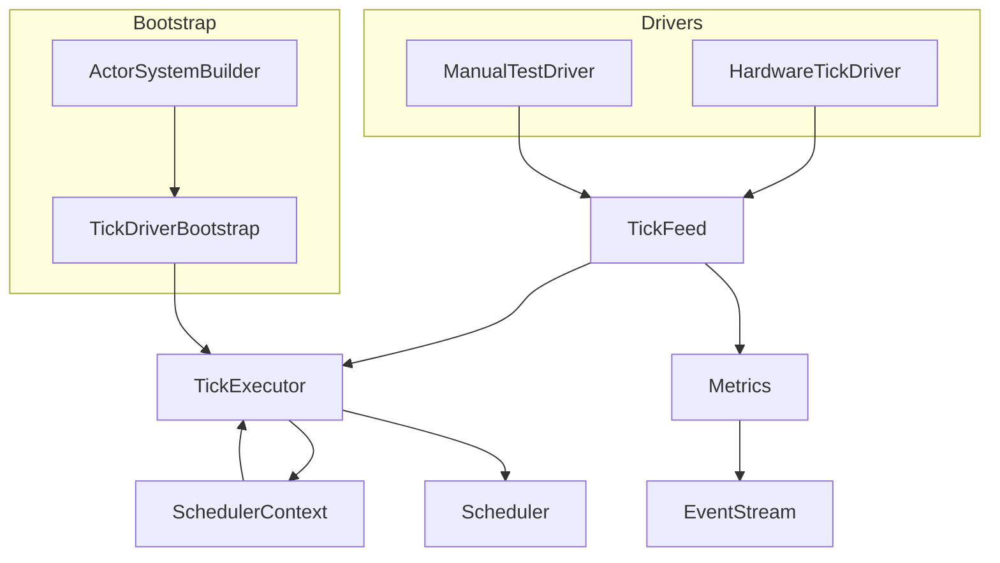
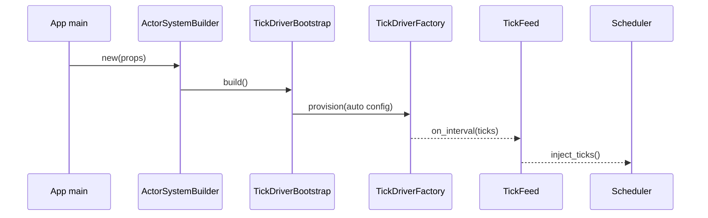
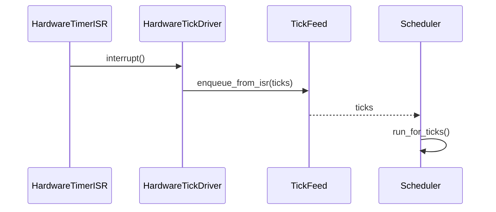
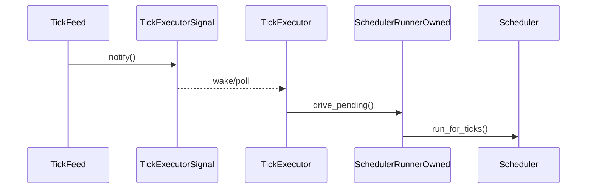

# Scheduler Tick Driver Integration Design

## Overview
本設計は、ActorSystem 初期化時に std/no_std を問わず決定論的な tick ストリームを供給する仕組みを導入し、Runner API をテスト専用に閉じ込めることでランタイム利用者の初期化負荷と誤設定リスクを排除する。ターゲット利用者は Tokió 等の std 実行環境を使うアプリケーション開発者と、embassy/SysTick を使う組込み開発者であり、両者が共通の Builder API を通じて Tick Driver を選択し、main 関数内の配線を 10〜15 行に収められる UX を提供する。これにより、現在の「SchedulerRunner::manual を main で回す」状態から脱却し、EventStream ベースのメトリクス監視と合わせて起動時の異常検知も容易になる。

### Goals
- no_std 環境で外部ハードウェアドライバが `TickDriver` trait を介して差し替え可能になる。
- Runner API を `#[cfg(test)]` と Builder 経由の構成チェックでテスト専用モードに封じ込める。
- Quickstart/テンプレートが `ActorSystemBuilder` を前提に 20 行未満で tick 設定を完了できるようにする。

### Non-Goals
- TimerWheel や SchedulerCore のアルゴリズム自体を変更しない。
- Network/Remoting 向けの tick 配送やクラスタ同期は対象外。
- ActorSystemConfig 以外の構成 API（例: RemotingConfig）の再設計は行わない。

## Architecture

### Existing Architecture Analysis
- `RuntimeToolbox::tick_source()` と `SchedulerTickHandle` が単純な手動 injest 用ハンドルしか提供しておらず、Tokio/embassy のタイマ API に接続する仕組みが存在しない (`modules/utils-core/src/runtime_toolbox.rs`, `modules/utils-std/src/runtime_toolbox/std_toolbox.rs`).
- `SchedulerContext::new()` は `TB::default()` を直接生成し、外部から driver を注入する拡張ポイントが無い (`modules/actor-core/src/scheduler/scheduler_context.rs`).
- `SchedulerRunner` は `pub` のまま manually tick を進める API を提供し、本番コードからも利用できてしまう (`modules/actor-core/src/scheduler/scheduler_runner.rs`).
- Quickstart/ガイドは dispatcher/guardian 構築のみを扱い、tick driver 配線や Builder 連携の情報がない。

### High-Level Architecture

- 既存パターン維持: RuntimeToolbox/SchedulerContext の抽象を崩さず、拡張ポイントを bootstrap 層に設ける。
- 技術整合: std 側は `tokio::time::interval` と `MissedTickBehavior::Delay` を用いてドリフトを抑制、no_std 側は embassy/SysTick の割り込みハンドラから軽量な enqueue を行う。【turn0search2】【turn0search1】
- Steering 準拠: 1 ファイル 1 型、no_std 本体に `cfg(feature="std")` を導入しない方針を守り、std 固有の driver 実装は `actor-std`/`utils-std` に置く。
- TickExecutor: TickFeed が tick を受信した瞬間に waker/notifier を起こし、`SchedulerRunnerOwned` を内包する TickExecutor が scheduler を駆動するため、Runner API はテスト用途の外面だけに限定される。
- レイヤ分離: `TickDriverConfig` や TickExecutor の抽象は actor-core(no_std) に留め、Tokio など std 依存の driver/executor 実装は actor-std クレートが `TickDriverFactory`/`StdExecutorHandle` として提供する。

### Technology Alignment
- Std: Tokió ランタイム向けの自動 driver/executor は actor-std クレート内で `tokio::time::interval` と `MissedTickBehavior::Delay` を用いて実装し、actor-core 側へは `TickDriverFactory`/`StdExecutorHandle` という no_std 抽象のみを渡す。【turn0search2】
- 組込み: embassy の time driver / SysTick は割り込みから `TickFeed` へ enqueue するだけの O(1) 処理とし、排他は `critical-section` で包む。Rust Embedded の割り込みベストプラクティスに従い ISR では副作用を減らし、実際の Scheduler 実行はメインコンテキストで行う。【turn0search1】【turn0search3】
- テスト: Manual driver は従来の `SchedulerRunner::manual` を内部的に利用しつつ `#[cfg(test)]` の Builder ハンドラ経由でのみ公開。
- 新規依存: 既存ワークスペース外の依存は追加しない。Tokio/embassy は既に workspace に含まれており、std 依存は actor-std へ隔離する。

### Key Design Decisions
1. **Decision**: `ActorSystemBuilder` + `TickDriverBootstrap` を導入
   - **Context**: main 関数が低レベル API で肥大化している。
   - **Alternatives**: a) 既存 `ActorSystem::new_with_config` に引数追加、b) Extension で後付け、c) Builder で前処理。
   - **Selected**: Builder で Props/TickDriver/Toolbox 等をチェーンし、`build()` 内で bootstrap。
   - **Rationale**: 起動前に失敗を検出しやすく、Quickstart との親和性が高い。
   - **Trade-offs**: 既存コードは Builder への移行が必要。
2. **Decision**: `TickDriver` trait + `TickFeed`
   - **Context**: std/no_std 両対応の driver 交換性が必要。
   - **Alternatives**: a) Toolbox に driver 実装を埋め込む、b) SchedulerContext に直接 trait を追加。
   - **Selected**: driver traitを独立させ、SchedulerContext とは feed で疎結合。
   - **Rationale**: Toolbox/ActorSystem の責務を肥大化させず、driver 追加も Builder 登録のみで完結。
   - **Trade-offs**: TickFeed の追加で間接層が増える。
   - **Context**: 本番でも `SchedulerRunner::manual` を呼べてしまう。
   - **Alternatives**: a) API 削除、b) feature flag、c) 起動モード検証。
3. **Decision**: TickExecutor で scheduler 実行を常駐化
   - **Context**: TickFeed が ticks を蓄積しても scheduler を回す常駐タスクが存在せず、自動供給要件 (R1.1) を満たせない。
   - **Alternatives**: a) ActorSystem の main loop で直接 `SchedulerRunner` を叩く、b) driver ごとに独自 executor を組み込む。
   - **Selected**: `SchedulerTickExecutor<TB>` を core に追加し、TickDriverBootstrap が feed/scheduler を束ねる executable を必ず起動。std では Tokio task、no_std では embassy executor/ポーリングフックを経由。
   - **Rationale**: Runner API をテスト用途に閉じたまま自動 tick を実現でき、driver 実装は tick 供給だけに専念できる。
   - **Trade-offs**: Executor 監視用の waker/notifier や JoinHandle 管理が必要になる。

## System Flows

### Flow 1: std 自動 Tick Driver


### Flow 2: no_std ハードウェア Tick Driver


### Flow 3: TickExecutor / Runner 連携


## Requirements Traceability
| Req | Summary | Components | Interfaces | Flows |
| --- | --- | --- | --- | --- |
| R1.1-1.5 | std 自動 tick 供給 | ActorSystemBuilder, TickDriverBootstrap, AutoTickDriver, TickFeed, SchedulerTickMetricsProbe | `ActorSystemBuilder::with_tick_driver`, `TickDriver::start`, `TickFeed::enqueue` | Flow 1 |
| R2.1-2.5 | no_std ドライバ抽象 | TickDriver trait, HardwareTickDriver, TickFeed, TickExecutor | `TickDriver::start`, `TickDriverConfig::hardware`, `TickFeed::enqueue_from_isr`, `TickExecutor::poll` | Flow 2/3 |
| R3.1-3.6 | Runner API テスト限定 | ManualTestDriver, TestOnlyDriverGate, Builder validation | `TickDriverConfig::manual`, `ActorSystemBuilder::with_manual_test_driver` (cfg) | Flow 1/2 構成パス |
| R4.1-4.7 | Quickstart & Builder | ActorSystemBuilder, TickExecutor, Quickstart Templates | `ActorSystemBuilder::with_tick_driver`, `TickExecutorBootstrap::spawn`, documentation artifacts | Flow 1/3 |

## Components and Interfaces

### Bootstrap Layer

#### ActorSystemBuilder<TB>
**Responsibility & Boundaries**
- Primary: Props/Config/TickDriver/Toolbox などの設定をチェーンし、`build()` で ActorSystem を構築。
- Domain: system bootstrap。
- Data Ownership: `BuilderState<TB>`（Props, TickDriverConfig, ToolboxRef, DiagnosticsOptions 等）。
- Transaction Boundary: `build()` 呼び出し中にのみ有効。

**Dependencies**
- Inbound: アプリケーションコード。
- Outbound: `TickDriverBootstrap`, `SystemStateGeneric`, `SchedulerContext`。
- External: なし。

**Contract**
```rust
pub struct ActorSystemBuilder<TB: RuntimeToolbox + Default> {
  state: BuilderState<TB>,
}
impl<TB: RuntimeToolbox + Default> ActorSystemBuilder<TB> {
  pub fn new(props: PropsGeneric<TB>) -> Self;
  pub fn with_tick_driver(mut self, cfg: TickDriverConfig<TB>) -> Self;
  pub fn with_toolbox(mut self, toolbox: TB) -> Self;
  pub fn build(self) -> Result<ActorSystemGeneric<TB>, TickDriverError>;
}
```
- Supporting types/API:
```rust
pub type TickDriverFactoryRef<TB> = ArcShared<dyn TickDriverFactory<TB>>;
pub type TickDriverAutoLocatorRef<TB> = ArcShared<dyn TickDriverAutoLocator<TB>>;

pub enum TickDriverConfig<TB: RuntimeToolbox> {
  Auto(AutoDriverConfig<TB>),
  Hardware { driver: &'static dyn TickPulseSource },
  #[cfg(any(test, feature = "test-support"))]
  ManualTest(ManualTestDriver<TB>),
}

impl<TB: RuntimeToolbox> TickDriverConfig<TB> {
  pub fn auto() -> Self {
    Self::Auto(AutoDriverConfig::new())
  }

  pub fn auto_with_factory(factory: TickDriverFactoryRef<TB>) -> Self {
    Self::Auto(AutoDriverConfig::new().with_factory(factory))
  }

  pub fn auto_with_locator(locator: TickDriverAutoLocatorRef<TB>) -> Self {
    Self::Auto(AutoDriverConfig::new().with_locator(locator))
  }

  pub fn hardware(driver: &'static dyn TickPulseSource) -> Self {
    Self::Hardware { driver }
  }

  #[cfg(any(test, feature = "test-support"))]
  pub fn manual(driver: ManualTestDriver<TB>) -> Self {
    Self::ManualTest(driver)
  }

  pub fn with_fallback(self, policy: FallbackPolicy) -> Self {
    match self {
      Self::Auto(cfg) => Self::Auto(cfg.with_fallback(policy)),
      other => other,
    }
  }

  pub fn with_metrics_mode(self, mode: TickMetricsMode) -> Self {
    match self {
      Self::Auto(cfg) => Self::Auto(cfg.with_metrics_mode(mode)),
      other => other,
    }
  }

  pub fn with_resolution(self, resolution: Duration) -> Self {
    match self {
      Self::Auto(cfg) => Self::Auto(cfg.with_resolution(resolution)),
      other => other,
    }
  }
}

pub struct AutoDriverConfig<TB: RuntimeToolbox> {
  factory: Option<TickDriverFactoryRef<TB>>,
  locator: TickDriverAutoLocatorRef<TB>,
  resolution: Option<Duration>,
  metrics: TickMetricsMode,
  fallback: FallbackPolicy,
}

impl<TB: RuntimeToolbox> AutoDriverConfig<TB> {
  pub fn new() -> Self {
    Self {
      factory: None,
      locator: TickDriverAutoLocator::default_ref(),
      resolution: None,
      metrics: TickMetricsMode::AutoPublish { interval: Duration::from_secs(1) },
      fallback: FallbackPolicy::Retry { attempts: 3, backoff: Duration::from_millis(50) },
    }
  }

  pub fn with_factory(mut self, factory: TickDriverFactoryRef<TB>) -> Self {
    self.factory = Some(factory);
    self
  }

  pub fn with_locator(mut self, locator: TickDriverAutoLocatorRef<TB>) -> Self {
    self.locator = locator;
    self
  }

  pub fn with_resolution(mut self, resolution: Duration) -> Self {
    self.resolution = Some(resolution);
    self
  }

  pub fn with_metrics_mode(mut self, mode: TickMetricsMode) -> Self {
    self.metrics = mode;
    self
  }

  pub fn with_fallback(mut self, policy: FallbackPolicy) -> Self {
    self.fallback = policy;
    self
  }

  pub fn into_inner(self) -> Self {
    self
  }
}

pub trait TickDriverAutoLocator<TB: RuntimeToolbox>: Send + Sync + 'static {
  fn detect(&self, toolbox: &TB) -> Result<TickDriverFactoryRef<TB>, TickDriverError>;
  fn default_ref() -> TickDriverAutoLocatorRef<TB>
  where
    Self: Sized;
}

/// Std 実装例（actor-std）: tokio ハンドルが取得できれば `TokioIntervalDriverFactory` を返す。no_std 実装例: embassy runtime が `TickPulseSource` を注入するファクトリを返す。

pub enum TickDriverKind {
  Auto,
  Hardware { source: HardwareKind },
  #[cfg(any(test, feature = "test-support"))]
  ManualTest,
}

impl<TB: RuntimeToolbox + Default> ActorSystemBuilder<TB> {
  pub fn with_tick_driver(mut self, cfg: TickDriverConfig<TB>) -> Self {
    self.state.tick_driver = Some(cfg);
    self
  }
}
```
- Preconditions: Props が有効、TickDriverConfig が選択済み。
- Postconditions: 正常時は driver が起動し、ActorSystem が返る。
- Integration: 既存 `ActorSystem::new` は `ActorSystemBuilder::new(...).build()?` に委譲。
- Metrics/Fallback: `TickDriverConfig` の builder で `with_metrics_mode(TickMetricsMode::AutoPublish { interval })`（既定: 1 秒）や `with_fallback(FallbackPolicy::Retry { attempts: 3, backoff: 50ms })` を設定可能。`with_tick_driver` 呼び出し時にこれらを固定し、Builder 側は追加の暗黙構成を行わない。

#### TickDriverBootstrap<TB>
- Primary: Builder から渡された構成を検証し、`TickDriver` 実装を起動/停止する。
- Contract:
```rust
pub struct TickDriverBootstrap;

impl TickDriverBootstrap {
  pub fn provision<TB: RuntimeToolbox>(
    cfg: &TickDriverConfig<TB>,
    ctx: &SchedulerContext<TB>,
  ) -> Result<TickDriverRuntime<TB>, TickDriverError>;

  pub fn shutdown(handle: TickDriverHandle);

  pub fn handle_driver_stop<TB: RuntimeToolbox>(
    handle: TickDriverHandle,
    policy: &FallbackPolicy,
    ctx: &SchedulerContext<TB>,
    feed: &TickFeed<TB>,
  ) -> Result<(), TickDriverError>;
}

pub struct TickDriverRuntime<TB: RuntimeToolbox> {
  pub driver: TickDriverHandle,
  pub executor: TickExecutorHandle<TB>,
}

pub enum TickExecutorHandle<TB: RuntimeToolbox> {
  Std(StdExecutorHandle), // actor-std 側で tokio::task::JoinHandle<()> を内包
  NoStd(TickExecutorPump<TB>),
}
```
- Preconditions: SchedulerContext が初期化済み。
- `StdExecutorHandle` は `actor-std` クレートに配置した newtype で、内部に `tokio::task::JoinHandle<()>` を保持しつつ、no_std 側から tokio 依存を漏らさない。
- Postconditions: 成功時は `TickDriverRuntime`（driver + executor handle）の両方を返し、失敗時は ActorSystem 起動を中止。
- `handle_driver_stop` は稼働中の driver から停止シグナル（panic/ISR disable/JoinHandle 終了など）が届いた際に呼ばれ、`shutdown` は ActorSystem 停止時に利用者が明示的に呼び出す。`FallbackPolicy::Retry` の場合は指定回数ぶん `TickDriver::start` を再実行し、その間 `TickFeed` を freeze して重複注入を防ぐ。全て失敗した場合や `FailFast` の場合は feed を drain して `TickDriverError::DriverStopped` を返し、上位でシステム終了へ遷移させる。

### Executor Layer

#### SchedulerTickExecutor<TB>
- Primary: TickFeed からの通知を受けて `SchedulerRunnerOwned<TB>` を駆動し、蓄積した tick を `Scheduler::run_for_ticks` で確実に消費する。
- State: `SchedulerRunnerOwned<TB>`（`SchedulerRunner<'static, TB>` の所有型）、`TickFeedHandle<TB>`, `TickExecutorSignal`, `ExecutorMetrics`（起動時刻/ポーリング遅延）。
- Contract:
```rust
pub struct SchedulerTickExecutor<TB: RuntimeToolbox + 'static> {
  runner: SchedulerRunnerOwned<TB>,
  feed: TickFeedHandle<TB>,
  signal: TickExecutorSignal,
}

impl<TB: RuntimeToolbox + 'static> SchedulerTickExecutor<TB> {
  pub fn new(
    scheduler: ArcShared<ToolboxMutex<Scheduler<TB>, TB>>,
    feed: TickFeedHandle<TB>,
    signal: TickExecutorSignal,
  ) -> Self;

  pub fn drive_pending(&mut self);
  pub fn handle_shutdown(&mut self) -> TaskRunSummary;
  pub fn signal(&self) -> TickExecutorSignal;
}
```
 - Lifecycle: TickDriverBootstrap が SchedulerContext から mutex を借用して executor を生成し、`TickDriverRuntime`（driver handle + executor join/pump handle）として ActorSystem に登録。ActorSystem 停止時は executor を確実に停止させてから driver を `shutdown`。

#### TickExecutorSignal
- Primary: TickFeed → executor の通知経路。`AtomicWaker`（std）と `critical-section` + `Cell<bool>`（no_std）をラップし、共通 API で wait/notify を提供。
- Contract:
```rust
pub struct TickExecutorSignal {
  state: ArcShared<TickExecutorSignalState>,
}

impl TickExecutorSignal {
  pub fn notify(&self);
  pub async fn wait_async(&self);
  pub fn arm(&self) -> bool; // no_std 用: true のとき pending
}
```
- Integration: `TickFeed::enqueue`/`enqueue_from_isr` の末尾で `signal.notify()` を呼び、ExecutorTask が待機から復帰する。no_std ポーリングでは `arm()` が true を返したときのみ `drive_pending()` を実行。

#### StdTickExecutorTask
- Primary: Tokio runtime 上で `SchedulerTickExecutor::drive_pending()` を常駐実行するバックグラウンドタスク。
- Contract:
```rust
async fn run(mut exec: SchedulerTickExecutor<StdToolbox>) {
  loop {
    exec.signal().wait_async().await;
    exec.drive_pending();
  }
}
```
- Failure Handling: ループ内 panic は `TickDriverBootstrap` が `JoinHandle` を監視し、`FallbackPolicy` に従って executor/task を再生成。driver stop と同じ経路で `TickDriverError::DriverStopped` を返す。

#### NoStdTickExecutorPump
- Primary: embassy/SysTick 環境で executor をポーリングする `#[embassy_executor::task]` または `fn tick_executor_poll()` を提供し、ISR からの通知で `drive_pending()` を呼ぶ。
- Contract:
```rust
pub struct TickExecutorPump<TB: RuntimeToolbox> {
  exec: SchedulerTickExecutor<TB>,
}

impl<TB: RuntimeToolbox> TickExecutorPump<TB> {
  pub fn run(mut self) -> ! {
    loop {
      if self.exec.signal().arm() {
        self.exec.drive_pending();
      }
      cortex_m::asm::wfe();
    }
  }
}
```
- Integration: `HardwareTickDriver` の ISR が `signal.notify()` を呼び、pump が WFE/embassy executor から復帰して scheduler を進行させる。これにより no_std でも tick → 実行が自動化される。

#### SchedulerRunnerOwned / Manual Runner API
- `SchedulerRunner<'a, TB>` は `pub(crate)` に格下げし、`SchedulerRunnerOwned` が executor 専用の所有型として利用。Runner API を直接呼べるのは `#[cfg(any(test, feature = "test-support"))]` の Manual driver 経路のみとし、prod ビルドからは排除する。
- Manual driver/Runner API はテスト専用 Builder (`with_manual_test_driver`) が `SchedulerRunnerOwned::manual_for_tests()` を経由して利用し、TickExecutor が生成されない構成フラグを明示する。

### Driver Layer

#### TickDriver<TB> Trait
- Primary: 任意のソースから tick を供給する共通契約。
- Contract:
```rust
pub trait TickDriver<TB: RuntimeToolbox>: Send + Sync + 'static {
  fn id(&self) -> TickDriverId;
  fn resolution(&self) -> Duration;
  fn kind(&self) -> TickDriverKind;
  fn start(&self, feed: TickFeedHandle<TB>) -> Result<TickDriverHandle, TickDriverError>;
  fn stop(&self, handle: TickDriverHandle);
}
```
- Invariants: `start` は複数回呼ばない、`stop` は handle に対応。`TickFeedHandle<TB>` は `Clone + Send + Sync + 'static` の共有ポインタ。

#### TickDriverFactory<TB>
- Primary: `TickDriverConfig::Auto` が保持する抽象ファクトリ。actor-core 側は factory の存在のみを知り、std 固有の実装詳細を依存させない。
- Contract:
```rust
pub trait TickDriverFactory<TB: RuntimeToolbox>: Send + Sync + 'static {
  fn kind(&self) -> TickDriverKind;
  fn resolution(&self) -> Duration;
  fn build(&self) -> Result<Box<dyn TickDriver<TB>>, TickDriverError>;
}
```
- Integration: Builder は `TickDriverConfig::auto()` もしくは `auto_with_factory(factory.clone())` を受け取り、Bootstrap が `factory.build()` で driver を生成して `TickDriver::start` を呼ぶ。std 実装（Tokio interval など）は actor-std クレートが factory を提供し、no_std/テストは自クレート内で同じ trait を実装する。

#### TickDriverAutoLocator<TB>
- Primary: `TickDriverConfig::auto()` が factory を明示指定しなくても適切な driver を選択できるようにする自動ディスパッチャ。
- Behavior:
  1. 標準実装（actor-std）は `tokio::runtime::Handle::try_current()` を試行し、成功すれば `TokioIntervalDriverFactory` を返す。Hande が取得できない場合は `TickDriverError::HandleUnavailable` を返して起動を中止。
  2. embassy/no_std 実装は `cfg` または初期化時に登録された `TickPulseSource` を参照し、`HardwareTickDriver` を包む factory を返す。
  3. 利用者は `AutoDriverConfig::with_factory(...)` を呼ぶことで locator をバイパスして任意の factory を直接指定できる。
- Error Handling: locator が factory を返せなかった場合は `TickDriverError::UnsupportedEnvironment` を返し、ActorSystem 起動をストップさせる。Quickstart では「Tokio runtime 以外では `StdTickDriverConfig::tokio_with_handle(...)` を明示する」ガイドラインを併記する。

#### Auto Mode Lifecycle (R1.1/R4.1)
- `ActorSystemBuilder::build()` は `TickDriverConfig::Auto` を検出した場合、(a) `factory` が指定されていればそれを使用、(b) 無指定の場合は locator で自動検出、(c) いずれも失敗した場合は `TickDriverError::UnsupportedEnvironment` を返す。
- 自動生成された driver は `AutoDriverConfig::with_resolution()` で指定した周期（未指定なら factory 既定値）に収束する。std では 10ms を既定にして ±5% ドリフト監視を TickFeed が実施、no_std ではハードウェアタイマの `resolution()` を採用する。
- `TickDriverConfig::auto()` 呼び出し側は Quickstart 文書のテンプレ（`TickDriverConfig::auto().with_resolution(...)`）をコピーするだけで R4.1 の「20 行以内」要件を満たす。ハンドル指定が必要な場合のみ `auto_with_factory(...)` を使用する。
- ActorSystem メタデータには `AutoDriverMetadata { profile: AutoProfileKind, driver_id, resolution }` を記録し、EventStream で publish することで「現在有効な tick 供給手段」を可視化（R3.6）する。

#### Locator Registration Mechanism
- `TickDriverAutoLocatorRegistry<TB>` を actor-core 側に追加し、`static REGISTRY: OnceCell<TickDriverAutoLocatorRef<TB>>` で保存する。`TickDriverAutoLocator::default_ref()` はこの registry を参照し、未登録の場合は `TickDriverError::UnsupportedEnvironment` を返す。
- actor-std は `pub fn register_std_auto_locator()` を提供し、Tokio runtime 初期化時（例: `ActorSystemBuilder::new_std()`）に呼ばれる。これにより `StdTokioAutoLocator` が registry に登録され、`TickDriverConfig::auto()` が即利用可能になる。
- no_std / embassy 向けには `EmbassyAutoLocator::register()` を `modules/utils-core` から呼び出し、ボード固有ドライバを `TickPulseSource` 経由で提供する。
- テストや高度なカスタマイズでは `TickDriverConfig::auto_with_locator(locator)` で registry をバイパスできる。Quickstart ではユーザの介入なしで std locator が登録済みである前提を示し、R1.1 の「構成だけで自動 tick」を保証する。

#### StdAutoTickDriver (actor-std)
- Primary: Tokió runtime で `tokio::time::interval` + `MissedTickBehavior::Delay` を専用タスクで実行し、tick を `TickFeedHandle` へ連続供給する driver 実装。型定義は actor-std クレートに置かれ、actor-core 側は `TickDriverFactory` 経由で trait object として受け取る。【turn0search2】
- Contract (actor-std 内部):
```rust
pub struct AutoTickDriver {
  handle: tokio::runtime::Handle,
  resolution: Duration,
}

impl AutoTickDriver {
  pub fn new(handle: tokio::runtime::Handle, resolution: Duration) -> Self;
}

impl TickDriver<StdToolbox> for AutoTickDriver { /* ... */ }
```
- Error: ハンドル未注入またはタスク spawn 失敗時は `TickDriverError::{HandleUnavailable, SpawnFailed}`。

#### HardwareTickDriver / TickPulseSource 実装
- Primary: no_std / 組込み環境でハードウェアタイマ ISR から tick を転送する。
- Contract:
```rust
pub struct HardwareTickDriver<P: TickPulseSource> {
  pulse: P,
  resolution: Duration,
}

impl<P: TickPulseSource> HardwareTickDriver<P> {
  pub const fn new(pulse: P, resolution: Duration) -> Self;
}

impl<P: TickPulseSource> TickPulseSource for HardwareTickDriver<P> {
  fn enable(&self) -> Result<(), TickDriverError> { /* configure ISR */ }
  fn disable(&self) { /* disable timer */ }
  fn set_callback(&self, handler: TickPulseHandler) { /* register ISR hook with ctx */ }
  fn resolution(&self) -> Duration { self.resolution }
}
```
- Behavior: `TickDriverConfig::hardware(&DRIVER)` で `&'static dyn TickPulseSource` を渡すと、`TickDriverBootstrap` が内部 `HardwareDriverAdapter` を生成して `TickDriver` として起動する。`set_callback` へ渡す `TickPulseHandler` の `ctx` には `TickFeedHandle` の生ポインタを格納し、ISR 内で `unsafe { (handler.func)(handler.ctx) }` を呼んで `feed.enqueue_from_isr(ticks)` を実行する。停止時は `disable()` を実行し、再起動時に `set_callback` を再登録する。

#### ManualTestDriver
- Visibility: `#[cfg(test)]` + `feature = "test-support"` のみ公開。

### Std Driver Extensions (actor-std)

#### StdTickDriverConfig
- Location: `modules/actor-std/src/tick/`。actor-core から切り離された拡張設定で、Tokio など std ランタイム向けの `TickDriverFactoryRef` を生成する。
- Contract:
```rust
pub struct StdTickDriverConfig;

impl StdTickDriverConfig {
  pub fn tokio_auto(resolution: Duration) -> TickDriverFactoryRef<StdToolbox>;
  pub fn tokio_with_handle(handle: tokio::runtime::Handle, resolution: Duration) -> TickDriverFactoryRef<StdToolbox>;
}
```
- Behavior: API は `TickDriverFactoryRef` を返すのみで、actor-core に tokio 型を露出させない。ハンドル取得は `tokio::runtime::Handle::try_current()` を内部で行い、明示指定も `tokio_*` 系関数内に閉じ込める。

#### TokioIntervalDriverFactory
- Primary: `TickDriverFactory<StdToolbox>` を実装し、`tokio::time::interval` + `MissedTickBehavior::Delay` を利用して tick を供給する driver を生成する。【turn0search2】
- Contract:
```rust
pub struct TokioIntervalDriverFactory {
  handle: tokio::runtime::Handle,
  resolution: Duration,
}

impl TickDriverFactory<StdToolbox> for TokioIntervalDriverFactory { /* ... */ }
```
- Ownership: 生成された `Box<dyn TickDriver<_>>` は actor-std 内部の `StdAutoTickDriver` に wrap され、`TickDriverBootstrap` へは trait object のみ渡される。

#### StdExecutorHandle
- Primary: actor-std が Tokio `JoinHandle<()>` を newtype で包み、actor-core に生の tokio 型を渡さない。
- Contract:
```rust
pub struct StdExecutorHandle {
  join: tokio::task::JoinHandle<()>,
}

impl StdExecutorHandle {
  pub fn new(join: tokio::task::JoinHandle<()>) -> Self;
  pub async fn shutdown(self);
}
```
- Integration: `TickExecutorHandle::Std` variant がこの newtype を保持し、Bootstrap が `StdExecutorHandle::shutdown()` を通じて await する。

### Scheduler Integration & Instrumentation

#### TickFeed<TB>
- Primary: 単一 driver からの tick を `SchedulerTickHandle` へ橋渡し。
- State: `ArcShared<TickFeed<TB>>` + lock-free `ArrayQueue<u32>`（容量は `SchedulerCapacityProfile::tick_buffer_quota()` に追従）で FIFO を保証。`TickFeedHandle<TB> = ArcShared<TickFeed<TB>>` は `Clone + Send + Sync + 'static` で、Tokio タスクや ISR が所有できる。`enqueue` は host driver から、`enqueue_from_isr` は `critical-section` で包んで ISR から呼ぶ。キュー飽和時は新しい tick を破棄し、`SchedulerTickMetrics` の dropped カウンタを increment して背圧を可視化する。
- Responsibilities:
  1. **バッファ & フロー制御** — driver と Scheduler の速度差を吸収し、`handle.inject_manual_ticks` を平準化。
  2. **メトリクス集約** — enqueue/dequeue ごとに tick 数・ドロップ数・ドリフト計測データを集約し、`SchedulerTickMetricsProbe` から `snapshot()` 可能にする。
  3. **API 正規化** — Driver 側は `TickFeedHandle` だけ、Scheduler 側は `TickFeed` と `SchedulerTickHandleOwned` だけを扱うことで結合度を下げる。
  4. **Executor 通知** — `TickExecutorSignal` を内部に保持し、tick 受信のたびに `notify()` を呼ぶことで `SchedulerTickExecutor` の待機を解除する。ISR からも `critical-section` 内で安全に通知できる。
- Auto Publish: `TickMetricsMode::AutoPublish` が選択されると、TickFeed は `SchedulerTickMetricsEmitter` に時計シグナルを渡し、interval ごとに `SchedulerTickMetrics` を計測して EventStream へ push する。`OnDemand` の場合は emitter を起動せず snapshot 時のみ publish。
- Ownership: `TickDriverBootstrap` が `TickFeed` を生成して `Arc` で包み、SchedulerContext/Driver/Executor へ `TickFeedHandle` と `TickExecutorSignal` を配布する。Driver 側はハンドルをクローンして enqueue し、Executor 側は `feed.signal()` を通じて notifier を受け取る。
- Contract:
```rust
pub struct TickFeed<TB> {
  state: ArcShared<TickState>,
  handle: SchedulerTickHandleOwned<TB>,
  clock: TB::Clock, // RuntimeToolbox が提供する単調クロック
  queue: ArrayQueue<u32>,
  signal: TickExecutorSignal,
}

pub type TickFeedHandle<TB> = ArcShared<TickFeed<TB>>;

impl<TB> TickFeed<TB> {
  pub fn enqueue(&self, ticks: u32);
  pub fn enqueue_from_isr(&self, ticks: u32);
  pub fn signal(&self) -> TickExecutorSignal;
  pub fn metadata(&self) -> TickDriverMetadata;
}
```
- Ordering: `TickFeed` が受け取った ticks をキューへ push し、Scheduler 側が順番に `handle.inject_manual_ticks` を呼ぶことで `SchedulerRunner` と同等の挙動を保つ。

#### SchedulerTickMetricsProbe & Emitter
- Probe Primary: `TickFeed` が保持する統計情報を利用者が任意のタイミングで取得し、`snapshot()` で `SchedulerTickMetrics` を返す。`ActorSystemBuilder::enable_tick_metrics()` を呼んだ場合のみ生成。
- Emitter Primary: `TickMetricsMode::AutoPublish { interval }` の場合にバックグラウンドで `snapshot()` を呼び、`EventStreamEvent::SchedulerTick` を定期 publish。Std では `tokio::time::interval`、no_std では `TickFeed` の clock + `TickPulseSource` を利用した軽量タイマを使用。


### Documentation Assets

#### Quickstart Templates
- Primary: `docs/guides/actor-system.md` と新規 `docs/guides/tick-driver-quickstart.md` へ Builder ベースのテンプレを追加。
- Dependencies: `ActorSystemBuilder` API, driver 名称表。
- Contract: Markdown テンプレ（Tokio/embassy/test）。Implementation では docs update issue を必須タスクに含める。

##### Driver 選択マトリクス（R4.4）

| ターゲット | サンプルコード | 解説 | デフォルト解像度 | メトリクス | 備考 |
| --- | --- | --- | --- | --- | --- |
| std (Tokio) | `builder.with_tick_driver(TickDriverConfig::auto().with_resolution(Duration::from_millis(10)));` | locator が `TokioIntervalDriverFactory` を自動検出。必要に応じ `StdTickDriverConfig::tokio_with_handle(..)` を `auto_with_factory` へ渡して上書き可能 | 10ms | AutoPublish(1s) | R1.1/R4.1 を満たす最短経路 |
| no_std (embassy SysTick) | `TickDriverConfig::hardware(&EMBASSY_DRIVER)` | ハードウェアドライバを直接渡し TickExecutorPump で駆動 | タイマー依存 | AutoPublish(1s) | R2.x |
| Manual test | `TickDriverConfig::manual(ManualTestDriver::new())` | `#[cfg(test)]` 下のみコンパイル。TickExecutor は生成されず Runner API で制御 | N/A | OnDemand | R3.x |

各行は Quickstart ドキュメント内で 1画面に収まる表として掲載し、主要 builder 呼び出しと要件との紐付け（R1.1/R2.x/R3.x/R4.x）を脚注で示す。

##### Main テンプレート（std/Tokio）
```rust
#[tokio::main(flavor = "multi_thread")]
async fn main() -> anyhow::Result<()> {
  let system = ActorSystemBuilder::new(Props::from_fn(|| GuardianActor))
    .with_tick_driver(
      TickDriverConfig::auto()
        .with_resolution(Duration::from_millis(10)),
    )
    .with_toolbox(StdToolbox::default())
    .build()?;

  let termination = system.when_terminated();
  system.user_guardian_ref().tell(AnyMessage::new(Start))?;
  tokio::time::sleep(Duration::from_millis(200)).await;
  system.terminate()?;
  termination.listener().await;
  Ok(())
}
```

> **補足**: Tokio ハンドルを明示指定したい場合は `fraktor_actor_std_rs::tick::StdTickDriverConfig::tokio_with_handle(...)` を呼び、`TickDriverConfig::auto_with_factory(...)` に渡す。Quickstart では locator 登録により `TickDriverConfig::auto()` だけで要件 R1.1/R4.1 を満たす。

##### Main テンプレート（no_std / embassy）
```rust
#[entry]
fn main() -> ! {
  static DRIVER: HardwareTickDriver<SysTick> = HardwareTickDriver::new(SysTick::new(core_clock_hz()), Duration::from_micros(10));
  let system = ActorSystemBuilder::<NoStdToolbox>::new(Props::from_fn(|| GuardianActor))
    .with_tick_driver(TickDriverConfig::hardware(&DRIVER))
    .build()
    .expect("system");

  system.user_guardian_ref().tell(AnyMessage::new(Start)).unwrap();
  loop {
    embassy_executor::run_until_idle();
  }
}
```

## Data Models
- **TickDriverConfig<TB>**: `enum TickDriverConfig<TB> { Auto(AutoDriverConfig<TB>), Hardware { driver: &'static dyn TickPulseSource }, #[cfg(any(test, feature = "test-support"))] ManualTest(ManualTestDriver<TB>) }`。no_std な actor-core では auto 設定用の `AutoDriverConfig` とハードウェア/テストドライバのみを扱う。
- **AutoDriverConfig<TB>**: `struct AutoDriverConfig<TB> { factory: Option<TickDriverFactoryRef<TB>>, locator: TickDriverAutoLocatorRef<TB>, resolution: Option<Duration>, metrics: TickMetricsMode }`。`TickDriverConfig::auto()` が返し、`.with_factory()/.with_locator()/.with_resolution()` で細部を調整。
- **TickDriverAutoLocator<TB>**: `trait TickDriverAutoLocator<TB> { fn detect(&self, toolbox: &TB) -> Result<TickDriverFactoryRef<TB>, TickDriverError>; }`。std 実装は Tokio ハンドルを探知し、no_std 実装は embassy/SysTick を参照する。
- **TickDriverFactoryRef<TB>**: `type TickDriverFactoryRef<TB> = ArcShared<dyn TickDriverFactory<TB>>`。std/embassy など環境別 factory を参照カウントで共有する。
- **TickDriverFactory<TB>**: `trait TickDriverFactory<TB> { fn kind(&self) -> TickDriverKind; fn resolution(&self) -> Duration; fn build(&self) -> Result<Box<dyn TickDriver<TB>>, TickDriverError>; }`。actor-core が受け取る唯一の auto driver エントリポイント。
- **TickDriverKind**: `Auto`, `Hardware { source: HardwareKind }`, `ManualTest`。`SchedulerTickMetrics` や EventStream で使用。
- **TickPulseSource**: `pub trait TickPulseSource: Send + Sync { fn enable(&self) -> Result<(), TickDriverError>; fn disable(&self); fn set_callback(&self, handler: TickPulseHandler); fn resolution(&self) -> Duration; }`。
- **TickPulseHandler**: `pub struct TickPulseHandler { pub func: unsafe extern "C" fn(*mut core::ffi::c_void), pub ctx: *mut core::ffi::c_void }`。`TickDriverBootstrap` が `TickFeedHandle` の生ポインタを `ctx` に埋め込み、`func` 内で `feed.enqueue_from_isr(1)` を呼び出す。
- **TickState**: `struct TickState { enqueued_total: AtomicU64, dropped_total: AtomicU64, last_enqueue_ticks: AtomicU64, last_snapshot_time: AtomicU64 }`。`TickFeed` 内部で統計トラッキングに使用。
- **SchedulerTickHandleOwned<TB>**: 既存 `SchedulerContext` が保持する `SchedulerTickHandle<'static>` を所有型に包んだもの。TickFeed が `handle.inject_manual_ticks` を呼ぶために利用。
- **TickFeedHandle<TB>**: `type TickFeedHandle<TB> = ArcShared<TickFeed<TB>>`。Driver と SchedulerContext 両方に共有される feed ハンドル。
- **TickDriverError**: `SpawnFailed`, `HandleUnavailable`, `UnsupportedEnvironment`, `DriftExceeded`, `DriverStopped`。Builder/Bootstrap/Drivers 間の共通 error。
- **TickDriverMetadata**: `{ driver_id: TickDriverId, start_instant: TimerInstant, ticks_total: u64 }`。EventStream 出力や診断で使用。
- **AutoDriverMetadata**: `{ profile: AutoProfileKind, driver_id: TickDriverId, resolution: Duration }`。Auto モードで選択された driver の種別と設定を `EventStreamEvent::SchedulerTick` に含め、R3.6 の構成メタデータ要件を満たす。
- **SchedulerTickExecutor<TB>**: `struct SchedulerTickExecutor<TB> { runner: SchedulerRunnerOwned<TB>, feed: TickFeedHandle<TB>, signal: TickExecutorSignal }`。`drive_pending()` が feed から ticks を drain し、`Scheduler::run_for_ticks` を呼ぶ。
- **TickExecutorSignal**: `pub struct TickExecutorSignal { state: ArcShared<TickExecutorSignalState> }`。`notify()/wait_async()/arm()` を提供し、std/no_std 双方で executor を起こす。
- **TickExecutorRuntime**: `struct TickExecutorRuntime<TB> { driver: TickDriverHandle, executor: TickExecutorHandle<TB> }`。Builder が保持し、停止時に driver → executor の順番でクリーンアップする。
- **TickExecutorHandle<TB>**: `enum TickExecutorHandle<TB> { Std(StdExecutorHandle), NoStd(TickExecutorPump<TB>) }`。環境ごとの executor を抽象化し、監視/停止処理を共通化する。
- **StdExecutorHandle**: actor-std が実装する newtype (`struct StdExecutorHandle { join: tokio::task::JoinHandle<()> }`)。core へ tokio 依存を露出させず JoinHandle を保持する。
- **StdTickDriverConfig**: actor-std の補助 API。`StdTickDriverConfig::tokio_auto(resolution)` 等で `TickDriverFactoryRef<StdToolbox>` を返し、std 依存を actor-core へ持ち込まない。
- **TokioIntervalDriverFactory**: actor-std 実装の `TickDriverFactory<StdToolbox>`。`tokio::time::interval` を内部で初期化し、`StdAutoTickDriver` を返す。
- **SchedulerRunnerOwned<TB>**: `struct SchedulerRunnerOwned<TB> { tick_handle: SchedulerTickHandleOwned<TB>, tick_lease: TickLease<'static> }`。executor 内部でのみ利用し、テスト用には `#[cfg(any(test, feature = "test-support"))]` の `manual_for_tests()` を公開。
- **FallbackPolicy**: `enum FallbackPolicy { Retry { attempts: u8, backoff: Duration }, FailFast }`。`TickDriverConfig` で選択（既定は `Retry { attempts: 3, backoff: Duration::from_millis(50) }`）。
- **TickMetricsMode**: `enum TickMetricsMode { AutoPublish { interval: Duration }, OnDemand }`。既定は `AutoPublish { interval: Duration::from_secs(1) }`。
- **SchedulerTickMetrics**: `pub struct SchedulerTickMetrics { pub driver: TickDriverKind, pub ticks_per_sec: u32, pub drift: Option<Duration>, pub enqueued_total: u64, pub dropped_total: u64, pub timestamp: Duration }`。
- **SchedulerTickMetricsProbe**: `pub struct SchedulerTickMetricsProbe<TB> { feed: TickFeedHandle<TB>, mode: TickMetricsMode }` + `impl<TB> SchedulerTickMetricsProbe<TB> { pub fn snapshot(&self) -> SchedulerTickMetrics; }`。`TickMetricsMode::AutoPublish` の場合は内部で `SchedulerTickMetricsEmitter` を spawn し、指定 interval ごとに EventStream へ自動 publish。`OnDemand` の場合は `snapshot()` を呼んだときのみ publish。
- **SchedulerCapacityProfile::tick_buffer_quota()**: TickFeed が確保すべきバッファ長を返す新メソッド。既存の capacity profile へ追加し、ターゲットプラットフォーム別にメモリ上限を計算する。
- **EventStreamEvent::SchedulerTick**: `EventStream` に `SchedulerTickMetrics` を載せて publish する新イベント。

## Error Handling
### Error Strategy
- Driver 起動時: `TickDriverBootstrap` が `TickDriverError` を返し、ActorSystem 構築を即座に中止。
- 実行中: `TickFeed` がドリフトを検出したら `SchedulerTickMetrics` に `drift` をセットし、±5% 超過時は `EventStream` に Warning。

### Error Categories and Responses
- **User Errors**: Builder 未構成 (`with_tick_driver` 未呼び) → `TickDriverError::UnsupportedEnvironment` を返す。
- **System Errors**: Tokio タスク spawn 失敗 → `SpawnFailed`。割り込み停止 → `DriverStopped`。

### Monitoring
- Driver failure は `EventStreamEvent::Log(LogEvent::Error)` として通知。Tokio タスク panics は `JoinHandle::abort` で検知し、Builder が再起動ポリシーを log。
- `TickMetricsMode::AutoPublish { interval }` が選択されている場合、`SchedulerTickMetricsEmitter` がバックグラウンドタスクを spawn し、1 秒既定で `EventStreamEvent::SchedulerTick` を自動配信する。`OnDemand` の場合は `SchedulerTickMetricsProbe::snapshot()` 呼び出しや `system.tick_metrics().publish()` を契機に単発 publish。

## Testing Strategy
- **Unit**: (1) `TickDriverConfig`/`AutoDriverConfig` のバリデーション、(2) `TickDriverAutoLocator` 標準実装が Tokio/embassy で正しく factory を検出し、失敗時に `UnsupportedEnvironment` を返す、(3) `AutoDriverConfig::with_factory/with_locator/with_resolution` が設定値を保持する、(4) `TickFeed::enqueue` の順序保証、(5) `cfg(any(test, feature = "test-support"))` ブロックが prod から ManualTestDriver API を排除できているかのコンパイルテスト、(6) `SchedulerTickMetricsProbe::snapshot` の計測ロジック、(7) Manual driver の `inject` が feed と同数の ticks を供給すること、(8) `TickExecutorSignal` の `notify()/wait_async()/arm()` が std/no_std いずれでもデッドロックなく機能すること、(9) `SchedulerTickExecutor::drive_pending()` が feed の ticks を消費し scheduler を前進させること。
- **Integration**: (1) `ActorSystemBuilder` 経由で `TickDriverConfig::auto()` + StdTickExecutorTask を起動し scheduler が自動進行する（Tokio ハンドル自動検出、R1.1）、(2) embassy SysTick + Hardware driver + TickExecutorPump 間の ISR/通知経路、(3) `TickDriverConfig::auto_with_factory` を明示指定した場合に locator が呼ばれないこと、(4) driver または executor 停止時に `FallbackPolicy::Retry` と `FailFast` を切り替えて期待どおりに挙動する、(5) EventStream で tick メトリクス + `AutoDriverMetadata` が自動 publish される、(6) Runner/ManualTestDriver API が `cfg(any(test, feature = "test-support"))` 下でのみ利用可能であること。
- **E2E/Examples**: Quickstart テンプレに沿った Tokio/no_std/test サンプルを examples ディレクトリに追加。
- **Performance**: (1) Auto mode での ticks/s ±5% 判定、(2) `TickDriverAutoLocator` が factory を切り替える際のオーバーヘッド測定、(3) ISR enqueue + TickExecutorPump の遅延測定、(4) TickFeed バッファ飽和時の挙動と dropped カウンタの検証、(5) TickExecutorTask の wake-up 遅延（tokio/embassy 双方）を測定。

### TestOnlyDriverGate (cfg guard)
- Mechanism: `TickDriverConfig::ManualTest` と `ActorSystemBuilder::with_manual_test_driver` は `#[cfg(any(test, feature = "test-support"))]` でのみコンパイルされ、prod ビルドから完全に排除される。
- Outcome: 要件 R3.1-R3.4 に従い、テスト以外で Runner API/Manual driver を使用するとコンパイルエラーとなる。必要なケースでは `feature = "test-support"` を有効にして builder を再エクスポートし、テストコード内でのみ利用する。

## Performance & Scalability
- Std driver は Tokió runtime とは別のタスクで interval を駆動し、`spawn_blocking` ではなく通常タスク + `Handle::current()` を使うことでマルチスレッド scheduler と分離する。
- Hardware driver は `critical-section` を用いた lock-free enqueue で ISR 時間を最小化。TickFeed バッファサイズは `SchedulerCapacityProfile` に合わせて自動計算し、溢れた場合は `dropped_total` に記録。

## Migration Strategy
1. **Phase 0 → Phase 1（Builder 導入）**: 既存の `ActorSystem::new*` と examples を `ActorSystemBuilder::new(...).with_tick_driver(...).build()` に内部委譲させる。外部 API はそのままのため、既存ユーザは変更不要。
2. **Phase 1 → Phase 2（Driver 実装差し替え）**: actor-core 側では `TickDriverFactory` 抽象と Hardware/Manual driver を整備し、actor-std では `StdTickDriverConfig` + `TokioIntervalDriverFactory` を提供して `TickDriverConfig::auto` へ注入。Runner API は `cfg(any(test, feature = "test-support"))` でのみ公開し、docs に移行ガイドを追加。
3. **Phase 2 → Phase 3（ドキュメント更新・旧 API の整理）**: Quickstart・examples・ガイドを Builder ベースに統一し、旧 `SchedulerRunner::manual` 直呼びの記述を削除。次期メジャーで `ActorSystem::new_manual_runner` など不要 API を deprecate。
