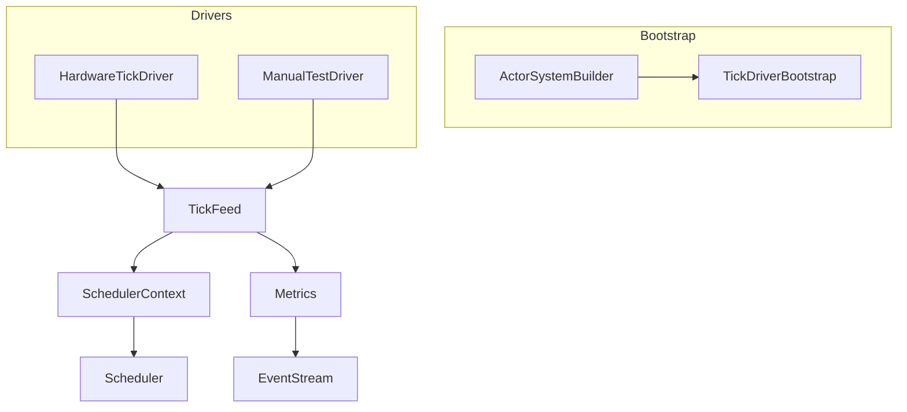
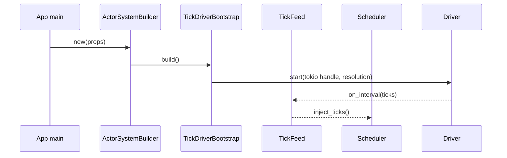
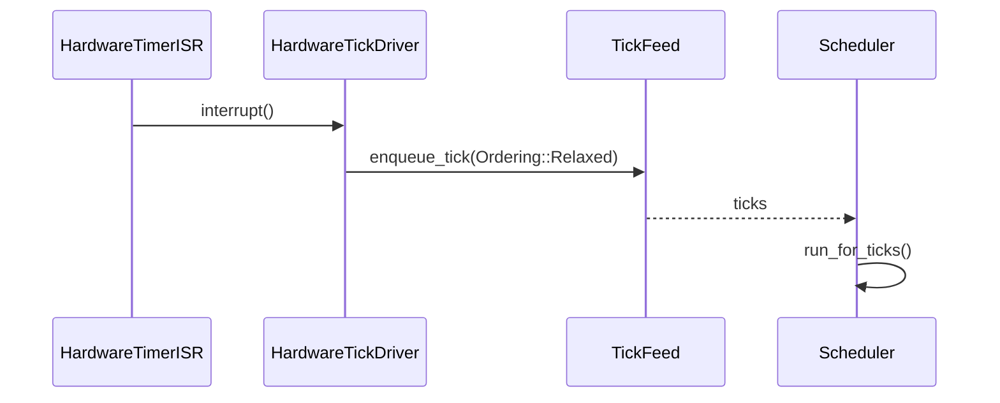

# Scheduler Tick Driver Integration Design

## Overview
本設計は、ActorSystem 初期化時に std/no_std を問わず決定論的な tick ストリームを供給する仕組みを導入し、Runner API をテスト専用に閉じ込めることでランタイム利用者の初期化負荷と誤設定リスクを排除する。ターゲット利用者は Tokió 等の std 実行環境を使うアプリケーション開発者と、embassy/SysTick を使う組込み開発者であり、両者が共通の Builder API を通じて Tick Driver を選択し、main 関数内の配線を 10〜15 行に収められる UX を提供する。これにより、現在の「SchedulerRunner::manual を main で回す」状態から脱却し、EventStream ベースのメトリクス監視と合わせて起動時の異常検知も容易になる。

### Goals
- no_std 環境で外部ハードウェアドライバが `TickDriver` trait を介して差し替え可能になる。
- Runner API を `#[cfg(test)]` と Builder 経由の構成チェックでテスト専用モードに封じ込める。
- Quickstart/テンプレートが `ActorSystemBuilder` を前提に 20 行未満で tick 設定を完了できるようにする。

### Non-Goals
- TimerWheel や SchedulerCore のアルゴリズム自体を変更しない。
- Network/Remoting 向けの tick 配送やクラスタ同期は対象外。
- ActorSystemConfig 以外の構成 API（例: RemotingConfig）の再設計は行わない。

## Architecture

### Existing Architecture Analysis
- `RuntimeToolbox::tick_source()` と `SchedulerTickHandle` が単純な手動 injest 用ハンドルしか提供しておらず、Tokio/embassy のタイマ API に接続する仕組みが存在しない (`modules/utils-core/src/runtime_toolbox.rs`, `modules/utils-std/src/runtime_toolbox/std_toolbox.rs`).
- `SchedulerContext::new()` は `TB::default()` を直接生成し、外部から driver を注入する拡張ポイントが無い (`modules/actor-core/src/scheduler/scheduler_context.rs`).
- `SchedulerRunner` は `pub` のまま manually tick を進める API を提供し、本番コードからも利用できてしまう (`modules/actor-core/src/scheduler/scheduler_runner.rs`).
- Quickstart/ガイドは dispatcher/guardian 構築のみを扱い、tick driver 配線や Builder 連携の情報がない。

### High-Level Architecture

- 既存パターン維持: RuntimeToolbox/SchedulerContext の抽象を崩さず、拡張ポイントを bootstrap 層に設ける。
- 技術整合: std 側は `tokio::time::interval` と `MissedTickBehavior::Delay` を用いてドリフトを抑制、no_std 側は embassy/SysTick の割り込みハンドラから軽量な enqueue を行う。【turn0search2】【turn0search1】
- Steering 準拠: 1 ファイル 1 型、no_std 本体に `cfg(feature="std")` を導入しない方針を守り、std 固有の driver 実装は `actor-std`/`utils-std` に置く。

### Technology Alignment
- Std: Tokió ランタイム上で tick 精度を保つため `tokio::time::interval` を専用タスクで駆動し、MissedTickBehavior を Delay に設定して catch-up の連射を防ぐ。【turn0search2】
- 組込み: embassy の time driver / SysTick は割り込みから `TickFeed` へ enqueue するだけの O(1) 処理とし、排他は `critical-section` で包む。Rust Embedded の割り込みベストプラクティスに従い ISR では副作用を減らし、実際の Scheduler 実行はメインコンテキストで行う。【turn0search1】【turn0search3】
- テスト: Manual driver は従来の `SchedulerRunner::manual` を内部的に利用しつつ `#[cfg(test)]` の Builder ハンドラ経由でのみ公開。
- 新規依存: 既存ワークスペース外の依存は追加しない。Tokio/embassy は既に workspace に含まれている。

### Key Design Decisions
1. **Decision**: `ActorSystemBuilder` + `TickDriverBootstrap` を導入
   - **Context**: main 関数が低レベル API で肥大化している。
   - **Alternatives**: a) 既存 `ActorSystem::new_with_config` に引数追加、b) Extension で後付け、c) Builder で前処理。
   - **Selected**: Builder で Props/TickDriver/Toolbox 等をチェーンし、`build()` 内で bootstrap。
   - **Rationale**: 起動前に失敗を検出しやすく、Quickstart との親和性が高い。
   - **Trade-offs**: 既存コードは Builder への移行が必要。
2. **Decision**: `TickDriver` trait + `TickFeed`
   - **Context**: std/no_std 両対応の driver 交換性が必要。
   - **Alternatives**: a) Toolbox に driver 実装を埋め込む、b) SchedulerContext に直接 trait を追加。
   - **Selected**: driver traitを独立させ、SchedulerContext とは feed で疎結合。
   - **Rationale**: Toolbox/ActorSystem の責務を肥大化させず、driver 追加も Builder 登録のみで完結。
   - **Trade-offs**: TickFeed の追加で間接層が増える。
   - **Context**: 本番でも `SchedulerRunner::manual` を呼べてしまう。
   - **Alternatives**: a) API 削除、b) feature flag、c) 起動モード検証。

## System Flows

### Flow 1: std 自動 Tick Driver


### Flow 2: no_std ハードウェア Tick Driver


## Requirements Traceability
| Req | Summary | Components | Interfaces | Flows |
| --- | --- | --- | --- | --- |
| R4.1-4.7 | Quickstart & Builder | ActorSystemBuilder, Quickstart Templates | `ActorSystemBuilder::template_tokio()`, documentation artifacts | n/a |

## Components and Interfaces

### Bootstrap Layer

#### ActorSystemBuilder<TB>
**Responsibility & Boundaries**
- Primary: Props/Config/TickDriver/Toolbox などの設定をチェーンし、`build()` で ActorSystem を構築。
- Domain: system bootstrap。
- Data Ownership: `BuilderState<TB>`（Props, TickDriverConfig, ToolboxRef, DiagnosticsOptions 等）。
- Transaction Boundary: `build()` 呼び出し中にのみ有効。

**Dependencies**
- Inbound: アプリケーションコード。
- Outbound: `TickDriverBootstrap`, `SystemStateGeneric`, `SchedulerContext`。
- External: なし。

**Contract**
```rust
pub struct ActorSystemBuilder<TB: RuntimeToolbox + Default> {
  state: BuilderState<TB>,
}
impl<TB: RuntimeToolbox + Default> ActorSystemBuilder<TB> {
  pub fn new(props: PropsGeneric<TB>) -> Self;
  pub fn with_tick_driver(mut self, cfg: TickDriverConfig<TB>) -> Self;
  pub fn with_toolbox(mut self, toolbox: TB) -> Self;
  pub fn build(self) -> Result<ActorSystemGeneric<TB>, TickDriverError>;
}
```
- Preconditions: Props が有効、TickDriverConfig が選択済み。
- Postconditions: 正常時は driver が起動し、ActorSystem が返る。
- Integration: 既存 `ActorSystem::new` は `ActorSystemBuilder::new(...).build()?` に委譲。

#### TickDriverBootstrap<TB>
- Primary: Builder から渡された構成を検証し、`TickDriver` 実装を起動/停止する。
- Contract:
```rust
  pub fn shutdown(handle: TickDriverHandle);
    handle: TickDriverHandle,
    ctx: &SchedulerContext<TB>,
    feed: &TickFeed<TB>,
  ) -> Result<(), TickDriverError>;
}
```
- Preconditions: SchedulerContext が初期化済み。
- Postconditions: 成功時は driver ハンドルを返し、失敗時は ActorSystem 起動を中止。

### Driver Layer

#### TickDriver<TB> Trait
- Primary: 任意のソースから tick を供給する共通契約。
- Contract:
```rust
  fn id(&self) -> TickDriverId;
  fn resolution(&self) -> Duration;
  fn kind(&self) -> TickDriverKind;
  fn stop(&self, handle: TickDriverHandle);
}
```


#### HardwareTickDriver

#### ManualTestDriver
- Visibility: `#[cfg(test)]` + `feature = "test-support"` のみ公開。

### Scheduler Integration & Instrumentation

#### TickFeed<TB>
- Contract:
```rust
}
  pub fn enqueue(&self, ticks: u32);
  pub fn enqueue_from_isr(&self, ticks: u32);
  pub fn metadata(&self) -> TickDriverMetadata;
}
```


### Documentation Assets

#### Quickstart Templates
- Primary: `docs/guides/actor-system.md` と新規 `docs/guides/tick-driver-quickstart.md` へ Builder ベースのテンプレを追加。
- Dependencies: `ActorSystemBuilder` API, driver 名称表。
- Contract: Markdown テンプレ（Tokio/embassy/test）。Implementation では docs update issue を必須タスクに含める。

##### Main テンプレート（std/Tokio）
```rust
#[tokio::main(flavor = "multi_thread")]
async fn main() -> anyhow::Result<()> {
  let system = ActorSystemBuilder::new(Props::from_fn(|| GuardianActor))
    .with_toolbox(StdToolbox::default())
    .build()?;

  let termination = system.when_terminated();
  system.user_guardian_ref().tell(AnyMessage::new(Start))?;
  tokio::time::sleep(Duration::from_millis(200)).await;
  system.terminate()?;
  termination.listener().await;
  Ok(())
}
```

##### Main テンプレート（no_std / embassy）
```rust
#[entry]
fn main() -> ! {
  static DRIVER: HardwareTickDriver<SysTick> = HardwareTickDriver::new();
  let systick = embassy_time::driver::SysTick::new(core_clock_hz());

  let system = ActorSystemBuilder::<NoStdToolbox>::new(Props::from_fn(|| GuardianActor))
    .build()
    .expect("system");

  system.user_guardian_ref().tell(AnyMessage::new(Start)).unwrap();
  loop {
    embassy_executor::run_until_idle();
  }
}
```

## Data Models
- **TickDriverError**: `SpawnFailed`, `HandleUnavailable`, `UnsupportedEnvironment`, `DriftExceeded`, `DriverStopped`。Builder/Bootstrap/Drivers 間の共通 error。
- **SchedulerTickMetrics Event**: `{ driver: TickDriverKind, ticks_per_sec: u32, drift: Option<Duration>, timestamp: Duration }` を新たに `EventStreamEvent::SchedulerTick` として追加。

## Error Handling
### Error Strategy
- Driver 起動時: `TickDriverBootstrap` が `TickDriverError` を返し、ActorSystem 構築を即座に中止。
- 実行中: `TickFeed` がドリフトを検出したら `SchedulerTickMetrics` に `drift` をセットし、±5% 超過時は `EventStream` に Warning。

### Error Categories and Responses
- **User Errors**: Builder 未構成 (`with_tick_driver` 未呼び) → `TickDriverError::UnsupportedEnvironment` を返す。
- **System Errors**: Tokio タスク spawn 失敗 → `SpawnFailed`。割り込み停止 → `DriverStopped`。

### Monitoring
- Driver failure は `EventStreamEvent::Log(LogEvent::Error)` として通知。Tokio タスク panics は `JoinHandle::abort` で検知し、Builder が再起動ポリシーを log。

## Testing Strategy
- **E2E/Examples**: Quickstart テンプレに沿った Tokio/no_std/test サンプルを examples ディレクトリに追加。
- **Performance**: (1) Std driver の ticks/s ±5% 判定、(2) ISR enqueue の遅延測定、(3) TickFeed バッファ飽和時の挙動。

## Performance & Scalability
- Std driver は Tokió runtime とは別のタスクで interval を駆動し、`spawn_blocking` ではなく通常タスク + `Handle::current()` を使うことでマルチスレッド scheduler と分離する。
- Hardware driver は `critical-section` を用いた lock-free enqueue で ISR 時間を最小化。TickFeed バッファサイズは `SchedulerCapacityProfile` に合わせて自動計算し、溢れた場合は `dropped_total` に記録。

## Migration Strategy
