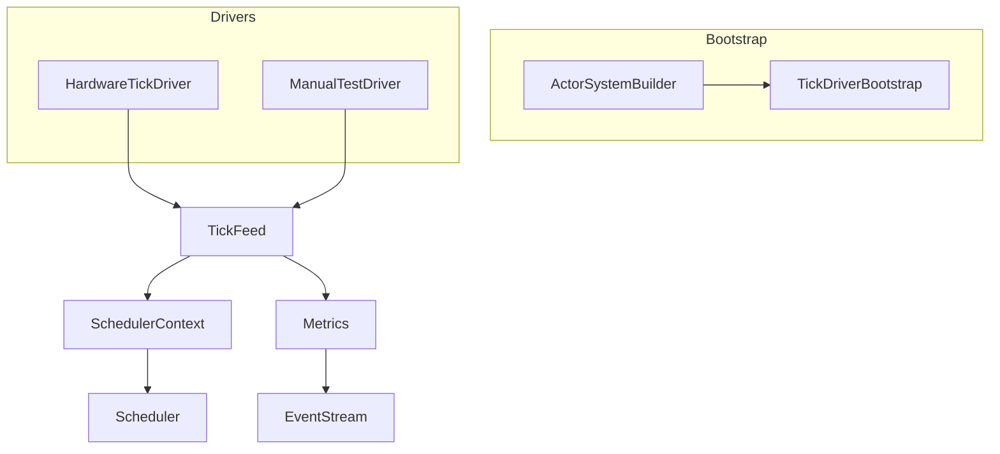
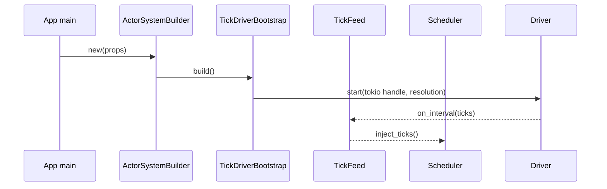
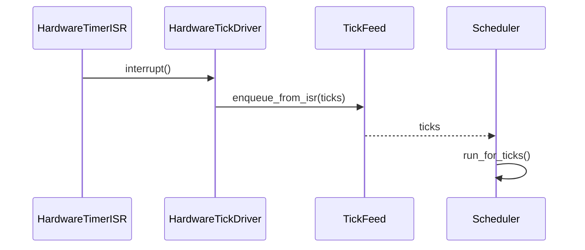

# Scheduler Tick Driver Integration Design

## Overview
本設計は、ActorSystem 初期化時に std/no_std を問わず決定論的な tick ストリームを供給する仕組みを導入し、Runner API をテスト専用に閉じ込めることでランタイム利用者の初期化負荷と誤設定リスクを排除する。ターゲット利用者は Tokió 等の std 実行環境を使うアプリケーション開発者と、embassy/SysTick を使う組込み開発者であり、両者が共通の Builder API を通じて Tick Driver を選択し、main 関数内の配線を 10〜15 行に収められる UX を提供する。これにより、現在の「SchedulerRunner::manual を main で回す」状態から脱却し、EventStream ベースのメトリクス監視と合わせて起動時の異常検知も容易になる。

### Goals
- no_std 環境で外部ハードウェアドライバが `TickDriver` trait を介して差し替え可能になる。
- Runner API を `#[cfg(test)]` と Builder 経由の構成チェックでテスト専用モードに封じ込める。
- Quickstart/テンプレートが `ActorSystemBuilder` を前提に 20 行未満で tick 設定を完了できるようにする。

### Non-Goals
- TimerWheel や SchedulerCore のアルゴリズム自体を変更しない。
- Network/Remoting 向けの tick 配送やクラスタ同期は対象外。
- ActorSystemConfig 以外の構成 API（例: RemotingConfig）の再設計は行わない。

## Architecture

### Existing Architecture Analysis
- `RuntimeToolbox::tick_source()` と `SchedulerTickHandle` が単純な手動 injest 用ハンドルしか提供しておらず、Tokio/embassy のタイマ API に接続する仕組みが存在しない (`modules/utils-core/src/runtime_toolbox.rs`, `modules/utils-std/src/runtime_toolbox/std_toolbox.rs`).
- `SchedulerContext::new()` は `TB::default()` を直接生成し、外部から driver を注入する拡張ポイントが無い (`modules/actor-core/src/scheduler/scheduler_context.rs`).
- `SchedulerRunner` は `pub` のまま manually tick を進める API を提供し、本番コードからも利用できてしまう (`modules/actor-core/src/scheduler/scheduler_runner.rs`).
- Quickstart/ガイドは dispatcher/guardian 構築のみを扱い、tick driver 配線や Builder 連携の情報がない。

### High-Level Architecture

- 既存パターン維持: RuntimeToolbox/SchedulerContext の抽象を崩さず、拡張ポイントを bootstrap 層に設ける。
- 技術整合: std 側は `tokio::time::interval` と `MissedTickBehavior::Delay` を用いてドリフトを抑制、no_std 側は embassy/SysTick の割り込みハンドラから軽量な enqueue を行う。【turn0search2】【turn0search1】
- Steering 準拠: 1 ファイル 1 型、no_std 本体に `cfg(feature="std")` を導入しない方針を守り、std 固有の driver 実装は `actor-std`/`utils-std` に置く。

### Technology Alignment
- Std: Tokió ランタイム上で tick 精度を保つため `tokio::time::interval` を専用タスクで駆動し、MissedTickBehavior を Delay に設定して catch-up の連射を防ぐ。【turn0search2】
- 組込み: embassy の time driver / SysTick は割り込みから `TickFeed` へ enqueue するだけの O(1) 処理とし、排他は `critical-section` で包む。Rust Embedded の割り込みベストプラクティスに従い ISR では副作用を減らし、実際の Scheduler 実行はメインコンテキストで行う。【turn0search1】【turn0search3】
- テスト: Manual driver は従来の `SchedulerRunner::manual` を内部的に利用しつつ `#[cfg(test)]` の Builder ハンドラ経由でのみ公開。
- 新規依存: 既存ワークスペース外の依存は追加しない。Tokio/embassy は既に workspace に含まれている。

### Key Design Decisions
1. **Decision**: `ActorSystemBuilder` + `TickDriverBootstrap` を導入
   - **Context**: main 関数が低レベル API で肥大化している。
   - **Alternatives**: a) 既存 `ActorSystem::new_with_config` に引数追加、b) Extension で後付け、c) Builder で前処理。
   - **Selected**: Builder で Props/TickDriver/Toolbox 等をチェーンし、`build()` 内で bootstrap。
   - **Rationale**: 起動前に失敗を検出しやすく、Quickstart との親和性が高い。
   - **Trade-offs**: 既存コードは Builder への移行が必要。
2. **Decision**: `TickDriver` trait + `TickFeed`
   - **Context**: std/no_std 両対応の driver 交換性が必要。
   - **Alternatives**: a) Toolbox に driver 実装を埋め込む、b) SchedulerContext に直接 trait を追加。
   - **Selected**: driver traitを独立させ、SchedulerContext とは feed で疎結合。
   - **Rationale**: Toolbox/ActorSystem の責務を肥大化させず、driver 追加も Builder 登録のみで完結。
   - **Trade-offs**: TickFeed の追加で間接層が増える。
   - **Context**: 本番でも `SchedulerRunner::manual` を呼べてしまう。
   - **Alternatives**: a) API 削除、b) feature flag、c) 起動モード検証。

## System Flows

### Flow 1: std 自動 Tick Driver


### Flow 2: no_std ハードウェア Tick Driver


## Requirements Traceability
| Req | Summary | Components | Interfaces | Flows |
| --- | --- | --- | --- | --- |
| R1.1-1.5 | std 自動 tick 供給 | ActorSystemBuilder, TickDriverBootstrap, AutoTickDriver, TickFeed, SchedulerTickMetricsProbe | `ActorSystemBuilder::with_tick_driver`, `TickDriver::start`, `TickFeed::enqueue` | Flow 1 |
| R2.1-2.5 | no_std ドライバ抽象 | TickDriver trait, HardwareTickDriver, TickFeed | `TickDriver::start`, `TickDriverConfig::hardware`, `TickFeed::enqueue_from_isr` | Flow 2 |
| R3.1-3.6 | Runner API テスト限定 | ManualTestDriver, TestOnlyDriverGate, Builder validation | `TickDriverConfig::manual`, `ActorSystemBuilder::with_manual_test_driver` (cfg) | Flow 1/2 構成パス |
| R4.1-4.7 | Quickstart & Builder | ActorSystemBuilder, Quickstart Templates | `ActorSystemBuilder::with_tick_driver`, documentation artifacts | n/a |

## Components and Interfaces

### Bootstrap Layer

#### ActorSystemBuilder<TB>
**Responsibility & Boundaries**
- Primary: Props/Config/TickDriver/Toolbox などの設定をチェーンし、`build()` で ActorSystem を構築。
- Domain: system bootstrap。
- Data Ownership: `BuilderState<TB>`（Props, TickDriverConfig, ToolboxRef, DiagnosticsOptions 等）。
- Transaction Boundary: `build()` 呼び出し中にのみ有効。

**Dependencies**
- Inbound: アプリケーションコード。
- Outbound: `TickDriverBootstrap`, `SystemStateGeneric`, `SchedulerContext`。
- External: なし。

**Contract**
```rust
pub struct ActorSystemBuilder<TB: RuntimeToolbox + Default> {
  state: BuilderState<TB>,
}
impl<TB: RuntimeToolbox + Default> ActorSystemBuilder<TB> {
  pub fn new(props: PropsGeneric<TB>) -> Self;
  pub fn with_tick_driver(mut self, cfg: TickDriverConfig<TB>) -> Self;
  pub fn with_toolbox(mut self, toolbox: TB) -> Self;
  pub fn build(self) -> Result<ActorSystemGeneric<TB>, TickDriverError>;
}
```
- Supporting types/API:
```rust
pub enum TickDriverConfig<TB: RuntimeToolbox> {
  Tokio { handle: tokio::runtime::Handle, resolution: Duration },
  Hardware { driver: &'static dyn TickPulseSource },
  #[cfg(any(test, feature = "test-support"))]
  ManualTest(ManualTestDriver<TB>),
}

impl<TB: RuntimeToolbox> TickDriverConfig<TB> {
  pub fn tokio(handle: tokio::runtime::Handle, resolution: Duration) -> Self {
    Self::Tokio { handle, resolution }
  }

  pub fn hardware(driver: &'static dyn TickPulseSource) -> Self {
    Self::Hardware { driver }
  }

  #[cfg(any(test, feature = "test-support"))]
  pub fn manual(driver: ManualTestDriver<TB>) -> Self {
    Self::ManualTest(driver)
  }

  pub fn with_fallback(self, policy: FallbackPolicy) -> Self {
    // 設計レベルの表現: 実装では TickDriverConfig 内へ埋め込む
    self
  }

  pub fn with_metrics_mode(self, mode: TickMetricsMode) -> Self {
    self
  }
}

pub enum TickDriverKind {
  Auto,
  Hardware { source: HardwareKind },
  #[cfg(any(test, feature = "test-support"))]
  ManualTest,
}

impl<TB: RuntimeToolbox + Default> ActorSystemBuilder<TB> {
  pub fn with_tick_driver(mut self, cfg: TickDriverConfig<TB>) -> Self {
    self.state.tick_driver = Some(cfg);
    self
  }
}
```
- Preconditions: Props が有効、TickDriverConfig が選択済み。
- Postconditions: 正常時は driver が起動し、ActorSystem が返る。
- Integration: 既存 `ActorSystem::new` は `ActorSystemBuilder::new(...).build()?` に委譲。
- Metrics/Fallback: `TickDriverConfig` の builder で `with_metrics_mode(TickMetricsMode::AutoPublish { interval })`（既定: 1 秒）や `with_fallback(FallbackPolicy::Retry { attempts: 3, backoff: 50ms })` を設定可能。`with_tick_driver` 呼び出し時にこれらを固定し、Builder 側は追加の暗黙構成を行わない。

#### TickDriverBootstrap<TB>
- Primary: Builder から渡された構成を検証し、`TickDriver` 実装を起動/停止する。
- Contract:
```rust
pub struct TickDriverBootstrap;

impl TickDriverBootstrap {
  pub fn provision<TB: RuntimeToolbox>(
    cfg: &TickDriverConfig<TB>,
    ctx: &SchedulerContext<TB>,
  ) -> Result<TickDriverHandle, TickDriverError>;

  pub fn shutdown(handle: TickDriverHandle);

  pub fn handle_driver_stop<TB: RuntimeToolbox>(
    handle: TickDriverHandle,
    policy: &FallbackPolicy,
    ctx: &SchedulerContext<TB>,
    feed: &TickFeed<TB>,
  ) -> Result<(), TickDriverError>;
}
```
- Preconditions: SchedulerContext が初期化済み。
- Postconditions: 成功時は driver ハンドルを返し、失敗時は ActorSystem 起動を中止。
- `handle_driver_stop` は稼働中の driver から停止シグナル（panic/ISR disable/JoinHandle 終了など）が届いた際に呼ばれ、`shutdown` は ActorSystem 停止時に利用者が明示的に呼び出す。`FallbackPolicy::Retry` の場合は指定回数ぶん `TickDriver::start` を再実行し、その間 `TickFeed` を freeze して重複注入を防ぐ。全て失敗した場合や `FailFast` の場合は feed を drain して `TickDriverError::DriverStopped` を返し、上位でシステム終了へ遷移させる。

### Driver Layer

#### TickDriver<TB> Trait
- Primary: 任意のソースから tick を供給する共通契約。
- Contract:
```rust
pub trait TickDriver<TB: RuntimeToolbox>: Send + Sync + 'static {
  fn id(&self) -> TickDriverId;
  fn resolution(&self) -> Duration;
  fn kind(&self) -> TickDriverKind;
  fn start(&self, feed: TickFeedHandle<TB>) -> Result<TickDriverHandle, TickDriverError>;
  fn stop(&self, handle: TickDriverHandle);
}
```
- Invariants: `start` は複数回呼ばない、`stop` は handle に対応。`TickFeedHandle<TB>` は `Clone + Send + Sync + 'static` の共有ポインタ。

#### AutoTickDriver
- Primary: Tokió runtime で `tokio::time::interval` + `MissedTickBehavior::Delay` を専用タスクで実行し、tick を `TickFeedHandle` へ連続供給。【turn0search2】
- Contract:
```rust
pub struct AutoTickDriver {
  handle: tokio::runtime::Handle,
  resolution: Duration,
}

impl AutoTickDriver {
  pub fn new(handle: tokio::runtime::Handle, resolution: Duration) -> Self;
}

impl<TB: RuntimeToolbox> TickDriver<TB> for AutoTickDriver { /* ... */ }
```
- Error: ハンドル未注入またはタスク spawn 失敗時は `TickDriverError::{HandleUnavailable, SpawnFailed}`。

#### HardwareTickDriver / TickPulseSource 実装
- Primary: no_std / 組込み環境でハードウェアタイマ ISR から tick を転送する。
- Contract:
```rust
pub struct HardwareTickDriver<P: TickPulseSource> {
  pulse: P,
  resolution: Duration,
}

impl<P: TickPulseSource> HardwareTickDriver<P> {
  pub const fn new(pulse: P, resolution: Duration) -> Self;
}

impl<P: TickPulseSource> TickPulseSource for HardwareTickDriver<P> {
  fn enable(&self) -> Result<(), TickDriverError> { /* configure ISR */ }
  fn disable(&self) { /* disable timer */ }
  fn set_callback(&self, handler: TickPulseHandler) { /* register ISR hook with ctx */ }
  fn resolution(&self) -> Duration { self.resolution }
}
```
- Behavior: `TickDriverConfig::hardware(&DRIVER)` で `&'static dyn TickPulseSource` を渡すと、`TickDriverBootstrap` が内部 `HardwareDriverAdapter` を生成して `TickDriver` として起動する。`set_callback` へ渡す `TickPulseHandler` の `ctx` には `TickFeedHandle` の生ポインタを格納し、ISR 内で `unsafe { (handler.func)(handler.ctx) }` を呼んで `feed.enqueue_from_isr(ticks)` を実行する。停止時は `disable()` を実行し、再起動時に `set_callback` を再登録する。

#### ManualTestDriver
- Visibility: `#[cfg(test)]` + `feature = "test-support"` のみ公開。

### Scheduler Integration & Instrumentation

#### TickFeed<TB>
- Primary: 単一 driver からの tick を `SchedulerTickHandle` へ橋渡し。
- State: `ArcShared<TickFeed<TB>>` + lock-free `ArrayQueue<u32>`（容量は `SchedulerCapacityProfile::tick_buffer_quota()` に追従）で FIFO を保証。`TickFeedHandle<TB> = ArcShared<TickFeed<TB>>` は `Clone + Send + Sync + 'static` で、Tokio タスクや ISR が所有できる。`enqueue` は host driver から、`enqueue_from_isr` は `critical-section` で包んで ISR から呼ぶ。キュー飽和時は新しい tick を破棄し、`SchedulerTickMetrics` の dropped カウンタを increment して背圧を可視化する。
- Responsibilities:
  1. **バッファ & フロー制御** — driver と Scheduler の速度差を吸収し、`handle.inject_manual_ticks` を平準化。
  2. **メトリクス集約** — enqueue/dequeue ごとに tick 数・ドロップ数・ドリフト計測データを集約し、`SchedulerTickMetricsProbe` から `snapshot()` 可能にする。
  3. **API 正規化** — Driver 側は `TickFeedHandle` だけ、Scheduler 側は `TickFeed` と `SchedulerTickHandleOwned` だけを扱うことで結合度を下げる。
- Auto Publish: `TickMetricsMode::AutoPublish` が選択されると、TickFeed は `SchedulerTickMetricsEmitter` に時計シグナルを渡し、interval ごとに `SchedulerTickMetrics` を計測して EventStream へ push する。`OnDemand` の場合は emitter を起動せず snapshot 時のみ publish。
- Ownership: `TickDriverBootstrap` が `TickFeed` を生成して `Arc` で包み、SchedulerContext と選択された TickDriver の両方へ `TickFeedHandle` を配布する。Driver 側はハンドルをクローンして enqueue し、Scheduler 側は `SchedulerContext::tick_feed()` から直接参照して poll する。
- Contract:
```rust
pub struct TickFeed<TB> {
  state: ArcShared<TickState>,
  handle: SchedulerTickHandleOwned<TB>,
  clock: TB::Clock, // RuntimeToolbox が提供する単調クロック
  queue: ArrayQueue<u32>,
}

pub type TickFeedHandle<TB> = ArcShared<TickFeed<TB>>;

impl<TB> TickFeed<TB> {
  pub fn enqueue(&self, ticks: u32);
  pub fn enqueue_from_isr(&self, ticks: u32);
  pub fn metadata(&self) -> TickDriverMetadata;
}
```
- Ordering: `TickFeed` が受け取った ticks をキューへ push し、Scheduler 側が順番に `handle.inject_manual_ticks` を呼ぶことで `SchedulerRunner` と同等の挙動を保つ。

#### SchedulerTickMetricsProbe & Emitter
- Probe Primary: `TickFeed` が保持する統計情報を利用者が任意のタイミングで取得し、`snapshot()` で `SchedulerTickMetrics` を返す。`ActorSystemBuilder::enable_tick_metrics()` を呼んだ場合のみ生成。
- Emitter Primary: `TickMetricsMode::AutoPublish { interval }` の場合にバックグラウンドで `snapshot()` を呼び、`EventStreamEvent::SchedulerTick` を定期 publish。Std では `tokio::time::interval`、no_std では `TickFeed` の clock + `TickPulseSource` を利用した軽量タイマを使用。


### Documentation Assets

#### Quickstart Templates
- Primary: `docs/guides/actor-system.md` と新規 `docs/guides/tick-driver-quickstart.md` へ Builder ベースのテンプレを追加。
- Dependencies: `ActorSystemBuilder` API, driver 名称表。
- Contract: Markdown テンプレ（Tokio/embassy/test）。Implementation では docs update issue を必須タスクに含める。

##### Main テンプレート（std/Tokio）
```rust
#[tokio::main(flavor = "multi_thread")]
async fn main() -> anyhow::Result<()> {
  let system = ActorSystemBuilder::new(Props::from_fn(|| GuardianActor))
    .with_tick_driver(TickDriverConfig::tokio(
      tokio::runtime::Handle::current(),
      Duration::from_millis(10)))
    .with_toolbox(StdToolbox::default())
    .build()?;

  let termination = system.when_terminated();
  system.user_guardian_ref().tell(AnyMessage::new(Start))?;
  tokio::time::sleep(Duration::from_millis(200)).await;
  system.terminate()?;
  termination.listener().await;
  Ok(())
}
```

##### Main テンプレート（no_std / embassy）
```rust
#[entry]
fn main() -> ! {
  static DRIVER: HardwareTickDriver<SysTick> = HardwareTickDriver::new(SysTick::new(core_clock_hz()), Duration::from_micros(10));
  let system = ActorSystemBuilder::<NoStdToolbox>::new(Props::from_fn(|| GuardianActor))
    .with_tick_driver(TickDriverConfig::hardware(&DRIVER))
    .build()
    .expect("system");

  system.user_guardian_ref().tell(AnyMessage::new(Start)).unwrap();
  loop {
    embassy_executor::run_until_idle();
  }
}
```

## Data Models
- **TickDriverConfig<TB>**: `enum TickDriverConfig<TB> { Tokio { handle: tokio::runtime::Handle, resolution: Duration }, Hardware { driver: &'static dyn TickPulseSource }, #[cfg(any(test, feature = "test-support"))] ManualTest(ManualTestDriver<TB>) }`。Builder は `TickDriverConfig::tokio/ hardware / manual` のヘルパを expose。
- **TickDriverKind**: `Auto`, `Hardware { source: HardwareKind }`, `ManualTest`。`SchedulerTickMetrics` や EventStream で使用。
- **TickPulseSource**: `pub trait TickPulseSource: Send + Sync { fn enable(&self) -> Result<(), TickDriverError>; fn disable(&self); fn set_callback(&self, handler: TickPulseHandler); fn resolution(&self) -> Duration; }`。
- **TickPulseHandler**: `pub struct TickPulseHandler { pub func: unsafe extern "C" fn(*mut core::ffi::c_void), pub ctx: *mut core::ffi::c_void }`。`TickDriverBootstrap` が `TickFeedHandle` の生ポインタを `ctx` に埋め込み、`func` 内で `feed.enqueue_from_isr(1)` を呼び出す。
- **TickState**: `struct TickState { enqueued_total: AtomicU64, dropped_total: AtomicU64, last_enqueue_ticks: AtomicU64, last_snapshot_time: AtomicU64 }`。`TickFeed` 内部で統計トラッキングに使用。
- **SchedulerTickHandleOwned<TB>**: 既存 `SchedulerContext` が保持する `SchedulerTickHandle<'static>` を所有型に包んだもの。TickFeed が `handle.inject_manual_ticks` を呼ぶために利用。
- **TickFeedHandle<TB>**: `type TickFeedHandle<TB> = ArcShared<TickFeed<TB>>`。Driver と SchedulerContext 両方に共有される feed ハンドル。
- **TickDriverError**: `SpawnFailed`, `HandleUnavailable`, `UnsupportedEnvironment`, `DriftExceeded`, `DriverStopped`。Builder/Bootstrap/Drivers 間の共通 error。
- **TickDriverMetadata**: `{ driver_id: TickDriverId, start_instant: TimerInstant, ticks_total: u64 }`。EventStream 出力や診断で使用。
- **FallbackPolicy**: `enum FallbackPolicy { Retry { attempts: u8, backoff: Duration }, FailFast }`。`TickDriverConfig` で選択（既定は `Retry { attempts: 3, backoff: Duration::from_millis(50) }`）。
- **TickMetricsMode**: `enum TickMetricsMode { AutoPublish { interval: Duration }, OnDemand }`。既定は `AutoPublish { interval: Duration::from_secs(1) }`。
- **SchedulerTickMetrics**: `pub struct SchedulerTickMetrics { pub driver: TickDriverKind, pub ticks_per_sec: u32, pub drift: Option<Duration>, pub enqueued_total: u64, pub dropped_total: u64, pub timestamp: Duration }`。
- **SchedulerTickMetricsProbe**: `pub struct SchedulerTickMetricsProbe<TB> { feed: TickFeedHandle<TB>, mode: TickMetricsMode }` + `impl<TB> SchedulerTickMetricsProbe<TB> { pub fn snapshot(&self) -> SchedulerTickMetrics; }`。`TickMetricsMode::AutoPublish` の場合は内部で `SchedulerTickMetricsEmitter` を spawn し、指定 interval ごとに EventStream へ自動 publish。`OnDemand` の場合は `snapshot()` を呼んだときのみ publish。
- **SchedulerCapacityProfile::tick_buffer_quota()**: TickFeed が確保すべきバッファ長を返す新メソッド。既存の capacity profile へ追加し、ターゲットプラットフォーム別にメモリ上限を計算する。
- **EventStreamEvent::SchedulerTick**: `EventStream` に `SchedulerTickMetrics` を載せて publish する新イベント。

## Error Handling
### Error Strategy
- Driver 起動時: `TickDriverBootstrap` が `TickDriverError` を返し、ActorSystem 構築を即座に中止。
- 実行中: `TickFeed` がドリフトを検出したら `SchedulerTickMetrics` に `drift` をセットし、±5% 超過時は `EventStream` に Warning。

### Error Categories and Responses
- **User Errors**: Builder 未構成 (`with_tick_driver` 未呼び) → `TickDriverError::UnsupportedEnvironment` を返す。
- **System Errors**: Tokio タスク spawn 失敗 → `SpawnFailed`。割り込み停止 → `DriverStopped`。

### Monitoring
- Driver failure は `EventStreamEvent::Log(LogEvent::Error)` として通知。Tokio タスク panics は `JoinHandle::abort` で検知し、Builder が再起動ポリシーを log。
- `TickMetricsMode::AutoPublish { interval }` が選択されている場合、`SchedulerTickMetricsEmitter` がバックグラウンドタスクを spawn し、1 秒既定で `EventStreamEvent::SchedulerTick` を自動配信する。`OnDemand` の場合は `SchedulerTickMetricsProbe::snapshot()` 呼び出しや `system.tick_metrics().publish()` を契機に単発 publish。

## Testing Strategy
- **Unit**: (1) `TickDriverConfig` バリデーション、(2) `TickFeed::enqueue` の順序保証、(3) `cfg(any(test, feature = "test-support"))` ブロックが prod ビルドから ManualTestDriver API を排除できているかのコンパイルテスト、(4) `SchedulerTickMetricsProbe::snapshot` の計測ロジック、(5) Manual driver の `inject` が feed と同数の ticks を供給すること。
- **Integration**: (1) `ActorSystemBuilder` 経由で AutoTickDriver を起動し scheduler が自動進行する、(2) embassy SysTick + Hardware driver 間の ISR 経路、(3) driver 停止時に `FallbackPolicy::Retry` と `FailFast` を切り替えて期待どおりに挙動する、(4) EventStream で tick メトリクスが自動 publish される、(5) Runner/ManualTestDriver API が `cfg(any(test, feature = "test-support"))` 下でのみ利用可能であること。
- **E2E/Examples**: Quickstart テンプレに沿った Tokio/no_std/test サンプルを examples ディレクトリに追加。
- **Performance**: (1) AutoTickDriver の ticks/s ±5% 判定、(2) ISR enqueue の遅延測定、(3) TickFeed バッファ飽和時の挙動と dropped カウンタの検証。

### TestOnlyDriverGate (cfg guard)
- Mechanism: `TickDriverConfig::ManualTest` と `ActorSystemBuilder::with_manual_test_driver` は `#[cfg(any(test, feature = "test-support"))]` でのみコンパイルされ、prod ビルドから完全に排除される。
- Outcome: 要件 R3.1-R3.4 に従い、テスト以外で Runner API/Manual driver を使用するとコンパイルエラーとなる。必要なケースでは `feature = "test-support"` を有効にして builder を再エクスポートし、テストコード内でのみ利用する。

## Performance & Scalability
- Std driver は Tokió runtime とは別のタスクで interval を駆動し、`spawn_blocking` ではなく通常タスク + `Handle::current()` を使うことでマルチスレッド scheduler と分離する。
- Hardware driver は `critical-section` を用いた lock-free enqueue で ISR 時間を最小化。TickFeed バッファサイズは `SchedulerCapacityProfile` に合わせて自動計算し、溢れた場合は `dropped_total` に記録。

## Migration Strategy
1. **Phase 0 → Phase 1（Builder 導入）**: 既存の `ActorSystem::new*` と examples を `ActorSystemBuilder::new(...).with_tick_driver(...).build()` に内部委譲させる。外部 API はそのままのため、既存ユーザは変更不要。
2. **Phase 1 → Phase 2（Driver 実装差し替え）**: AutoTickDriver / HardwareTickDriver / ManualTestDriver を登録し、`TickDriverConfig` を通じて選択。Runner API は `cfg(any(test, feature = "test-support"))` でのみ公開し、docs に移行ガイドを追加。
3. **Phase 2 → Phase 3（ドキュメント更新・旧 API の整理）**: Quickstart・examples・ガイドを Builder ベースに統一し、旧 `SchedulerRunner::manual` 直呼びの記述を削除。次期メジャーで `ActorSystem::new_manual_runner` など不要 API を deprecate。
