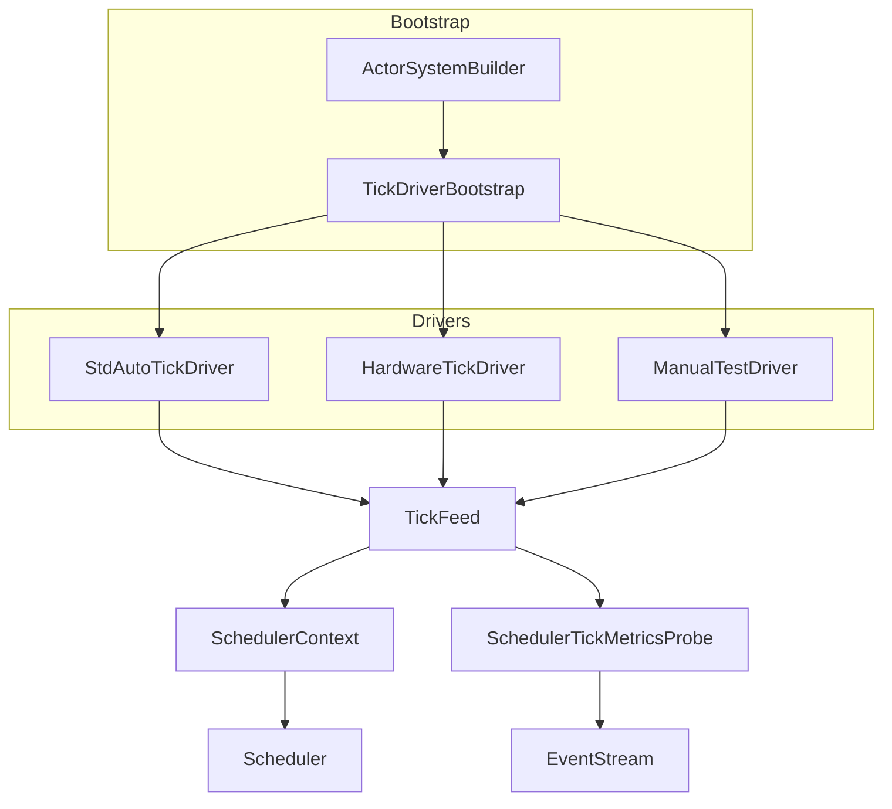
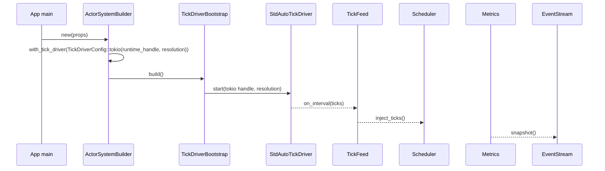
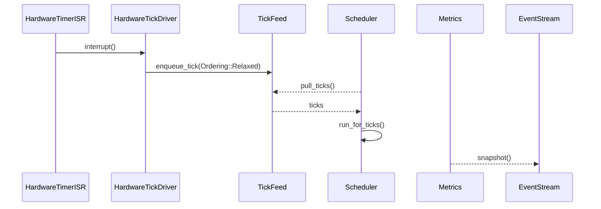

# Scheduler Tick Driver Integration Design

## Overview
本設計は、ActorSystem 初期化時に std/no_std を問わず決定論的な tick ストリームを供給する仕組みを導入し、Runner API をテスト専用に閉じ込めることでランタイム利用者の初期化負荷と誤設定リスクを排除する。ターゲット利用者は Tokió 等の std 実行環境を使うアプリケーション開発者と、embassy/SysTick を使う組込み開発者であり、両者が共通の Builder API を通じて Tick Driver を選択し、main 関数内の配線を 10〜15 行に収められる UX を提供する。これにより、現在の「SchedulerRunner::manual を main で回す」状態から脱却し、EventStream ベースのメトリクス監視と合わせて起動時の異常検知も容易になる。

### Goals
- std 環境で `StdAutoTickDriver` が自動 tick を供給し、±5% 以内の周期を保つ。
- no_std 環境で外部ハードウェアドライバが `TickDriver` trait を介して差し替え可能になる。
- Runner API を `#[cfg(test)]` と Builder 経由の構成チェックでテスト専用モードに封じ込める。
- Quickstart/テンプレートが `ActorSystemBuilder` を前提に 20 行未満で tick 設定を完了できるようにする。

### Non-Goals
- TimerWheel や SchedulerCore のアルゴリズム自体を変更しない。
- Network/Remoting 向けの tick 配送やクラスタ同期は対象外。
- ActorSystemConfig 以外の構成 API（例: RemotingConfig）の再設計は行わない。

## Architecture

### Existing Architecture Analysis
- `RuntimeToolbox::tick_source()` と `SchedulerTickHandle` が単純な手動 injest 用ハンドルしか提供しておらず、Tokio/embassy のタイマ API に接続する仕組みが存在しない (`modules/utils-core/src/runtime_toolbox.rs`, `modules/utils-std/src/runtime_toolbox/std_toolbox.rs`).
- `SchedulerContext::new()` は `TB::default()` を直接生成し、外部から driver を注入する拡張ポイントが無い (`modules/actor-core/src/scheduler/scheduler_context.rs`).
- `SchedulerRunner` は `pub` のまま manually tick を進める API を提供し、本番コードからも利用できてしまう (`modules/actor-core/src/scheduler/scheduler_runner.rs`).
- Quickstart/ガイドは dispatcher/guardian 構築のみを扱い、tick driver 配線や Builder 連携の情報がない。

### High-Level Architecture

- 既存パターン維持: RuntimeToolbox/SchedulerContext の抽象を崩さず、拡張ポイントを bootstrap 層に設ける。
- 新規コンポーネント: Builder/Bootstrap/Feed を追加し、driver 起動と EventStream メトリクスを集約。
- 技術整合: std 側は `tokio::time::interval` と `MissedTickBehavior::Delay` を用いてドリフトを抑制、no_std 側は embassy/SysTick の割り込みハンドラから軽量な enqueue を行う。【turn0search2】【turn0search1】
- Steering 準拠: 1 ファイル 1 型、no_std 本体に `cfg(feature="std")` を導入しない方針を守り、std 固有の driver 実装は `actor-std`/`utils-std` に置く。

### Technology Alignment
- Std: Tokió ランタイム上で tick 精度を保つため `tokio::time::interval` を専用タスクで駆動し、MissedTickBehavior を Delay に設定して catch-up の連射を防ぐ。【turn0search2】
- 組込み: embassy の time driver / SysTick は割り込みから `TickFeed` へ enqueue するだけの O(1) 処理とし、排他は `critical-section` で包む。Rust Embedded の割り込みベストプラクティスに従い ISR では副作用を減らし、実際の Scheduler 実行はメインコンテキストで行う。【turn0search1】【turn0search3】
- テスト: Manual driver は従来の `SchedulerRunner::manual` を内部的に利用しつつ `#[cfg(test)]` の Builder ハンドラ経由でのみ公開。
- 新規依存: 既存ワークスペース外の依存は追加しない。Tokio/embassy は既に workspace に含まれている。

### Key Design Decisions
1. **Decision**: `ActorSystemBuilder` + `TickDriverBootstrap` を導入
   - **Context**: main 関数が低レベル API で肥大化している。
   - **Alternatives**: a) 既存 `ActorSystem::new_with_config` に引数追加、b) Extension で後付け、c) Builder で前処理。
   - **Selected**: Builder で Props/TickDriver/Toolbox 等をチェーンし、`build()` 内で bootstrap。
   - **Rationale**: 起動前に失敗を検出しやすく、Quickstart との親和性が高い。
   - **Trade-offs**: 既存コードは Builder への移行が必要。
2. **Decision**: `TickDriver` trait + `TickFeed`
   - **Context**: std/no_std 両対応の driver 交換性が必要。
   - **Alternatives**: a) Toolbox に driver 実装を埋め込む、b) SchedulerContext に直接 trait を追加。
   - **Selected**: driver traitを独立させ、SchedulerContext とは feed で疎結合。
   - **Rationale**: Toolbox/ActorSystem の責務を肥大化させず、driver 追加も Builder 登録のみで完結。
   - **Trade-offs**: TickFeed の追加で間接層が増える。
3. **Decision**: Runner API を `cfg(test)` ベースのテスト専用 API で封じる
   - **Context**: 本番でも `SchedulerRunner::manual` を呼べてしまう。
   - **Alternatives**: a) API 削除、b) feature flag、c) 起動モード検証。
   - **Selected**: ManualTestDriver と Runner 再エクスポートを `#[cfg(any(test, feature = "test-support"))]` ブロック内に閉じ込め、prod ではシンボル自体を提供しない。
   - **Rationale**: コンパイル時に不正利用を遮断でき、利用者は余分な Builder パラメータを意識しなくて済む。
   - **Trade-offs**: テスト用の Builder/API を別途公開する必要があり、ドキュメントで明示する手間が増える。

## System Flows

### Flow 1: std 自動 Tick Driver


### Flow 2: no_std ハードウェア Tick Driver


## Requirements Traceability
| Req | Summary | Components | Interfaces | Flows |
| --- | --- | --- | --- | --- |
| R1.1-1.5 | std 自動 tick 供給 | ActorSystemBuilder, TickDriverBootstrap, StdAutoTickDriver, TickFeedCore, SchedulerTickMetricsProbe | `ActorSystemBuilder::with_tick_driver`, `TickDriver::start`, `TickFeedCore::enqueue` | Flow 1 |
| R2.1-2.5 | no_std ドライバ抽象 | TickDriver trait, HardwareTickDriver, TickFeedCore | `TickDriver::start`, `HardwareTickDriver::attach`, `TickFeedCore::enqueue_from_isr` | Flow 2 |
| R3.1-3.6 | Runner API テスト限定 | TestOnlyDriverGate, ManualTestDriver, Builder validation | `#[cfg(any(test, feature = "test-support"))] ActorSystemTestBuilder::with_manual_test_driver` | Flow 1/2 (構成パスのみ) |
| R4.1-4.7 | Quickstart & Builder | ActorSystemBuilder, Quickstart Templates | `ActorSystemBuilder::template_tokio()`, documentation artifacts | n/a |

## Components and Interfaces

### Bootstrap Layer

#### ActorSystemBuilder<TB>
**Responsibility & Boundaries**
- Primary: Props/Config/TickDriver/Toolbox などの設定をチェーンし、`build()` で ActorSystem を構築。
- Domain: system bootstrap。
- Data Ownership: `BuilderState<TB>`（Props, TickDriverConfig, ToolboxRef, DiagnosticsOptions 等）。
- Transaction Boundary: `build()` 呼び出し中にのみ有効。

**Dependencies**
- Inbound: アプリケーションコード。
- Outbound: `TickDriverBootstrap`, `SystemStateGeneric`, `SchedulerContext`。
- External: なし。

**Contract**
```rust
pub struct ActorSystemBuilder<TB: RuntimeToolbox + Default> {
  state: BuilderState<TB>,
}
impl<TB: RuntimeToolbox + Default> ActorSystemBuilder<TB> {
  pub fn new(props: PropsGeneric<TB>) -> Self;
  pub fn with_tick_driver(mut self, cfg: TickDriverConfig<TB>) -> Self;
  pub fn with_toolbox(mut self, toolbox: TB) -> Self;
  pub fn build(self) -> Result<ActorSystemGeneric<TB>, TickDriverError>;
}
```
- Preconditions: Props が有効、TickDriverConfig が選択済み。
- Postconditions: 正常時は driver が起動し、ActorSystem が返る。
- Integration: 既存 `ActorSystem::new` は `ActorSystemBuilder::new(...).build()?` に委譲。
- Tokio Handle 供給: `TickDriverConfig::tokio(handle, resolution)` のように明示的な `tokio::runtime::Handle` を Builder 引数で必須指定とし、自動検出ロジックは持たない。利用者が handle を渡し忘れた場合は `TickDriverConfig` 生成時にコンパイルエラーとなるため、Builder 側では追加チェックのみを行う。

#### TickDriverBootstrap<TB>
- Primary: Builder から渡された構成を検証し、`TickDriver` 実装を起動/停止する。
- Dependencies: `SchedulerContext`, `EventStream`。
- Contract:
```rust
pub struct TickDriverBootstrap;
impl TickDriverBootstrap {
  pub fn provision<TB: RuntimeToolbox>(cfg: &TickDriverConfig<TB>, ctx: &SchedulerContext<TB>) -> Result<TickDriverHandle, TickDriverError>;
  pub fn shutdown(handle: TickDriverHandle);
  pub fn handle_driver_stop<TB: RuntimeToolbox>(
    handle: TickDriverHandle,
    ctx: &SchedulerContext<TB>,
    feed: &TickFeedCore<TB>,
  ) -> Result<(), TickDriverError>;
}
```
- Preconditions: SchedulerContext が初期化済み。
- Postconditions: 成功時は driver ハンドルを返し、失敗時は ActorSystem 起動を中止。
- Fallback: driver から停止シグナルが届いた場合 `handle_driver_stop` が直ちに `TickDriverError::DriverStopped` を返し、ActorSystem を終了させる。必要になった場合のみ将来的に再試行ポリシーを検討する。失敗時は `EventStream` へ `SchedulerTickMetrics` + `LogEvent::Error` を発行し、停止した driver のメタデータを記録する。
- Provision flow: `TickDriverConfig` は enum（`TickDriverConfig::Tokio`, `TickDriverConfig::Embassy`, `TickDriverConfig::ManualTest`）で表現し、Bootstrap は `match cfg` で対応する driver を直接生成する。`ctx.tick_feed_handle()` で `TickFeedHandle<TB>` を取得し、選択ドライバへ渡す。テスト専用 driver では `cfg(test)` ブロック内でのみこのハンドルを公開する。

### Driver Layer

#### TickDriver<TB> Trait
- Primary: 任意のソースから tick を供給する共通契約。
- Contract:
```rust
pub trait TickDriver<TB: RuntimeToolbox>: Send + Sync + 'static {
  fn id(&self) -> TickDriverId;
  fn resolution(&self) -> Duration;
  fn kind(&self) -> TickDriverKind;
  fn start(&self, feed: TickFeedHandle<TB>) -> Result<TickDriverHandle, TickDriverError>;
  fn stop(&self, handle: TickDriverHandle);
}
```
- Invariants: `start` は複数回呼ばない、`stop` は handle に対応。`TickFeedHandle<TB>` は `Clone + Send + Sync + 'static` の共有ポインタであり、Tokio タスクや ISR から安全に保持できる。

#### StdAutoTickDriver
- Primary: Tokió runtime で `tokio::time::interval` + `MissedTickBehavior::Delay` を専用タスクで実行し、tick を `TickFeedHandle` へ連続供給。【turn0search2】
- Dependencies: `tokio::runtime::Handle`, `TickFeedHandle<TB>`。
- Contract:
  - `StdAutoTickDriver::new(resolution: Duration, handle: tokio::runtime::Handle)` で runtime ハンドルを確定。
  - Builder では `TickDriverConfig::tokio(handle, resolution)` のみを提供し、呼び出し点で `tokio::runtime::Handle::current()` などを使って明示的に取得する。自動検出ロジックは持たない。
  - `ActorSystemBuilder` 側はハンドルの妥当性チェック（`handle.id()` の参照、`SchedulerContext` が std ツールボックスであること）だけを行い、失敗時は `TickDriverError::HandleUnavailable` を返す。
- Error: ハンドル未初期化、`try_current()` 失敗、またはタスク spawn 失敗時は `TickDriverError::{HandleUnavailable, SpawnFailed}`。

#### HardwareTickDriver
- Primary: embassy/SysTick 等の ISR から `TickFeedHandle` へ tick を転送。
- Dependencies: `TickPulseSource` trait（ISR から呼ばれる `fn on_tick()`）と `TickFeedHandle<TB>`。
- Contract: `impl<TB> TickDriver<TB> for HardwareTickDriver<P: TickPulseSource>` として `start(feed_handle)` を呼ぶと、`HardwareTickDriverHandle` が pulse source と feed の橋渡しをセットアップし、`stop(handle)` が登録解除を行う。追加の `attach` API は `TickPulseSource` 実装と `TickDriverConfig::hardware(pulse_source)` を結び付けるヘルパとして提供する。
- Notes: ISR 内では `feed_handle.enqueue_from_isr(ticks)` のみ呼び、実処理は main で行う。【turn0search1】【turn0search3】

#### ManualTestDriver
- Primary: テストで `TickFeedHandle` に手動 tick を注入し、`SchedulerRunner` と互換性を保つ。
- Contract: `ManualTestDriver::new()` + `fn inject(&self, ticks: u32)`（内部で `tick_feed.enqueue(driver_id, ticks)` を呼ぶ）。
- Visibility: `#[cfg(test)]` + `feature = "test-support"` のみ公開。

### Scheduler Integration & Instrumentation

- Primary: 単一 driver からの tick を `SchedulerTickHandle` へ橋渡し。
- State: `ArcShared<TickFeedCore<TB>>` + lock-free `ArrayQueue<u32>`（容量は `SchedulerCapacityProfile::system_quota()` に追従）で FIFO を保証。`TickFeedHandle<TB> = Arc<TickFeedCore<TB>>` は `Clone + Send + Sync + 'static` で、Tokio タスクや ISR が所有できる。`enqueue` は host driver から、`enqueue_from_isr` は `critical-section` で包んで ISR から呼ぶ。キュー飽和時は最新 tick を捨てず、飽和検知時に `SchedulerTickMetrics` の dropped カウンタを increment して古い値を破棄する。
- Contract:
```rust
pub struct TickFeedCore<TB> {
  state: ArcShared<TickState>,
  handle: SchedulerTickHandleOwned<TB>,
  clock: TB::Clock,
  queue: ArrayQueue<u32>,
}

pub type TickFeedHandle<TB> = Arc<TickFeedCore<TB>>;

impl<TB> TickFeedCore<TB> {
  pub fn enqueue(&self, ticks: u32);
  pub fn enqueue_from_isr(&self, ticks: u32);
  pub fn metadata(&self) -> TickDriverMetadata;
}
```
- Ordering: `TickFeedCore` が受け取った ticks をキューへ push し、Scheduler 側が順番に `handle.inject_manual_ticks` を呼ぶことで `SchedulerRunner` と同等の挙動を保つ。

#### SchedulerTickMetricsProbe
- Primary: `TickFeedCore` が保持する統計情報を利用者が任意のタイミングで取得し、必要に応じて `EventStream` へ `SchedulerTickMetrics` を publish。
- Contract: `fn snapshot(&self) -> SchedulerTickMetrics`。`ActorSystemBuilder::enable_tick_metrics()` を呼んだ場合のみ probe が生成され、デフォルトでは無効。

#### TestOnlyDriverGate (`cfg(test)` API)
- Primary: ManualTestDriver と Runner 関連 API を `#[cfg(any(test, feature = "test-support"))]` で囲み、prod バイナリから完全に排除する。
- Contract:
```rust
#[cfg(any(test, feature = "test-support"))]
impl<TB: RuntimeToolbox + Default> ActorSystemBuilder<TB> {
  pub fn with_manual_test_driver(mut self, driver: ManualTestDriver<TB>) -> Self;
}

#[cfg(any(test, feature = "test-support"))]
pub use actor_core::scheduler::runner::test_support::SchedulerRunner;
```
- Integration: `TickDriverConfig::ManualTest` variant や Builder 拡張を `#[cfg(any(test, feature = "test-support"))]` で囲い、prod ビルドではコンパイルすらされないようにする。tests ディレクトリでは `pub type ActorSystemTestBuilder<TB> = ActorSystemBuilder<TB>;` を再エクスポートし、その impl ブロックにのみ ManualTestDriver API を追加する。これにより利用者は追加のフラグを意識せずとも誤用を防げる。

### Documentation Assets

#### Quickstart Templates
- Primary: `docs/guides/actor-system.md` と新規 `docs/guides/tick-driver-quickstart.md` へ Builder ベースのテンプレを追加。
- Dependencies: `ActorSystemBuilder` API, driver 名称表。
- Contract: Markdown テンプレ（Tokio/embassy/test）。Implementation では docs update issue を必須タスクに含める。

##### Main テンプレート（std/Tokio）
```rust
#[tokio::main(flavor = "multi_thread")]
async fn main() -> anyhow::Result<()> {
  let system = ActorSystemBuilder::new(Props::from_fn(|| GuardianActor))
    .with_tick_driver(TickDriverConfig::tokio(
      tokio::runtime::Handle::current(),
      Duration::from_millis(10)))
    .with_toolbox(StdToolbox::default())
    .build()?;

  let termination = system.when_terminated();
  system.user_guardian_ref().tell(AnyMessage::new(Start))?;
  tokio::time::sleep(Duration::from_millis(200)).await;
  system.terminate()?;
  termination.listener().await;
  Ok(())
}
```

##### Main テンプレート（no_std / embassy）
```rust
#[entry]
fn main() -> ! {
  static DRIVER: HardwareTickDriver<SysTick> = HardwareTickDriver::new();
  let systick = embassy_time::driver::SysTick::new(core_clock_hz());

  let system = ActorSystemBuilder::<NoStdToolbox>::new(Props::from_fn(|| GuardianActor))
    .with_tick_driver(TickDriverConfig::hardware(&DRIVER, systick))
    .build()
    .expect("system");

  system.user_guardian_ref().tell(AnyMessage::new(Start)).unwrap();
  loop {
    embassy_executor::run_until_idle();
  }
}
```

## Data Models
- **TickDriverConfig<TB>**: `enum TickDriverConfig<TB> { Tokio { handle: tokio::runtime::Handle, resolution: Duration }, Hardware { driver: &'static dyn TickPulseSource }, ManualTest(ManualTestDriver<TB>) }`。Builder は `TickDriverConfig::tokio(handle, resolution)` / `TickDriverConfig::hardware(pulse_source)` / `TickDriverConfig::manual(driver)` のヘルパのみ提供し、拡張登録は行わない。
- **TickDriverKind**: `StdAuto`, `Hardware { source: HardwareKind }`, `ManualTest`（後者は `#[cfg(any(test, feature = "test-support"))]` 範囲でのみコンパイルされ、prod からは不可視）。
- **TickFeedHandle<TB>**: `Arc<TickFeedCore<TB>>`。`Clone + Send + Sync + 'static` で、Driver へ渡される唯一の feed エントリポイント。
- **TickDriverMetadata**: `{ driver_id: TickDriverId, start_instant: TimerInstant, ticks_total: u64 }`。単一 driver でも計測用途で driver_id を保持。
- **TickDriverError**: `SpawnFailed`, `HandleUnavailable`, `UnsupportedEnvironment`, `DriftExceeded`, `DriverStopped`。Builder/Bootstrap/Drivers 間の共通 error。
- **SchedulerTickMetrics Event**: `{ driver: TickDriverKind, ticks_per_sec: u32, drift: Option<Duration>, timestamp: Duration }` を新たに `EventStreamEvent::SchedulerTick` として追加。

## Error Handling
### Error Strategy
- Driver 起動時: `TickDriverBootstrap` が `TickDriverError` を返し、ActorSystem 構築を即座に中止。
- 実行中: `TickFeedCore` がドリフトを検出したら `SchedulerTickMetrics` に `drift` をセットし、±5% 超過時は `EventStream` に Warning。
- 停止検知: Driver の `stop` シグナルを受けると `TickDriverBootstrap::handle_driver_stop` が直ちに `TickDriverError::DriverStopped` を返し、ActorSystem を終了させると同時に EventStream に `DriverStopped` を記録。

### Error Categories and Responses
- **User Errors**: Builder 未構成 (`with_tick_driver` 未呼び) → `TickDriverError::UnsupportedEnvironment` を返す。
- **System Errors**: Tokio タスク spawn 失敗 → `SpawnFailed`。割り込み停止 → `DriverStopped`。
- **Business Logic Errors**: ManualTestDriver/Runner API は prod ビルドではそもそもシンボルが存在しないため、誤って参照しようとするとコンパイルエラー（`cannot find type`）となる。

### Monitoring
- `SchedulerTickMetricsProbe` が `snapshot()` 呼び出し時のみ EventStream へ publish（デフォルト無効）。
- Driver failure は `EventStreamEvent::Log(LogEvent::Error)` として通知。Tokio タスク panics は `JoinHandle::abort` で検知し、Builder が再起動ポリシーを log。

## Testing Strategy
- **Unit**: (1) `TickDriverConfig` バリデーション、(2) `TickFeedCore::enqueue` の順序保証、(3) `cfg(any(test, feature = "test-support"))` ブロックが prod ビルドから ManualTestDriver API を排除できているかのコンパイルテスト、(4) `SchedulerTickMetrics` 計測ロジック、(5) Manual driver の `inject` が feed と同数の ticks を供給。
- **Integration**: (1) `ActorSystemBuilder` 経由で Std driver を起動し scheduler が自動進行する、(2) embassy SysTick + Hardware driver 間の ISR 経路、(3) driver 停止時にフォールバックが実行される、(4) EventStream で tick メトリクスが購読できる、(5) Runner/ManualTestDriver API が `cfg(any(test, feature = "test-support"))` のときだけビルドされる。
- **E2E/Examples**: Quickstart テンプレに沿った Tokio/no_std/test サンプルを examples ディレクトリに追加。
- **Performance**: (1) Std driver の ticks/s ±5% 判定、(2) ISR enqueue の遅延測定、(3) TickFeed バッファ飽和時の挙動。

## Performance & Scalability
- Std driver は Tokió runtime とは別のタスクで interval を駆動し、`spawn_blocking` ではなく通常タスク + `Handle::current()` を使うことでマルチスレッド scheduler と分離する。
- Hardware driver は `critical-section` を用いた lock-free enqueue で ISR 時間を最小化。TickFeed バッファサイズは `SchedulerCapacityProfile` に合わせて自動計算し、溢れた場合は `dropped_total` に記録。
- ドリフト測定は `TickFeedCore` が `TB::Clock` を参照し、`snapshot()` 呼び出し間隔の `TimerInstant` 差分を算出。

## Migration Strategy
```mermaid
flowchart LR
  A[Phase 0 現在: manual runner] --> B[Phase 1: ActorSystemBuilder 導入<br/>既存 API は builder に委譲]
  B --> C[Phase 2: TickDriverBootstrap と Std/HW driver 実装<br/>TestOnlyDriverGate (cfg) の導入]
  C --> D[Phase 3: Docs/Quickstart 更新 + Runner API 制限反映]
```
- Phase 1: 既存 `ActorSystem::new*` を Builder に委譲し、内部的には従来の manual driver を起動。
- Phase 2: 新 driver を登録し、テスト専用 API を `cfg(any(test, feature = "test-support"))` に閉じ込める。旧 API からの移行ガイドを docs に追加。
- Phase 3: Quickstart/テンプレ/サンプルの更新、`SchedulerRunner` の公開範囲を `#[cfg(test)]` に限定。
