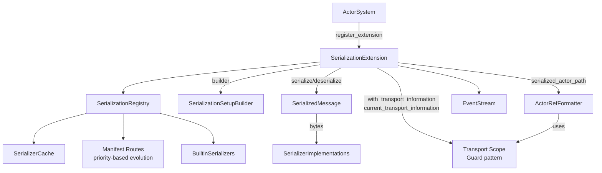
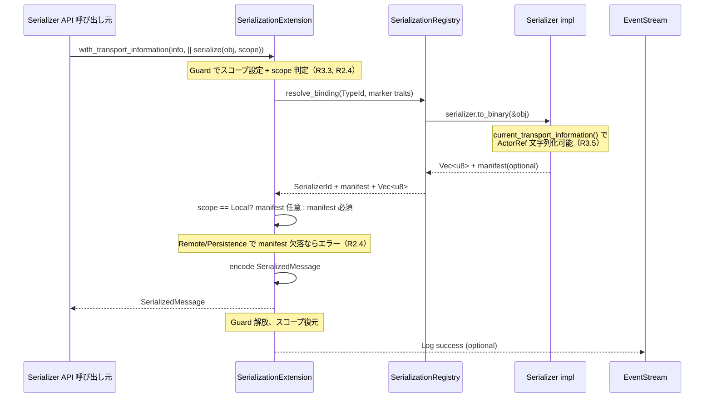
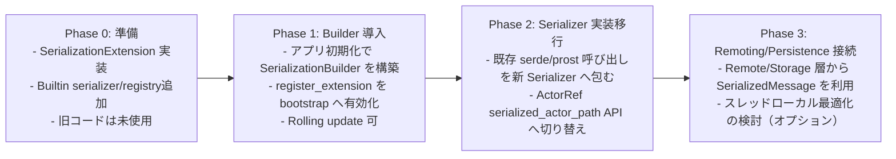

# Serialization Pekko Compatible Redesign — Design

## Overview
cellactor-rs のアクターランタイムへ Pekko 相当のシリアライゼーション層を組み込み、ActorSystem 全体で一貫した識別子・マニフェスト・ActorRef文字列化を扱えるようにする。`SerializationExtension` を中心に、型バインディング DSL、manifest 進化を Rust/no_std 向けに設計し、Rolling Upgrade を阻害しない ID 管理とエラーモデルを提供する。Phase 1 はシンプルな `Vec<u8>` ベース、Phase 3 以降でゼロコピー最適化を検討する。

主な利用者は (1) ランタイム管理者（ActorSystem 起動時のレジストリ確定）、(2) Remoting/Persistence 実装者（manifest 進化）、(3) カスタム Serializer 開発者であり、全員が `programmatic setup builder` のみで構成を完結できる。結果として、現状 `AnyMessage` しか持たないメッセージ経路が `SerializedMessage` を軸に標準フォーマット化され、将来の Remoting/Cluster 拡張の土台となる。

### Goals
- 拡張用 `SerializationExtension` と `SerializationRegistry` を actor-core に追加し、起動順序内で静的ビルダー→外部アダプタ→内蔵デフォルトの優先順位で ID 登録を完了させる。
- Manifest 進化・TypeId/marker trait バインディングを含む `SerializedMessage` 仕様と API を確立する（Phase 1はシンプル実装）。
- ActorRef/ActorPath 文字列化ヘルパーを提供し、リモート情報が不足する場合はローカルパスへフォールバックする（Pekko互換）。

### Non-Goals
- 設定ファイルベースのバインディング（Pekko `serialization-bindings`）は今回対象外。全てプログラム API で完結させる。
- Remoting/Cluster/Persistence 本体の実装やワイヤプロトコルは本設計に含めない。ただし拡張ポイントは用意する。
- Serde ベースの DSL 追加や serde 専用マクロ提供は行わない。serde はオプション依存として連携するに留める。

## Architecture

### Existing Architecture Analysis
- ActorSystem は `Extension`/`ExtensionId` を通じて ArcShared 共有リソースを登録し、`SystemState` が Mutex 付き HashMap で保持する (`modules/actor-core/src/system/base.rs`, `system_state.rs`)。
- メッセージ表現は `AnyMessage`/`AnyMessageView` と `SendError`/`DeadLetter` の組合せのみで、バイト列や manifest を扱う API は存在しない。
- すべてのランタイムコードは `no_std` + `alloc` 前提であり、`ArcShared` と ToolboxMutex で同期を抽象化している。標準依存の Transport 情報は actor-std 側で提供する想定。
- EventStream/DeadLetter/Logging などの診断経路は既に存在するため、シリアライゼーション層はそこへログ/イベントを発行するだけで済む。

### High-Level Architecture


**Architecture Integration**
- 既存パターン: Extension + ArcShared を踏襲し、`SystemStateGeneric::extensions` へ `SerializationExtension` を登録するだけで起動と統合できる。
- 新規コンポーネント: Registry/Builder/BuiltinSerializers を actor-core 内に追加。シンプルな構成で Pekko 互換性を維持。
- 設定統合: `SerializationConfigAdapter`（複数可）を Extension 初期化シーケンスの builder 出力に順番適用し、`programmatic builder > adapters > builtin defaults` の優先順位を保証する。
- 技術整合: Phase 1 は `Vec<u8>` で実装（追加依存不要）。HashMap には `hashbrown` を使用。
- Steering 準拠: 1ファイル1型原則、rustdoc 英語/その他日本語、`#[cfg(feature = "std")]` 禁止を満たす。

### Technology Stack and Design Decisions

#### Technology Alignment
- **Core クレート**: `modules/actor-core` に `serialization/` ディレクトリを新設し、`SerializationExtension`・`SerializationRegistry`・`SerializedMessage` などを配置。`modules/utils-core` には追加不要。
- **Dependencies**: Phase 1 は標準の `Vec<u8>` のみで実装（追加依存不要）。Phase 3 以降でゼロコピー最適化を検討する際に軽量バッファ抽象を追加。
- **Observability**: `EventStreamEvent::Log` と `DeadLetter` を使い、Serializer ID 衝突や manifest 未登録を監査ログに送信する。Pekko同様、ロギングのみで十分。

#### Key Design Decisions
- **Decision**: SerializationExtension を actor-core Extension として実装し、新設クレートではなく既存クレート内に配置する。  
  **Context**: Extension 機構と SystemState の Mutex/ArcShared 管理が actor-core に密結合している。  
  **Alternatives**: (1) `serialization-core` クレートを追加、(2) actor-std 側のみで提供、(3) `utils-core` に汎用機能を置く。  
  **Selected Approach**: actor-core 内に `serialization` モジュールを追加し、Extension/TB/ArcShared を直接利用。  
  **Rationale**: 依存グラフを崩さず最少の crate 増に留め、no_std でも動作する一貫 API を維持できる。  
  **Trade-offs**: 将来 serialization を別クレートへ切り出す際にリファクタが必要。

- **Decision**: Transport情報管理をスコープAPI（Handle + Guard）で提供し、ActorRef文字列化を実現する。
  **Context**: Pekkoは`DynamicVariable[Information]`（ThreadLocal）と`withTransportInformation`でTransport情報を管理している（Serialization.scala:49, 114-122）。ActorRefシリアライズやネスト委譲でこの情報が必須。
  **Alternatives**: (1) ThreadLocal直接使用、(2) Extension内状態管理のみ、(3) スコープ管理なし（ActorRefシリアライズ不可）。
  **Selected Approach**:
    - `TransportInformation` 構造体: `{ address: Address, system: SystemHandle }`（Pekko Information互換）
    - `with_transport_information<R>(info, f: impl FnOnce() -> R) -> R`: Guardパターンでスコープ設定（Pekko withTransportInformation互換）
    - `current_transport_information() -> Option<TransportInformation>`: 現在のスコープ取得
    - `serialized_actor_path(actor_ref) -> String`: Transport情報を使用してActorRefを文字列化（Pekko serializedActorPath互換）
  **Rationale**: Pekko互換。Remoting/Persistenceが必要とするコンテキスト設定・復元（R3.3, R3.5）を実現。ネスト委譲でのコンテキスト共有（R6.3）を保証。
  **Trade-offs**: Phase 1はExtension内状態管理（Cell/ArcShared）、Phase 3でThreadLocal最適化を検討。Shutdown時に状態クリアが必要。

- **Decision**: Manifest不要シリアライザの境界制御を明示し、リモート送受信では必ず論理マニフェストを付与する。
  **Context**: R2.4 が「manifest不要はローカル呼び出し限定、Remoting/Persistence へ送る際には論理マニフェストを自動付与しない」と定義。Pekko でも manifest 無しシリアライザは ActorSystem 内の最適化用途に限定される。
  **Alternatives**: (1) manifest 無しでも Remoting にそのまま流す、(2) 送信時に自動で適当な manifest を付与、(3) DSL で論理 manifest を強制登録。
  **Selected Approach**:
    - `SerializationCallScope` を導入（`Local`, `Remote`, `Persistence`）。`with_transport_information` が設定されていれば `Remote` 扱い、それ以外でも Persistence 呼び出し時は明示的に `Persistence` を指定。
    - `serialize` 実行時に scope が `Remote`/`Persistence` の場合、`manifest` が `Some` でないメッセージを拒否し、UnknownManifest エラーを返す。
    - `SerializationSetupBuilder` に `bind_remote_manifest::<T>(manifest: &'static str)` を用意し、manifest 不要シリアライザでもリモート経路には論理 manifest を紐付けて利用できるようにする。
  **Rationale**: ローカル最適化を維持しつつ、境界を越える際は常に解析可能な manifest を保証することで、Persistence/Remoting での互換性を担保。
  **Trade-offs**: DSL 設定が増えるが、ビルド時に欠落を検知できる。境界判定のために serialize API へ scope 情報を渡す必要がある。

- **Decision**: `SerializedMessage` を Pekko 互換の `[serializer_id|manifest_flag|manifest|payload_len|payload]` LE フォーマットに固定し、Phase 1 は `Vec<u8>` で実装する。
  **Context**: Requirement 2/4 で Manifest 仕様が示され、Pekko は ID 0-40 を予約し同フォーマットを公開している。[^pekko-serialization]
  **Alternatives**: (1) CBOR/Protobuf へ依存、(2) 手動 `Vec<u8>`、(3) `postcard` など既存フォーマットを流用。
  **Selected Approach**: 内製フォーマットを `SerializedMessage` でラップし、Phase 1 は `Vec<u8>` で実装。Phase 3 以降でゼロコピー最適化を検討。
  **Rationale**: Pekko との互換性を維持しつつ、Phase 1 はシンプルな実装を優先。manifest/serializer id をまとめて保持できる。
  **Trade-offs**: 解析/検証コードを自前実装する必要がある。Phase 1 ではメモリコピーを許容。

## System Flows

### フロー1: serialize 呼び出し（Transport コンテキスト自動設定含む）


### フロー2: manifest 進化付き deserialize（priority-based fallback 含む）
```mermaid
flowchart TD
  A[SerializedMessage受領] --> B[SerializerRegistry.serializer_by_id]
  B -->|miss| C[FallbackSerializer AnySerializer]
  B -->|hit| D[Binding]
  D --> E{manifest種別}
  E -->|String manifest| F[SerializerWithStringManifest::from_binary]
  E -->|manifest不要 (scope==Local)| G[Serializer::from_binary]
  F -->|Unknown manifest| H[manifest_routes 参照 R2.2]
  H --> I{priority chain試行}
  I -->|1st serializer試行| J{成功?}
  J -->|Yes| K[deserialize結果]
  J -->|No| L[次のserializer試行]
  L --> M{chain終了?}
  M -->|No| J
  M -->|Yes| N[NotSerializableError with transport_hint R2.2, R1.4]
  G --> K
  F -->|manifest既知| K
```
※ Remote/Persistence scope から受領した `SerializedMessage` では encode 時点で manifest が必ず埋められているため（Flow1 の制約）、`manifest不要` 分岐は Local scope 限定となる。

## Requirements Traceability
| Requirement | Summary | Components | Interfaces | Flows |
|-------------|---------|------------|------------|-------|
| R1.1–1.6 | 起動時レジストリ構築と Builder DSL | `SerializationExtension`, `SerializationRegistry`, `SerializationSetupBuilder` | `register_extension`, `SerializationBuilder::{register_serializer, bind, build}` | Flow1 |
| R2.1–2.4 | Manifest/進化 | `SerializedMessage`, `SerializerWithStringManifest`, `SerializationError::NotSerializable` | `SerializedMessage::{encode,decode}`, `SerializerWithStringManifest::from_binary` | Flow2 |
| R3.1–3.5 | ActorRef 文字列化 | `SerializationExtension` | `serialized_actor_path(actor_ref)` | Flow1 |
| R4.1–4.3 | 組み込みシリアライザ | `BuiltinSerializers`, `ActorRefSerializer` | `Serializer::to_binary`, `Serializer::from_binary` | Flow1 |
| R5.1–5.4 | Serde 依存排除 | `SerializationSetupBuilder`, `SerializerId` | Programmatic DSL のみ | Flow1 |
| R6.1–6.4 | ネスト委譲 | `SerializationExtension` | `serialize`, `deserialize` | Flow1 & Flow2 |

## Components and Interfaces

### Extension Layer
- **SerializationExtension<TB>**
  - 役割: ActorSystem へ登録される Extension。Builder で確定した Registry を保持し、公開 API (`serialize`, `deserialize`, `serialized_actor_path`, `register_binding`) および Transport スコープ管理 API を提供。
  - メソッド概要:
    - `fn new(system: &ActorSystemGeneric<TB>, setup: SerializationSetup<TB>) -> Self`
    - `fn serialize(&self, obj: &(dyn Any + Send + Sync), scope: SerializationCallScope) -> Result<SerializedMessage, SerializationError>` — scope に応じて manifest 必須判定を行い、Remote/Persistence では manifest 欠落時に即エラー（R2.4）。
    - `fn deserialize(&self, msg: &SerializedMessage, type_hint: Option<TypeId>) -> Result<Box<dyn Any + Send>, SerializationError>`
    - `fn with_transport_information<R>(&self, info: TransportInformation, f: impl FnOnce() -> R) -> R` — Pekko `withTransportInformation` 互換。Guard パターンでスコープ設定し、ActorRef シリアライズや nested 委譲時にコンテキストを共有。
    - `fn current_transport_information(&self) -> Option<TransportInformation>` — 現在のスコープから Transport 情報を取得。Pekko `currentTransportInformation.value` 互換。取得結果に応じて `SerializationCallScope` を `Remote` へ自動昇格させる。
    - `fn serialized_actor_path(&self, actor_ref: &ActorRefGeneric<TB>) -> Result<String, SerializationError>` — Pekko `serializedActorPath` 互換。Transport 情報を使用して ActorRef を文字列化。情報不足時はローカルパスへフォールバック。
    - `fn shutdown(&self)` — Extension の停止処理を明示。Transport Guard/現在スコープをクリアし、Registry/manifest_routes キャッシュと Adapter 適用結果を解放。以降の API 呼び出しは `SerializationError::Uninitialized` を返す（R3.4）。
  - 依存: `SerializationRegistry`, `EventStream`.
- **SerializationSetupBuilder**
  - 役割: `register_serializer`, `bind::<Marker>()` などの API をチェーンし、`SerializationSetup` を生成。
  - バリデーション: Serializer ID 重複検出（0–40 は予約エラー[^pekko-reserved]）、Marker trait 未登録など。
  - **Adapter 連携**: `SerializationConfigAdapter` から渡される差分（例: serde 設定ファイル）を builder に適用できるよう、`fn apply(mut self, adapter: &impl SerializationConfigAdapter) -> Result<Self, BuilderError>` を提供。
  - **Manifest discipline support**: `bind_remote_manifest::<T>(manifest: &'static str)` と `require_manifest_for_scope(scope: SerializationCallScope)` を提供し、Remoting/Persistence 経路では論理マニフェストを強制。欠落時は `BuilderError::ManifestRequired` を返す。
- **SerializationConfigAdapter**
  - 役割: 設定ファイルや CLI から取得したバインディング/Serializer 登録を builder へ適用するプラガブル層。
  - 優先順位: Extension 初期化時に `programmatic builder` の結果へ各 adapter を順番適用し、最後に内蔵デフォルトを登録する。adapter 側での ID 衝突は `BuilderError::DuplicateId` に委譲。

### Registry Layer
- **SerializationRegistry**
  - 構造: `ToolboxMutex<HashMap<TypeId, Binding>>` + `ToolboxMutex<HashMap<SerializerId, ArcShared<dyn Serializer>>>` + manifest キャッシュ (`HashMap<String, Option<TypeId>>`) + **manifest routes** (`HashMap<String, Vec<(u8, SerializerId)>>`)。
  - 機能: TypeId/marker trait/明示バインディング/AnySerializer へ順に問い合わせ、結果をキャッシュ。Serializer 作成は `ArcShared` で共有。
  - **Manifest Evolution**: Unknown manifest 受信時、`manifest_routes` で登録された priority chain を順次試行し、最初に成功した Serializer を使用。全滅時に `NotSerializableError` を返す（R2.2, R2.3）。
  - API: `serializer_for_type(TypeId)`, `serializer_by_id(SerializerId)`, `register_binding`, `register_serializer`, `register_manifest_route(manifest: &str, priority: u8, serializer_id: SerializerId)`。
  - **Pekko互換**: シンプルなキャッシュと priority-based fallback。複雑な ManifestStrategy は不要。

### Serializer Trait Family
- **Serializer** (rustdoc 英語)
  - `fn identifier(&self) -> SerializerId`
  - `fn include_manifest(&self) -> bool`
  - `fn to_binary(&self, message: &(dyn Any + Send + Sync)) -> Result<Vec<u8>, SerializationError>` (Phase 1: シンプルな Vec<u8>)
  - `fn from_binary(&self, bytes: &[u8], type_hint: Option<TypeId>) -> Result<Box<dyn Any + Send>, SerializationError>`
- **SerializerWithStringManifest** (Pekko互換の命名)
  - `fn manifest(&self, message: &(dyn Any + Send + Sync)) -> Cow<'_, str>`
  - `fn from_binary(&self, bytes: &[u8], manifest: &str) -> Result<Box<dyn Any + Send>, SerializationError>`
  - **Pekko互換**: Pekkoの`SerializerWithStringManifest`と同じ設計。

**スコープアウト（Phase 3以降で検討）**:
- **ByteBufferSerializer**: ゼロコピー最適化（requirements.md 52-53行目でスコープアウト）
- **AsyncSerializer**: 非同期シリアライゼーション（requirements.md 52行目でスコープアウト）

### ActorRef Serialization Support
- **SerializationExtension::serialized_actor_path**
  - 役割: ActorRefを文字列化するヘルパー関数。リモートアドレス情報を考慮し、適切なパス形式を返す。
  - 実装: Pekkoの`Serialization.serializedActorPath`と同じロジック。Phase 1はシンプルな実装、Phase 3でThreadLocal最適化を検討。
  - フォールバック: リモートアドレス情報がない場合はローカルパス (`/user/actor`) を返す。

### Built-in Serializers
- **NullSerializer / PrimitiveSerializers / BytesSerializerImpl / ActorRefSerializer**
  - Requirement 4.4/4.5 を満たす。ActorRefSerializer は `SerializationExtension::serialized_actor_path` を呼び出してActorRefを文字列化。
- **AnySerializer**
  - フォールバックとして `AnyMessage` を `ArcShared` のまま内包し、Unknown type へ fallback する。

### Diagnostics & Admin
- **Logging**
  - Pekko互換: シンプルなログ出力のみ。cache hit/miss、Serializer ID 衝突などは `EventStream` でログレベル（Info/Warning/Error）として記録。
  - **Pekko互換**: 別個のメトリクス構造体は不要。ログのみで十分（Pekko: Serialization.scala:248-252）。
- **Audit Logger**
  - ID 予約域違反や manifest 未登録を監査ログへ流し、ActorSystem 起動を中止。

### Lifecycle & Shutdown
- Extension 停止時は `SerializationExtension::shutdown()` を呼び出し、以下を順番実行する。
  1. すべての `with_transport_information` Guard を `Drop` させ、`current_transport_information` を `None` にリセット。
  2. `SerializationRegistry` 内の `bindings`/`manifest_routes`/キャッシュをクリアし、Adapter 適用済みの設定を破棄。
  3. `AtomicBool` 等で "uninitialized" フラグを立て、以後の `serialize`/`deserialize`/`serialized_actor_path` 呼び出しでは即座に `SerializationError::Uninitialized` を返却。
- ActorSystem 再起動時は新しい Extension/Registry を構築する前提とし、旧ステートが残らないことを保証する。

## Data Models

### Domain Model
- **SerializerId**: `struct SerializerId(u32)`。`try_from(u32)` で 0–40 予約域をチェックし、`RuntimeReserved` エラーを返す。[^pekko-reserved]
- **TransportInformation**: Pekko `Information(address: Address, system: ActorSystem)` 互換。
  ```rust
  pub struct TransportInformation {
      pub address: Address,           // リモートアドレス情報
      pub system: SystemHandle,       // ActorSystem への参照
  }
  ```
  用途: `with_transport_information` スコープ内で ActorRef シリアライズや nested 委譲時にコンテキストを共有（R3.3, R3.5, R6.3）。
- **SerializedMessage**:
  ```rust
  pub struct SerializedMessage {
      pub serializer_id: SerializerId,
      pub manifest: Option<String>,
      pub bytes: Vec<u8>,  // Phase 1: シンプルな Vec<u8>
  }
  ```
  フォーマット: `u32 serializer_id (LE) | u8 has_manifest | [u32 len + manifest]? | u32 payload_len | payload`

  `encode(&self) -> Vec<u8>`、`decode(&[u8]) -> Result<Self, SerializationError::InvalidFormat>`, `fn manifest(&self) -> Option<&str>`.
- **SerializationSetup**: builder が生成する不変構造。`serializers`, `bindings`, **`manifest_routes: HashMap<String, Vec<(u8, SerializerId)>>`** (priority-based evolution R2.2, R2.3), `fallback_serializer`.
- **SerializationCallScope**: `enum SerializationCallScope { Local, Remote, Persistence }`。`with_transport_information` が設定されると `Remote`、Persistence API からの呼び出しでは `Persistence` を明示。`serialize` は scope に応じて manifest 必須/任意を判定する（R2.4）。

### Data Contracts & Integration
- **SerializedActorPath**: `protocol://host:port/system@/user/actor` 形式に統一。リモート情報不足時は `local:///user/actor` とし、Remoting レイヤが解決する。
- **Error Payload**: `NotSerializableError` は `type_name`, `serializer_id`, `manifest`, `pid` に加え、**`transport_hint: Option<String>`**（現在の Transport 情報からの診断ヒント、R1.4, R2.2）を含む構造体を DeadLetter/Log に流す。

## Error Handling

### Error Strategy
- キャッシュ/Registry エラーは `SerializationError::Registry` として復旧可能扱い。Serializer 実装からの `NotSerializable`/`UnknownManifest` は呼び出し元へ伝搬。
- SerializedMessage decode 失敗は `InvalidFormat` で `EventStream::Log(LogLevel::Error, ...)` に出力し、Remoting は再試行を判断できる。
- **Transport 情報付きエラー**: `NotSerializableError` は `current_transport_information()` から取得した Transport 情報（`address`, `system`）を `transport_hint` フィールドに含め、Remoting/Persistence が診断可能にする（R1.4, R2.2）。

### Error Categories and Responses
- **User errors (4xx 相当)**: 未登録 marker / Builder misuse → `BuilderError::DuplicateId`, `BuilderError::MarkerUnbound`。ログ WARNING。
- **System errors (5xx 相当)**: Serializer 実装 panic → EventStream/DeadLetter へ ERROR。Remoting/Persistence はリトライ判断に利用。
- **Business logic errors (422)**: Manifest 互換失敗 → `SerializationError::UnknownManifest(manifest, transport_hint)`。manifest_routes で priority chain を順次試行し、全滅時に Transport ヒント付き詳細エラーを返す（R2.2, R2.3）。

### Monitoring
- **Pekko互換**: シンプルなログ出力のみ。cache hit/miss、ID衝突、manifest未登録などは `EventStream` 経由でログとして記録。ログタグ `serialization` で集約。

## Testing Strategy
- **Unit**
  1. SerializerId 検証: 0–40 予約域拒否、u32→SerializableId 変換。
  2. SerializedMessage encode/decode round-trip（manifest 有無/UTF-8/バイナリ）
  3. SerializationRegistry TypeId → Serializer 解決とキャッシュ挙動。
  4. **Manifest evolution**: manifest_routes による priority-based fallback（R2.2, R2.3）。Unknown manifest → 順次試行 → 全滅で NotSerializableError。
  5. **Transport スコープ**: `with_transport_information` Guard パターンとスコープ設定・復元（R3.3, R6.3）。
  6. `serialized_actor_path` ヘルパー関数のローカル/リモートパス生成（Transport 情報あり/なし）。
  7. `shutdown` 呼び出し後に `serialize`/`deserialize` が `SerializationError::Uninitialized` を返すこと、および Guard/キャッシュがクリアされること（R3.4）。
- **Integration**
  1. ActorSystem bootstrap 時の Builder 適用と ID 衝突検知（`register_extension` 経路）
  2. ActorRefSerializer: `serialized_actor_path` を使った文字列化が Remoting 形式になること。Transport 情報設定あり/なしでフォールバック動作を検証（R3.5）。
  3. ネスト委譲: カスタム Serializer が `Serialization::serialize` を呼び、Transport コンテキストが継承されること（R6.3）。
  4. DeadLetter 経由エラーパス: NotSerializableError に transport_hint が含まれ EventStream/DeadLetter へ送られること（R1.4, R2.2）。
  5. ActorSystem シャットダウン時、Extension が `shutdown` を呼び出し、再初期化後に旧ステートを参照しないこと。
- **Performance / Load**
  - Registry キャッシュヒット率 95% 以上を目標にヒット/ミス統計を計測。

## Security Considerations
- 受信した `SerializedMessage` の manifest / payload 長を上限チェックし、DoS を防ぐ。`payload_len` > `MAX_PAYLOAD` (設定) の場合はエラー。
- Deserializer が不正 manifest を受けた場合 `NotSerializable` を返し接続を維持（Pekko と同方針）。
- `serialized_actor_path` でホスト/ポートをバリデーションし、未許可スキームは拒否。
- Serde など外部依存へ生のバイト列を渡す際は型境界を enforce し、Unsafe を禁止。

## Performance & Scalability
- **Phase 1 (シンプル実装)**: `Vec<u8>` バッファでシンプルに実装。メモリコピーを許容して実装をシンプルに保つ。
- **Registry キャッシュ**: シンプルな `HashMap<TypeId, SerializerId>` でキャッシュ。Pekko互換の軽量実装（複雑な RCU 不要）。
- **Phase 3 以降 (最適化検討)**:
  - パフォーマンス計測の結果、本当にボトルネックであれば `ByteBufferSerializer` による軽量なゼロコピー経路を検討。
  - no_std 対応の軽量バッファ抽象（BufMut トレイト）を実装。

## Migration Strategy

- **Rollback**: 各フェーズで `SerializationExtension` を未登録に戻せば旧コードが継続。SerializedMessage は `AnySerializer` fallback があるため互換性を維持。

---
[^pekko-serialization]: Apache Pekko Serialization documentation (2025-11-04 crawl).  
[^pekko-reserved]: Apache Pekko Serializer identifier guidance — identifiers 0–40 reserved (2025-11-04 crawl).
