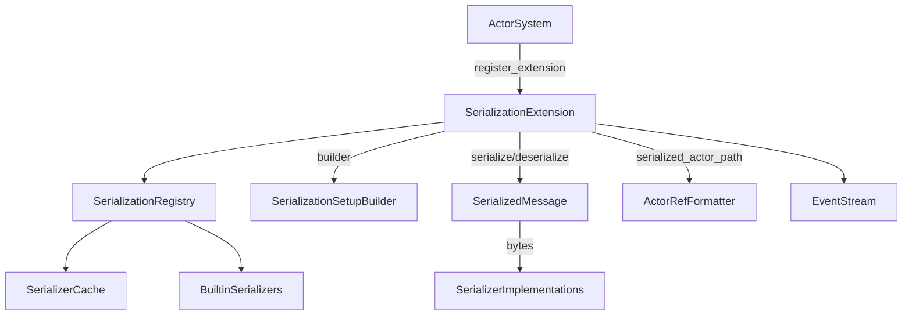
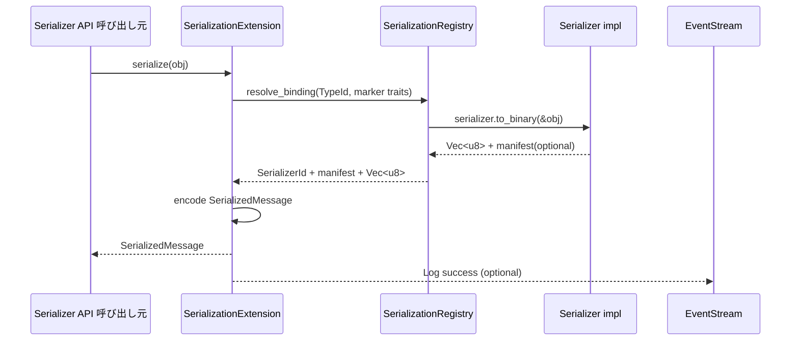
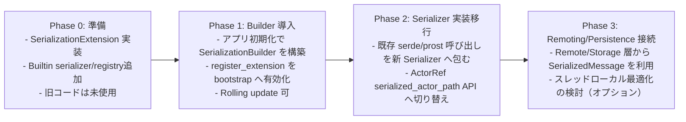

# Serialization Pekko Compatible Redesign — Design

## Overview
cellactor-rs のアクターランタイムへ Pekko 相当のシリアライゼーション層を組み込み、ActorSystem 全体で一貫した識別子・マニフェスト・ActorRef文字列化を扱えるようにする。`SerializationExtension` を中心に、型バインディング DSL、manifest 進化を Rust/no_std 向けに設計し、Rolling Upgrade を阻害しない ID 管理とエラーモデルを提供する。Phase 1 はシンプルな `Vec<u8>` ベース、Phase 3 以降でゼロコピー最適化を検討する。

主な利用者は (1) ランタイム管理者（ActorSystem 起動時のレジストリ確定）、(2) Remoting/Persistence 実装者（manifest 進化）、(3) カスタム Serializer 開発者であり、全員が `programmatic setup builder` のみで構成を完結できる。結果として、現状 `AnyMessage` しか持たないメッセージ経路が `SerializedMessage` を軸に標準フォーマット化され、将来の Remoting/Cluster 拡張の土台となる。

### Goals
- 拡張用 `SerializationExtension` と `SerializationRegistry` を actor-core に追加し、起動順序内で静的ビルダー→外部アダプタ→内蔵デフォルトの優先順位で ID 登録を完了させる。
- Manifest 進化・TypeId/marker trait バインディングを含む `SerializedMessage` 仕様と API を確立する（Phase 1はシンプル実装）。
- ActorRef/ActorPath 文字列化ヘルパーを提供し、リモート情報が不足する場合はローカルパスへフォールバックする（Pekko互換）。

### Non-Goals
- 設定ファイルベースのバインディング（Pekko `serialization-bindings`）は今回対象外。全てプログラム API で完結させる。
- Remoting/Cluster/Persistence 本体の実装やワイヤプロトコルは本設計に含めない。ただし拡張ポイントは用意する。
- Serde ベースの DSL 追加や serde 専用マクロ提供は行わない。serde はオプション依存として連携するに留める。

## Architecture

### Existing Architecture Analysis
- ActorSystem は `Extension`/`ExtensionId` を通じて ArcShared 共有リソースを登録し、`SystemState` が Mutex 付き HashMap で保持する (`modules/actor-core/src/system/base.rs`, `system_state.rs`)。
- メッセージ表現は `AnyMessage`/`AnyMessageView` と `SendError`/`DeadLetter` の組合せのみで、バイト列や manifest を扱う API は存在しない。
- すべてのランタイムコードは `no_std` + `alloc` 前提であり、`ArcShared` と ToolboxMutex で同期を抽象化している。標準依存の Transport 情報は actor-std 側で提供する想定。
- EventStream/DeadLetter/Logging などの診断経路は既に存在するため、シリアライゼーション層はそこへログ/イベントを発行するだけで済む。

### High-Level Architecture


**Architecture Integration**
- 既存パターン: Extension + ArcShared を踏襲し、`SystemStateGeneric::extensions` へ `SerializationExtension` を登録するだけで起動と統合できる。
- 新規コンポーネント: Registry/Builder/BuiltinSerializers を actor-core 内に追加。シンプルな構成で Pekko 互換性を維持。
- 技術整合: Phase 1 は `Vec<u8>` で実装（追加依存不要）。HashMap には `hashbrown` を使用。
- Steering 準拠: 1ファイル1型原則、rustdoc 英語/その他日本語、`#[cfg(feature = "std")]` 禁止を満たす。

### Technology Stack and Design Decisions

#### Technology Alignment
- **Core クレート**: `modules/actor-core` に `serialization/` ディレクトリを新設し、`SerializationExtension`・`SerializationRegistry`・`SerializedMessage` などを配置。`modules/utils-core` には追加不要。
- **Dependencies**: Phase 1 は標準の `Vec<u8>` のみで実装（追加依存不要）。Phase 3 以降でゼロコピー最適化を検討する際に軽量バッファ抽象を追加。
- **Observability**: `EventStreamEvent::Log` と `DeadLetter` を使い、Serializer ID 衝突や manifest 未登録を監査ログに送信する。Pekko同様、ロギングのみで十分。

#### Key Design Decisions
- **Decision**: SerializationExtension を actor-core Extension として実装し、新設クレートではなく既存クレート内に配置する。  
  **Context**: Extension 機構と SystemState の Mutex/ArcShared 管理が actor-core に密結合している。  
  **Alternatives**: (1) `serialization-core` クレートを追加、(2) actor-std 側のみで提供、(3) `utils-core` に汎用機能を置く。  
  **Selected Approach**: actor-core 内に `serialization` モジュールを追加し、Extension/TB/ArcShared を直接利用。  
  **Rationale**: 依存グラフを崩さず最少の crate 増に留め、no_std でも動作する一貫 API を維持できる。  
  **Trade-offs**: 将来 serialization を別クレートへ切り出す際にリファクタが必要。

- **Decision**: ActorRef文字列化は `serialized_actor_path` ヘルパー関数で提供し、内部的にはシンプルなキャッシュで管理する。
  **Context**: Pekkoは`serializedActorPath` 関数と`DynamicVariable[Information]`（ThreadLocal相当）でシンプルに実装している。
  **Alternatives**: (1) 複雑なTransportContextManager、(2) すべてのAPIに引数追加、(3) Serializer実装の責任。
  **Selected Approach**: `SerializationExtension`が`serialized_actor_path(actor_ref)`ヘルパーを提供。Phase 1はシンプルな実装、Phase 3でThreadLocal最適化を検討。
  **Rationale**: Pekko互換でシンプル。no_stdでも動作し、将来の最適化余地を残す。
  **Trade-offs**: Phase 1ではExtension参照が必要だが、Pekko同様の設計。

- **Decision**: `SerializedMessage` を Pekko 互換の `[serializer_id|manifest_flag|manifest|payload_len|payload]` LE フォーマットに固定し、Phase 1 は `Vec<u8>` で実装する。
  **Context**: Requirement 2/4 で Manifest 仕様が示され、Pekko は ID 0-40 を予約し同フォーマットを公開している。[^pekko-serialization]
  **Alternatives**: (1) CBOR/Protobuf へ依存、(2) 手動 `Vec<u8>`、(3) `postcard` など既存フォーマットを流用。
  **Selected Approach**: 内製フォーマットを `SerializedMessage` でラップし、Phase 1 は `Vec<u8>` で実装。Phase 3 以降でゼロコピー最適化を検討。
  **Rationale**: Pekko との互換性を維持しつつ、Phase 1 はシンプルな実装を優先。manifest/serializer id をまとめて保持できる。
  **Trade-offs**: 解析/検証コードを自前実装する必要がある。Phase 1 ではメモリコピーを許容。

## System Flows

### フロー1: serialize 呼び出し


### フロー2: manifest 進化付き deserialize
```mermaid
flowchart TD
  A[SerializedMessage受領] --> B[SerializerRegistry.serializer_by_id]
  B -->|miss| C[FallbackSerializer (AnySerializer)]
  B -->|hit| D[Binding]
  D --> E{manifest種別}
  E -->|String manifest| F[SerializerWithStringManifest::from_binary]
  E -->|manifest不要| G[Serializer::from_binary]
  F -->|Unknown manifest| H[NotSerializableError]
  G --> I[deserialize結果]
  F --> I
```

## Requirements Traceability
| Requirement | Summary | Components | Interfaces | Flows |
|-------------|---------|------------|------------|-------|
| R1.1–1.6 | 起動時レジストリ構築と Builder DSL | `SerializationExtension`, `SerializationRegistry`, `SerializationSetupBuilder` | `register_extension`, `SerializationBuilder::{register_serializer, bind, build}` | Flow1 |
| R2.1–2.4 | Manifest/進化 | `SerializedMessage`, `SerializerWithStringManifest`, `SerializationError::NotSerializable` | `SerializedMessage::{encode,decode}`, `SerializerWithStringManifest::from_binary` | Flow2 |
| R3.1–3.5 | ActorRef 文字列化 | `SerializationExtension` | `serialized_actor_path(actor_ref)` | Flow1 |
| R4.1–4.3 | 組み込みシリアライザ | `BuiltinSerializers`, `ActorRefSerializer` | `Serializer::to_binary`, `Serializer::from_binary` | Flow1 |
| R5.1–5.4 | Serde 依存排除 | `SerializationSetupBuilder`, `SerializerId` | Programmatic DSL のみ | Flow1 |
| R6.1–6.4 | ネスト委譲 | `SerializationExtension` | `serialize`, `deserialize` | Flow1 & Flow2 |

## Components and Interfaces

### Extension Layer
- **SerializationExtension<TB>**
  - 役割: ActorSystem へ登録される Extension。Builder で確定した Registry を保持し、公開 API (`serialize`, `deserialize`, `serialized_actor_path`, `register_binding`) を提供。
  - メソッド概要:
    - `fn new(system: &ActorSystemGeneric<TB>, setup: SerializationSetup<TB>) -> Self`
    - `fn serialize(&self, obj: &(dyn Any + Send + Sync)) -> Result<SerializedMessage, SerializationError>`
    - `fn deserialize(&self, msg: &SerializedMessage, type_hint: Option<TypeId>) -> Result<Box<dyn Any + Send>, SerializationError>`
    - `fn serialized_actor_path(&self, actor_ref: &ActorRefGeneric<TB>) -> Result<String, SerializationError>`
  - 依存: `SerializationRegistry`, `EventStream`.
- **SerializationSetupBuilder**
  - 役割: `register_serializer`, `bind::<Marker>()` などの API をチェーンし、`SerializationSetup` を生成。
  - バリデーション: Serializer ID 重複検出（0–40 は予約エラー[^pekko-reserved]）、Marker trait 未登録など。

### Registry Layer
- **SerializationRegistry**
  - 構造: `ToolboxMutex<HashMap<TypeId, Binding>>` + `ToolboxMutex<HashMap<SerializerId, ArcShared<dyn Serializer>>>` + manifest キャッシュ (`HashMap<String, Option<TypeId>>`)。
  - 機能: TypeId/marker trait/明示バインディング/AnySerializer へ順に問い合わせ、結果をキャッシュ。Serializer 作成は `ArcShared` で共有。
  - API: `serializer_for_type(TypeId)`, `serializer_by_id(SerializerId)`, `register_binding`, `register_serializer`.
  - **Pekko互換**: シンプルなキャッシュのみ。複雑なManifestStrategyは不要。

### Serializer Trait Family
- **Serializer** (rustdoc 英語)
  - `fn identifier(&self) -> SerializerId`
  - `fn include_manifest(&self) -> bool`
  - `fn to_binary(&self, message: &(dyn Any + Send + Sync)) -> Result<Vec<u8>, SerializationError>` (Phase 1: シンプルな Vec<u8>)
  - `fn from_binary(&self, bytes: &[u8], type_hint: Option<TypeId>) -> Result<Box<dyn Any + Send>, SerializationError>`
- **SerializerWithStringManifest** (Pekko互換の命名)
  - `fn manifest(&self, message: &(dyn Any + Send + Sync)) -> Cow<'_, str>`
  - `fn from_binary(&self, bytes: &[u8], manifest: &str) -> Result<Box<dyn Any + Send>, SerializationError>`
  - **Pekko互換**: Pekkoの`SerializerWithStringManifest`と同じ設計。

**スコープアウト（Phase 3以降で検討）**:
- **ByteBufferSerializer**: ゼロコピー最適化（requirements.md 52-53行目でスコープアウト）
- **AsyncSerializer**: 非同期シリアライゼーション（requirements.md 52行目でスコープアウト）

### ActorRef Serialization Support
- **SerializationExtension::serialized_actor_path**
  - 役割: ActorRefを文字列化するヘルパー関数。リモートアドレス情報を考慮し、適切なパス形式を返す。
  - 実装: Pekkoの`Serialization.serializedActorPath`と同じロジック。Phase 1はシンプルな実装、Phase 3でThreadLocal最適化を検討。
  - フォールバック: リモートアドレス情報がない場合はローカルパス (`/user/actor`) を返す。

### Built-in Serializers
- **NullSerializer / PrimitiveSerializers / BytesSerializerImpl / ActorRefSerializer**
  - Requirement 4.4/4.5 を満たす。ActorRefSerializer は `SerializationExtension::serialized_actor_path` を呼び出してActorRefを文字列化。
- **AnySerializer**
  - フォールバックとして `AnyMessage` を `ArcShared` のまま内包し、Unknown type へ fallback する。

### Diagnostics & Admin
- **Logging**
  - Pekko互換: シンプルなログ出力のみ。cache hit/miss、Serializer ID 衝突などは `EventStream` でログレベル（Info/Warning/Error）として記録。
  - **Pekko互換**: 別個のメトリクス構造体は不要。ログのみで十分（Pekko: Serialization.scala:248-252）。
- **Audit Logger**
  - ID 予約域違反や manifest 未登録を監査ログへ流し、ActorSystem 起動を中止。

## Data Models

### Domain Model
- **SerializerId**: `struct SerializerId(u32)`。`try_from(u32)` で 0–40 予約域をチェックし、`RuntimeReserved` エラーを返す。[^pekko-reserved]
- **SerializedMessage**:
  ```rust
  pub struct SerializedMessage {
      pub serializer_id: SerializerId,
      pub manifest: Option<String>,
      pub bytes: Vec<u8>,  // Phase 1: シンプルな Vec<u8>
  }
  ```
  フォーマット: `u32 serializer_id (LE) | u8 has_manifest | [u32 len + manifest]? | u32 payload_len | payload`

  `encode(&self) -> Vec<u8>`、`decode(&[u8]) -> Result<Self, SerializationError::InvalidFormat>`, `fn manifest(&self) -> Option<&str>`.
- **SerializationSetup**: builder が生成する不変構造。`serializers`, `bindings`, `manifest_routes`, `fallback_serializer`.

### Data Contracts & Integration
- **SerializedActorPath**: `protocol://host:port/system@/user/actor` 形式に統一。リモート情報不足時は `local:///user/actor` とし、Remoting レイヤが解決する。
- **Error Payload**: `NotSerializableError` は `type_name`, `serializer_id`, `manifest`, `pid` を含む構造体を DeadLetter/Log に流す。

## Error Handling

### Error Strategy
- キャッシュ/Registry エラーは `SerializationError::Registry` として復旧可能扱い。Serializer 実装からの `NotSerializable`/`UnknownManifest` は呼び出し元へ伝搬。
- SerializedMessage decode 失敗は `InvalidFormat` で `EventStream::Log(LogLevel::Error, ...)` に出力し、Remoting は再試行を判断できる。

### Error Categories and Responses
- **User errors (4xx 相当)**: 未登録 marker / Builder misuse → `BuilderError::DuplicateId`, `BuilderError::MarkerUnbound`。ログ WARNING。
- **System errors (5xx 相当)**: Serializer 実装 panic → EventStream/DeadLetter へ ERROR。Remoting/Persistence はリトライ判断に利用。
- **Business logic errors (422)**: Manifest 互換失敗 → `SerializationError::UnknownManifest(manifest)`。シンプルなキャッシュで順次試行し、全滅時に詳細付きエラーを返す。

### Monitoring
- **Pekko互換**: シンプルなログ出力のみ。cache hit/miss、ID衝突、manifest未登録などは `EventStream` 経由でログとして記録。ログタグ `serialization` で集約。

## Testing Strategy
- **Unit**
  1. SerializerId 検証: 0–40 予約域拒否、u32→SerializableId 変換。
  2. SerializedMessage encode/decode round-trip（manifest 有無/UTF-8/バイナリ）
  3. SerializationRegistry TypeId → Serializer 解決とキャッシュ挙動。
  4. Manifest キャッシュと UnknownManifest エラー。
  5. `serialized_actor_path` ヘルパー関数のローカル/リモートパス生成。
- **Integration**
  1. ActorSystem bootstrap 時の Builder 適用と ID 衝突検知（`register_extension` 経路）
  2. ActorRefSerializer: `serialized_actor_path` を使った文字列化が Remoting 形式になること。
  3. ネスト委譲: カスタム Serializer が `Serialization::serialize` を呼び、Manifest が継承されること。
  4. DeadLetter 経由エラーパス: NotSerializableError が EventStream/DeadLetter へ送られる。
- **Performance / Load**
  - Registry キャッシュヒット率 95% 以上を目標にヒット/ミス統計を計測。

## Security Considerations
- 受信した `SerializedMessage` の manifest / payload 長を上限チェックし、DoS を防ぐ。`payload_len` > `MAX_PAYLOAD` (設定) の場合はエラー。
- Deserializer が不正 manifest を受けた場合 `NotSerializable` を返し接続を維持（Pekko と同方針）。
- `serialized_actor_path` でホスト/ポートをバリデーションし、未許可スキームは拒否。
- Serde など外部依存へ生のバイト列を渡す際は型境界を enforce し、Unsafe を禁止。

## Performance & Scalability
- **Phase 1 (シンプル実装)**: `Vec<u8>` バッファでシンプルに実装。メモリコピーを許容して実装をシンプルに保つ。
- **Registry キャッシュ**: シンプルな `HashMap<TypeId, SerializerId>` でキャッシュ。Pekko互換の軽量実装（複雑な RCU 不要）。
- **Phase 3 以降 (最適化検討)**:
  - パフォーマンス計測の結果、本当にボトルネックであれば `ByteBufferSerializer` による軽量なゼロコピー経路を検討。
  - no_std 対応の軽量バッファ抽象（BufMut トレイト）を実装。

## Migration Strategy

- **Rollback**: 各フェーズで `SerializationExtension` を未登録に戻せば旧コードが継続。SerializedMessage は `AnySerializer` fallback があるため互換性を維持。

---
[^pekko-serialization]: Apache Pekko Serialization documentation (2025-11-04 crawl).  
[^pekko-reserved]: Apache Pekko Serializer identifier guidance — identifiers 0–40 reserved (2025-11-04 crawl).
